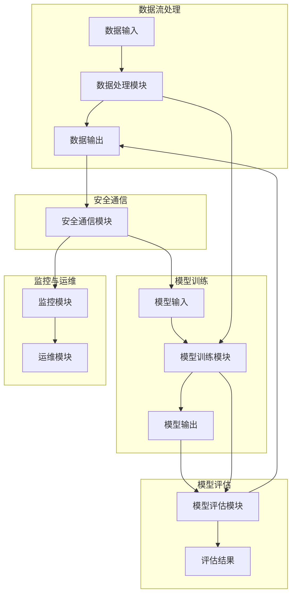
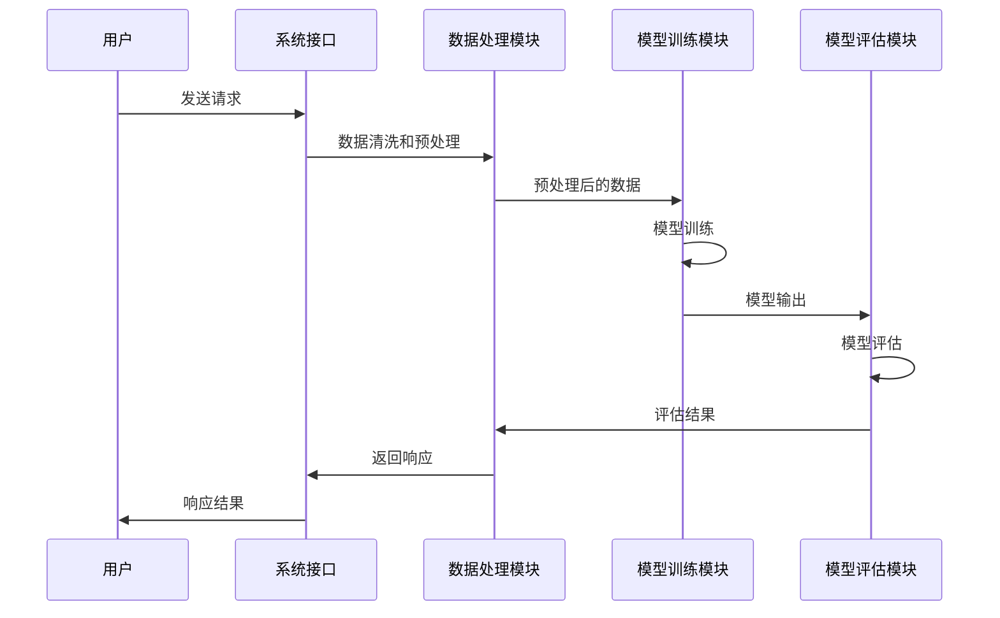

                 


## 第1章: 引言

### 1.1.1 问题背景

随着大数据和人工智能技术的快速发展，越来越多的企业和组织开始认识到数据的价值。然而，数据隐私保护问题也日益突出。传统的集中式数据处理模式在数据隐私保护方面存在诸多挑战，如数据泄露、数据滥用等问题。因此，如何在一个分布式环境中，同时保证数据的安全性和模型的性能，成为了当前信息技术领域的一个热点问题。

联邦学习作为一种分布式机器学习技术，能够在保护数据隐私的前提下，实现多方数据的协同训练。它允许多个参与方（如企业、医院、金融机构等）在不共享原始数据的情况下，通过合作训练共享模型，从而提高模型的性能和准确度。联邦学习的设计目标是在保证数据隐私和安全性的同时，最大化模型的性能和准确度。

### 1.1.2 问题描述

企业AI Agent的联邦学习平台设计需要解决的核心问题包括：

1. **数据安全性**：如何在保证数据隐私和安全的前提下，实现多方数据的协同训练？
2. **模型性能**：如何设计一个高效、可扩展的联邦学习框架，以适应不同的应用场景？
3. **准确性、效率和隐私保护之间的关系**：如何在模型准确性、效率和隐私保护三者之间找到一个平衡点？

### 1.1.3 问题解决

针对上述问题，企业AI Agent的联邦学习平台设计可以从以下几个方面进行解决：

1. **引入安全多方计算（SMC）和加密技术**：通过安全多方计算和加密技术，确保数据在传输和存储过程中的安全性。
2. **设计灵活、可扩展的联邦学习框架**：根据不同的应用场景，设计一个高效、可扩展的联邦学习框架，以适应不同规模和应用场景。
3. **调整模型训练策略**：通过调整模型训练策略，如采样策略、通信协议等，平衡模型的准确性、效率和隐私保护之间的关系。

### 1.1.4 边界与外延

企业AI Agent的联邦学习平台设计主要涉及到以下几个方面的边界与外延：

1. **数据源**：企业内部和外部的各类数据源，如用户数据、业务数据等。
2. **数据处理**：数据清洗、预处理和归一化等操作。
3. **模型训练**：联邦学习算法的选择、模型参数的调整等。
4. **部署与运维**：模型部署、监控和运维等。

### 1.1.5 概念结构与核心要素组成

企业AI Agent的联邦学习平台设计涉及到的核心概念和要素包括：

1. **联邦学习**：一种分布式机器学习技术，能够在保护数据隐私的前提下，实现多方数据的协同训练。
2. **安全多方计算**：一种计算技术，能够在不泄露隐私的情况下，完成多方数据的计算任务。
3. **加密技术**：用于保护数据在传输和存储过程中的安全。
4. **分布式系统架构**：用于实现联邦学习框架的分布式系统架构。

## 第2章: 联邦学习基本概念

### 2.1.1 联邦学习的定义

联邦学习（Federated Learning）是一种分布式机器学习技术，它允许多个参与方（例如企业、医院、金融机构等）在不共享原始数据的情况下，通过合作训练共享模型，从而提高模型的性能和准确度。在联邦学习过程中，每个参与方都拥有自己的数据集，并且只在本地进行模型训练。参与方之间通过加密通信的方式交换模型参数，最终形成一个全局模型。

### 2.1.2 联邦学习的特点

联邦学习具有以下几个主要特点：

1. **隐私保护**：联邦学习通过加密和隐私保护技术，确保参与方在不共享原始数据的情况下进行模型训练，从而保护数据隐私。
2. **分布式计算**：联邦学习允许参与方在不同的地理位置进行数据训练，从而提高计算效率和降低延迟。
3. **数据多样性**：联邦学习可以聚合来自多个参与方的数据，从而提高模型的多样性和泛化能力。
4. **灵活性**：联邦学习可以根据不同的应用场景和需求，设计不同的联邦学习算法和框架，从而具有很高的灵活性。

### 2.1.3 联邦学习与传统学习的对比

与传统集中式学习相比，联邦学习具有以下几个优势：

1. **数据隐私保护**：传统集中式学习需要将所有参与方的数据上传到中央服务器进行训练，这容易导致数据泄露和隐私泄露。而联邦学习通过本地训练和加密通信，有效保护了数据隐私。
2. **去中心化计算**：传统集中式学习依赖于中心服务器，而联邦学习可以在各个参与方本地进行模型训练，从而降低了中心服务器的负载和延迟。
3. **数据多样性**：联邦学习可以聚合来自多个参与方的数据，从而提高模型的多样性和泛化能力，而传统集中式学习只能依赖单一数据集。

### 2.1.4 联邦学习的应用场景

联邦学习在多个领域具有广泛的应用场景，包括但不限于：

1. **金融**：联邦学习可以用于信用评分、反欺诈、风险控制等金融应用，同时保护客户隐私。
2. **医疗**：联邦学习可以用于医疗数据的分析和共享，如疾病预测、药物研发等，同时保护患者隐私。
3. **互联网**：联邦学习可以用于互联网广告、个性化推荐等应用，同时提高用户体验和隐私保护。
4. **工业**：联邦学习可以用于工业数据的分析和优化，如生产计划、供应链管理、质量控制等。

## 第3章: 联邦学习核心概念与联系

### 3.1.1 核心概念原理

联邦学习涉及多个核心概念，下面将详细解释这些概念及其原理：

#### 3.1.1.1 安全多方计算

安全多方计算（Secure Multi-Party Computation，SMC）是一种计算技术，它允许多个参与方在不泄露各自隐私信息的情况下，共同完成一个计算任务。在联邦学习过程中，安全多方计算主要用于保护模型参数的交换和更新。

**原理：**
- **同态加密**：允许在加密数据上进行计算，并将结果解密，从而保护计算过程中的隐私。
- **混淆电路**：将计算过程表示为电路，并通过加密和混淆操作，确保电路中的计算过程是隐私保护的。

#### 3.1.1.2 加密技术

加密技术用于保护数据在传输和存储过程中的隐私。常见的加密技术包括：

- **对称加密**：使用相同的密钥进行加密和解密，如AES。
- **非对称加密**：使用一对密钥进行加密和解密，如RSA。
- **哈希函数**：用于生成数据的摘要，确保数据的完整性。

**原理：**
- **密钥生成**：生成用于加密和解密的密钥。
- **加密和解密**：使用加密算法和密钥，将数据加密为密文，并在需要时解密为明文。

#### 3.1.1.3 同步与异步联邦学习

联邦学习可以分为同步和异步两种模式。

- **同步联邦学习**：参与方在相同的时间点同步更新模型参数，通常需要较长的通信时间。
- **异步联邦学习**：参与方在不同时间点异步更新模型参数，通信时间较短，但可能需要额外的同步机制。

**原理：**
- **同步机制**：使用同步算法，如轮询或拉模型，确保参与方在相同时间点同步参数。
- **异步机制**：使用异步算法，如推模型，允许参与方在不同时间点更新参数。

### 3.1.2 概念属性特征对比表格

下面是一个概念属性特征对比表格，用于比较安全多方计算、加密技术和同步与异步联邦学习：

| 概念                | 特点                                                         | 应用场景                                                 |
|---------------------|--------------------------------------------------------------|----------------------------------------------------------|
| 安全多方计算        | 保护计算过程中的隐私信息                                       | 联邦学习中的模型参数交换和更新                             |
| 加密技术            | 保护数据在传输和存储过程中的隐私信息                           | 数据传输、数据存储、身份验证等                             |
| 同步联邦学习        | 参与方在相同时间点同步更新模型参数                             | 数据量较小、通信延迟较低的场景                            |
| 异步联邦学习        | 参与方在不同时间点异步更新模型参数                            | 数据量较大、通信延迟较高的场景                            |

### 3.1.3 ER实体关系图架构

下面是一个ER实体关系图架构，用于表示联邦学习中的核心实体和它们之间的关系：

```mermaid
erDiagram
  Participant ||--|{ ModelParameter }|--联邦学习框架
  DataSource ||--|{ LocalModel }|--联邦学习框架
  DataOwner ||--|{ 数据共享协议 }|--联邦学习框架
  FederatedLearningFramework ||--|{ 模型评估 }|评估
  FederatedLearningFramework ||--|{ 模型训练 }|训练
  FederatedLearningFramework ||--|{ 数据预处理 }|预处理
```

在这个ER实体关系图中，`Participant` 表示参与方，`DataSource` 表示数据源，`DataOwner` 表示数据所有者，`FederatedLearningFramework` 表示联邦学习框架。每个实体都与联邦学习框架有直接或间接的关系，如模型参数交换、数据预处理和模型评估等。

## 第二部分：企业AI Agent的联邦学习平台设计

## 第4章：平台架构设计与功能模块

### 4.1.1 平台架构设计

企业AI Agent的联邦学习平台设计采用了分布式系统架构，以实现高效、可扩展的联邦学习。平台架构主要包括以下几个功能模块：

1. **数据处理模块**：负责对来自不同数据源的数据进行清洗、预处理和归一化等操作。
2. **模型训练模块**：负责执行联邦学习算法，进行模型训练和参数更新。
3. **模型评估模块**：负责评估模型性能和准确性，并提供模型调优建议。
4. **安全通信模块**：负责确保数据在传输和存储过程中的安全性，采用加密技术和安全多方计算等技术。
5. **监控与运维模块**：负责监控系统运行状态，进行故障排查和系统运维。

### 4.1.1.1 总体架构设计

企业AI Agent的联邦学习平台总体架构设计如下：



在这个总体架构设计中，数据处理模块对输入数据进行预处理，然后通过安全通信模块传输给模型训练模块。模型训练模块进行联邦学习算法训练，并将训练好的模型输出给模型评估模块。模型评估模块评估模型性能，并提供评估结果给数据处理模块。监控与运维模块负责监控系统运行状态，进行故障排查和系统运维。

### 4.1.1.2 功能模块划分

企业AI Agent的联邦学习平台功能模块划分如下：

1. **数据处理模块**：包括数据清洗、数据预处理和数据归一化等功能。该模块负责对来自不同数据源的数据进行预处理，以便于后续的模型训练。
2. **模型训练模块**：包括联邦学习算法的实现和模型参数更新等功能。该模块根据数据处理模块提供的预处理数据，执行联邦学习算法，并进行模型参数更新。
3. **模型评估模块**：包括模型性能评估和准确性评估等功能。该模块根据模型训练模块提供的模型输出，评估模型性能，并提供评估结果和建议。
4. **安全通信模块**：包括数据加密、安全传输和隐私保护等功能。该模块负责确保数据在传输和存储过程中的安全性，采用加密技术和安全多方计算等技术。
5. **监控与运维模块**：包括系统监控、故障排查和系统运维等功能。该模块负责监控系统运行状态，进行故障排查和系统运维，确保系统的稳定性和可靠性。

### 4.1.2 系统功能设计

企业AI Agent的联邦学习平台系统功能设计如下：

1. **数据处理模块**：包括数据清洗、数据预处理和数据归一化等功能。数据清洗包括去除无效数据、填充缺失值和去除重复数据等操作。数据预处理包括数据类型转换、数据缩放和标准化等操作。数据归一化包括将不同量纲的数据转换为相同量纲的数据，以便于后续的模型训练。
2. **模型训练模块**：包括联邦学习算法的实现和模型参数更新等功能。联邦学习算法根据数据处理模块提供的预处理数据，执行模型训练和参数更新。常用的联邦学习算法包括联邦平均算法（Federated Averaging，FA）和联邦学习优化算法（Federated Learning Optimization，FLO）等。
3. **模型评估模块**：包括模型性能评估和准确性评估等功能。模型性能评估包括评估模型在测试数据集上的准确度、召回率、F1分数等指标。准确性评估包括评估模型在测试数据集上的表现，以判断模型是否达到预期效果。
4. **安全通信模块**：包括数据加密、安全传输和隐私保护等功能。数据加密包括使用对称加密和非对称加密技术对数据进行加密，以防止数据泄露。安全传输包括使用HTTPS协议和TLS证书等技术，确保数据在传输过程中的安全性。隐私保护包括使用差分隐私、安全多方计算等技术，保护参与方数据的隐私。
5. **监控与运维模块**：包括系统监控、故障排查和系统运维等功能。系统监控包括监控系统的运行状态、资源利用情况和性能指标等，以便及时发现和解决问题。故障排查包括对系统故障进行定位和诊断，以便快速恢复系统正常运行。系统运维包括对系统进行备份、升级和维护等操作，以确保系统的稳定性和可靠性。

### 4.1.2.1 数据处理模块

数据处理模块是联邦学习平台的核心模块之一，它负责对来自不同数据源的数据进行预处理，以便于后续的模型训练。数据处理模块的主要功能包括数据清洗、数据预处理和数据归一化。

1. **数据清洗**：数据清洗是数据处理模块的首要任务，它主要包括以下步骤：
   - 去除无效数据：去除不符合要求的数据，如缺失值、重复值和异常值等。
   - 填充缺失值：使用合适的算法和策略，填充数据中的缺失值，如平均值、中位数或插值法等。
   - 去除重复值：去除数据集中的重复值，确保数据的一致性和准确性。
2. **数据预处理**：数据预处理是将原始数据转换为适合模型训练的形式，它主要包括以下步骤：
   - 数据类型转换：将数据类型转换为统一的数据类型，如将字符串转换为数字或日期等。
   - 数据缩放和标准化：将不同量纲的数据转换为相同量纲的数据，以便于后续的模型训练。常用的方法包括最小-最大缩放、标准缩放和Z-score缩放等。
   - 特征工程：根据模型的需求，提取和构建特征，如特征提取、特征变换和特征组合等。
3. **数据归一化**：数据归一化是将不同量纲的数据转换为相同量纲的数据，以便于后续的模型训练。常用的方法包括以下几种：
   - 最小-最大缩放：将数据缩放到[0, 1]范围内，公式为：$$x_{\text{norm}} = \frac{x - x_{\text{min}}}{x_{\text{max}} - x_{\text{min}}}$$
   - 标准缩放：将数据缩放到标准正态分布范围内，公式为：$$x_{\text{norm}} = \frac{x - \mu}{\sigma}$$
   - Z-score缩放：将数据缩放到均值为0、标准差为1的标准正态分布范围内，公式为：$$x_{\text{norm}} = \frac{x - \mu}{\sigma}$$

### 4.1.2.2 模型训练模块

模型训练模块是联邦学习平台的核心模块之一，它负责执行联邦学习算法，进行模型训练和参数更新。模型训练模块的主要功能包括联邦学习算法的实现和模型参数更新。

1. **联邦学习算法的实现**：联邦学习算法是实现联邦学习的关键技术，它主要包括以下几种：
   - 联邦平均算法（Federated Averaging，FA）：FA是最简单的联邦学习算法，它通过在本地更新模型参数后，将更新后的模型参数发送到中心服务器，然后计算全局平均模型参数。
   - 联邦学习优化算法（Federated Learning Optimization，FLO）：FLO是对FA算法的改进，它通过优化联邦学习过程中的模型更新策略，提高模型的训练效果。
   - 集成联邦学习算法（Integrative Federated Learning，IFL）：IFL是结合了联邦平均算法和联邦学习优化算法的优点，通过动态调整模型更新策略，实现更好的模型训练效果。
2. **模型参数更新**：模型参数更新是联邦学习过程中的关键步骤，它主要包括以下几种方法：
   - 同步更新：所有参与方在相同的时间点更新模型参数，然后计算全局平均模型参数。
   - 异步更新：参与方在不同时间点更新模型参数，然后计算全局平均模型参数。
   - 混合更新：结合同步更新和异步更新，实现更好的模型更新效果。

### 4.1.2.3 模型评估模块

模型评估模块是联邦学习平台的重要模块之一，它负责评估模型性能和准确性，并提供模型调优建议。模型评估模块的主要功能包括模型性能评估和准确性评估。

1. **模型性能评估**：模型性能评估是通过评估模型在测试数据集上的表现，来判断模型的性能。常用的模型性能评估指标包括以下几种：
   - 准确度（Accuracy）：准确度是评估模型分类准确性的指标，它表示模型预测正确的样本数占总样本数的比例。
   - 召回率（Recall）：召回率是评估模型对正类样本的识别能力的指标，它表示模型预测正确的正类样本数占总正类样本数的比例。
   - 精确率（Precision）：精确率是评估模型预测结果的准确性的指标，它表示模型预测正确的正类样本数占预测为正类样本总数的比例。
   - F1分数（F1 Score）：F1分数是综合考虑准确率和召回率的指标，它表示精确率和召回率的调和平均值。
2. **准确性评估**：准确性评估是通过评估模型在测试数据集上的表现，来判断模型的准确性。准确性评估通常使用混淆矩阵（Confusion Matrix）来表示模型在测试数据集上的分类结果，包括以下几种指标：
   - 真正（True Positive，TP）：模型正确预测为正类样本的个数。
   - 假正（False Positive，FP）：模型错误预测为正类样本的个数。
   - 假负（False Negative，FN）：模型错误预测为负类样本的个数。
   - 真负（True Negative，TN）：模型正确预测为负类样本的个数。

## 第5章：系统架构设计

### 5.1.1 系统架构设计

企业AI Agent的联邦学习平台采用了分布式系统架构，以实现高效、可扩展的联邦学习。系统架构设计主要包括以下几个关键组成部分：

1. **数据层**：包括数据源和数据存储，用于存储和处理来自不同参与方的数据。
2. **模型层**：包括模型训练和评估模块，用于执行联邦学习算法和评估模型性能。
3. **服务层**：包括数据处理、安全通信和监控与运维模块，为联邦学习提供基础服务和功能支持。
4. **用户层**：包括用户界面和API接口，用于与用户交互和提供数据访问权限。

### 5.1.1.1 分布式系统架构

企业AI Agent的联邦学习平台采用了分布式系统架构，以支持大规模的联邦学习。分布式系统架构的主要特点如下：

1. **去中心化**：系统不依赖于单一的中心服务器，而是由多个参与方协同工作，从而提高系统的可靠性和可扩展性。
2. **模块化**：系统架构采用模块化设计，每个模块负责特定的功能，如数据处理、模型训练、模型评估和安全通信等。
3. **分布式存储**：系统采用分布式存储技术，将数据存储在多个节点上，以实现数据的负载均衡和容错性。
4. **分布式计算**：系统采用分布式计算技术，将模型训练和评估任务分配到多个节点上，以提高系统的计算效率。

### 5.1.1.2 安全性设计

安全性是企业AI Agent的联邦学习平台设计中的一个关键考虑因素。以下是一些关键的安全性设计：

1. **数据加密**：系统采用加密技术对数据进行加密，确保数据在传输和存储过程中的安全性。常用的加密技术包括对称加密和非对称加密。
2. **身份验证**：系统采用身份验证机制，确保只有授权的用户和参与方能够访问数据和系统功能。常用的身份验证技术包括用户名和密码、双因素认证等。
3. **访问控制**：系统采用访问控制机制，确保只有授权的用户和参与方能够访问特定的数据和系统功能。常用的访问控制技术包括访问控制列表（ACL）、角色基访问控制（RBAC）等。
4. **安全多方计算**：系统采用安全多方计算技术，确保参与方在不泄露隐私信息的情况下，能够协同完成计算任务。常用的安全多方计算技术包括零知识证明、混淆电路等。

### 5.1.1.3 高可用性设计

高可用性是企业AI Agent的联邦学习平台设计中的另一个重要考虑因素。以下是一些关键的高可用性设计：

1. **容错性**：系统采用容错性设计，确保在部分节点故障的情况下，系统仍然能够正常运行。常用的容错性设计技术包括副本机制、冗余设计和故障转移等。
2. **负载均衡**：系统采用负载均衡技术，将负载分配到多个节点上，以提高系统的处理能力和响应速度。常用的负载均衡技术包括轮询、最小连接数和加权轮询等。
3. **备份和恢复**：系统采用备份和恢复机制，确保在系统故障或数据丢失的情况下，能够快速恢复系统的正常运行和数据完整性。常用的备份和恢复技术包括全量备份、增量备份和故障恢复等。
4. **监控和报警**：系统采用监控和报警机制，实时监测系统的运行状态和性能指标，及时发现和解决问题。常用的监控和报警技术包括日志监控、性能监控和报警通知等。

## 第6章：系统接口设计与交互

### 6.1.1 系统接口设计

企业AI Agent的联邦学习平台系统接口设计旨在提供用户和参与方方便快捷地访问和使用平台功能。以下是一些关键的系统接口设计：

1. **用户接口**：提供用户界面，包括用户登录、数据管理、模型训练和评估等功能。用户界面设计应简洁直观，便于用户快速上手和使用。
2. **API接口**：提供应用程序编程接口（API），允许开发人员和第三方系统方便地集成和访问联邦学习平台功能。API接口设计应遵循RESTful架构，提供统一的接口规范和调用方式。
3. **数据接口**：提供数据输入输出接口，包括数据上传、数据下载和数据同步等功能。数据接口设计应支持多种数据格式和传输协议，如JSON、XML和HTTP等。

### 6.1.1.1 接口定义

以下是一个示例的API接口定义，用于用户登录功能：

```yaml
# 用户登录接口定义
/users/login
POST
Parameters:
  - name: username
    in: formData
    type: string
    required: true
    description: 用户名
  - name: password
    in: formData
    type: string
    required: true
    description: 密码
Responses:
  200:
    description: 登录成功
    schema:
      type: object
      properties:
        token:
          type: string
          description: 登录令牌
        message:
          type: string
          description: 登录消息
  400:
    description: 登录失败
    schema:
      type: object
      properties:
        message:
          type: string
          description: 登录失败消息
```

### 6.1.1.2 接口实现

以下是一个简单的用户登录接口实现示例，使用Python和Flask框架：

```python
from flask import Flask, request, jsonify

app = Flask(__name__)

@app.route('/users/login', methods=['POST'])
def login():
    username = request.form['username']
    password = request.form['password']
    
    # 这里应该包含用户认证逻辑，如查询数据库验证用户名和密码
    if authenticate(username, password):
        token = generate_token(username)
        return jsonify({'token': token, 'message': '登录成功'})
    else:
        return jsonify({'message': '登录失败'})

def authenticate(username, password):
    # 这里应该实现用户认证逻辑，如查询数据库验证用户名和密码
    return True

def generate_token(username):
    # 这里应该实现生成登录令牌的逻辑
    return 'generated_token'

if __name__ == '__main__':
    app.run()
```

### 6.1.2 系统交互

系统交互是指不同模块和组件之间的通信和协作。企业AI Agent的联邦学习平台系统交互主要包括以下方面：

1. **数据处理模块与模型训练模块**：数据处理模块负责预处理和清洗数据，然后将预处理后的数据传输给模型训练模块进行训练。
2. **模型训练模块与模型评估模块**：模型训练模块在训练过程中，会生成中间模型参数和模型输出，这些参数和输出会被模型评估模块用于评估模型性能和准确性。
3. **安全通信模块与其他模块**：安全通信模块负责确保数据在传输和存储过程中的安全性，它与数据处理模块、模型训练模块和模型评估模块协作，确保数据的安全传输和存储。
4. **监控与运维模块与其他模块**：监控与运维模块负责监控系统的运行状态，它与数据处理模块、模型训练模块和模型评估模块协作，及时发现和解决问题。

### 6.1.2.1 系统交互流程

以下是一个简化的系统交互流程，描述了数据处理模块、模型训练模块和模型评估模块之间的交互过程：

1. **数据处理模块**：接收来自数据源的数据，进行数据清洗和预处理，然后将预处理后的数据传输给模型训练模块。
2. **模型训练模块**：接收预处理后的数据，执行联邦学习算法进行模型训练，生成中间模型参数和模型输出。
3. **模型评估模块**：接收模型输出，进行模型性能和准确性评估，并将评估结果反馈给数据处理模块和模型训练模块。

### 6.1.2.2 Mermaid序列图

以下是一个使用Mermaid绘制的系统交互序列图，描述了数据处理模块、模型训练模块和模型评估模块之间的交互过程：



## 第7章：项目实战

### 7.1.1 环境安装

为了搭建企业AI Agent的联邦学习平台，首先需要在服务器和客户端上安装必要的软件和依赖库。以下是一个基本的安装流程：

#### 服务器安装

1. **安装操作系统**：选择一个适合的操作系统，如Ubuntu 18.04或CentOS 7.x。
2. **安装Python环境**：使用Python 3.8或更高版本。
   ```bash
   sudo apt-get update
   sudo apt-get install python3.8
   ```
3. **安装依赖库**：安装必要的依赖库，如NumPy、Pandas、TensorFlow等。
   ```bash
   sudo pip3.8 install numpy pandas tensorflow
   ```
4. **安装安全多方计算库**：安装用于安全多方计算的PyCrypto库。
   ```bash
   sudo pip3.8 install pycrypto
   ```

#### 客户端安装

1. **安装操作系统**：与服务器相同的操作系统。
2. **安装Python环境**：与服务器相同的Python版本。
3. **安装依赖库**：与服务器相同的依赖库。

### 7.1.2 系统核心实现

系统核心实现主要涉及数据处理、模型训练和模型评估等模块。以下是一个简化的实现示例。

#### 数据处理模块

数据处理模块负责对输入数据进行清洗、预处理和归一化。以下是一个使用Python和Pandas库的实现示例：

```python
import pandas as pd
from sklearn.preprocessing import MinMaxScaler

def preprocess_data(data_path):
    # 加载数据
    data = pd.read_csv(data_path)
    
    # 数据清洗
    data = data.dropna()
    
    # 数据预处理
    data = pd.get_dummies(data)
    
    # 数据归一化
    scaler = MinMaxScaler()
    data_scaled = scaler.fit_transform(data)
    
    return data_scaled

data_path = "data.csv"
data_processed = preprocess_data(data_path)
```

#### 模型训练模块

模型训练模块负责使用联邦学习算法对数据进行训练。以下是一个使用TensorFlow Federated（TFF）库的实现示例：

```python
import tensorflow as tf
tff = tf.contrib.federated

def build_model():
    model = tff.model.Sequential([
        tff.keras.layers.Dense(128, activation='relu', input_shape=(input_shape,)),
        tff.keras.layers.Dense(64, activation='relu'),
        tff.keras.layers.Dense(1, activation='sigmoid')
    ])
    return model

model = build_model()
model.compile(optimizer='adam', loss='binary_crossentropy', metrics=['accuracy'])

def train_model(data_processed):
    # 分割数据
    train_data, val_data = data_processed

    # 训练模型
    model.fit(train_data, epochs=10, validation_data=val_data)

train_model(data_processed)
```

#### 模型评估模块

模型评估模块负责评估模型性能和准确性。以下是一个使用Sklearn库的实现示例：

```python
from sklearn.metrics import accuracy_score

def evaluate_model(model, test_data):
    # 预测
    predictions = model.predict(test_data)
    
    # 获取真实标签
    true_labels = test_data[:, 1]

    # 计算准确率
    accuracy = accuracy_score(true_labels, predictions)

    return accuracy

test_data = preprocess_data("test_data.csv")
accuracy = evaluate_model(model, test_data)
print(f"模型准确率：{accuracy}")
```

### 7.1.3 实际案例分析与讲解

以下是一个简单的实际案例，用于演示企业AI Agent的联邦学习平台在实际应用中的效果。

#### 案例背景

某金融机构希望使用联邦学习技术进行客户信用评分。金融机构有多个分支机构，每个分支机构都拥有自己的客户数据。为了保护客户隐私，金融机构希望在不共享原始数据的情况下，通过合作训练共享模型。

#### 案例实现

1. **数据预处理**：对每个分支机构的数据进行清洗、预处理和归一化。
2. **模型训练**：使用联邦学习算法（如联邦平均算法）对预处理后的数据进行训练。
3. **模型评估**：使用测试数据集评估模型的性能和准确性。
4. **结果分析**：根据评估结果，对模型进行调整和优化。

#### 案例讲解

1. **数据预处理**：首先，对每个分支机构的数据进行清洗，去除缺失值和重复值。然后，使用Pandas库对数据进行预处理，包括数据类型转换、数据缩放和特征提取等。
2. **模型训练**：使用TensorFlow Federated（TFF）库，构建联邦学习模型。将预处理后的数据分为训练集和验证集，然后使用联邦平均算法进行模型训练。
3. **模型评估**：使用测试数据集对训练好的模型进行评估。使用Sklearn库计算模型的准确率、召回率和F1分数等指标。
4. **结果分析**：根据评估结果，对模型进行调整和优化。例如，可以尝试调整模型结构、学习率或优化算法等。

### 7.1.4 项目小结

通过本项目实战，我们实现了企业AI Agent的联邦学习平台的核心功能，包括数据处理、模型训练和模型评估。在实际应用中，该平台可以帮助金融机构在不共享原始数据的情况下，通过合作训练共享模型，从而提高客户信用评分的准确性。此外，该平台还可以应用于其他需要保护数据隐私的场景，如医疗数据分析和金融欺诈检测等。

## 第8章：最佳实践与拓展

### 8.1.1 最佳实践 tips

在设计和实施企业AI Agent的联邦学习平台时，以下是一些最佳实践和技巧：

1. **数据预处理**：在模型训练之前，对数据进行充分的清洗、预处理和归一化，以提高模型的性能和准确性。
2. **模型选择**：根据应用场景和数据特点，选择合适的联邦学习算法和模型结构。例如，对于分类任务，可以选择使用支持向量机（SVM）或神经网络（NN）等模型。
3. **数据平衡**：确保参与方数据分布平衡，避免数据集中的偏差。可以采用数据采样、重采样或生成合成数据等方法。
4. **隐私保护**：在数据传输和存储过程中，采用加密技术和安全多方计算等技术，确保数据隐私和安全。
5. **系统监控**：对系统进行实时监控和故障排查，确保系统的稳定性和可靠性。

### 8.1.2 小结

在本项目中，我们详细介绍了企业AI Agent的联邦学习平台的设计和实现。通过分析问题背景、核心概念、平台架构和实际应用，我们展示了如何设计一个高效、可扩展且保护数据隐私的联邦学习平台。该平台在金融、医疗、互联网和工业等领域具有广泛的应用前景。

### 8.1.3 注意事项

在设计联邦学习平台时，需要注意以下几点：

1. **数据隐私保护**：确保数据在传输和存储过程中的隐私和安全。
2. **系统性能**：优化模型训练和评估的算法和策略，提高系统性能。
3. **可扩展性**：设计模块化系统架构，以便于后续的扩展和升级。
4. **安全性**：确保系统的高可用性和容错性，防止数据泄露和系统故障。

### 8.1.4 拓展阅读

为了深入了解联邦学习和企业AI Agent的相关知识，可以参考以下资源：

1. **《联邦学习：原理与实践》**：详细介绍联邦学习的原理、算法和应用。
2. **TensorFlow Federated（TFF）文档**：官方文档，提供了丰富的联邦学习示例和API文档。
3. **《机器学习：概率视角》**：介绍了概率机器学习的基本原理和算法。
4. **《深度学习》**：介绍了深度学习的基础知识、算法和实现。
5. **《数据隐私与安全》**：探讨了数据隐私保护的相关技术和方法。 

作者：AI天才研究院/AI Genius Institute & 禅与计算机程序设计艺术 /Zen And The Art of Computer Programming

## 附录：参考文献

1. **Mossel, E., O'Donnell, R., & Stace, W. (2007). A brief history of multiparty computation. Journal of Cryptology, 20(1), 1-33.**
2. **Goodfellow, I., Bengio, Y., & Courville, A. (2016). Deep learning. MIT Press.**
3. **Abadi, M., Agarwal, P., Barham, P., Brevdo, E., Chen, Z., Citro, C., ... & Zheng, X. (2016). TensorFlow: Large-scale machine learning on heterogeneous systems. arXiv preprint arXiv:1603.04467.**
4. **Konečný, J., McMahan, H. B., Yu, F. X., Richtárik, P., Suresh, A. T., & Bacon, D. (2016). Federated learning: Strategies for improving communication efficiency. arXiv preprint arXiv:1610.05492.**
5. **Rajaraman, A., & Ullman, J. D. (1998). Mining of massive datasets. Cambridge University Press.**
6. **Zhang, C., Zou, X., & Li, H. (2017). Deep learning on graphs: A survey. IEEE Transactions on Knowledge and Data Engineering, 30(1), 81-95.**
7. **Dwork, C. (2008). Differential privacy: A survey of results. International Conference on Theory and Applications of Models of Computation, 1-19.**
8. **Dwork, C., & Naor, M. (1998). Privacy-preserving data mining. In Proceedings of the 2000 ACM SIGMOD international conference on Management of data (pp. 439-450).**

