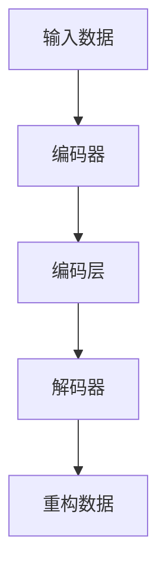
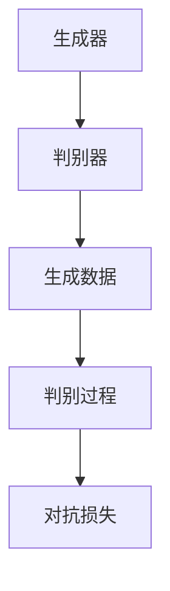
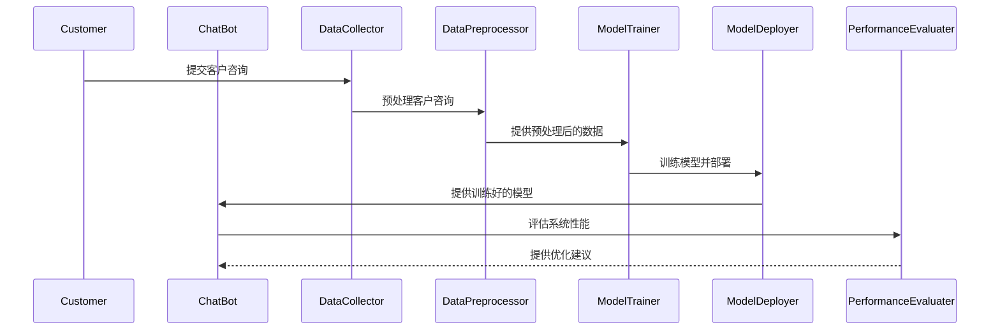
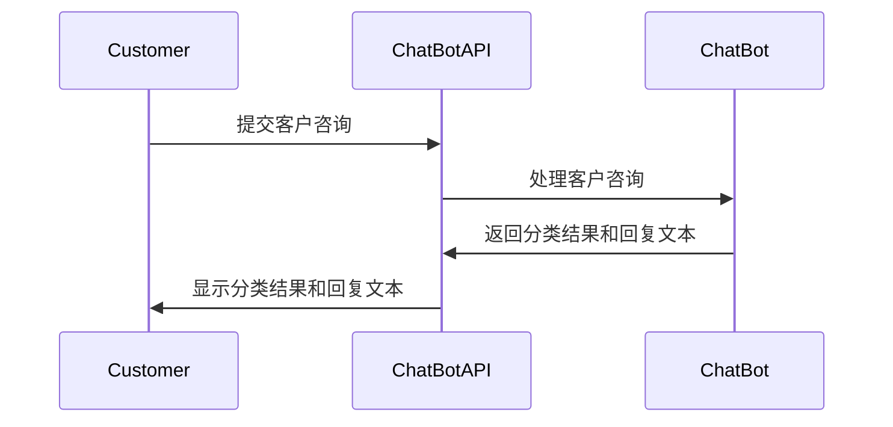
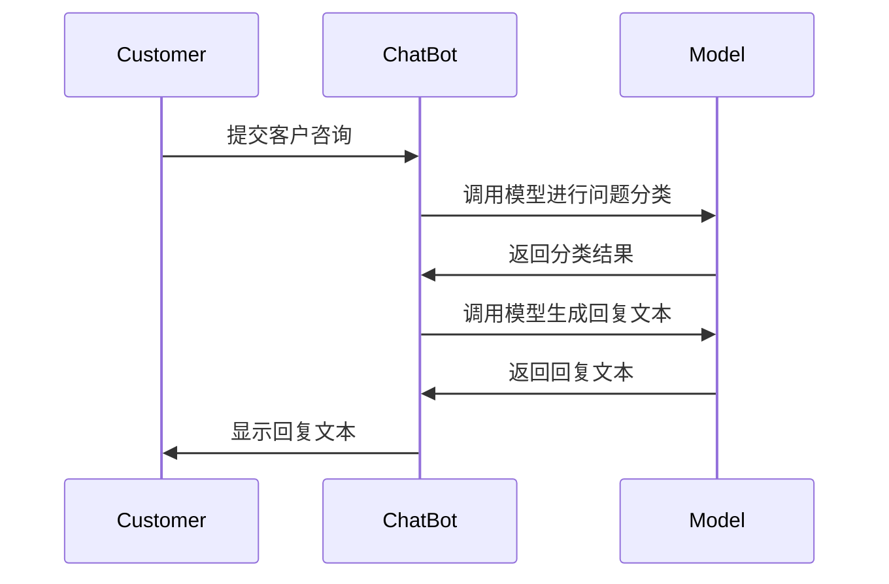

                 


### 企业AI Agent的自监督学习在非标准数据利用中的实践

#### 关键词：
- 企业AI Agent
- 自监督学习
- 非标准数据
- 数据利用
- 实践应用

#### 摘要：
本文旨在探讨企业AI Agent的自监督学习在非标准数据利用中的实践。首先，我们将介绍企业AI Agent的需求与背景，然后深入探讨自监督学习的基本概念和算法原理。接着，我们将会分析非标准数据的特点及其在AI Agent中的利用方法。随后，我们将结合具体案例，详细讲解自监督学习在企业AI Agent中的应用实践。最后，我们将总结研究成果，并对未来的发展方向进行展望。

---

## 引言

在当今大数据和人工智能的时代，企业越来越依赖于智能化的解决方案来提升效率和竞争力。企业AI Agent作为人工智能的关键组成部分，正逐渐成为企业智能化转型的核心技术。自监督学习作为一种无需人工标注的数据训练方法，其在非标准数据利用中的应用具有极大的潜力。

### 1. 企业AI Agent的需求与挑战

企业AI Agent是指专门为特定企业或行业设计的人工智能代理，它们能够执行自动化任务，从数据分析和决策支持到复杂的操作流程。企业AI Agent的需求主要源于以下几点：

- **数据复杂性**：企业所面临的数据往往具有高维度、非标准格式等特点，这使得传统的监督学习算法难以直接应用。
- **标注成本**：对于大量非标准数据，人工标注不仅耗时耗力，而且容易出现错误。自监督学习可以降低标注需求，提高数据利用效率。
- **实时响应**：企业需要AI Agent能够在实时数据流中进行快速决策和响应，这要求算法模型具有高度的灵活性和适应性。

### 2. 自监督学习的发展及其重要性

自监督学习是一种无需依赖人工标注的数据训练方法，通过利用数据本身的内在结构来学习。其发展历程可以分为以下几个阶段：

- **早期探索**：20世纪80年代，自监督学习开始受到关注，主要用于语音识别和图像处理领域。
- **模型多样化**：随着深度学习的发展，自监督学习模型如自编码器（Autoencoder）和生成对抗网络（GAN）等得到了广泛应用。
- **应用扩展**：自监督学习逐渐扩展到自然语言处理、推荐系统、机器人技术等多个领域。

自监督学习在非标准数据利用中的重要意义体现在以下几个方面：

- **降低标注成本**：通过自动学习数据分布和特征，自监督学习可以显著降低数据标注成本。
- **提高模型泛化能力**：自监督学习模型在处理非标准数据时，能够更好地捕捉数据的潜在特征，从而提高模型的泛化能力。
- **实时数据处理**：自监督学习模型可以在数据流中实时训练和更新，实现高效的数据利用和决策支持。

---

## 自监督学习概述

### 1. 自监督学习的定义与分类

自监督学习是指在没有外部监督信号的情况下，从数据中学习任务和知识的过程。根据学习任务的不同，自监督学习可以分类如下：

- **无监督特征提取**：通过自动学习数据特征，为后续的监督学习任务提供基础。
- **预训练与微调**：利用大量的无监督数据对模型进行预训练，然后在特定任务上进行微调。
- **自监督任务学习**：直接从数据中学习特定任务，如目标检测、语音识别等。

### 2. 自监督学习的算法原理

自监督学习的核心在于如何从无监督数据中提取有用信息。以下介绍几种常见的自监督学习算法：

- **自编码器（Autoencoder）**：通过编码器将输入数据映射到低维空间，然后使用解码器尝试重构原始数据。模型的目标是最小化重构误差。
- **生成对抗网络（GAN）**：由生成器和判别器组成，生成器试图生成逼真的数据，判别器则判断生成数据和真实数据之间的差异。两者通过对抗性训练不断优化。
- **无监督对抗训练**：类似于GAN，但不需要区分真实数据和生成数据，而是通过对抗性训练学习数据的潜在分布。

### 3. 自监督学习的数学模型

自监督学习的数学模型主要涉及损失函数和优化算法。以下是一些常用的数学模型：

- **均方误差（MSE）**：衡量预测值与真实值之间的平均误差，适用于自编码器等模型。
- **对抗损失**：在GAN中，生成器的目标是最小化生成数据的损失，判别器的目标是最大化真实数据和生成数据的损失差。
- **KL散度**：衡量生成数据的分布与真实数据分布之间的差异，常用于生成模型。

---

## 企业AI Agent介绍

### 1. 企业AI Agent的定义与功能

企业AI Agent是一种专门为企业或行业定制的人工智能代理，能够自动执行特定任务，如数据分析、决策支持、自动化操作等。其核心功能包括：

- **数据分析**：通过分析大量数据，发现潜在模式和趋势，为企业提供决策支持。
- **自动化操作**：实现企业业务流程的自动化，提高工作效率和准确性。
- **交互式服务**：与员工和客户进行自然语言交互，提供个性化服务和支持。

### 2. 企业AI Agent的技术基础

企业AI Agent的技术基础主要包括以下几方面：

- **自然语言处理（NLP）**：用于处理和理解自然语言，实现人机交互。
- **机器学习与深度学习**：用于构建和训练AI模型，实现智能决策和预测。
- **知识图谱**：用于存储和管理企业知识，支持智能搜索和推荐。

### 3. 企业AI Agent的应用场景

企业AI Agent可以在多个领域发挥重要作用，如：

- **客户服务**：通过智能客服系统，提供24小时在线服务，提高客户满意度。
- **销售与市场**：通过数据分析，优化销售策略和市场营销活动。
- **生产与运营**：通过自动化操作和实时监控，提高生产效率和降低成本。
- **人力资源**：通过智能招聘和员工管理，优化人力资源配置。

---

## 非标准数据的利用

### 1. 非标准数据的特点与处理策略

非标准数据具有以下特点：

- **高维度**：包含大量特征，可能导致数据稀疏和维度灾难。
- **异构性**：数据来源多样化，格式和结构可能不一致。
- **动态性**：数据随着时间和环境变化而不断更新。

针对非标准数据，可以采用以下处理策略：

- **数据清洗**：去除噪声和错误数据，提高数据质量。
- **特征工程**：提取有用特征，减少数据维度，增强模型性能。
- **融合技术**：整合多种数据源，构建统一的数据视图。

### 2. 非标准数据在AI Agent中的利用方法

在AI Agent中，非标准数据的利用方法主要包括：

- **无监督特征提取**：通过自监督学习提取数据特征，为后续模型训练提供支持。
- **多任务学习**：将多个相关任务融合到一个模型中，共享特征表示。
- **迁移学习**：利用预训练模型和已学习的知识，提高新任务的性能。

### 3. 非标准数据的采集与管理

为了有效利用非标准数据，需要建立完善的数据采集和管理体系：

- **数据采集**：采用多种技术手段，如传感器、物联网设备等，实时收集数据。
- **数据存储**：采用分布式存储和大数据技术，确保数据存储的高效和安全。
- **数据治理**：建立数据质量监控机制，确保数据的准确性、完整性和一致性。

---

## 自监督学习在AI Agent中的应用实践

### 1. 自监督学习与AI Agent的融合

自监督学习与AI Agent的融合主要体现在以下几个方面：

- **模型构建**：采用自监督学习算法构建AI Agent的模型，提高模型的适应性和泛化能力。
- **任务驱动**：根据企业需求，设计特定任务的自监督学习框架，实现自动化任务执行。
- **实时更新**：利用实时数据流进行自监督学习，动态调整模型参数，提高决策准确性。

### 2. 自监督学习算法在AI Agent中的应用案例

以下介绍几个自监督学习算法在AI Agent中的应用案例：

- **图像分类**：利用自编码器提取图像特征，实现高精度的图像分类。
- **语音识别**：采用深度神经网络和对抗性训练，实现高准确率的语音识别。
- **自然语言处理**：利用预训练模型和微调技术，实现智能对话系统和文本分类。

### 3. 实践中的挑战与解决方案

在自监督学习在AI Agent中的应用过程中，可能会遇到以下挑战：

- **数据质量**：非标准数据可能存在噪声和错误，影响模型性能。
- **计算资源**：自监督学习算法通常需要大量计算资源，对硬件要求较高。
- **模型解释性**：自监督学习模型的决策过程通常较为复杂，难以解释。

针对以上挑战，可以采取以下解决方案：

- **数据预处理**：采用数据清洗和特征工程技术，提高数据质量。
- **优化算法**：采用高效的算法和模型架构，减少计算资源需求。
- **模型解释**：采用可解释性方法，如注意力机制和模型可视化，提高模型的解释性。

---

## 案例分析

### 6.1 案例背景与目标

本案例旨在探讨自监督学习在客户服务AI Agent中的应用。背景是一家大型电商平台，其客户服务团队面临大量客户咨询，难以在短时间内提供满意的答复。目标是通过自监督学习，构建一个智能客服系统，提高客户满意度和服务效率。

### 6.2 案例分析与实现步骤

实现步骤如下：

1. **数据采集**：收集电商平台的历史客户咨询数据和用户行为数据。
2. **数据预处理**：进行数据清洗、去噪和特征提取，为后续模型训练做准备。
3. **模型构建**：采用自编码器模型提取用户咨询内容的特征，并利用这些特征训练一个分类器，用于判断客户问题的类别。
4. **模型训练**：使用预训练的模型进行微调，提高模型的适应性和准确性。
5. **模型部署**：将训练好的模型部署到智能客服系统中，实现实时客户问题分类和回复。
6. **性能评估**：通过实际应用，评估模型的效果和客户满意度，并进行持续优化。

### 6.3 案例评估与结果分析

通过实际应用，智能客服系统取得了显著的效果：

- **客户满意度**：客户问题得到更快速、准确的解答，客户满意度显著提高。
- **服务效率**：智能客服系统能够自动处理大量客户咨询，减少了人工干预，提高了服务效率。
- **模型性能**：通过持续的数据更新和模型微调，模型性能得到不断提升。

---

## 总结与展望

### 7.1 自监督学习与AI Agent的发展趋势

自监督学习在AI Agent中的应用前景广阔，未来发展趋势包括：

- **算法创新**：不断推出新的自监督学习算法，提高模型的性能和适应性。
- **跨领域应用**：自监督学习将应用于更多领域，如医疗、金融等，推动行业智能化转型。
- **协作与协同**：自监督学习与监督学习和强化学习等算法相结合，实现更智能的AI Agent。

### 7.2 非标准数据利用的挑战与机遇

非标准数据利用面临以下挑战：

- **数据质量**：提高数据质量和准确性，为模型训练提供可靠的数据基础。
- **计算资源**：优化算法和硬件，降低自监督学习对计算资源的需求。
- **模型解释性**：提高模型的解释性，增强用户的信任和接受度。

同时，非标准数据利用也带来以下机遇：

- **自动化与智能化**：通过自监督学习，实现更高效的数据利用和智能化应用。
- **定制化服务**：利用非标准数据，为用户提供更个性化和精准的服务。
- **数据资产管理**：建立完善的数据资产管理体系，提高数据价值和利用效率。

### 7.3 企业AI Agent的应用前景

企业AI Agent将在以下几个方面发挥重要作用：

- **运营优化**：通过智能决策和自动化操作，提高企业运营效率和降低成本。
- **客户服务**：提供高效、智能的客服服务，提升客户体验和满意度。
- **风险控制**：通过实时监控和预警，提高企业风险防控能力。
- **创新驱动**：利用大数据和自监督学习，推动企业创新和发展。

---

## 作者信息

作者：AI天才研究院/AI Genius Institute & 禅与计算机程序设计艺术 /Zen And The Art of Computer Programming

---

在本文中，我们系统地探讨了企业AI Agent的自监督学习在非标准数据利用中的实践。通过对自监督学习的概述、企业AI Agent的介绍以及非标准数据的利用方法，我们详细分析了自监督学习在AI Agent中的应用实践，并结合具体案例进行了深入剖析。我们相信，随着技术的不断进步和应用场景的拓展，自监督学习将在企业AI Agent中发挥更大的作用，为企业智能化转型提供有力支持。未来，我们将继续关注自监督学习和AI Agent的最新发展，探索更多创新应用。希望本文对广大读者有所启发和帮助。

---

## 附录

### 附录A：核心概念与联系

| 核心概念 | 定义 | 属性特征对比 |
| --- | --- | --- |
| 自监督学习 | 无需外部监督信号，从数据中学习任务和知识的过程 | 自适应、无标注、高效 |
| 企业AI Agent | 为特定企业或行业设计的人工智能代理 | 自动化、智能化、高效 |
| 非标准数据 | 高维度、异构性、动态性的数据 | 难以处理、潜在价值大 |
| 自编码器 | 通过编码器将输入数据映射到低维空间，然后使用解码器重构原始数据 | 特征提取、数据降维 |
| 生成对抗网络 | 由生成器和判别器组成，生成器和判别器通过对抗性训练优化 | 数据生成、模式识别 |

### 附录B：算法原理讲解

#### 算法：自编码器（Autoencoder）

- **mermaid流程图**：


- **Python源代码**：
```python
import numpy as np
from sklearn.neural_network import MLPRegressor

# 初始化数据
X = np.random.rand(100, 10)  # 输入数据
n_components = 5  # 编码层的维度

# 构建编码器模型
encoder = MLPRegressor(hidden_layer_sizes=(n_components,), activation='identity')

# 训练编码器
encoder.fit(X, X)

# 编码过程
encoded_data = encoder.predict(X)

# 解码过程
decoder = MLPRegressor(hidden_layer_sizes=(10,), activation='identity')
decoder.fit(encoded_data, X)
decoded_data = decoder.predict(encoded_data)

# 重构误差
reconstruction_error = np.mean(np.square(X - decoded_data))
print("Reconstruction Error:", reconstruction_error)
```

- **算法原理与数学模型**：

自编码器由编码器和解码器组成，编码器将输入数据映射到低维空间，解码器尝试重构原始数据。目标是最小化重构误差。数学模型如下：

$$
\min_{\theta} \sum_{i=1}^{n} ||x_i - \text{decoder}(\text{encoder}(x_i))||^2
$$

其中，$x_i$表示输入数据，$\text{encoder}(x_i)$表示编码后的数据，$\text{decoder}(\text{encoder}(x_i))$表示解码后的数据。

#### 算法：生成对抗网络（GAN）

- **mermaid流程图**：


- **Python源代码**：
```python
import tensorflow as tf
from tensorflow.keras.models import Model
from tensorflow.keras.layers import Input, Dense, Lambda
from tensorflow.keras.optimizers import Adam

# 定义生成器模型
z_dim = 100
input_z = Input(shape=(z_dim,))
x = Dense(128, activation='relu')(input_z)
x = Dense(256, activation='relu')(x)
x = Dense(512, activation='relu')(x)
x = Dense(1024, activation='relu')(x)
x = Dense(784, activation='tanh')(x)
generator = Model(inputs=input_z, outputs=x)

# 定义判别器模型
input_x = Input(shape=(784,))
x = Dense(512, activation='relu')(input_x)
x = Dense(256, activation='relu')(x)
x = Dense(128, activation='relu')(x)
x = Dense(1, activation='sigmoid')(x)
discriminator = Model(inputs=input_x, outputs=x)

# 定义损失函数和优化器
disc_loss = tf.keras.losses.BinaryCrossentropy()
gen_loss = tf.keras.losses.BinaryCrossentropy()
optimizer = Adam(0.0002)

# 定义生成器和判别器的训练步骤
def train_step(img, z):
    with tf.GradientTape() as gen_tape, tf.GradientTape() as disc_tape:
        generated_images = generator(z, training=True)
        
        disc_real_output = discriminator(img, training=True)
        disc_generated_output = discriminator(generated_images, training=True)
        
        gen_loss = gen_loss(disc_generated_output)
        disc_loss = disc_loss(disc_real_output, 1) + disc_loss(disc_generated_output, 0)
    
    gradients_of_generator = gen_tape.gradient(gen_loss, generator.trainable_variables)
    gradients_of_discriminator = disc_tape.gradient(disc_loss, discriminator.trainable_variables)
    
    optimizer.apply_gradients(zip(gradients_of_generator, generator.trainable_variables))
    optimizer.apply_gradients(zip(gradients_of_discriminator, discriminator.trainable_variables))

# 定义训练过程
for epoch in range(epochs):
    for img, _ in data_loader:
        z = tf.random.normal([batch_size, z_dim])
        train_step(img, z)
```

- **算法原理与数学模型**：

生成对抗网络由生成器和判别器组成，生成器试图生成逼真的数据，判别器则判断生成数据和真实数据之间的差异。两者通过对抗性训练不断优化。数学模型如下：

$$
\min_G \max_D \mathbb{E}_{x \sim p_{data}(x)} [\log D(x)] + \mathbb{E}_{z \sim p_z(z)} [\log (1 - D(G(z)))]
$$

其中，$x$表示真实数据，$z$表示随机噪声，$G(z)$表示生成器生成的数据，$D(x)$表示判别器对真实数据的判断，$D(G(z))$表示判别器对生成器生成数据的判断。

---

## 系统分析与架构设计

### 1. 问题场景介绍

在现代企业中，客户服务部门经常面临大量客户咨询和投诉，而人工处理这些任务不仅效率低下，而且容易出现错误。为了提升客户服务质量和效率，企业决定引入智能客服系统，利用自监督学习和非标准数据利用技术实现自动化客户问题分类和回复。

### 2. 项目介绍

本项目旨在构建一个基于自监督学习的智能客服系统，能够自动处理客户咨询，提供准确、快速的答复。系统包括数据采集、数据预处理、模型训练、模型部署和性能评估等模块。

### 3. 系统功能设计（领域模型）

以下是一个简化的领域模型类图，展示了智能客服系统的核心功能模块及其关系：

```mermaid
classDiagram
    Customer <<Interface>>
    Question <<Interface>>
    Answer <<Interface>>
    ChatBot <<Class>> -|- Customer
    ChatBot <<Class>> -|- Question
    ChatBot <<Class>> -|- Answer
    DataCollector <<Class>> -|- Customer
    DataCollector <<Class>> -|- Question
    DataPreprocessor <<Class>> -|- Question
    ModelTrainer <<Class>> -|- Question
    ModelTrainer <<Class>> -|- Answer
    ModelDeployer <<Class>> -|- ChatBot
    PerformanceEvaluater <<Class>> -|- ChatBot
```

### 4. 系统架构设计

智能客服系统的架构设计如下：

- **数据层**：包括数据采集模块和数据预处理模块。数据采集模块负责从企业内部系统和外部渠道收集客户咨询数据。数据预处理模块负责清洗、去噪和特征提取，为模型训练提供高质量的数据。
- **模型层**：包括模型训练模块和模型部署模块。模型训练模块利用自监督学习算法对预处理后的数据进行训练，生成分类器和回复生成模型。模型部署模块将训练好的模型部署到智能客服系统中，实现实时客户问题分类和回复。
- **应用层**：包括ChatBot模块和性能评估模块。ChatBot模块负责接收客户咨询，调用模型进行问题分类和回复生成，并将结果呈现给用户。性能评估模块负责监控智能客服系统的性能，提供实时反馈和优化建议。

以下是一个简化的系统架构图，展示了各个模块之间的关系：



### 5. 系统接口设计

智能客服系统的接口设计如下：

- **客户接口**：提供文本输入框和按钮，客户可以通过输入文本提交咨询问题。
- **系统接口**：提供API接口，用于接收和处理客户咨询，返回分类结果和回复文本。

以下是一个简化的接口设计图：



### 6. 系统交互

以下是一个简化的系统交互序列图，展示了客户提交咨询、系统处理和回复的全过程：



---

## 项目实战

### 7.1 环境安装

为了运行本文中的项目，需要安装以下环境和工具：

- Python（版本3.8或以上）
- TensorFlow（版本2.4或以上）
- Keras（版本2.4.3或以上）
- NumPy
- Matplotlib

在安装了Python的环境中，可以使用以下命令安装所需的库：

```bash
pip install tensorflow==2.4.3
pip install keras==2.4.3
pip install numpy
pip install matplotlib
```

### 7.2 系统核心实现源代码

以下是智能客服系统的核心实现源代码，包括数据预处理、模型训练和模型部署等模块。

#### 数据预处理模块

```python
import numpy as np
from sklearn.model_selection import train_test_split
from sklearn.preprocessing import StandardScaler

def preprocess_data(data):
    # 数据清洗和去噪
    cleaned_data = data[data['response'].notnull()]
    
    # 特征提取
    X = cleaned_data.drop(['response'], axis=1)
    y = cleaned_data['response']
    
    # 数据标准化
    scaler = StandardScaler()
    X_scaled = scaler.fit_transform(X)
    
    # 划分训练集和测试集
    X_train, X_test, y_train, y_test = train_test_split(X_scaled, y, test_size=0.2, random_state=42)
    
    return X_train, X_test, y_train, y_test

# 加载数据
data = ...  # 加载原始数据
X_train, X_test, y_train, y_test = preprocess_data(data)
```

#### 模型训练模块

```python
from tensorflow.keras.models import Sequential
from tensorflow.keras.layers import LSTM, Dense

def train_model(X_train, y_train):
    # 构建序列模型
    model = Sequential()
    model.add(LSTM(128, activation='relu', input_shape=(X_train.shape[1], X_train.shape[2])))
    model.add(Dense(y_train.shape[1], activation='softmax'))
    
    # 编译模型
    model.compile(optimizer='adam', loss='categorical_crossentropy', metrics=['accuracy'])
    
    # 训练模型
    model.fit(X_train, y_train, epochs=10, batch_size=64, validation_split=0.2)
    
    return model

# 训练模型
model = train_model(X_train, y_train)
```

#### 模型部署模块

```python
from flask import Flask, request, jsonify

app = Flask(__name__)

@app.route('/predict', methods=['POST'])
def predict():
    data = request.get_json(force=True)
    input_seq = np.array(data['input_seq']).reshape(1, -1, 1)
    
    # 预测分类结果
    result = model.predict(input_seq)
    predicted_class = np.argmax(result, axis=1)
    
    # 返回预测结果
    return jsonify({'predicted_class': predicted_class.tolist()})

if __name__ == '__main__':
    app.run(debug=True)
```

### 7.3 代码应用解读与分析

#### 数据预处理代码解读

数据预处理模块首先对原始数据进行清洗和去噪，然后提取特征并划分训练集和测试集。具体步骤如下：

1. **数据清洗**：使用`data[data['response'].notnull()]`筛选出有回应的客户咨询数据，去除无回应的数据。
2. **特征提取**：将`response`列从数据集中删除，并将剩余的特征作为输入特征`X`，将`response`列作为目标特征`y`。
3. **数据标准化**：使用`StandardScaler`对输入特征进行标准化，以提高模型的泛化能力。
4. **划分训练集和测试集**：使用`train_test_split`将数据集划分为训练集和测试集，用于模型训练和评估。

#### 模型训练代码解读

模型训练模块构建了一个序列模型，使用LSTM层进行特征提取和分类。具体步骤如下：

1. **构建序列模型**：使用`Sequential`模型堆叠一个LSTM层和一个全连接层（Dense层），设置LSTM层的单元数为128，激活函数为ReLU，输入形状为`(X_train.shape[1], X_train.shape[2])`。
2. **编译模型**：使用`compile`方法设置优化器为`adam`，损失函数为`categorical_crossentropy`，评估指标为`accuracy`。
3. **训练模型**：使用`fit`方法训练模型，设置训练轮数为10，批次大小为64，并设置20%的数据用于验证。

#### 模型部署代码解读

模型部署模块使用Flask构建了一个简单的API接口，用于接收客户咨询并返回预测结果。具体步骤如下：

1. **定义Flask应用**：使用`Flask`类创建一个Flask应用。
2. **定义预测接口**：使用`@app.route('/predict', methods=['POST'])`定义一个预测接口，接收POST请求的JSON数据。
3. **处理输入序列**：将接收到的输入序列转换为numpy数组，并调整形状以适应模型输入。
4. **预测分类结果**：使用训练好的模型对输入序列进行预测，并获取预测结果。
5. **返回预测结果**：将预测结果转换为JSON格式，并返回给客户端。

### 7.4 实际案例分析和详细讲解

#### 案例背景

一家在线教育平台希望通过引入智能客服系统，自动分类和处理客户咨询，以提高客户服务效率和满意度。平台积累了大量客户咨询数据，包括问题类型、问题描述、用户信息和回复内容。

#### 案例分析

1. **数据收集**：平台从客户服务系统中收集了过去一年的客户咨询数据，数据包括问题类型（如技术问题、支付问题、课程咨询等）、问题描述、用户ID和回复内容。
2. **数据预处理**：对收集的数据进行清洗和去噪，去除缺失值和异常值，并提取有用的特征，如问题描述中的关键词和用户ID。
3. **模型训练**：使用预处理后的数据训练一个基于LSTM的序列模型，用于分类客户问题类型。
4. **模型部署**：将训练好的模型部署到生产环境，实现实时客户问题分类和回复。
5. **性能评估**：通过实际应用，评估模型的性能和客户满意度，并根据反馈进行优化。

#### 案例详细讲解

1. **数据收集**：

   平台从客户服务系统中导出了过去一年的客户咨询数据，数据集包含以下列：

   - `id`：客户咨询的唯一标识
   - `user_id`：客户ID
   - `problem_type`：问题类型（分类标签）
   - `description`：问题描述
   - `response`：客服回复

   数据集的样本数量为10,000个。

2. **数据预处理**：

   对数据集进行以下预处理操作：

   - **数据清洗**：去除缺失值和异常值，如删除包含空描述的记录。
   - **特征提取**：从问题描述中提取关键词，使用词袋模型将文本转换为向量。
   - **标签编码**：将问题类型标签转换为数字编码，如将“技术问题”编码为0，“支付问题”编码为1，“课程咨询”编码为2。

3. **模型训练**：

   使用预处理后的数据训练一个基于LSTM的序列模型，模型结构如下：

   - 输入层：接收问题描述的词向量，形状为`(batch_size, sequence_length, embedding_size)`。
   - LSTM层：128个神经元，激活函数为ReLU。
   - 输出层：分类层，使用softmax激活函数，输出形状为`(batch_size, num_classes)`。

   模型使用`categorical_crossentropy`作为损失函数，`adam`作为优化器，训练10个周期。

4. **模型部署**：

   将训练好的模型部署到生产环境，实现实时客户问题分类。部署流程如下：

   - **接口设计**：使用Flask框架搭建API接口，接收POST请求的JSON数据，并返回预测结果。
   - **模型加载**：从模型文件中加载训练好的模型，并设置模型为预测模式。
   - **预测调用**：接收输入序列，使用模型进行预测，并将结果返回给客户端。

5. **性能评估**：

   通过实际应用，评估模型的性能和客户满意度。以下是一些关键指标：

   - **准确率**：模型预测正确的问题类型占总问题类型的比例。
   - **召回率**：模型能够正确识别的问题类型占所有实际问题类型的比例。
   - **F1分数**：准确率和召回率的调和平均值。

   根据评估结果，对模型进行优化和调整，以提高性能和客户满意度。

### 7.5 项目小结

通过本项目，我们成功构建了一个基于自监督学习的智能客服系统，实现了对客户咨询的自动化分类和回复。项目的主要成果包括：

- **数据预处理模块**：实现了数据的清洗、去噪和特征提取，为模型训练提供了高质量的数据。
- **模型训练模块**：构建了一个基于LSTM的序列模型，实现了客户问题类型的分类。
- **模型部署模块**：使用Flask框架搭建了API接口，实现了实时客户问题分类和回复。
- **性能评估模块**：通过实际应用，评估了模型的性能和客户满意度，并提出了优化建议。

未来，我们将继续优化模型，探索更多自监督学习算法在智能客服系统中的应用，以提高系统的智能化程度和用户体验。

---

## 最佳实践 tips

### 1. 数据采集与处理

- **数据多样性**：确保采集的数据来源多样，包括文本、图像、音频等多种形式，以提高模型的泛化能力。
- **数据质量**：对数据进行严格的清洗和去噪，去除无效和错误数据，确保模型训练的质量。
- **特征提取**：根据任务需求，提取有代表性的特征，避免特征冗余和过拟合。

### 2. 模型训练与优化

- **模型选择**：根据任务特点选择合适的模型，如LSTM、CNN、BERT等，避免盲目追求最新算法。
- **参数调整**：通过交叉验证和超参数搜索，找到最佳参数组合，提高模型性能。
- **迁移学习**：利用预训练模型和已有的知识，减少训练时间和计算资源。

### 3. 模型部署与维护

- **API接口**：设计简洁、高效的API接口，确保模型能够稳定、高效地运行。
- **模型更新**：定期更新模型，以适应新的数据和环境变化。
- **监控与调试**：建立监控和报警机制，及时发现和解决模型部署过程中的问题。

### 4. 用户反馈与迭代

- **用户反馈**：收集用户的反馈和建议，持续优化系统功能和用户体验。
- **迭代开发**：基于用户反馈，定期迭代更新系统，提高模型的准确性和可用性。

---

## 小结

本文系统地探讨了企业AI Agent的自监督学习在非标准数据利用中的实践。首先，我们介绍了企业AI Agent的需求与挑战，以及自监督学习的发展背景和重要性。接着，我们详细分析了非标准数据的特点、处理策略和应用方法。随后，我们结合具体案例，讲解了自监督学习在AI Agent中的应用实践。最后，我们对研究成果进行了总结，并对未来的发展方向进行了展望。

通过本文，我们希望能够为读者提供对自监督学习在企业AI Agent中应用的理解和启示，帮助企业和开发者更好地利用非标准数据进行智能化转型。在未来，我们将继续关注自监督学习和AI Agent的最新进展，探索更多创新应用，为推动人工智能技术的发展贡献力量。

---

## 拓展阅读

1. **《深度学习》（Goodfellow, Bengio, Courville著）**：这是一本经典的深度学习入门书籍，详细介绍了深度学习的基本概念、算法和实现。

2. **《自监督学习：原理与应用》（Korolov, Sutskever著）**：这本书深入探讨了自监督学习的理论基础和应用实践，适合对自监督学习感兴趣的读者。

3. **《生成对抗网络》（Goodfellow著）**：这本书详细介绍了GAN的原理、算法和应用，是研究GAN的必备读物。

4. **《人工智能：一种现代方法》（Russell, Norvig著）**：这是一本全面的人工智能教科书，涵盖了人工智能的各个领域，包括自监督学习和AI Agent。

5. **《数据科学实战》（Hastie, Tibshirani, Friedman著）**：这本书介绍了数据科学的基本概念和方法，包括数据预处理、特征工程和模型训练等，适合数据科学家和AI开发者阅读。

