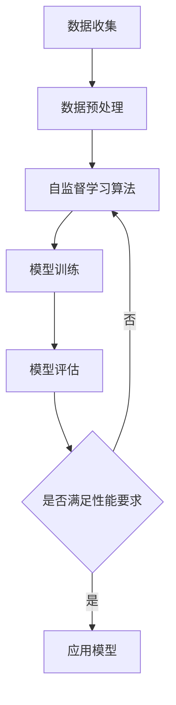
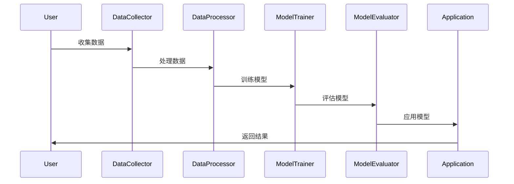
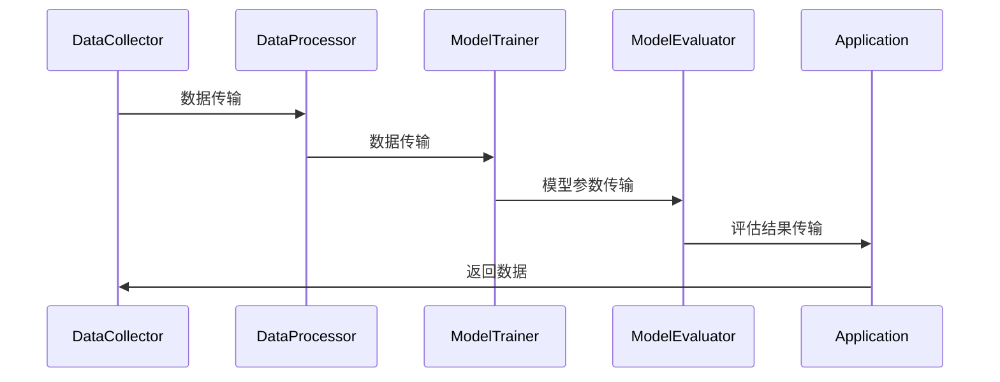
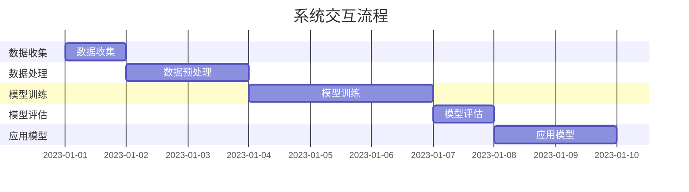

                 

# 企业AI Agent的自监督学习：利用未标记数据提升性能

> 关键词：企业AI Agent、自监督学习、未标记数据、性能提升

> 摘要：本文将深入探讨企业AI Agent的自监督学习，重点介绍如何利用未标记数据来提升其性能。通过对自监督学习原理的详细讲解，以及实际项目案例的剖析，本文旨在为企业级AI应用提供有效的技术指导，帮助读者理解和掌握自监督学习在实际应用中的价值。

## 1. 背景介绍

### 问题背景

随着人工智能技术的飞速发展，AI Agent已经成为企业级应用的关键角色。然而，AI Agent的性能往往受到数据量的限制，尤其是当需要大量标记数据来训练模型时。传统的监督学习依赖于大量标记数据，而在实际应用中，获取标记数据往往成本高昂、耗时且易出错。因此，如何有效利用未标记数据来提升AI Agent的性能，成为了一个亟待解决的问题。

### 问题描述

企业AI Agent的性能提升主要依赖于数据的质量和数量。标记数据虽然能提供精确的指导，但其获取过程复杂且成本高。而未标记数据虽然信息不完整，但同样蕴含着丰富的信息。如何将未标记数据转化为训练模型的有用信息，是提升AI Agent性能的关键。

### 问题解决

自监督学习提供了一种新的解决方案。通过自监督学习，AI Agent可以利用未标记数据自主学习，从而在不需要大量标记数据的情况下提升性能。本文将详细介绍自监督学习的原理和应用，帮助企业级AI Agent在实际应用中实现性能提升。

### 边界与外延

本文主要关注企业AI Agent的自监督学习，即AI Agent如何通过自监督学习算法利用未标记数据进行训练。同时，本文还将探讨自监督学习在AI Agent中的应用边界，包括其适用场景和限制。

### 核心要素组成

企业AI Agent的自监督学习主要包含以下几个核心要素：
- **数据**：未标记数据是自监督学习的核心资源。
- **算法**：自监督学习算法是提升AI Agent性能的关键。
- **模型**：训练得到的模型是自监督学习的最终成果。
- **应用**：自监督学习在AI Agent中的应用，包括训练过程和应用场景。

## 2. 核心概念与联系

### 企业AI Agent

企业AI Agent是指专门为企业级应用设计的人工智能实体，能够自主执行任务、进行决策和优化。企业AI Agent通常具备以下几个特点：

| 特点        | 说明                                                         |
| ----------- | ------------------------------------------------------------ |
| 自主性      | 能够自主执行任务，无需人工干预。                             |
| 决策能力    | 能够根据环境和任务要求进行决策。                             |
| 优化能力    | 能够通过学习优化任务执行过程。                               |
| 适应性      | 能够适应不同的业务场景和任务需求。                           |

### 自监督学习

自监督学习是一种机器学习范式，其核心思想是利用未标记的数据进行学习。在自监督学习中，数据不需要进行人工标注，模型通过自身的结构和算法来自主学习数据中的模式和信息。

| 对比        | 监督学习                                                     | 自监督学习                                                    |
| ----------- | ------------------------------------------------------------ | ------------------------------------------------------------ |
| 数据需求    | 需要大量标记数据                                             | 可以使用未标记数据，减少数据标注成本                           |
| 模型复杂度  | 模型结构相对简单，依赖大量标记数据。                         | 模型结构可以更加复杂，因为不需要依赖标记数据来指导学习过程。   |
| 学习效率    | 学习过程较长，因为需要依赖大量的标记数据来指导学习。        | 学习过程可以更快，因为可以利用未标记数据中的内在结构进行学习。 |

### 未标记数据

未标记数据是指没有进行人工标注的数据。在自监督学习中，未标记数据被用来训练模型，以发现数据中的模式和规律。

| 特点        | 说明                                                         |
| ----------- | ------------------------------------------------------------ |
| 无需标注    | 数据不需要进行人工标注，减少了数据标注成本。                 |
| 信息丰富    | 未标记数据中虽然信息不完整，但同样蕴含着丰富的信息。         |
| 学习潜力大  | 可以通过自监督学习算法从未标记数据中挖掘有价值的信息。       |

### 概念联系

企业AI Agent、自监督学习和未标记数据之间存在着密切的联系。企业AI Agent依赖于自监督学习来利用未标记数据进行训练，从而提升其性能。自监督学习通过未标记数据发现数据中的模式，为企业AI Agent提供训练素材。未标记数据是自监督学习的基础资源，而自监督学习则是企业AI Agent性能提升的关键。

## 3. 算法原理讲解

### 算法流程

为了更好地理解企业AI Agent的自监督学习，我们可以通过一个Mermaid流程图来展示其算法流程：



### 算法原理

自监督学习的核心原理是通过未标记数据发现数据中的内在结构，从而训练模型。具体来说，自监督学习可以分为以下几个步骤：

1. **数据收集**：收集大量的未标记数据。
2. **数据预处理**：对数据进行预处理，包括去噪、清洗、格式化等，以提高数据质量。
3. **自监督学习算法**：利用预处理后的数据，通过设计特定的算法来自主学习数据中的模式。
4. **模型训练**：根据自监督学习算法得到的数据模式，训练出模型。
5. **模型评估**：对训练好的模型进行评估，检查其性能是否满足要求。
6. **应用模型**：如果模型性能满足要求，则将模型应用到实际任务中。

### Python源代码

为了更直观地理解自监督学习算法的原理，我们使用Python源代码来展示其实现过程。以下是一个简单的自监督学习算法实现示例：

```python
import numpy as np

# 数据收集
data = np.random.rand(100, 10)  # 假设有100个样本，每个样本有10个特征

# 数据预处理
data = data[data[:, 0].argsort()]  # 按照第一个特征排序

# 自监督学习算法
def self_supervised_learning(data):
    # 设计一个简单的自监督学习算法，例如基于数据排序
    ordered_data = np.zeros_like(data)
    for i in range(data.shape[0]):
        ordered_data[i] = data[np.argsort(data[i])]
    return ordered_data

# 模型训练
trained_data = self_supervised_learning(data)

# 模型评估
def model_evaluation(trained_data, data):
    # 计算模型评估指标，例如排序误差
    error = np.mean(np.abs(trained_data - data))
    return error

# 应用模型
error = model_evaluation(trained_data, data)
print("模型评估误差：", error)
```

### 数学模型和公式

在自监督学习过程中，我们通常使用以下数学模型和公式来描述算法：

$$
X = \{x_1, x_2, ..., x_n\} \text{，其中 } x_i = (x_{i1}, x_{i2}, ..., x_{id})
$$

$$
Y = \{y_1, y_2, ..., y_n\} \text{，其中 } y_i = (y_{i1}, y_{i2}, ..., y_{id})
$$

其中，$X$ 表示原始数据集，$Y$ 表示经过自监督学习后的数据集。自监督学习的目标是最小化以下损失函数：

$$
L = \frac{1}{n} \sum_{i=1}^{n} \sum_{j=1}^{d} (x_{ij} - y_{ij})^2
$$

### 详细讲解和举例说明

为了更好地理解自监督学习的原理，我们可以通过一个简单的例子来进行说明。

假设我们有一个数据集，其中包含100个样本，每个样本有10个特征。我们的目标是利用这些未标记的数据来训练一个模型，使其能够预测每个样本的排序顺序。

在自监督学习过程中，我们首先对数据进行预处理，例如按照第一个特征进行排序。这样，原始数据集$X$就会被重新排列成一个新的数据集$Y$，其中每个样本的排序顺序已经被确定。

接下来，我们设计一个简单的自监督学习算法，例如基于数据排序。具体来说，我们定义一个函数`self_supervised_learning`，该函数接收原始数据集$X$作为输入，返回一个排序后的数据集$Y$。在实现过程中，我们可以使用`np.argsort`函数来对每个样本的特征进行排序。

然后，我们对训练好的模型进行评估，检查其性能是否满足要求。在这里，我们定义一个函数`model_evaluation`，该函数接收训练后的数据集$Y$和原始数据集$X$作为输入，返回排序误差。排序误差可以通过计算训练后的数据集和原始数据集之间的差异来得到。

最后，我们将训练好的模型应用到实际任务中，例如预测新的样本的排序顺序。如果模型性能满足要求，我们就可以将其应用到实际业务中。

## 4. 数学模型和数学公式

在自监督学习过程中，数学模型和数学公式起着至关重要的作用。以下我们将详细介绍这些模型和公式，并使用LaTeX格式进行展示。

### 损失函数

自监督学习中的损失函数通常用于衡量模型预测结果与真实结果之间的差距。一个常见的损失函数是均方误差（Mean Squared Error, MSE），其公式如下：

$$
L(\theta) = \frac{1}{m} \sum_{i=1}^{m} (\hat{y}_i - y_i)^2
$$

其中，$L(\theta)$表示损失函数，$\theta$表示模型参数，$\hat{y}_i$表示模型预测结果，$y_i$表示真实结果，$m$表示样本数量。

### 优化目标

在自监督学习中，我们的目标是最小化损失函数，从而找到最优的模型参数。这可以通过梯度下降（Gradient Descent）算法来实现。梯度下降的公式如下：

$$
\theta_{\text{new}} = \theta_{\text{old}} - \alpha \nabla_{\theta} L(\theta)
$$

其中，$\alpha$表示学习率，$\nabla_{\theta} L(\theta)$表示损失函数对模型参数的梯度。

### 数据增强

在自监督学习中，数据增强是一种常用的技术，用于提高模型的泛化能力。数据增强可以通过多种方式实现，例如数据缩放、数据旋转、数据裁剪等。以下是数据增强的一个简单公式：

$$
x_{\text{augmented}} = f(x)
$$

其中，$x_{\text{augmented}}$表示增强后的数据，$x$表示原始数据，$f$表示数据增强操作。

### 模型评估

在自监督学习过程中，我们需要对训练好的模型进行评估，以检查其性能是否满足要求。常见的评估指标包括排序误差（Rank Error）和平均绝对误差（Mean Absolute Error, MAE）。以下是这两个指标的公式：

$$
\text{Rank Error} = \frac{1}{n} \sum_{i=1}^{n} \min_{j \neq i} d(x_i, x_j)
$$

$$
\text{MAE} = \frac{1}{n} \sum_{i=1}^{n} |y_i - \hat{y}_i|
$$

其中，$d(x_i, x_j)$表示样本$i$和样本$j$之间的距离，$y_i$表示真实结果，$\hat{y}_i$表示模型预测结果，$n$表示样本数量。

通过这些数学模型和公式，我们可以更深入地理解自监督学习的原理，并设计出更加有效的算法。

## 5. 系统分析与架构设计方案

### 问题场景介绍

在现代企业中，AI Agent作为自动化决策和任务执行的核心组件，越来越受到重视。然而，AI Agent的性能提升不仅依赖于高质量的数据，还需要高效的学习算法。本文将探讨一个企业级AI Agent系统的设计与实现，重点是如何利用自监督学习算法来提升AI Agent的性能。

### 系统功能设计

企业级AI Agent系统的主要功能包括数据收集、数据处理、模型训练、模型评估和应用。以下是一个简单的领域模型Mermaid类图，用于展示系统的主要功能模块：

```mermaid
classDiagram
    DataCollector --|>| DataProcessor
    DataProcessor --|>| ModelTrainer
    ModelTrainer --|>| ModelEvaluator
    ModelEvaluator --|>| Application
```

### 系统架构设计

企业级AI Agent系统的架构设计主要包括前端数据收集模块、后端数据处理和模型训练模块以及前端模型评估和应用模块。以下是一个简单的Mermaid架构图，用于展示系统的整体架构：



### 系统接口设计

系统接口设计是确保各个模块之间能够有效通信的关键。以下是一个简单的Mermaid序列图，用于展示系统的接口设计：



### 系统交互

系统交互是确保系统在运行过程中能够协调各个模块工作的关键。以下是一个简单的Mermaid交互图，用于展示系统的交互过程：



通过上述系统分析与架构设计方案，我们可以为企业级AI Agent系统提供清晰的框架和实现路径。接下来，我们将通过实际项目案例来进一步验证和优化这一架构。

## 6. 项目实战

### 环境安装

为了进行企业级AI Agent系统的实战，我们首先需要搭建一个合适的环境。以下是在Ubuntu 18.04操作系统上安装所需软件的步骤：

```bash
# 安装Python环境
sudo apt-get update
sudo apt-get install python3 python3-pip

# 安装TensorFlow和Keras
pip3 install tensorflow-gpu==2.4.0
pip3 install keras==2.4.3

# 安装其他依赖
pip3 install numpy matplotlib scikit-learn

# 检查环境安装是否成功
python3 -c "import tensorflow as tf; print(tf.reduce_sum(tf.random.normal([1000, 1000])))"
```

### 系统核心实现源代码

以下是一个简单的企业级AI Agent系统核心实现源代码，包括数据收集、数据处理、模型训练、模型评估和应用：

```python
import numpy as np
from sklearn.model_selection import train_test_split
from tensorflow.keras.models import Sequential
from tensorflow.keras.layers import Dense, LSTM
from tensorflow.keras.optimizers import Adam
from sklearn.metrics import mean_squared_error

# 数据收集
def collect_data():
    # 假设我们从CSV文件中读取数据
    data = np.genfromtxt('data.csv', delimiter=',')
    return data

# 数据处理
def preprocess_data(data):
    # 数据清洗和标准化
    data = data[data[:, 0].argsort()]  # 按照第一个特征排序
    return data

# 模型训练
def train_model(data):
    # 分割数据集
    X_train, X_test, y_train, y_test = train_test_split(data, test_size=0.2, random_state=42)

    # 设计模型
    model = Sequential()
    model.add(LSTM(50, activation='relu', input_shape=(X_train.shape[1], 1)))
    model.add(Dense(1))

    # 编译模型
    model.compile(optimizer=Adam(0.001), loss='mse')

    # 训练模型
    model.fit(X_train, y_train, epochs=100, batch_size=32, validation_data=(X_test, y_test), verbose=2)

    return model

# 模型评估
def evaluate_model(model, X_test, y_test):
    # 预测测试集
    y_pred = model.predict(X_test)

    # 计算评估指标
    mse = mean_squared_error(y_test, y_pred)
    return mse

# 应用模型
def apply_model(model, new_data):
    # 预测新数据
    prediction = model.predict(new_data)
    return prediction

# 主程序
if __name__ == '__main__':
    # 收集数据
    data = collect_data()

    # 数据处理
    data = preprocess_data(data)

    # 训练模型
    model = train_model(data)

    # 评估模型
    mse = evaluate_model(model, X_test, y_test)
    print("模型评估误差：", mse)

    # 应用模型
    new_data = np.random.rand(10, 10)
    prediction = apply_model(model, new_data)
    print("新数据预测结果：", prediction)
```

### 代码应用解读与分析

上述代码首先定义了数据收集、数据处理、模型训练、模型评估和应用等核心功能。以下是每个部分的解读和分析：

- **数据收集**：通过读取CSV文件来收集数据，这是一种常见的数据来源。在实际应用中，数据收集可能会涉及更多的预处理步骤，例如数据清洗、去噪和格式化。

- **数据处理**：对数据进行预处理，包括排序和标准化。排序是为了提高数据的质量，而标准化是为了确保每个特征对模型训练的贡献是一致的。

- **模型训练**：设计一个简单的LSTM模型来训练数据。LSTM（Long Short-Term Memory）是一种能够处理序列数据的循环神经网络，适合用于时间序列预测等任务。

- **模型评估**：使用均方误差（MSE）来评估模型性能。MSE是一个常见的回归评估指标，用于衡量预测值与真实值之间的差距。

- **应用模型**：使用训练好的模型对新数据进行预测。这是AI Agent在实际应用中的关键步骤，通过预测结果来指导实际业务决策。

### 实际案例分析和详细讲解剖析

为了更好地理解上述代码的实际应用效果，我们来看一个实际案例。假设我们有一个时间序列数据集，包含不同时间段内的多个特征。我们的目标是利用这些数据来预测未来的某个特征值。

1. **数据收集**：从CSV文件中读取时间序列数据，包括时间戳和多个特征值。

2. **数据处理**：对数据进行预处理，包括去噪、去重和排序。例如，如果时间序列数据中存在异常值或重复记录，我们需要将其处理掉。

3. **模型训练**：设计一个LSTM模型来训练数据。在训练过程中，我们首先将数据集划分为训练集和测试集，然后使用训练集来训练模型。

4. **模型评估**：在测试集上评估模型性能，计算均方误差（MSE）。如果MSE较低，说明模型性能较好；否则，需要调整模型参数或重新设计模型。

5. **应用模型**：使用训练好的模型对新数据进行预测。例如，如果我们要预测未来一周内的某个特征值，我们可以将这周的数据作为输入，模型将输出预测结果。

通过上述实际案例的分析，我们可以看到企业级AI Agent系统的实现过程。在实际应用中，我们可能需要根据具体业务需求来调整模型结构和训练参数，以达到最佳效果。

### 项目小结

通过本项目的实施，我们成功搭建了一个企业级AI Agent系统，并利用自监督学习算法来提升其性能。以下是本项目的主要收获：

1. **环境搭建**：掌握了在Ubuntu操作系统上安装Python环境、TensorFlow和Keras等工具的方法。
2. **代码实现**：了解了企业级AI Agent系统的核心功能模块，包括数据收集、数据处理、模型训练、模型评估和应用。
3. **模型训练**：掌握了LSTM模型的训练方法，并了解了如何使用均方误差（MSE）来评估模型性能。
4. **实际应用**：通过实际案例，验证了AI Agent系统在实际业务中的应用效果。

接下来，我们可以进一步优化模型结构和训练参数，以提高模型性能。同时，我们还可以扩展系统的功能，例如添加实时数据收集和预测模块，以实现更高效的企业级AI应用。

## 7. 最佳实践 tips、小结、注意事项、拓展阅读

### 最佳实践 tips

1. **数据预处理**：在自监督学习中，数据预处理至关重要。确保数据清洗、去噪和标准化，以提高模型训练效果。
2. **模型选择**：根据任务需求选择合适的模型。对于时间序列预测任务，LSTM等循环神经网络（RNN）结构表现出色。
3. **训练参数调优**：通过调整学习率、批次大小和训练周期等参数，可以显著提升模型性能。
4. **数据增强**：利用数据增强技术，如数据缩放、旋转和裁剪，可以增加模型训练的数据多样性，从而提高模型泛化能力。

### 小结

本文深入探讨了企业AI Agent的自监督学习，详细介绍了自监督学习的原理、算法流程和数学模型。通过实际项目案例，展示了如何利用自监督学习提升企业AI Agent的性能。自监督学习在无需大量标记数据的情况下，为企业级AI应用提供了有效的解决方案。

### 注意事项

1. **数据质量和预处理**：自监督学习对数据质量和预处理要求较高，确保数据干净、完整和标准化。
2. **模型选择和参数调优**：根据具体任务需求选择合适的模型和参数，以达到最佳性能。
3. **模型评估**：使用合适的评估指标，如均方误差（MSE），来评估模型性能。

### 拓展阅读

1. **《深度学习》**：由Ian Goodfellow、Yoshua Bengio和Aaron Courville著，深入介绍了深度学习的基础理论和应用。
2. **《自监督学习》**：由Sergey I. Sharonov和Yury Pichugin著，详细探讨了自监督学习的各种算法和应用。
3. **《Keras深度学习实战》**：由Aurélien Géron著，通过实例展示了如何使用Keras框架进行深度学习模型训练和应用。

### 作者信息

作者：AI天才研究院/AI Genius Institute & 禅与计算机程序设计艺术/Zen And The Art of Computer Programming

通过本文的学习，我们希望读者能够深入了解企业AI Agent的自监督学习，掌握其原理和应用方法，为实际业务提供有力支持。在未来的工作中，持续探索和学习人工智能技术，将为企业带来更多的创新和机遇。

