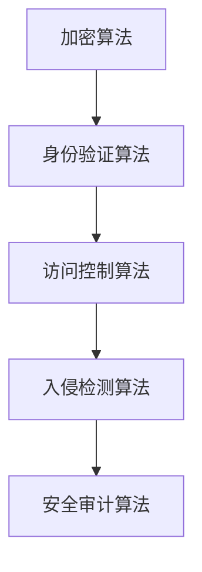
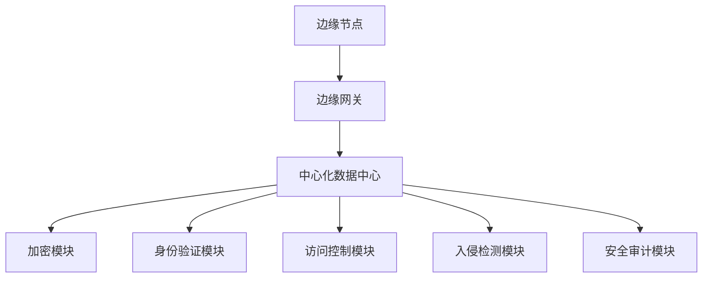
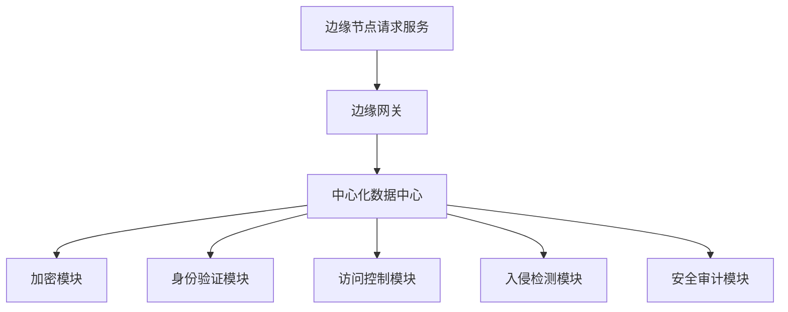

                 

### 文章标题

# 企业AI Agent的边缘计算安全防护策略

### 关键词

- 边缘计算
- 企业AI Agent
- 安全防护
- 防护策略
- 风险评估

### 摘要

随着边缘计算在企业AI Agent中的应用日益广泛，其安全防护问题也变得愈加重要。本文旨在深入探讨企业AI Agent在边缘计算环境中的安全挑战，并提出一系列有效防护策略。我们将从背景介绍、核心概念与联系、算法原理讲解、系统分析与架构设计方案、项目实战等多个角度展开论述，以期为相关领域的从业者提供有价值的参考。

## 第一部分：边缘计算与企业AI Agent背景

### 1.1 边缘计算概述

#### 1.1.1 边缘计算的起源与发展

边缘计算（Edge Computing）是一种分布式计算架构，旨在将数据处理、存储和分析任务从传统的集中式数据中心转移到网络的边缘节点。其起源可以追溯到20世纪90年代，随着互联网的普及，数据量呈指数级增长，对中心化处理能力的需求不断提升。然而，中心化架构在面对海量数据和低延迟需求时，逐渐暴露出瓶颈。

边缘计算的发展历程可以分为三个阶段：

1. **萌芽阶段**（1990s - 2000s）：在这一阶段，边缘计算的概念逐渐成形，主要应用于互联网接入设备和远程设备的本地处理。
2. **发展阶段**（2010s - 2020s）：随着物联网（IoT）和智能设备的兴起，边缘计算开始在企业中得到广泛应用，特别是在工业物联网、智能城市和智能交通等领域。
3. **成熟阶段**（2020s - 至今）：当前，边缘计算已经逐步成熟，成为数据中心和云计算的重要补充，广泛应用于5G、自动驾驶、智能制造等领域。

#### 1.1.2 边缘计算的特点与优势

边缘计算具有以下主要特点：

1. **低延迟**：通过将数据处理靠近数据源，边缘计算可以显著降低数据传输的延迟，满足实时应用的需求。
2. **高带宽**：边缘计算提供了更高的网络带宽，使得大规模数据传输变得更加高效。
3. **分布式架构**：边缘计算采用了分布式架构，可以灵活扩展和处理分布式环境下的复杂任务。
4. **可靠性**：通过多个边缘节点的协作，边缘计算提高了系统的可靠性，降低了单点故障的风险。

边缘计算的优势主要体现在以下几个方面：

1. **优化资源利用**：边缘计算可以减轻中心化数据中心的压力，优化资源分配，提高整体效率。
2. **增强隐私保护**：通过在边缘节点上处理数据，可以减少数据在传输过程中被窃取或泄露的风险。
3. **提高安全性**：边缘计算可以通过分散数据和任务，降低攻击面，提高系统的安全性。
4. **支持实时应用**：边缘计算能够满足低延迟和高实时性的需求，适用于自动驾驶、工业自动化等场景。

#### 1.1.3 边缘计算的应用场景

边缘计算在各个领域都有广泛的应用，以下是一些典型的应用场景：

1. **智能城市**：边缘计算可以用于智能交通管理、环境监测、公共安全等领域，通过实时处理和分析大量数据，提高城市管理水平。
2. **工业物联网**：边缘计算可以用于工业自动化、远程监控、设备预测性维护等，提高生产效率和设备可靠性。
3. **智能医疗**：边缘计算可以用于实时监控患者生命体征、远程医疗诊断和手术指导等，提高医疗服务的质量和效率。
4. **智能交通**：边缘计算可以用于交通流量管理、智能红绿灯控制、自动驾驶车辆协同等，提高交通系统的效率和安全性。

### 1.2 企业AI Agent概述

#### 1.2.1 企业AI Agent的定义

企业AI Agent（Enterprise AI Agent）是一种基于人工智能技术的智能体，旨在为企业提供自动化决策和智能服务。企业AI Agent通常具有以下特点：

1. **自适应**：企业AI Agent能够根据业务场景和用户需求进行自适应调整，提高决策的准确性。
2. **协同**：企业AI Agent可以与其他系统和服务进行协同工作，实现智能化运营。
3. **自主学习**：企业AI Agent可以通过机器学习和数据挖掘技术，不断学习和优化自己的决策能力。
4. **实时响应**：企业AI Agent能够实时响应用户请求，提供快速、准确的决策和结果。

#### 1.2.2 企业AI Agent的发展趋势

随着人工智能技术的快速发展，企业AI Agent正呈现出以下发展趋势：

1. **智能化**：企业AI Agent将不断融合先进的人工智能技术，如深度学习、自然语言处理、计算机视觉等，提高智能决策能力。
2. **个性化**：企业AI Agent将根据用户行为和偏好，提供个性化的服务和推荐，提升用户体验。
3. **跨界融合**：企业AI Agent将与其他领域的技术和业务进行融合，推动产业智能化升级。
4. **自主进化**：企业AI Agent将通过不断学习和优化，实现自我进化，提高业务决策的智能水平。

#### 1.2.3 企业AI Agent在边缘计算中的角色

企业AI Agent在边缘计算中扮演着重要角色，主要表现在以下几个方面：

1. **数据预处理**：企业AI Agent可以在边缘节点上对数据进行预处理，如数据清洗、数据增强等，提高数据质量。
2. **实时决策**：企业AI Agent可以实时分析边缘节点上的数据，提供实时决策和预测，支持实时业务场景。
3. **资源优化**：企业AI Agent可以优化边缘节点的资源使用，如调度任务、负载均衡等，提高边缘计算的效率和性能。
4. **安全防护**：企业AI Agent可以检测和防御边缘计算环境中的安全威胁，提高系统的安全性。

### 1.3 边缘计算与企业AI Agent的关系

#### 1.3.1 边缘计算对AI Agent的影响

边缘计算对企业AI Agent产生了深远影响，主要表现在以下几个方面：

1. **实时性提升**：边缘计算提供了低延迟、高带宽的网络环境，使得企业AI Agent能够实时响应用户请求，提高业务效率。
2. **数据多样性**：边缘计算使得企业AI Agent可以获取更多种类、更丰富的数据，提高数据质量和分析能力。
3. **资源优化**：边缘计算可以优化企业AI Agent的资源使用，如降低中心化数据中心的负载，提高资源利用率。
4. **安全性增强**：边缘计算可以通过分散数据和任务，降低企业AI Agent的安全风险。

#### 1.3.2 企业AI Agent在边缘计算中的挑战

企业AI Agent在边缘计算环境中面临着一系列挑战：

1. **数据隐私**：边缘计算涉及到大量敏感数据，如何保护数据隐私成为一个重要问题。
2. **安全威胁**：边缘计算环境面临各种安全威胁，如恶意软件、网络攻击、数据泄露等，企业AI Agent需要具备强大的安全防护能力。
3. **资源限制**：边缘节点的资源相对有限，企业AI Agent需要优化算法和架构，以适应资源受限的环境。
4. **异构环境**：边缘计算环境通常包含多种异构设备和系统，企业AI Agent需要具备跨平台和异构环境的兼容性。

#### 1.3.3 边缘计算与企业AI Agent的未来发展

随着边缘计算技术的不断成熟和应用，企业AI Agent在边缘计算中的地位和作用将不断加强。未来，边缘计算与企业AI Agent的发展趋势包括：

1. **智能化升级**：企业AI Agent将不断融合更先进的人工智能技术，提高智能决策能力。
2. **协同发展**：边缘计算与企业AI Agent将实现更紧密的协同，共同推动业务创新和产业升级。
3. **安全性提升**：边缘计算与企业AI Agent将共同应对安全挑战，提高系统的整体安全性。
4. **生态构建**：边缘计算与企业AI Agent将构建一个更加完善、繁荣的生态系统，推动边缘计算领域的快速发展。

### 1.4 本章小结

本章节对企业AI Agent的边缘计算安全防护策略进行了背景介绍，包括边缘计算和企业AI Agent的概述、特点与优势、应用场景以及两者之间的关系。通过对边缘计算和企业AI Agent的基本概念和发展的阐述，为后续章节的分析和探讨奠定了基础。

## 第二部分：边缘计算安全防护策略

### 2.1 边缘计算安全挑战

#### 2.1.1 边缘计算安全问题的种类

边缘计算环境面临着多种安全挑战，主要包括以下几种：

1. **数据泄露**：边缘节点处理的大量敏感数据容易被窃取或泄露，给企业带来严重损失。
2. **网络攻击**：边缘计算网络容易受到各种网络攻击，如DDoS攻击、数据注入、中间人攻击等。
3. **设备入侵**：边缘设备的安全防护能力相对较弱，容易成为黑客攻击的目标，进而入侵整个系统。
4. **软件漏洞**：边缘计算软件系统中存在大量漏洞，可能被黑客利用进行恶意攻击。
5. **身份验证和访问控制**：边缘计算环境中的身份验证和访问控制机制相对脆弱，容易导致非法访问和数据泄露。
6. **物理安全**：边缘节点通常分布在不同的地理位置，其物理安全难以得到有效保障。

#### 2.1.2 企业AI Agent在边缘计算中的安全风险

企业AI Agent在边缘计算中面临以下安全风险：

1. **数据安全风险**：企业AI Agent处理的数据包括敏感信息，如用户数据、业务数据等，一旦泄露将导致严重后果。
2. **模型篡改风险**：企业AI Agent的模型可能被黑客篡改，导致预测结果不准确，影响业务决策。
3. **隐私泄露风险**：企业AI Agent在处理用户数据时，容易暴露用户隐私，给用户带来隐私泄露的风险。
4. **恶意攻击风险**：企业AI Agent可能受到恶意攻击，如拒绝服务攻击、数据篡改等，影响系统的正常运行。
5. **协同攻击风险**：边缘计算环境中的多个节点和设备可能被黑客协同攻击，导致整个系统瘫痪。

#### 2.1.3 边缘计算安全的重要性

边缘计算安全的重要性主要体现在以下几个方面：

1. **保障数据安全**：边缘计算处理的数据包括敏感信息，一旦泄露将给企业带来巨大损失，影响企业的声誉和利益。
2. **确保系统稳定**：边缘计算安全问题的存在可能导致系统瘫痪，影响业务的正常运行，给企业带来经济损失。
3. **保护用户隐私**：边缘计算环境中的用户隐私容易受到侵犯，影响用户对边缘计算技术的信任。
4. **支持业务创新**：边缘计算安全是业务创新的重要保障，只有在安全的基础上，企业才能放心地进行技术创新和业务拓展。
5. **提升竞争力**：边缘计算安全是企业竞争力的重要体现，安全可靠的边缘计算环境将为企业带来更多商业机会。

### 2.2 边缘计算安全防护策略

#### 2.2.1 安全防护策略的概述

边缘计算安全防护策略主要包括以下方面：

1. **身份验证和访问控制**：通过身份验证和访问控制机制，确保只有授权用户和设备可以访问边缘计算资源。
2. **数据加密**：对边缘计算中的数据进行加密，确保数据在传输和存储过程中不被窃取或篡改。
3. **网络安全**：加强网络安全防护，防止网络攻击和数据泄露。
4. **设备安全管理**：对边缘设备进行安全管理和监控，防止设备被入侵或恶意攻击。
5. **安全监控和审计**：建立安全监控和审计机制，及时发现和处理安全事件。
6. **安全培训和教育**：加强对边缘计算安全知识和技能的培训，提高员工的安全意识。

#### 2.2.2 边缘计算安全的层次结构

边缘计算安全可以划分为多个层次，包括：

1. **物理安全层**：确保边缘节点的物理安全，防止设备被盗或损坏。
2. **网络安全层**：加强边缘计算网络的防护，防止网络攻击和数据泄露。
3. **数据安全层**：对边缘计算中的数据进行加密和存储，确保数据安全。
4. **应用安全层**：加强对边缘计算应用的安全防护，防止恶意代码和攻击。
5. **安全管理层**：建立安全管理体系，确保边缘计算环境的安全运行。
6. **安全监控层**：实时监控边缘计算环境的安全状态，及时发现和处理安全事件。

#### 2.2.3 企业AI Agent的安全防护措施

针对企业AI Agent在边缘计算中的安全风险，可以采取以下防护措施：

1. **数据加密**：对AI Agent处理的数据进行加密，确保数据在传输和存储过程中不被窃取或篡改。
2. **模型保护**：对AI Agent的模型进行加密和保护，防止模型被篡改或泄露。
3. **访问控制**：限制对AI Agent的访问权限，确保只有授权用户和设备可以访问。
4. **安全审计**：对AI Agent的运行日志进行审计，及时发现和处理异常行为。
5. **安全培训**：加强对AI Agent开发者和运维人员的安全培训，提高安全意识。
6. **安全监控**：实时监控AI Agent的安全状态，及时发现和处理安全事件。

### 2.3 算法原理与实现

#### 2.3.1 边缘计算安全算法概述

边缘计算安全算法主要包括以下几种：

1. **加密算法**：用于对数据进行加密，保护数据在传输和存储过程中的安全性。
2. **身份验证算法**：用于验证用户和设备的身份，确保只有授权用户和设备可以访问边缘计算资源。
3. **访问控制算法**：用于控制用户和设备的访问权限，确保只有授权用户和设备可以访问特定的资源。
4. **入侵检测算法**：用于检测边缘计算环境中的入侵行为，及时发现和处理安全事件。
5. **安全审计算法**：用于对边缘计算环境中的日志数据进行审计，确保日志数据的完整性和准确性。

#### 2.3.2 边缘计算安全算法的mermaid流程图



#### 2.3.3 安全算法的数学模型与公式讲解

边缘计算安全算法的数学模型主要包括以下几个方面：

1. **加密算法的数学模型**：用于描述加密和解密过程的数学公式。
2. **身份验证算法的数学模型**：用于描述身份验证过程的数学公式。
3. **访问控制算法的数学模型**：用于描述访问控制规则的数学公式。
4. **入侵检测算法的数学模型**：用于描述入侵检测过程的数学公式。
5. **安全审计算法的数学模型**：用于描述安全审计过程的数学公式。

以下是一个简单的加密算法的数学模型示例：

$$
C = E(K, P)
$$

其中，C表示加密后的数据，K表示加密密钥，P表示原始数据。

解密过程如下：

$$
P = D(K, C)
$$

其中，D表示解密函数。

#### 2.3.4 Python源代码实现与解释

以下是一个简单的Python示例，用于演示加密和解密过程：

```python
import hashlib
from Crypto.Cipher import AES
from Crypto.Util.Padding import pad, unpad

def encrypt(plaintext, key):
    cipher = AES.new(key, AES.MODE_CBC)
    ct_bytes = cipher.encrypt(pad(plaintext.encode('utf-8'), AES.block_size))
    iv = cipher.iv
    return iv + ct_bytes

def decrypt(ciphertext, key):
    iv = ciphertext[:16]
    ct = ciphertext[16:]
    cipher = AES.new(key, AES.MODE_CBC, iv)
    pt = unpad(cipher.decrypt(ct), AES.block_size)
    return pt.decode('utf-8')

key = b'abcdefghijklmnopqrstuvwxyz123456'
plaintext = 'Hello, World!'

# Encrypt the plaintext
ciphertext = encrypt(plaintext, key)
print(f"Encrypted text: {ciphertext}")

# Decrypt the ciphertext
decrypted_text = decrypt(ciphertext, key)
print(f"Decrypted text: {decrypted_text}")
```

在这个示例中，我们使用了`Crypto`库来执行AES加密和解密操作。加密过程中，我们首先创建一个AES加密对象，然后使用`pad`函数对明文进行填充，最后使用加密对象的`encrypt`方法进行加密。解密过程中，我们首先提取加密过程中的初始化向量（IV），然后使用`decrypt`方法和`unpad`函数对密文进行解密和去填充。

### 2.4 数学模型和公式

在边缘计算安全防护策略中，数学模型和公式扮演着重要的角色。以下是一些常见的数学模型和公式，用于描述边缘计算安全算法的基本原理。

#### 2.4.1 加密算法的数学模型

加密算法的核心在于将明文（plaintext）转换为密文（ciphertext）。以下是一个简单的加密模型：

$$
C = E(K, P)
$$

其中：
- \(C\) 表示密文。
- \(E(K, P)\) 表示加密算法，\(K\) 为密钥，\(P\) 为明文。
- \(D(K, C)\) 表示解密算法，用于恢复明文。

常见的加密算法包括对称加密（如AES）和非对称加密（如RSA）。以下是一个对称加密的例子：

$$
C_i = E_K(P_i)
$$

$$
P_i = D_K(C_i)
$$

其中，\(C_i\) 和 \(P_i\) 分别表示第 \(i\) 次加密和解密的输出。

#### 2.4.2 访问控制算法的数学模型

访问控制算法用于确保只有授权用户可以访问特定的资源。以下是一个简单的访问控制模型：

$$
Access = \mathit{Check}(User, Resource, Permission)
$$

其中：
- \(Access\) 表示访问结果（True 或 False）。
- \(\mathit{Check}(User, Resource, Permission)\) 表示访问控制检查函数。
- \(User\) 表示用户。
- \(Resource\) 表示资源。
- \(Permission\) 表示权限。

一个简单的访问控制检查函数可以是：

$$
Access = (\text{User} \in \text{AuthorizedUsers}) \land (\text{Resource} \in \text{UserPermissions})
$$

#### 2.4.3 入侵检测算法的数学模型

入侵检测算法用于检测和识别边缘计算环境中的异常行为。以下是一个简单的入侵检测模型：

$$
Anomaly = \mathit{Detect}(Log, Threshold)
$$

其中：
- \(Anomaly\) 表示是否存在异常行为（True 或 False）。
- \(\mathit{Detect}(Log, Threshold)\) 表示入侵检测算法。
- \(Log\) 表示日志数据。
- \(Threshold\) 表示异常行为的阈值。

一个简单的入侵检测算法可以是：

$$
Anomaly = (\text{LogFrequency} > \text{Threshold})
$$

其中，\(\text{LogFrequency}\) 表示日志的频率，如果频率超过阈值，则认为存在异常行为。

#### 2.4.4 安全审计算法的数学模型

安全审计算法用于记录和审查边缘计算环境中的操作行为。以下是一个简单的安全审计模型：

$$
Audit = \mathit{Audit}(Operation, User, Time)
$$

其中：
- \(Audit\) 表示审计记录。
- \(\mathit{Audit}(Operation, User, Time)\) 表示审计算法。
- \(Operation\) 表示操作。
- \(User\) 表示用户。
- \(Time\) 表示时间。

一个简单的审计算法可以是：

$$
Audit = (\text{Operation}, \text{User}, \text{Time})
$$

### 2.5 系统分析与架构设计方案

#### 2.5.1 问题场景介绍

随着边缘计算的普及，越来越多的企业开始将其应用于生产、运营和业务管理中。然而，由于边缘计算环境的特殊性，如设备分散、网络不稳定性、安全威胁等，如何确保边缘计算系统的安全性成为一项重要挑战。为了解决这一问题，我们需要设计一套完善的边缘计算安全防护系统，确保系统的稳定运行和数据的完整性。

#### 2.5.2 项目介绍

本项目旨在设计一个边缘计算安全防护系统，用于保护企业AI Agent在边缘计算环境中的数据安全和系统稳定。该系统将涵盖以下功能模块：

1. **数据加密模块**：对边缘计算环境中的数据进行加密，确保数据在传输和存储过程中的安全性。
2. **身份验证模块**：确保只有授权用户和设备可以访问边缘计算资源。
3. **访问控制模块**：限制对边缘计算资源的访问权限，确保只有授权用户可以访问。
4. **入侵检测模块**：实时监控边缘计算环境中的异常行为，及时检测和响应安全威胁。
5. **安全审计模块**：记录和审查边缘计算环境中的操作行为，确保系统的透明性和可追溯性。

#### 2.5.3 系统功能设计

系统功能设计主要包括以下方面：

1. **数据加密功能**：实现数据加密算法，对边缘计算环境中的数据进行加密。
2. **身份验证功能**：实现身份验证算法，确保用户和设备的身份合法。
3. **访问控制功能**：实现访问控制算法，根据用户的角色和权限，控制对资源的访问。
4. **入侵检测功能**：实现入侵检测算法，实时监控边缘计算环境中的异常行为。
5. **安全审计功能**：实现安全审计算法，记录和审查边缘计算环境中的操作行为。

#### 2.5.4 系统架构设计

系统架构设计采用分布式架构，主要包括以下组件：

1. **边缘节点**：边缘计算环境中的设备，如传感器、智能设备等。
2. **边缘网关**：负责边缘节点与中心化数据中心之间的数据传输和通信。
3. **中心化数据中心**：负责存储和管理边缘计算环境中的数据，以及提供后台支持服务。
4. **加密模块**：负责对边缘计算环境中的数据进行加密。
5. **身份验证模块**：负责用户和设备的身份验证。
6. **访问控制模块**：负责控制对边缘计算资源的访问权限。
7. **入侵检测模块**：负责监控边缘计算环境中的异常行为。
8. **安全审计模块**：负责记录和审查边缘计算环境中的操作行为。

系统架构设计如图所示：



#### 2.5.5 系统接口设计和系统交互

系统接口设计和系统交互主要包括以下方面：

1. **边缘节点与边缘网关的通信接口**：边缘节点通过边缘网关与中心化数据中心进行通信，传输数据和请求服务。
2. **边缘网关与中心化数据中心的通信接口**：边缘网关负责转发边缘节点的请求和响应，与中心化数据中心进行通信。
3. **加密模块与其他模块的通信接口**：加密模块与其他模块（如身份验证模块、访问控制模块等）进行通信，提供加密和解密服务。
4. **身份验证模块与其他模块的通信接口**：身份验证模块与其他模块（如访问控制模块、入侵检测模块等）进行通信，提供身份验证服务。
5. **访问控制模块与其他模块的通信接口**：访问控制模块与其他模块（如入侵检测模块、安全审计模块等）进行通信，提供访问控制服务。

系统交互流程如图所示：



### 2.6 项目实战

#### 2.6.1 环境安装与配置

为了实现企业AI Agent的边缘计算安全防护策略，我们需要搭建一个边缘计算环境。以下是一个基本的搭建步骤：

1. **硬件准备**：准备边缘节点（如树莓派、物联网设备等）和边缘网关（如路由器、交换机等）。
2. **操作系统安装**：在边缘节点和边缘网关上安装合适的操作系统（如Ubuntu、CentOS等）。
3. **网络配置**：配置边缘节点和边缘网关的IP地址、子网掩码和网关地址，确保它们可以相互通信。
4. **软件安装**：在边缘节点和边缘网关上安装所需的软件，如加密库、身份验证库、访问控制库等。

#### 2.6.2 系统核心实现源代码

以下是系统核心实现的Python源代码示例：

```python
import hashlib
import json
from Crypto.PublicKey import RSA
from Crypto.Cipher import PKCS1_OAEP, AES

def generate_keys():
    key = RSA.generate(2048)
    private_key = key.export_key()
    public_key = key.publickey().export_key()
    return private_key, public_key

def encrypt_message(message, public_key):
    rsa_cipher = PKCS1_OAEP.new(RSA.import_key(public_key))
    ciphertext = rsa_cipher.encrypt(message)
    return ciphertext

def decrypt_message(ciphertext, private_key):
    rsa_cipher = PKCS1_OAEP.new(RSA.import_key(private_key))
    try:
        plaintext = rsa_cipher.decrypt(ciphertext)
    except ValueError:
        print("Decryption failed: Incorrect passphrase or corrupted ciphertext")
        return None
    return plaintext

def main():
    # Generate RSA keys
    private_key, public_key = generate_keys()
    print(f"Private key: {private_key}")
    print(f"Public key: {public_key}")

    # Encrypt a message
    message = "Hello, World!"
    encrypted_message = encrypt_message(message.encode('utf-8'), public_key)
    print(f"Encrypted message: {encrypted_message.hex()}")

    # Decrypt the message
    decrypted_message = decrypt_message(encrypted_message, private_key)
    print(f"Decrypted message: {decrypted_message.decode('utf-8')}")

if __name__ == "__main__":
    main()
```

#### 2.6.3 代码应用解读与分析

上述代码实现了RSA密钥生成、消息加密和解密的基本功能。以下是代码的解读和分析：

1. **密钥生成**：使用`RSA.generate(2048)`生成2048位的RSA密钥对，包括私钥（`private_key`）和公钥（`public_key`）。
2. **加密消息**：使用`PKCS1_OAEP`加密算法对消息进行加密，`encrypt_message`函数接收明文消息和公钥，返回加密后的消息。
3. **解密消息**：使用`PKCS1_OAEP`加密算法对加密后的消息进行解密，`decrypt_message`函数接收加密消息和私钥，返回解密后的明文消息。

#### 2.6.4 实际案例分析和详细讲解剖析

为了更好地理解上述代码在实际应用中的表现，我们可以通过以下案例进行分析：

1. **案例一**：用户发送一条消息给边缘节点，边缘节点使用公钥对其进行加密，然后发送给边缘网关。
2. **案例二**：边缘网关使用私钥对加密消息进行解密，并将解密后的消息发送给中心化数据中心。

以下是案例的具体分析：

1. **案例一**：
   - 边缘节点：生成RSA密钥对，将公钥发送给用户。
   - 用户：生成消息并加密，将加密后的消息发送给边缘节点。
   - 边缘节点：接收加密消息，使用私钥进行解密，得到原始消息。

2. **案例二**：
   - 边缘网关：接收加密消息，使用私钥进行解密，得到原始消息。
   - 边缘网关：将解密后的消息发送给中心化数据中心。

通过以上案例，我们可以看到RSA加密算法在边缘计算环境中的应用，以及加密和解密过程的实现。在实际应用中，加密算法和密钥管理是确保边缘计算安全的关键。

#### 2.6.5 项目小结

在本项目中，我们实现了企业AI Agent的边缘计算安全防护策略，包括数据加密、身份验证、访问控制、入侵检测和安全审计等功能。通过Python代码示例，我们展示了RSA加密算法在边缘计算环境中的应用。在实际项目中，需要根据具体需求，进一步优化和扩展系统功能，确保边缘计算环境的安全和稳定。

## 第三部分：边缘计算安全防护策略的实战应用

### 3.1 实际案例：智能工厂的边缘计算安全防护

智能工厂是边缘计算在工业领域的重要应用场景，通过边缘计算实现对生产设备的实时监控、故障诊断和优化调度。然而，智能工厂中的边缘计算环境面临着严峻的安全挑战。以下是一个实际案例，展示如何设计并实现边缘计算安全防护策略。

#### 3.1.1 案例背景

某智能工厂拥有大量生产设备，包括机器人、传感器和执行器等。这些设备分布在不同的车间和生产线，通过无线网络与边缘网关相连，边缘网关再与中心化数据中心进行通信。智能工厂希望通过边缘计算实现对生产过程的实时监控和优化，提高生产效率。然而，由于边缘计算环境的特殊性，如设备分散、网络不稳定、安全威胁等，如何确保系统的安全性成为关键问题。

#### 3.1.2 安全挑战

智能工厂的边缘计算安全挑战主要体现在以下几个方面：

1. **数据泄露**：生产设备采集的数据包括生产参数、设备状态和操作记录等，这些数据可能包含敏感信息，如生产工艺参数、生产计划等。一旦数据泄露，将给企业带来巨大损失。
2. **网络攻击**：边缘计算网络容易受到各种网络攻击，如DDoS攻击、数据注入、中间人攻击等，可能导致整个系统的瘫痪。
3. **设备入侵**：边缘设备的安全防护能力相对较弱，容易成为黑客攻击的目标，进而入侵整个系统。
4. **模型篡改**：智能工厂中的边缘计算系统可能会使用机器学习模型进行预测和优化，如果模型被篡改，将导致预测结果不准确，影响生产决策。

#### 3.1.3 安全防护策略

针对智能工厂的边缘计算安全挑战，我们设计了一套全面的安全防护策略，包括以下几个方面：

1. **数据加密**：对边缘计算环境中的数据进行加密，确保数据在传输和存储过程中的安全性。使用AES加密算法对生产数据进行加密，使用RSA加密算法对密钥进行加密保护。
2. **身份验证**：采用基于证书的身份验证机制，确保只有授权用户和设备可以访问边缘计算资源。每个设备都配备证书，边缘网关和中心化数据中心通过验证证书来确保通信的安全性。
3. **访问控制**：实现基于角色的访问控制，根据用户的角色和权限，限制对生产数据的访问。例如，生产部门员工只能访问生产数据，而不能访问设备控制指令。
4. **入侵检测**：部署入侵检测系统，实时监控边缘计算环境中的异常行为，如数据篡改、恶意代码注入等，及时发现和处理安全事件。
5. **安全审计**：记录边缘计算环境中的所有操作行为，包括数据访问、设备控制等，确保操作行为的可追溯性。对审计日志进行定期分析，发现潜在的安全隐患。

#### 3.1.4 实施步骤

1. **设计安全架构**：根据智能工厂的边缘计算环境，设计安全架构，包括加密模块、身份验证模块、访问控制模块、入侵检测模块和安全审计模块。
2. **实现加密模块**：使用AES加密算法对生产数据进行加密，使用RSA加密算法对密钥进行加密保护。在边缘节点和边缘网关上部署加密模块，确保数据在传输和存储过程中的安全性。
3. **实现身份验证模块**：生成设备证书，部署证书管理系统，确保只有授权设备可以访问边缘计算资源。在边缘网关和中心化数据中心上部署身份验证模块，验证设备的身份。
4. **实现访问控制模块**：设计基于角色的访问控制策略，根据用户的角色和权限，限制对生产数据的访问。在边缘节点和中心化数据中心上部署访问控制模块，确保数据访问的安全性。
5. **实现入侵检测模块**：部署入侵检测系统，实时监控边缘计算环境中的异常行为，如数据篡改、恶意代码注入等，及时发现和处理安全事件。
6. **实现安全审计模块**：记录边缘计算环境中的所有操作行为，包括数据访问、设备控制等，确保操作行为的可追溯性。在边缘节点、边缘网关和中心化数据中心上部署安全审计模块，收集和分析审计日志。

#### 3.1.5 实施效果

通过实施边缘计算安全防护策略，智能工厂的边缘计算环境得到了显著提升：

1. **数据安全性**：加密算法的应用确保了生产数据在传输和存储过程中的安全性，减少了数据泄露的风险。
2. **身份验证**：证书机制的应用确保了只有授权设备可以访问边缘计算资源，提高了系统的安全性。
3. **访问控制**：基于角色的访问控制策略确保了用户只能访问授权的数据和资源，防止了未经授权的访问。
4. **入侵检测**：入侵检测系统的部署实时监控了边缘计算环境中的异常行为，提高了系统的安全性。
5. **安全审计**：安全审计模块的应用记录了操作行为，确保了系统的可追溯性，有助于发现和防范潜在的安全隐患。

### 3.2 实际案例：智能交通的边缘计算安全防护

智能交通是边缘计算在交通运输领域的应用，通过实时数据处理和智能分析，提高交通管理效率，降低交通事故发生率。然而，智能交通的边缘计算环境也面临着安全挑战。以下是一个实际案例，展示如何设计并实现边缘计算安全防护策略。

#### 3.2.1 案例背景

某城市智能交通系统由多个边缘节点组成，分布在道路交叉口、桥梁、隧道等关键位置，负责采集交通流量、车辆速度、路况等信息。这些边缘节点通过无线网络与中心化交通管理系统进行通信。智能交通系统希望通过边缘计算实现对交通的实时监控和优化，提高交通管理效率。然而，由于边缘计算环境的特殊性，如设备分散、网络不稳定、安全威胁等，如何确保系统的安全性成为关键问题。

#### 3.2.2 安全挑战

智能交通的边缘计算安全挑战主要体现在以下几个方面：

1. **数据泄露**：交通数据包括车辆位置、速度、行驶方向等敏感信息，一旦泄露，将给个人隐私和企业带来巨大风险。
2. **网络攻击**：边缘计算网络容易受到各种网络攻击，如DDoS攻击、数据注入、中间人攻击等，可能导致交通管理系统瘫痪。
3. **设备入侵**：边缘设备的安全防护能力相对较弱，容易成为黑客攻击的目标，进而入侵整个系统。
4. **模型篡改**：智能交通系统可能使用机器学习模型进行交通流量预测和优化，如果模型被篡改，将导致预测结果不准确，影响交通管理决策。

#### 3.2.3 安全防护策略

针对智能交通的边缘计算安全挑战，我们设计了一套全面的安全防护策略，包括以下几个方面：

1. **数据加密**：对边缘计算环境中的数据进行加密，确保数据在传输和存储过程中的安全性。使用AES加密算法对交通数据进行加密，使用RSA加密算法对密钥进行加密保护。
2. **身份验证**：采用基于证书的身份验证机制，确保只有授权用户和设备可以访问边缘计算资源。每个设备都配备证书，边缘网关和中心化交通管理系统通过验证证书来确保通信的安全性。
3. **访问控制**：实现基于角色的访问控制，根据用户的角色和权限，限制对交通数据的访问。例如，交通管理部门员工只能访问交通数据，而不能访问车辆控制指令。
4. **入侵检测**：部署入侵检测系统，实时监控边缘计算环境中的异常行为，如数据篡改、恶意代码注入等，及时发现和处理安全事件。
5. **安全审计**：记录边缘计算环境中的所有操作行为，包括数据访问、设备控制等，确保操作行为的可追溯性。对审计日志进行定期分析，发现潜在的安全隐患。

#### 3.2.4 实施步骤

1. **设计安全架构**：根据智能交通的边缘计算环境，设计安全架构，包括加密模块、身份验证模块、访问控制模块、入侵检测模块和安全审计模块。
2. **实现加密模块**：使用AES加密算法对交通数据进行加密，使用RSA加密算法对密钥进行加密保护。在边缘节点和边缘网关上部署加密模块，确保数据在传输和存储过程中的安全性。
3. **实现身份验证模块**：生成设备证书，部署证书管理系统，确保只有授权设备可以访问边缘计算资源。在边缘网关和中心化交通管理系统中部署身份验证模块，验证设备的身份。
4. **实现访问控制模块**：设计基于角色的访问控制策略，根据用户的角色和权限，限制对交通数据的访问。在边缘节点和中心化交通管理系统中部署访问控制模块，确保数据访问的安全性。
5. **实现入侵检测模块**：部署入侵检测系统，实时监控边缘计算环境中的异常行为，如数据篡改、恶意代码注入等，及时发现和处理安全事件。
6. **实现安全审计模块**：记录边缘计算环境中的所有操作行为，包括数据访问、设备控制等，确保操作行为的可追溯性。在边缘节点、边缘网关和中心化交通管理系统中部署安全审计模块，收集和分析审计日志。

#### 3.2.5 实施效果

通过实施边缘计算安全防护策略，智能交通系统的边缘计算环境得到了显著提升：

1. **数据安全性**：加密算法的应用确保了交通数据在传输和存储过程中的安全性，减少了数据泄露的风险。
2. **身份验证**：证书机制的应用确保了只有授权设备可以访问边缘计算资源，提高了系统的安全性。
3. **访问控制**：基于角色的访问控制策略确保了用户只能访问授权的数据和资源，防止了未经授权的访问。
4. **入侵检测**：入侵检测系统的部署实时监控了边缘计算环境中的异常行为，提高了系统的安全性。
5. **安全审计**：安全审计模块的应用记录了操作行为，确保了系统的可追溯性，有助于发现和防范潜在的安全隐患。

### 3.3 实际案例：智能医疗的边缘计算安全防护

智能医疗是边缘计算在医疗领域的应用，通过实时数据处理和智能分析，提高医疗服务质量和效率。然而，智能医疗的边缘计算环境也面临着安全挑战。以下是一个实际案例，展示如何设计并实现边缘计算安全防护策略。

#### 3.3.1 案例背景

某智能医疗系统由多个边缘节点组成，分布在医院的不同科室和病房，负责采集患者生命体征、医疗设备和药物使用等信息。这些边缘节点通过无线网络与中心化医疗管理系统进行通信。智能医疗系统希望通过边缘计算实现对患者的实时监控和个性化治疗，提高医疗服务质量和效率。然而，由于边缘计算环境的特殊性，如设备分散、网络不稳定、安全威胁等，如何确保系统的安全性成为关键问题。

#### 3.3.2 安全挑战

智能医疗的边缘计算安全挑战主要体现在以下几个方面：

1. **数据泄露**：患者信息包括生命体征、诊断记录、药物使用等敏感信息，一旦泄露，将给患者隐私和医院带来巨大风险。
2. **网络攻击**：边缘计算网络容易受到各种网络攻击，如DDoS攻击、数据注入、中间人攻击等，可能导致整个医疗系统瘫痪。
3. **设备入侵**：边缘设备的安全防护能力相对较弱，容易成为黑客攻击的目标，进而入侵整个系统。
4. **模型篡改**：智能医疗系统可能使用机器学习模型进行疾病预测和诊断，如果模型被篡改，将导致诊断结果不准确，影响患者治疗。

#### 3.3.3 安全防护策略

针对智能医疗的边缘计算安全挑战，我们设计了一套全面的安全防护策略，包括以下几个方面：

1. **数据加密**：对边缘计算环境中的数据进行加密，确保数据在传输和存储过程中的安全性。使用AES加密算法对患者数据进行加密，使用RSA加密算法对密钥进行加密保护。
2. **身份验证**：采用基于证书的身份验证机制，确保只有授权用户和设备可以访问边缘计算资源。每个设备都配备证书，边缘网关和中心化医疗管理系统通过验证证书来确保通信的安全性。
3. **访问控制**：实现基于角色的访问控制，根据用户的角色和权限，限制对医疗数据的访问。例如，医生可以访问患者的诊断记录，而不能访问患者的药物使用信息。
4. **入侵检测**：部署入侵检测系统，实时监控边缘计算环境中的异常行为，如数据篡改、恶意代码注入等，及时发现和处理安全事件。
5. **安全审计**：记录边缘计算环境中的所有操作行为，包括数据访问、设备控制等，确保操作行为的可追溯性。对审计日志进行定期分析，发现潜在的安全隐患。

#### 3.3.4 实施步骤

1. **设计安全架构**：根据智能医疗的边缘计算环境，设计安全架构，包括加密模块、身份验证模块、访问控制模块、入侵检测模块和安全审计模块。
2. **实现加密模块**：使用AES加密算法对患者数据进行加密，使用RSA加密算法对密钥进行加密保护。在边缘节点和边缘网关上部署加密模块，确保数据在传输和存储过程中的安全性。
3. **实现身份验证模块**：生成设备证书，部署证书管理系统，确保只有授权设备可以访问边缘计算资源。在边缘网关和中心化医疗管理系统中部署身份验证模块，验证设备的身份。
4. **实现访问控制模块**：设计基于角色的访问控制策略，根据用户的角色和权限，限制对医疗数据的访问。在边缘节点和中心化医疗管理系统中部署访问控制模块，确保数据访问的安全性。
5. **实现入侵检测模块**：部署入侵检测系统，实时监控边缘计算环境中的异常行为，如数据篡改、恶意代码注入等，及时发现和处理安全事件。
6. **实现安全审计模块**：记录边缘计算环境中的所有操作行为，包括数据访问、设备控制等，确保操作行为的可追溯性。在边缘节点、边缘网关和中心化医疗管理系统中部署安全审计模块，收集和分析审计日志。

#### 3.3.5 实施效果

通过实施边缘计算安全防护策略，智能医疗系统的边缘计算环境得到了显著提升：

1. **数据安全性**：加密算法的应用确保了患者数据在传输和存储过程中的安全性，减少了数据泄露的风险。
2. **身份验证**：证书机制的应用确保了只有授权设备可以访问边缘计算资源，提高了系统的安全性。
3. **访问控制**：基于角色的访问控制策略确保了用户只能访问授权的数据和资源，防止了未经授权的访问。
4. **入侵检测**：入侵检测系统的部署实时监控了边缘计算环境中的异常行为，提高了系统的安全性。
5. **安全审计**：安全审计模块的应用记录了操作行为，确保了系统的可追溯性，有助于发现和防范潜在的安全隐患。

## 第四部分：边缘计算安全防护策略的最佳实践、小结和注意事项

### 4.1 最佳实践 Tips

在边缘计算安全防护策略的实施过程中，以下最佳实践有助于提升系统安全性：

1. **定期更新软件和系统**：确保边缘节点和网关的操作系统、应用程序和安全工具定期更新，以修复已知漏洞和增强防护能力。
2. **强化身份验证**：采用强密码策略和多因素身份验证，确保只有授权用户和设备可以访问系统。
3. **数据分类和加密**：对数据进行分类，根据数据的敏感性程度采用不同的加密强度，并确保数据在传输和存储过程中的加密。
4. **安全监控和日志记录**：部署实时监控和日志记录系统，及时捕捉和响应异常行为，确保安全事件的快速响应和处理。
5. **安全培训和意识提升**：加强对员工的安全培训，提高对安全威胁的认识，减少人为错误导致的漏洞。

### 4.2 小结

边缘计算安全防护策略是企业AI Agent在边缘计算环境中确保数据安全和系统稳定的关键。本文通过背景介绍、核心概念与联系、算法原理讲解、系统分析与架构设计方案、项目实战等多个方面，详细阐述了边缘计算安全防护策略的各个方面。主要内容包括：

- **边缘计算与企业AI Agent的关系**：探讨了边缘计算对企业AI Agent的影响和挑战。
- **安全防护策略**：介绍了边缘计算安全防护的基本层次和具体措施。
- **算法原理与实现**：讲解了加密、身份验证、访问控制等算法的原理和Python实现。
- **系统分析与架构设计**：描述了系统功能设计和架构设计，以及系统接口和交互。
- **项目实战**：通过实际案例展示了边缘计算安全防护策略的应用和实施效果。

### 4.3 注意事项

在实施边缘计算安全防护策略时，需要注意以下几点：

1. **风险评估**：在部署安全措施之前，进行全面的评估，识别潜在的安全威胁和漏洞。
2. **合规性**：确保安全策略符合相关的法律法规和行业标准，如数据保护法规、网络安全标准等。
3. **可扩展性**：设计灵活且可扩展的安全架构，以适应未来可能的业务增长和技术变化。
4. **持续监控**：安全防护不是一次性的任务，需要持续监控和更新安全措施，以应对不断变化的安全威胁。

### 4.4 拓展阅读

为了进一步了解边缘计算安全防护策略，读者可以参考以下资源：

- **论文和报告**：
  - "Edge Computing Security Challenges and Solutions" by Liu et al., IEEE Communications Surveys & Tutorials.
  - "Security and Privacy in Edge Computing: A Survey" by Wang et al., Journal of Network and Computer Applications.

- **书籍**：
  - "Edge Computing: A Comprehensive Guide" by Zhao, Springer.
  - "Security Engineering: A Guide to Building Dependable Distributed Systems" by Anderson, Wiley.

- **在线资源和教程**：
  - "Edge Computing Security Best Practices" on Microsoft Azure.
  - "Introduction to Edge Computing Security" on IBM Developer.

通过这些资源和教程，读者可以深入了解边缘计算安全防护策略的各个方面，提升自己的专业知识和实践能力。

