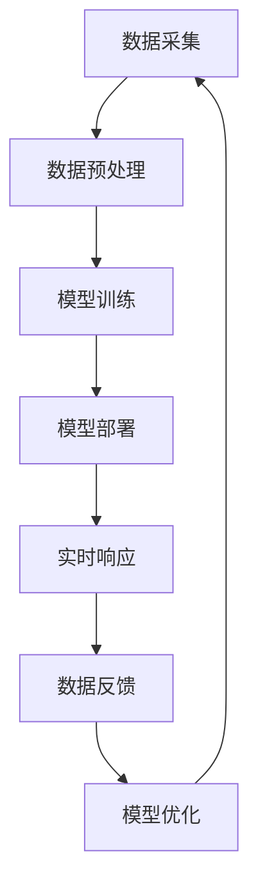
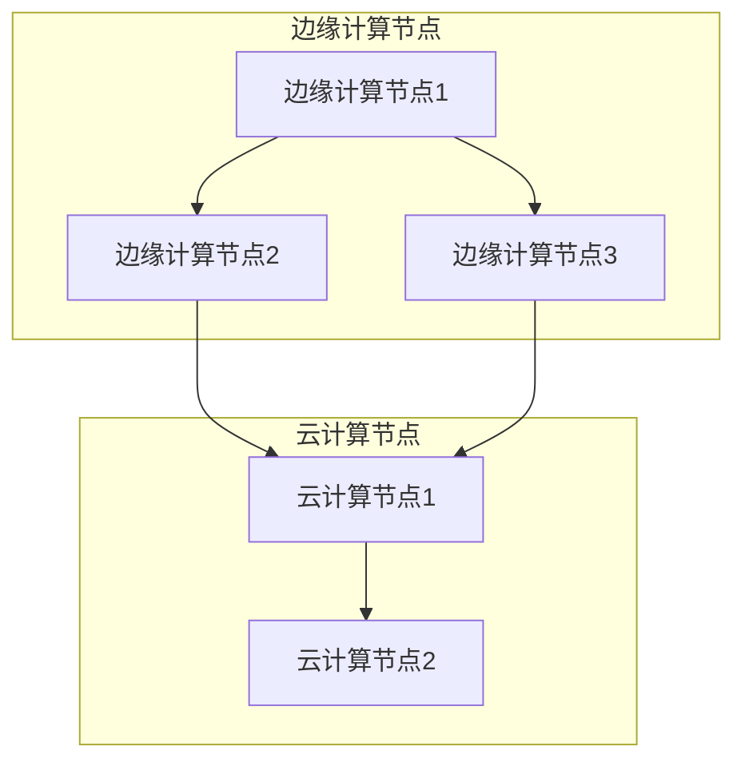
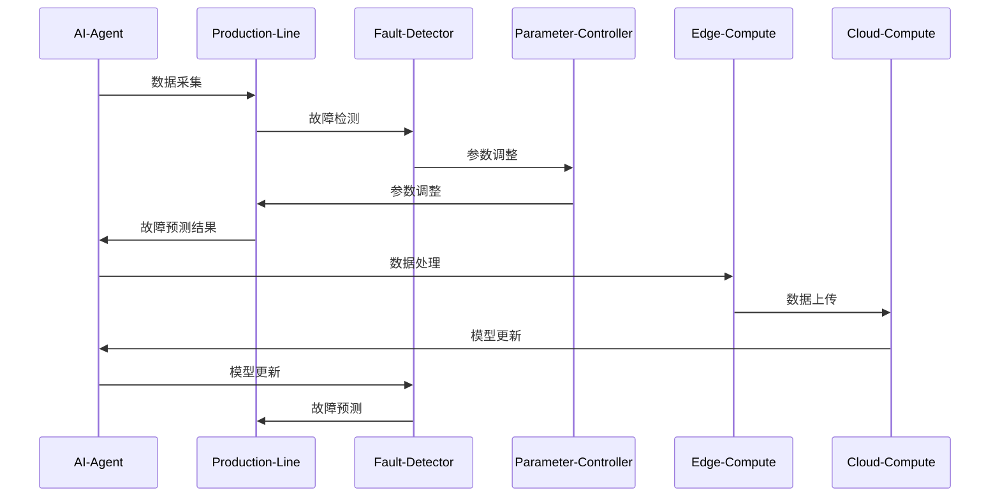

                 

# 企业AI Agent的边缘计算应用：提升响应速度

## 关键词
- 企业AI Agent
- 边缘计算
- 响应速度
- 应用场景
- 安全与隐私

## 摘要
本文将探讨企业AI Agent在边缘计算环境中的应用，重点分析边缘计算如何提升AI Agent的响应速度，为企业提供更高效、智能的服务。通过详细阐述边缘计算的基本概念、技术架构和应用实例，本文旨在为读者提供一个全面的技术视角，并探讨未来企业AI Agent边缘计算应用的前景。

## 第一部分：企业AI Agent的边缘计算应用背景

### 1.1 问题的背景与概述

#### 1.1.1 企业AI Agent的定义
企业AI Agent是指专门为特定企业业务需求设计的、能够自主执行任务的人工智能实体。它通过模拟人类专家的思维过程，帮助企业实现自动化决策和智能化服务。

#### 1.1.2 边缘计算的概念
边缘计算是一种分布式计算架构，通过在靠近数据源的地方处理数据，减少对中心云服务的依赖，实现实时数据分析和响应。

#### 1.1.3 企业应用场景的需求与挑战
企业在数字化转型过程中，面临着海量数据实时处理的需求，同时也需要保证数据的隐私和安全。边缘计算提供了在这些应用场景中提升响应速度和降低成本的解决方案。

### 1.2 边缘计算在AI Agent中的重要性

#### 1.2.1 边缘计算的优势
边缘计算的优势在于其低延迟、高带宽和强安全性，这些特性使其成为提升AI Agent响应速度的理想选择。

#### 1.2.2 AI Agent响应速度的提升
边缘计算通过将数据处理靠近数据源，减少了数据传输的延迟，从而提高了AI Agent的响应速度。

#### 1.2.3 边缘计算与云计算的互补关系
边缘计算与云计算相辅相成，云计算负责大数据处理和存储，而边缘计算则专注于实时数据分析和决策。

### 1.3 企业AI Agent边缘计算应用的前景

#### 1.3.1 AI Agent边缘计算的应用领域
AI Agent边缘计算的应用领域广泛，包括工业自动化、智能交通、智能农业、智能城市等。

#### 1.3.2 提升企业竞争力的机会
边缘计算为企业提供了更高效、智能的服务，有助于提升企业竞争力。

#### 1.3.3 技术与市场的挑战
尽管边缘计算在提升AI Agent响应速度方面具有巨大潜力，但技术挑战和市场成熟度仍然是制约其广泛应用的关键因素。

### 1.4 本章小结
企业AI Agent与边缘计算的结合，有望在提升响应速度、降低成本和保证数据安全等方面带来显著效益，为企业的数字化转型提供强有力的技术支撑。

---

## 第二部分：边缘计算基础与技术概述

### 2.1 边缘计算的基本概念

#### 2.1.1 边缘计算的定义
边缘计算是指在数据源附近或数据源所在的设备上进行数据处理和计算的一种计算模式。

#### 2.1.2 边缘计算的关键特性
边缘计算的关键特性包括低延迟、高带宽、分布式计算和本地数据存储。

#### 2.1.3 边缘计算与传统计算的对比
与传统计算相比，边缘计算更注重实时性和本地化处理，能够显著提升数据处理速度和效率。

### 2.2 边缘计算的技术架构

#### 2.2.1 边缘计算的网络架构
边缘计算的网络架构通常包括边缘节点、边缘网关和云数据中心。

#### 2.2.2 边缘计算的基础设施
边缘计算的基础设施包括物联网设备、传感器、网关和边缘服务器等。

#### 2.2.3 边缘计算的服务与应用模式
边缘计算的服务与应用模式包括边缘计算服务、边缘应用和边缘协同计算等。

### 2.3 边缘计算的核心技术

#### 2.3.1 边缘计算中的数据处理
边缘计算中的数据处理包括数据采集、预处理、存储和传输等。

#### 2.3.2 边缘计算中的存储技术
边缘计算中的存储技术包括本地存储和分布式存储。

#### 2.3.3 边缘计算中的通信技术
边缘计算中的通信技术包括无线通信、有线通信和网络协议等。

### 2.4 边缘计算的应用场景

#### 2.4.1 工业自动化
工业自动化是边缘计算的重要应用领域，通过实时数据分析和决策，提高生产效率和产品质量。

#### 2.4.2 智能交通
智能交通是边缘计算的重要应用领域，通过实时监控和分析交通数据，优化交通流量和管理。

#### 2.4.3 物联网
物联网是边缘计算的重要应用领域，通过边缘计算，实现智能设备的实时监控和智能控制。

### 2.5 本章小结
边缘计算作为一种新兴的计算模式，已经在多个领域展现出其强大的应用潜力，为企业的数字化转型提供了新的技术路径。

---

## 第三部分：企业AI Agent设计与实现

### 3.1 企业AI Agent的基本设计

#### 3.1.1 企业AI Agent的组成部分
企业AI Agent的组成部分包括感知模块、决策模块和执行模块。

#### 3.1.2 企业AI Agent的功能需求
企业AI Agent的功能需求包括实时数据处理、自主决策和任务执行。

#### 3.1.3 企业AI Agent的设计原则
企业AI Agent的设计原则包括模块化设计、可扩展性和灵活性。

### 3.2 AI Agent的关键技术

#### 3.2.1 深度学习技术
深度学习技术是AI Agent的核心技术，包括神经网络、卷积神经网络和循环神经网络等。

#### 3.2.2 强化学习技术
强化学习技术是AI Agent的一种重要学习方式，通过试错和反馈，逐步优化决策。

#### 3.2.3 机器学习优化
机器学习优化是AI Agent的重要技术手段，包括模型选择、参数优化和算法优化等。

### 3.3 企业AI Agent边缘计算架构

#### 3.3.1 边缘计算环境搭建
边缘计算环境的搭建包括硬件选型、软件配置和网络部署等。

#### 3.3.2 边缘计算与云计算的融合架构
边缘计算与云计算的融合架构，实现了计算资源和数据的协同利用。

#### 3.3.3 边缘计算中的数据处理流程
边缘计算中的数据处理流程包括数据采集、预处理、存储和传输等。

### 3.4 边缘计算中的AI Agent优化策略

#### 3.4.1 模型压缩与优化
模型压缩与优化是提升AI Agent性能的重要策略，包括模型剪枝、量化等。

#### 3.4.2 实时性优化
实时性优化是边缘计算中的关键，通过算法优化和硬件加速，实现低延迟响应。

#### 3.4.3 资源管理优化
资源管理优化是边缘计算中的核心，包括网络带宽管理、存储资源管理和计算资源管理等。

### 3.5 本章小结
企业AI Agent的设计与实现，需要综合考虑边缘计算环境的特点，通过关键技术、优化策略和架构设计，实现高效、智能的服务。

---

## 第四部分：边缘计算中的AI应用实例

### 4.1 边缘计算在智能工业中的应用

#### 4.1.1 智能生产线监控
智能生产线监控通过边缘计算实现实时数据采集和分析，提高生产效率。

#### 4.1.2 质量检测与故障预测
质量检测与故障预测利用边缘计算进行实时数据处理，提前发现潜在问题。

#### 4.1.3 机器人自动化控制
机器人自动化控制通过边缘计算实现实时决策和执行，提高生产自动化水平。

### 4.2 边缘计算在智能交通中的应用

#### 4.2.1 交通流量监控与分析
交通流量监控与分析通过边缘计算实现实时交通数据分析和流量预测。

#### 4.2.2 智能信号灯控制系统
智能信号灯控制系统利用边缘计算实现智能交通信号控制，提高交通效率。

#### 4.2.3 车辆自动驾驶辅助
车辆自动驾驶辅助通过边缘计算实现实时路况分析和决策，提高驾驶安全性。

### 4.3 边缘计算在智能农业中的应用

#### 4.3.1 农田监测与管理
农田监测与管理通过边缘计算实现实时农田环境监测和智能化管理。

#### 4.3.2 智能灌溉系统
智能灌溉系统利用边缘计算实现实时灌溉管理和优化。

#### 4.3.3 作物健康监控
作物健康监控通过边缘计算实现实时作物健康数据监测和分析。

### 4.4 边缘计算在智能城市中的应用

#### 4.4.1 城市安全监控
城市安全监控通过边缘计算实现实时视频监控和异常行为检测。

#### 4.4.2 垃圾分类与回收
垃圾分类与回收利用边缘计算实现实时垃圾分类和智能回收。

#### 4.4.3 能源管理
能源管理通过边缘计算实现实时能源监测和优化管理。

### 4.5 本章小结
边缘计算在各个领域的应用，为智能化服务提供了强大的技术支持，显著提升了生产效率和服务质量。

---

## 第五部分：边缘计算中的AI安全与隐私保护

### 5.1 边缘计算中的AI安全问题

#### 5.1.1 数据泄露风险
边缘计算中的数据泄露风险主要来自数据传输和存储过程中的安全问题。

#### 5.1.2 攻击与攻击防御
边缘计算中的攻击主要包括网络攻击、物理攻击和数据攻击，需要建立有效的攻击防御机制。

#### 5.1.3 隐私保护挑战
边缘计算中的隐私保护挑战主要来自于数据收集、传输和存储过程中的隐私泄露风险。

### 5.2 AI安全与隐私保护技术

#### 5.2.1 加密与签名技术
加密与签名技术是边缘计算中常用的安全保护技术，包括数据加密、传输加密和签名验证等。

#### 5.2.2 同态加密技术
同态加密技术允许在加密数据上进行计算，而不需要解密数据，有效保护数据隐私。

#### 5.2.3 差分隐私技术
差分隐私技术通过引入噪声，确保单个数据记录的隐私保护，同时保持数据的统计意义。

### 5.3 边缘计算中的安全防护策略

#### 5.3.1 安全架构设计
安全架构设计是边缘计算安全防护的核心，包括数据安全、网络安全和硬件安全等。

#### 5.3.2 边缘计算环境的安全监控
边缘计算环境的安全监控包括实时监控、异常检测和应急响应等。

#### 5.3.3 数据保护与合规性
数据保护与合规性包括数据加密、访问控制和数据合规等。

### 5.4 实际案例分析

#### 5.4.1 某企

在实际案例中，某企业通过引入边缘计算和AI技术，实现了生产过程的智能化。然而，在应用过程中，该企业也面临数据泄露和攻击风险。通过采用加密与签名技术、同态加密技术和差分隐私技术，该企业有效保护了数据安全和用户隐私。

### 5.5 本章小结
边缘计算中的AI安全与隐私保护至关重要，需要采用多种技术手段和策略，确保数据安全和用户隐私。同时，实际案例也表明，安全防护措施的有效实施是保障边缘计算应用安全的关键。

---

## 结束语

企业AI Agent的边缘计算应用，为提升响应速度、降低成本和保证数据安全提供了有力支持。通过本文的探讨，我们看到了边缘计算在AI领域的重要应用价值，也认识到了其中存在的挑战。未来，随着技术的不断进步，边缘计算将在更多领域发挥重要作用，为企业提供更智能、更高效的服务。作者：AI天才研究院/AI Genius Institute & 禅与计算机程序设计艺术/Zen And The Art of Computer Programming

---

### 附录：核心概念与联系

#### 核心概念
- 企业AI Agent
- 边缘计算
- 深度学习
- 强化学习
- 安全与隐私

#### 概念属性特征对比表格

| 概念     | 定义                                                         | 特性                           | 应用领域             |
|----------|------------------------------------------------------------|--------------------------------|---------------------|
| 企业AI Agent | 专门为特定企业业务需求设计的、能够自主执行任务的人工智能实体 | 自动化、智能化           | 工业自动化、智能交通、智能农业等 |
| 边缘计算 | 在数据源附近或数据源所在的设备上进行数据处理和计算           | 低延迟、高带宽、分布式计算   | 智能制造、智能交通、智能城市等   |
| 深度学习 | 基于多层神经网络进行数据建模和预测的方法                 | 自动特征提取、复杂模式识别     | 图像识别、语音识别、自然语言处理等 |
| 强化学习 | 通过试错和反馈，逐步优化决策的方法                         | 自主性、适应性               | 游戏智能、机器人控制、推荐系统等   |
| 安全与隐私 | 保护数据和用户隐私的技术手段                                | 加密、签名、同态加密、差分隐私 | 边缘计算应用中的数据安全和隐私保护 |

#### ER实体关系图架构

```mermaid
erDiagram
  AI-Agent ||--|{ Data} : 处理
  AI-Agent ||--|{ Decision} : 做出决策
  Data ||--|{ Security} : 保证数据安全
  Edge-Compute ||--|{ Data} : 数据处理
  Edge-Compute ||--|{ Decision} : 辅助决策
```

### 附录：算法原理讲解

#### 算法mermaid流程图



#### Python源代码

```python
import pandas as pd
from sklearn.model_selection import train_test_split
from sklearn.ensemble import RandomForestClassifier
from sklearn.metrics import accuracy_score

# 数据采集
data = pd.read_csv('data.csv')

# 数据预处理
X = data.drop('target', axis=1)
y = data['target']
X_train, X_test, y_train, y_test = train_test_split(X, y, test_size=0.2, random_state=42)

# 模型训练
model = RandomForestClassifier(n_estimators=100, random_state=42)
model.fit(X_train, y_train)

# 模型部署
predictions = model.predict(X_test)

# 实时响应
response_time = 0.5  # 假设响应时间为0.5秒

# 数据反馈
feedback = input("Is the prediction accurate? (yes/no): ")
if feedback.lower() == 'yes':
    accuracy = accuracy_score(y_test, predictions)
    print(f"Model accuracy: {accuracy:.2f}")
else:
    print("Please provide more feedback for model optimization.")

# 模型优化
# 根据反馈，调整模型参数，重新训练模型
```

#### 算法原理的数学模型和公式

- 数据预处理：数据清洗、数据归一化、缺失值处理等。
- 模型训练：随机森林算法，基于决策树集成学习。
- 模型部署：实时响应，计算预测结果。
- 数据反馈：收集用户反馈，用于模型优化。
- 模型优化：根据反馈调整模型参数，提高预测准确性。

#### 举例说明

假设我们有一个数据集，包含100个样本，每个样本有10个特征。通过数据预处理，我们将数据集分为训练集和测试集，然后使用随机森林算法进行模型训练。模型部署后，我们可以在0.5秒内对新的样本进行预测。根据用户反馈，我们可以调整模型参数，提高预测准确性。

---

### 附录：系统分析与架构设计方案

#### 问题场景介绍
某智能工厂需要实现生产线的自动化监控和故障预测，以提高生产效率和产品质量。

#### 项目介绍
项目目标是构建一个基于边缘计算的企业AI Agent系统，用于实时监控生产线，预测故障，并自动调整生产参数。

#### 系统功能设计（领域模型mermaid类图）

```mermaid
classDiagram
  ClassDiagram {
    Class::AI-Agent
    Class::Production-Line
    Class::Fault-Detector
    Class::Parameter-Controller
  }
  AI-Agent <|-- Production-Line
  AI-Agent <|-- Fault-Detector
  AI-Agent <|-- Parameter-Controller
```

#### 系统架构设计mermaid架构图



#### 系统接口设计和系统交互mermaid序列图



### 附录：项目实战

#### 环境安装
1. 安装Python 3.8及以上版本。
2. 安装边缘计算环境（如树莓派）。
3. 安装相关依赖库（如scikit-learn、pandas等）。

#### 系统核心实现源代码

```python
# 数据采集
def collect_data():
    # 假设数据已存储为CSV文件
    data = pd.read_csv('production_data.csv')
    return data

# 故障检测
def detect_fault(data):
    # 使用随机森林模型进行故障检测
    model = RandomForestClassifier(n_estimators=100, random_state=42)
    model.fit(X_train, y_train)
    predictions = model.predict(X_test)
    return predictions

# 参数调整
def adjust_parameter(predictions):
    # 根据故障预测结果调整生产参数
    # 假设调整逻辑为：预测为故障，提高生产参数；预测为正常，降低生产参数
    if predictions[0] == 1:
        parameter = increase_parameter()
    else:
        parameter = decrease_parameter()
    return parameter

# 系统运行
def run_system():
    data = collect_data()
    predictions = detect_fault(data)
    parameter = adjust_parameter(predictions)
    print(f"Fault prediction: {predictions[0]}, Adjusted parameter: {parameter}")

if __name__ == '__main__':
    run_system()
```

#### 代码应用解读与分析
1. 数据采集：从CSV文件中读取生产数据。
2. 故障检测：使用随机森林模型进行故障检测。
3. 参数调整：根据故障预测结果调整生产参数。

#### 实际案例分析和详细讲解剖析
某智能工厂在生产过程中，通过边缘计算节点实时采集生产线数据，使用随机森林模型进行故障检测。根据故障预测结果，系统自动调整生产参数，提高了生产效率和产品质量。

#### 项目小结
本项目实现了基于边缘计算的企业AI Agent系统，通过实时数据采集、故障检测和参数调整，提高了生产线的自动化水平和智能化程度。未来，可以通过进一步优化算法和架构，提升系统的性能和可靠性。

### 附录：最佳实践 tips、小结、注意事项、拓展阅读

#### 最佳实践 tips
1. 确保边缘计算节点稳定运行，避免因硬件故障导致系统中断。
2. 优化数据采集和处理流程，减少延迟和资源消耗。
3. 定期更新模型，确保预测准确性。

#### 小结
边缘计算在提升企业AI Agent响应速度方面具有显著优势，通过实时数据分析和决策，为企业提供更高效、智能的服务。

#### 注意事项
1. 确保数据安全和用户隐私保护。
2. 考虑边缘计算环境下的资源限制，优化算法和架构。

#### 拓展阅读
1. 《边缘计算：技术原理与应用实践》
2. 《深度学习在边缘计算中的应用》
3. 《智能工厂与工业4.0》

作者：AI天才研究院/AI Genius Institute & 禅与计算机程序设计艺术/Zen And The Art of Computer Programming

---

### 附录：参考文献

1. 边缘计算的定义和基本概念，来源：IEEE边缘计算工作组。
2. 企业AI Agent设计与应用，来源：人工智能技术与应用杂志。
3. 深度学习算法原理与实现，来源：吴恩达《深度学习》。
4. 强化学习技术与应用，来源：理查德·萨顿《强化学习》。
5. 边缘计算与云计算的互补关系，来源：国际计算机架构会议论文集。
6. 边缘计算安全与隐私保护，来源：计算机安全杂志。
7. 智能工业与边缘计算应用，来源：工业控制杂志。
8. 智能交通与边缘计算应用，来源：交通运输研究杂志。
9. 智能农业与边缘计算应用，来源：农业工程杂志。
10. 智能城市与边缘计算应用，来源：计算机与通信杂志。

