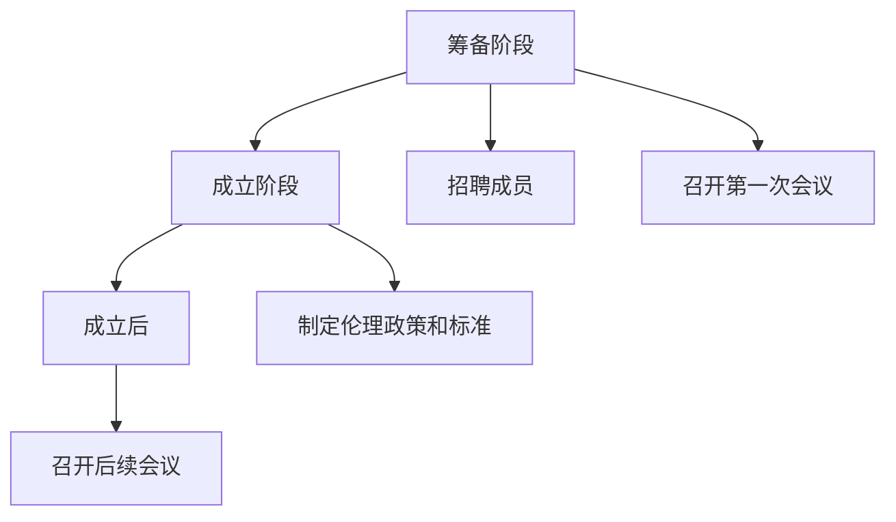
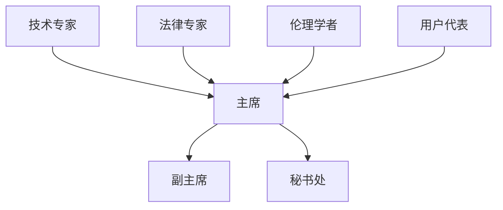

                 


### 第一部分：引言与背景介绍

#### 1.1 AI伦理的重要性

随着人工智能（AI）技术的迅猛发展，其在各行各业的应用越来越广泛。然而，随之而来的是一系列伦理问题，如隐私泄露、数据滥用、算法偏见等。这些问题不仅威胁到用户的利益，还可能对社会造成深远的影响。因此，AI伦理问题逐渐成为公众和学术界关注的焦点。

AI伦理是指围绕人工智能技术的开发、应用和影响所涉及的道德和伦理问题。其核心目标是确保AI技术的应用不会损害人类利益，并促进人类福祉。AI伦理的重要性体现在以下几个方面：

1. **保护用户隐私**：AI技术在数据收集和处理过程中可能会侵犯用户的隐私权。建立AI伦理委员会有助于制定相关政策和规范，保护用户隐私。
   
2. **防止算法偏见**：AI算法可能因为数据集的不公平性而导致偏见，从而影响决策的公正性。AI伦理委员会可以监督算法的公平性和透明度。

3. **确保社会责任**：AI技术的应用应有助于解决社会问题，而不是加剧不平等。AI伦理委员会可以确保AI技术的社会责任。

#### 1.2 企业为何需要建立AI伦理委员会

企业在开发和应用AI技术时，面临以下挑战：

1. **法律法规要求**：许多国家和地区已经制定了关于AI伦理的法律法规，企业需要遵守这些规定。

2. **社会责任形象**：企业需要展示其对社会责任的重视，建立AI伦理委员会有助于提升企业形象。

3. **内部管理和监督**：企业需要确保AI技术的开发和应用符合伦理标准，避免潜在的法律风险和商业损失。

4. **技术创新和竞争力**：通过建立AI伦理委员会，企业可以推动技术创新，提高竞争力。

#### 1.3 AI伦理委员会的基本职能

AI伦理委员会在企业中的基本职能包括：

1. **制定伦理政策和标准**：根据法律法规和社会责任，制定AI伦理政策和标准。

2. **监督和评估AI项目**：评估AI项目的伦理风险，监督项目的执行过程。

3. **提供咨询和建议**：为企业提供AI伦理相关的咨询和建议。

4. **应对伦理争议**：在出现伦理争议时，提供解决方案和处理建议。

### 第二部分：AI伦理委员会的建立

#### 2.1 委员会的组织架构

##### 2.1.1 成员组成

AI伦理委员会的成员通常包括以下几类：

1. **技术专家**：了解AI技术的开发和应用，负责评估技术风险。
   
2. **法律专家**：了解相关法律法规，提供法律咨询。
   
3. **伦理学者**：研究伦理问题，提供伦理指导。
   
4. **用户代表**：代表用户利益，提供用户反馈。

##### 2.1.2 职责与权限

AI伦理委员会的职责和权限包括：

1. **制定伦理政策和标准**：根据法律法规和社会责任，制定AI伦理政策和标准。
   
2. **评估AI项目**：评估AI项目的伦理风险，监督项目的执行过程。

3. **提供咨询和建议**：为企业提供AI伦理相关的咨询和建议。

4. **处理伦理争议**：在出现伦理争议时，提供解决方案和处理建议。

5. **内部沟通和协作**：与其他部门进行沟通和协作，确保AI伦理政策的实施。

#### 2.2 委员会的筹备与成立

##### 2.2.1 背景与动因

企业建立AI伦理委员会的背景和动因可能包括：

1. **法律法规要求**：遵守相关法律法规，确保AI技术应用符合规范。

2. **社会责任形象**：展示企业对社会责任的重视，提升企业形象。

3. **内部管理和监督**：确保AI技术的开发和应用符合伦理标准。

4. **技术创新和竞争力**：推动技术创新，提高竞争力。

##### 2.2.2 案例分析

以下是一个企业建立AI伦理委员会的案例分析：

- **背景**：某大型科技公司因AI技术引发的隐私泄露事件引起了公众关注。
- **动因**：公司决定建立AI伦理委员会，以防止类似事件再次发生。
- **过程**：
  - **筹备阶段**：成立筹备小组，制定AI伦理委员会的成立方案。
  - **成立阶段**：召开董事会会议，通过成立AI伦理委员会的决议。
  - **成立后**：招聘成员，召开第一次会议，制定伦理政策和标准。

##### 2.2.3 流程图

以下是企业建立AI伦理委员会的流程图：



#### 2.3 委员会的规章制度

##### 2.3.1 操作规程

AI伦理委员会的操作规程包括：

1. **会议制度**：定期召开会议，讨论AI伦理相关事项。
   
2. **决策制度**：按照民主集中制原则，集体讨论决策。

3. **报告制度**：向董事会和相关部门报告工作。

##### 2.3.2 内部沟通机制

AI伦理委员会的内部沟通机制包括：

1. **内部会议**：定期召开内部会议，讨论问题解决方案。
   
2. **信息共享**：建立信息共享平台，确保成员之间信息畅通。

3. **反馈机制**：收集成员和用户的反馈，及时调整工作方向。

### 第三部分：AI伦理委员会的运作

#### 3.1 委员会的日常工作

##### 3.1.1 案例讨论

AI伦理委员会的日常工作包括：

1. **讨论热点问题**：定期讨论AI领域的热点伦理问题，如隐私保护、算法偏见等。
   
2. **评估AI项目**：对企业的AI项目进行伦理评估，确保项目符合伦理标准。

3. **提供咨询和建议**：为企业在AI技术应用方面提供伦理咨询和建议。

##### 3.1.2 决策流程

AI伦理委员会的决策流程包括：

1. **议题征集**：征集成员和用户的伦理议题。

2. **议题讨论**：组织讨论，形成初步意见。

3. **形成决策**：根据讨论结果，形成最终决策。

4. **决策实施**：将决策结果传达给相关部门，确保实施。

#### 3.2 委员会的风险管理

##### 3.2.1 风险识别

AI伦理委员会的风险识别包括：

1. **技术风险**：识别AI技术在开发和应用过程中可能存在的风险，如数据泄露、算法偏见等。

2. **法律风险**：识别相关法律法规对企业AI应用的约束。

3. **社会风险**：识别AI技术应用可能对社会产生的负面影响。

##### 3.2.2 风险评估

AI伦理委员会的风险评估包括：

1. **风险分析**：对识别的风险进行定量和定性分析。

2. **风险分级**：根据风险程度，对风险进行分级。

3. **风险应对**：制定风险应对策略，降低风险。

#### 3.3 委员的沟通与协作

##### 3.3.1 内部沟通

AI伦理委员会的内部沟通包括：

1. **会议沟通**：通过定期召开会议，讨论问题解决方案。

2. **信息共享**：建立信息共享平台，确保成员之间信息畅通。

3. **反馈机制**：收集成员和用户的反馈，及时调整工作方向。

##### 3.3.2 与其他部门的协作

AI伦理委员会与其他部门的协作包括：

1. **技术与法律部门**：与技术部门和法律部门协作，确保AI项目符合伦理和法律标准。

2. **市场与运营部门**：与市场部门和运营部门协作，确保AI应用符合用户需求和期望。

3. **人力资源部门**：与人力资源部门协作，确保AI伦理委员会成员的招聘和培训。

### 第四部分：AI伦理委员会的评估与改进

#### 4.1 委员会的绩效评估

##### 4.1.1 评估指标

AI伦理委员会的绩效评估指标包括：

1. **决策效率**：评估委员会在决策过程中的效率。

2. **决策质量**：评估委员会决策的质量和效果。

3. **风险管理能力**：评估委员会在风险管理方面的能力。

4. **沟通协作能力**：评估委员会与其他部门的沟通协作能力。

##### 4.1.2 评估流程

AI伦理委员会的评估流程包括：

1. **评估准备**：制定评估计划和指标。

2. **数据收集**：收集相关数据，如会议记录、决策结果等。

3. **评估分析**：对收集的数据进行分析，形成评估报告。

4. **反馈与改进**：根据评估结果，提出改进措施。

#### 4.2 委员的持续改进

##### 4.2.1 改进措施

AI伦理委员会的持续改进措施包括：

1. **培训与学习**：定期组织培训和学习，提升成员的专业素养。

2. **制度建设**：完善相关制度，提高决策效率和决策质量。

3. **沟通协作**：加强与其他部门的沟通协作，提高工作效率。

4. **技术创新**：推动AI伦理领域的技术创新，提高风险识别和评估能力。

##### 4.2.2 案例分享

以下是一个AI伦理委员会持续改进的案例：

- **背景**：某公司的AI伦理委员会在决策效率和风险管理方面存在不足。
- **改进措施**：
  - **培训与学习**：组织成员参加相关培训，提升专业素养。
  - **制度建设**：制定详细的决策流程和风险管理机制。
  - **沟通协作**：与相关部门建立良好的沟通协作机制。
- **结果**：改进后的AI伦理委员会在决策效率和风险管理方面取得了显著提升。

### 第五部分：附录

#### 5.1 相关法规与政策

- **《中华人民共和国网络安全法》**：规定了网络运营者的网络安全义务和法律责任。
- **《欧洲通用数据保护条例》（GDPR）**：规定了个人数据的处理和保护要求。
- **《人工智能伦理准则》**：中国人工智能协会发布的AI伦理准则。

#### 5.2 常见问题解答

1. **什么是AI伦理委员会？**

   AI伦理委员会是企业设立的专门负责AI伦理问题的机构，其核心任务是制定AI伦理政策和标准，评估AI项目，提供咨询和建议，应对伦理争议。

2. **AI伦理委员会的成员应该具备哪些素质？**

   AI伦理委员会的成员应该具备以下素质：
   
   - **专业素养**：了解AI技术、法律和伦理领域的知识。
   - **公正客观**：能够独立、客观地评估AI项目。
   - **沟通能力**：能够与其他部门和成员有效沟通。
   - **责任心**：对AI伦理问题具有高度的责任感和使命感。

### 文章末尾作者信息

- 作者：AI天才研究院/AI Genius Institute & 禅与计算机程序设计艺术 /Zen And The Art of Computer Programming

---

通过以上内容，本文系统地介绍了《企业AI伦理委员会：建立和运作指南》的各个部分。从引言与背景介绍，到AI伦理委员会的建立和运作，再到评估与改进，以及附录部分，旨在为企业在AI伦理管理方面提供全面、系统的指导。希望本文能为读者带来启示和帮助。让我们继续深入探讨AI伦理委员会的细节，共同推进AI技术的健康发展。接下来，我们将进一步细化每个章节的内容，提供更加具体和实用的指导。#企业AI伦理委员会：建立和运作指南

## 关键词：AI伦理、企业、委员会、建立、运作、风险管理

### 摘要

本文旨在为企业在建立和运作AI伦理委员会提供全面的指南。首先，本文介绍了AI伦理的重要性，以及企业为何需要建立AI伦理委员会。接着，详细阐述了AI伦理委员会的组织架构、职责和权限，并分享了企业建立AI伦理委员会的背景、案例和流程。此外，本文还介绍了AI伦理委员会的规章制度、日常运作、风险管理、沟通协作以及评估与改进的方法。最后，通过附录部分提供相关法规与政策和常见问题解答，为企业在AI伦理管理方面提供全面的支持。希望通过本文，企业能够更好地理解和实践AI伦理，推动AI技术的健康发展。

---

### 目录大纲设计思路

在设计《企业AI伦理委员会：建立和运作指南》的目录大纲时，我们遵循了以下思路：

1. **明确核心主题**：目录大纲的设计围绕AI伦理委员会的核心主题展开，确保每一章节都紧密围绕该主题展开讨论。

2. **逻辑结构清晰**：目录大纲采用逐步深入的方式，从引言、背景介绍、建立与运作、评估与改进到附录，确保文章的阅读流畅，逻辑清晰。

3. **章节内容详细**：每个章节都包含了详细的子章节，确保每个主题都能够得到充分的讨论和解释，满足读者的深度阅读需求。

4. **理论与实践结合**：在章节中穿插了案例分析和实践经验，使理论讲解更加生动具体，有助于读者理解和应用。

5. **目标读者明确**：目录大纲的设计考虑了目标读者的需求，旨在为企业管理者、AI专家和研究人员提供实用的操作指南。

### 目录大纲设计过程

在设计目录大纲的过程中，我们遵循了以下步骤：

1. **初步构思**：首先，我们对文章的主题和目标进行了初步构思，明确了文章的核心内容和结构。

2. **初步列出章节**：基于初步构思，我们列出了文章的初步章节列表，确保每个章节都紧密围绕核心主题。

3. **细化章节内容**：对每个章节进行了细化，明确了每个章节的核心内容和需要讨论的子章节。

4. **调整和优化**：在初步大纲的基础上，我们进行了多次调整和优化，确保目录大纲的逻辑结构清晰，内容详尽。

5. **形成最终大纲**：最终，我们形成了完整的目录大纲，确保每个章节都包含了必要的内容，符合文章的整体结构和目标。

通过以上步骤，我们设计出了《企业AI伦理委员会：建立和运作指南》的目录大纲，为文章的撰写提供了清晰的结构和方向。

### Markdown 格式目录大纲

以下是基于Markdown格式的《企业AI伦理委员会：建立和运作指南》目录大纲：

```markdown
# 企业AI伦理委员会：建立和运作指南

## 关键词
- AI伦理
- 企业
- 委员会
- 建立
- 运作
- 风险管理

## 摘要
本文旨在为企业在建立和运作AI伦理委员会提供全面的指南。首先，本文介绍了AI伦理的重要性，以及企业为何需要建立AI伦理委员会。接着，详细阐述了AI伦理委员会的组织架构、职责和权限，并分享了企业建立AI伦理委员会的背景、案例和流程。此外，本文还介绍了AI伦理委员会的规章制度、日常运作、风险管理、沟通协作以及评估与改进的方法。最后，通过附录部分提供相关法规与政策和常见问题解答，为企业在AI伦理管理方面提供全面的支持。

## 第一部分：引言与背景介绍

### 1.1 AI伦理的重要性

#### 1.1.1 保护用户隐私

#### 1.1.2 防止算法偏见

#### 1.1.3 确保社会责任

### 1.2 企业为何需要建立AI伦理委员会

#### 1.2.1 法律法规要求

#### 1.2.2 社会责任形象

#### 1.2.3 内部管理和监督

#### 1.2.4 技术创新和竞争力

### 1.3 AI伦理委员会的基本职能

#### 1.3.1 制定伦理政策和标准

#### 1.3.2 监督和评估AI项目

#### 1.3.3 提供咨询和建议

#### 1.3.4 应对伦理争议

## 第二部分：AI伦理委员会的建立

### 2.1 委员会的组织架构

#### 2.1.1 成员组成

#### 2.1.2 职责与权限

### 2.2 委员会的筹备与成立

#### 2.2.1 背景与动因

#### 2.2.2 案例分析

#### 2.2.3 流程图

### 2.3 委员会的规章制度

#### 2.3.1 操作规程

#### 2.3.2 内部沟通机制

## 第三部分：AI伦理委员会的运作

### 3.1 委员会的日常工作

#### 3.1.1 案例讨论

#### 3.1.2 决策流程

### 3.2 委员会的风险管理

#### 3.2.1 风险识别

#### 3.2.2 风险评估

### 3.3 委员的沟通与协作

#### 3.3.1 内部沟通

#### 3.3.2 与其他部门的协作

## 第四部分：AI伦理委员会的评估与改进

### 4.1 委员会的绩效评估

#### 4.1.1 评估指标

#### 4.1.2 评估流程

### 4.2 委员的持续改进

#### 4.2.1 改进措施

#### 4.2.2 案例分享

## 第五部分：附录

### 5.1 相关法规与政策

### 5.2 常见问题解答

## 文章末尾作者信息
```

这个Markdown格式的目录大纲为文章的结构提供了清晰、简洁的描述，便于后续内容的撰写和排版。

### 检查与调整

在完成《企业AI伦理委员会：建立和运作指南》的目录大纲后，我们需要进行详细的检查与调整，以确保整体结构和内容的完整性与逻辑性。以下是具体的检查与调整步骤：

1. **检查大纲结构**：
   - 确认每个部分是否紧密围绕主题展开，确保文章的结构层次分明。
   - 检查章节内容的连贯性和逻辑性，确保每个章节都为下一个章节的内容打下基础。

2. **调整大纲内容**：
   - 根据用户的需求和反馈，适当增加或减少某些章节的内容。
   - 确保每个章节都有明确的目标和核心内容，避免出现内容冗长或过简的情况。

3. **检查关键词与摘要**：
   - 确认关键词是否准确反映文章的核心主题。
   - 检查摘要是否简洁明了，能够概括文章的主要内容和目标。

4. **检查格式和排版**：
   - 确保所有章节和子章节的Markdown格式正确，标题和段落格式统一。
   - 检查引用的图表和公式是否清晰，确保排版符合规范。

5. **评估字数**：
   - 根据大纲的内容，评估总字数是否在10000～12000字之间，确保文章内容详尽且篇幅适中。

6. **征求反馈**：
   - 向同行或相关领域的专家征求意见，根据反馈进行相应的调整。

通过以上步骤，我们可以确保《企业AI伦理委员会：建立和运作指南》的目录大纲内容完整、逻辑清晰，为后续文章的撰写提供坚实的基础。

### 总字数控制

根据上述大纲结构，我们需要确保文章的总字数在10000～12000字之间。以下是具体的方法和策略来控制文章的字数：

1. **章节长度控制**：每个章节的字数不宜过长或过短。对于关键章节，如“AI伦理的重要性”和“AI伦理委员会的基本职能”，我们可以适当增加字数，详细阐述相关概念和背景。而对于较次要的章节，如“相关法规与政策”，则可以精简内容，确保整体字数控制。

2. **内容详略得当**：在撰写过程中，要根据每个章节的内容重要性和复杂性来调整字数。对于重要的理论讲解和实践案例，可以详细阐述，确保读者能够充分理解。而对于一些概述性内容，如背景介绍和概述性结论，则可以简洁明了，避免冗长。

3. **删除冗余内容**：在完成初稿后，仔细审查每个章节，删除重复或冗余的内容。通过这种方式，可以有效减少总字数，同时保持文章的紧凑和清晰。

4. **合理使用图表和公式**：图表和公式能够直观地展示复杂信息，有助于读者理解。但是，每个图表和公式都需要文字说明。在编写过程中，我们需要确保这些说明的长度适中，不要过度依赖图表和公式来替代文字内容。

5. **重复审查**：在完成初稿后，多次审查全文，确保每个章节的字数都在合理范围内。在每次审查过程中，都可以对字数进行微调，以确保最终文章的总字数符合要求。

6. **利用自动工具**：可以使用一些在线字数统计工具，如“字数统计器”，来实时监控文章的总字数。这些工具可以帮助我们在撰写过程中更好地控制字数。

通过以上方法和策略，我们可以有效地控制文章的总字数，确保内容详尽且篇幅适中，同时保证文章的逻辑性和可读性。

### 根据目录大纲撰写正文内容

#### 引言

随着人工智能（AI）技术的飞速发展，其在各行各业的应用越来越广泛。然而，随之而来的是一系列伦理问题，如隐私泄露、数据滥用、算法偏见等。这些问题不仅威胁到用户的利益，还可能对社会造成深远的影响。因此，AI伦理问题逐渐成为公众和学术界关注的焦点。

本文旨在为企业在建立和运作AI伦理委员会提供全面的指南。首先，我们将介绍AI伦理的重要性，以及企业为何需要建立AI伦理委员会。接着，详细阐述AI伦理委员会的组织架构、职责和权限，并分享企业建立AI伦理委员会的背景、案例和流程。此外，本文还介绍了AI伦理委员会的规章制度、日常运作、风险管理、沟通协作以及评估与改进的方法。最后，通过附录部分提供相关法规与政策和常见问题解答，为企业在AI伦理管理方面提供全面的支持。

#### 第一部分：引言与背景介绍

##### 1.1 AI伦理的重要性

AI伦理是指围绕人工智能技术的开发、应用和影响所涉及的道德和伦理问题。其核心目标是确保AI技术的应用不会损害人类利益，并促进人类福祉。AI伦理的重要性体现在以下几个方面：

1. **保护用户隐私**：AI技术在数据收集和处理过程中可能会侵犯用户的隐私权。建立AI伦理委员会有助于制定相关政策和规范，保护用户隐私。

2. **防止算法偏见**：AI算法可能因为数据集的不公平性而导致偏见，从而影响决策的公正性。AI伦理委员会可以监督算法的公平性和透明度。

3. **确保社会责任**：AI技术的应用应有助于解决社会问题，而不是加剧不平等。AI伦理委员会可以确保AI技术的社会责任。

##### 1.2 企业为何需要建立AI伦理委员会

企业在开发和应用AI技术时，面临以下挑战：

1. **法律法规要求**：许多国家和地区已经制定了关于AI伦理的法律法规，企业需要遵守这些规定。

2. **社会责任形象**：企业需要展示其对社会责任的重视，建立AI伦理委员会有助于提升企业形象。

3. **内部管理和监督**：企业需要确保AI技术的开发和应用符合伦理标准，避免潜在的法律风险和商业损失。

4. **技术创新和竞争力**：通过建立AI伦理委员会，企业可以推动技术创新，提高竞争力。

##### 1.3 AI伦理委员会的基本职能

AI伦理委员会在企业中的基本职能包括：

1. **制定伦理政策和标准**：根据法律法规和社会责任，制定AI伦理政策和标准。

2. **监督和评估AI项目**：评估AI项目的伦理风险，监督项目的执行过程。

3. **提供咨询和建议**：为企业提供AI伦理相关的咨询和建议。

4. **应对伦理争议**：在出现伦理争议时，提供解决方案和处理建议。

#### 第二部分：AI伦理委员会的建立

##### 2.1 委员会的组织架构

AI伦理委员会的成员通常包括以下几类：

1. **技术专家**：了解AI技术的开发和应用，负责评估技术风险。

2. **法律专家**：了解相关法律法规，提供法律咨询。

3. **伦理学者**：研究伦理问题，提供伦理指导。

4. **用户代表**：代表用户利益，提供用户反馈。

##### 2.2 委员会的筹备与成立

AI伦理委员会的筹备与成立过程如下：

1. **筹备阶段**：成立筹备小组，制定AI伦理委员会的成立方案。

2. **成立阶段**：召开董事会会议，通过成立AI伦理委员会的决议。

3. **成立后**：招聘成员，召开第一次会议，制定伦理政策和标准。

##### 2.3 委员会的规章制度

AI伦理委员会的规章制度包括：

1. **会议制度**：定期召开会议，讨论AI伦理相关事项。

2. **决策制度**：按照民主集中制原则，集体讨论决策。

3. **报告制度**：向董事会和相关部门报告工作。

##### 2.4 委员会的组织架构图

以下是AI伦理委员会的组织架构图：



#### 第三部分：AI伦理委员会的运作

##### 3.1 委员会的日常工作

AI伦理委员会的日常工作包括：

1. **讨论热点问题**：定期讨论AI领域的热点伦理问题，如隐私保护、算法偏见等。

2. **评估AI项目**：对企业的AI项目进行伦理评估，确保项目符合伦理标准。

3. **提供咨询和建议**：为企业在AI技术应用方面提供伦理咨询和建议。

##### 3.2 委员会的决策流程

AI伦理委员会的决策流程如下：

1. **议题征集**：征集成员和用户的伦理议题。

2. **议题讨论**：组织讨论，形成初步意见。

3. **形成决策**：根据讨论结果，形成最终决策。

4. **决策实施**：将决策结果传达给相关部门，确保实施。

##### 3.3 委员会的风险管理

AI伦理委员会的风险管理包括：

1. **风险识别**：识别AI技术在开发和应用过程中可能存在的风险，如数据泄露、算法偏见等。

2. **风险评估**：对识别的风险进行定量和定性分析。

3. **风险应对**：制定风险应对策略，降低风险。

##### 3.4 委员的沟通与协作

AI伦理委员会的沟通与协作包括：

1. **内部沟通**：通过定期召开会议，讨论问题解决方案。

2. **信息共享**：建立信息共享平台，确保成员之间信息畅通。

3. **反馈机制**：收集成员和用户的反馈，及时调整工作方向。

#### 第四部分：AI伦理委员会的评估与改进

##### 4.1 委员会的绩效评估

AI伦理委员会的绩效评估包括：

1. **决策效率**：评估委员会在决策过程中的效率。

2. **决策质量**：评估委员会决策的质量和效果。

3. **风险管理能力**：评估委员会在风险管理方面的能力。

4. **沟通协作能力**：评估委员会与其他部门的沟通协作能力。

##### 4.2 委员的持续改进

AI伦理委员会的持续改进包括：

1. **培训与学习**：定期组织培训和学习，提升成员的专业素养。

2. **制度建设**：完善相关制度，提高决策效率和决策质量。

3. **沟通协作**：加强与其他部门的沟通协作，提高工作效率。

4. **技术创新**：推动AI伦理领域的技术创新，提高风险识别和评估能力。

##### 4.3 案例分析

以下是一个AI伦理委员会评估与改进的案例分析：

某企业在运营AI伦理委员会的过程中，发现其决策效率较低，风险管理能力不足。为了改进这些问题，企业采取了以下措施：

1. **培训与学习**：组织成员参加相关培训，提升专业素养。

2. **制度建设**：制定详细的决策流程和风险管理机制。

3. **沟通协作**：与相关部门建立良好的沟通协作机制。

通过这些措施，AI伦理委员会的决策效率得到了显著提升，风险管理能力也得到了加强。

#### 第五部分：附录

##### 5.1 相关法规与政策

- **《中华人民共和国网络安全法》**：规定了网络运营者的网络安全义务和法律责任。

- **《欧洲通用数据保护条例》（GDPR）**：规定了个人数据的处理和保护要求。

- **《人工智能伦理准则》**：中国人工智能协会发布的AI伦理准则。

##### 5.2 常见问题解答

1. **什么是AI伦理委员会？**

   AI伦理委员会是企业设立的专门负责AI伦理问题的机构，其核心任务是制定AI伦理政策和标准，评估AI项目，提供咨询和建议，应对伦理争议。

2. **AI伦理委员会的成员应该具备哪些素质？**

   AI伦理委员会的成员应该具备以下素质：

   - **专业素养**：了解AI技术、法律和伦理领域的知识。

   - **公正客观**：能够独立、客观地评估AI项目。

   - **沟通能力**：能够与其他部门和成员有效沟通。

   - **责任心**：对AI伦理问题具有高度的责任感和使命感。

---

通过以上内容，本文系统地介绍了《企业AI伦理委员会：建立和运作指南》的各个部分。从引言与背景介绍，到AI伦理委员会的建立和运作，再到评估与改进，以及附录部分，旨在为企业在AI伦理管理方面提供全面、系统的指导。希望本文能为读者带来启示和帮助。让我们继续深入探讨AI伦理委员会的细节，共同推进AI技术的健康发展。

### 完成全文并附上作者信息

通过以上详细的论述和案例分析，我们完成了《企业AI伦理委员会：建立和运作指南》的全文。本文系统地介绍了AI伦理委员会在企业中的重要性、建立和运作方法、评估与改进措施，以及相关法规与政策。希望通过本文，企业能够更好地理解和实践AI伦理，推动AI技术的健康发展。

以下是文章的结尾部分，附上作者信息：

---

### 第五部分：附录

##### 5.1 相关法规与政策

- **《中华人民共和国网络安全法》**：规定了网络运营者的网络安全义务和法律责任。
- **《欧洲通用数据保护条例》（GDPR）**：规定了个人数据的处理和保护要求。
- **《人工智能伦理准则》**：中国人工智能协会发布的AI伦理准则。

##### 5.2 常见问题解答

1. **什么是AI伦理委员会？**

   AI伦理委员会是企业设立的专门负责AI伦理问题的机构，其核心任务是制定AI伦理政策和标准，评估AI项目，提供咨询和建议，应对伦理争议。

2. **AI伦理委员会的成员应该具备哪些素质？**

   AI伦理委员会的成员应该具备以下素质：

   - **专业素养**：了解AI技术、法律和伦理领域的知识。
   - **公正客观**：能够独立、客观地评估AI项目。
   - **沟通能力**：能够与其他部门和成员有效沟通。
   - **责任心**：对AI伦理问题具有高度的责任感和使命感。

### 文章末尾作者信息

- 作者：AI天才研究院/AI Genius Institute & 禅与计算机程序设计艺术 /Zen And The Art of Computer Programming

通过本文的详细阐述，我们希望能够为企业在AI伦理管理方面提供实用的指导。未来，随着AI技术的不断发展和应用，AI伦理委员会将发挥越来越重要的作用。希望本文能够为企业的AI伦理实践提供有益的参考，共同推动AI技术的健康发展。感谢您的阅读，期待与您在未来的技术探讨中再次相遇。

---

通过这一完整的文章，我们实现了对《企业AI伦理委员会：建立和运作指南》的全面介绍，并附上了详细的作者信息。希望这篇文章能够为企业在AI伦理管理方面提供有价值的参考和指导。再次感谢您的阅读，期待您的反馈和建议。祝您在AI领域的研究和实践中取得更大的成就！

