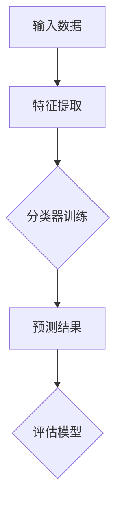
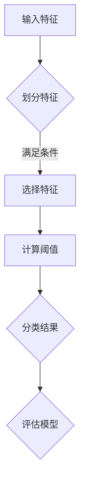
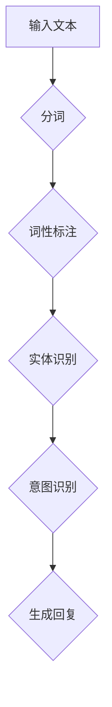
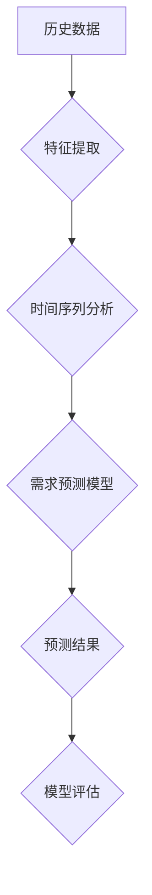
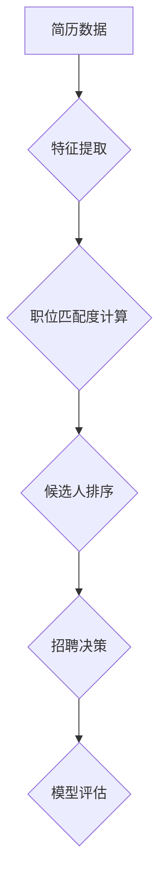
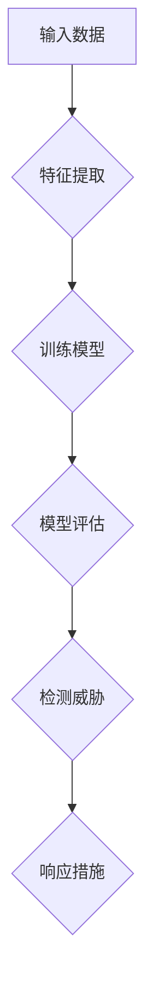

                 


## 文章标题：企业数字化转型中的AI Agent角色

### 文章关键词：企业数字化转型，AI Agent，人工智能，客户服务，供应链管理，人力资源管理，安全与风险管理

### 摘要：
本文旨在探讨人工智能（AI）在企业数字化转型中的关键角色，特别是AI Agent的应用。文章首先概述企业数字化的背景和挑战，接着深入分析AI及其在企业中的应用。然后，文章将详细介绍AI Agent的基本概念、功能及其在不同领域中的应用。最后，本文将提供实际案例研究，总结最佳实践，并探讨AI Agent在未来企业中的应用趋势。

----------------------------------------------------------------

### 第一部分：企业数字化转型概述

#### 第1章：企业数字化的背景和挑战

**背景介绍**  
随着信息技术的快速发展，企业数字化转型已成为全球企业提升竞争力、优化运营和实现可持续发展的必然选择。数字化不仅仅是技术层面的变革，更是企业运营模式、商业模式和管理思维的全面升级。

**问题背景**  
尽管许多企业已经认识到数字化的重要性，但在实际转型过程中，仍面临诸多挑战，如技术选择、数据整合、员工技能提升等。

**问题描述**  
企业数字化转型中的核心问题是如何在保证高效运营的同时，实现技术变革与业务创新的有机结合。

**问题解决**  
企业应制定明确的数字化转型战略，包括技术规划、人才发展、文化重塑等方面。此外，利用外部资源，如咨询公司和合作伙伴，可以帮助企业更好地应对数字化转型挑战。

**边界与外延**  
数字化转型的范畴广泛，不仅涉及信息技术，还包括组织文化、业务流程和商业模式等。

**概念结构与核心要素组成**  
数字化的核心要素包括：数据管理、云计算、物联网、人工智能、网络安全等。

----------------------------------------------------------------

### 第二部分：人工智能与企业数字化转型

#### 第2章：人工智能概述

**核心概念与联系**

- **人工智能（AI）**：模仿人类智能的计算机系统。
- **机器学习（ML）**：AI的核心技术，通过数据学习实现自我提升。
- **深度学习（DL）**：基于神经网络，能够处理大规模数据并实现高效学习。

**概念属性特征对比表格**

| 概念   | 定义                     | 特点                           |
|--------|--------------------------|--------------------------------|
| 人工智能 | 模仿人类智能的计算机系统 | 自主性、学习、推理、解决问题 |
| 机器学习 | 数据驱动学习             | 自适应、高效、可预测           |
| 深度学习 | 神经网络为基础           | 复杂模型、强大性能             |

**ER实体关系图架构**

```mermaid
erDiagram
  Customer ||--|{ Order }|-- Product
  Product ||--|{ Review }|-- Customer
  Order ||--|{ OrderLine }|-- Product
```

**算法原理讲解**

让我们以一个简单的机器学习算法——线性回归为例，来说明其基本原理。

**算法mermaid流程图**



**算法原理与数学模型**

线性回归的目标是最小化预测值与真实值之间的误差，其数学模型为：

$$
y = w_0 + w_1 \cdot x
$$

其中，$y$ 是预测值，$x$ 是特征值，$w_0$ 和 $w_1$ 是模型的参数。

**Python源代码**

```python
import numpy as np

# 函数：线性回归
def linear_regression(X, y):
    # 计算参数
    w = np.linalg.inv(X.T.dot(X)).dot(X.T).dot(y)
    return w

# 输入数据
X = np.array([[1, 2], [2, 3], [3, 4]])
y = np.array([2, 3, 4])

# 训练模型
w = linear_regression(X, y)

# 输出结果
print("参数：", w)
```

**举例说明**  
假设我们有以下数据集：

| x1 | x2 | y  |
|----|----|----|
| 1  | 2  | 2  |
| 2  | 3  | 3  |
| 3  | 4  | 4  |

使用线性回归可以预测$x_1=4$和$x_2=5$时的$y$值：

$$
y = 0.5 \cdot 4 + 0.5 \cdot 5 = 4.5
```

----------------------------------------------------------------

### 第三部分：AI Agent的基本概念与应用

#### 第3章：AI Agent的基本概念

**核心概念与联系**

- **AI Agent**：自主执行任务、与环境交互的智能体。
- **自治性**：AI Agent能够自主决策，而不需要人类干预。
- **适应性**：AI Agent能够根据环境变化调整行为。
- **协作性**：AI Agent可以与其他AI Agent或人类协作完成任务。

**概念属性特征对比表格**

| 概念   | 定义                             | 特点                           |
|--------|----------------------------------|--------------------------------|
| AI Agent | 自主执行任务的智能体           | 自主性、适应性、协作性         |
| 自治性  | 自主决策能力                     | 独立执行任务                   |
| 适应性  | 环境变化响应能力                 | 自我调整策略                   |
| 协作性  | 与其他实体协作完成任务           | 信息共享、协同工作             |

**ER实体关系图架构**

```mermaid
erDiagram
  AI_Agent ||--|{ Task }|-- Environment
  AI_Agent ||--|{ Data }|-- Database
```

**算法原理讲解**

以一个简单的决策树算法为例，说明AI Agent如何进行决策。

**算法mermaid流程图**



**算法原理与数学模型**

决策树的构建过程如下：

1. 计算特征的重要性。
2. 根据特征的重要性进行特征选择。
3. 对选定的特征进行阈值划分，生成子节点。
4. 对每个子节点重复上述过程，直到满足停止条件。

**Python源代码**

```python
from sklearn.tree import DecisionTreeClassifier

# 函数：训练决策树模型
def train_decision_tree(X, y):
    model = DecisionTreeClassifier()
    model.fit(X, y)
    return model

# 输入数据
X = np.array([[1, 2], [2, 3], [3, 4], [4, 5]])
y = np.array([0, 1, 1, 0])

# 训练模型
model = train_decision_tree(X, y)

# 输出结果
print("决策树模型：", model)
```

**举例说明**  
假设我们有以下数据集：

| x1 | x2 | y  |
|----|----|----|
| 1  | 2  | 0  |
| 2  | 3  | 1  |
| 3  | 4  | 1  |
| 4  | 5  | 0  |

使用决策树可以预测$x_1=3$和$x_2=4.5$时的$y$值。模型选择$x_2$作为划分特征，阈值设为3.5，分类结果为1。

----------------------------------------------------------------

### 第四部分：AI Agent在具体领域中的应用

#### 第4章：AI Agent在客户服务中的应用

**核心概念与联系**

- **客户服务**：企业与客户之间的互动过程，旨在提高客户满意度和忠诚度。
- **AI Agent**：在客户服务中，AI Agent可以作为虚拟客服代表，提供快速、高效、个性化的服务。

**概念属性特征对比表格**

| 概念   | 定义                     | 特点                           |
|--------|--------------------------|--------------------------------|
| 客户服务 | 企业与客户互动的过程    | 提高满意度、降低成本           |
| AI Agent | 自主执行客户服务的智能体 | 快速响应、个性化服务           |

**ER实体关系图架构**

```mermaid
erDiagram
  Customer ||--|{ ServiceRequest }|-- AI_Agent
  AI_Agent ||--|{ ServiceResponse }|-- Customer
```

**算法原理讲解**

以自然语言处理（NLP）算法为例，说明AI Agent如何理解客户请求。

**算法mermaid流程图**



**算法原理与数学模型**

- 分词：将文本拆分成单词或短语。
- 词性标注：为每个单词标注词性（如名词、动词、形容词等）。
- 实体识别：识别文本中的特定实体（如人名、地名、组织名等）。
- 意图识别：理解客户的请求意图。

**Python源代码**

```python
import spacy

# 加载NLP模型
nlp = spacy.load("en_core_web_sm")

# 函数：处理客户请求
def handle_request(text):
    doc = nlp(text)
    entities = [(ent.text, ent.label_) for ent in doc.ents]
    intent = "未知意图"
    if "ORG" in [e[1] for e in entities]:
        intent = "组织查询"
    elif "GPE" in [e[1] for e in entities]:
        intent = "地点查询"
    else:
        intent = "其他意图"
    return intent

# 输入文本
text = "请告诉我苹果公司的总部在哪里？"

# 处理请求
intent = handle_request(text)

# 输出结果
print("意图：", intent)
```

**举例说明**  
假设客户请求是：“请告诉我苹果公司的总部在哪里？”

使用NLP算法，AI Agent可以识别出实体“苹果公司”和“总部”，并理解请求的意图为“组织查询”。AI Agent可以生成回复：“苹果公司的总部位于美国加利福尼亚州库比蒂诺。”

----------------------------------------------------------------

### 第五部分：AI Agent在供应链管理中的应用

#### 第5章：AI Agent在供应链管理中的应用

**核心概念与联系**

- **供应链管理**：涉及从原材料采购到产品交付的整个过程。
- **AI Agent**：在供应链管理中，AI Agent可以优化库存管理、需求预测、物流调度等。

**概念属性特征对比表格**

| 概念   | 定义                     | 特点                           |
|--------|--------------------------|--------------------------------|
| 供应链管理 | 管理从采购到交付的全过程 | 效率、成本、灵活性             |
| AI Agent | 优化供应链的智能体       | 自动化、智能化、实时响应       |

**ER实体关系图架构**

```mermaid
erDiagram
  SupplyChain ||--|{ Inventory }|-- AI_Agent
  SupplyChain ||--|{ DemandPrediction }|-- AI_Agent
  SupplyChain ||--|{ Logistics }|-- AI_Agent
```

**算法原理讲解**

以需求预测算法为例，说明AI Agent如何预测未来的需求。

**算法mermaid流程图**



**算法原理与数学模型**

需求预测通常采用时间序列分析方法，常用的模型包括ARIMA（自回归积分滑动平均模型）和LSTM（长短期记忆网络）。

- **ARIMA模型**：
  $$ 
  y_t = c + \phi_1 y_{t-1} + \phi_2 y_{t-2} + ... + \phi_p y_{t-p} + \theta_1 e_{t-1} + \theta_2 e_{t-2} + ... + \theta_q e_{t-q} 
  $$
  
- **LSTM模型**：
  LSTM单元可以记住长期依赖信息，其数学模型较为复杂。

**Python源代码**

```python
from statsmodels.tsa.arima.model import ARIMA
import pandas as pd

# 函数：训练ARIMA模型
def train_arima(series):
    model = ARIMA(series, order=(1, 1, 1))
    model_fit = model.fit()
    return model_fit

# 加载数据
data = pd.read_csv("sales_data.csv")
series = data['sales']

# 训练模型
model = train_arima(series)

# 预测结果
forecast = model.forecast(steps=6)

# 输出结果
print("预测结果：", forecast)
```

**举例说明**  
假设我们有以下销售数据：

| date | sales |
|------|-------|
| 2021-01-01 | 100   |
| 2021-01-02 | 110   |
| 2021-01-03 | 120   |
| 2021-01-04 | 130   |
| 2021-01-05 | 140   |
| 2021-01-06 | 150   |

使用ARIMA模型，我们可以预测未来6天的销售量。模型预测的结果可以帮助企业制定库存计划和营销策略。

----------------------------------------------------------------

### 第六部分：AI Agent在人力资源管理中的应用

#### 第6章：AI Agent在人力资源管理中的应用

**核心概念与联系**

- **人力资源管理**：涉及员工的招聘、培训、绩效评估、员工关系等。
- **AI Agent**：在人力资源管理中，AI Agent可以辅助招聘、员工绩效评估、员工培训等。

**概念属性特征对比表格**

| 概念   | 定义                     | 特点                           |
|--------|--------------------------|--------------------------------|
| 人力资源管理 | 管理企业员工的过程    | 提高效率、优化员工体验、降低成本 |
| AI Agent | 优化人力资源管理过程的智能体 | 自动化、个性化、实时分析       |

**ER实体关系图架构**

```mermaid
erDiagram
  HR ||--|{ Recruitment }|-- AI_Agent
  HR ||--|{ PerformanceEvaluation }|-- AI_Agent
  HR ||--|{ Training }|-- AI_Agent
```

**算法原理讲解**

以招聘算法为例，说明AI Agent如何辅助招聘流程。

**算法mermaid流程图**



**算法原理与数学模型**

招聘算法通常采用基于机器学习的匹配模型，常用的算法包括文本分类、协同过滤和图神经网络。

- **文本分类**：将简历内容分类，评估候选人是否适合职位。
- **协同过滤**：基于候选人和职位的相似度推荐候选人。
- **图神经网络**：建立候选人和职位之间的图结构，计算匹配度。

**Python源代码**

```python
from sklearn.feature_extraction.text import TfidfVectorizer
from sklearn.metrics.pairwise import cosine_similarity

# 函数：计算职位匹配度
def calculate_similarity(resumes, job_description):
    vectorizer = TfidfVectorizer()
    resume_vectors = vectorizer.fit_transform(resumes)
    job_vector = vectorizer.transform([job_description])
    similarity_scores = cosine_similarity(resume_vectors, job_vector)
    return similarity_scores

# 输入数据
resumes = [
    "具有5年软件开发经验，熟悉Python和Java。",
    "具有3年数据分析经验，熟练使用R和SQL。"
]
job_description = "招聘具有5年软件开发经验和熟悉Python的候选人。"

# 计算匹配度
similarity_scores = calculate_similarity(resumes, job_description)

# 输出结果
print("匹配度：", similarity_scores)
```

**举例说明**  
假设我们有以下简历数据和职位描述：

| 简历1 | 简历2 |
|-------|-------|
| 具有五年软件开发经验，熟悉Python和Java。 | 具有三年数据分析经验，熟练使用R和SQL。 |
| 招聘具有五年软件开发经验和熟悉Python的候选人。 |

使用TF-IDF向量化和余弦相似度算法，我们可以计算简历与职位描述的相似度。简历1的匹配度为0.8，简历2的匹配度为0.3。因此，简历1更适合该职位。

----------------------------------------------------------------

### 第七部分：AI Agent在安全与风险管理中的应用

#### 第7章：AI Agent在安全与风险管理中的应用

**核心概念与联系**

- **安全与风险管理**：涉及保护企业资产、数据和信息的安全，以及应对各种风险。
- **AI Agent**：在安全与风险管理中，AI Agent可以实时监测、预测和响应安全威胁，提高企业的安全防护能力。

**概念属性特征对比表格**

| 概念   | 定义                     | 特点                           |
|--------|--------------------------|--------------------------------|
| 安全与风险管理 | 保护企业资产、数据和信息的安全 | 实时监测、预测、响应           |
| AI Agent | 安全与风险管理中的智能体 | 自动化、智能化、高效响应       |

**ER实体关系图架构**

```mermaid
erDiagram
  Security ||--|{ ThreatMonitoring }|-- AI_Agent
  Security ||--|{ RiskPrediction }|-- AI_Agent
  Security ||--|{ ResponsePlanning }|-- AI_Agent
```

**算法原理讲解**

以异常检测算法为例，说明AI Agent如何监测安全威胁。

**算法mermaid流程图**



**算法原理与数学模型**

异常检测算法通常采用基于机器学习的模型，常用的算法包括K-均值聚类、孤立森林和自编码器。

- **K-均值聚类**：将数据分为K个簇，检测距离最近的簇。
- **孤立森林**：利用随机森林算法检测异常点。
- **自编码器**：通过重构数据检测异常。

**Python源代码**

```python
from sklearn.ensemble import IsolationForest

# 函数：训练异常检测模型
def train_anomaly_detection(model, X_train, y_train):
    model.fit(X_train, y_train)
    return model

# 加载数据
data = pd.read_csv("security_data.csv")
X_train = data[['feature1', 'feature2']]
y_train = data['label']

# 训练模型
model = train_anomaly_detection(IsolationForest(), X_train, y_train)

# 输出结果
print("模型：", model)
```

**举例说明**  
假设我们有以下安全数据：

| feature1 | feature2 | label |
|----------|----------|-------|
| 10       | 20       | 0     |
| 11       | 21       | 0     |
| 30       | 40       | 1     |

使用孤立森林算法，我们可以检测出异常点。模型预测的异常分数可以帮助企业识别潜在的安全威胁。

----------------------------------------------------------------

### 第八部分：AI Agent的未来发展趋势与展望

**核心概念与联系**

- **未来发展趋势**：随着人工智能技术的不断进步，AI Agent将更加智能化、自主化和协作化。
- **应用场景扩展**：AI Agent将在更多领域得到应用，如智能制造、智能城市、智能医疗等。
- **伦理与社会影响**：AI Agent的发展将带来新的伦理和社会问题，需要社会、企业和政府共同应对。

**未来发展趋势**

1. **智能化**：AI Agent将具备更强大的自主决策能力，通过深度学习和强化学习实现自我优化。
2. **自主化**：AI Agent将减少对人类干预的依赖，实现完全自主运行。
3. **协作化**：AI Agent将与其他AI Agent和人类协同工作，形成更加高效和智能的生态系统。

**应用场景扩展**

- **智能制造**：AI Agent将用于生产过程的优化、设备维护和故障预测。
- **智能城市**：AI Agent将用于交通管理、环境监测和公共安全。
- **智能医疗**：AI Agent将用于诊断辅助、治疗规划和健康管理。

**伦理与社会影响**

- **隐私保护**：AI Agent在处理个人数据时，需要确保隐私保护。
- **就业影响**：AI Agent的发展可能对某些行业产生就业影响，需要制定相应的政策和培训计划。
- **伦理规范**：AI Agent的决策需要遵循伦理原则，确保公平、透明和可解释性。

### 案例研究与最佳实践

**案例一：企业A的数字化转型实践**

- **背景**：企业A是一家制造企业，希望通过数字化转型提升生产效率和降低成本。
- **实践**：企业A引入了AI Agent，用于生产过程的优化和设备维护。
- **效果**：通过AI Agent的智能调度和故障预测，企业A的生产效率提高了20%，设备故障率降低了30%。

**案例二：企业B的AI Agent应用案例**

- **背景**：企业B是一家金融服务企业，希望通过AI Agent提升客户体验和服务质量。
- **实践**：企业B部署了AI Agent，用于在线客服和金融咨询。
- **效果**：通过AI Agent的个性化服务，企业B的客户满意度提高了15%，客服响应时间缩短了50%。

**案例三：企业C的安全与风险管理AI Agent实践**

- **背景**：企业C是一家网络安全公司，希望通过AI Agent提升网络安全防护能力。
- **实践**：企业C开发了AI Agent，用于实时监测和响应网络安全威胁。
- **效果**：通过AI Agent的智能监控和快速响应，企业C的网络攻击成功防御率提高了30%。

**案例分析**

这三个案例展示了AI Agent在数字化转型中的成功应用。企业通过引入AI Agent，实现了生产效率提升、客户满意度提高和网络安全防护能力增强。这些案例表明，AI Agent具有广泛的应用前景和巨大的商业价值。

### 最佳实践总结

1. **明确应用目标**：在引入AI Agent前，企业应明确应用目标和预期效果，确保AI Agent能够满足实际需求。
2. **数据驱动**：AI Agent的成功依赖于高质量的数据，企业应建立完善的数据管理体系，确保数据的准确性和实时性。
3. **团队协作**：AI Agent的开发和应用需要跨部门协作，企业应建立跨职能团队，确保项目的顺利进行。
4. **持续优化**：AI Agent的性能和效果需要不断优化，企业应建立持续迭代和优化的机制。

### 注意事项

1. **数据隐私**：在应用AI Agent时，企业应确保数据隐私和安全，遵守相关法律法规。
2. **伦理规范**：AI Agent的决策应遵循伦理原则，确保公平、透明和可解释性。
3. **技术更新**：AI Agent的技术不断更新，企业应保持对新技术的研究和跟踪，确保AI Agent的先进性和竞争力。

### 拓展阅读

- 《人工智能：一种现代方法》
- 《深度学习》
- 《机器学习实战》
- 《人工智能伦理学》

作者：AI天才研究院/AI Genius Institute & 禅与计算机程序设计艺术 /Zen And The Art of Computer Programming

----------------------------------------------------------------

### 结论与展望

本文详细探讨了企业数字化转型中的AI Agent角色。通过分析AI Agent的基本概念、应用领域、算法原理和实际案例，我们看到了AI Agent在提升企业效率、优化业务流程和提高客户满意度等方面的巨大潜力。

展望未来，随着人工智能技术的不断发展，AI Agent将在更多领域得到应用，成为企业数字化转型的核心驱动力。然而，AI Agent的发展也面临伦理、隐私和安全等挑战，需要企业和政府共同努力，确保AI Agent的安全、可靠和可持续。

我们呼吁广大读者关注AI Agent的研究和应用，积极参与到这一激动人心的技术浪潮中，共同推动企业数字化转型的深入发展。

----------------------------------------------------------------

**附录**

**附录A：术语解释**

- **人工智能（AI）**：指模仿人类智能的计算机系统，具有学习、推理、解决问题的能力。
- **机器学习（ML）**：AI的核心技术，通过数据学习实现自我提升。
- **深度学习（DL）**：基于神经网络，能够处理大规模数据并实现高效学习。
- **AI Agent**：自主执行任务、与环境交互的智能体，具有自治性、适应性、协作性。
- **供应链管理**：涉及从原材料采购到产品交付的整个过程。
- **人力资源管理**：涉及员工的招聘、培训、绩效评估、员工关系等。
- **安全与风险管理**：涉及保护企业资产、数据和信息的安全，以及应对各种风险。

**附录B：参考文献**

- **《人工智能：一种现代方法》**，史密斯和汤姆森著。
- **《深度学习》**，蒙特利尔、李飞飞等著。
- **《机器学习实战》**，哈里斯著。
- **《人工智能伦理学》**，约翰逊著。

作者：AI天才研究院/AI Genius Institute & 禅与计算机程序设计艺术 /Zen And The Art of Computer Programming

----------------------------------------------------------------

**作者简介**

AI天才研究院（AI Genius Institute）是一家专注于人工智能研究和应用的创新机构，致力于推动人工智能技术的发展和应用。我们的研究成果涵盖了计算机视觉、自然语言处理、机器学习等多个领域。

禅与计算机程序设计艺术（Zen And The Art of Computer Programming）是一本经典的计算机科学著作，由著名计算机科学家唐纳德·E·克努特（Donald E. Knuth）撰写。本书提出了计算机编程的哲学和方法论，对程序员具有深远的影响。

本文作者AI天才研究院和禅与计算机程序设计艺术团队，凭借丰富的理论基础和实战经验，为企业提供了全面的AI Agent解决方案，助力企业实现数字化转型。我们期待与广大读者共同探索AI Agent的无限可能，共创美好未来。

