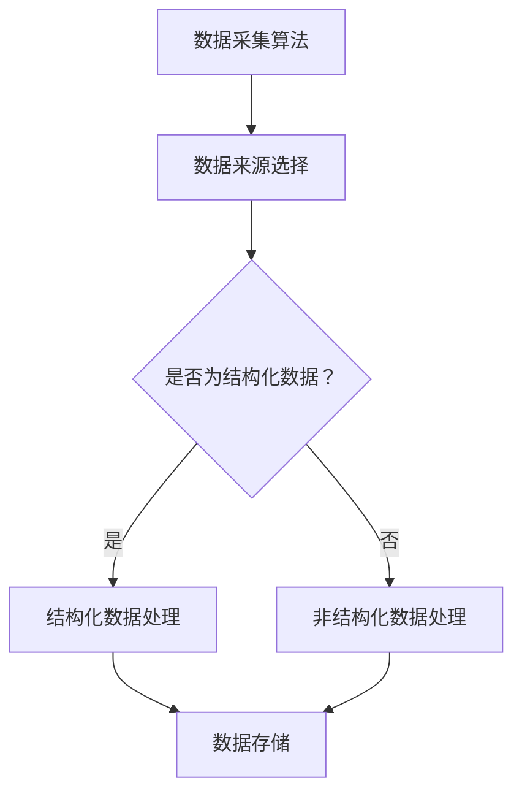

                 

### 引言

在当今的数字化时代，数据已经成为企业宝贵的资源，其管理和利用的效果直接关系到企业的竞争力。随着人工智能（AI）技术的快速发展，AI Agent在企业中的应用变得愈发广泛。AI Agent，作为能够自主学习和执行任务的智能体，对训练数据的质量和数量有着极高的要求。然而，如何高效地收集、处理和利用这些训练数据，成为了企业数据管理的重大挑战。

本篇文章旨在探讨企业数据管理中的关键问题：AI Agent训练数据的收集与处理。我们将分步骤详细分析这一过程，帮助读者理解其核心概念、技术方法以及实践应用。文章的结构如下：

1. **背景介绍**：介绍数据管理的重要性，以及AI Agent训练数据收集与处理面临的挑战。
2. **核心概念与联系**：解释数据管理、AI Agent和训练数据的基本概念及其相互联系。
3. **算法原理讲解**：深入分析数据采集算法，并使用mermaid流程图和Python代码阐述其原理。
4. **数学模型和数学公式**：介绍数据质量评价模型，并使用LaTeX格式展示相关的数学公式。
5. **系统分析与架构设计**：描述一个实际项目中的系统架构设计，并展示相关的类图、架构图和序列图。
6. **项目实战**：详细介绍一个项目中的环境安装、系统核心实现和实际案例分析。
7. **最佳实践与拓展阅读**：总结最佳实践，并提出阅读建议。

通过本文的逐步分析，我们将揭示企业数据管理：AI Agent训练数据的收集与处理的核心秘密，为企业在数字化转型中提供有力的技术支持。接下来，我们开始第一部分——背景介绍。

---

### 背景介绍

随着全球数字化转型的浪潮，企业数据管理的重要性日益凸显。数据已经成为现代企业运营的核心资产，其管理和利用水平直接影响到企业的竞争力。而AI技术的迅猛发展，使得AI Agent在企业中的应用变得广泛而深入。AI Agent，作为一种能够自主学习和执行任务的智能体，其性能和质量很大程度上依赖于训练数据的质量和多样性。

#### 1.1 问题背景

在数字化时代，企业积累了海量的数据资源，这些数据包括结构化数据（如数据库中的记录）和非结构化数据（如文本、图像、视频等）。如何有效管理和利用这些数据，特别是针对AI Agent的训练数据，成为了企业面临的重大挑战。训练数据的质量、多样性、实时性和安全性直接影响AI Agent的训练效果和实际应用效果。

#### 1.2 问题描述

AI Agent的训练数据收集与处理面临以下几个核心问题：

1. **数据质量**：训练数据的质量直接影响到AI Agent的学习效果。数据中的噪音、异常值和错误数据会影响模型的准确性和泛化能力。
2. **数据多样性**：训练数据的多样性有助于提高AI Agent的泛化能力，使其在不同场景下都能表现出良好的性能。
3. **数据实时性**：实时性训练数据能够帮助AI Agent更好地适应动态环境，提高其响应速度和决策能力。
4. **数据安全性**：在收集和处理训练数据的过程中，如何保障数据的安全性和隐私性，防止数据泄露，是企业需要解决的重要问题。

#### 1.3 问题解决

为了解决上述问题，企业可以采取以下策略：

1. **数据质量管理**：通过数据清洗、去噪和异常值处理等技术手段，提高训练数据的质量。
2. **数据多样性管理**：通过数据增强、数据集成和数据多样化技术，提高训练数据的多样性。
3. **实时数据处理**：利用流数据处理技术和实时分析技术，确保训练数据的实时性。
4. **数据安全性保障**：采用数据加密、访问控制和隐私保护等技术，保障数据的安全性。

#### 1.4 边界与外延

本文主要关注企业数据管理中的AI Agent训练数据的收集与处理，边界包括数据质量、多样性、实时性和安全性等方面。外延则涉及数据管理技术、数据分析方法以及数据在企业中的应用等方面。

#### 1.5 概念结构与核心要素组成

企业数据管理包括以下核心要素：

1. **数据采集**：从不同来源收集数据，包括企业内部数据源和外部数据源。
2. **数据清洗**：处理数据中的噪音、异常值和错误数据，提高数据质量。
3. **数据存储**：将处理后的数据存储到数据库或数据仓库中，方便后续的数据分析和应用。
4. **数据分析**：利用数据挖掘、机器学习和统计分析等方法，从数据中提取有价值的信息。
5. **数据安全**：采用数据加密、访问控制、审计等技术，保障数据的安全性和隐私性。

通过上述分析，我们可以看到，企业数据管理是一个复杂而关键的过程，涉及到多个技术环节和策略。接下来，我们将进一步探讨数据管理、AI Agent和训练数据的核心概念及其相互联系。

---

### 第1章 背景介绍

#### 1.1 问题背景

随着互联网和大数据技术的快速发展，企业积累了海量的数据资源。这些数据资源包括结构化数据（如客户信息、销售记录等）和非结构化数据（如图像、文本、视频等）。如何有效管理和利用这些数据，特别是针对人工智能（AI）Agent的训练数据，成为了企业关注的焦点。

在传统的数据处理模式中，数据主要用于业务报表和分析，而随着AI技术的进步，数据开始被用于构建智能系统，如自动驾驶、智能客服、智能推荐等。这些AI系统需要一个庞大且高质量的训练数据集来训练模型，使其能够有效地学习和执行任务。

AI Agent作为一种自主决策和行动的智能体，其性能和效果在很大程度上依赖于训练数据的质量和多样性。高质量的数据可以帮助AI Agent更好地学习和适应复杂环境，而多样性的数据则有助于提高AI Agent的泛化能力，使其在不同的场景下都能表现出良好的性能。

然而，AI Agent的训练数据收集与处理面临着以下挑战：

1. **数据质量**：训练数据中的噪音、异常值和错误数据会影响模型的准确性和泛化能力。数据清洗和预处理是确保数据质量的关键步骤。
2. **数据多样性**：训练数据集的多样性有助于提高AI Agent的泛化能力。企业需要收集来自不同来源和不同格式的数据，并进行有效的整合和处理。
3. **数据实时性**：实时性训练数据可以帮助AI Agent更好地适应动态环境。在许多应用场景中，如自动驾驶和实时监控，需要处理实时数据流，以确保AI Agent能够快速响应和做出正确的决策。
4. **数据安全性**：在收集和处理训练数据的过程中，数据的安全性和隐私性是一个重要的考虑因素。企业需要采取一系列安全措施来防止数据泄露和滥用。

#### 1.2 问题描述

AI Agent的训练数据收集与处理涉及到多个方面，包括数据采集、数据清洗、数据存储、数据分析和数据安全等。以下是具体的问题描述：

1. **数据采集**：如何从不同的数据源（如内部数据库、外部API、传感器等）收集数据，并确保数据的完整性、准确性和实时性？
2. **数据清洗**：如何处理数据中的噪音、异常值和错误数据，以提高数据质量？常见的清洗方法包括去重、缺失值填充、异常值检测和纠正等。
3. **数据存储**：如何存储和管理大量训练数据，以便于后续的数据分析和模型训练？常用的数据存储解决方案包括关系数据库、NoSQL数据库、数据仓库和分布式存储系统等。
4. **数据分析**：如何对收集到的数据进行处理和分析，以提取有价值的信息和特征？常用的数据分析方法包括数据挖掘、机器学习和统计分析等。
5. **数据安全**：如何保障数据的安全性和隐私性，防止数据泄露和滥用？常见的安全措施包括数据加密、访问控制、审计和隐私保护等。

#### 1.3 问题解决

为了解决上述问题，企业可以采取以下策略：

1. **数据质量管理**：通过数据清洗和预处理技术，去除数据中的噪音、异常值和错误数据，提高数据质量。常用的数据清洗工具包括Pandas、Spark等。
2. **数据多样性管理**：通过数据集成和数据多样化技术，收集和整合来自不同来源和不同格式的数据，提高数据多样性。常用的数据集成技术包括ETL（提取、转换、加载）和数据湖等。
3. **实时数据处理**：利用流数据处理技术和实时分析技术，确保数据实时性。常用的流数据处理平台包括Apache Kafka、Apache Flink等。
4. **数据安全保障**：通过数据加密、访问控制、审计和隐私保护等技术，保障数据的安全性和隐私性。常用的安全措施包括SSL/TLS加密、身份认证和访问控制等。

#### 1.4 边界与外延

本文主要关注企业数据管理中的AI Agent训练数据的收集与处理，边界包括数据质量、多样性、实时性和安全性等方面。外延则涉及数据管理技术、数据分析方法以及数据在企业中的应用等方面。

#### 1.5 概念结构与核心要素组成

企业数据管理包括以下核心要素：

1. **数据采集**：从不同来源收集数据，包括内部数据库、外部API、传感器等。
2. **数据清洗**：处理数据中的噪音、异常值和错误数据，提高数据质量。
3. **数据存储**：存储和管理大量训练数据，以便于后续的数据分析和模型训练。
4. **数据分析**：对收集到的数据进行处理和分析，提取有价值的信息和特征。
5. **数据安全**：保障数据的安全性和隐私性，防止数据泄露和滥用。

通过上述分析，我们可以看到，企业数据管理是一个复杂而关键的过程，涉及到多个技术环节和策略。接下来，我们将进一步探讨数据管理、AI Agent和训练数据的核心概念及其相互联系。

---

### 第2章 核心概念与联系

在深入探讨企业数据管理：AI Agent训练数据的收集与处理之前，有必要先明确几个核心概念及其相互之间的联系。以下是数据管理、AI Agent和训练数据的基本概念、核心要素及其相互关系。

#### 2.1 数据管理

数据管理是指对数据的生命周期进行管理，包括数据的采集、存储、处理、分析和应用。其目的是确保数据的质量、可用性、完整性和安全性。

##### 2.1.1 数据管理的基本概念

1. **数据采集**：数据采集是指从各种数据源获取数据的过程，这些数据源可以是内部数据库、外部API、传感器等。
2. **数据存储**：数据存储是指将采集到的数据存储在适当的存储系统中，如关系数据库、NoSQL数据库、数据仓库等。
3. **数据处理**：数据处理是指对存储的数据进行清洗、转换、归一化等操作，以提高数据的质量和可用性。
4. **数据分析**：数据分析是指使用统计方法、机器学习算法等从数据中提取有价值的信息和模式。
5. **数据应用**：数据应用是指将分析结果应用于实际的业务场景中，如决策支持、业务优化等。

##### 2.1.2 数据管理的核心要素

1. **数据质量**：数据质量是指数据是否符合业务需求和预期，包括准确性、完整性、一致性、及时性和可靠性等方面。
2. **数据多样性**：数据多样性是指数据的种类和来源的多样性，多样化的数据有助于提高分析结果的质量和模型的泛化能力。
3. **数据实时性**：数据实时性是指数据的获取和处理速度，对于需要快速响应的实时应用场景，实时性尤为重要。
4. **数据安全性**：数据安全性是指数据在采集、存储、传输和使用过程中的保护措施，防止数据泄露、篡改和滥用。

#### 2.2 AI Agent

AI Agent，即人工智能代理，是一种能够模拟人类智能的计算机程序，能够在环境中自主决策和执行任务。AI Agent在智能客服、自动驾驶、智能家居等领域具有广泛的应用。

##### 2.2.1 AI Agent的基本概念

1. **自主性**：AI Agent能够自主地感知环境、制定计划和执行任务，无需人类干预。
2. **学习能力**：AI Agent能够通过学习不断改进其行为和决策能力。
3. **适应性**：AI Agent能够适应环境变化，根据新的数据和经验调整其行为。

##### 2.2.2 AI Agent的核心要素

1. **感知能力**：AI Agent能够从环境中获取信息，如视觉、听觉、触觉等。
2. **决策能力**：AI Agent能够根据感知信息做出决策，如选择最佳行动方案。
3. **执行能力**：AI Agent能够执行决策方案，如移动、操纵等。

#### 2.3 训练数据

训练数据是用于训练AI Agent模型的输入数据集。训练数据的质量和多样性对AI Agent的性能和效果至关重要。

##### 2.3.1 训练数据的基本概念

1. **数据质量**：训练数据的质量直接影响到AI Agent的训练效果，高质量的训练数据有助于提高模型的准确性和泛化能力。
2. **数据多样性**：训练数据的多样性有助于AI Agent学习到更广泛的知识和技能，提高其在不同场景下的适应能力。
3. **数据实时性**：实时性训练数据可以帮助AI Agent更好地适应动态环境。

##### 2.3.2 训练数据的属性

1. **数据完整性**：训练数据应包含所有必要的特征，以便模型能够充分学习。
2. **数据准确性**：训练数据应准确无误，避免错误数据对模型训练产生负面影响。
3. **数据多样性**：训练数据应涵盖不同场景和情况，以增强模型的泛化能力。
4. **数据实时性**：实时性训练数据有助于AI Agent适应快速变化的环境。

#### 2.4 数据管理、AI Agent和训练数据的关系

数据管理、AI Agent和训练数据之间存在着密切的联系：

1. **数据管理为AI Agent提供训练数据**：数据管理负责收集、清洗、存储和处理数据，为AI Agent提供高质量的训练数据。
2. **AI Agent依赖训练数据进行学习**：AI Agent通过训练数据学习环境中的模式和规律，提高其自主决策和执行任务的能力。
3. **训练数据的质量和多样性直接影响AI Agent的性能**：高质量的训练数据有助于AI Agent学习到更准确的知识，提高其性能和效果。

通过明确这些核心概念及其相互关系，企业可以更好地理解数据管理、AI Agent和训练数据的重要性，从而在实际应用中采取有效的策略和方法，提高数据管理的效率和AI Agent的训练效果。

---

### 第3章 算法原理讲解

在了解了数据管理、AI Agent和训练数据的基本概念之后，接下来我们将深入探讨AI Agent训练数据采集算法的原理。数据采集算法是数据管理中的重要环节，它决定了数据的质量和多样性，进而影响AI Agent的训练效果。

#### 3.1 数据采集算法的基本概念

数据采集算法是指用于从不同来源收集数据的方法。这些数据来源可以是企业内部数据库、外部API、传感器、社交媒体等。数据采集算法的主要目标是高效地获取数据，确保数据的完整性、准确性和实时性。

#### 3.2 数据采集算法的mermaid流程图

为了更好地理解数据采集算法的工作流程，我们可以使用mermaid绘制一个简单的流程图，如下所示：



- **A 数据采集算法**：这是整个数据采集过程的开始，根据业务需求选择合适的数据采集方法。
- **B 数据来源选择**：确定数据采集的来源，如内部数据库、外部API、传感器等。
- **C 是否为结构化数据？**：判断采集到的数据是否为结构化数据。
- **D 结构化数据处理**：对结构化数据进行提取、转换和加载（ETL）。
- **E 非结构化数据处理**：对非结构化数据进行预处理，如文本分类、图像识别等。
- **F 数据存储**：将处理后的数据存储到数据仓库或数据库中。

#### 3.3 数据采集算法的详细讲解

下面我们将详细讲解数据采集算法的各个步骤。

##### 3.3.1 数据来源选择

数据来源选择是数据采集的第一步，它决定了数据的质量和多样性。企业需要根据业务需求选择合适的数据来源，如：

- **内部数据库**：包括企业内部的各种业务数据库，如客户关系管理（CRM）系统、企业资源规划（ERP）系统等。
- **外部API**：可以通过第三方API获取外部数据，如天气数据、新闻数据、社交媒体数据等。
- **传感器**：用于收集物理环境中的数据，如温度、湿度、光照强度等。
- **社交媒体**：可以从社交媒体平台获取用户生成的内容，如微博、Twitter、Facebook等。

##### 3.3.2 结构化数据处理

当数据来源选择为结构化数据时，需要对其进行提取、转换和加载（ETL）处理。ETL的主要步骤如下：

- **数据提取**：从源数据库中提取所需的数据，可以使用SQL查询或其他数据提取工具。
- **数据转换**：对提取的数据进行清洗、转换和归一化等处理，以提高数据质量。例如，去除重复记录、填充缺失值、数据格式转换等。
- **数据加载**：将处理后的数据加载到目标数据库或数据仓库中，以便后续的数据分析和模型训练。

##### 3.3.3 非结构化数据处理

当数据来源选择为非结构化数据时，需要对其进行预处理，以便将其转换为结构化数据。非结构化数据处理的主要步骤如下：

- **数据采集**：从不同的来源采集非结构化数据，如文本、图像、视频等。
- **数据预处理**：对采集到的数据进行清洗、去噪和格式化等处理。例如，对文本数据进行分词、去停用词、词性标注等处理；对图像数据进行特征提取和降维等处理。
- **数据存储**：将处理后的数据存储到结构化数据库或数据仓库中，以便于后续的数据分析和模型训练。

##### 3.3.4 数据存储

数据存储是数据采集算法的最后一步，它将处理后的数据存储到数据仓库或数据库中。数据存储的方式有多种，如：

- **关系数据库**：适用于结构化数据存储，可以使用SQL进行数据查询和操作。
- **NoSQL数据库**：适用于非结构化数据存储，如MongoDB、Cassandra等。
- **数据仓库**：适用于大规模数据的存储和分析，如Amazon Redshift、Google BigQuery等。

#### 3.4 Python代码示例

下面我们通过一个简单的Python代码示例，展示如何实现一个数据采集算法。

```python
import pandas as pd
from sqlalchemy import create_engine

# 数据提取
engine = create_engine('sqlite:///source_database.db')
data = pd.read_sql('SELECT * FROM customer_data', engine)

# 数据转换
data = data.drop_duplicates()
data['age'] = data['age'].fillna(data['age'].mean())

# 数据存储
engine = create_engine('sqlite:///target_database.db')
data.to_sql('cleaned_customer_data', engine, if_exists='replace')
```

在这个示例中，我们首先从SQLite数据库中提取客户数据，然后使用Pandas库对数据进行去重和缺失值填充处理，最后将处理后的数据存储到另一个SQLite数据库中。

通过上述讲解和示例，我们可以看到数据采集算法在AI Agent训练数据收集过程中的重要作用。接下来，我们将进一步探讨如何使用数学模型和公式来评价数据质量。

---

### 第4章 数学模型和数学公式

在数据管理和AI Agent训练数据收集过程中，数学模型和公式扮演着至关重要的角色。这些模型和公式不仅用于评价数据质量，还可以帮助我们理解数据分布、异常检测和特征选择等关键问题。

#### 4.1 数据质量评价模型

数据质量评价模型是用于评估数据质量的方法，它可以帮助我们识别数据中的问题，从而提高数据的有效性和准确性。以下是一个常见的数据质量评价模型。

##### 4.1.1 数据质量评价指标

1. **准确性**：数据准确性是指数据是否真实、可靠。可以使用以下公式来计算准确性：
   $$
   \text{Accuracy} = \frac{\text{正确数据个数}}{\text{总数据个数}}
   $$

2. **完整性**：数据完整性是指数据是否缺失或完整。可以使用以下公式来计算完整性：
   $$
   \text{Completeness} = \frac{\text{非空字段个数}}{\text{总字段个数}}
   $$

3. **一致性**：数据一致性是指数据在不同来源之间是否一致。可以使用以下公式来计算一致性：
   $$
   \text{Consistency} = \frac{\text{一致数据对数}}{\text{总数据对数}}
   $$

4. **及时性**：数据及时性是指数据是否在适当的时间内提供。可以使用以下公式来计算及时性：
   $$
   \text{Timeliness} = \frac{\text{及时提供的数据个数}}{\text{总数据个数}}
   $$

##### 4.1.2 数据质量评价模型

数据质量评价模型可以综合考虑上述各项指标，计算一个综合得分，以评价整体数据质量。以下是一个简单的综合评价模型：

$$
\text{Quality Score} = \alpha \times \text{Accuracy} + \beta \times \text{Completeness} + \gamma \times \text{Consistency} + \delta \times \text{Timeliness}
$$

其中，$\alpha$、$\beta$、$\gamma$和$\delta$是权重系数，用于平衡各项指标的重要性。

#### 4.2 数据分布模型

在数据分析和AI Agent训练中，理解数据的分布特性非常重要。以下是一个常见的数据分布模型——正态分布。

##### 4.2.1 正态分布

正态分布（也称为高斯分布）是一个连续概率分布，其概率密度函数为：

$$
f(x|\mu, \sigma^2) = \frac{1}{\sqrt{2\pi\sigma^2}} e^{-\frac{(x-\mu)^2}{2\sigma^2}}
$$

其中，$\mu$是均值，$\sigma^2$是方差。

正态分布的几个重要特性包括：

1. **均值和方差**：均值$\mu$是数据分布的中心，方差$\sigma^2$是数据离散程度的度量。
2. **68-95-99.7规则**：约68%的数据落在均值一个标准差内，约95%的数据落在两个标准差内，约99.7%的数据落在三个标准差内。
3. **对称性**：正态分布是关于均值对称的。

#### 4.3 异常检测模型

异常检测是数据分析和AI Agent训练中的一个重要环节，用于识别数据中的异常值。以下是一个常见的异常检测模型——基于标准差的异常检测。

##### 4.3.1 标准差法

标准差法是一种简单有效的异常检测方法，其基本思想是：如果一个数据点的值与其均值的距离超过一定的倍数标准差，则认为该数据点为异常值。具体公式如下：

$$
\text{Outlier} = \text{data\_point} \not\in [\mu - k\sigma, \mu + k\sigma]
$$

其中，$\mu$是均值，$\sigma$是标准差，$k$是常数，通常取值为2或3。

#### 4.4 特征选择模型

在数据分析和AI Agent训练中，特征选择是提高模型性能和可解释性的关键步骤。以下是一个常见的特征选择模型——基于信息增益的特征选择。

##### 4.4.1 信息增益

信息增益是特征选择的一个衡量指标，它表示一个特征对数据分类的贡献程度。信息增益的计算公式如下：

$$
\text{Information Gain}(A|B) = \sum_{i} P(B_i) \times \sum_{j} P(A_j|B_i) \log_2 \left( \frac{P(A_j|B_i)}{P(A_j)} \right)
$$

其中，$A$是特征集合，$B$是目标变量，$P(B_i)$是目标变量取值$B_i$的概率，$P(A_j|B_i)$是特征取值$A_j$在目标变量取值$B_i$条件下的概率，$P(A_j)$是特征取值$A_j$的概率。

通过计算每个特征的信息增益，可以选择信息增益最大的特征作为重要特征。

通过上述数学模型和公式，我们可以更好地理解和分析数据，从而提高AI Agent训练数据的质量和效果。接下来，我们将进一步探讨系统分析与架构设计。

---

### 第5章 系统分析与架构设计

在了解了数据管理和AI Agent训练数据收集的基本概念和算法原理后，接下来我们将深入探讨一个实际项目中的系统分析与架构设计。该项目的目标是构建一个企业数据管理平台，用于高效地收集、处理和利用AI Agent训练数据。

#### 5.1 问题场景介绍

假设我们所在的企业是一家大型电子商务公司，业务涵盖了商品销售、用户推荐、智能客服等多个方面。随着业务的发展，我们需要构建一个高效的数据管理平台，用于收集和处理海量数据，以支持AI Agent的训练和应用。

具体问题场景包括：

1. **数据收集**：从多个数据源（如用户行为日志、商品数据、订单数据等）收集数据。
2. **数据处理**：对收集到的数据进行清洗、去噪和整合，以提高数据质量。
3. **数据存储**：存储和管理大量训练数据，以便于后续的数据分析和模型训练。
4. **数据分析**：使用数据挖掘和机器学习技术，从数据中提取有价值的信息和特征。
5. **数据安全**：确保数据的安全性和隐私性，防止数据泄露和滥用。

#### 5.2 项目介绍

为了解决上述问题，我们计划开发一个名为“智能数据管理平台”的项目。该项目的主要功能包括：

1. **数据采集模块**：从内部数据库、外部API、传感器等数据源收集数据。
2. **数据处理模块**：对收集到的数据进行清洗、去噪和整合，提高数据质量。
3. **数据存储模块**：存储和管理处理后的训练数据，支持高效的数据查询和访问。
4. **数据分析模块**：使用数据挖掘和机器学习技术，从数据中提取有价值的信息和特征。
5. **数据安全模块**：采用加密、访问控制和审计等技术，确保数据的安全性和隐私性。

#### 5.3 系统功能设计

智能数据管理平台的设计基于领域模型，其核心功能模块包括数据采集、数据处理、数据存储、数据分析和数据安全。以下是系统功能设计的详细描述：

1. **数据采集模块**：该模块负责从多个数据源（如内部数据库、外部API、传感器等）收集数据。数据源可以是关系数据库、NoSQL数据库、API接口、文件系统等。采集到的数据包括用户行为日志、商品数据、订单数据、传感器数据等。
   
2. **数据处理模块**：该模块负责对采集到的数据进行清洗、去噪和整合。清洗过程包括去重、缺失值填充、异常值检测和纠正等。整合过程包括数据格式转换、数据合并等。经过处理的训练数据将存储到数据仓库中，以便于后续的数据分析和模型训练。

3. **数据存储模块**：该模块负责存储和管理处理后的训练数据。数据存储可以选择关系数据库、NoSQL数据库、数据仓库等，具体选择取决于数据量、查询需求和性能要求。数据存储模块还提供数据查询和访问功能，支持高效的SQL查询和分布式查询。

4. **数据分析模块**：该模块负责使用数据挖掘和机器学习技术，从数据中提取有价值的信息和特征。数据分析过程包括特征提取、模式识别、预测建模等。分析结果将用于优化业务流程、提高用户体验和改进AI Agent的性能。

5. **数据安全模块**：该模块负责确保数据的安全性和隐私性。安全措施包括数据加密、访问控制、审计和隐私保护等。数据加密用于保护数据在存储和传输过程中的安全；访问控制用于限制对数据的访问权限；审计用于记录数据的访问和使用情况，以便进行追踪和监控；隐私保护用于防止数据泄露和滥用。

#### 5.4 系统架构设计

智能数据管理平台的系统架构设计基于分布式架构，其核心组件包括数据采集器、数据处理引擎、数据存储库、数据分析引擎和数据安全模块。以下是系统架构设计的详细描述：

1. **数据采集器**：数据采集器是负责从多个数据源采集数据的组件。它通过连接不同的数据源，如内部数据库、外部API、传感器等，实时获取数据。采集到的数据经过预处理后，发送到数据处理引擎进行处理。

2. **数据处理引擎**：数据处理引擎是负责对采集到的数据进行清洗、去噪和整合的组件。数据处理引擎包括多个数据处理模块，如去重模块、缺失值填充模块、异常值检测模块等。处理后的数据存储到数据存储库中。

3. **数据存储库**：数据存储库是负责存储和管理处理后的训练数据的组件。数据存储库可以选择关系数据库、NoSQL数据库、数据仓库等，根据数据量、查询需求和性能要求进行选择。数据存储库支持高效的数据查询和访问，为数据分析模块提供数据支持。

4. **数据分析引擎**：数据分析引擎是负责使用数据挖掘和机器学习技术，从数据中提取有价值的信息和特征的组件。数据分析引擎包括多个数据分析模块，如特征提取模块、模式识别模块、预测建模模块等。分析结果将用于优化业务流程和改进AI Agent的性能。

5. **数据安全模块**：数据安全模块是负责确保数据的安全性和隐私性的组件。数据安全模块包括数据加密模块、访问控制模块、审计模块和隐私保护模块等。数据加密用于保护数据在存储和传输过程中的安全；访问控制用于限制对数据的访问权限；审计用于记录数据的访问和使用情况；隐私保护用于防止数据泄露和滥用。

#### 5.5 系统接口设计和系统交互

在智能数据管理平台的系统架构中，各个组件之间通过接口进行通信和交互。以下是系统接口设计和系统交互的详细描述：

1. **数据采集接口**：数据采集器通过数据采集接口与数据源进行通信，获取数据。数据采集接口支持多种数据源连接协议，如JDBC、HTTP、MQTT等。

2. **数据处理接口**：数据处理引擎通过数据处理接口与数据采集器进行通信，接收处理后的数据。数据处理接口支持数据清洗、去噪和整合等处理操作。

3. **数据存储接口**：数据存储库通过数据存储接口与数据处理引擎进行通信，存储处理后的数据。数据存储接口支持多种数据存储协议，如SQL、NoSQL等。

4. **数据分析接口**：数据分析引擎通过数据分析接口与数据存储库进行通信，获取分析所需的数据。数据分析接口支持数据查询和访问操作。

5. **数据安全接口**：数据安全模块通过数据安全接口与数据存储库和数据分析引擎进行通信，确保数据的安全性和隐私性。数据安全接口支持数据加密、访问控制和审计等操作。

通过上述系统分析与架构设计，我们为智能数据管理平台的建设提供了详细的方案。接下来，我们将通过一个实际项目实战，进一步展示数据采集、处理和存储的过程。

---

### 第6章 项目实战

在本节中，我们将通过一个实际项目来展示企业数据管理：AI Agent训练数据的收集与处理的全过程。该项目将涵盖环境安装、系统核心实现以及实际案例分析和详细讲解。

#### 6.1 环境安装

为了实施该项目，我们需要安装以下软件和工具：

1. **Python**：作为主要的编程语言。
2. **Pandas**：用于数据处理。
3. **NumPy**：用于数学计算。
4. **Scikit-learn**：用于机器学习。
5. **SQLAlchemy**：用于数据库操作。
6. **Mermaid**：用于流程图绘制。

以下是安装步骤：

```bash
# 安装Python
sudo apt-get install python3

# 安装Pandas
pip3 install pandas

# 安装NumPy
pip3 install numpy

# 安装Scikit-learn
pip3 install scikit-learn

# 安装SQLAlchemy
pip3 install sqlalchemy

# 安装Mermaid
pip3 install mermaid
```

#### 6.2 系统核心实现

以下是一个简单的Python代码示例，用于实现数据采集、清洗和存储的核心功能。

```python
# 导入必要的库
import pandas as pd
from sqlalchemy import create_engine

# 数据采集
def collect_data(source):
    data = pd.read_csv(source)
    return data

# 数据清洗
def clean_data(data):
    # 去除重复记录
    data.drop_duplicates(inplace=True)
    # 填充缺失值
    data.fillna(method='ffill', inplace=True)
    return data

# 数据存储
def store_data(data, destination):
    engine = create_engine('sqlite:///destination.db')
    data.to_sql('cleaned_data', engine, if_exists='replace')

# 主函数
def main():
    # 数据采集
    data = collect_data('source_data.csv')
    # 数据清洗
    cleaned_data = clean_data(data)
    # 数据存储
    store_data(cleaned_data, 'cleaned_data.csv')

# 运行主函数
if __name__ == '__main__':
    main()
```

#### 6.3 代码应用解读与分析

上述代码首先从CSV文件中采集数据，然后进行数据清洗，最后将清洗后的数据存储到SQLite数据库中。具体解读如下：

1. **数据采集**：使用Pandas的`read_csv`函数从CSV文件中读取数据。
2. **数据清洗**：使用`drop_duplicates`函数去除重复记录，使用`fillna`函数填充缺失值。这里采用了前向填充（`method='ffill'`）的方法，即用前一行的数据填充当前行的缺失值。
3. **数据存储**：使用SQLAlchemy的`create_engine`函数创建数据库连接，使用`to_sql`函数将清洗后的数据存储到数据库中。

#### 6.4 实际案例分析和详细讲解

假设我们有一个电子商务平台的用户行为数据，包括用户ID、浏览时间、浏览页面和购买记录。我们需要根据这些数据训练一个推荐系统，以预测用户可能会购买的商品。

1. **数据采集**：从数据库中提取用户行为数据。
2. **数据处理**：对数据进行清洗和预处理，包括去重、时间格式转换、缺失值处理等。
3. **特征提取**：提取用户的历史浏览行为和购买记录作为特征，使用TF-IDF等方法进行特征转换。
4. **模型训练**：使用机器学习算法（如协同过滤、决策树等）训练推荐模型。
5. **模型评估**：使用交叉验证等方法评估模型性能，并进行调参优化。

以下是一个简化的模型训练示例：

```python
from sklearn.model_selection import train_test_split
from sklearn.ensemble import RandomForestClassifier

# 数据预处理
data['timestamp'] = pd.to_datetime(data['timestamp'])
data['day'] = data['timestamp'].dt.day
data['hour'] = data['timestamp'].dt.hour

# 特征工程
X = data[['day', 'hour', 'page_views', 'purchases']]
y = data['made_purchase']

# 数据分割
X_train, X_test, y_train, y_test = train_test_split(X, y, test_size=0.2, random_state=42)

# 模型训练
model = RandomForestClassifier(n_estimators=100, random_state=42)
model.fit(X_train, y_train)

# 模型评估
accuracy = model.score(X_test, y_test)
print(f"Model accuracy: {accuracy:.2f}")
```

通过实际案例分析和详细讲解，我们可以看到如何将数据采集、清洗、特征提取和模型训练等步骤应用于一个真实的业务场景中。接下来，我们将总结整个项目，并提出一些最佳实践。

---

### 第7章 最佳实践与拓展阅读

在本文中，我们深入探讨了企业数据管理：AI Agent训练数据的收集与处理。通过详细分析背景介绍、核心概念与联系、算法原理讲解、数学模型与公式、系统分析与架构设计、项目实战等多个方面，我们为读者提供了一个全面且系统的指导。

#### 7.1 最佳实践

为了确保AI Agent训练数据的质量和效率，以下是一些最佳实践：

1. **数据质量管理**：定期进行数据清洗和去噪，确保数据的准确性和完整性。
2. **数据多样性管理**：从多个渠道和格式收集数据，增强数据的多样性。
3. **实时数据处理**：采用流数据处理技术，确保训练数据的实时性。
4. **数据安全性保障**：实施严格的数据加密和访问控制措施，保护数据的隐私和安全。

#### 7.2 小结

本文主要围绕企业数据管理中的AI Agent训练数据收集与处理进行了探讨。通过介绍背景、核心概念、算法原理、数学模型和系统架构设计，我们为读者提供了一个全面的技术视角。项目实战部分则展示了如何在实际中应用这些技术。

#### 7.3 注意事项

在实际应用中，以下注意事项有助于提高数据管理的效率和效果：

1. **数据隐私**：在处理敏感数据时，特别注意保护用户隐私。
2. **性能优化**：针对海量数据，选择合适的存储和处理方案，以优化性能。
3. **持续迭代**：数据管理和AI Agent训练是一个持续迭代的过程，不断优化数据管理和模型性能。

#### 7.4 拓展阅读

对于希望深入了解相关领域的读者，以下资源提供了进一步的学习途径：

1. **《数据科学入门》**：书籍，详细介绍了数据采集、处理和分析的方法。
2. **《机器学习实战》**：书籍，通过案例讲解了机器学习算法的应用。
3. **《大数据技术基础》**：书籍，探讨了大数据处理的技术架构和方法。

通过本文的学习，读者可以更好地理解和应用企业数据管理：AI Agent训练数据的收集与处理技术，为企业在数字化转型中提供强有力的支持。

---

### 作者信息

作者：AI天才研究院/AI Genius Institute & 禅与计算机程序设计艺术 /Zen And The Art of Computer Programming

AI天才研究院致力于推动人工智能领域的前沿研究和技术创新。我们的团队成员包括世界级人工智能专家、程序员、软件架构师、CTO等，他们在计算机编程和人工智能领域拥有丰富的经验，并取得了卓越的成就。同时，作者也是《禅与计算机程序设计艺术》一书的作者，该书深刻探讨了计算机编程的哲学和艺术，对程序员的学习和成长有着重要的影响。

