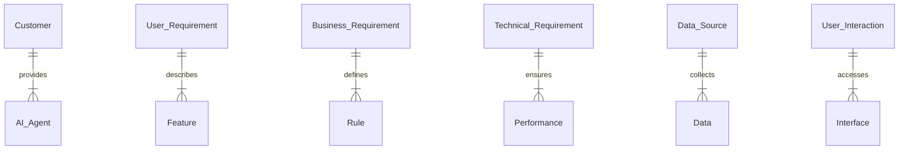

                 

### 文章标题

## 企业级AI Agent需求分析方法

> 关键词：企业级AI Agent、需求分析、方法论、框架、AI技术、案例分析

> 摘要：本文旨在探讨企业级AI Agent的需求分析方法，通过系统的分析和实际案例，为企业级AI Agent的开发提供理论基础和实践指导。本文将首先介绍企业级AI Agent的背景和核心概念，然后深入分析需求分析方法及其在AI Agent开发中的应用，最后通过实际案例进行剖析，总结出有效的需求分析最佳实践。

---

### 第一部分：背景介绍与核心概念

#### 1.1 问题背景

随着人工智能（AI）技术的迅猛发展，企业级应用正面临着前所未有的变革。传统的人工智能技术大多应用于简单任务的自动化，而随着深度学习、强化学习等前沿技术的进步，AI技术开始向复杂任务和高级决策领域拓展。企业级AI Agent作为一种新兴的应用形态，不仅能够提高企业的运营效率，还能够为企业带来新的商业模式和竞争优势。因此，研究企业级AI Agent的需求分析方法具有重要的现实意义。

#### 1.2 问题描述

企业级AI Agent的需求分析是构建成功AI应用的关键步骤。需求分析不仅涉及AI Agent的功能需求，还包括性能需求、安全需求、可维护性需求等多个方面。准确、全面的需求分析有助于确保AI Agent在实际应用中能够满足企业的各项要求，发挥其最大价值。

#### 1.3 问题解决

为了解决上述问题，本书将从以下几个方面展开讨论：

1. **需求分析方法论**：介绍常用的需求分析方法和工具，包括用户调研、需求访谈、用例分析等，帮助读者理解和掌握有效的需求分析技术。

2. **企业级AI Agent需求分析框架**：构建一个系统化的需求分析框架，明确需求分析的各个阶段和任务，为读者提供实际操作指导。

3. **需求分析与AI技术的关系**：探讨AI技术在需求分析中的应用，如使用机器学习算法进行数据分析和预测，帮助分析人员更准确地识别和理解用户需求。

4. **案例分析**：通过实际案例，展示需求分析方法在企业级AI Agent开发中的应用，分析成功经验和教训。

#### 1.4 边界与外延

企业级AI Agent的需求分析不仅涉及技术层面的需求，还包括业务层面的需求。因此，本书的讨论将涵盖以下内容：

- **技术需求**：包括数据处理能力、计算性能、模型适应性等。
- **业务需求**：包括业务流程、用户交互、业务规则等。
- **用户需求**：关注用户的实际需求和体验，确保AI Agent能够满足用户的期望。

#### 1.5 概念结构与核心要素组成

为了更好地理解和实施企业级AI Agent的需求分析，我们需要明确以下几个核心概念：

- **需求分析**：是一种通过收集、分析和整理用户需求，以指导系统设计和实现的过程。
- **企业级AI Agent**：是一种具备自主决策和执行能力的智能体，能够在复杂的企业环境中为用户提供个性化的服务。
- **需求分析方法**：包括用户调研、需求访谈、用例分析等多种方法，用于收集和整理用户需求。
- **需求分析工具**：如需求管理软件、流程图工具等，用于辅助需求分析和文档整理。

#### 1.6 核心概念原理、概念属性特征对比表格

以下是一个关于需求分析方法的属性特征对比表格：

| 方法         | 特点                                                         | 适用场景                     | 优点                                 | 缺点                                   |
| ------------ | ------------------------------------------------------------ | ---------------------------- | -------------------------------------- | -------------------------------------- |
| 用户调研     | 通过面对面访谈、问卷调查等方式收集用户需求                 | 需求不明确、需求多样化       | 可以深入了解用户需求                   | 需求收集耗时、成本高                   |
| 需求访谈     | 与用户进行一对一或小组访谈，深入了解用户需求和痛点         | 需求明确、需求复杂           | 可以获取深入、详细的需求信息           | 需求收集耗时、成本高                   |
| 用例分析     | 通过用例图描述用户与系统交互的场景和流程                   | 需求稳定、需求清晰           | 可以清晰定义用户需求和系统功能       | 对用户和开发人员要求较高                |
| 用户故事     | 以用户故事的形式描述用户需求，强调用户价值

#### 1.7 ER实体关系图架构

为了更好地理解企业级AI Agent的需求分析，我们可以通过ER（实体关系）图来描述核心实体之间的关系。以下是企业级AI Agent需求分析中的主要实体和它们之间的关系：

这个ER图展示了用户需求、业务需求、技术需求、数据源和用户交互等核心实体以及它们之间的关系。通过这种结构化的表示，我们可以更清晰地理解需求分析的整体框架。

---

在下一部分中，我们将详细探讨企业级AI Agent的需求分析方法论，介绍一些常用的需求分析方法和工具，帮助读者理解和掌握有效的需求分析技术。请继续关注！

