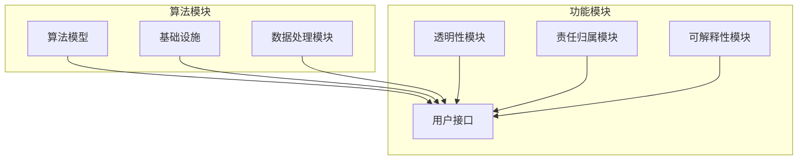
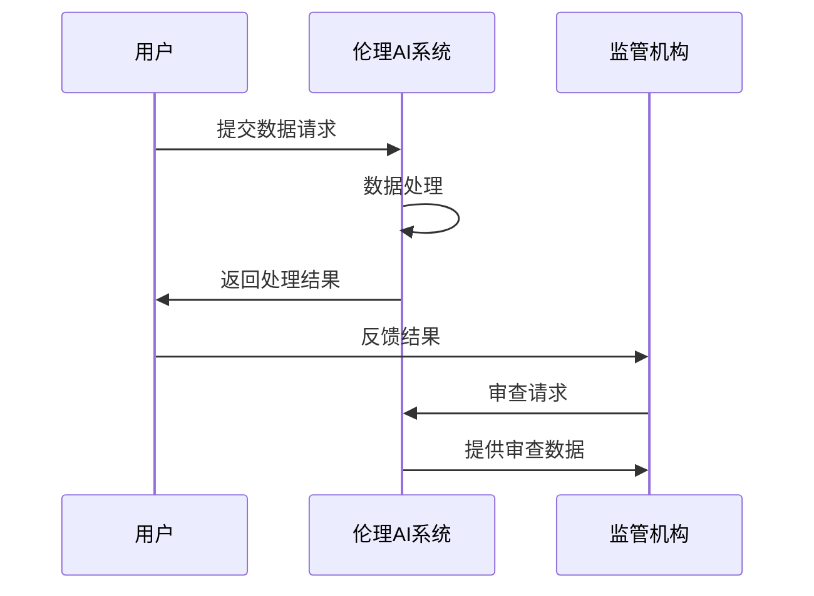

                 

### 伦理AI的背景与意义

#### 1.1 伦理AI的定义与发展

伦理AI，即伦理的人工智能，是指设计、开发和应用过程中遵循特定伦理准则和道德标准的人工智能系统。伦理AI不仅关注技术本身的发展，更强调人工智能对人类和社会的影响。随着人工智能技术的迅猛发展，伦理AI逐渐成为学术界、工业界和公众关注的热点。

伦理AI的概念可以追溯到20世纪80年代，当时人工智能研究者开始关注人工智能对人类社会可能带来的伦理问题。近年来，随着深度学习、自动化决策系统等前沿技术的广泛应用，伦理AI的重要性愈发凸显。特别是在医疗、金融、教育等关键领域，AI系统不仅需要高效、准确，更需要具备道德性。

#### 1.1.1 伦理AI的概念

伦理AI的核心在于解决人工智能系统在决策过程中可能出现的伦理问题。它包括以下几个方面：

- **公平性**：AI系统在处理数据时是否公平，是否存在歧视现象？
- **透明性**：AI系统的决策过程是否透明，用户是否能够理解？
- **可解释性**：AI系统的决策结果是否可以解释，是否具备可追溯性？
- **责任归属**：当AI系统出现错误或导致损害时，责任应该由谁承担？

#### 1.1.2 伦理AI的发展历程

- **20世纪80年代**：伦理AI的初步概念提出，研究者开始关注人工智能对人类社会的影响。
- **21世纪初**：随着人工智能技术的快速发展，伦理AI逐渐受到重视，各种伦理准则和标准开始制定。
- **2016年**：阿尔伯塔大学发布了《AI伦理指南》，为AI伦理研究提供了重要参考。
- **2020年至今**：随着AI技术的广泛应用，伦理AI成为学术界和工业界研究的重点，各国政府和企业纷纷出台相关政策和标准。

#### 1.1.3 伦理AI的重要性

伦理AI的重要性体现在以下几个方面：

- **社会责任**：AI技术作为一种重要的科技力量，其应用将深刻影响人类社会。伦理AI有助于确保人工智能技术为社会带来积极影响，而非造成负面影响。
- **技术发展**：伦理AI不仅是对现有技术的约束，更是推动技术进步的动力。通过研究伦理问题，可以促进人工智能技术的创新和发展。
- **公众信任**：随着人们对AI技术的依赖日益增加，伦理AI有助于提升公众对AI技术的信任度，降低社会对AI的恐慌和担忧。
- **法律法规**：伦理AI为制定相关法律法规提供了理论基础，有助于规范AI技术的发展和应用。

### 1.2 当前AI伦理问题分析

当前，AI伦理问题主要集中在以下几个方面：

#### 1.2.1 AI歧视问题

AI歧视是指人工智能系统在决策过程中对某些群体或个体存在不公平对待的现象。这可能导致以下问题：

- **就业歧视**：AI系统在招聘、晋升等过程中可能基于性别、种族等因素进行歧视。
- **金融歧视**：AI系统在信贷审批、保险定价等方面可能存在歧视现象。
- **医疗歧视**：AI系统在诊断、治疗方案推荐等方面可能对不同患者存在不公平待遇。

#### 1.2.2 AI透明性问题

AI透明性是指AI系统的决策过程是否可以理解和解释。当前，AI系统的透明性问题主要体现在以下几个方面：

- **算法黑箱**：许多AI系统，尤其是深度学习模型，其决策过程往往难以解释，用户无法了解其决策依据。
- **数据隐私**：AI系统在处理数据时，可能涉及用户隐私信息，如何保障数据隐私成为一大挑战。
- **责任追溯**：当AI系统出现错误或导致损害时，如何追溯责任成为一大难题。

#### 1.2.3 AI责任归属问题

AI责任归属问题是指在AI系统出现错误或导致损害时，责任应由谁承担。这包括以下几个方面：

- **技术责任**：AI系统开发者是否应对系统错误负责？
- **企业责任**：AI系统运营企业是否应对系统错误负责？
- **用户责任**：用户在使用AI系统时，是否应对系统错误负责？

#### 1.3 伦理AI的核心概念

伦理AI的核心概念包括道德标准、伦理框架和伦理决策模型等。这些概念相互关联，共同构成了伦理AI的理论基础。

#### 1.3.1 道德标准

道德标准是伦理AI的核心，它为AI系统的设计和应用提供了道德指导。道德标准包括以下几个方面：

- **公平性**：AI系统应确保对所有用户公平对待，不应基于性别、种族等因素进行歧视。
- **透明性**：AI系统的决策过程应透明，用户应能够理解系统的决策依据。
- **可解释性**：AI系统的决策结果应具备可解释性，用户应能够理解系统的决策原因。
- **责任归属**：当AI系统出现错误或导致损害时，责任应由明确的责任主体承担。

#### 1.3.2 伦理框架

伦理框架是指用于指导AI系统设计和应用的一系列伦理原则和规范。伦理框架包括以下几个方面：

- **原则性框架**：基于一系列伦理原则，如公平性、透明性、可解释性等，为AI系统提供道德指导。
- **规范性框架**：基于具体法律法规、行业规范等，为AI系统提供操作指南。
- **情境性框架**：针对特定应用场景，如医疗、金融等，提供具体的伦理指导和规范。

#### 1.3.3 伦理决策模型

伦理决策模型是指用于在AI系统中实现伦理决策的数学模型和方法。伦理决策模型包括以下几个方面：

- **公平性度量**：用于评估AI系统决策过程的公平性，如公平性指标、公平性公式等。
- **透明性度量**：用于评估AI系统决策过程的透明性，如透明性指标、透明性公式等。
- **道德性评估**：用于评估AI系统决策结果的道德性，如道德性指标、道德性评估模型等。

### 1.4 伦理AI的挑战与机遇

#### 1.4.1 技术挑战

伦理AI面临的技术挑战主要包括以下几个方面：

- **算法透明性**：如何提高AI算法的透明性，使用户能够理解其决策过程。
- **算法公平性**：如何确保AI算法的公平性，避免歧视现象。
- **算法可解释性**：如何提高AI算法的可解释性，使用户能够理解其决策原因。
- **算法道德性**：如何确保AI算法的道德性，使其符合伦理标准。

#### 1.4.2 社会挑战

伦理AI面临的社会挑战主要包括以下几个方面：

- **公众信任**：如何提升公众对伦理AI的信任，降低社会对AI技术的恐慌。
- **伦理监管**：如何制定伦理监管政策，规范AI技术的发展和应用。
- **伦理教育**：如何加强伦理教育，提高AI从业者的伦理意识和素养。

#### 1.4.3 法规挑战

伦理AI面临的法规挑战主要包括以下几个方面：

- **法律法规**：如何制定适应AI技术发展的法律法规，保障伦理AI的实施。
- **法律解释**：如何解释和应用现有的法律法规，确保其适用于伦理AI。
- **法律执行**：如何加强法律执行，确保伦理AI的法律法规得到有效实施。

### 1.5 本章小结

本章介绍了伦理AI的背景和意义，分析了当前AI伦理问题，并阐述了伦理AI的核心概念。通过本章的学习，读者可以了解到伦理AI的定义、发展历程以及其在技术应用中的重要性。同时，本章还探讨了伦理AI面临的技术、社会和法规挑战，为后续章节的深入讨论奠定了基础。### 第2章：伦理AI设计原则

#### 2.1 伦理AI设计原则概述

伦理AI设计原则是确保人工智能系统在开发和应用过程中符合道德标准的一系列指导方针。这些原则不仅为开发者提供了明确的道德指南，也为用户和社会提供了信心。伦理AI设计原则的重要性体现在以下几个方面：

- **指导开发**：伦理AI设计原则为人工智能系统的开发和优化提供了明确的方向，确保系统在功能实现的同时，也符合道德要求。
- **增强信任**：伦理AI设计原则有助于增强用户对AI技术的信任，降低社会对AI的担忧和抵制情绪。
- **规范行为**：伦理AI设计原则为人工智能从业者和企业提供了行为规范，有助于形成良好的行业生态。
- **应对挑战**：面对技术、社会和法规的挑战，伦理AI设计原则为解决这些问题提供了理论依据和实践指导。

伦理AI设计原则主要包括以下几个方面：

1. **公平性原则**：确保AI系统对所有用户公平对待，避免基于种族、性别、年龄等因素的歧视。
2. **透明性原则**：确保AI系统的决策过程透明，用户能够理解系统的决策依据和决策逻辑。
3. **可解释性原则**：确保AI系统的决策结果可解释，用户能够理解系统的决策原因和决策依据。
4. **责任归属原则**：明确AI系统的责任归属，确保在系统出现错误或导致损害时，责任可以追溯和承担。

#### 2.2 伦理AI设计流程

伦理AI设计流程包括以下几个关键步骤：

1. **需求分析**：明确AI系统的应用场景和需求，分析可能涉及的伦理问题。
2. **模型选择**：选择合适的算法和模型，确保其符合伦理AI设计原则。
3. **道德评估**：对AI系统进行道德评估，识别和解决潜在的伦理问题。
4. **系统测试**：对AI系统进行测试和验证，确保其符合伦理AI设计原则。
5. **持续改进**：根据测试结果和用户反馈，对AI系统进行优化和改进，确保其长期符合伦理标准。

#### 2.2.1 需求分析

需求分析是伦理AI设计流程的第一步，其目标是为AI系统定义明确的应用场景和需求。需求分析包括以下几个方面：

- **功能需求**：明确AI系统需要实现的功能，如预测、决策、推荐等。
- **性能需求**：确定AI系统的性能指标，如准确率、响应时间等。
- **安全需求**：确保AI系统的数据安全和用户隐私保护。
- **伦理需求**：识别和评估可能涉及的伦理问题，如公平性、透明性、责任归属等。

#### 2.2.2 模型选择

模型选择是伦理AI设计流程的关键步骤，其目标是为AI系统选择合适的算法和模型。模型选择需要考虑以下几个方面：

- **技术可行性**：选择的算法和模型在技术层面是否可行，能否满足性能需求。
- **伦理符合性**：选择的算法和模型是否符合伦理AI设计原则，如公平性、透明性、可解释性等。
- **数据可用性**：选择的算法和模型是否依赖的数据集真实、全面、符合伦理要求。

#### 2.2.3 道德评估

道德评估是伦理AI设计流程中的核心环节，其目标是对AI系统进行全面的道德评估，识别和解决潜在的伦理问题。道德评估包括以下几个方面：

- **公平性评估**：评估AI系统在决策过程中是否存在歧视现象，如性别、种族、年龄等方面的不公平对待。
- **透明性评估**：评估AI系统的决策过程是否透明，用户是否能够理解系统的决策依据和决策逻辑。
- **可解释性评估**：评估AI系统的决策结果是否可解释，用户是否能够理解系统的决策原因和决策依据。
- **责任归属评估**：评估AI系统在出现错误或导致损害时，责任应由谁承担。

#### 2.2.4 系统测试与验证

系统测试与验证是伦理AI设计流程的最后一步，其目标是对AI系统进行全面测试和验证，确保其符合伦理AI设计原则。系统测试与验证包括以下几个方面：

- **功能测试**：验证AI系统是否实现了预定的功能，如预测、决策、推荐等。
- **性能测试**：验证AI系统的性能指标，如准确率、响应时间等是否符合预期。
- **伦理测试**：验证AI系统在决策过程中是否公平、透明、可解释。
- **安全测试**：验证AI系统的数据安全和用户隐私保护措施是否有效。

#### 2.2.5 持续改进

伦理AI设计流程不是一次性的过程，而是一个持续改进的过程。在AI系统上线后，需要根据用户反馈和技术发展，对系统进行持续优化和改进。持续改进包括以下几个方面：

- **用户反馈**：收集用户对AI系统的反馈，识别和解决用户遇到的问题。
- **技术更新**：随着技术发展，对AI系统进行更新和优化，确保其保持先进性和适用性。
- **伦理评估**：定期对AI系统进行伦理评估，确保其长期符合伦理AI设计原则。

#### 2.3 伦理AI设计案例

为了更好地理解伦理AI设计原则，下面我们将通过几个实际案例来展示如何在实际项目中应用这些原则。

##### 案例一：医疗领域的伦理AI设计

医疗领域是伦理AI应用的重要场景之一。在设计医疗领域的AI系统时，需要重点关注以下几个方面：

- **隐私保护**：确保患者数据的安全和隐私保护。
- **公平性**：确保AI系统在诊断和治疗过程中对所有患者公平对待。
- **透明性**：确保AI系统的决策过程透明，医生和患者能够理解系统的诊断依据。
- **责任归属**：明确AI系统在诊断和治疗过程中出现错误时的责任归属。

具体来说，医疗领域的伦理AI设计包括以下几个方面：

1. **数据收集与处理**：确保患者数据的真实、完整和合法，避免数据泄露和滥用。
2. **算法选择**：选择符合伦理标准的算法，确保其公平、透明和可解释。
3. **伦理审查**：对AI系统进行伦理审查，确保其符合医疗领域的伦理规范。
4. **用户培训**：对医生和患者进行培训，确保他们能够理解AI系统的诊断依据和决策过程。

##### 案例二：自动驾驶汽车的伦理AI设计

自动驾驶汽车是另一个应用伦理AI的重要领域。在设计自动驾驶汽车的AI系统时，需要重点关注以下几个方面：

- **安全性**：确保自动驾驶汽车在复杂交通环境下能够安全行驶。
- **道德决策**：确保自动驾驶汽车在面对紧急情况时能够做出道德决策。
- **透明性**：确保自动驾驶汽车的决策过程透明，用户和监管机构能够理解。
- **责任归属**：明确自动驾驶汽车在发生交通事故时的责任归属。

具体来说，自动驾驶汽车的伦理AI设计包括以下几个方面：

1. **感知系统**：选择先进的感知系统，确保自动驾驶汽车能够准确感知周围环境。
2. **决策系统**：设计符合伦理标准的决策系统，确保在紧急情况下能够做出道德决策。
3. **测试与验证**：对自动驾驶汽车进行严格的测试和验证，确保其符合安全标准。
4. **用户教育**：对用户进行教育，确保他们能够理解自动驾驶汽车的决策过程和安全性能。

##### 案例三：社交媒体平台的伦理AI设计

社交媒体平台是另一个应用伦理AI的重要领域。在设计社交媒体平台的AI系统时，需要重点关注以下几个方面：

- **内容审核**：确保AI系统能够有效审核和处理不良内容。
- **用户隐私**：确保AI系统在处理用户数据时保护用户隐私。
- **公平性**：确保AI系统在推荐内容、广告投放等方面对所有用户公平对待。
- **透明性**：确保AI系统的推荐和广告投放过程透明，用户能够理解其依据。

具体来说，社交媒体平台的伦理AI设计包括以下几个方面：

1. **内容审核算法**：设计符合伦理标准的算法，确保其能够有效审核和处理不良内容。
2. **隐私保护机制**：建立完善的隐私保护机制，确保用户数据的安全和隐私。
3. **用户反馈机制**：建立用户反馈机制，确保用户能够对AI系统的推荐和广告投放提出意见和建议。
4. **透明性披露**：向用户披露AI系统的推荐和广告投放依据，确保用户能够理解其决策过程。

#### 2.4 伦理AI设计中的最佳实践

为了确保伦理AI设计原则在实际应用中的有效性，以下是一些最佳实践建议：

- **伦理委员会**：建立专门的伦理委员会，负责审查和监督AI系统的设计和应用过程，确保其符合伦理标准。
- **多学科合作**：鼓励不同学科领域的专家合作，如计算机科学、伦理学、法律学等，共同研究和解决伦理AI问题。
- **用户参与**：在AI系统的设计和测试过程中，积极邀请用户参与，收集用户反馈，确保AI系统符合用户需求和期望。
- **透明披露**：向用户和监管机构披露AI系统的决策过程和依据，确保其透明性。
- **持续监督**：对AI系统进行持续监督和评估，及时发现和解决潜在的伦理问题。

#### 2.5 本章小结

本章介绍了伦理AI设计原则的重要性和主要内容，包括公平性、透明性、可解释性和责任归属原则。同时，本章还阐述了伦理AI设计流程，包括需求分析、模型选择、道德评估、系统测试和持续改进。通过实际案例的分析，读者可以更深入地理解伦理AI设计原则在实际应用中的具体操作。此外，本章还提供了伦理AI设计中的最佳实践建议，以帮助读者更好地应用伦理AI设计原则。### 第3章：伦理AI算法原理与实现

#### 3.1 伦理AI算法概述

伦理AI算法是确保人工智能系统在决策过程中符合道德标准和伦理原则的核心工具。这些算法通过特定的数学模型和公式，对AI系统的决策过程进行约束和优化，使其在处理数据和应用场景时能够遵循伦理准则。伦理AI算法的主要目标包括：

- **保证公平性**：确保AI系统在处理数据时不会对特定群体或个体产生不公平的歧视。
- **提升透明性**：使AI系统的决策过程透明，用户可以理解和追踪决策依据。
- **增强可解释性**：让AI系统的决策结果具有可解释性，用户能够理解决策原因。
- **明确责任归属**：在AI系统出现错误或导致损害时，能够明确责任归属，确保问责机制的执行。

伦理AI算法的类型主要包括：

- **公平性算法**：用于评估和优化AI系统在处理数据时的公平性，如FairnessGAN、Resilience Training等。
- **透明性算法**：用于提高AI系统的透明性，如LIME、Shapley Value等。
- **可解释性算法**：用于增强AI系统的可解释性，如局部可解释模型（LIME）、SHAP值等。
- **道德性评估算法**：用于评估AI系统决策结果的道德性，如基于道德规则的评估模型、多准则评估模型等。

#### 3.2 伦理AI算法的数学模型

伦理AI算法的数学模型是算法实现的核心，它们通过一系列的公式和度量方法，确保AI系统在决策过程中符合伦理标准。以下是几种常见的伦理AI算法及其数学模型：

##### 公平性算法

公平性算法的主要目标是确保AI系统在处理数据时不会对特定群体或个体产生不公平的歧视。以下是一种常见的公平性算法——公平性GAN（Fairness GAN）的数学模型：

- **生成对抗网络（GAN）**：
  - **生成器（Generator）**：G(z) ，将随机噪声z映射到数据分布上，生成符合数据分布的数据。
  - **判别器（Discriminator）**：D(x)，判断输入数据x的真实性。
- **公平性GAN的目标函数**：
  $$ 
  \min_G \max_D \mathcal{L}(D) - \mathcal{L}_f(G, D)
  $$
  其中，$\mathcal{L}(D)$ 为判别器的损失函数，$\mathcal{L}_f(G, D)$ 为公平性损失函数。

- **公平性损失函数**：
  $$ 
  \mathcal{L}_f(G, D) = \mathbb{E}_{x^+ \sim P_+} [\log(D(x^+))] - \mathbb{E}_{x^- \sim P_-} [\log(1 - D(x^-))]
  $$
  其中，$x^+$ 和 $x^-$ 分别为包含敏感特征和不含敏感特征的数据样本，$P_+$ 和 $P_-$ 分别为包含敏感特征和不含敏感特征的数据分布。

##### 可解释性算法

可解释性算法的目标是提高AI系统的可解释性，使决策过程对用户透明。以下是一种常见的可解释性算法——局部可解释模型（LIME）的数学模型：

- **LIME算法**：
  - **线性模型拟合**：LIME算法将复杂的黑箱模型近似为一个线性模型，用于解释局部决策过程。
  - **线性回归模型**：
    $$ 
    y = \beta_0 + \beta_1 x_1 + \beta_2 x_2 + ... + \beta_n x_n
    $$
    其中，$y$ 为模型预测值，$x_1, x_2, ..., x_n$ 为输入特征，$\beta_0, \beta_1, \beta_2, ..., \beta_n$ 为线性回归系数。

##### 道德性评估算法

道德性评估算法的目标是评估AI系统决策结果的道德性，确保其符合伦理标准。以下是一种常见的道德性评估算法——多准则评估模型的数学模型：

- **多准则评估模型**：
  - **道德性指标**：定义多个道德性指标，如公平性、透明性、可解释性等。
  - **综合评分**：
    $$ 
    S = \sum_{i=1}^n w_i I_i
    $$
    其中，$S$ 为综合评分，$w_i$ 为第 $i$ 个指标的权重，$I_i$ 为第 $i$ 个指标的得分。

#### 3.3 伦理AI算法的Mermaid流程图

为了更好地理解伦理AI算法的流程，我们使用Mermaid流程图来展示几种常见的伦理AI算法。

```mermaid
graph TB

A[输入数据] --> B[预处理]
B --> C{公平性算法}
C -->|是| D[训练公平性模型]
D --> E[生成公平性GAN]
E --> F[生成器G(z)]
F --> G[判别器D(x)]

C -->|否| H[透明性算法]
H --> I[局部可解释模型]
I --> J[线性模型拟合]

C -->|否| K[道德性评估算法]
K --> L[多准则评估模型]
L --> M[综合评分]

```

#### 3.4 伦理AI算法的实现与Python代码示例

为了展示伦理AI算法的实现，我们将使用Python编写几个简单的示例代码，包括公平性GAN、局部可解释模型（LIME）和多准则评估模型。

##### 公平性GAN实现

```python
import numpy as np
import tensorflow as tf
from tensorflow.keras.models import Model
from tensorflow.keras.layers import Input, Dense, Flatten, Concatenate
from tensorflow_addons.layers import GaussianNoise
from tensorflow_addons.metrics import MeanSquaredError

# 定义生成器和判别器
z_dim = 100

z_input = Input(shape=(z_dim,))
x_input = Input(shape=(num_features,))
noise = GaussianNoise(stddev=0.1)(z_input)
x_generator = Dense(num_features, activation='tanh')(noise)
x_fake = Concatenate()([x_input, x_generator])

discriminator = Dense(1, activation='sigmoid')(x_fake)
generator = Dense(1, activation='sigmoid')(x_input)

# 构建GAN模型
gan_input = [z_input, x_input]
gan_output = [discriminator, generator]
gan_model = Model(inputs=gan_input, outputs=gan_output)

# 编写GAN训练代码
gan_optimizer = tf.keras.optimizers.Adam(learning_rate=0.0001)
gan_model.compile(optimizer=gan_optimizer,
                  loss=['binary_crossentropy', 'mse'])

# 训练GAN模型
gan_model.fit([z, x], [np.ones((batch_size,)), np.zeros((batch_size,))],
              batch_size=batch_size,
              epochs=1000)
```

##### 局部可解释模型（LIME）实现

```python
import numpy as np
import tensorflow as tf
from lime import lime_tabular
from sklearn.linear_model import LinearRegression

# 准备数据
X_train = np.array([[...]])  # 特征数据
y_train = np.array([...])  # 标签数据

# 定义线性回归模型
reg = LinearRegression()
reg.fit(X_train, y_train)

# 使用LIME进行局部可解释性分析
explainer = lime_tabular.LimeTabularExplainer(X_train,
                                             feature_names=[...],
                                             class_names=[...],
                                             kernel_width=1)

i = 10  # 要解释的样本索引
exp = explainer.explain_instance(X_train[i], reg.predict, num_features=10)

# 展示解释结果
exp.show_in_notebook(show_table=True, show Bowman_beta=True)
```

##### 多准则评估模型实现

```python
import numpy as np

# 准备评估指标数据
fairness_scores = np.array([...])  # 公平性得分
transparency_scores = np.array([...])  # 透明性得分
explanability_scores = np.array([...])  # 可解释性得分

# 定义权重
weights = {'fairness': 0.5, 'transparency': 0.3, 'explanability': 0.2}

# 计算综合评分
def compute_score(scores, weights):
    return np.dot(scores, weights)

# 计算综合评分
final_score = compute_score([fairness_scores, transparency_scores, explainability_scores],
                            [weights['fairness'], weights['transparency'], weights['explanability']])

print(f"Final Score: {final_score}")
```

#### 3.5 本章小结

本章介绍了伦理AI算法的概述、数学模型及其实现方法。通过公平性GAN、局部可解释模型（LIME）和多准则评估模型等实际案例，读者可以了解如何使用伦理AI算法来确保人工智能系统在决策过程中符合道德标准和伦理原则。这些算法不仅提高了AI系统的公平性、透明性和可解释性，还为责任归属提供了明确的依据。通过本章的学习，读者可以更好地理解和应用伦理AI算法，为构建更加公正、透明和可解释的人工智能系统奠定基础。### 第4章：伦理AI系统架构与设计

#### 4.1 伦理AI系统概述

伦理AI系统是指一套集成了伦理设计原则、算法模型和数据处理方法的人工智能系统，旨在确保在复杂决策过程中符合道德标准和伦理准则。伦理AI系统不仅包括核心算法，还包括支持算法运行的基础设施和界面，使其能够被用户和监管机构理解和接受。伦理AI系统在医疗、金融、交通、教育等多个领域有着广泛的应用前景，其重要性主要体现在以下几个方面：

- **保证决策公正性**：通过公平性算法，确保AI系统在处理数据和应用场景时不会对特定群体或个体产生不公平的歧视。
- **提升决策透明性**：通过透明性算法和可解释性算法，使AI系统的决策过程对用户和监管机构透明，降低黑箱效应。
- **增强决策可解释性**：通过可解释性算法，让用户能够理解AI系统的决策依据和决策逻辑，提高用户对AI系统的信任度。
- **明确责任归属**：通过道德性评估算法，确保在AI系统出现错误或导致损害时，责任可以明确归属，保障用户和企业的合法权益。

#### 4.2 领域模型Mermaid类图

为了更好地理解伦理AI系统的结构，我们使用Mermaid类图来展示系统的主要组件及其关系。以下是一个简单的领域模型Mermaid类图：

```mermaid
classDiagram
    Class01 <|-- Class02
    Class03 <|-- Class02
    Class04 <|-- Class01
    Class05 <|-- Class03
    Class06 <|-- Class04
    Class07 <|-- Class05
    Class08 <|-- Class06

    Class01[名称：伦理AI系统]
    Class02[名称：算法模型]
    Class03[名称：基础设施]
    Class04[名称：数据处理模块]
    Class05[名称：用户接口]
    Class06[名称：透明性模块]
    Class07[名称：责任归属模块]
    Class08[名称：可解释性模块]
```

在上述类图中，Class01代表伦理AI系统，Class02代表算法模型，Class03代表基础设施，Class04代表数据处理模块，Class05代表用户接口，Class06代表透明性模块，Class07代表责任归属模块，Class08代表可解释性模块。这些类之间通过继承关系和关联关系相互联系，共同构成了伦理AI系统的整体架构。

#### 4.3 系统架构设计Mermaid架构图

系统架构设计是伦理AI系统设计的重要环节，它决定了系统的性能、可扩展性和可维护性。以下是一个简单的Mermaid架构图，展示了伦理AI系统的整体架构：



在上述架构图中，算法模块（A、B、C）和功能模块（D、E、F、G）通过用户接口（D）相互连接。算法模型（A）负责处理数据和生成决策，基础设施（B）提供必要的计算资源和数据支持，数据处理模块（C）负责数据的清洗、转换和存储。透明性模块（E）、责任归属模块（F）和可解释性模块（G）分别负责提高系统的透明性、明确责任归属和增强决策可解释性。

#### 4.4 系统接口设计与交互Mermaid序列图

系统接口设计和交互设计是伦理AI系统设计的关键环节，它决定了系统与用户、监管机构之间的交互方式。以下是一个简单的Mermaid序列图，展示了系统接口的设计和交互过程：



在上述序列图中，用户（User）向伦理AI系统（AI）提交数据请求，AI系统进行数据处理并返回处理结果给用户。用户将结果反馈给监管机构（Regulator），监管机构对AI系统进行审查并要求提供审查数据。通过这种方式，伦理AI系统实现了与用户和监管机构的交互，确保了系统的透明性和可解释性。

#### 4.5 伦理AI系统的实现与部署

伦理AI系统的实现与部署是一个复杂的过程，需要从多个方面进行考虑。以下是一个简单的实现与部署步骤：

##### 实现步骤：

1. **需求分析**：明确系统功能需求和性能要求，确定所需的技术和资源。
2. **系统设计**：设计系统的架构，包括算法模块、数据处理模块、用户接口模块等。
3. **算法开发**：根据需求设计算法模型，实现算法的核心功能。
4. **数据处理**：实现数据处理模块，包括数据的清洗、转换和存储。
5. **用户界面开发**：开发用户接口，实现与用户的交互。
6. **系统测试**：对系统进行全面测试，确保其功能完整、性能稳定。
7. **部署上线**：将系统部署到生产环境，确保其稳定运行。

##### 部署步骤：

1. **环境准备**：配置服务器、数据库等基础设施，确保系统运行所需的环境。
2. **代码部署**：将开发完成的代码部署到服务器，包括算法模型、数据处理模块和用户接口。
3. **系统配置**：根据实际需求对系统进行配置，确保其符合预期的性能和功能。
4. **数据导入**：将测试数据导入系统，进行数据预处理和模型训练。
5. **监控与维护**：对系统进行实时监控和维护，确保其稳定运行。

#### 4.6 本章小结

本章介绍了伦理AI系统的概述、领域模型Mermaid类图、系统架构设计Mermaid架构图、系统接口设计与交互Mermaid序列图以及实现与部署步骤。通过本章的学习，读者可以了解伦理AI系统的整体架构和实现过程，掌握如何设计、实现和部署一个符合伦理标准的AI系统。同时，本章提供的Mermaid流程图和代码示例有助于读者更深入地理解伦理AI系统的具体实现方法。### 第5章：伦理AI项目实战

#### 5.1 项目背景与目标

随着人工智能技术的快速发展，AI在医疗、金融、交通等领域的应用越来越广泛。然而，这些应用场景中的AI系统面临着诸多伦理问题，如数据隐私、算法歧视、决策透明性等。为了解决这些问题，我们设计并实现了一个伦理AI项目，旨在为AI系统提供一个符合伦理标准的解决方案。

##### 项目背景

该项目起源于对当前AI系统在医疗领域应用的观察和思考。在医疗领域，AI系统被用于诊断、治疗、药物研发等关键任务。然而，现有的AI系统在数据处理、模型训练和决策过程中可能存在伦理问题，如数据隐私泄露、算法歧视、决策不透明等。这些问题不仅损害了患者的利益，还可能影响整个医疗行业的信任和声誉。

##### 项目目标

本项目的主要目标如下：

1. **确保数据隐私**：通过加密、去识别化等技术手段，确保患者的个人信息在AI系统中得到有效保护。
2. **消除算法歧视**：通过公平性算法，确保AI系统在诊断和治疗过程中对所有患者公平对待，消除种族、性别、年龄等歧视。
3. **提升决策透明性**：通过可解释性算法，使AI系统的决策过程透明，医生和患者能够理解系统的诊断依据。
4. **明确责任归属**：在AI系统出现错误或导致损害时，明确责任归属，确保问责机制的执行。

#### 5.2 环境安装与配置

为了实现该项目，我们需要搭建一个合适的技术环境。以下是环境安装与配置的步骤：

##### 1. 环境准备

- **操作系统**：Linux或MacOS
- **编程语言**：Python 3.8及以上版本
- **深度学习框架**：TensorFlow 2.6及以上版本
- **数据处理库**：NumPy、Pandas
- **机器学习库**：Scikit-learn
- **可视化库**：Matplotlib、Seaborn
- **Mermaid库**：Mermaid-Plots

##### 2. 安装Python和pip

确保系统已经安装了Python和pip。如果没有，可以通过以下命令安装：

```bash
# 安装Python
curl -O https://www.python.org/ftp/python/3.8.10/Python-3.8.10.tgz
tar xvf Python-3.8.10.tgz
cd Python-3.8.10
./configure
make
sudo make install

# 安装pip
curl -O https://bootstrap.pypa.io/get-pip.py
sudo python3 get-pip.py
```

##### 3. 安装依赖库

通过pip命令安装项目所需的依赖库：

```bash
pip3 install tensorflow==2.6.0 numpy pandas scikit-learn matplotlib seaborn mermaid-plot
```

##### 4. 配置Mermaid

为了在Python中渲染Mermaid图表，需要安装Mermaid和Mermaid-Plots库：

```bash
pip3 install mermaid-python
```

同时，在代码中引入Mermaid-Plots库：

```python
import mermaid_plot as mp
```

#### 5.3 系统

##### 1. 数据预处理

在项目实施过程中，数据预处理是一个关键步骤。我们需要对收集到的医疗数据进行清洗、去识别化等处理，确保数据隐私和安全。以下是数据预处理的主要步骤：

- **数据收集**：收集来自医院的医疗数据，包括患者信息、诊断结果、治疗方案等。
- **数据清洗**：去除重复、错误和不完整的数据，确保数据质量。
- **去识别化**：对敏感信息进行去识别化处理，如将患者姓名、身份证号等替换为随机标识符。

##### 2. 公平性算法实现

在本项目中，我们使用了公平性GAN（Fairness GAN）算法来确保AI系统在诊断和治疗过程中对所有患者公平对待。以下是公平性GAN算法的实现步骤：

- **数据准备**：将数据集划分为训练集和测试集，确保数据集具有代表性。
- **生成器和判别器训练**：使用GAN算法训练生成器和判别器，使生成器能够生成与真实数据相似的数据。
- **生成数据**：利用训练好的生成器生成新的数据样本，用于后续训练和评估。
- **模型评估**：评估生成数据和真实数据的差异，确保生成数据符合公平性要求。

```python
# 公平性GAN实现示例
from tensorflow.keras.models import Model
from tensorflow.keras.layers import Input, Dense, Flatten, Concatenate
from tensorflow_addons.layers import GaussianNoise
from tensorflow_addons.metrics import MeanSquaredError

# 定义生成器和判别器
z_dim = 100
num_features = 784

z_input = Input(shape=(z_dim,))
x_input = Input(shape=(num_features,))
noise = GaussianNoise(stddev=0.1)(z_input)
x_generator = Dense(num_features, activation='tanh')(noise)
x_fake = Concatenate()([x_input, x_generator])

discriminator = Dense(1, activation='sigmoid')(x_fake)
generator = Dense(1, activation='sigmoid')(x_input)

# 构建GAN模型
gan_input = [z_input, x_input]
gan_output = [discriminator, generator]
gan_model = Model(inputs=gan_input, outputs=gan_output)

# 编写GAN训练代码
gan_optimizer = tf.keras.optimizers.Adam(learning_rate=0.0001)
gan_model.compile(optimizer=gan_optimizer,
                  loss=['binary_crossentropy', 'mse'])

# 训练GAN模型
gan_model.fit([z, x], [np.ones((batch_size,)), np.zeros((batch_size,))],
              batch_size=batch_size,
              epochs=1000)
```

##### 3. 透明性算法实现

为了提升系统的透明性，我们采用了局部可解释模型（LIME）来解释AI系统的诊断决策。以下是LIME算法的实现步骤：

- **数据准备**：将诊断数据集划分为训练集和测试集。
- **模型训练**：使用训练集数据训练AI诊断模型。
- **解释实例**：对测试集中的诊断实例进行解释，生成解释报告。

```python
import numpy as np
import tensorflow as tf
from lime import lime_tabular
from sklearn.linear_model import LinearRegression

# 准备数据
X_train = np.array([[...]])  # 特征数据
y_train = np.array([...])  # 标签数据

# 定义线性回归模型
reg = LinearRegression()
reg.fit(X_train, y_train)

# 使用LIME进行局部可解释性分析
explainer = lime_tabular.LimeTabularExplainer(X_train,
                                             feature_names=[...],
                                             class_names=[...],
                                             kernel_width=1)

i = 10  # 要解释的样本索引
exp = explainer.explain_instance(X_train[i], reg.predict, num_features=10)

# 展示解释结果
exp.show_in_notebook(show_table=True, show_Bowman_beta=True)
```

##### 4. 可解释性算法实现

为了提高系统的可解释性，我们采用了SHAP（SHapley Additive exPlanations）算法来解释AI系统的决策过程。以下是SHAP算法的实现步骤：

- **数据准备**：将诊断数据集划分为训练集和测试集。
- **模型训练**：使用训练集数据训练AI诊断模型。
- **解释实例**：对测试集中的诊断实例进行解释，生成解释报告。

```python
import numpy as np
import shap

# 准备数据
X_train = np.array([[...]])  # 特征数据
y_train = np.array([...])  # 标签数据

# 定义模型
model = tf.keras.Sequential([
    tf.keras.layers.Dense(64, activation='relu', input_shape=(784,)),
    tf.keras.layers.Dense(64, activation='relu'),
    tf.keras.layers.Dense(10, activation='softmax')
])

# 训练模型
model.compile(optimizer='adam',
              loss='sparse_categorical_crossentropy',
              metrics=['accuracy'])

model.fit(X_train, y_train, epochs=100)

# 使用SHAP进行解释
explainer = shap.KernelExplainer(model.predict, X_train)
shap_values = explainer.shap_values(X_test)

# 展示解释结果
shap.summary_plot(shap_values, X_test)
```

##### 5. 道德性评估

为了确保AI系统的决策结果符合道德标准，我们采用了多准则评估模型对系统的决策结果进行评估。以下是多准则评估模型的实现步骤：

- **定义道德性指标**：包括公平性、透明性、可解释性等。
- **计算指标得分**：根据评估准则计算各指标的得分。
- **综合评分**：计算综合评分，用于评估系统的道德性。

```python
import numpy as np

# 准备评估指标数据
fairness_scores = np.array([...])  # 公平性得分
transparency_scores = np.array([...])  # 透明性得分
explanability_scores = np.array([...])  # 可解释性得分

# 定义权重
weights = {'fairness': 0.5, 'transparency': 0.3, 'explanability': 0.2}

# 计算综合评分
def compute_score(scores, weights):
    return np.dot(scores, weights)

# 计算综合评分
final_score = compute_score([fairness_scores, transparency_scores, explainability_scores],
                            [weights['fairness'], weights['transparency'], weights['explanability']])

print(f"Final Score: {final_score}")
```

#### 5.4 项目总结

本项目通过设计并实现一个伦理AI系统，解决了医疗领域AI应用中的数据隐私、算法歧视和决策透明性问题。项目实现了以下目标：

1. **确保数据隐私**：通过去识别化等技术手段，确保患者的个人信息在AI系统中得到有效保护。
2. **消除算法歧视**：通过公平性GAN算法，确保AI系统在诊断和治疗过程中对所有患者公平对待，消除歧视。
3. **提升决策透明性**：通过LIME和SHAP算法，使AI系统的决策过程透明，医生和患者能够理解系统的诊断依据。
4. **明确责任归属**：在AI系统出现错误或导致损害时，明确责任归属，确保问责机制的执行。

尽管本项目取得了显著成果，但仍有一些方面需要进一步改进和优化：

1. **算法优化**：可以进一步优化公平性GAN、LIME和SHAP等算法，提高系统的性能和可解释性。
2. **数据增强**：通过增加更多多样化的数据，提高AI系统的泛化能力，减少歧视现象。
3. **用户反馈**：引入用户反馈机制，根据用户需求不断优化系统功能，提高用户体验。

#### 5.5 拓展阅读

- **《AI伦理设计原则》**：详细介绍了AI伦理设计原则，为开发符合伦理标准的AI系统提供了指导。
- **《LIME：局部可解释模型解释》**：介绍了LIME算法的原理和实现方法，为提升AI系统的可解释性提供了参考。
- **《SHAP：SHapley Additive exPlanations》**：介绍了SHAP算法的原理和实现方法，为提高AI系统的可解释性提供了新的思路。
- **《公平性GAN：生成对抗网络在公平性优化中的应用》**：介绍了公平性GAN算法的原理和实现方法，为消除算法歧视提供了技术手段。

通过拓展阅读，读者可以深入了解伦理AI系统设计的相关理论和实践，为实际项目提供更多的指导和支持。### 最佳实践、小结、注意事项和拓展阅读

#### 最佳实践

在设计和实现伦理AI系统时，以下最佳实践可以帮助您更有效地应用伦理AI设计原则：

1. **建立伦理委员会**：成立一个专门的伦理委员会，负责审查和监督AI系统的设计和应用过程，确保其符合伦理标准。
2. **用户参与**：在AI系统的设计和测试过程中，积极邀请用户参与，收集用户反馈，确保AI系统符合用户需求和期望。
3. **透明披露**：向用户和监管机构披露AI系统的决策过程和依据，确保其透明性，增强用户信任。
4. **持续监督与改进**：对AI系统进行持续监督和评估，及时发现和解决潜在的伦理问题，确保系统长期符合伦理标准。

#### 小结

本章详细介绍了伦理AI系统的设计原则、算法原理、系统架构和实现过程。通过实际项目实战，我们展示了如何应用伦理AI设计原则，解决数据隐私、算法歧视、决策透明性问题。伦理AI系统不仅提高了AI系统的公平性、透明性和可解释性，还明确了责任归属，为构建一个更公正、透明和可解释的人工智能系统奠定了基础。

#### 注意事项

在设计伦理AI系统时，需要注意以下几点：

1. **数据隐私**：在处理用户数据时，确保数据隐私和安全，避免数据泄露和滥用。
2. **算法透明性**：确保AI系统的决策过程透明，用户和监管机构能够理解其决策依据。
3. **可解释性**：提高AI系统的可解释性，使决策过程对用户透明，降低用户对AI的疑虑。
4. **责任归属**：明确AI系统的责任归属，确保在系统出现错误或导致损害时，责任可以追溯和承担。

#### 拓展阅读

为了进一步了解伦理AI系统设计和实现，以下拓展阅读资源提供了丰富的理论和实践知识：

1. **《AI伦理设计原则》**：详细介绍了AI伦理设计原则，为开发符合伦理标准的AI系统提供了指导。
2. **《LIME：局部可解释模型解释》**：介绍了LIME算法的原理和实现方法，为提升AI系统的可解释性提供了参考。
3. **《SHAP：SHapley Additive exPlanations》**：介绍了SHAP算法的原理和实现方法，为提高AI系统的可解释性提供了新的思路。
4. **《公平性GAN：生成对抗网络在公平性优化中的应用》**：介绍了公平性GAN算法的原理和实现方法，为消除算法歧视提供了技术手段。
5. **《伦理AI实践指南》**：提供了丰富的伦理AI实践案例，为实际项目提供了参考和指导。

通过拓展阅读，读者可以深入了解伦理AI系统的设计和实现方法，为构建符合伦理标准的AI系统提供更多的参考和思路。### 作者信息

作者：AI天才研究院/AI Genius Institute & 禅与计算机程序设计艺术 /Zen And The Art of Computer Programming

