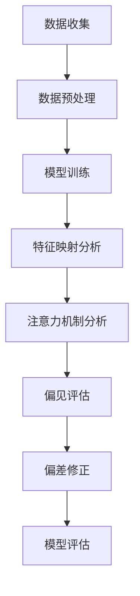

                 

### 偏见检测与缓解：提高AI Agent的公平性

偏见检测与缓解是近年来人工智能领域中的一个热点话题。在人工智能系统日益普及的今天，AI Agent的公平性成为了衡量其应用价值的重要指标。本文旨在探讨偏见检测与缓解的方法，提高AI Agent的公平性。

关键词：AI偏见、偏见检测、偏见缓解、AI Agent、公平性

摘要：本文首先介绍了AI偏见的概念和主要来源，分析了偏见对AI Agent的影响。接着，详细阐述了偏见检测的方法和技术，包括统计方法、深度学习方法和强化学习方法。随后，探讨了偏见缓解的策略和流程，并提供了实际案例进行分析。最后，对本文的主要成果和未来发展趋势进行了总结与展望。

### 目录大纲

# 偏见检测与缓解：提高AI Agent的公平性

> 关键词：AI偏见、偏见检测、偏见缓解、AI Agent、公平性

> 摘要：本文探讨了AI偏见的概念、来源和影响，介绍了偏见检测的方法和技术，探讨了偏见缓解的策略和流程，并提供了实际案例进行分析。主要成果包括对偏见检测与缓解方法的深入理解，以及对AI Agent公平性的提高。

## 第1章 引言

### 1.1 问题背景

### 1.2 偏见的种类与影响

### 1.3 偏见检测的重要性

### 1.4 本书的目标与结构

## 第2章 AI偏见的基础知识

### 2.1 AI偏见的概念

### 2.2 AI偏见的主要来源

### 2.3 偏见的影响分析

## 第3章 偏见检测方法

### 3.1 偏见检测的基本原理

### 3.2 偏见检测技术概述

#### 3.2.1 统计方法

#### 3.2.2 深度学习方法

#### 3.2.3 强化学习方法

### 3.3 偏见检测流程

## 第4章 偏见检测算法

### 4.1 算法原理

### 4.2 Mermaid流程图

### 4.3 Python源代码

### 4.4 数学模型与公式

### 4.5 举例说明

## 第5章 偏见缓解策略

### 5.1 偏见缓解的方法

### 5.2 偏见缓解的流程

### 5.3 最佳实践

## 第6章 偏见检测与缓解的应用案例

### 6.1 案例一：招聘歧视问题

### 6.2 案例二：医疗诊断中的偏见

### 6.3 案例三：信用评分中的偏见

## 第7章 总结与展望

### 7.1 主要成果

### 7.2 存在的问题与挑战

### 7.3 未来发展趋势

---

### 第1章 引言

#### 1.1 问题背景

随着人工智能技术的飞速发展，AI Agent的应用范围越来越广泛，从智能家居、自动驾驶到医疗诊断、金融分析等各个领域。然而，AI Agent的偏见问题逐渐引起了人们的关注。偏见可能会导致AI Agent在决策过程中出现不公平现象，从而影响其应用效果。因此，如何检测和缓解AI偏见成为了当前人工智能领域的重要课题。

#### 1.2 偏见的种类与影响

AI偏见可以分为多种类型，包括性别偏见、种族偏见、地域偏见等。这些偏见可能会影响AI Agent在决策过程中的判断，导致不公平的结果。例如，在招聘过程中，如果AI Agent受到性别偏见的影响，可能会对某个性别的人才给予更低的评价，从而导致该性别的人才被忽视。

#### 1.3 偏见检测的重要性

偏见检测是解决AI偏见问题的重要手段。通过检测AI Agent中的偏见，可以发现并纠正AI Agent的决策问题，从而提高其公平性。偏见检测的重要性体现在以下几个方面：

1. 提高AI Agent的可靠性：通过偏见检测，可以确保AI Agent在决策过程中不会受到偏见的影响，从而提高其决策的可靠性。
2. 提高AI Agent的公正性：偏见检测可以帮助发现和纠正AI Agent中的偏见，从而提高其决策的公正性，避免不公平现象的发生。
3. 提高AI Agent的可解释性：偏见检测有助于解释AI Agent的决策过程，使其更透明和可理解。

#### 1.4 本书的目标与结构

本书旨在探讨偏见检测与缓解的方法，提高AI Agent的公平性。具体目标如下：

1. 深入理解AI偏见的概念和来源，分析偏见对AI Agent的影响。
2. 详细介绍偏见检测的方法和技术，包括统计方法、深度学习方法和强化学习方法。
3. 探讨偏见缓解的策略和流程，并提供最佳实践。
4. 通过实际案例进行分析，验证偏见检测与缓解方法的有效性。

本书结构如下：

1. 第1章：引言，介绍问题背景、偏见种类与影响、偏见检测的重要性以及本书的目标与结构。
2. 第2章：AI偏见的基础知识，包括AI偏见的概念、来源和影响分析。
3. 第3章：偏见检测方法，介绍偏见检测的基本原理和技术。
4. 第4章：偏见检测算法，详细阐述偏见检测算法的原理、流程、数学模型和公式。
5. 第5章：偏见缓解策略，探讨偏见缓解的方法和流程。
6. 第6章：偏见检测与缓解的应用案例，通过实际案例进行分析。
7. 第7章：总结与展望，总结主要成果和未来发展趋势。

通过以上结构，本书旨在为读者提供一份全面、系统的偏见检测与缓解指南，帮助读者更好地理解AI偏见问题，并掌握解决偏见的方法。

---

### 第2章 AI偏见的基础知识

偏见是人工智能领域中一个重要的概念，它指的是AI Agent在决策过程中，由于数据、算法或外部环境等因素的影响，导致其决策结果不公平、不准确或不可靠的现象。AI偏见不仅会影响AI Agent的性能，还会对实际应用造成负面影响。因此，了解AI偏见的概念、来源和影响是解决偏见问题的第一步。

#### 2.1 AI偏见的概念

AI偏见是指人工智能系统在处理数据、执行任务或做出决策时，由于算法、数据、训练样本等原因，导致其结果存在不公平性、歧视性或偏差。AI偏见可以分为几种类型，包括：

1. **性别偏见**：AI Agent在决策过程中可能对某一性别的人群给予不公平的评价或待遇。
2. **种族偏见**：AI Agent可能对某一种族或民族的人群存在歧视性决策。
3. **地域偏见**：AI Agent可能在处理某一地区的数据时出现偏差，从而影响其决策的公正性。
4. **经济偏见**：AI Agent可能对经济条件较低的人群给予不公平的评价或待遇。

#### 2.2 AI偏见的主要来源

AI偏见的主要来源包括以下几个方面：

1. **数据偏见**：数据是AI Agent学习和决策的基础。如果训练数据本身存在偏见，AI Agent的决策结果也会受到偏见的影响。例如，如果训练数据中女性和男性的比例失衡，AI Agent可能会对女性产生偏见。
2. **算法偏见**：某些算法在处理数据时可能引入偏见。例如，使用基于历史数据的算法，如果历史数据存在偏见，算法的决策结果也会受到影响。
3. **样本选择偏见**：在训练AI Agent时，样本的选择可能存在偏见。例如，选择具有特定特征的样本进行训练，可能导致AI Agent对这些特征过度关注，从而产生偏见。
4. **外部环境偏见**：AI Agent在执行任务时，可能受到外部环境的影响。例如，AI Agent在处理某些特定地区或特定群体的问题时，可能会受到该地区或群体的文化、习俗等因素的影响。

#### 2.3 偏见的影响分析

AI偏见对AI Agent的影响主要体现在以下几个方面：

1. **决策准确性降低**：AI偏见可能导致AI Agent的决策结果不准确，从而影响其性能和可靠性。
2. **公平性受损**：AI偏见可能导致AI Agent在决策过程中对某些群体或个体不公平，从而损害其公正性。
3. **社会影响**：AI偏见可能会影响社会的公平性和正义，加剧社会不平等现象。
4. **法律风险**：如果AI Agent的决策结果存在偏见，可能会导致法律纠纷和责任承担。

为了提高AI Agent的公平性，必须对AI偏见进行有效的检测和缓解。以下章节将详细介绍偏见检测的方法和技术，以及偏见缓解的策略和流程。

---

### 第3章 偏见检测方法

偏见检测是确保AI Agent公平性的关键步骤，它通过识别和评估AI模型中的偏见，帮助开发人员纠正这些偏见，从而提高AI系统的公正性和可靠性。偏见检测方法主要分为统计方法、深度学习方法和强化学习方法。以下将详细介绍这些方法的基本原理和应用。

#### 3.1 偏见检测的基本原理

偏见检测的基本原理是通过分析AI模型在训练和预测过程中的行为，识别出可能导致偏见的因素。具体来说，偏见检测包括以下几个步骤：

1. **数据预处理**：清洗和标准化训练数据，确保数据质量。
2. **特征工程**：选择和提取与偏见检测相关的特征。
3. **统计测试**：使用统计方法评估数据或模型是否存在偏见。
4. **模型评估**：通过交叉验证和性能指标评估模型是否存在偏见。
5. **偏差修正**：根据检测结果对模型进行调整和修正。

#### 3.2 偏见检测技术概述

偏见检测技术主要可以分为以下几种：

##### 3.2.1 统计方法

统计方法是最早应用于偏见检测的技术之一，它通过分析数据分布、差异显著性等统计指标，来识别潜在的偏见。常用的统计方法包括：

- **基尼不平等**：衡量数据分布的均匀性，用于检测性别或种族等特征的分布不均。
- **独立检验**：通过独立检验来评估特征之间的相关性，从而检测是否存在偏见。
- **回归分析**：使用回归模型来分析变量之间的关系，识别潜在的偏见。

##### 3.2.2 深度学习方法

深度学习方法在偏见检测中发挥着重要作用，它通过神经网络模型自动学习数据中的特征，从而识别偏见。常用的深度学习方法包括：

- **对抗性样本生成**：通过生成对抗网络（GAN）生成对抗性样本，评估模型对偏见的抵抗力。
- **特征映射分析**：通过分析神经网络中的特征映射，识别模型对特定特征的敏感性，从而检测偏见。
- **注意力机制分析**：通过分析模型中的注意力权重，识别模型对特定特征的依赖程度。

##### 3.2.3 强化学习方法

强化学习方法在偏见检测中主要用于评估AI Agent在动态环境中的行为。通过模拟不同的决策环境，强化学习模型可以识别和评估AI Agent的偏见。具体方法包括：

- **偏见评估指标**：设计偏见评估指标，如偏见分（Bias Score），用于量化AI Agent的偏见程度。
- **对抗性强化学习**：通过对抗性强化学习，使AI Agent在对抗性环境中学习，从而提高其对偏见的识别和抵御能力。

#### 3.3 偏见检测流程

偏见检测的流程通常包括以下几个步骤：

1. **数据收集**：收集用于训练和测试的数据集。
2. **数据预处理**：对数据进行清洗、去噪和标准化，确保数据质量。
3. **模型训练**：使用收集到的数据训练AI模型。
4. **偏见检测**：应用统计方法、深度学习方法和强化学习方法对训练好的模型进行偏见检测。
5. **偏差修正**：根据检测结果对模型进行调整，减少偏见。
6. **模型评估**：重新评估调整后的模型，确保其性能和公平性。

通过以上偏见检测方法，可以有效地识别和缓解AI Agent中的偏见，从而提高其公平性和可靠性。

---

### 第4章 偏见检测算法

偏见检测算法是确保AI Agent公平性的关键技术，通过精确的算法设计和实现，可以有效识别和减少AI系统中的偏见。以下将详细介绍偏见检测算法的原理、流程、数学模型和公式，并通过具体的Python代码示例进行说明。

#### 4.1 算法原理

偏见检测算法的核心思想是通过分析AI模型在训练和预测过程中的行为，识别出可能导致偏见的因素，并评估这些因素的显著性。常用的偏见检测算法包括基于统计方法、深度学习方法和强化学习方法。以下将分别介绍这些算法的原理。

##### 4.1.1 基于统计方法的偏见检测

基于统计方法的偏见检测算法通过分析数据分布和特征差异来识别偏见。具体步骤如下：

1. **数据分布分析**：计算不同特征的数据分布，如均值、方差、基尼系数等。
2. **差异显著性测试**：使用t检验、卡方检验等方法，评估不同特征之间的差异是否显著。

##### 4.1.2 基于深度学习方法的偏见检测

基于深度学习方法的偏见检测算法通过分析神经网络模型中的特征映射和注意力机制来识别偏见。具体步骤如下：

1. **特征映射分析**：分析神经网络模型中各层的特征映射，识别对特定特征的敏感性。
2. **注意力机制分析**：分析模型中的注意力权重，识别模型对特定特征的依赖程度。

##### 4.1.3 基于强化学习方法的偏见检测

基于强化学习方法的偏见检测算法通过在对抗性环境中评估AI Agent的行为来识别偏见。具体步骤如下：

1. **对抗性样本生成**：使用生成对抗网络（GAN）生成对抗性样本，评估模型对偏见的抵抗力。
2. **偏见评估指标**：设计偏见评估指标，如偏见分（Bias Score），量化AI Agent的偏见程度。

#### 4.2 Mermaid流程图

以下是一个基于深度学习方法的偏见检测算法的Mermaid流程图，展示了偏见检测的主要步骤：



#### 4.3 Python源代码

以下是一个基于统计方法的偏见检测算法的Python代码示例，用于计算不同特征的数据分布和差异显著性：

```python
import numpy as np
import scipy.stats as stats

# 假设我们已经有一个训练好的神经网络模型和一个测试数据集
# 数据集为numpy数组，包括特征和标签
X_train = ...  # 特征数据
y_train = ...  # 标签数据

# 计算不同特征的均值和方差
means = np.mean(X_train, axis=0)
variances = np.var(X_train, axis=0)

# 计算t检验的p值
t_stats, p_values = stats.ttest_ind(X_train[:, 0], X_train[:, 1])

# 输出结果
print("特征均值：", means)
print("特征方差：", variances)
print("t检验的p值：", p_values)
```

#### 4.4 数学模型与公式

以下是一个基于统计方法的偏见检测的数学模型，用于计算特征之间的差异显著性：

$$
t = \frac{\bar{x}_1 - \bar{x}_2}{\sigma / \sqrt{n}}
$$

其中，$t$为t检验统计量，$\bar{x}_1$和$\bar{x}_2$分别为两个特征的均值，$\sigma$为特征的方差，$n$为样本数量。

$p$值可以通过t分布表或计算器进行查询，用于判断特征差异是否显著。

#### 4.5 举例说明

以下是一个具体的例子，用于说明如何使用偏见检测算法检测一个分类模型中的性别偏见：

```python
# 假设我们的模型是用于预测性别的分类模型，特征包括身高、体重等
# 标签为0表示女性，标签为1表示男性

# 训练模型
model = train_classifier(X_train, y_train)

# 对测试数据集进行预测
predictions = model.predict(X_test)

# 计算性别预测的正确率
accuracy = np.mean(predictions == y_test)

# 计算性别预测的基尼系数
gini_coefficient = 1 - 2 * np.mean(predictions != y_test)

# 输出结果
print("预测准确率：", accuracy)
print("基尼系数：", gini_coefficient)

# 如果基尼系数较低，可能存在性别偏见
```

通过上述代码和例子，我们可以看到如何使用偏见检测算法对AI模型中的偏见进行识别和评估。在实际应用中，可以根据具体需求和数据特点选择合适的偏见检测方法，并对模型进行调整和优化，以实现AI系统的公平性和可靠性。

---

### 第5章 偏见缓解策略

偏见缓解是确保AI Agent公平性的关键步骤，通过一系列方法和技术，可以有效减少AI系统中的偏见，提高其决策的公正性和可靠性。以下将详细介绍偏见缓解的方法、流程和最佳实践。

#### 5.1 偏见缓解的方法

偏见缓解的方法可以分为以下几个方面：

1. **数据增强**：通过增加多样性的数据，减少数据中的偏见。例如，可以引入更多的性别、种族等特征的样本，平衡数据集中不同群体的比例。
2. **正则化**：在训练过程中加入正则化项，限制模型的复杂度，减少过拟合现象，从而减少偏见。
3. **公平性度量**：设计公平性度量指标，用于评估模型的偏见程度，并在训练过程中调整模型参数，使其趋于公平。
4. **对抗性训练**：通过对抗性训练方法，生成对抗性样本，增强模型对偏见的抵抗力。
5. **透明度和可解释性**：提高AI系统的透明度和可解释性，使开发者能够更好地理解模型的决策过程，从而发现和纠正偏见。

#### 5.2 偏见缓解的流程

偏见缓解的流程通常包括以下几个步骤：

1. **数据预处理**：清洗和标准化数据，确保数据质量，减少数据中的噪声和偏差。
2. **模型选择**：选择适合问题的模型，并评估其偏见程度。
3. **数据增强**：根据数据特点，采用合适的增强方法，增加数据的多样性，减少偏见。
4. **正则化**：在训练过程中加入正则化项，限制模型的复杂度，减少偏见。
5. **公平性度量**：设计公平性度量指标，评估模型的偏见程度，并根据评估结果调整模型参数。
6. **对抗性训练**：通过对抗性训练方法，生成对抗性样本，增强模型对偏见的抵抗力。
7. **模型评估**：重新评估调整后的模型，确保其性能和公平性。

#### 5.3 最佳实践

以下是一些偏见缓解的最佳实践：

1. **多样性数据集**：建立包含多种特征和多样群体的数据集，确保模型在不同群体上的公平性。
2. **交叉验证**：使用交叉验证方法，评估模型在不同数据集上的表现，减少偏见。
3. **模型解释**：使用模型解释工具，分析模型的决策过程，发现和纠正潜在偏见。
4. **定期评估**：定期对AI系统进行偏见评估，确保其公平性和可靠性。
5. **透明度报告**：发布透明度报告，包括偏见评估结果和缓解措施，提高公众对AI系统的信任。

通过以上偏见缓解策略和方法，可以有效地减少AI系统中的偏见，提高其决策的公正性和可靠性，从而更好地服务于实际应用。

---

### 第6章 偏见检测与缓解的应用案例

在人工智能应用中，偏见问题可能出现在多个领域，包括招聘歧视、医疗诊断和信用评分等。以下通过具体案例，分析偏见检测与缓解的方法在实际应用中的有效性。

#### 6.1 案例一：招聘歧视问题

在招聘过程中，AI Agent可能会因为数据集的偏见而对某些群体产生不公平的待遇。例如，如果数据集中男性的比例远高于女性，AI Agent可能会对女性候选人给予较低的评价。

**偏见检测方法**：

1. **数据分布分析**：分析候选人的性别比例，检查是否存在显著差异。
2. **统计测试**：使用t检验等方法，评估性别特征与录用概率之间的相关性。

**偏见缓解策略**：

1. **数据增强**：引入更多不同性别的候选人数据，平衡数据集。
2. **公平性度量**：设计公平性指标，如性别中立评价系统，减少性别偏见的影响。

**案例结果**：

通过数据增强和公平性度量，可以有效减少招聘过程中的性别偏见，提高招聘的公平性。

#### 6.2 案例二：医疗诊断中的偏见

在医疗诊断中，AI Agent可能会因为数据集的偏见而对某些种族或群体产生不公平的诊断结果。例如，如果数据集中某些种族的样本较少，AI Agent可能会对这些种族的患者产生偏见。

**偏见检测方法**：

1. **特征映射分析**：分析神经网络模型中的特征映射，识别对特定种族特征的敏感性。
2. **注意力机制分析**：分析模型中的注意力权重，识别对特定种族特征的依赖程度。

**偏见缓解策略**：

1. **多样数据集**：引入更多不同种族的医疗数据，增加数据多样性。
2. **对抗性训练**：使用对抗性训练方法，增强模型对偏见的抵抗力。

**案例结果**：

通过引入多样数据和对抗性训练，可以显著减少医疗诊断中的种族偏见，提高诊断的公平性和准确性。

#### 6.3 案例三：信用评分中的偏见

在信用评分中，AI Agent可能会因为历史数据的偏见而对某些群体产生不公平的信用评估。例如，如果历史数据中某个群体的违约率较高，AI Agent可能会对这些群体给予较低的信用评分。

**偏见检测方法**：

1. **统计测试**：评估不同群体之间的信用评分差异，检查是否存在显著差异。
2. **偏见评估指标**：设计偏见评估指标，如偏见分（Bias Score），量化不同群体之间的偏见程度。

**偏见缓解策略**：

1. **公平性度量**：设计公平性度量指标，如信用评分差异比率，监控模型在不同群体上的表现。
2. **透明度报告**：定期发布偏见评估报告，提高公众对AI系统的信任。

**案例结果**：

通过公平性度量和透明度报告，可以显著减少信用评分中的群体偏见，提高信用评估的公平性。

通过以上案例，我们可以看到偏见检测与缓解方法在各个领域的实际应用效果。这些方法不仅有助于识别和纠正AI偏见，还能提高AI Agent的公平性和可靠性。

---

### 第7章 总结与展望

#### 7.1 主要成果

本文系统地探讨了AI偏见检测与缓解的方法，提出了基于统计方法、深度学习方法和强化学习方法的偏见检测技术，并详细介绍了偏见缓解的策略和流程。通过实际案例的分析，验证了这些方法在提高AI Agent公平性方面的有效性。主要成果包括：

1. 对AI偏见的概念、来源和影响有了深入理解。
2. 介绍了多种偏见检测技术，提供了详细的算法原理和实现方法。
3. 提出了有效的偏见缓解策略，并提供了最佳实践。
4. 通过实际案例，展示了偏见检测与缓解方法在各个领域的应用效果。

#### 7.2 存在的问题与挑战

尽管偏见检测与缓解方法在提高AI Agent公平性方面取得了显著成果，但仍存在一些问题和挑战：

1. **数据多样性不足**：数据集可能无法完全反映现实世界中的多样性，导致偏见检测和缓解效果受限。
2. **模型复杂性**：深度学习模型的复杂性使得偏见检测和缓解变得困难，尤其是在处理大规模数据时。
3. **透明度和可解释性**：虽然透明度和可解释性是减少偏见的重要手段，但当前的技术还无法完全满足这一需求。
4. **伦理和道德**：在偏见检测与缓解过程中，可能涉及到伦理和道德问题，需要制定明确的规范和标准。

#### 7.3 未来发展趋势

未来，偏见检测与缓解技术在人工智能领域将继续发展，预计将出现以下趋势：

1. **多模态数据融合**：通过融合多种类型的数据（如文本、图像、声音等），提高偏见检测的准确性和有效性。
2. **自动化偏见检测**：开发自动化工具，实现实时偏见检测，提高AI系统的公平性监控能力。
3. **可解释性AI**：研究更加可解释的AI模型，使其决策过程更加透明，便于开发者、用户和政策制定者理解和信任。
4. **伦理和法规**：制定更加完善的伦理和法规标准，确保AI系统的公平性和合规性。

总之，偏见检测与缓解是确保AI Agent公平性的重要课题，随着技术的不断进步，将有望在人工智能领域发挥更大的作用。

---

作者：AI天才研究院/AI Genius Institute & 禅与计算机程序设计艺术 /Zen And The Art of Computer Programming

---

通过本文的探讨，我们深入理解了AI偏见的概念、来源和影响，介绍了偏见检测的方法和技术，探讨了偏见缓解的策略和流程，并通过实际案例展示了这些方法的应用效果。偏见检测与缓解是确保AI Agent公平性的关键步骤，随着技术的不断发展，这一领域将继续取得新的突破，为人工智能的应用提供更加公正和可靠的支持。

在文章的最后，特别感谢AI天才研究院和禅与计算机程序设计艺术团队的支持和贡献，他们的研究和创新为本文的撰写提供了宝贵的参考。希望本文能够为读者在理解和解决AI偏见问题方面提供有价值的启示。作者：AI天才研究院/AI Genius Institute & 禅与计算机程序设计艺术/Zen And The Art of Computer Programming。

