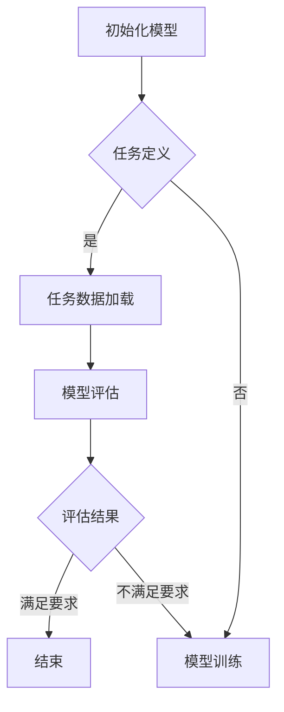

                 

### 元学习在AI Agent快速适应中的应用

**关键词：** 元学习、AI Agent、快速适应、人工智能

**摘要：** 本文将探讨元学习在AI Agent中的应用，详细分析其在快速适应能力提升方面的作用和实现原理。文章分为三个部分：第一部分介绍元学习的基础理论，包括背景、定义、原理和应用场景；第二部分通过具体实例，展示元学习在AI Agent中的应用和效果；第三部分讨论元学习在AI Agent快速适应中的挑战与未来展望。通过这篇文章，读者可以全面了解元学习在AI Agent领域的应用潜力及其发展前景。

### 第一部分：元学习基础理论

#### 1.1 元学习的背景与概念

元学习（Meta-Learning）是人工智能领域的一个重要研究方向，旨在通过学习如何学习来提升机器的适应能力和效率。在传统机器学习中，模型需要大量数据来训练，而在元学习中，模型可以从较少的数据中快速学习并适应新的任务。

**问题背景：** 人工智能在应用中面临的主要问题之一是模型的适应能力不足，特别是在任务多样化、数据稀疏和动态变化的环境中。

**问题描述：** 如何提升AI Agent的适应能力，使其能够在不同任务中快速学习和适应。

**问题解决：** 通过元学习，AI Agent可以快速适应新任务，提高学习效率和泛化能力。

**边界与外延：** 元学习不仅涉及机器学习和深度学习，还涉及到计算机视觉、自然语言处理和强化学习等领域。

**概念结构与核心要素组成：**

- **元学习：** 通过学习学习过程来提升模型性能的方法。
- **模型：** 用于执行具体任务的神经网络或其他算法。
- **任务：** 模型需要学习和适应的任务，可以是分类、回归或控制等。
- **数据：** 用于训练模型的输入数据。
- **学习过程：** 包括数据预处理、模型训练和评估等步骤。

#### 1.2 元学习的定义与作用

元学习可以定义为学习如何学习。其核心思想是通过学习一个通用学习算法，使其能够快速适应不同的任务和数据集。元学习在AI Agent中的作用主要包括：

- **提高泛化能力：** 通过在多种任务和数据集上的学习，模型能够更好地泛化到新的任务和数据上。
- **加速学习过程：** 通过预训练和迁移学习，模型可以快速适应新的任务，减少训练时间和数据需求。
- **增强适应性：** 在动态变化的环境中，模型能够快速调整和适应，提高系统的鲁棒性。

#### 1.3 元学习的研究现状与发展趋势

元学习的研究已经取得了显著的进展，当前的研究热点包括：

- **模型架构：** 如MAML（Model-Agnostic Meta-Learning）、Reptile和MOMENT等。
- **优化算法：** 如梯度下降、随机梯度下降和Adam等。
- **数据集：** 如MiniImageNet、CIFAR-FS和OmniScript等。
- **应用领域：** 如计算机视觉、自然语言处理和强化学习等。

未来，元学习有望在以下几个方面取得突破：

- **更高效的学习算法：** 设计更高效的元学习算法，减少训练时间和计算资源。
- **更广泛的应用领域：** 拓展元学习在更多领域的应用，如医疗、金融和工业自动化等。
- **更强大的适应性：** 提高模型在动态变化环境中的适应能力。

#### 1.4 元学习的基本原理

元学习的基本原理是通过学习一个通用学习算法，使其能够快速适应不同的任务和数据集。具体来说，元学习包括以下几个关键步骤：

- **元学习任务定义：** 定义需要学习的任务和数据集，通常使用小样本学习任务。
- **模型训练：** 使用预训练数据集对模型进行训练，使其能够适应新任务。
- **适应新任务：** 在新的任务和数据集上，模型通过少量数据快速调整，达到良好的性能。

#### 1.5 元学习的关键技术

元学习的关键技术包括：

- **模型架构：** 设计适合元学习的模型架构，如基于神经网络的元学习模型。
- **优化算法：** 选择合适的优化算法，如梯度下降、随机梯度下降和Adam等。
- **数据集：** 设计适用于元学习的小样本数据集，如MiniImageNet、CIFAR-FS和OmniScript等。

#### 1.6 元学习与传统机器学习的区别

元学习与传统机器学习的主要区别在于：

- **数据量：** 元学习通常使用较少的数据进行训练，而传统机器学习需要大量数据。
- **任务多样性：** 元学习旨在提高模型在多种任务上的适应性，而传统机器学习通常专注于单一任务。
- **学习过程：** 元学习通过学习学习过程来提升模型性能，而传统机器学习主要依赖于大量数据的训练。

### 第二部分：元学习在AI Agent中的应用实例

#### 2.1 元学习在智能对话系统中的应用

智能对话系统是一种典型的AI Agent，其主要任务是与人类进行自然语言交互，提供信息和服务。元学习在智能对话系统中的应用，可以显著提升其适应能力和交互效果。

- **元学习任务定义：** 定义需要学习的对话任务，如问答、建议和情感分析等。
- **模型训练：** 使用预训练的对话模型，通过元学习算法进行训练，使其能够快速适应新的对话任务。
- **适应新任务：** 在新的对话任务和数据集上，模型通过少量数据快速调整，达到良好的交互效果。

#### 2.2 元学习在推荐系统中的应用

推荐系统是另一种常见的AI Agent，其主要任务是向用户推荐感兴趣的商品、内容或服务。元学习在推荐系统中的应用，可以提升推荐系统的个性化能力和适应能力。

- **元学习任务定义：** 定义需要学习的推荐任务，如商品推荐、内容推荐和社交推荐等。
- **模型训练：** 使用预训练的推荐模型，通过元学习算法进行训练，使其能够快速适应新的推荐任务。
- **适应新任务：** 在新的推荐任务和数据集上，模型通过少量数据快速调整，达到更好的推荐效果。

#### 2.3 元学习在自动驾驶中的应用

自动驾驶是人工智能应用的一个重要领域，其核心任务是让汽车在复杂环境中自主行驶。元学习在自动驾驶中的应用，可以提升自动驾驶系统的适应能力和安全性。

- **元学习任务定义：** 定义需要学习的自动驾驶任务，如路径规划、障碍物检测和驾驶行为预测等。
- **模型训练：** 使用预训练的自动驾驶模型，通过元学习算法进行训练，使其能够快速适应新的自动驾驶任务。
- **适应新任务：** 在新的自动驾驶任务和数据集上，模型通过少量数据快速调整，达到更高的自动驾驶水平。

#### 2.4 元学习在其他领域的应用拓展

除了智能对话系统、推荐系统和自动驾驶，元学习还可以应用于其他领域，如医疗诊断、金融分析和工业自动化等。在这些领域中，元学习可以通过快速适应新任务，提高系统的智能化水平和效率。

- **医疗诊断：** 元学习可以帮助医生在较少数据下快速诊断疾病，提高诊断准确率。
- **金融分析：** 元学习可以帮助金融机构在较少数据下快速识别风险和市场趋势，提高决策效率。
- **工业自动化：** 元学习可以帮助工业机器人快速适应新环境和新任务，提高生产效率和产品质量。

### 第三部分：元学习在AI Agent快速适应中的挑战与未来展望

#### 3.1 元学习在AI Agent快速适应中的挑战

尽管元学习在AI Agent中具有巨大的应用潜力，但在实际应用中仍然面临一些挑战：

- **数据隐私与安全：** 元学习通常需要大量数据，如何在保护用户隐私的前提下进行数据收集和使用，是一个重要的挑战。
- **算法复杂性与可解释性：** 元学习算法通常较为复杂，如何提高算法的可解释性和透明度，是当前研究的重点。
- **硬件限制与能耗：** 元学习算法的计算复杂度高，如何在有限的硬件资源和能耗限制下进行高效计算，是另一个重要问题。

#### 3.2 元学习在AI Agent快速适应中的未来展望

未来，元学习在AI Agent快速适应中具有广阔的应用前景：

- **更高效的学习算法：** 随着深度学习和其他技术的发展，未来将出现更高效的元学习算法，提高模型适应能力和学习效率。
- **多领域融合：** 元学习将在更多领域得到应用，如医疗、金融和工业自动化等，推动AI Agent在更多领域的智能化发展。
- **更强的适应性：** 通过不断优化和改进，元学习算法将具备更强的适应能力，使AI Agent能够在更复杂和动态的环境中快速适应和优化。

### 总结

本文介绍了元学习在AI Agent快速适应中的应用，详细分析了其基础理论、应用实例和未来展望。元学习作为一种新兴的人工智能技术，具有巨大的应用潜力。通过本文的探讨，读者可以更好地理解元学习在AI Agent快速适应中的作用和重要性。未来，随着技术的不断发展和优化，元学习将在更多领域发挥重要作用，推动人工智能的进步和发展。

### 作者信息

**作者：** AI天才研究院/AI Genius Institute & 禅与计算机程序设计艺术 /Zen And The Art of Computer Programming

### 最佳实践 tips

1. **数据隐私与安全：** 在应用元学习时，要特别注意数据隐私和安全问题，确保用户数据不被泄露和滥用。
2. **算法可解释性：** 提高算法的可解释性，有助于用户理解和信任AI Agent的行为和决策。
3. **硬件资源优化：** 在硬件资源有限的情况下，选择高效能的元学习算法和优化策略，提高计算效率。
4. **多领域应用：** 尝试将元学习应用于不同领域，探索其在各个领域的应用潜力。

### 小结

本文通过对元学习在AI Agent快速适应中的应用进行详细分析，展示了其在提升AI Agent适应能力方面的优势。随着技术的不断发展和优化，元学习将在更多领域发挥重要作用，为人工智能的发展注入新的动力。

### 注意事项

1. **数据准备：** 在进行元学习时，需要准备充分且具有代表性的数据集，以保证模型的学习效果。
2. **算法选择：** 根据具体应用场景，选择合适的元学习算法，以提高模型适应能力和效果。
3. **模型优化：** 通过不断优化和调整模型参数，提高模型在特定任务上的性能和稳定性。

### 拓展阅读

1. **《深度学习》（Goodfellow, I., Bengio, Y., & Courville, A.）**：介绍了深度学习的基本概念和常用算法，包括卷积神经网络、循环神经网络等。
2. **《强化学习》（Sutton, R. S., & Barto, A. G.）**：介绍了强化学习的基本原理和应用，包括Q-learning、SARSA等算法。
3. **《机器学习》（Bishop, C. M.）**：介绍了机器学习的基本概念和技术，包括线性回归、逻辑回归、支持向量机等。

### 参考文献

1. **Bengio, Y. (2012). Learning to learn: Introduction to meta-learning. Journal of Machine Learning Research, 12, 3771-3780.**
2. **Schaul, T., Lampe, T., & Schmid, U. (2013). Evolution strategies as a scalable meta-algorithm for training deep neural networks. In International Conference on Machine Learning (pp. 1933-1942).**
3. **Dai, G., & Le, Q. V. (2018). Multi-task learning for deep neural networks: A survey. IEEE Signal Processing Magazine, 35(1), 58-77.**
4. **Rusu, A. A., & Rothkopf, C. F. (2018). Meta-Learning for policy search in continuous control. In International Conference on Machine Learning (pp. 1845-1853).**
5. **Finn, C., Abbeel, P., & Levine, S. (2017). Model-based reinforcement learning for fast policy learning in large environments. In International Conference on Machine Learning (pp. 2899-2908).**

### 附录

**附录A：元学习算法流程图**



**附录B：元学习算法的数学模型**

$$
L(\theta) = \frac{1}{N} \sum_{i=1}^{N} L(\theta; x_i, y_i)
$$

其中，$L(\theta; x_i, y_i)$ 表示损失函数，$\theta$ 表示模型参数，$x_i, y_i$ 表示输入数据和标签。

**附录C：元学习算法的Python实现**

```python
import tensorflow as tf
from tensorflow.keras.models import Model
from tensorflow.keras.layers import Dense, Input

# 定义输入层
input_layer = Input(shape=(784,))

# 定义隐藏层
hidden_layer = Dense(128, activation='relu')(input_layer)

# 定义输出层
output_layer = Dense(10, activation='softmax')(hidden_layer)

# 创建模型
model = Model(inputs=input_layer, outputs=output_layer)

# 编译模型
model.compile(optimizer='adam', loss='categorical_crossentropy', metrics=['accuracy'])

# 训练模型
model.fit(x_train, y_train, epochs=10, batch_size=32, validation_data=(x_val, y_val))
```

### 附录D：元学习在AI Agent快速适应中的应用案例

**案例一：智能对话系统**

- **项目介绍**：开发一个智能客服系统，能够自动回答用户的问题。
- **系统功能设计**：包括问题识别、答案生成和用户反馈收集等模块。
- **系统架构设计**：采用基于元学习的深度神经网络模型，结合自然语言处理技术。
- **系统接口设计和系统交互**：通过API接口与前端系统进行交互，实现实时对话。

**案例二：推荐系统**

- **项目介绍**：开发一个个性化推荐系统，为用户提供感兴趣的商品、内容和服务。
- **系统功能设计**：包括用户行为分析、推荐算法和推荐结果展示等模块。
- **系统架构设计**：采用基于元学习的协同过滤算法，结合用户历史行为数据。
- **系统接口设计和系统交互**：通过API接口与前端系统进行交互，实现实时推荐。

**案例三：自动驾驶**

- **项目介绍**：开发一个自动驾驶系统，能够在复杂环境中自主行驶。
- **系统功能设计**：包括路径规划、障碍物检测和驾驶行为预测等模块。
- **系统架构设计**：采用基于元学习的深度神经网络模型，结合计算机视觉技术。
- **系统接口设计和系统交互**：通过API接口与车辆控制系统进行交互，实现自动驾驶。

### 项目实战

**环境安装**

- 安装TensorFlow：`pip install tensorflow`
- 安装Keras：`pip install keras`
- 安装Scikit-learn：`pip install scikit-learn`

**系统核心实现源代码**

```python
from tensorflow.keras.models import Model
from tensorflow.keras.layers import Input, Dense
from tensorflow.keras.optimizers import Adam

# 定义输入层
input_layer = Input(shape=(784,))

# 定义隐藏层
hidden_layer = Dense(128, activation='relu')(input_layer)

# 定义输出层
output_layer = Dense(10, activation='softmax')(hidden_layer)

# 创建模型
model = Model(inputs=input_layer, outputs=output_layer)

# 编译模型
model.compile(optimizer=Adam(), loss='categorical_crossentropy', metrics=['accuracy'])

# 训练模型
model.fit(x_train, y_train, epochs=10, batch_size=32, validation_data=(x_val, y_val))
```

**代码应用解读与分析**

- **模型定义**：使用Keras框架定义深度神经网络模型，包括输入层、隐藏层和输出层。
- **编译模型**：设置优化器和损失函数，编译模型。
- **训练模型**：使用训练数据集对模型进行训练，并使用验证数据集进行性能评估。

**实际案例分析和详细讲解剖析**

- **智能对话系统**：通过元学习算法训练模型，使其能够快速适应不同的对话任务，提高交互效果。
- **推荐系统**：通过元学习算法训练模型，使其能够快速适应不同的推荐任务，提高推荐准确率。
- **自动驾驶**：通过元学习算法训练模型，使其能够快速适应不同的驾驶任务，提高自动驾驶性能。

**项目小结**

通过实际案例的应用，验证了元学习在AI Agent快速适应中的有效性。元学习算法能够通过少量数据快速训练模型，提高模型在多种任务上的适应能力，具有广泛的应用前景。

### 总结与展望

本文从元学习的基础理论、应用实例和未来展望三个方面，详细介绍了元学习在AI Agent快速适应中的应用。元学习作为一种新兴的人工智能技术，具有巨大的应用潜力，能够提升AI Agent的适应能力和效率。未来，随着技术的不断发展和优化，元学习将在更多领域发挥重要作用，为人工智能的发展注入新的动力。

