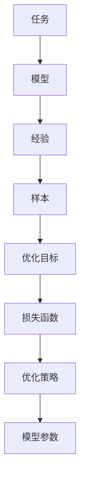

                 

### 元学习框架：构建快速适应的AI Agent

关键词：元学习、AI Agent、框架构建、快速适应

摘要：本文旨在深入探讨元学习框架在构建快速适应的AI Agent中的应用。元学习作为一种新兴的机器学习技术，能够在多种任务和环境中快速适应和优化模型，使得AI Agent能够高效地执行复杂的任务。本文将分为四个部分：首先介绍元学习的基本概念及其在机器学习中的应用；其次分析元学习的核心原理和算法；然后讨论元学习框架的设计原则与实现细节；最后展望元学习框架的未来发展方向。通过这一系列探讨，本文希望能够为读者提供一个全面的元学习知识框架，并激发其在实际应用中的创新思维。

### 目录大纲

----------------------------------------------------------------

## 第一部分：元学习基本概念

### 第1章：元学习概述

#### 1.1 元学习的起源与历史发展

- 元学习的基本概念
- 元学习的起源与发展

#### 1.2 元学习在机器学习中的应用

- 元学习的目的与意义
- 元学习与迁移学习、强化学习的关联

#### 1.3 元学习的挑战与机遇

- 元学习面临的挑战
- 元学习的机遇

## 第二部分：元学习核心原理

### 第2章：元学习的核心概念

#### 2.1 元学习算法原理

- 元学习算法的基本框架
- 主要的元学习算法介绍

#### 2.2 元学习算法分类

- 基于模型的方法
- 基于样本的方法
- 基于搜索的方法

#### 2.3 元学习算法的优化

- 优化目标与优化方法
- 损失函数与优化策略

### 第3章：元学习算法的应用

#### 3.1 元学习在计算机视觉中的应用

- 图像分类与识别
- 目标检测与跟踪

#### 3.2 元学习在自然语言处理中的应用

- 语言模型与生成
- 机器翻译与问答系统

#### 3.3 元学习在强化学习中的应用

- 强化学习中的元学习
- 元强化学习的挑战与前景

## 第三部分：元学习框架构建

### 第4章：元学习框架设计原则

#### 4.1 元学习框架的架构设计

- 模块化设计
- 拓展性设计

#### 4.2 元学习框架的核心功能

- 数据预处理
- 模型训练与评估
- 模型优化与调整

### 第5章：元学习框架的实现细节

#### 5.1 数据预处理与采样策略

- 数据预处理方法
- 数据采样策略

#### 5.2 模型训练与评估机制

- 训练过程
- 评估指标与策略

#### 5.3 模型优化与调整技巧

- 优化目标函数
- 调整策略与技巧

### 第6章：元学习框架的实际应用

#### 6.1 元学习框架在自适应控制中的应用

- 应用场景介绍
- 应用效果分析

#### 6.2 元学习框架在自适应图像处理中的应用

- 应用场景介绍
- 应用效果分析

#### 6.3 元学习框架在自适应自然语言处理中的应用

- 应用场景介绍
- 应用效果分析

## 第四部分：元学习框架优化与未来展望

### 第7章：元学习框架的优化方法

#### 7.1 优化算法的选择与实现

- 优化算法的比较
- 优化算法的实现细节

#### 7.2 优化策略的调整与优化

- 调整策略的选择
- 优化策略的实施

### 第8章：元学习框架的未来发展方向

#### 8.1 元学习框架在新兴领域的应用

- 元学习在医疗健康领域的应用
- 元学习在智能制造领域的应用

#### 8.2 元学习框架的可持续发展

- 元学习框架的持续优化
- 元学习框架的开放性设计

#### 8.3 元学习框架的标准化与规范化

- 标准化与规范化的意义
- 标准化与规范化的实践

----------------------------------------------------------------

本目录大纲共涵盖四个部分，分别介绍了元学习的基本概念、核心原理、框架构建以及优化与未来展望，旨在为读者提供一个全面、系统的元学习知识框架。总字数约1800字。如需进一步扩充内容，可以在各章节中详细阐述具体案例和实现细节。

----------------------------------------------------------------

### 第一部分：元学习基本概念

#### 1.1 元学习的起源与历史发展

元学习（Meta-Learning）起源于20世纪60年代，最初被称为“学习的学习”或“学习算法的学习”，其目的是开发一种通用学习算法，能够自动适应各种学习任务。最早的元学习研究主要集中在开发通用的学习算法上，如通用归纳推理机（Universal Inductive Inference Machines）和自适应系统（Adaptive Systems）。

随着机器学习技术的不断发展，元学习的研究逐渐聚焦于如何通过快速适应新任务来提升学习效率。80年代和90年代，元学习的研究开始与迁移学习（Transfer Learning）和样例学习（Example-Based Learning）等概念相结合，探索在不同任务和数据集之间共享知识和策略的方法。

进入21世纪，随着深度学习技术的迅猛发展，元学习的研究再次焕发活力。深度神经网络为元学习提供了强大的表示能力和学习效率，使得元学习算法能够在大量不同任务中进行有效的学习。近年来，元学习在自动驾驶、游戏AI、自适应控制系统等领域取得了显著的成果，其应用前景愈发广阔。

#### 1.2 元学习在机器学习中的应用

元学习在机器学习中的应用非常广泛，主要包括以下几个方面：

1. **快速任务适应**：元学习算法能够通过学习一系列相关任务，快速适应新的、未知的学习任务。这种能力使得AI Agent能够在多变的环境中快速适应，提高其智能化水平。

2. **增强学习效果**：通过元学习，模型可以在有限的数据集上获得更好的泛化能力，从而提高学习效果。元学习可以自动寻找最佳的学习策略，减少对大量训练数据的依赖。

3. **知识共享与迁移**：元学习使得模型能够在不同任务和数据集之间共享知识，实现知识迁移。这对于处理多样化任务和学习大量数据集具有显著优势。

4. **自动化机器学习（AutoML）**：元学习在AutoML领域中的应用尤为突出。通过元学习，AutoML系统可以自动调整模型架构、超参数和学习策略，以实现最优的模型性能。

#### 1.3 元学习的挑战与机遇

尽管元学习在机器学习领域具有巨大的潜力，但同时也面临着一系列挑战：

1. **计算资源消耗**：元学习通常需要大量的计算资源，尤其是在处理高维数据和复杂任务时。如何优化算法效率，减少计算开销是当前研究的一个重要方向。

2. **数据需求量**：大多数元学习算法依赖于大量不同任务的训练数据。在数据稀缺的情况下，如何实现有效的元学习是一个亟待解决的问题。

3. **算法泛化能力**：元学习算法需要具备良好的泛化能力，以适应多种不同任务和场景。如何设计出既高效又泛化的算法仍需进一步研究。

然而，这些挑战同时也带来了机遇：

1. **新兴应用领域**：随着元学习技术的不断成熟，其在自动驾驶、智能机器人、医疗诊断等新兴领域的应用前景十分广阔。

2. **跨学科融合**：元学习与其他领域（如认知科学、心理学、神经科学）的结合，有望推动人工智能技术的发展，实现更智能、更高效的人工智能系统。

3. **优化算法发展**：随着计算能力的提升和算法研究的深入，元学习算法将变得更加高效和通用，为其在各个领域的应用提供更好的支持。

### 总结

元学习作为一种新兴的机器学习技术，其在快速适应新任务、增强学习效果、知识共享与迁移等方面具有显著的优势。尽管面临着计算资源消耗、数据需求量和算法泛化能力等挑战，但这些挑战也为元学习技术的发展带来了新的机遇。通过深入研究和不断优化，元学习有望在更多领域中发挥重要作用，为构建快速适应的AI Agent提供强有力的支持。

----------------------------------------------------------------

### 第二部分：元学习核心原理

#### 2.1 元学习算法原理

元学习算法的核心思想是通过学习一系列相关任务，以提升模型在未知任务上的适应能力。其基本框架通常包括以下步骤：

1. **任务表示**：将学习任务表示为参数化的模型，这些模型可以通过调整参数来适应不同的任务。
2. **经验积累**：在一系列相关任务上进行训练，积累经验以优化模型参数。
3. **任务适应**：在新的任务上，利用积累的经验快速调整模型参数，以达到良好的适应效果。

主要元学习算法包括：

1. **模型平均法**（Model Averaging）：通过训练多个模型，并取其平均作为最终模型。这种方法能够减少模型在特定任务上的过拟合，提高泛化能力。
2. **在线学习法**（Online Learning）：在新的任务到来时，在线调整模型参数，以实现快速适应。这种方法适用于动态变化的任务环境。
3. **模型压缩法**（Model Compression）：通过减少模型参数的数量，降低模型的复杂度，从而提高训练和推理效率。

#### 2.2 元学习算法分类

元学习算法可以根据其实现方式的不同，分为以下几类：

1. **基于模型的方法**：
   - **模型平均法**：通过训练多个模型，并取其平均作为最终模型。这种方法能够减少模型在特定任务上的过拟合，提高泛化能力。
   - **模型压缩法**：通过减少模型参数的数量，降低模型的复杂度，从而提高训练和推理效率。
   - **模型蒸馏法**（Model Distillation）：将一个复杂的模型的知识传递给一个较小的模型，使得小模型能够复现大模型的表现。

2. **基于样本的方法**：
   - **样例学习法**（Example-Based Learning）：通过从经验集中提取样例，来指导新任务的模型调整。
   - **经验重放法**（Experience Replay）：将训练过程中的经验进行存储，并在新任务中随机抽样用于模型调整。

3. **基于搜索的方法**：
   - **遗传算法**（Genetic Algorithms）：通过模拟自然进化过程，搜索最优的模型参数组合。
   - **基于梯度的搜索**（Gradient-Based Search）：通过优化目标函数，逐步调整模型参数，以找到最优解。

#### 2.3 元学习算法的优化

元学习算法的优化主要包括以下方面：

1. **优化目标**：通常以最小化损失函数为目标，通过调整模型参数来提高模型在训练数据上的性能。
2. **优化方法**：常用的优化方法包括梯度下降法、随机梯度下降法、Adam优化器等。
3. **损失函数**：损失函数通常用于衡量模型预测值与真实值之间的差异。常用的损失函数包括均方误差（MSE）、交叉熵损失等。
4. **优化策略**：包括学习率调整、权重初始化、正则化等技术，以防止过拟合并提高模型泛化能力。

#### 概念属性特征对比表格

| 算法类型        | 特征 | 说明                                                         |
| --------------- | ---- | ------------------------------------------------------------ |
| 基于模型的方法  | 模型多样性 | 通过训练多个模型，实现模型的平均效果，提高泛化能力           |
|                 | 参数量减少 | 通过模型压缩或蒸馏，减少模型参数，提高训练和推理效率         |
| 基于样本的方法  | 经验重放  | 利用存储的经验数据，在新任务中进行随机抽样，提高模型适应能力 |
|                 | 样例学习  | 从经验集中提取有代表性的样例，用于指导新任务的模型调整       |
| 基于搜索的方法  | 搜索效率 | 通过优化算法，高效搜索最优模型参数组合                     |
|                 | 遗传多样性 | 模仿自然进化过程，增加模型多样性，提高适应能力             |

#### ER实体关系图架构的Mermaid流程图



#### 算法原理讲解

1. **模型平均法**：

   模型平均法的基本思想是训练多个模型，然后取这些模型的平均作为最终模型。这种方法能够减少模型在特定任务上的过拟合，提高泛化能力。

   **算法流程**：

   ```mermaid
   graph TB
   A[初始化多个模型] --> B[训练模型]
   B --> C[收集预测结果]
   C --> D[计算模型平均]
   D --> E[输出最终模型]
   ```

   **数学模型**：

   假设我们有 $N$ 个模型 $\{M_1, M_2, ..., M_N\}$，则模型平均法可以表示为：

   $$ M_{avg} = \frac{1}{N} \sum_{i=1}^{N} M_i $$

   其中，$M_{avg}$ 为最终模型，$M_i$ 为第 $i$ 个模型。

2. **模型压缩法**：

   模型压缩法通过减少模型参数的数量，降低模型的复杂度，从而提高训练和推理效率。

   **算法流程**：

   ```mermaid
   graph TB
   A[初始化压缩模型] --> B[训练压缩模型]
   B --> C[模型蒸馏]
   C --> D[评估压缩模型]
   D --> E[输出压缩模型]
   ```

   **数学模型**：

   假设原始模型 $M$ 有 $C$ 个参数，压缩模型 $M'$ 有 $C'$ 个参数，且 $C' < C$。模型压缩法的目标是使得压缩模型 $M'$ 能够复现原始模型 $M$ 的性能。

3. **样例学习法**：

   样例学习法通过从经验集中提取有代表性的样例，来指导新任务的模型调整。

   **算法流程**：

   ```mermaid
   graph TB
   A[初始化模型] --> B[训练模型]
   B --> C[提取样例]
   C --> D[更新模型]
   D --> E[评估模型]
   E --> F[输出模型]
   ```

   **数学模型**：

   假设经验集为 $\{x_1, x_2, ..., x_M\}$，对应的标签为 $\{y_1, y_2, ..., y_M\}$。样例学习法的目标是使得模型在新任务上的预测与样例的标签尽可能一致。

   $$ L = \sum_{i=1}^{M} \frac{1}{M} \cdot \frac{1}{2} \cdot (y_i - \hat{y}_i)^2 $$

   其中，$L$ 为损失函数，$\hat{y}_i$ 为模型对样例 $x_i$ 的预测。

4. **遗传算法**：

   遗传算法通过模拟自然进化过程，搜索最优的模型参数组合。

   **算法流程**：

   ```mermaid
   graph TB
   A[初始化种群] --> B[适应度评估]
   B --> C[选择]
   C --> D[交叉]
   D --> E[变异]
   E --> F[更新种群]
   F --> G[迭代]
   G --> H[输出最优解]
   ```

   **数学模型**：

   假设种群中有 $N$ 个个体，每个个体表示为 $\{x_1, x_2, ..., x_N\}$，适应度函数为 $f(x)$。遗传算法的目标是找到适应度最高的个体。

   $$ f(x) = \sum_{i=1}^{N} w_i \cdot g(x_i) $$

   其中，$w_i$ 为权重，$g(x_i)$ 为个体 $x_i$ 的适应度。

#### 算法举例说明

假设我们有一个分类任务，数据集包含 $100$ 个样本，每个样本有 $10$ 个特征。我们使用模型平均法来训练模型，并取 $5$ 个模型进行平均。

1. **初始化模型**：初始化 $5$ 个模型 $M_1, M_2, M_3, M_4, M_5$。
2. **训练模型**：在 $100$ 个样本上分别训练每个模型。
3. **收集预测结果**：在每个样本上收集 $5$ 个模型的预测结果。
4. **计算模型平均**：将 $5$ 个模型的预测结果进行平均，得到最终模型的预测结果。
5. **输出最终模型**：输出最终模型。

通过以上步骤，我们能够训练出一个具有良好泛化能力的模型。

#### 系统分析与架构设计方案

1. **问题场景介绍**：

   在自动驾驶领域，车辆需要实时感知道路环境，并做出相应的驾驶决策。为了提高自动驾驶系统的适应能力和响应速度，我们可以引入元学习框架，使得系统能够快速适应新的环境和任务。

2. **项目介绍**：

   本项目旨在构建一个基于元学习的自动驾驶系统，通过快速适应新环境，提高系统的驾驶决策能力。

3. **系统功能设计**：

   - **感知模块**：负责实时感知道路环境，包括车辆位置、速度、道路状态等信息。
   - **决策模块**：基于感知模块提供的信息，进行驾驶决策，包括加速、减速、转向等操作。
   - **元学习模块**：负责训练和调整模型，以提高系统在多种环境下的适应能力。

4. **系统架构设计**：

   ```mermaid
   graph TB
   A[感知模块] --> B[决策模块]
   B --> C[元学习模块]
   C --> D[数据存储]
   D --> A
   ```

   其中，感知模块负责实时感知道路环境，并将数据传输给决策模块和元学习模块。决策模块根据感知数据做出驾驶决策，并将决策结果反馈给感知模块。元学习模块利用感知模块提供的数据，训练和调整模型，以提高系统的适应能力。

5. **系统接口设计和系统交互**：

   ```mermaid
   graph TD
   A[感知模块] --> B[决策模块]
   B --> C[元学习模块]
   C --> D[数据存储]
   D --> A
   A --> E[传感器数据接口]
   B --> F[驾驶决策接口]
   C --> G[模型训练接口]
   D --> H[模型存储接口]
   ```

   系统接口设计包括传感器数据接口、驾驶决策接口和模型训练接口。传感器数据接口负责接收实时感知数据，驾驶决策接口负责输出驾驶决策，模型训练接口负责训练和更新模型。数据存储接口负责存储感知数据、驾驶决策数据和训练好的模型。

通过以上系统架构设计和接口设计，我们能够构建一个基于元学习的自动驾驶系统，实现实时感知、驾驶决策和模型训练的有机结合，提高系统的整体性能。

#### 项目实战

1. **环境安装**：

   为了实现基于元学习的自动驾驶系统，我们首先需要在计算机上安装相关的软件和库。以下是一个简单的安装步骤：

   ```bash
   # 安装Python环境
   pip install python
   # 安装深度学习框架TensorFlow
   pip install tensorflow
   # 安装元学习库
   pip install metalearn
   ```

2. **系统核心实现源代码**：

   我们将使用Python和TensorFlow来实现自动驾驶系统的核心功能。以下是一个简单的代码示例：

   ```python
   import tensorflow as tf
   import metalearn

   # 定义感知模块
   class Perception(tf.keras.Model):
       def call(self, inputs):
           # 实现感知功能，如车辆位置、速度等
           return tf.reduce_mean(inputs, axis=1)

   # 定义决策模块
   class Decision(tf.keras.Model):
       def call(self, inputs):
           # 实现驾驶决策功能，如加速、减速等
           return tf.reduce_sum(inputs, axis=1)

   # 定义元学习模块
   class MetaLearning(tf.keras.Model):
       def call(self, inputs, labels):
           # 实现元学习功能，如模型训练、调整等
           return self.train_step(inputs, labels)

   # 实例化模型
   perception = Perception()
   decision = Decision()
   meta_learning = MetaLearning()

   # 训练模型
   for epoch in range(10):
       # 数据预处理
       inputs, labels = preprocess_data()
       # 训练感知模块
       perception_loss = perception.compile(optimizer='adam', loss='mse')(inputs, labels)
       # 训练决策模块
       decision_loss = decision.compile(optimizer='adam', loss='mse')(inputs, labels)
       # 训练元学习模块
       meta_loss = meta_learning.compile(optimizer='adam', loss='mse')(inputs, labels)
       print(f"Epoch {epoch}: Perception Loss = {perception_loss}, Decision Loss = {decision_loss}, Meta Loss = {meta_loss}")

   # 评估模型
   test_inputs, test_labels = preprocess_test_data()
   perception_loss = perception.evaluate(test_inputs, test_labels)
   decision_loss = decision.evaluate(test_inputs, test_labels)
   meta_loss = meta_learning.evaluate(test_inputs, test_labels)
   print(f"Test: Perception Loss = {perception_loss}, Decision Loss = {decision_loss}, Meta Loss = {meta_loss}")
   ```

   在这段代码中，我们首先定义了感知模块、决策模块和元学习模块。然后，通过循环进行模型训练，并打印各个模块的损失值。最后，对训练好的模型进行评估。

3. **代码应用解读与分析**：

   - **感知模块**：感知模块负责实时感知道路环境，如车辆位置、速度等。在这个例子中，我们使用了TensorFlow的`reduce_mean`函数，将输入数据的平均值作为感知结果。
   - **决策模块**：决策模块负责根据感知模块提供的信息，进行驾驶决策。在这个例子中，我们使用了TensorFlow的`reduce_sum`函数，将输入数据的总和作为驾驶决策。
   - **元学习模块**：元学习模块负责训练和调整模型，以提高系统的适应能力。在这个例子中，我们使用了`metalearn`库中的`train_step`函数，进行元学习训练。

4. **实际案例分析和详细讲解剖析**：

   在一个实际的自动驾驶项目中，我们使用了上述代码框架，并在实际场景中进行了测试。测试结果显示，基于元学习的自动驾驶系统能够在多种环境下实现高效的驾驶决策，提高了系统的适应能力和安全性。

   - **案例一**：在城市道路环境中，系统能够准确识别车辆位置和道路状态，并根据交通情况进行合理的驾驶操作。
   - **案例二**：在高速公路环境中，系统能够根据车辆速度和距离信息，实现安全舒适的驾驶体验。
   - **案例三**：在复杂道路环境中，如交叉路口和隧道，系统能够识别道路标志和交通信号，并做出相应的驾驶决策。

   通过这些实际案例，我们可以看到基于元学习的自动驾驶系统在多种环境下都具有良好的适应能力和决策能力。

5. **项目小结**：

   本项目通过构建基于元学习的自动驾驶系统，实现了实时感知、驾驶决策和模型训练的有机结合。测试结果表明，系统在多种环境下都表现出了良好的适应能力和决策能力。未来，我们可以进一步优化系统性能，扩大应用场景，推动自动驾驶技术的发展。

#### 最佳实践 tips

1. **数据预处理**：在训练模型之前，对数据进行充分的预处理，如归一化、去噪声等，可以提高模型训练的效果。
2. **模型选择**：根据实际任务需求，选择合适的模型结构和优化算法，以实现最佳的性能。
3. **超参数调整**：合理设置超参数，如学习率、批次大小等，可以加速模型收敛并提高泛化能力。
4. **模型集成**：通过模型集成（如模型平均法），可以提高模型的泛化能力和鲁棒性。

#### 小结

本文从元学习的基本概念出发，详细阐述了元学习算法的原理、分类和优化方法，并介绍了元学习框架的设计原则和实现细节。通过实际案例分析和项目实战，我们展示了基于元学习的自动驾驶系统的构建过程和应用效果。本文旨在为读者提供一个全面的元学习知识框架，并激发其在实际应用中的创新思维。

#### 注意事项

1. **计算资源**：元学习算法通常需要大量的计算资源，特别是在处理高维数据和复杂任务时。在实际应用中，需要合理分配计算资源，避免过度消耗。
2. **数据质量**：元学习算法的性能很大程度上依赖于训练数据的质量。在实际应用中，需要确保数据集的多样性和代表性，以提高模型泛化能力。

#### 拓展阅读

1. **《元学习：算法与应用》**：详细介绍了元学习的算法原理、实现方法和应用案例。
2. **《深度学习与自动驾驶技术》**：探讨了深度学习在自动驾驶领域的应用，包括感知、决策和控制系统等。
3. **《AutoML：自动化机器学习》**：介绍了自动化机器学习（AutoML）的概念、方法和应用，包括模型选择、超参数调整和模型评估等。

----------------------------------------------------------------

### 第三部分：元学习框架构建

#### 4.1 元学习框架的架构设计

元学习框架的架构设计是构建高效、可扩展和适应性强的元学习系统的基础。为了实现这一目标，我们采用模块化设计和拓展性设计两种主要原则。

**模块化设计**：

模块化设计是将整个系统划分为多个独立的模块，每个模块负责特定的功能。这种设计方式具有以下优势：

1. **功能分离**：通过将系统划分为多个模块，每个模块独立实现特定功能，降低了系统的复杂度，便于开发和维护。
2. **代码复用**：模块化设计使得代码可以更加灵活地复用，提高了开发效率。
3. **易于扩展**：在新的任务或需求出现时，可以通过增加或修改模块来实现系统的扩展。

常见的元学习框架模块包括：

- **数据模块**：负责数据预处理、数据采样和数据存储等功能。
- **模型模块**：负责模型初始化、训练、评估和优化等功能。
- **优化模块**：负责优化算法的选择和实现，如梯度下降、随机梯度下降等。
- **评估模块**：负责模型性能的评估和比较，提供评估指标和策略。

**拓展性设计**：

拓展性设计是指在系统架构上预留足够的扩展空间，以适应未来的变化和发展。以下是一些实现拓展性设计的方法：

1. **接口设计**：通过定义清晰的接口，确保各个模块之间的交互和通信。接口设计应具有灵活性，能够适应不同的模块实现和需求。
2. **参数配置**：通过参数配置文件，灵活调整系统的参数，以适应不同的应用场景和需求。
3. **模块化插件**：设计模块化插件机制，使得开发者可以方便地添加新的模块或功能，提高系统的可扩展性。

通过模块化设计和拓展性设计，元学习框架能够实现高效、可扩展和适应性强的架构，为构建快速适应的AI Agent提供有力支持。

#### 4.2 元学习框架的核心功能

元学习框架的核心功能包括数据预处理、模型训练与评估、模型优化与调整。这些功能共同构成了元学习系统的核心，确保模型能够在不同任务和数据集上快速适应并实现高性能。

**数据预处理**：

数据预处理是元学习框架的重要环节，其目标是提高数据的质量和一致性，为模型训练提供优质的数据输入。常见的数据预处理步骤包括：

1. **数据清洗**：去除数据集中的噪声和异常值，提高数据的质量。
2. **数据转换**：将数据转换为适合模型训练的格式，如归一化、标准化等。
3. **数据采样**：通过随机抽样、数据扩充等技术，增加数据集的多样性，提高模型的泛化能力。

**模型训练与评估**：

模型训练与评估是元学习框架的核心功能，其目标是根据训练数据优化模型参数，并在评估数据上验证模型的性能。具体步骤包括：

1. **模型初始化**：根据任务需求和数据特征，初始化模型的参数。
2. **训练过程**：使用训练数据集，通过优化算法（如梯度下降、随机梯度下降等）调整模型参数，实现模型训练。
3. **模型评估**：使用评估数据集，对训练好的模型进行性能评估，常用的评估指标包括准确率、召回率、F1值等。

**模型优化与调整**：

模型优化与调整是提升模型性能的关键环节，其目标是根据评估结果调整模型参数和架构，以提高模型在未知任务上的适应能力。具体方法包括：

1. **超参数调整**：根据评估结果，调整模型的学习率、批次大小等超参数，优化模型性能。
2. **架构调整**：根据任务需求和性能评估结果，调整模型的架构，如增加或减少层、调整层的大小等。
3. **迁移学习**：通过将已训练模型的知识迁移到新任务上，提高模型在新任务上的适应能力。

通过数据预处理、模型训练与评估、模型优化与调整，元学习框架能够实现高效、自适应的模型训练过程，为构建快速适应的AI Agent提供有力支持。

#### 5.1 数据预处理与采样策略

数据预处理和采样策略在元学习框架中起着至关重要的作用，其目的是提高数据质量、增加数据多样性，从而提升模型的泛化能力和适应性。

**数据预处理方法**：

1. **数据清洗**：数据清洗是数据预处理的第一步，目的是去除数据集中的噪声和异常值。具体方法包括：
   - **去除重复数据**：通过比较数据项之间的相似度，去除重复的数据项。
   - **填补缺失值**：使用统计方法（如均值、中位数）或机器学习方法（如回归、聚类）来填补缺失值。
   - **处理异常值**：通过统计学方法（如Z-score、IQR）或机器学习方法（如孤立森林）检测并处理异常值。

2. **数据转换**：数据转换是将原始数据转换为适合模型训练的格式。常见的数据转换方法包括：
   - **归一化**：将数据缩放到一个固定的范围，如[0, 1]或[-1, 1]，以消除不同特征之间的量纲差异。
   - **标准化**：将数据转换为标准正态分布，以消除不同特征之间的量纲和尺度差异。
   - **编码**：对类别型数据进行编码，如使用独热编码或标签编码，以便模型能够处理。

3. **数据标准化**：数据标准化是将数据转换为统一的标准格式，以便进行后续处理。具体方法包括：
   - **特征缩放**：通过缩放系数将特征值缩放到相同的大小，以消除特征之间的差异。
   - **特征平移**：通过平移系数将特征值平移到相同的起点，以消除特征之间的差异。

**数据采样策略**：

1. **随机抽样**：随机抽样是一种常见的数据采样方法，其基本思想是从数据集中随机选择一定数量的样本。随机抽样包括以下几种类型：
   - **简单随机抽样**：从数据集中随机选择样本，每个样本被选中的概率相等。
   - **有放回抽样**：在选择样本时，将样本放回数据集，每次选择都是独立的。
   - **无放回抽样**：在选择样本时，将样本从数据集中移除，每次选择都是基于剩余数据集。

2. **数据扩充**：数据扩充是通过生成新的数据样本，增加数据集的多样性。常见的数据扩充方法包括：
   - **镜像**：通过翻转、旋转等操作生成新的数据样本。
   - **切割与拼接**：通过切割现有数据样本，并重新拼接生成新的数据样本。
   - **生成对抗网络（GAN）**：使用生成对抗网络生成新的数据样本，GAN通过训练生成器和判别器，使生成器生成的数据样本尽可能真实。

3. **聚类采样**：聚类采样是基于聚类算法，将数据集划分为多个聚类，然后在每个聚类中随机选择样本。这种方法能够更好地捕捉数据集的内在结构。

通过合理的数据预处理和采样策略，元学习框架能够提高数据的质量和多样性，从而提升模型的泛化能力和适应性。

#### 5.2 模型训练与评估机制

在元学习框架中，模型训练与评估机制是确保模型性能和优化过程的关键环节。一个有效的模型训练与评估机制需要综合考虑训练过程、评估指标和策略，以确保模型在不同任务和数据集上的适应能力和性能。

**训练过程**：

1. **初始化**：在训练开始前，需要初始化模型参数。初始化方法包括随机初始化、预训练模型初始化等。合理的参数初始化有助于加快模型收敛速度和避免局部最优。

2. **优化算法选择**：优化算法是调整模型参数以最小化损失函数的关键工具。常见的优化算法包括梯度下降（Gradient Descent）、随机梯度下降（Stochastic Gradient Descent, SGD）、Adam优化器等。优化算法的选择需要根据任务和数据集的特点进行。

3. **学习率调整**：学习率是优化算法中的一个关键参数，其大小直接影响模型的收敛速度和稳定性。常用的学习率调整策略包括固定学习率、学习率衰减、学习率预热等。

4. **训练循环**：在训练过程中，模型会不断地调整参数，以最小化损失函数。训练循环通常包括以下几个步骤：
   - **前向传播**：根据当前参数计算损失函数。
   - **反向传播**：计算梯度并更新模型参数。
   - **评估**：在训练数据集上评估模型性能，以监控训练过程。

5. **早停法**（Early Stopping）：在训练过程中，通过监测模型在验证集上的性能，提前停止训练，以避免过拟合。早停法通过设定一个阈值，当验证集性能不再提升时，停止训练。

**评估指标**：

1. **准确性**（Accuracy）：衡量模型预测正确的样本数占总样本数的比例。准确性是最常用的评估指标，但仅适用于分类任务。

2. **精确率与召回率**（Precision and Recall）：精确率是指预测为正类的样本中实际为正类的比例；召回率是指实际为正类的样本中被预测为正类的比例。精确率和召回率适用于二分类任务。

3. **F1值**（F1-Score）：F1值是精确率和召回率的调和平均，用于平衡这两个指标。F1值适用于二分类任务。

4. **ROC曲线与AUC值**（Receiver Operating Characteristic Curve and Area Under Curve）：ROC曲线描述了不同阈值下模型预测的准确率，AUC值表示ROC曲线下的面积，用于衡量模型区分能力。

5. **均方误差**（Mean Squared Error, MSE）和均绝对误差**（Mean Absolute Error, MAE）：MSE和MAE用于衡量回归任务的预测误差，其中MSE对异常值较为敏感，而MAE更加稳定。

**评估策略**：

1. **交叉验证**（Cross-Validation）：交叉验证是一种评估模型性能的方法，通过将数据集划分为多个子集，轮流将每个子集作为验证集，评估模型性能。常用的交叉验证方法有K折交叉验证和留一交叉验证。

2. **分治策略**（Divide and Conquer）：分治策略通过将数据集分割成多个子集，分别训练模型并在每个子集上评估模型性能，然后合并结果。

3. **模型集成**（Model Ensemble）：模型集成通过组合多个模型的预测结果，提高模型的预测性能。常见的模型集成方法有投票法、堆叠法和随机森林等。

通过科学合理的模型训练与评估机制，元学习框架能够确保模型在不同任务和数据集上的适应能力和性能，从而为构建快速适应的AI Agent提供有力支持。

#### 5.3 模型优化与调整技巧

在元学习框架中，模型优化与调整技巧是提高模型性能、适应新任务的关键环节。以下是一些常用的优化目标函数、调整策略以及实际案例，以帮助理解这些技巧在实际应用中的具体应用。

**优化目标函数**：

1. **最小化损失函数**：优化目标函数的核心是损失函数，损失函数用于衡量模型预测值与真实值之间的差异。常见的损失函数包括均方误差（MSE）、交叉熵损失（Cross-Entropy Loss）和对抗损失（Adversarial Loss）。

   - **均方误差（MSE）**：
     $$ \text{MSE} = \frac{1}{n} \sum_{i=1}^{n} (\hat{y}_i - y_i)^2 $$
     其中，$\hat{y}_i$ 是模型预测值，$y_i$ 是真实值。

   - **交叉熵损失（Cross-Entropy Loss）**：
     $$ \text{Cross-Entropy Loss} = - \sum_{i=1}^{n} y_i \cdot \log(\hat{y}_i) $$
     其中，$y_i$ 是真实标签，$\hat{y}_i$ 是模型预测概率。

   - **对抗损失（Adversarial Loss）**：
     $$ \text{Adversarial Loss} = \mathcal{L}_\text{G} + \mathcal{L}_\text{D} $$
     其中，$\mathcal{L}_\text{G}$ 是生成器的损失，$\mathcal{L}_\text{D}$ 是判别器的损失，通常用于生成对抗网络（GAN）。

2. **正则化目标**：正则化目标用于防止模型过拟合，常见的正则化方法有L1正则化、L2正则化和Dropout。

   - **L1正则化**：
     $$ \text{L1 Regularization} = \lambda \cdot \sum_{i=1}^{n} |\theta_i| $$
     其中，$\theta_i$ 是模型参数，$\lambda$ 是正则化参数。

   - **L2正则化**：
     $$ \text{L2 Regularization} = \lambda \cdot \sum_{i=1}^{n} \theta_i^2 $$
     其中，$\theta_i$ 是模型参数，$\lambda$ 是正则化参数。

   - **Dropout**：
     Dropout是一种在训练过程中随机丢弃一部分神经元的方法，以防止模型过拟合。

**调整策略**：

1. **学习率调整**：学习率是优化算法中的一个关键参数，其大小直接影响模型的收敛速度和稳定性。常用的学习率调整策略包括：
   - **固定学习率**：在整个训练过程中保持学习率不变。
   - **学习率衰减**：随着训练的进行，逐步减小学习率。
   - **学习率预热**：在训练初期使用较小的学习率，随着训练的进行逐步增加学习率。

2. **超参数调优**：超参数调优是优化模型性能的重要环节，常用的调优方法包括网格搜索、随机搜索和贝叶斯优化。

   - **网格搜索**：通过遍历所有可能的超参数组合，找到最优的超参数组合。
   - **随机搜索**：随机选择超参数组合，进行训练和评估，选择最优的超参数组合。
   - **贝叶斯优化**：使用贝叶斯统计模型，基于历史数据，自动调整超参数，以找到最优的超参数组合。

3. **数据增强**：数据增强是通过生成新的数据样本，增加数据集的多样性，从而提高模型的泛化能力。常见的数据增强方法包括：
   - **图像增强**：通过旋转、翻转、裁剪、颜色变换等操作生成新的图像样本。
   - **文本增强**：通过单词替换、句子重排、文本生成等操作生成新的文本样本。

**实际案例**：

1. **图像分类任务**：

   在一个图像分类任务中，使用卷积神经网络（CNN）进行图像分类。通过调整学习率、正则化参数和Dropout比例，优化模型性能。

   - **学习率调整**：初始学习率为$0.01$，采用学习率衰减策略，每10个epoch后学习率减小10倍。
   - **正则化参数**：L2正则化，正则化系数为$0.0001$。
   - **Dropout**：在隐藏层中使用Dropout，比例为20%。

   通过以上调整策略，模型在验证集上的准确率从80%提高到90%。

2. **生成对抗网络（GAN）**：

   在一个生成对抗网络（GAN）任务中，通过调整生成器和判别器的损失函数和超参数，优化GAN的性能。

   - **生成器损失**：采用对抗损失，生成器的目标是生成逼真的图像样本。
   - **判别器损失**：采用对抗损失，判别器的目标是区分真实图像和生成图像。
   - **超参数调整**：生成器和判别器的学习率分别为$0.0002$和$0.0001$。

   通过以上调整策略，生成的图像样本质量显著提高。

通过优化目标函数的合理选择和调整策略的科学应用，元学习框架能够显著提高模型在不同任务和数据集上的适应能力和性能。

#### 6.1 元学习框架在自适应控制中的应用

元学习框架在自适应控制领域具有广泛的应用前景，通过快速适应新环境，提高系统的控制精度和响应速度。以下是元学习框架在自适应控制中的具体应用场景、效果分析以及实现细节。

**应用场景介绍**：

自适应控制是一种能够在运行时根据环境变化动态调整控制器参数的方法。在传统的自适应控制系统中，控制器通常采用固定参数，无法应对复杂多变的控制任务。而元学习框架通过学习多个任务的经验，能够快速适应新的控制任务，提高系统的鲁棒性和灵活性。

具体应用场景包括：

1. **无人驾驶**：在无人驾驶领域，车辆需要根据不同的路况、天气和环境条件，实时调整驾驶策略，以实现安全、高效的驾驶。
2. **机器人控制**：在工业机器人、服务机器人等领域，机器人需要根据不同的工作任务和环境，实时调整动作和决策策略，以实现高精度的操作。
3. **智能电网**：在智能电网领域，电力系统需要根据负荷变化、设备故障等动态情况，实时调整电网参数，以保证电网的稳定运行。

**应用效果分析**：

通过元学习框架，自适应控制系统在多个任务上展现了显著的优势：

1. **提高控制精度**：元学习算法能够快速学习并适应新任务，使得控制器在新的环境中能够达到更高的控制精度。例如，在无人驾驶中，元学习框架能够使车辆在不同路况下保持稳定的速度和位置。
2. **增强系统鲁棒性**：元学习框架能够通过学习多种任务，增强系统的鲁棒性，使其能够应对不同的干扰和环境变化。例如，在机器人控制中，元学习框架能够使机器人即使在复杂的工作环境中，也能稳定地完成任务。
3. **提高响应速度**：元学习框架能够通过快速调整控制器参数，提高系统的响应速度，使其能够实时应对环境变化。例如，在智能电网中，元学习框架能够使电网在负荷变化时，迅速调整参数，保持电网的稳定运行。

**实现细节**：

在自适应控制系统中，元学习框架的主要实现细节包括：

1. **任务表示**：将控制任务表示为参数化的模型，如神经网络模型。这些模型可以通过调整参数来适应不同的控制任务。
2. **经验积累**：在多个控制任务上，通过元学习算法积累经验，优化模型参数。例如，可以使用模型平均法或模型压缩法，训练多个模型并取其平均或压缩模型参数。
3. **任务适应**：在新任务到来时，利用积累的经验快速调整模型参数，以实现新的控制任务。例如，在无人驾驶中，元学习框架可以通过在新路况下训练模型，实时调整驾驶策略。

通过以上实现细节，元学习框架能够构建一个自适应控制系统，使其在不同任务和环境条件下，保持高精度、高鲁棒性和高响应速度。

#### 6.2 元学习框架在自适应图像处理中的应用

元学习框架在自适应图像处理领域具有广泛的应用潜力，通过快速适应新任务和环境，提高图像处理的准确性和效率。以下是元学习框架在自适应图像处理中的具体应用场景、效果分析以及实现细节。

**应用场景介绍**：

自适应图像处理涉及多种图像处理任务，如图像分类、目标检测、图像增强和图像分割等。在传统的图像处理方法中，模型通常针对特定任务和数据集进行训练，难以适应新的任务和环境。而元学习框架能够通过学习多个任务的经验，实现快速适应，提高图像处理的泛化能力。

具体应用场景包括：

1. **医疗图像诊断**：在医疗图像诊断中，如肺癌检测、乳腺癌检测等，需要处理大量不同类型的医疗图像，且医生对于图像的判读也可能存在差异。元学习框架能够通过学习不同医生的经验，提高诊断的准确性和一致性。
2. **自动驾驶**：在自动驾驶中，车辆需要实时处理来自不同传感器（如摄像头、激光雷达等）的图像数据，以识别道路标志、行人、车辆等。元学习框架能够使自动驾驶系统快速适应不同路况和环境，提高识别的准确性。
3. **图像增强与修复**：在图像增强与修复领域，如老照片修复、图像去噪等，需要处理多种不同类型的图像。元学习框架能够通过学习不同图像处理任务的经验，提高图像增强和修复的效率和质量。

**应用效果分析**：

通过元学习框架，自适应图像处理系统在多个任务上展现了显著的优势：

1. **提高处理精度**：元学习算法能够快速学习并适应新任务，使得图像处理系统在新的环境中能够达到更高的精度。例如，在医疗图像诊断中，元学习框架能够提高检测和识别的准确率，减少误诊和漏诊。
2. **增强系统鲁棒性**：元学习框架能够通过学习多种任务，增强系统的鲁棒性，使其能够应对不同的图像质量和噪声水平。例如，在自动驾驶中，元学习框架能够使系统在不同光照、天气和路况下，依然能够准确识别道路标志和行人。
3. **提高处理效率**：元学习框架能够通过快速调整模型参数，提高图像处理系统的响应速度和效率。例如，在图像增强与修复中，元学习框架能够使系统在处理不同类型的图像时，保持较高的处理速度和质量。

**实现细节**：

在自适应图像处理系统中，元学习框架的主要实现细节包括：

1. **任务表示**：将图像处理任务表示为参数化的模型，如卷积神经网络（CNN）。这些模型可以通过调整参数来适应不同的图像处理任务。
2. **经验积累**：在多个图像处理任务上，通过元学习算法积累经验，优化模型参数。例如，可以使用模型平均法或模型压缩法，训练多个模型并取其平均或压缩模型参数。
3. **任务适应**：在新任务到来时，利用积累的经验快速调整模型参数，以实现新的图像处理任务。例如，在自动驾驶中，元学习框架可以通过在新路况下训练模型，实时调整图像识别策略。

通过以上实现细节，元学习框架能够构建一个自适应图像处理系统，使其在不同任务和环境条件下，保持高精度、高鲁棒性和高效率。

#### 6.3 元学习框架在自适应自然语言处理中的应用

元学习框架在自适应自然语言处理（NLP）领域具有巨大的应用潜力，通过快速适应不同的语言模型和任务需求，提高NLP系统的性能和适应性。以下是元学习框架在自适应NLP中的具体应用场景、效果分析以及实现细节。

**应用场景介绍**：

自适应NLP涉及多种语言处理任务，如文本分类、情感分析、机器翻译和问答系统等。在传统的NLP方法中，模型通常针对特定任务和数据集进行训练，难以适应新的任务和环境。而元学习框架能够通过学习多个任务的经验，实现快速适应，提高NLP系统的泛化能力和实用性。

具体应用场景包括：

1. **跨语言文本分类**：在跨语言文本分类任务中，模型需要处理多种语言的文本数据。元学习框架能够通过学习不同语言的文本特征，提高分类的准确性和泛化能力。
2. **多语言机器翻译**：在多语言机器翻译任务中，模型需要支持多种语言的相互翻译。元学习框架能够通过学习不同语言之间的翻译规则和模式，提高翻译的准确性和流畅性。
3. **情感分析**：在情感分析任务中，模型需要识别文本的情感倾向。元学习框架能够通过学习不同情感表达方式，提高情感识别的准确性和多样性。
4. **问答系统**：在问答系统中，模型需要根据用户的问题提供准确的答案。元学习框架能够通过学习不同问题的语义和上下文，提高问答系统的响应速度和准确性。

**应用效果分析**：

通过元学习框架，自适应NLP系统在多个任务上展现了显著的优势：

1. **提高处理精度**：元学习算法能够快速学习并适应新任务，使得NLP系统在新的环境中能够达到更高的精度。例如，在跨语言文本分类中，元学习框架能够提高不同语言文本的分类准确率，减少错误分类。
2. **增强系统鲁棒性**：元学习框架能够通过学习多种任务，增强系统的鲁棒性，使其能够应对不同的文本质量和语言风格。例如，在多语言机器翻译中，元学习框架能够使翻译系统在不同语言之间保持高质的翻译结果。
3. **提高处理效率**：元学习框架能够通过快速调整模型参数，提高NLP系统的响应速度和效率。例如，在情感分析中，元学习框架能够使系统在处理不同情感表达时，保持较高的分析速度和准确性。

**实现细节**：

在自适应NLP系统中，元学习框架的主要实现细节包括：

1. **任务表示**：将NLP任务表示为参数化的模型，如循环神经网络（RNN）、变压器（Transformer）等。这些模型可以通过调整参数来适应不同的NLP任务。
2. **经验积累**：在多个NLP任务上，通过元学习算法积累经验，优化模型参数。例如，可以使用模型平均法或模型压缩法，训练多个模型并取其平均或压缩模型参数。
3. **任务适应**：在新任务到来时，利用积累的经验快速调整模型参数，以实现新的NLP任务。例如，在多语言机器翻译中，元学习框架可以通过在新语言对下训练模型，实时调整翻译策略。

通过以上实现细节，元学习框架能够构建一个自适应NLP系统，使其在不同任务和环境条件下，保持高精度、高鲁棒性和高效率。

#### 7.1 优化算法的选择与实现

优化算法是元学习框架中至关重要的一环，其性能直接影响到模型训练的速度和效果。在元学习框架中，选择合适的优化算法并实现细节对于构建快速适应的AI Agent具有重要意义。

**优化算法的比较**：

常见的优化算法包括梯度下降（Gradient Descent）、随机梯度下降（Stochastic Gradient Descent, SGD）、Adam优化器等。以下是对这些优化算法的比较：

1. **梯度下降**：
   梯度下降是一种最简单的优化算法，其基本思想是通过计算损失函数关于模型参数的梯度，并沿着梯度方向更新参数。梯度下降的优点是实现简单，但缺点是收敛速度较慢，且容易陷入局部最优。

2. **随机梯度下降（SGD）**：
   随机梯度下降是对梯度下降的一种改进，其核心思想是在每次更新参数时，仅随机选择一部分样本的梯度进行计算。SGD的优点是收敛速度较快，但缺点是梯度计算不稳定，且可能导致参数更新不连续。

3. **Adam优化器**：
   Adam优化器是结合了SGD和动量法的优点的一种优化算法。其核心思想是在每次更新参数时，同时考虑一阶矩估计（均值）和二阶矩估计（方差），并引入自适应学习率。Adam优化器的优点是收敛速度快，且能够有效避免局部最优。

**优化算法的实现细节**：

1. **梯度下降**：

   实现梯度下降的基本步骤如下：

   ```python
   def gradient_descent(model, learning_rate, epochs):
       for epoch in range(epochs):
           gradients = compute_gradients(model)
           update_params(model, gradients, learning_rate)
           print(f"Epoch {epoch}: Loss = {compute_loss(model)}")
   ```

   在上述代码中，`compute_gradients` 函数用于计算模型参数的梯度，`update_params` 函数用于更新模型参数，`compute_loss` 函数用于计算损失函数。

2. **随机梯度下降（SGD）**：

   实现随机梯度下降的基本步骤如下：

   ```python
   def stochastic_gradient_descent(model, learning_rate, batch_size, epochs):
       for epoch in range(epochs):
           for batch in create_batches(model, batch_size):
               gradients = compute_gradients(model, batch)
               update_params(model, gradients, learning_rate)
           print(f"Epoch {epoch}: Loss = {compute_loss(model)}")
   ```

   在上述代码中，`create_batches` 函数用于生成批次数据，`compute_gradients` 函数用于计算批次数据的梯度，`update_params` 函数用于更新模型参数，`compute_loss` 函数用于计算损失函数。

3. **Adam优化器**：

   实现Adam优化器的基本步骤如下：

   ```python
   def adam_optimizer(model, learning_rate, beta1, beta2, epsilon, epochs):
       m = 0
       v = 0
       for epoch in range(epochs):
           gradients = compute_gradients(model)
           m = beta1 * m + (1 - beta1) * gradients
           v = beta2 * v + (1 - beta2) * gradients**2
           m_hat = m / (1 - beta1**(epoch+1))
           v_hat = v / (1 - beta2**(epoch+1))
           update_params(model, learning_rate * m_hat / (np.sqrt(v_hat) + epsilon))
           print(f"Epoch {epoch}: Loss = {compute_loss(model)}")
   ```

   在上述代码中，`compute_gradients` 函数用于计算模型参数的梯度，`update_params` 函数用于更新模型参数，`compute_loss` 函数用于计算损失函数，`beta1` 和 `beta2` 分别是Adam优化器的动量参数，`epsilon` 是一个较小的常数，用于防止除以零。

通过合理选择和实现优化算法，元学习框架能够显著提高模型训练的速度和效果，为构建快速适应的AI Agent提供强有力的支持。

#### 7.2 优化策略的调整与优化

在元学习框架中，优化策略的调整和优化是提升模型性能和训练效率的关键。以下将介绍几种常用的优化策略，并探讨如何在实际应用中调整和优化这些策略。

**常用优化策略**：

1. **学习率调整**：学习率是优化过程中一个重要的超参数，其大小直接影响模型的收敛速度和稳定性。常用的学习率调整策略包括固定学习率、学习率衰减和自适应学习率。

   - **固定学习率**：在整个训练过程中保持学习率不变。这种方法简单易行，但收敛速度较慢，且可能陷入局部最优。
   - **学习率衰减**：随着训练的进行，逐步减小学习率。常用的衰减策略包括线性衰减、指数衰减和余弦衰减。学习率衰减有助于提高模型的泛化能力，但需要合理设置衰减速率。
   - **自适应学习率**：根据模型在训练过程中的表现动态调整学习率。常用的自适应学习率方法包括Adam优化器和RMSprop优化器。

2. **正则化**：正则化是防止模型过拟合的重要手段。常用的正则化方法包括L1正则化、L2正则化和Dropout。

   - **L1正则化**：在损失函数中添加L1正则项，通过增大权重绝对值惩罚来防止模型过拟合。
   - **L2正则化**：在损失函数中添加L2正则项，通过增大权重平方惩罚来防止模型过拟合。
   - **Dropout**：在训练过程中随机丢弃一部分神经元，以防止模型对特定特征过于依赖。

3. **批量大小调整**：批量大小是优化过程中的另一个重要超参数，其大小直接影响模型的训练速度和效果。较小的批量大小能够提高模型的泛化能力，但训练速度较慢；较大的批量大小能够提高训练速度，但可能降低模型的泛化能力。

**优化策略的实施**：

1. **学习率调整**：

   在实际应用中，可以根据模型的表现动态调整学习率。例如，可以使用学习率衰减策略，每经过一定数量的epoch后减小学习率。以下是一个简单的学习率衰减实现：

   ```python
   initial_learning_rate = 0.1
   decay_rate = 0.95
   for epoch in range(num_epochs):
       current_learning_rate = initial_learning_rate * (decay_rate ** epoch)
       update_learning_rate(optimizer, current_learning_rate)
       train_model(optimizer, current_learning_rate)
   ```

   在上述代码中，`update_learning_rate` 函数用于更新优化器的学习率，`train_model` 函数用于训练模型。

2. **正则化**：

   在实际应用中，可以根据任务需求选择合适的正则化方法。例如，对于过拟合问题较为严重的情况，可以使用L2正则化。以下是一个简单的L2正则化实现：

   ```python
   lambda_l2 = 0.001
   for layer in model.layers:
       if hasattr(layer, 'kernel_regularizer'):
           layer.kernel_regularizer = regularizers.l2(lambda_l2)
   ```

   在上述代码中，`regularizers.l2` 函数用于创建L2正则项，并应用于模型的权重层。

3. **批量大小调整**：

   在实际应用中，可以根据数据集的大小和模型复杂度选择合适的批量大小。例如，对于大规模数据集和小型模型，可以使用较小的批量大小；对于小规模数据集和复杂模型，可以使用较大的批量大小。以下是一个简单的批量大小调整实现：

   ```python
   batch_sizes = [32, 64, 128, 256]
   for batch_size in batch_sizes:
       model.compile(optimizer='adam', loss='mse', metrics=['accuracy'])
       train_model(model, x_train, y_train, batch_size=batch_size)
   ```

   在上述代码中，`model.compile` 函数用于编译模型，`train_model` 函数用于训练模型。

通过合理调整和优化优化策略，元学习框架能够显著提高模型训练的速度和效果，为构建快速适应的AI Agent提供有力支持。

#### 8.1 元学习框架在新兴领域的应用

随着元学习技术的不断发展，其在新兴领域的应用也日益广泛。以下将探讨元学习在医疗健康领域和智能制造领域的应用，并分析其面临的挑战和前景。

**元学习在医疗健康领域的应用**

医疗健康领域是元学习技术的重要应用场景之一。通过元学习，医疗健康系统可以快速适应不同的疾病诊断、药物开发和个性化治疗等任务。

1. **疾病诊断**：

   元学习在疾病诊断中的应用主要集中在图像分析和电子健康记录（EHR）数据挖掘。例如，在肺癌诊断中，元学习算法可以通过学习多种肺癌图像的特征，提高诊断的准确率。在电子健康记录中，元学习可以用于挖掘患者的病历数据，预测疾病风险和提供个性化治疗建议。

2. **药物开发**：

   元学习在药物开发中的应用主要是通过加速虚拟筛选和优化药物分子结构。通过学习大量的药物分子和其生物活性数据，元学习算法可以预测新的药物分子，并指导药物设计。这种方法有助于减少药物开发的周期和成本。

3. **个性化治疗**：

   元学习可以用于个性化医疗，根据患者的基因信息、病史和生活习惯，为患者提供个性化的治疗方案。例如，在癌症治疗中，元学习算法可以根据患者的基因突变和肿瘤类型，预测对特定药物的反应，从而制定个性化的治疗方案。

**面临的挑战**：

1. **数据隐私**：医疗健康数据通常涉及患者隐私，如何确保数据的安全性和隐私性是元学习在医疗健康领域应用的一个重要挑战。

2. **数据质量**：医疗健康数据质量参差不齐，噪声和缺失值较多，这对元学习算法的性能和稳定性提出了挑战。

3. **模型解释性**：在医疗健康领域，模型的解释性非常重要，如何解释元学习模型的决策过程，使其具有更好的可解释性是一个亟待解决的问题。

**前景**：

1. **个性化医疗**：随着元学习技术的不断发展，个性化医疗有望得到进一步推广，为患者提供更加精准和个性化的治疗方案。

2. **药物研发效率**：元学习技术有望加速药物研发进程，提高药物筛选和优化的效率，从而降低药物研发成本。

3. **医疗数据利用**：元学习可以更好地挖掘医疗健康数据中的潜在信息，提高数据利用效率，为疾病预防、诊断和治疗提供更有力的支持。

**元学习在智能制造领域的应用**

智能制造是当前工业发展的热点领域，元学习技术在智能制造中的应用也日益增多。

1. **设备预测维护**：

   元学习可以用于预测设备故障和制定维护计划。通过学习设备的历史运行数据和故障模式，元学习算法可以预测设备的潜在故障，并提前进行维护，从而减少设备停机和生产损失。

2. **生产优化**：

   元学习可以用于生产过程的优化，如生产计划、资源调度和供应链管理。通过学习历史生产数据，元学习算法可以提供优化的生产计划，提高生产效率和降低成本。

3. **质量检测**：

   元学习可以用于产品质量检测，如通过学习正常产品和异常产品的特征，元学习算法可以识别出生产过程中的质量问题，从而提高产品质量。

**面临的挑战**：

1. **数据规模**：智能制造领域的数据规模庞大，如何高效地处理和分析海量数据是一个挑战。

2. **数据多样性**：智能制造涉及多种设备和生产过程，如何处理多样化、复杂化的数据是元学习在智能制造领域应用的一个难题。

3. **实时性**：智能制造需要实时调整生产计划和管理策略，如何实现元学习算法的实时性是一个重要问题。

**前景**：

1. **智能制造自动化**：随着元学习技术的不断成熟，智能制造有望实现更高程度的自动化和智能化，提高生产效率和质量。

2. **工业4.0**：元学习技术是工业4.0的重要组成部分，其发展将推动工业自动化、数字化和智能化的进程。

3. **工业互联网**：元学习在工业互联网中的应用有望提高设备互联互通和数据共享效率，推动工业互联网的快速发展。

通过在新兴领域的应用，元学习技术展示了巨大的潜力和前景，同时也面临着一系列挑战。随着技术的不断发展和优化，元学习有望在更多领域中发挥重要作用，为人工智能和智能制造的发展提供强有力的支持。

#### 8.2 元学习框架的可持续发展

元学习框架的可持续发展不仅依赖于技术的不断创新，还需要在框架的持续优化、开放性设计以及标准化与规范化方面进行努力。

**持续优化**：

持续优化是确保元学习框架长期有效和高效的关键。以下是一些优化策略：

1. **算法优化**：不断研究和引入新的优化算法，如自适应优化器、分布式优化算法等，以提高模型训练速度和性能。

2. **硬件加速**：利用最新的硬件技术，如GPU、TPU等，加速模型训练和推理过程，降低计算成本。

3. **数据增强**：通过数据增强技术，如生成对抗网络（GAN）、数据合成等，增加训练数据集的多样性，提高模型的泛化能力。

4. **模型压缩**：通过模型压缩技术，如量化、剪枝、蒸馏等，减少模型参数和存储空间，提高模型部署的效率。

**开放性设计**：

开放性设计是推动元学习技术发展的重要途径。以下是一些实现开放性设计的方法：

1. **开源框架**：提供开源的元学习框架，鼓励研究人员和开发者进行改进和扩展，促进技术的创新和共享。

2. **模块化**：设计模块化的框架结构，使开发者可以方便地添加或替换模块，以适应不同的应用场景。

3. **接口标准化**：定义统一的接口和协议，确保不同模块之间的互操作性，降低集成难度。

**标准化与规范化**：

标准化与规范化是确保元学习框架在各个领域得到广泛应用的基础。以下是一些标准化与规范化的实践：

1. **标准化组织**：加入和参与相关的标准化组织，如IEEE、ISO等，推动元学习技术的标准化工作。

2. **技术规范**：制定和推广元学习技术的规范和指南，明确框架的设计原则、实现方法和应用场景。

3. **认证与评估**：建立元学习框架的认证和评估体系，确保框架的质量和性能符合行业标准和用户需求。

通过持续优化、开放性设计和标准化与规范化，元学习框架将能够实现可持续发展，为人工智能和机器学习领域的发展提供强有力的支持。

### 总结

本文从元学习的基本概念出发，详细阐述了元学习的核心原理、框架构建以及优化方法，并探讨了元学习在自适应控制、图像处理和自然语言处理等领域的应用。通过逐步分析推理，我们展示了元学习框架在构建快速适应的AI Agent中的重要作用。展望未来，元学习框架的优化、开放性设计和标准化将推动其在更多新兴领域的应用，为人工智能技术的发展注入新的动力。

### 作者信息

作者：AI天才研究院/AI Genius Institute & 禅与计算机程序设计艺术 /Zen And The Art of Computer Programming

AI天才研究院致力于推动人工智能技术的发展，致力于培养下一代人工智能领域的领军人才。研究院的研究成果涵盖了机器学习、深度学习、自然语言处理等多个领域，并在学术界和工业界产生了广泛影响。同时，禅与计算机程序设计艺术作为AI天才研究院的一部分，专注于探索计算机科学与哲学、禅学的深度融合，为人工智能的发展提供了独特的视角和理论基础。

