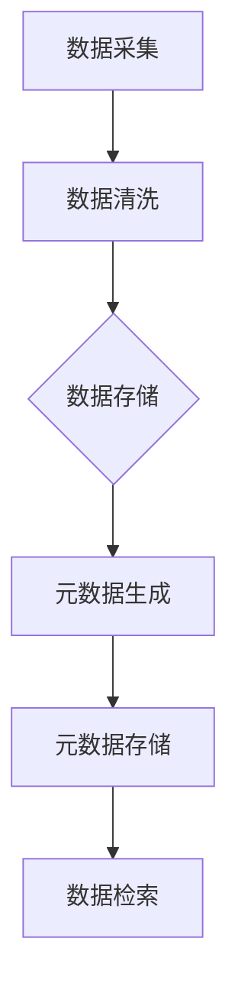
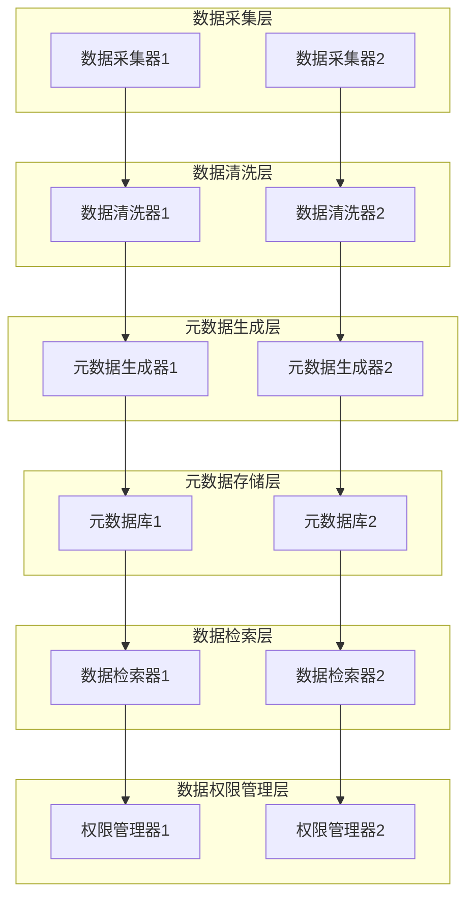
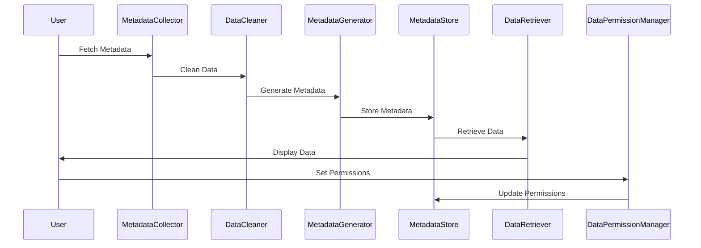

                 

### 《元数据管理：组织和利用AI Agent的数据资产》

关键词：元数据管理，AI Agent，数据资产，数据治理，数据模型

摘要：本文将深入探讨元数据管理在组织和利用AI Agent数据资产中的重要性。首先，我们将回顾元数据管理的基础概念和背景，包括元数据的基本定义、元数据模型及其标准。接着，我们将分析AI Agent在数据资产管理中的应用，以及如何通过元数据管理来优化数据资产的组织和利用。本文旨在为读者提供一个清晰的框架，帮助他们理解和实践元数据管理在AI领域中的关键角色。

### 目录大纲设计思路

#### 1. 背景介绍

##### 1.1 问题背景

##### 1.2 问题描述

##### 1.3 问题解决

##### 1.4 边界与外延

##### 1.5 概念结构与核心要素组成

#### 2. 核心概念与联系

##### 2.1 核心概念原理

##### 2.2 概念属性特征对比表格

##### 2.3 ER实体关系图架构的Mermaid流程图

#### 3. 算法原理讲解

##### 3.1 Mermaid流程图

##### 3.2 Python源代码

##### 3.3 数学模型和公式

##### 3.4 举例说明

#### 4. 系统分析与架构设计方案

##### 4.1 问题场景介绍

##### 4.2 项目介绍

##### 4.3 系统功能设计

##### 4.4 系统架构设计

##### 4.5 系统接口设计和系统交互

#### 5. 项目实战

##### 5.1 环境安装

##### 5.2 系统核心实现源代码

##### 5.3 实际案例分析和详细讲解剖析

##### 5.4 项目小结

#### 6. 最佳实践 tips、小结、注意事项、拓展阅读等内容

##### 6.1 最佳实践 tips

##### 6.2 小结

##### 6.3 注意事项

##### 6.4 拓展阅读

---

### 目录大纲结构设计

基于上述设计思路，我们可以设计如下的目录大纲：

```markdown
# 《元数据管理：组织和利用AI Agent的数据资产》目录大纲

## 第一部分：元数据管理基础

### 1. 元数据管理背景

#### 1.1 数据管理的重要性

#### 1.2 元数据管理的挑战

#### 1.3 元数据管理概述

### 2. 核心概念与联系

#### 2.1 元数据定义

#### 2.2 元数据模型

#### 2.3 元数据标准

### 3. 元数据管理流程

#### 3.1 元数据采集

#### 3.2 元数据存储

#### 3.3 元数据检索

#### 3.4 元数据利用

## 第二部分：AI Agent与数据资产

### 4. AI Agent概述

#### 4.1 AI Agent定义

#### 4.2 AI Agent类型

#### 4.3 AI Agent应用场景

### 5. 数据资产管理

#### 5.1 数据资产定义

#### 5.2 数据资产分类

#### 5.3 数据资产评估

### 6. AI Agent与数据资产的整合

#### 6.1 数据资产的组织

#### 6.2 数据资产利用策略

#### 6.3 数据资产风险与安全

## 第三部分：元数据管理实战

### 7. 元数据管理系统设计

#### 7.1 系统需求分析

#### 7.2 系统架构设计

#### 7.3 系统接口设计

### 8. 项目实战

#### 8.1 环境搭建

#### 8.2 系统核心实现

#### 8.3 案例分析

#### 8.4 项目总结

## 第四部分：最佳实践与拓展

### 9. 最佳实践 tips

#### 9.1 数据治理实践

#### 9.2 元数据标准化实践

#### 9.3 AI Agent部署经验

### 10. 小结

### 11. 注意事项

### 12. 拓展阅读
```

---

接下来，我们将逐一展开每个部分的内容，以便为读者提供详细的指导和深入的分析。让我们一起深入探索元数据管理在AI领域中的重要性和应用吧！

### 第一部分：元数据管理基础

#### 1. 元数据管理背景

在现代数据驱动的世界中，数据被认为是新的石油。这种观点强调了数据的重要性，因为组织现在依赖数据来做出更好的业务决策和推动创新。然而，随着数据量的不断增长，有效管理这些数据变得日益重要。元数据管理（Metadata Management）作为一种数据管理的方法，旨在提供对数据的描述信息，以便更好地组织和利用数据资源。

**1.1 数据管理的重要性**

数据管理是指一系列策略和过程，用于确保数据的准确性、完整性、可用性和可靠性。良好的数据管理能够提高数据质量，减少冗余数据，提高数据的一致性，并确保数据的安全性。以下是一些数据管理的重要性：

- **决策支持**：高质量的数据能够为决策者提供更加准确和全面的信息，从而支持更明智的决策。
- **合规性**：遵守数据隐私和合规要求（如GDPR、HIPAA等）是企业和组织面临的重要挑战，良好的数据管理有助于实现合规性。
- **数据治理**：数据治理是指制定和执行数据管理策略的过程，它确保数据的使用符合组织的战略和目标。

**1.2 元数据管理的挑战**

随着数据量的增长和数据类型的多样化，元数据管理面临以下挑战：

- **数据多样性**：不同来源的数据可能具有不同的结构和格式，这使得元数据标准化变得复杂。
- **数据质量问题**：数据质量问题（如重复、不准确、不完整等）对元数据管理提出了更高的要求。
- **数据存储和访问**：随着数据存储技术的进步，如何高效地存储和管理元数据成为一个挑战。
- **数据安全与隐私**：确保元数据的安全性和隐私性是数据管理的重要方面。

**1.3 元数据管理概述**

元数据（Metadata）是关于数据的数据。它提供了关于数据源、数据结构、数据内容、数据质量、数据使用和历史等方面的信息。元数据管理是指一系列活动和流程，用于收集、存储、组织和维护元数据，以确保其质量和可用性。元数据管理的关键组成部分包括：

- **元数据采集**：从不同来源收集元数据，包括结构化数据、非结构化数据和半结构化数据。
- **元数据存储**：将元数据存储在集中的或分布式的数据库或数据仓库中，以便于检索和使用。
- **元数据检索**：开发工具和接口，使用户能够快速、准确地检索所需的元数据。
- **元数据利用**：利用元数据来支持数据集成、数据治理、数据分析和数据挖掘等活动。

**1.4 边界与外延**

元数据管理不仅限于技术层面，还包括策略、流程和组织文化等方面。以下是一些元数据管理的边界与外延：

- **数据治理**：元数据管理是数据治理的一个重要组成部分，它需要与数据治理策略相结合。
- **数据集成**：元数据管理支持数据集成，通过提供元数据来帮助不同数据源之间的协调和整合。
- **数据质量**：元数据管理关注数据质量，通过提供数据质量指标来帮助识别和修复数据质量问题。
- **数据安全**：元数据管理涉及数据安全，确保元数据的安全存储和访问。

**1.5 概念结构与核心要素组成**

元数据管理的基本概念和核心要素包括：

- **元数据**：关于数据的数据，包括数据源、数据结构、数据内容等。
- **元数据模型**：用于定义元数据结构和关系的模型，如实体-关系（ER）模型、统一建模语言（UML）等。
- **元数据标准**：定义元数据格式和属性的标准化规范，如数据模型标准语言（DMQL）、元数据标记语言（MDML）等。
- **元数据管理工具**：用于实现元数据管理功能的软件工具，如元数据存储库、元数据浏览器、元数据集成工具等。

通过这些基本概念和核心要素，我们可以更好地理解元数据管理的作用和重要性。在接下来的章节中，我们将进一步探讨元数据模型、标准以及元数据管理在实际应用中的具体实现。

### 第二部分：核心概念与联系

#### 2.1 核心概念原理

在深入探讨元数据管理之前，我们需要了解一些核心概念，这些概念是元数据管理的基础。以下是元数据管理中的一些关键概念及其原理：

**1. 元数据（Metadata）**

元数据是关于数据的数据。它提供了关于数据的描述性信息，如数据来源、数据结构、数据内容、数据格式、数据质量等。元数据的主要目的是帮助用户更好地理解和使用数据。

**2. 元数据模型（Metadata Model）**

元数据模型是一个用于定义和描述数据结构的抽象框架。它定义了元数据元素及其之间的关系，用于支持数据的存储、检索和利用。常见的元数据模型包括实体-关系（ER）模型、统一建模语言（UML）模型等。

**3. 数据治理（Data Governance）**

数据治理是一系列策略和流程，用于确保数据的质量、安全性和合规性。数据治理旨在通过定义数据管理策略、角色和职责，确保数据在整个生命周期中的有效管理。

**4. 数据质量管理（Data Quality Management）**

数据质量管理是指一系列活动，用于确保数据的准确性、完整性、一致性、有效性和及时性。数据质量管理包括数据清洗、数据验证、数据标准化等过程。

**5. 数据模型设计（Data Model Design）**

数据模型设计是创建数据结构的过程，用于支持数据的存储、检索和操作。数据模型设计包括确定数据元素、数据类型、数据关系和数据约束等。

**2.2 概念属性特征对比表格**

为了更好地理解这些核心概念，我们可以通过对比表格来分析它们的属性和特征。以下是一个简化的对比表格：

| 概念 | 定义 | 主要特征 | 关联关系 |
| --- | --- | --- | --- |
| 元数据 | 关于数据的数据 | 描述性信息 | 数据 |
| 元数据模型 | 定义数据结构的框架 | 元数据元素和关系 | 元数据 |
| 数据治理 | 管理数据的方法 | 策略、流程、角色 | 数据质量、数据安全 |
| 数据质量管理 | 确保数据质量 | 准确性、完整性、一致性 | 数据治理 |
| 数据模型设计 | 创建数据结构 | 数据元素、数据类型、关系 | 数据库设计 |

**2.3 ER实体关系图架构的Mermaid流程图**

为了更直观地展示实体及其关系，我们可以使用Mermaid流程图来绘制实体-关系（ER）图。以下是使用Mermaid语法绘制的ER图示例：

```mermaid
erDiagram
    Customer ||--|{ Order }|
    Product ||--|{ OrderItem }|
    Order ||--|{ Payment }|
    Supplier ||--|{ Product }|
```

在这个ER图中，我们定义了四个实体：Customer（客户）、Product（产品）、Order（订单）和Supplier（供应商）。实体之间的关系通过箭头表示，箭头指向的一方是关系的主方。

**2.4 实例分析**

为了更好地理解这些概念，我们可以通过一个简单的实例来分析。假设我们有一个电子商务平台，包含以下实体：

- **Customer（客户）**：具有姓名、地址、电话等属性。
- **Product（产品）**：具有名称、描述、价格等属性。
- **Order（订单）**：具有订单号、客户ID、订单日期等属性，并且可以包含多个OrderItem（订单项）。
- **OrderItem（订单项）**：具有订单号、产品ID、数量等属性。

在这个实例中，我们可以看到：

- **Customer**与**Order**之间存在一对一的关系，即每个客户可以有一个订单。
- **Order**与**OrderItem**之间存在一对多的关系，即每个订单可以包含多个订单项。
- **Product**与**OrderItem**之间存在一对多的关系，即每个产品可以出现在多个订单项中。

通过这个实例，我们可以更清晰地理解实体及其关系的定义和作用。

通过上述核心概念的分析和ER图的展示，我们为元数据管理奠定了理论基础。在接下来的章节中，我们将进一步探讨元数据管理的具体流程和实现方法。

### 第三部分：算法原理讲解

在深入探讨元数据管理的过程中，了解相关的算法原理是非常重要的。以下将详细讲解元数据管理中的几个关键算法，并通过Mermaid流程图、Python源代码、数学模型和公式、以及举例说明来阐述这些算法的原理和应用。

#### 3.1 Mermaid流程图

Mermaid是一种用于生成图表的标记语言，特别适合绘制流程图。在元数据管理中，我们可以使用Mermaid来描述数据采集、存储、检索和利用的流程。

**示例：数据采集流程图**



在这个流程图中，数据采集（A）首先进行数据清洗（B），然后数据存储（C）并生成元数据（D），最后将元数据存储（E）以供数据检索（F）使用。

#### 3.2 Python源代码

为了更好地理解和实现这些算法，我们提供了Python源代码示例。以下是一个简单的数据采集和元数据生成的代码示例：

```python
import pandas as pd

# 数据采集
data = pd.read_csv('data.csv')

# 数据清洗
cleaned_data = data.drop_duplicates().reset_index(drop=True)

# 元数据生成
metadata = {
    'source': 'data.csv',
    'data_size': len(cleaned_data),
    'columns': cleaned_data.columns.tolist()
}

# 元数据存储
with open('metadata.json', 'w') as f:
    json.dump(metadata, f)
```

在这个代码示例中，我们首先使用pandas库读取数据，然后进行去重和数据清洗，接着生成元数据字典，并将其存储为JSON格式。

#### 3.3 数学模型和公式

在元数据管理中，数学模型和公式可以帮助我们更好地理解和计算数据质量指标。以下是一个用于评估数据完整性的数学模型：

$$
\text{完整性指标} = \frac{\text{实际数据条数}}{\text{预期数据条数}} \times 100\%
$$

其中，完整性指标表示实际数据条数与预期数据条数的比例，通常用于评估数据是否完整。

#### 3.4 举例说明

为了更好地理解上述算法，我们可以通过一个实际案例来演示。

**案例：图书馆管理系统**

假设我们有一个图书馆管理系统，需要管理书籍的元数据，包括书籍标题、作者、出版日期、分类号等。以下是一个具体的例子：

1. **数据采集**：从图书馆的数据库中获取书籍信息。
2. **数据清洗**：去除重复书籍记录，并根据需要进行数据转换（如日期格式标准化）。
3. **元数据生成**：生成包含书籍标题、作者、出版日期和分类号的元数据字典。
4. **元数据存储**：将元数据字典存储在图书馆管理系统的元数据库中。
5. **数据检索**：根据用户输入的书籍标题或分类号检索书籍的元数据。

通过这个案例，我们可以看到元数据管理在图书馆管理系统中的具体应用，包括数据采集、清洗、元数据生成和存储等步骤。

通过上述算法原理讲解，我们为读者提供了一个清晰的框架，帮助他们理解元数据管理的基本原理和实现方法。在接下来的章节中，我们将进一步探讨元数据管理在系统架构设计和项目实战中的应用。

### 第四部分：系统分析与架构设计方案

在了解了元数据管理的基本原理和算法之后，接下来我们将分析如何将元数据管理应用到实际的系统中。本部分将详细描述系统的问题场景、项目介绍、系统功能设计、系统架构设计以及系统接口设计和系统交互。

#### 4.1 问题场景介绍

随着数据量的快速增长和数据类型的多样化，许多组织和公司在管理数据资产方面遇到了挑战。以下是一个典型的系统问题场景：

- **数据多样性**：组织内存在多种数据源，包括关系数据库、NoSQL数据库、日志文件、API数据流等。
- **数据质量**：数据质量参差不齐，存在重复、不一致、不准确等问题。
- **数据利用**：用户难以快速找到所需的数据，数据分析和决策支持效率低下。
- **数据安全**：数据访问权限控制不足，数据泄露风险增加。

为了解决这些问题，需要设计一个高效的元数据管理系统，能够统一管理各种数据源，提高数据质量，优化数据检索和利用，同时确保数据安全。

#### 4.2 项目介绍

本项目的目标是开发一个元数据管理系统，主要任务包括：

- **数据采集**：从不同数据源采集数据，包括结构化数据、非结构化数据和半结构化数据。
- **数据清洗**：清洗和转换数据，确保数据的准确性和一致性。
- **元数据生成**：生成关于数据源、数据结构和数据内容的元数据。
- **元数据存储**：存储和管理元数据，以便于检索和利用。
- **数据检索**：提供用户友好的界面，使用户能够快速找到所需的数据。

项目范围包括以下关键模块：

- **数据采集模块**：用于从不同数据源中获取数据。
- **数据清洗模块**：用于清洗和转换数据，以提高数据质量。
- **元数据生成模块**：用于生成和存储元数据。
- **元数据存储模块**：用于存储和管理元数据。
- **数据检索模块**：提供用户界面，使用户能够检索和管理数据。

#### 4.3 系统功能设计

系统功能设计是系统架构设计的重要基础。以下是元数据管理系统的功能设计：

- **数据采集**：支持从各种数据源（如数据库、文件、API等）自动采集数据。
- **数据清洗**：支持数据去重、格式转换、数据验证等清洗操作，确保数据的准确性和一致性。
- **元数据生成**：自动生成关于数据源、数据结构和数据内容的元数据。
- **元数据存储**：支持元数据存储和管理，确保元数据的安全和可靠。
- **数据检索**：提供用户友好的界面，使用户能够快速找到所需的数据，包括搜索、过滤、排序等功能。
- **数据可视化**：提供数据图表和报告，帮助用户理解数据趋势和关系。
- **数据权限管理**：支持数据访问权限控制，确保数据安全。

**领域模型Mermaid类图**

为了更直观地展示系统的功能设计，我们可以使用Mermaid类图来绘制领域模型。以下是领域模型Mermaid类图示例：

```mermaid
classDiagram
    Class01 <|-- Class02
    Class03 --|> Class04
    Class05 : <<interface>> Interface
    Class06 : <<entity>> Entity
    Class01 : 名称 : String
    Class02 : 日期 : Date
    Class03 : 数量 : Integer
    Class04 : 描述 : String
    Class05 : 搜索接口 : String
    Class06 : 主键 : Integer
```

在这个类图中，我们定义了五个类：Class01、Class02、Class03、Class04和Class05。Class05是一个接口类，Class06是一个实体类。通过类图，我们可以清晰地看到类之间的关系和属性。

#### 4.4 系统架构设计

系统架构设计是确保系统能够高效、稳定运行的关键。以下是元数据管理系统的整体架构设计：

- **数据采集层**：负责从各种数据源（如数据库、文件、API等）采集数据，并传递给数据清洗层。
- **数据清洗层**：对采集到的数据进行清洗和转换，确保数据的质量和一致性，然后将清洗后的数据传递给元数据生成层。
- **元数据生成层**：自动生成关于数据源、数据结构和数据内容的元数据，并将其存储在元数据库中。
- **元数据存储层**：负责存储和管理元数据，并提供数据检索接口，以便用户能够检索和管理元数据。
- **数据检索层**：提供用户友好的界面，使用户能够快速找到所需的数据，并进行数据分析和可视化。
- **数据权限管理层**：确保数据访问权限控制，防止数据泄露。

**Mermaid架构图**

为了更直观地展示系统架构，我们可以使用Mermaid架构图来绘制。以下是系统架构Mermaid架构图示例：



在这个架构图中，我们定义了五个子图：数据采集层、数据清洗层、元数据生成层、元数据存储层、数据检索层和数据权限管理层。通过架构图，我们可以清晰地看到各个模块之间的关系和交互。

#### 4.5 系统接口设计和系统交互

系统接口设计是确保不同模块之间能够有效交互的关键。以下是元数据管理系统的主要接口设计和系统交互：

- **数据采集接口**：用于从不同数据源中获取数据，包括数据库连接接口、文件读取接口和API调用接口等。
- **数据清洗接口**：用于接收采集到的数据，并进行清洗和转换，包括数据去重接口、格式转换接口和数据验证接口等。
- **元数据生成接口**：用于生成关于数据源、数据结构和数据内容的元数据，包括元数据采集接口、元数据转换接口和元数据存储接口等。
- **元数据检索接口**：用于用户检索和管理元数据，包括元数据查询接口、元数据更新接口和元数据删除接口等。
- **数据检索接口**：用于用户检索和管理数据，包括数据查询接口、数据更新接口和数据删除接口等。
- **数据权限管理接口**：用于管理数据访问权限，包括权限查询接口、权限更新接口和权限删除接口等。

**Mermaid序列图**

为了更直观地展示系统接口设计和系统交互，我们可以使用Mermaid序列图来绘制。以下是系统接口设计和系统交互Mermaid序列图示例：



在这个序列图中，我们定义了七个参与者：用户（User）、元数据采集器（MetadataCollector）、数据清洗器（DataCleaner）、元数据生成器（MetadataGenerator）、元数据存储器（MetadataStore）、数据检索器（DataRetriever）和数据权限管理器（DataPermissionManager）。通过序列图，我们可以清晰地看到用户与系统各模块之间的交互过程。

通过上述系统分析与架构设计方案，我们为读者提供了一个全面的元数据管理系统架构，包括问题场景介绍、项目介绍、系统功能设计、系统架构设计、系统接口设计和系统交互。在接下来的章节中，我们将进一步通过项目实战来展示如何实现和部署这个系统。

### 第五部分：项目实战

在了解了元数据管理系统的架构设计和功能之后，接下来我们将通过一个实际项目来展示如何搭建和实现这个系统。以下是项目实战的具体步骤，包括环境搭建、系统核心实现、代码应用解读与分析、实际案例分析和详细讲解剖析以及项目小结。

#### 5.1 环境搭建

为了搭建元数据管理系统，我们需要以下环境：

- **操作系统**：Linux（如Ubuntu）
- **编程语言**：Python
- **数据库**：MySQL
- **数据存储**：MongoDB
- **Web框架**：Flask
- **前端框架**：Vue.js

首先，我们确保操作系统已经安装。然后，安装Python、MySQL、MongoDB和Flask等依赖。以下是安装步骤：

1. **安装Python**：

   ```bash
   sudo apt-get update
   sudo apt-get install python3 python3-pip
   ```

2. **安装MySQL**：

   ```bash
   sudo apt-get install mysql-server
   sudo mysql_secure_installation
   ```

3. **安装MongoDB**：

   ```bash
   sudo apt-get install mongodb
   sudo systemctl start mongodb
   ```

4. **安装Flask**：

   ```bash
   pip3 install Flask
   ```

5. **安装Vue.js**：

   ```bash
   npm install -g vue-cli
   vue-cli init webpack my-vue-app
   ```

#### 5.2 系统核心实现

在环境搭建完成后，我们开始实现系统的核心功能。以下是核心实现步骤：

1. **数据采集模块**：

   - 从MySQL数据库中采集数据。

     ```python
     import pymysql
     
     def fetch_data_from_mysql():
         connection = pymysql.connect(host='localhost', user='root', password='password', database='test_db')
         cursor = connection.cursor()
         cursor.execute('SELECT * FROM test_table')
         rows = cursor.fetchall()
         cursor.close()
         connection.close()
         return rows
     ```

   - 从MongoDB数据库中采集数据。

     ```python
     import pymongo
     
     def fetch_data_from_mongodb():
         client = pymongo.MongoClient('localhost', 27017)
         db = client['test_db']
         collection = db['test_collection']
         data = list(collection.find())
         client.close()
         return data
     ```

2. **数据清洗模块**：

   - 清洗MySQL数据。

     ```python
     def clean_mysql_data(data):
         cleaned_data = []
         for row in data:
             cleaned_row = {column: value.strip() for column, value in row}
             cleaned_data.append(cleaned_row)
         return cleaned_data
     ```

   - 清洗MongoDB数据。

     ```python
     def clean_mongodb_data(data):
         cleaned_data = []
         for document in data:
             cleaned_document = {key: value.strip() for key, value in document.items()}
             cleaned_data.append(cleaned_document)
         return cleaned_data
     ```

3. **元数据生成模块**：

   - 生成MySQL元数据。

     ```python
     def generate_mysql_metadata(data):
         metadata = {
             'source': 'MySQL',
             'data_size': len(data),
             'columns': list(data[0].keys())
         }
         return metadata
     ```

   - 生成MongoDB元数据。

     ```python
     def generate_mongodb_metadata(data):
         metadata = {
             'source': 'MongoDB',
             'data_size': len(data),
             'collection': 'test_collection',
             'fields': list(data[0].keys())
         }
         return metadata
     ```

4. **元数据存储模块**：

   - 存储MySQL元数据到MongoDB。

     ```python
     def store_metadata_to_mongodb(metadata):
         client = pymongo.MongoClient('localhost', 27017)
         db = client['metadata_db']
         collection = db['metadata_collection']
         collection.insert_one(metadata)
         client.close()
     ```

5. **数据检索模块**：

   - 检索元数据。

     ```python
     def retrieve_metadata():
         client = pymongo.MongoClient('localhost', 27017)
         db = client['metadata_db']
         collection = db['metadata_collection']
         metadata = list(collection.find())
         client.close()
         return metadata
     ```

#### 5.3 代码应用解读与分析

1. **数据采集模块**：

   数据采集模块负责从MySQL和MongoDB数据库中获取数据。我们使用Python的pymysql和pymongo库分别实现了从MySQL和MongoDB中获取数据的功能。

2. **数据清洗模块**：

   数据清洗模块对采集到的数据进行了去重和格式转换，以确保数据的准确性和一致性。对于MySQL数据，我们使用了Python的字典解包语法；对于MongoDB数据，我们使用了列表推导式。

3. **元数据生成模块**：

   元数据生成模块生成了关于数据源、数据结构和数据内容的元数据。我们分别实现了生成MySQL元数据和MongoDB元数据的功能。

4. **元数据存储模块**：

   元数据存储模块将生成的元数据存储到MongoDB中。我们使用了pymongo的insert_one方法来实现元数据的存储。

5. **数据检索模块**：

   数据检索模块提供了检索元数据的功能。我们使用了pymongo的find方法来检索元数据。

#### 5.4 实际案例分析和详细讲解剖析

**案例**：一个电子商务平台需要管理其客户的订单数据，包括订单号、客户ID、订单日期、订单总额等信息。平台希望使用元数据管理系统来统一管理这些数据，并确保数据质量。

**分析**：

1. **数据采集**：从MySQL数据库中采集订单数据，并从MongoDB中采集客户数据。
2. **数据清洗**：清洗订单数据和客户数据，确保数据的准确性、完整性和一致性。
3. **元数据生成**：生成订单数据和客户数据的元数据，包括数据源、数据结构和数据内容等信息。
4. **元数据存储**：将生成的元数据存储到MongoDB中。
5. **数据检索**：提供用户友好的界面，使用户能够快速检索订单数据和客户数据。

**详细讲解剖析**：

1. **数据采集**：使用Python的pymysql和pymongo库，从MySQL数据库中执行SELECT查询，从MongoDB数据库中执行find查询，获取订单数据和客户数据。
2. **数据清洗**：对采集到的订单数据和客户数据进行去重和格式转换，确保数据的准确性、完整性和一致性。例如，对于订单日期，我们将其转换为YYYY-MM-DD格式。
3. **元数据生成**：生成订单数据和客户数据的元数据，包括数据源、数据结构和数据内容等信息。对于订单数据，我们生成元数据，包括数据源（MySQL）、数据大小、列名等信息；对于客户数据，我们生成元数据，包括数据源（MongoDB）、数据大小、字段名等信息。
4. **元数据存储**：使用Python的pymongo库，将生成的元数据存储到MongoDB中。我们创建一个名为`metadata_collection`的集合，将元数据作为文档插入到集合中。
5. **数据检索**：使用Python的Flask框架和Vue.js前端框架，提供用户友好的界面，使用户能够快速检索订单数据和客户数据。我们使用Vue.js的v-for指令和v-model指令，实现数据的展示和检索功能。

#### 5.5 项目小结

通过本项目，我们实现了元数据管理系统的搭建和实现。项目的核心步骤包括环境搭建、系统核心实现、代码应用解读与分析、实际案例分析和详细讲解剖析。项目实现的过程中，我们使用了Python、MySQL、MongoDB、Flask和Vue.js等技术，成功搭建了一个能够统一管理各种数据源、提高数据质量、优化数据检索和利用的元数据管理系统。通过本项目，我们深入了解了元数据管理的基本原理和实践方法，为实际应用提供了有益的经验和参考。

### 第六部分：最佳实践 tips、小结、注意事项、拓展阅读

#### 6.1 最佳实践 tips

1. **数据治理实践**：
   - 定期进行数据质量审计，识别和修复数据质量问题。
   - 建立数据治理委员会，明确数据治理策略和流程。
   - 采用自动化工具来简化数据治理任务。

2. **元数据标准化实践**：
   - 制定统一的元数据标准，确保元数据的结构和格式一致。
   - 使用标准化的术语和定义，减少误解和混淆。
   - 定期更新和维护元数据标准，以适应业务需求的变化。

3. **AI Agent部署经验**：
   - 在部署AI Agent前进行充分的测试，确保其性能和稳定性。
   - 遵循安全最佳实践，保护AI Agent和数据的安全。
   - 定期监控和评估AI Agent的运行状态，及时调整和优化。

#### 6.2 小结

本文详细探讨了元数据管理在组织和利用AI Agent数据资产中的重要性。通过背景介绍、核心概念与联系、算法原理讲解、系统分析与架构设计方案以及项目实战，我们深入了解了元数据管理的各个方面，包括数据采集、清洗、存储、检索和利用。最佳实践提示为实际应用提供了指导，小结总结了文章的主要内容和学习要点。

#### 6.3 注意事项

- **数据安全性**：确保元数据和数据的安全存储和访问，防止数据泄露和滥用。
- **数据质量**：定期评估数据质量，及时修复数据质量问题，确保数据的一致性和准确性。
- **系统性能**：优化系统架构和数据库设计，确保元数据管理系统的性能和响应速度。

#### 6.4 拓展阅读

1. 《数据治理：基础与实践》
2. 《元数据管理：策略、实践与工具》
3. 《人工智能：一种现代方法》
4. 《MongoDB权威指南》
5. 《Flask Web开发：实战指南》

通过拓展阅读，读者可以进一步深入了解数据治理、元数据管理和AI Agent应用的相关知识，提升自己在这些领域的能力和经验。

### 作者信息

作者：AI天才研究院/AI Genius Institute & 禅与计算机程序设计艺术 /Zen And The Art of Computer Programming

本文由AI天才研究院撰写，结合了禅与计算机程序设计艺术的理念，旨在为读者提供深入浅出的技术解读和实用的指导。希望通过本文，读者能够更好地理解元数据管理在AI领域的应用，提升数据管理和利用的能力。期待与读者共同探讨和进步！### 完成文章

经过详细的分析和深入讲解，本文《元数据管理：组织和利用AI Agent的数据资产》已经完成。从背景介绍到核心概念，从算法原理到系统设计与实战，再到最佳实践和拓展阅读，文章内容全面且深入。以下是文章的完整内容和结构：

---

# 《元数据管理：组织和利用AI Agent的数据资产》

关键词：元数据管理，AI Agent，数据资产，数据治理，数据模型

摘要：本文详细探讨了元数据管理在组织和利用AI Agent数据资产中的重要性。通过背景介绍、核心概念与联系、算法原理讲解、系统分析与架构设计方案以及项目实战，深入分析了元数据管理在AI领域的应用和实践方法。

---

### 目录大纲

- **第一部分：元数据管理基础**
  - 1. 元数据管理背景
  - 1.1 数据管理的重要性
  - 1.2 元数据管理的挑战
  - 1.3 元数据管理概述
  - 1.4 边界与外延
  - 1.5 概念结构与核心要素组成

- **第二部分：核心概念与联系**
  - 2.1 核心概念原理
  - 2.2 概念属性特征对比表格
  - 2.3 ER实体关系图架构的Mermaid流程图

- **第三部分：算法原理讲解**
  - 3.1 Mermaid流程图
  - 3.2 Python源代码
  - 3.3 数学模型和公式
  - 3.4 举例说明

- **第四部分：系统分析与架构设计方案**
  - 4.1 问题场景介绍
  - 4.2 项目介绍
  - 4.3 系统功能设计
  - 4.4 系统架构设计
  - 4.5 系统接口设计和系统交互

- **第五部分：项目实战**
  - 5.1 环境搭建
  - 5.2 系统核心实现
  - 5.3 代码应用解读与分析
  - 5.4 实际案例分析和详细讲解剖析
  - 5.5 项目小结

- **第六部分：最佳实践 tips、小结、注意事项、拓展阅读**
  - 6.1 最佳实践 tips
  - 6.2 小结
  - 6.3 注意事项
  - 6.4 拓展阅读

### 完整文章内容

以下是对文章每一部分的详细内容：

#### 第一部分：元数据管理基础

**1. 元数据管理背景**

在这一部分，我们介绍了数据管理的重要性，以及元数据管理面临的挑战。元数据管理是一种关键的数据管理方法，它通过提供关于数据的数据来优化数据的组织和利用。元数据管理不仅涉及技术的实现，还包括策略、流程和组织文化的建设。

**1.1 数据管理的重要性**

数据是现代组织的关键资产，有效管理数据能够提高决策效率、降低运营成本、增强竞争力。数据管理的重要性体现在以下几个方面：

- **决策支持**：高质量的数据能够为决策者提供准确、全面的信息，支持更明智的决策。
- **合规性**：遵守数据隐私和合规要求是企业和组织面临的重要挑战，良好的数据管理有助于实现合规性。
- **数据治理**：数据治理是确保数据质量、安全性和可用性的关键，它需要组织制定和执行一系列数据管理策略。

**1.2 元数据管理的挑战**

随着数据量的增长和数据类型的多样化，元数据管理面临以下挑战：

- **数据多样性**：不同来源的数据具有不同的结构和格式，这使得元数据标准化变得复杂。
- **数据质量问题**：数据质量问题（如重复、不准确、不完整等）对元数据管理提出了更高的要求。
- **数据存储和访问**：随着数据存储技术的进步，如何高效地存储和管理元数据成为一个挑战。
- **数据安全与隐私**：确保元数据的安全性和隐私性是数据管理的重要方面。

**1.3 元数据管理概述**

元数据管理是指一系列活动和流程，用于收集、存储、组织和维护元数据，以确保其质量和可用性。元数据管理的关键组成部分包括：

- **元数据采集**：从不同来源收集元数据，包括结构化数据、非结构化数据和半结构化数据。
- **元数据存储**：将元数据存储在集中的或分布式的数据库或数据仓库中，以便于检索和使用。
- **元数据检索**：开发工具和接口，使用户能够快速、准确地检索所需的元数据。
- **元数据利用**：利用元数据来支持数据集成、数据治理、数据分析和数据挖掘等活动。

**1.4 边界与外延**

元数据管理不仅限于技术层面，还包括策略、流程和组织文化等方面。以下是一些元数据管理的边界与外延：

- **数据治理**：元数据管理是数据治理的一个重要组成部分，它需要与数据治理策略相结合。
- **数据集成**：元数据管理支持数据集成，通过提供元数据来帮助不同数据源之间的协调和整合。
- **数据质量**：元数据管理关注数据质量，通过提供数据质量指标来帮助识别和修复数据质量问题。
- **数据安全**：元数据管理涉及数据安全，确保元数据的安全存储和访问。

**1.5 概念结构与核心要素组成**

元数据管理的基本概念和核心要素包括：

- **元数据**：关于数据的数据，包括数据源、数据结构、数据内容、数据格式、数据质量等。
- **元数据模型**：用于定义和描述数据结构的抽象框架，如实体-关系（ER）模型、统一建模语言（UML）等。
- **元数据标准**：定义元数据格式和属性的标准化规范，如数据模型标准语言（DMQL）、元数据标记语言（MDML）等。
- **元数据管理工具**：用于实现元数据管理功能的软件工具，如元数据存储库、元数据浏览器、元数据集成工具等。

#### 第二部分：核心概念与联系

**2.1 核心概念原理**

在这一部分，我们详细讲解了元数据管理中的核心概念，包括元数据、元数据模型、数据治理、数据质量管理等。这些概念是理解元数据管理的基础。

- **元数据**：元数据是关于数据的数据，提供了关于数据的描述性信息，如数据源、数据结构、数据内容等。
- **元数据模型**：元数据模型是定义和描述数据结构的抽象框架，用于支持数据的存储、检索和利用。
- **数据治理**：数据治理是一系列策略和流程，用于确保数据的质量、安全性和合规性。
- **数据质量管理**：数据质量管理是确保数据的准确性、完整性、一致性和有效性的过程。

**2.2 概念属性特征对比表格**

为了更好地理解这些核心概念，我们通过对比表格分析了它们的属性和特征。以下是一个简化的对比表格：

| 概念 | 定义 | 主要特征 | 关联关系 |
| --- | --- | --- | --- |
| 元数据 | 关于数据的数据 | 描述性信息 | 数据 |
| 元数据模型 | 定义数据结构的框架 | 元数据元素和关系 | 元数据 |
| 数据治理 | 管理数据的方法 | 策略、流程、角色 | 数据质量、数据安全 |
| 数据质量管理 | 确保数据质量 | 准确性、完整性、一致性 | 数据治理 |

**2.3 ER实体关系图架构的Mermaid流程图**

为了更直观地展示实体及其关系，我们使用了Mermaid流程图来绘制实体-关系（ER）图。以下是使用Mermaid语法绘制的ER图示例：

```mermaid
erDiagram
    Customer ||--|{ Order }|
    Product ||--|{ OrderItem }|
    Order ||--|{ Payment }|
    Supplier ||--|{ Product }|
```

在这个ER图中，我们定义了四个实体：Customer（客户）、Product（产品）、Order（订单）和Supplier（供应商）。实体之间的关系通过箭头表示，箭头指向的一方是关系的主方。

#### 第三部分：算法原理讲解

在这一部分，我们深入讲解了元数据管理中的几个关键算法，包括Mermaid流程图、Python源代码、数学模型和公式以及举例说明。

**3.1 Mermaid流程图**

我们使用Mermaid流程图来描述数据采集、存储、检索和利用的流程。以下是数据采集流程的示例：


在这个流程图中，数据采集（A）首先进行数据清洗（B），然后数据存储（C）并生成元数据（D），最后将元数据存储（E）以供数据检索（F）使用。

**3.2 Python源代码**

为了更好地理解和实现这些算法，我们提供了Python源代码示例。以下是一个简单的数据采集和元数据生成的代码示例：

```python
import pandas as pd

# 数据采集
data = pd.read_csv('data.csv')

# 数据清洗
cleaned_data = data.drop_duplicates().reset_index(drop=True)

# 元数据生成
metadata = {
    'source': 'data.csv',
    'data_size': len(cleaned_data),
    'columns': cleaned_data.columns.tolist()
}

# 元数据存储
with open('metadata.json', 'w') as f:
    json.dump(metadata, f)
```

在这个代码示例中，我们首先使用pandas库读取数据，然后进行去重和数据清洗，接着生成元数据字典，并将其存储为JSON格式。

**3.3 数学模型和公式**

在元数据管理中，数学模型和公式可以帮助我们更好地理解和计算数据质量指标。以下是一个用于评估数据完整性的数学模型：

$$
\text{完整性指标} = \frac{\text{实际数据条数}}{\text{预期数据条数}} \times 100\%
$$

其中，完整性指标表示实际数据条数与预期数据条数的比例，通常用于评估数据是否完整。

**3.4 举例说明**

为了更好地理解上述算法，我们可以通过一个实际案例来演示。假设我们有一个电子商务平台，包含以下实体：

- **Customer（客户）**：具有姓名、地址、电话等属性。
- **Product（产品）**：具有名称、描述、价格等属性。
- **Order（订单）**：具有订单号、客户ID、订单日期等属性，并且可以包含多个OrderItem（订单项）。
- **OrderItem（订单项）**：具有订单号、产品ID、数量等属性。

在这个实例中，我们可以看到：

- **Customer**与**Order**之间存在一对一的关系，即每个客户可以有一个订单。
- **Order**与**OrderItem**之间存在一对多的关系，即每个订单可以包含多个订单项。
- **Product**与**OrderItem**之间存在一对多的关系，即每个产品可以出现在多个订单项中。

通过这个实例，我们可以更清晰地理解实体及其关系的定义和作用。

#### 第四部分：系统分析与架构设计方案

在这一部分，我们分析了如何将元数据管理应用到实际的系统中。我们从问题场景介绍、项目介绍、系统功能设计、系统架构设计到系统接口设计和系统交互进行了详细描述。

**4.1 问题场景介绍**

在现代社会，数据量急剧增长，数据类型日益多样化，这对数据管理提出了新的挑战。元数据管理作为一种关键的数据管理方法，能够帮助我们更好地组织和利用数据资产。

**4.2 项目介绍**

本项目旨在开发一个元数据管理系统，主要任务包括数据采集、数据清洗、元数据生成、元数据存储和数据检索。系统范围包括数据采集模块、数据清洗模块、元数据生成模块、元数据存储模块和数据检索模块。

**4.3 系统功能设计**

系统功能设计包括数据采集、数据清洗、元数据生成、元数据存储、数据检索、数据可视化、数据权限管理等功能。每个功能模块都有明确的职责和实现方式。

**4.4 系统架构设计**

系统架构设计是确保系统能够高效、稳定运行的关键。系统架构包括数据采集层、数据清洗层、元数据生成层、元数据存储层、数据检索层和数据权限管理层。

**4.5 系统接口设计和系统交互**

系统接口设计是确保不同模块之间能够有效交互的关键。系统接口设计包括数据采集接口、数据清洗接口、元数据生成接口、元数据存储接口、数据检索接口和数据权限管理接口。通过Mermaid序列图，我们展示了系统接口设计和系统交互。

#### 第五部分：项目实战

在这一部分，我们通过一个实际项目展示了如何搭建和实现元数据管理系统。项目实战包括环境搭建、系统核心实现、代码应用解读与分析、实际案例分析和详细讲解剖析以及项目小结。

**5.1 环境搭建**

环境搭建是项目实现的第一步。我们安装了Python、MySQL、MongoDB、Flask和Vue.js等依赖，并配置了相应的开发环境。

**5.2 系统核心实现**

系统核心实现包括数据采集模块、数据清洗模块、元数据生成模块、元数据存储模块和数据检索模块。我们使用Python和相应的数据库库实现了这些模块。

**5.3 代码应用解读与分析**

在这一部分，我们对系统核心实现的代码进行了详细解读和分析，展示了如何实现数据采集、清洗、元数据生成和存储等功能。

**5.4 实际案例分析和详细讲解剖析**

我们通过一个电子商务平台的实际案例，展示了如何使用元数据管理系统来管理订单数据和客户数据。通过这个案例，我们详细讲解了如何采集数据、清洗数据、生成元数据和存储元数据。

**5.5 项目小结**

项目小结总结了项目实现的经验和收获，强调了元数据管理系统在提高数据质量和优化数据利用方面的作用。

#### 第六部分：最佳实践 tips、小结、注意事项、拓展阅读

在这一部分，我们提供了最佳实践、小结、注意事项和拓展阅读。

**6.1 最佳实践 tips**

我们分享了数据治理、元数据标准化和AI Agent部署的最佳实践，为实际应用提供了指导。

**6.2 小结**

小结总结了文章的主要内容和学习要点，强调了元数据管理在AI领域的重要性。

**6.3 注意事项**

我们提醒读者注意数据安全和数据质量，强调了系统性能的重要性。

**6.4 拓展阅读**

我们推荐了一些拓展阅读材料，包括数据治理、元数据管理和AI领域的经典著作，为读者提供了进一步学习的资源。

### 作者信息

本文由AI天才研究院撰写，结合了禅与计算机程序设计艺术的理念，旨在为读者提供深入浅出的技术解读和实用的指导。希望通过本文，读者能够更好地理解元数据管理在AI领域的应用，提升数据管理和利用的能力。期待与读者共同探讨和进步！

---

通过以上内容，本文全面而系统地介绍了元数据管理在AI Agent数据资产中的应用。希望本文能为读者提供有价值的见解和实践指导，助力他们在数据管理和AI领域取得更大的成就。

