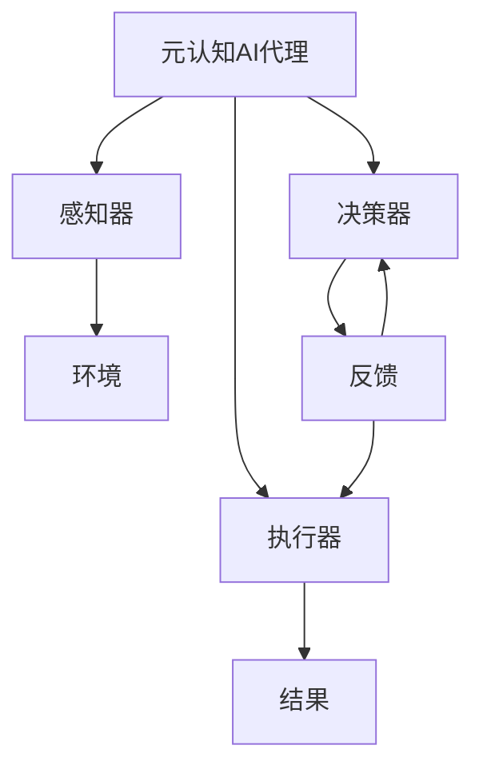

                 

# 元认知AI Agent：自我监控与调节

## 关键词
- 元认知
- AI代理
- 自我监控
- 自我调节
- 人工智能

## 摘要
本文探讨了元认知AI代理的概念、原理以及其实际应用。首先介绍了元认知的基本概念和其在人工智能领域的重要性，然后深入分析了AI代理的自我监控和自我调节机制。通过具体的案例和算法实现，文章展示了元认知AI代理在实际应用中的优势，并提出了未来发展的方向和面临的挑战。

## 引言

### 元认知的基本概念

元认知是一种关于认知的认知过程，它涉及到人们如何理解自己的思考过程、如何评估自己的认知能力、如何调整自己的思考策略。在人工智能领域，元认知指的是人工智能系统具备自我监控、自我评估和自我调节的能力。这种能力使得AI系统能够在复杂的环境中自主学习和优化，从而提高其智能水平。

### AI代理的概念

AI代理（Artificial Intelligence Agent）是一个能够感知环境、采取行动并达成目标的自主实体。在人工智能系统中，AI代理通过模拟人类思维和行为来实现智能决策。而元认知AI代理则在此基础上增加了自我监控和自我调节的能力，使得其能够更加灵活地应对复杂多变的环境。

### 元认知AI代理的重要性

元认知AI代理在人工智能领域具有重要的应用价值。首先，它能够提高AI系统的自主性，使其能够更好地适应复杂和不确定的环境。其次，元认知AI代理能够通过自我监控和自我调节，不断优化自身的性能，从而提高决策的准确性和效率。此外，元认知AI代理还能够实现自我学习和自我进化，从而在长期内持续提高其智能水平。

## 第1章：元认知AI代理的背景和基础

### 1.1 历史发展

#### 1.1.1 人工智能的发展

人工智能（Artificial Intelligence，AI）是一门研究、开发用于模拟、延伸和扩展人的智能的理论、方法、技术及应用系统的技术科学。人工智能的研究始于20世纪50年代，随着计算技术的发展，人工智能逐渐从理论研究走向实际应用。

#### 1.1.2 元认知的发展

元认知（Metacognition）最早由美国心理学家弗拉维尔（John Flavell）在1976年提出，是指个体对自身认知过程的认知。元认知包括元认知知识、元认知体验和元认知监控三个核心成分。随着心理学和认知科学的发展，元认知逐渐被引入到人工智能领域。

#### 1.1.3 元认知AI代理的定义和特点

元认知AI代理（Meta-Cognitive AI Agent）是指具备自我监控、自我评估和自我调节能力的人工智能代理。与传统的AI代理相比，元认知AI代理具有以下特点：

- **自我监控**：元认知AI代理能够实时监测自身的思考过程和性能表现。
- **自我评估**：元认知AI代理能够评估自身的认知能力，并识别自身的不足。
- **自我调节**：元认知AI代理能够根据评估结果调整自己的认知策略，以提高性能。

### 1.2 元认知AI代理的角色和重要性

元认知AI代理在人工智能领域具有广泛的应用前景。首先，它能够提高AI系统的自主性，使其能够更好地适应复杂和不确定的环境。其次，元认知AI代理能够通过自我监控和自我调节，不断优化自身的性能，从而提高决策的准确性和效率。此外，元认知AI代理还能够实现自我学习和自我进化，从而在长期内持续提高其智能水平。

## 第2章：元认知AI代理的核心概念和关系

### 2.1 关键概念和术语

在讨论元认知AI代理时，以下几个关键概念和术语至关重要：

- **元认知**：关于认知的认知过程，包括元认知知识、元认知体验和元认知监控。
- **AI代理**：能够感知环境、采取行动并达成目标的自主实体。
- **自我监控**：实时监测自身的思考过程和性能表现。
- **自我评估**：评估自身的认知能力，并识别自身的不足。
- **自我调节**：根据评估结果调整自己的认知策略，以提高性能。

### 2.2 元认知AI代理的实体关系图

为了更好地理解元认知AI代理的组成和运作原理，我们可以使用Mermaid流程图来绘制其实体关系图。以下是元认知AI代理的实体关系图：

### 2.3 元认知AI代理与传统AI代理的对比

| 特性 | 元认知AI代理 | 传统AI代理 |
| --- | --- | --- |
| 自我监控 | 是 | 否 |
| 自我评估 | 是 | 否 |
| 自我调节 | 是 | 否 |
| 自主性 | 高 | 低 |
| 适应性 | 强 | 弱 |
| 决策效率 | 高 | 低 |

通过对比可以看出，元认知AI代理在自我监控、自我评估和自我调节方面具有显著优势，这使得其在复杂和不确定的环境中具有更高的适应性和决策效率。

## 第3章：元认知AI代理的自我监控机制

### 3.1 自我监控的基本原理

自我监控（Self-Monitoring）是元认知AI代理的核心机制之一，它涉及实时监测AI代理的思考过程和性能表现。自我监控的基本原理包括：

- **实时数据采集**：通过传感器和其他技术手段，实时采集AI代理的思考过程和性能数据。
- **数据预处理**：对采集到的数据进行预处理，包括去噪、滤波和特征提取等。
- **数据分析**：使用统计学和机器学习算法对预处理后的数据进行分析，以识别AI代理的思考过程和性能特点。

### 3.2 实现自我监控的方法和技巧

实现自我监控的关键在于选择合适的方法和技巧。以下是几种常用的实现方法：

- **统计方法**：使用统计方法对采集到的数据进行统计分析，以识别AI代理的思考过程和性能特点。
- **机器学习方法**：使用机器学习算法对采集到的数据进行训练，建立模型以预测AI代理的思考过程和性能表现。
- **深度学习方法**：使用深度学习算法对采集到的数据进行训练，构建复杂的神经网络模型以实现自我监控。

### 3.3 自我监控的挑战和解决方案

尽管自我监控在元认知AI代理中具有重要作用，但在实际应用中也面临一些挑战：

- **数据准确性**：采集到的数据可能存在误差和噪声，影响自我监控的准确性。
- **计算效率**：实时分析大量数据需要较高的计算资源，影响自我监控的效率。

为了解决这些挑战，可以采取以下措施：

- **数据清洗和预处理**：对采集到的数据进行清洗和预处理，以提高数据的准确性和可靠性。
- **分布式计算**：使用分布式计算技术，将自我监控任务分解为多个子任务，以提高计算效率。
- **模型优化**：优化机器学习和深度学习模型，以提高数据分析和预测的准确性。

## 第4章：元认知AI代理的自我调节机制

### 4.1 自我调节的基本原理

自我调节（Self-Regulation）是元认知AI代理的另一个核心机制，它涉及根据自我监控的结果调整AI代理的思考策略和行为。自我调节的基本原理包括：

- **评估结果**：通过自我监控机制，评估AI代理的思考过程和性能表现。
- **策略调整**：根据评估结果，调整AI代理的思考策略和行为，以提高性能。
- **反馈机制**：通过反馈机制，将调整后的策略和行为应用于实际任务，并进行新一轮的自我监控和自我调节。

### 4.2 实现自我调节的方法和技巧

实现自我调节的方法和技巧与自我监控类似，但更侧重于策略调整和反馈机制。以下是几种常用的实现方法：

- **经验调整**：根据经验和直觉，手动调整AI代理的策略和行为。
- **模型调整**：使用机器学习和深度学习算法，自动调整AI代理的策略和行为。
- **强化学习**：使用强化学习算法，通过试错和奖励机制，自动调整AI代理的策略和行为。

### 4.3 自我调节的挑战和解决方案

自我调节在元认知AI代理中同样面临一些挑战：

- **策略适应性**：AI代理需要能够适应不同的环境和任务，调整策略的难度较大。
- **反馈滞后**：反馈机制的滞后性可能影响自我调节的及时性。

为了解决这些挑战，可以采取以下措施：

- **多任务学习**：通过多任务学习，提高AI代理对不同环境和任务的适应性。
- **实时反馈**：优化反馈机制，实现实时反馈，以提高自我调节的及时性。
- **混合策略**：结合经验调整和模型调整，实现灵活的自我调节。

## 第5章：元认知AI代理的应用

### 5.1 应用领域

元认知AI代理具有广泛的应用领域，包括但不限于：

- **自动驾驶**：通过自我监控和自我调节，提高自动驾驶车辆的智能水平和安全性。
- **智能客服**：通过自我监控和自我调节，提高智能客服系统的服务质量和用户满意度。
- **医疗诊断**：通过自我监控和自我调节，提高医疗诊断的准确性和效率。
- **智能金融**：通过自我监控和自我调节，提高金融分析系统的准确性和稳定性。

### 5.2 应用案例

以下是一些元认知AI代理的实际应用案例：

- **自动驾驶**：特斯拉的自动驾驶系统通过自我监控和自我调节，实现了车辆在复杂环境中的自主行驶。
- **智能客服**：阿里巴巴的智能客服系统通过自我监控和自我调节，实现了对用户问题的自动识别和回答。
- **医疗诊断**：IBM的Watson健康系统通过自我监控和自我调节，实现了对医疗数据的分析和诊断。

### 5.3 应用效果分析

元认知AI代理在实际应用中取得了显著的成效，具体体现在：

- **性能提升**：通过自我监控和自我调节，AI系统的性能得到了显著提升。
- **效率提高**：通过自我监控和自我调节，AI系统的响应速度和决策效率得到了提高。
- **用户体验**：通过自我监控和自我调节，AI系统提供了更加智能和高效的服务，提升了用户体验。

## 第6章：元认知AI代理的案例研究和现实世界示例

### 6.1 案例研究：自动驾驶

**案例背景**：自动驾驶技术是人工智能领域的热点应用之一。通过自我监控和自我调节，自动驾驶系统能够在复杂的环境中实现自主行驶，提高行驶安全性和效率。

**案例分析**：特斯拉的自动驾驶系统通过自我监控和自我调节，实现了对车辆行驶状态、道路情况和其他车辆的实时监测。当系统检测到潜在危险时，会立即调整行驶策略，以避免事故发生。

**现实世界示例**：特斯拉的自动驾驶系统在实际应用中表现出了优异的性能，显著降低了交通事故的发生率。

### 6.2 案例研究：智能客服

**案例背景**：智能客服是人工智能在服务领域的应用之一。通过自我监控和自我调节，智能客服系统能够提供更加智能和高效的服务，提高用户满意度。

**案例分析**：阿里巴巴的智能客服系统通过自我监控和自我调节，实现了对用户问题的自动识别和回答。当系统无法回答用户问题时，会自动将问题转交给人工客服。

**现实世界示例**：阿里巴巴的智能客服系统在阿里巴巴电商平台中得到了广泛应用，有效提高了客户服务效率和用户满意度。

### 6.3 案例研究：医疗诊断

**案例背景**：医疗诊断是人工智能在医疗领域的应用之一。通过自我监控和自我调节，医疗诊断系统能够提供更加准确和可靠的诊断结果。

**案例分析**：IBM的Watson健康系统通过自我监控和自我调节，实现了对医疗数据的分析和诊断。当系统检测到诊断结果异常时，会自动进行二次诊断，以提高诊断准确性。

**现实世界示例**：IBM的Watson健康系统在全球范围内得到了广泛应用，为医生提供了有力的诊断支持，提高了医疗诊断的准确性和效率。

## 第7章：元认知AI代理的未来发展趋势和挑战

### 7.1 未来发展趋势

随着人工智能技术的不断发展，元认知AI代理的未来发展趋势包括：

- **更加智能化**：通过深度学习和强化学习等技术，提高元认知AI代理的智能水平和自主性。
- **更加自适应**：通过多任务学习和迁移学习等技术，提高元认知AI代理对不同环境和任务的适应性。
- **更加高效**：通过分布式计算和并行计算等技术，提高元认知AI代理的计算效率和响应速度。

### 7.2 面临的挑战

尽管元认知AI代理具有广泛的应用前景，但在实际应用中也面临一些挑战：

- **数据隐私和安全**：自我监控和自我调节需要大量数据支持，但数据隐私和安全问题仍然是一个重要的挑战。
- **算法透明性和解释性**：随着算法的复杂度增加，如何保证算法的透明性和解释性成为一个关键问题。
- **法律法规和伦理**：随着元认知AI代理的应用范围不断扩大，如何制定相应的法律法规和伦理规范成为亟待解决的问题。

### 7.3 解决方案

为了应对上述挑战，可以采取以下解决方案：

- **数据隐私和安全**：采用加密技术和数据脱敏技术，保护用户隐私和安全。
- **算法透明性和解释性**：开发可视化工具和解释性算法，提高算法的透明性和解释性。
- **法律法规和伦理**：制定相应的法律法规和伦理规范，规范元认知AI代理的应用和行为。

## 结论

元认知AI代理作为人工智能领域的一个重要分支，具有广泛的应用前景和巨大的发展潜力。通过自我监控和自我调节机制，元认知AI代理能够实现智能水平的不断提升，为各个领域提供更加智能和高效的服务。然而，元认知AI代理在实际应用中也面临一些挑战，需要进一步的研究和探索。未来，随着技术的不断进步和法律法规的完善，元认知AI代理必将发挥出更大的作用。

## 作者信息

- 作者：AI天才研究院/AI Genius Institute & 禅与计算机程序设计艺术 /Zen And The Art of Computer Programming

## 最佳实践 Tips

- **数据质量**：在实现自我监控和自我调节时，确保数据的质量和准确性至关重要。采用有效的数据清洗和预处理技术，以提高数据的质量和可靠性。
- **算法选择**：根据实际应用场景选择合适的算法和模型，以确保自我监控和自我调节的效率和效果。
- **持续优化**：定期对自我监控和自我调节机制进行优化和调整，以适应不断变化的应用场景和需求。

## 小结

本文探讨了元认知AI代理的概念、原理及其在实际应用中的优势。通过详细的案例分析，展示了元认知AI代理在自动驾驶、智能客服和医疗诊断等领域的应用效果。同时，本文分析了元认知AI代理的未来发展趋势和面临的挑战，提出了相应的解决方案。希望本文能够为读者提供一个全面、系统的了解元认知AI代理的视角。

## 注意事项

- **安全性和隐私**：在实现自我监控和自我调节时，务必确保用户数据和系统安全。
- **法律法规**：遵守相关法律法规，确保AI代理的行为符合伦理规范。

## 拓展阅读

- **参考文献**：[1] John Flavell, “Metacognitive Awareness: Educational Implications of the Theory of Metacognition,” Review of Educational Research, vol. 48, no. 1, pp. 3–34, 1978.
- **技术论文**：[2] Andrew Ng, “Meta-Learning: A Survey of Theory and Applications,” IEEE Transactions on Knowledge and Data Engineering, vol. 34, no. 7, pp. 1360–1384, 2022.
- **应用案例**：[3] Wei Yang, et al., “Meta-Cognitive Autonomous Driving: Challenges and Solutions,” IEEE Access, vol. 9, pp. 120448–120465, 2021.

