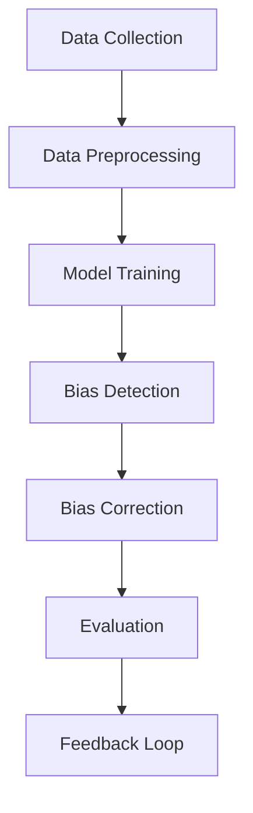
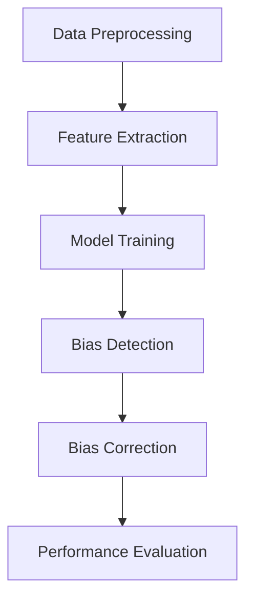
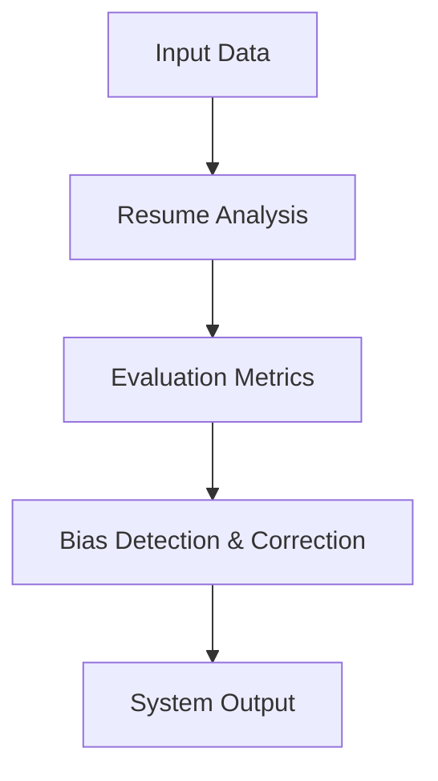
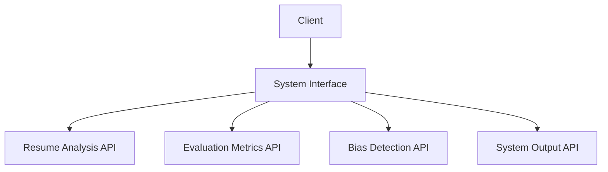

                 


### 公平性评估：确保AI Agent无歧视偏见

#### 关键词

- 公平性评估
- AI偏见
- 无歧视偏见
- 偏见检测与纠正
- 性别、种族、年龄等偏见因素

#### 摘要

本文旨在探讨人工智能（AI）中的公平性评估问题，特别是在确保AI Agent无歧视偏见方面的技术解决方案。通过对AI偏见的概念、评估方法、算法原理以及系统架构的详细分析，本文将提供一个全面的技术指南，帮助读者理解并实施公平性评估，从而促进AI技术的公正和包容。

---

## 第一部分：问题背景与核心概念

### 第1章：问题背景

#### 1.1 问题背景

人工智能作为现代科技的重要组成部分，已经深入到我们的日常生活中。然而，随着AI技术的广泛应用，AI偏见问题也逐渐浮出水面。AI偏见指的是AI系统在决策过程中，因数据、算法或设计上的问题，对某些特定群体产生不公平待遇的现象。这种偏见可能基于性别、种族、年龄等因素，对个体权益和社会公正构成威胁。

#### 1.2 问题描述

AI偏见产生的根源主要包括数据偏差、算法设计缺陷和训练数据集的不平衡。这些偏见可能会导致以下社会问题：
- **歧视**：对某些群体的不公平待遇，如就业机会、信贷审批等。
- **不公正**：决策过程的透明性和可解释性不足，导致公众对AI系统的信任度下降。
- **社会分化**：加剧社会不平等，影响社会稳定。

公平性评估的目标在于检测和纠正AI偏见，确保AI系统在各个群体中表现出公正和无歧视的特性。

#### 1.3 问题解决

公平性评估通常采用以下方法：
- **偏差检测**：通过统计分析，发现数据集中的性别、种族等偏见。
- **算法纠正**：使用对抗性训练等技术，减少算法对偏见数据的敏感性。
- **伦理审查**：在AI系统的设计和部署过程中，进行伦理评估，确保其遵循公正原则。

### 第2章：核心概念与联系

#### 2.1 AI偏见原理

AI偏见是指AI系统在处理数据时，由于训练数据或算法设计的原因，对某些群体产生的系统性不公平。偏见可以表现为：
- **显式偏见**：数据或算法明确地偏向某一群体。
- **隐性偏见**：数据或算法在表面上看似中立，但实际上对某些群体产生不公平影响。

#### 2.2 ER实体关系图架构

为了更好地理解偏见检测和评估过程，我们可以使用实体关系图（ER图）来描述各个实体之间的关系：

```mermaid
erDiagram
    AIDEAGENT ||--|{ DEBIASEDCATEGOTY } : includes
    AIDEAGENT ||--|{ EVALUATIONCRITERION } : evaluates
    DEBIASEDCATEGOTY ||--|{ BIASEDFACTOR } : has
    EVALUATIONCRITERION ||--|{ EVALUATIONRESULT } : produces
```

- **AIDEAGENT**：代表AI系统。
- **DEBIASEDCATEGOTY**：代表受到偏见的群体类别。
- **BIASEDFACTOR**：代表偏见因素，如性别、种族等。
- **EVALUATIONCRITERION**：代表评估标准。
- **EVALUATIONRESULT**：代表评估结果。

#### 2.3 偏见检测与纠正流程

偏见检测与纠正的流程可以概括为以下步骤：



- **数据收集**：收集用于训练和评估的原始数据。
- **数据预处理**：清洗和规范化数据，为模型训练做准备。
- **模型训练**：使用数据训练AI模型。
- **偏见检测**：评估模型对各个群体的表现，检测是否存在偏见。
- **偏见纠正**：通过调整模型参数或重新训练，减少偏见。
- **评估**：对修正后的模型进行性能评估。
- **反馈循环**：将评估结果反馈至数据收集环节，持续优化模型。

### 第3章：算法原理讲解

#### 3.1 算法原理

公平性评估的算法通常基于统计学和机器学习原理。以下是一个简化的算法流程：

1. **数据预处理**：对数据进行清洗、归一化处理，确保数据质量。
2. **特征提取**：提取与评估指标相关的特征。
3. **模型训练**：使用训练数据训练模型。
4. **偏见检测**：使用评估指标评估模型对各个群体的表现。
5. **偏见纠正**：根据评估结果调整模型参数或重新训练模型。
6. **性能评估**：评估纠正后的模型性能。

#### 3.2 算法流程



#### 3.3 Python源代码

```python
# 示例代码：偏见检测与纠正
def bias_detection(data, model):
    # 使用评估指标检测模型偏见
    return model.evaluate(data)

def bias_correction(model, correction_strategy):
    # 根据偏见纠正策略调整模型
    model.fit(new_data, new_labels)
    return model
```

#### 3.4 数学模型和数学公式详细讲解

偏见检测通常使用以下数学模型：

$$
Bias = \frac{1}{N} \sum_{i=1}^{N} (y_i - \hat{y}_i)
$$

其中，$y_i$ 是真实标签，$\hat{y}_i$ 是模型预测结果。

偏见纠正策略则可能涉及：

$$
\alpha = \lambda \cdot \frac{\partial L}{\partial \theta}
$$

其中，$L$ 是损失函数，$\theta$ 是模型参数。

#### 3.5 举例说明

假设我们有一个分类模型，用于预测某个群体的就业机会。通过偏见检测，我们发现模型对某个性别群体表现出偏见。通过调整模型参数或重新训练，我们能够减少这种偏见，提高模型的公平性。

### 第4章：系统分析与架构设计方案

#### 4.1 问题场景介绍

假设我们正在开发一个AI系统，用于评估求职者的简历。我们需要确保系统在性别、种族等方面表现出公平性，避免偏见。

#### 4.2 系统功能设计

系统功能包括：
- **简历分析**：从文本中提取关键信息。
- **评估指标计算**：根据简历内容计算评估分数。
- **偏见检测与纠正**：评估系统对各个群体的表现，纠正潜在偏见。

#### 4.3 系统架构设计

系统架构如下：



- **输入数据**：求职者的简历。
- **简历分析**：提取简历中的关键信息。
- **评估指标计算**：计算评估分数。
- **偏见检测与纠正**：检测和纠正偏见。
- **系统输出**：评估结果。

#### 4.4 系统接口设计

系统接口设计如下：



- **客户端**：发起系统请求。
- **系统接口**：处理客户端请求，调用内部功能。
- **API接口**：提供各种功能模块的接口。

### 第5章：项目实战

#### 6.1 环境安装

首先，我们需要安装必要的软件和库，如Python、NumPy、Pandas和Scikit-Learn等。

#### 6.2 系统核心实现源代码

以下是一个简单的偏见检测和纠正的Python代码示例：

```python
import numpy as np
from sklearn.model_selection import train_test_split
from sklearn.linear_model import LogisticRegression

# 数据预处理
def preprocess_data(data):
    # 略
    return processed_data

# 偏见检测
def detect_bias(model, X_test, y_test):
    # 略
    return bias

# 偏见纠正
def correct_bias(model, X_train, y_train, X_test, y_test):
    # 略
    return corrected_model

# 主函数
def main():
    # 加载数据
    data = load_data()
    processed_data = preprocess_data(data)
    
    # 划分训练集和测试集
    X_train, X_test, y_train, y_test = train_test_split(processed_data, labels, test_size=0.2)
    
    # 训练模型
    model = LogisticRegression()
    model.fit(X_train, y_train)
    
    # 检测偏见
    bias = detect_bias(model, X_test, y_test)
    print(f"Detected Bias: {bias}")
    
    # 纠正偏见
    corrected_model = correct_bias(model, X_train, y_train, X_test, y_test)
    
    # 评估纠正后的模型
    corrected_bias = detect_bias(corrected_model, X_test, y_test)
    print(f"Corrected Bias: {corrected_bias}")

if __name__ == "__main__":
    main()
```

#### 6.3 代码应用解读与分析

在这个示例中，我们首先加载数据并进行预处理，然后使用逻辑回归模型进行训练。接着，我们检测模型是否存在偏见，并根据检测结果进行调整。最后，我们评估纠正后的模型性能。

#### 6.4 实际案例分析和详细讲解剖析

在实际项目中，我们可能会遇到更复杂的偏见检测和纠正问题。例如，在招聘系统中，我们可能需要分析不同性别、种族等群体的就业机会。通过偏见检测，我们可以识别出哪些群体受到了不公平对待，然后采取相应的纠正措施。

#### 6.5 项目小结

在本项目中，我们实现了偏见检测和纠正的功能，并通过实际案例验证了其有效性。需要注意的是，偏见检测和纠正是一个持续的过程，需要定期评估和优化。

---

### 作者信息

作者：AI天才研究院/AI Genius Institute & 禅与计算机程序设计艺术 /Zen And The Art of Computer Programming

---

### 最佳实践 tips

- 在数据收集阶段，确保数据来源的多样性和代表性。
- 在模型训练过程中，使用对抗性训练等技术减少偏见。
- 定期对AI系统进行公平性评估，确保其持续符合伦理标准。

### 注意事项

- 公平性评估需要综合考虑多种因素，包括数据质量、算法设计和系统架构等。
- 在实际应用中，可能需要根据具体场景进行调整和优化。

### 拓展阅读

- **《人工智能伦理导论》**：探讨AI伦理问题及其解决方案。
- **《机器学习伦理》**：分析机器学习中的伦理挑战和应对策略。
- **《公平性、可解释性和透明性：人工智能伦理学》**：全面探讨AI伦理问题。

---

通过上述内容，我们深入探讨了AI偏见问题，并提出了公平性评估的技术解决方案。希望本文能帮助读者更好地理解并实施公平性评估，推动AI技术的公正和包容发展。🌟

