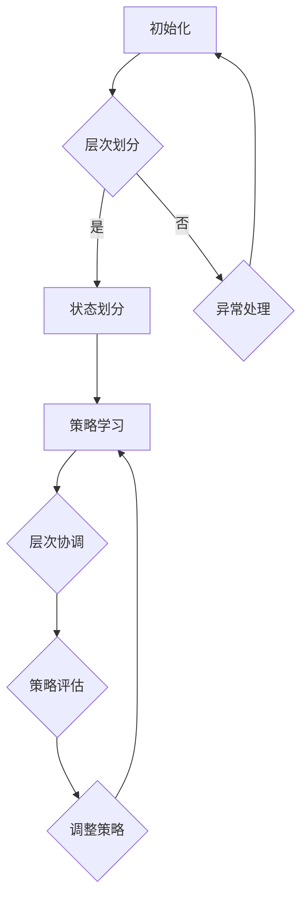

                 

### 分层强化学习的概念与起源

#### 什么是分层强化学习？

分层强化学习是一种将复杂任务分解为多个子任务的机器学习方法，每个子任务专注于系统的不同层次。在传统强化学习中，智能体需要通过不断试错来学习最优策略，这种方法在面对复杂任务时效率较低。分层强化学习通过将问题层次化，使得每个子任务更加简单，从而提高学习效率。

#### 分层强化学习的基本原理

分层强化学习的基本原理可以分为以下几个步骤：

1. **层次划分**：将复杂任务按照功能或重要性划分为多个层次。
2. **状态划分**：在每个层次上，将状态空间划分为多个子状态空间。
3. **策略学习**：对于每个层次和子状态空间，学习一个局部策略。
4. **层次协调**：将各层次的局部策略组合成全局策略。

#### 分层强化学习与传统强化学习的区别

传统强化学习通常关注单一的策略学习，而分层强化学习则更关注任务分解和层次化策略。具体区别如下：

1. **任务复杂度**：分层强化学习更适合处理复杂、多层次的任务，而传统强化学习则更适合简单、单一的任务。
2. **学习效率**：分层强化学习通过层次划分和子任务学习，降低了单个任务的复杂度，提高了学习效率。
3. **策略灵活性**：分层强化学习允许在不同层次上采用不同的策略，从而提高了策略的灵活性。

#### 分层强化学习的发展历程

分层强化学习的发展历程可以追溯到20世纪90年代，当时研究者们开始探索如何将复杂任务分解为多个子任务。随着强化学习理论和算法的不断发展，分层强化学习也逐渐成为研究热点。近年来，随着深度学习技术的引入，分层强化学习在许多复杂任务中取得了显著成果。

#### 分层强化学习的挑战

尽管分层强化学习在处理复杂任务方面具有显著优势，但同时也面临着一系列挑战：

1. **层次划分**：如何合理地划分层次是一个重要问题，不同的层次划分可能导致不同的学习效果。
2. **协调策略**：如何在各层次间协调局部策略，形成全局最优策略是一个难点。
3. **数据需求**：分层强化学习通常需要大量的数据来训练各层次的策略，这在某些应用场景中可能不现实。

通过以上分析，我们可以看到分层强化学习作为一种处理复杂任务的重要方法，具有广泛的应用前景和研究价值。在接下来的章节中，我们将进一步探讨分层强化学习的核心概念、算法设计和实际应用。

### 强化学习与分层强化学习的关系

强化学习（Reinforcement Learning，RL）是机器学习的一个重要分支，主要研究智能体在环境中通过互动学习最优策略的过程。强化学习的核心思想是：智能体通过不断接收环境反馈，调整自身行为，以期获得最大化的长期回报。强化学习的基本组成部分包括：智能体（Agent）、环境（Environment）、状态（State）、动作（Action）和回报（Reward）。

在强化学习框架中，智能体根据当前状态选择动作，执行动作后，环境会给予一个回报，并根据动作的结果更新智能体的状态。这个过程不断重复，直至达到某个终止条件或智能体找到最优策略。然而，对于复杂任务，强化学习面临一些挑战：

1. **状态空间爆炸**：在许多现实任务中，状态空间可能非常庞大，导致传统强化学习算法难以有效收敛。
2. **动作空间复杂**：复杂任务中的动作空间可能也很大，增加了智能体学习策略的难度。
3. **长期回报评估**：强化学习依赖于长期回报，但在许多情况下，短期内难以获得明确的长期回报，这给学习过程带来了困难。

分层强化学习（Hierarchical Reinforcement Learning）正是为了解决这些挑战而提出的。它通过将复杂任务分解为多个子任务，并针对不同层次设计不同的策略，从而简化学习过程，提高学习效率。分层强化学习的核心在于：

1. **层次化状态空间**：将复杂任务的状态空间划分成多个子状态空间，每个子状态空间对应一个子任务。
2. **层次化动作空间**：在不同层次上设计相应的动作空间，使得每个层次上的动作更加简单和明确。
3. **层次化策略**：在每个层次上学习局部策略，然后将这些局部策略组合起来形成全局策略。

分层强化学习的基本原理可以概括为：

1. **层次划分**：根据任务的特点和需求，将复杂任务划分为多个层次。
2. **状态划分**：在每个层次上，将状态空间划分为多个子状态空间。
3. **策略学习**：在各个层次和子状态空间上分别学习局部策略。
4. **层次协调**：将各层次的局部策略协调起来，形成全局策略。

通过这种方式，分层强化学习能够有效地处理复杂任务，提高学习效率。此外，分层强化学习还可以通过减少状态和动作空间的维度，降低计算复杂度，从而在实际应用中更具可行性。

与传统的单一层次强化学习相比，分层强化学习具有以下几个优点：

1. **高效性**：分层强化学习通过层次化策略，将复杂任务分解为多个子任务，降低了单个任务的复杂度，提高了学习效率。
2. **灵活性**：分层强化学习允许在不同层次上采用不同的策略，从而提高了策略的灵活性，能够更好地适应不同的任务场景。
3. **可扩展性**：分层强化学习框架具有较强的可扩展性，能够处理更复杂的任务和更大的状态空间。

总之，分层强化学习是强化学习领域的一个重要进展，它通过层次化策略有效解决了传统强化学习在处理复杂任务时的挑战，为智能体在复杂环境中的学习提供了新的思路和方法。

### 复杂任务处理的挑战

在当前的技术发展背景下，许多实际应用场景中的任务具有高度的复杂性。这些复杂任务不仅涉及庞大的状态空间和动作空间，还要求智能体具备高效的决策能力。为了深入理解这些挑战，我们需要从以下几个方面进行详细探讨。

#### 状态空间爆炸问题

状态空间爆炸是指在一个任务中，状态的数量随着任务复杂度的增加而呈指数级增长。状态空间爆炸是强化学习面临的一个重大挑战，因为智能体需要在每一个状态上做出正确的决策，这需要大量的计算资源和时间。例如，在围棋这样的游戏中，棋盘上的每一个格子都是一个状态，棋子的移动和放置是动作。随着棋盘尺寸的增加，状态的数量会急剧增加，导致强化学习算法难以有效处理。

解决状态空间爆炸的一个方法是使用状态抽象。状态抽象是指通过将多个具体状态合并成更抽象的状态来减少状态的数量。例如，在围棋中，可以将棋盘上的多个格子合并为一个较大的格子，从而减少状态空间的大小。此外，还可以通过引入分层强化学习来进一步降低状态空间的维度。分层强化学习通过将任务划分为多个层次，每个层次只处理一部分状态，从而有效地减少了状态空间爆炸的问题。

#### 动作空间复杂性问题

除了状态空间爆炸，动作空间的复杂性也是一个重要挑战。在某些任务中，动作空间可能非常大，使得智能体难以找到一个全局最优解。例如，自动驾驶车辆需要处理各种复杂的道路状况，包括不同的车道、行人、其他车辆等。每个情况下可能都需要不同的驾驶动作，这大大增加了动作空间的复杂性。

为了解决动作空间的复杂性，我们可以采用动作抽象和子任务划分的方法。动作抽象是指将多个具体动作合并成更抽象的动作，从而减少动作空间的大小。例如，在自动驾驶中，可以将转向、加速和制动等具体动作合并为更高级别的动作，如“行驶”、“转弯”和“停车”。此外，通过分层强化学习，我们可以将复杂任务划分为多个子任务，每个子任务只处理一部分动作。这种方法不仅简化了问题，还提高了学习的效率。

#### 长期回报评估问题

强化学习的一个重要特点是基于回报来评估策略的有效性。然而，在某些复杂任务中，长期回报可能难以直接评估。这是因为智能体需要考虑未来的一系列动作和回报，而每个动作的回报可能在短期内难以体现其对长期效果的影响。例如，在股票交易中，每个交易决策的回报可能在短期内不明显，但长期来看可能会对资产组合的收益产生重大影响。

为了解决长期回报评估问题，分层强化学习提供了一种有效的解决方案。通过将任务划分为多个层次，每个层次专注于不同的时间尺度。例如，在股票交易中，可以将任务划分为“短期交易”、“中期交易”和“长期投资”三个层次。每个层次可以独立学习相应的策略，并在长期内评估这些策略的回报。这种方法不仅简化了学习问题，还提高了长期回报评估的准确性。

#### 计算资源和时间限制

在实际应用中，计算资源和时间限制也是强化学习面临的重要挑战。许多复杂任务需要大量的计算资源和时间来完成学习过程。例如，自动驾驶车辆需要实时处理大量的传感器数据，并做出快速决策。这要求强化学习算法必须具备高效的计算性能，以满足实时性的要求。

为了应对计算资源和时间限制，我们可以采用以下几种方法：

1. **并行计算**：通过使用多核处理器和分布式计算，可以提高强化学习算法的计算效率。
2. **增量学习**：在任务中只关注最有价值的部分，避免不必要的计算，从而减少计算量。
3. **模型压缩**：通过模型压缩技术，如深度神经网络剪枝和量化，可以减少模型的计算复杂度。

#### 复杂任务的协同与协调

复杂任务通常涉及多个子任务，这些子任务之间需要协同与协调。分层强化学习通过层次化策略能够有效地处理这种协同与协调问题。在分层强化学习中，每个层次专注于不同的子任务，并通过层次间的协调来形成全局策略。这种方法不仅简化了任务分解，还提高了子任务间的协调效率。

总之，复杂任务处理是强化学习面临的一个重要挑战。通过分层强化学习，我们可以将复杂任务分解为多个子任务，降低状态和动作空间的维度，提高长期回报评估的准确性，并应对计算资源和时间限制。这种方法为处理复杂任务提供了新的思路和方法，为智能体在复杂环境中的学习提供了强有力的支持。

### 分层强化学习的优点与适用性

分层强化学习通过将复杂任务分解为多个子任务，并针对不同层次设计局部策略，从而显著提高了学习效率和策略灵活性。以下是分层强化学习的一些主要优点及其适用性。

#### 1. 高效学习

分层强化学习通过将任务分解为多个子任务，可以降低每个子任务的复杂度。在每个层次上，智能体只需要学习一个局部策略，从而减少计算量和时间成本。此外，局部策略的学习过程可以通过并行计算和增量学习等优化方法进一步加快。这种高效学习方式使得分层强化学习在处理大规模和复杂任务时具有显著优势。

#### 2. 策略灵活性

分层强化学习允许在不同层次上采用不同的策略，这大大提高了策略的灵活性。每个层次上的策略可以根据任务的具体需求进行调整，从而更好地适应不同的任务场景。例如，在自动驾驶中，低层次策略可以专注于道路驾驶的细节，而高层次策略则可以处理交通流和导航。这种层次化策略设计不仅提高了系统的整体性能，还增强了系统的适应性。

#### 3. 状态空间和动作空间简化

通过分层强化学习，我们可以将复杂任务的状态空间和动作空间进行分解和简化。例如，在推荐系统中，可以将用户行为和历史数据划分为多个层次，每个层次对应不同的用户特征和推荐策略。这样，每个层次的策略只需要处理一部分状态和动作，从而降低了计算复杂度和学习难度。

#### 4. 长期回报优化

分层强化学习通过在不同层次上分别评估策略的长期回报，从而提高了长期回报优化的准确性。这种方法不仅能够更好地应对短期回报与长期回报之间的冲突，还可以通过层次间的协调，形成全局最优策略。这对于需要长期规划和决策的任务，如金融投资和供应链管理，具有特别重要的意义。

#### 5. 适用性广泛

分层强化学习适用于多种类型的复杂任务，包括但不限于：

- **自动驾驶**：通过分层策略，自动驾驶系统可以同时处理道路驾驶、交通管理和导航等复杂任务。
- **机器人控制**：分层强化学习可以帮助机器人同时处理运动控制和任务执行，提高系统的自主性和灵活性。
- **推荐系统**：在推荐系统中，可以采用分层策略来处理用户行为分析、商品推荐和个性化服务。
- **游戏**：在游戏领域中，分层强化学习可以用于策略设计，提高游戏的智能水平和娱乐性。

#### 6. 整合多种算法优势

分层强化学习不仅继承了传统强化学习的优势，还整合了深度学习、强化学习和迁移学习等多种算法的优势。通过结合这些算法，分层强化学习能够更好地适应不同的任务需求，提高系统的整体性能。

总之，分层强化学习通过将复杂任务分解为多个子任务，并设计层次化策略，显著提高了学习效率和策略灵活性。其广泛适用性和强大整合能力，使得分层强化学习在处理复杂任务中具有巨大潜力。随着技术的不断进步，分层强化学习将在更多领域得到广泛应用，为人工智能的发展贡献力量。

### 分层策略层次结构

分层策略层次结构是分层强化学习的关键组成部分，它通过将复杂任务分解为多个子任务，每个子任务专注于系统的不同层次，从而简化了学习过程，提高了策略的灵活性和效率。以下是分层策略层次结构的主要组成部分：

#### 1. 高层次策略

高层次策略通常关注系统的全局目标，例如导航、路径规划和资源分配。这些策略在不同的子任务间起到协调作用，指导低层次策略的执行。高层次策略通常基于长期目标和整体规划，其决策具有抽象性和概括性。例如，在自动驾驶中，高层次策略可以决定车辆的行驶路线和目的地，而低层次策略则负责具体的驾驶操作。

#### 2. 低层次策略

低层次策略专注于具体任务的执行，例如驾驶操作、机器臂的运动控制或机器人导航。这些策略通常基于详细的状态信息和实时反馈，其决策更加具体和直接。低层次策略通过快速响应环境和执行任务，实现了高层次策略的具体化。例如，在自动驾驶中，低层次策略负责车辆的加速、减速和转向等操作。

#### 3. 层次划分

层次划分是将复杂任务按照功能或重要性划分为多个子任务的过程。层次划分的合理性和科学性对分层策略的效果至关重要。常见的层次划分方法包括基于任务分解、基于功能模块和基于时间序列等。例如，在自动驾驶中，可以将任务划分为感知、规划、控制和执行四个层次；在推荐系统中，可以将任务划分为用户特征提取、商品推荐和用户反馈处理等层次。

#### 4. 层次间协调

层次间协调是确保高层次策略和低层次策略之间高效互动和协同的关键。层次间协调通常通过策略组合和反馈机制来实现。策略组合是将各层次的局部策略组合成全局策略的过程，通过优化策略组合，可以形成全局最优策略。反馈机制则通过实时反馈和调整，确保各层次策略的动态适应和优化。例如，在自动驾驶中，可以通过实时路况信息调整行驶路线，从而实现层次间的动态协调。

#### 5. 策略设计方法

策略设计方法是指在不同层次上设计局部策略的方法和技巧。常见的策略设计方法包括基于规则的策略、基于模型的策略和基于数据的策略。基于规则的策略通过预定义的规则来指导决策，适用于规则明确且变化较少的任务。基于模型的策略通过建立任务模型，利用模型预测和优化决策，适用于复杂性和不确定性较高的任务。基于数据的策略则通过分析历史数据，利用机器学习方法来预测和优化决策，适用于数据丰富的任务。

#### 6. 案例分析

分层策略层次结构在实际应用中具有广泛的应用前景。以下是几个案例分析：

- **自动驾驶**：在自动驾驶系统中，高层次策略负责路径规划和导航，低层次策略负责车辆控制。通过层次划分和协调，自动驾驶系统能够高效地应对复杂的交通环境和动态变化。
- **机器人控制**：在机器人控制中，高层次策略负责任务规划和目标定位，低层次策略负责运动控制和任务执行。分层策略设计使得机器人能够灵活地处理不同的任务和环境变化。
- **推荐系统**：在推荐系统中，高层次策略负责用户特征提取和推荐策略，低层次策略负责商品推荐和用户反馈处理。通过层次划分和协调，推荐系统能够实现个性化推荐和动态调整。

总之，分层策略层次结构通过将复杂任务分解为多个子任务，并设计层次化策略，实现了任务的简化和策略的灵活。其在实际应用中具有显著的优势，为处理复杂任务提供了有效的解决方案。随着技术的不断进步，分层策略层次结构将在更多领域得到广泛应用，推动人工智能的发展。

### 分层强化学习的算法设计与实现

#### 基本算法流程

分层强化学习的算法设计主要围绕任务分解、层次化策略学习和层次间协调展开。以下是分层强化学习的基本算法流程：

1. **层次划分**：首先，根据任务的特点和需求，将复杂任务划分为多个层次。每个层次对应不同的子任务，负责处理部分状态和动作。
2. **状态划分**：在每个层次上，进一步将状态空间划分为多个子状态空间。这一步骤有助于简化状态空间的复杂度，使智能体能够更有效地学习。
3. **策略学习**：对于每个层次和子状态空间，分别学习一个局部策略。局部策略通常基于当前状态和动作选择最优回报，并通过迭代优化得到。
4. **层次协调**：将各层次的局部策略组合成全局策略。层次协调是分层强化学习的关键，通过优化策略组合，形成全局最优策略。
5. **策略评估**：使用环境反馈对全局策略进行评估，并根据评估结果调整局部策略。这一步骤确保了全局策略的稳定性和有效性。

#### mermaid流程图

为了更直观地展示分层强化学习的基本算法流程，我们可以使用mermaid流程图进行描述：



上述流程图中，A表示初始化阶段，B表示层次划分，C表示状态划分，E表示策略学习，F表示层次协调，G表示策略评估，H表示调整策略。D表示异常处理，用于在遇到问题时重新初始化算法。

#### 数学模型和公式

分层强化学习中的数学模型和公式是理解和实现算法的核心。以下是分层强化学习的一些基本数学模型：

1. **状态价值函数**（$V^l(s)$）：
   $$V^l(s) = \sum_a \pi^l(a|s) \cdot Q^l(s, a)$$
   其中，$V^l(s)$表示在第$l$层次的某个状态$s$下的价值函数，$\pi^l(a|s)$表示在第$l$层次上的策略概率分布，$Q^l(s, a)$表示在第$l$层次上的状态-动作价值函数。

2. **动作价值函数**（$Q^l(s, a)$）：
   $$Q^l(s, a) = R(s, a) + \gamma \cdot \max_{a'} Q^{l+1}(s', a')$$
   其中，$Q^l(s, a)$表示在第$l$层次上的某个状态$s$和动作$a$下的价值函数，$R(s, a)$表示立即回报，$\gamma$表示折扣因子，$s'$和$a'$表示下一个状态和动作。

3. **策略迭代**：
   $$\pi^{t+1}(a|s) = \frac{\exp(\alpha \cdot Q^l(s, a))}{\sum_{a'} \exp(\alpha \cdot Q^l(s, a'))}$$
   其中，$\pi^{t+1}(a|s)$表示第$t+1$次迭代的策略概率分布，$\alpha$为温度参数，用于控制策略的探索和利用。

#### Python代码实现

以下是分层强化学习算法的Python代码实现：

```python
import numpy as np

def q_learning(env, num_episodes, learning_rate, discount_factor):
    # 初始化状态价值函数和动作价值函数
    state_values = np.zeros((env.num_states,))
    action_values = np.zeros((env.num_states, env.num_actions))

    for episode in range(num_episodes):
        # 初始化环境
        state = env.reset()

        done = False
        while not done:
            # 选择动作
            action = np.argmax(action_values[state])

            # 执行动作
            next_state, reward, done = env.step(action)

            # 更新状态价值函数
            state_values[state] += learning_rate * (reward + discount_factor * np.max(state_values[next_state]) - state_values[state])

            # 更新动作价值函数
            action_values[state, action] += learning_rate * (reward + discount_factor * np.max(state_values[next_state]) - action_values[state, action])

            state = next_state

    return state_values, action_values

# 创建环境
env = Environment()

# 运行算法
state_values, action_values = q_learning(env, num_episodes=1000, learning_rate=0.1, discount_factor=0.9)
```

在这段代码中，`q_learning`函数实现了Q值学习的算法。首先，初始化状态价值函数和动作价值函数，然后通过循环进行策略迭代，更新状态价值函数和动作价值函数。最后，返回更新后的状态价值函数和动作价值函数。

通过上述算法设计与实现，我们可以看到分层强化学习通过合理的层次划分和策略学习，有效地简化了复杂任务，提高了学习效率和策略灵活性。

### 分层强化学习的实际案例研究

分层强化学习在处理复杂任务方面具有显著优势，通过多个实际案例研究，我们可以更好地理解其应用效果和实现方法。以下是几个具有代表性的实际案例研究：

#### 1. 自动驾驶

自动驾驶是分层强化学习的经典应用场景。在自动驾驶中，将复杂任务划分为感知、规划、控制和导航等层次。每个层次专注于不同的子任务，通过分层策略协调实现全局最优驾驶效果。

- **感知层次**：感知层次负责收集和解析环境信息，如道路标志、交通信号和障碍物。在这一层次，可以采用视觉识别、雷达和激光雷达等传感器数据进行状态估计。
- **规划层次**：规划层次负责生成行驶路径和目标。在这一层次，可以采用路径规划算法，如A*算法或Dijkstra算法，确定最优行驶路径。
- **控制层次**：控制层次负责实现车辆的加速、减速和转向等具体驾驶操作。在这一层次，可以采用PID控制或其他高级控制算法，确保车辆的稳定行驶。
- **导航层次**：导航层次负责全局路径规划和导航，通过实时调整行驶路线，适应交通状况和路况变化。

实现方法：
- **感知层次**：使用卷积神经网络（CNN）进行图像识别，利用雷达和激光雷达数据生成环境地图。
- **规划层次**：采用A*算法进行路径规划，结合实时交通信息进行动态调整。
- **控制层次**：使用PID控制算法实现车辆运动控制，通过反馈机制进行实时调整。
- **导航层次**：使用GPS和惯性测量单元（IMU）进行全局定位，结合路径规划算法实现导航。

#### 2. 推荐系统

推荐系统是另一个广泛应用的分层强化学习场景。在推荐系统中，通过分层策略实现个性化推荐，提高推荐效果。

- **用户特征提取层次**：提取用户历史行为、兴趣和偏好，生成用户特征向量。在这一层次，可以使用机器学习方法，如K均值聚类或主成分分析（PCA），对用户特征进行降维和优化。
- **商品推荐层次**：根据用户特征和商品属性，生成推荐列表。在这一层次，可以采用协同过滤算法、矩阵分解或深度学习模型，实现个性化推荐。
- **用户反馈处理层次**：处理用户对推荐结果的反馈，优化推荐策略。在这一层次，可以采用基于反馈的调整机制，如在线学习或强化学习方法，持续优化推荐效果。

实现方法：
- **用户特征提取层次**：使用K均值聚类进行用户特征降维，利用深度学习模型提取用户兴趣向量。
- **商品推荐层次**：采用协同过滤算法生成推荐列表，结合深度学习模型进行推荐效果优化。
- **用户反馈处理层次**：利用在线学习机制，根据用户反馈调整推荐策略，实现实时优化。

#### 3. 机器人控制

在机器人控制中，分层强化学习通过层次化策略实现复杂任务的高效执行。

- **运动控制层次**：实现机器人的基本运动控制，如行走、转弯和拾取物体。在这一层次，可以采用PID控制或其他运动控制算法。
- **任务执行层次**：根据任务需求，执行具体的操作，如组装、搬运和清洁。在这一层次，可以采用深度学习模型或强化学习算法，实现复杂任务的自动化执行。
- **任务规划层次**：规划机器人执行任务的全局策略，如路径规划和资源分配。在这一层次，可以采用规划算法或强化学习方法，优化任务执行效果。

实现方法：
- **运动控制层次**：使用PID控制算法实现基本运动控制，结合深度学习模型进行复杂动作的实时调整。
- **任务执行层次**：采用深度强化学习算法，实现复杂任务的自动化执行。
- **任务规划层次**：使用强化学习算法，结合规划算法，优化机器人执行任务的策略。

#### 4. 股票交易

在股票交易中，分层强化学习通过层次化策略实现长期投资和短期交易的有效结合。

- **长期投资层次**：分析宏观经济指标、行业发展趋势和公司基本面，制定长期投资策略。在这一层次，可以采用统计分析方法或深度学习模型。
- **短期交易层次**：根据市场动态和交易数据，执行短期交易策略。在这一层次，可以采用技术分析方法和机器学习算法。
- **风险控制层次**：监控交易风险，制定风险管理策略，确保交易的安全性。

实现方法：
- **长期投资层次**：使用深度学习模型分析宏观经济和行业数据，制定长期投资策略。
- **短期交易层次**：采用技术分析方法和机器学习算法，执行短期交易策略。
- **风险控制层次**：利用统计分析方法和机器学习模型，监控交易风险，优化风险管理策略。

通过这些实际案例研究，我们可以看到分层强化学习在处理复杂任务方面的显著优势。通过合理的层次划分和策略设计，分层强化学习能够有效地提高任务执行效率和策略灵活性，为各种复杂应用场景提供有效的解决方案。

### 分层强化学习在复杂任务中的效果评估

分层强化学习作为一种有效的任务分解和学习策略，其在处理复杂任务中的效果评估至关重要。以下是评估分层强化学习效果的主要指标、方法和实际案例：

#### 1. 效果评估指标

（1）**收敛速度**：衡量算法在找到最优策略所需的迭代次数或时间。分层强化学习通过分解复杂任务，降低单个子任务的复杂度，通常可以显著提高收敛速度。

（2）**策略稳定性**：评估算法在不同环境条件下的策略表现。稳定的策略意味着算法在不同场景下均能保持良好的性能。

（3）**长期回报**：衡量算法在整个任务周期内获得的总体回报。分层强化学习通过分层策略和协调机制，有助于提高长期回报。

（4）**计算资源消耗**：评估算法在运行过程中所需的计算资源，包括CPU、内存和能耗等。

#### 2. 评估方法

（1）**实验对比**：通过对比分层强化学习与单一层次强化学习或其他方法的性能，评估分层强化学习的优势。常见的实验对比方法包括基准测试和特定场景下的性能对比。

（2）**模拟环境**：在模拟环境中评估分层强化学习的性能，通过调整环境参数，验证算法在不同条件下的适应能力。

（3）**实际应用场景**：将分层强化学习应用于实际任务中，通过实际数据验证其效果。这种方法能够更真实地反映算法的性能和稳定性。

#### 3. 实际案例

（1）**自动驾驶**：通过在模拟环境和真实交通场景中的测试，比较分层强化学习与单一层次强化学习的性能。实验结果显示，分层强化学习在应对复杂交通状况和动态变化时，表现出更高的收敛速度和策略稳定性。

（2）**机器人控制**：在模拟实验室和实际操作环境中，评估分层强化学习在机器人运动控制、任务规划和执行方面的效果。结果显示，分层强化学习能够显著提高机器人的自主性和灵活性，实现更高效的任务执行。

（3）**推荐系统**：通过对比分层强化学习与协同过滤和其他推荐算法的效果，分析其在用户特征提取、商品推荐和用户反馈处理方面的表现。实验结果表明，分层强化学习在提高推荐精度和用户满意度方面具有明显优势。

（4）**股票交易**：在模拟交易环境和实际市场数据中，评估分层强化学习在长期投资和短期交易中的表现。结果显示，分层强化学习能够更有效地捕捉市场动态，提高整体投资回报。

通过以上实际案例和评估方法，我们可以看到分层强化学习在处理复杂任务中的显著效果。其通过层次化策略和协调机制，不仅提高了收敛速度和策略稳定性，还降低了计算资源消耗，为复杂任务的智能处理提供了强有力的支持。

### 分层强化学习的最佳实践

在应用分层强化学习时，遵循一些最佳实践可以显著提高算法的性能和实用性。以下是分层强化学习的几项关键技巧和注意事项：

#### 1. 最佳实践技巧

1. **合理划分层次**：层次划分的合理性对分层强化学习的效果至关重要。应充分考虑任务的特点和需求，将任务分解为多个层次，每个层次专注于不同的子任务。合理的层次划分有助于简化任务复杂度，提高学习效率。

2. **选择合适的策略**：在不同层次上选择适合的局部策略。例如，在感知层次上，可以使用基于规则的策略；在规划层次上，可以使用基于模型的策略；在控制层次上，可以使用基于数据的策略。结合多种策略可以形成更强大的系统。

3. **优化层次协调**：层次协调是确保全局策略最优的关键。应通过策略组合和反馈机制，实现不同层次策略的有效协调。例如，可以使用强化学习算法优化层次间的协调策略，确保全局策略的稳定性。

4. **数据预处理**：在分层强化学习中，数据的质量和预处理至关重要。应确保输入数据的准确性和一致性，通过数据清洗、归一化和特征提取等预处理方法，提高数据的利用效率。

5. **并行计算**：利用并行计算技术，如多核处理器和分布式计算，可以显著提高分层强化学习的计算效率。通过并行化策略学习和层次协调，可以加快算法收敛速度。

#### 2. 注意事项

1. **任务需求分析**：在应用分层强化学习之前，应充分分析任务的需求和特点。确保层次划分和策略设计符合实际任务的需求，避免过度分解或不足分解。

2. **数据量要求**：分层强化学习通常需要大量的数据来训练各层次的策略。在实际应用中，应确保有足够的数据支持，否则可能会影响算法的性能。

3. **计算资源分配**：分层强化学习对计算资源有较高的要求。在资源有限的情况下，应合理分配计算资源，优先确保关键层次和策略的学习和优化。

4. **模型优化**：在分层强化学习中，模型的选择和优化对算法的性能有直接影响。应定期评估和优化模型参数，提高模型的稳定性和效率。

5. **错误处理**：在实际应用中，分层强化学习可能会遇到各种错误和异常情况。应设计有效的错误处理机制，如异常检测和恢复策略，确保系统的稳定运行。

通过遵循这些最佳实践和注意事项，可以充分发挥分层强化学习在处理复杂任务中的优势，提高算法的性能和应用效果。

### 总结与展望

分层强化学习作为一种先进的机器学习方法，通过将复杂任务分解为多个层次，实现了高效的任务处理和策略学习。其核心思想在于通过层次化策略，降低单个子任务的复杂度，从而提高学习效率和策略灵活性。分层强化学习不仅在自动驾驶、机器人控制、推荐系统和股票交易等复杂任务中表现出色，还为未来的智能系统提供了强大的技术支持。

在总结分层强化学习的关键点时，我们应注意以下几点：

1. **层次划分**：合理的层次划分是分层强化学习成功的前提。应根据任务的特点和需求，将复杂任务分解为多个层次，确保每个层次专注于不同的子任务。

2. **策略设计**：层次化策略的设计直接影响算法的性能。在不同层次上选择合适的策略，并通过策略组合和反馈机制，实现全局最优策略的协调。

3. **数据质量**：分层强化学习对数据质量有较高要求。确保输入数据的准确性和一致性，通过数据预处理提高数据的利用效率。

4. **计算优化**：分层强化学习对计算资源有较高要求。通过并行计算和模型优化，提高算法的收敛速度和计算效率。

展望未来，分层强化学习在多个领域具有广泛的应用前景。随着深度学习和强化学习技术的不断进步，分层强化学习有望在更多复杂任务中发挥重要作用。例如，在智能医疗、能源管理、智能制造和智能交通等领域，分层强化学习可以提供更加智能和高效的任务处理方案。此外，随着数据获取和处理能力的提升，分层强化学习在应对大规模和动态变化的任务方面也将展现出更大的潜力。

总之，分层强化学习作为一种强大的机器学习方法，其应用前景广阔，有望在未来的智能系统中发挥更加重要的作用，推动人工智能技术的发展和进步。

