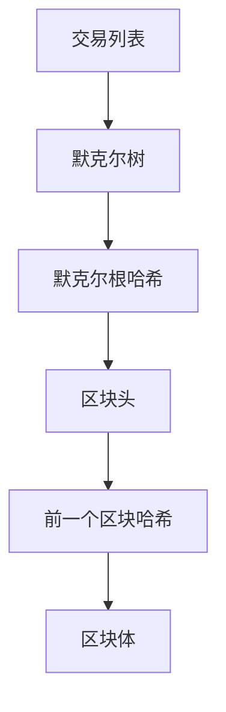
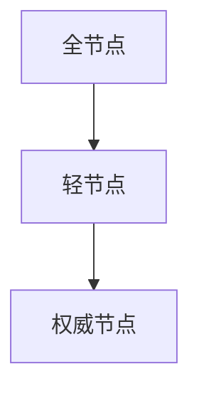
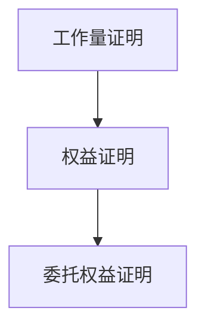
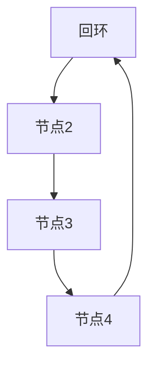
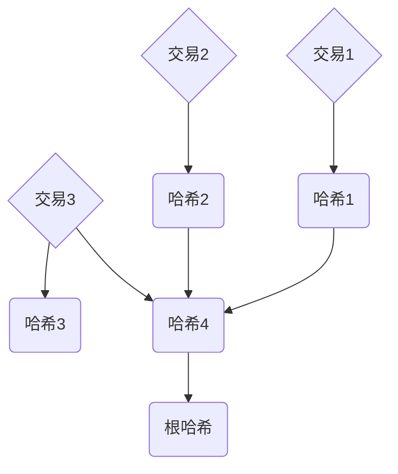
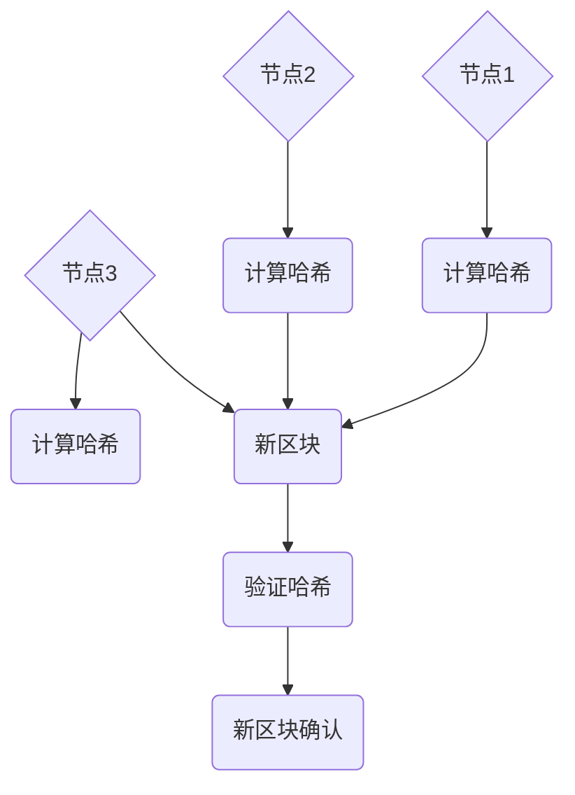
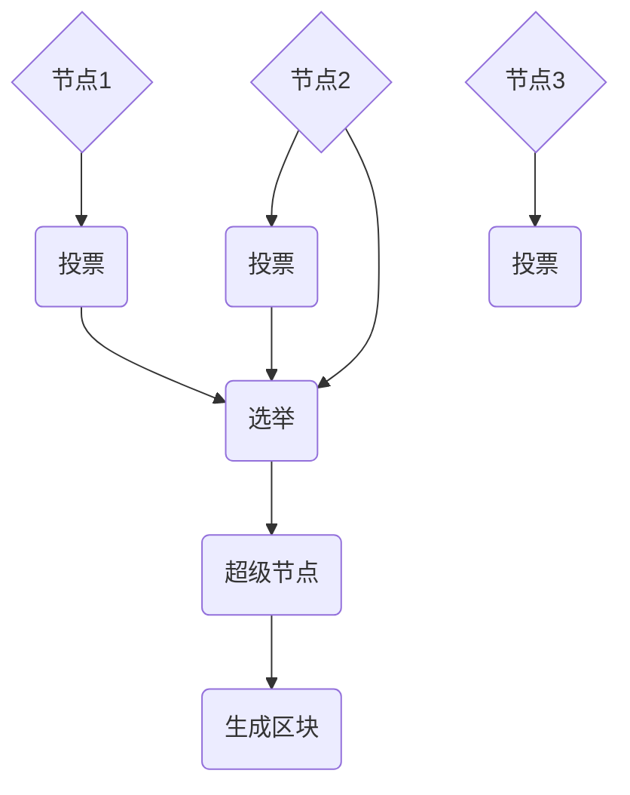
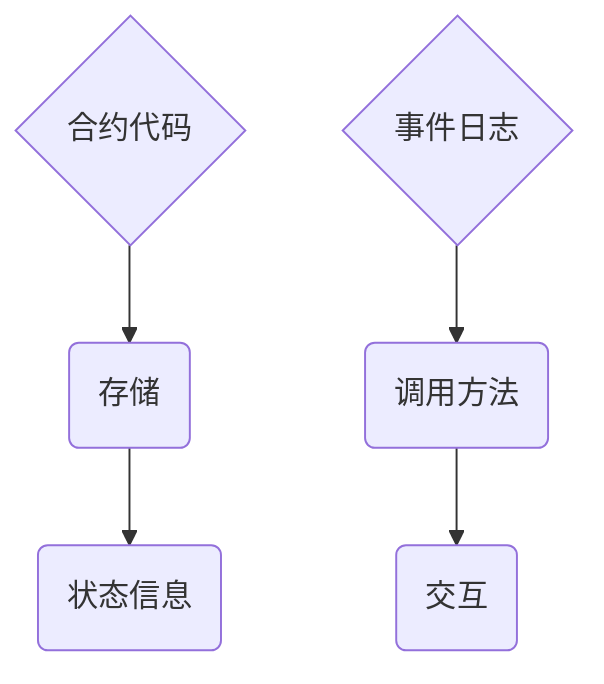
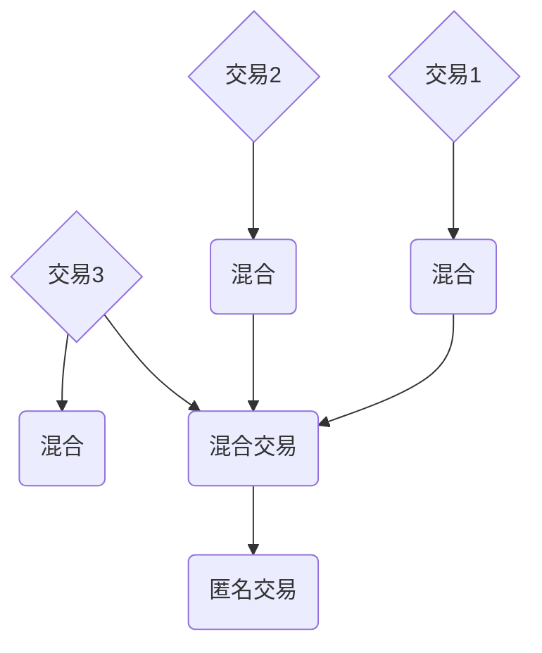

                 

### 分布式账本技术（DLT）在金融领域的应用

随着区块链技术的不断发展，分布式账本技术（Distributed Ledger Technology，简称DLT）在金融领域的应用日益广泛。DLT以其去中心化、不可篡改、透明度高、安全性强等特性，为金融行业带来了全新的变革和创新。本文将详细探讨DLT在金融领域的应用，包括其基本概念、核心组成部分、应用场景、优势与挑战、关键技术以及案例研究等。

#### 关键词
- **分布式账本技术（DLT）**
- **金融领域应用**
- **去中心化**
- **不可篡改性**
- **共识算法**
- **数字货币**
- **跨境支付**

#### 摘要
本文首先介绍了分布式账本技术的基本概念和核心组成部分，包括区块链、节点、共识算法和分布式账本网络。接着，探讨了DLT在金融领域的多种应用场景，如跨境支付、数字货币、融资和借贷、保险与理赔等。随后，分析了DLT在金融领域的优势与挑战，重点讨论了其关键技术，如加密算法、共识机制、智能合约和隐私保护技术。最后，通过案例研究，深入探讨了比特币、R3 Corda和Ethereum等DLT在金融领域的实际应用，并对DLT的安全性和监管问题进行了分析。文章结尾，对DLT在中国金融领域的应用现状与未来展望进行了探讨。

#### 目录大纲

## 目录大纲

----------------------------------------------------------------
# 分布式账本技术（DLT）在金融领域的应用

## 第一部分：分布式账本技术（DLT）概述

### 第1章：分布式账本技术基础

### 第2章：DLT的组成部分

### 第3章：DLT在金融领域的应用场景

## 第二部分：DLT在金融领域的优势与挑战

### 第4章：DLT在金融领域的优势

### 第5章：DLT在金融领域的挑战

### 第6章：DLT的未来发展趋势

## 第三部分：DLT的关键技术

### 第7章：加密算法

### 第8章：共识机制

### 第9章：智能合约

### 第10章：隐私保护技术

## 第四部分：DLT案例研究

### 第11章：比特币：首个成功的DLT应用

### 第12章：R3 Corda：金融行业的DLT解决方案

### 第13章：Ethereum：去中心化应用的平台

## 第五部分：DLT的安全性与监管

### 第14章：DLT的安全性问题

### 第15章：DLT的监管挑战

### 第16章：防止洗钱和欺诈的DLT措施

## 第六部分：DLT在中国金融领域的应用现状与未来展望

### 第17章：应用现状分析

### 第18章：未来发展趋势与挑战

### 第19章：政策与监管环境

----------------------------------------------------------------

接下来，我们将逐一介绍DLT的基本概念、组成部分、在金融领域的应用场景、优势与挑战、关键技术以及案例研究等内容。通过这些内容的详细探讨，我们将更好地理解DLT在金融领域的重要作用及其未来发展趋势。让我们一步一步地深入分析，以便更全面地了解这一新兴技术。<!-- 注：本文为Markdown格式，实际撰写时需按照markdown规则编写，确保格式和语法正确。 -->### 第1章：分布式账本技术基础

#### 1.1.1 DLT的起源与发展

分布式账本技术（DLT）起源于区块链技术的兴起。区块链是一种去中心化的数据库技术，其核心思想是将数据分散存储在多个节点上，并通过共识算法确保数据的真实性和不可篡改性。比特币（Bitcoin）是第一个成功的区块链应用，由中本聪（Satoshi Nakamoto）在2008年提出，并在2009年实现了第一个区块链系统。

随着比特币的成功，越来越多的研究人员和开发者开始探索区块链技术在其他领域的应用。分布式账本技术（DLT）的概念逐渐成形，其不仅仅是区块链技术的延伸，还包括了更广泛的应用场景和架构设计。

DLT的发展可以分为几个阶段：

- **区块链1.0（2009-2014年）**：以比特币为代表的区块链技术，主要应用于数字货币领域。
- **区块链2.0（2014-2017年）**：以太坊（Ethereum）的出现，引入了智能合约概念，使得区块链技术可以应用于更广泛的场景。
- **区块链3.0（2017年至今）**：多链与跨链技术开始发展，旨在实现不同区块链之间的互操作性和数据共享。

#### 1.1.2 DLT的核心概念与特点

**分布式账本**：DLT的核心概念之一，是一种去中心化的账本系统，数据存储在多个节点上，而不是一个中央数据库。这使得数据更具透明性和可靠性。

**不可篡改性**：DLT系统中的数据一旦被记录，就不能被篡改。这是通过共识算法和加密技术实现的，确保了数据的安全性和可信度。

**去中心化**：DLT没有中央控制机构，所有参与节点都有平等的权限，数据在所有节点之间同步，确保系统的透明性和公正性。

**共识机制**：DLT系统中，节点之间通过共识机制来达成一致，确保数据的真实性和可靠性。常见的共识机制包括工作量证明（PoW）、权益证明（PoS）、委托权益证明（DPoS）等。

**DLT与传统中心化系统的对比**

| 特点       | 传统中心化系统 | DLT         |
|------------|----------------|-------------|
| 数据存储   | 中央数据库     | 分布式节点  |
| 数据篡改   | 易于篡改       | 不可篡改    |
| 系统透明性 | 不透明         | 高透明性    |
| 安全性     | 中等           | 高           |

#### 1.1.3 DLT的组成部分

**区块**：区块是DLT的基本数据结构，包含了交易记录和其他相关信息。每个区块都与前一个区块通过哈希值连接，形成链式结构，确保数据的不可篡改性。

**节点**：节点是DLT系统中的参与者，负责存储数据、验证交易和参与共识。每个节点都有一份完整的账本记录，通过共识算法达成一致。

**共识算法**：共识算法是节点之间达成一致的方法，确保数据的真实性和可靠性。不同的共识算法有不同的优点和缺点，适用于不同的应用场景。

**分布式账本网络**：分布式账本网络是由多个节点组成的网络，每个节点都有一份完整的账本记录。节点通过P2P网络进行通信，交换交易和区块信息，达成共识。

#### 1.1.4 DLT的优势

- **去中心化**：DLT没有中央控制机构，所有参与节点都有平等的权限，数据在所有节点之间同步，确保系统的透明性和公正性。
- **不可篡改性**：DLT系统中的数据一旦被记录，就不能被篡改，保证了数据的安全性和可信度。
- **透明度高**：所有交易记录都公开透明，参与节点可以验证交易的合法性，提高了系统的透明度。
- **安全性高**：通过加密技术和共识算法，DLT系统具有较高的安全性，防止了数据篡改和恶意攻击。
- **效率提升**：DLT系统减少了中间环节，提高了交易效率，降低了交易成本。

#### 1.1.5 DLT的局限性

- **计算资源消耗**：DLT系统需要大量计算资源来维护账本和达成共识，这在某些情况下可能导致效率下降。
- **可扩展性**：随着节点数量的增加，DLT系统的可扩展性可能受到影响，需要进一步的优化和改进。
- **监管挑战**：DLT的去中心化特性给监管带来了一定的挑战，如何在保障安全性和透明性的同时进行有效监管，是一个亟待解决的问题。

### 结论

分布式账本技术（DLT）以其去中心化、不可篡改、透明度高、安全性强等特性，在金融领域有着广泛的应用前景。然而，其局限性也需要我们关注和解决。在接下来的章节中，我们将进一步探讨DLT在金融领域的具体应用场景、优势与挑战、关键技术以及案例研究，以便更全面地了解DLT在金融领域的重要作用及其未来发展趋势。### 第2章：DLT的组成部分

分布式账本技术（DLT）的组成部分是理解其工作原理和实现机制的关键。在这一章中，我们将详细探讨DLT的主要组成部分，包括区块、节点、共识算法和分布式账本网络。

#### 2.1.1 区块

区块是DLT的基本数据结构，每个区块包含了若干笔交易记录以及其他相关信息。区块通过哈希函数与前一个区块链接，形成链式结构，确保数据的不可篡改性。一个典型的区块通常包含以下组成部分：

- **区块头**：区块头包含了区块的元数据，如版本号、前一个区块的哈希值、默克尔树根哈希、时间戳、难度目标等。
- **交易列表**：交易列表包含了该区块内的所有交易记录。每个交易记录通常包括输入、输出、签名和其他相关数据。
- **默克尔树**：默克尔树是一种二叉树结构，用于验证交易数据的完整性。通过哈希函数，默克尔树生成一个根哈希，该哈希值存储在区块头中。

以下是一个简化的区块结构mermaid流程图：



#### 2.1.2 节点

节点是DLT系统中的基本参与单位，它们负责存储数据、验证交易和参与共识。在DLT系统中，节点通常分为以下几类：

- **全节点**：全节点是完整的DLT节点，存储了整个账本数据，可以参与共识和验证交易。
- **轻节点**：轻节点不存储完整的账本数据，但可以通过网络从其他节点获取所需的数据，用于验证交易和参与共识。
- **权威节点**：权威节点是经过授权的节点，负责管理账本数据，通常用于一些中心化的DLT应用。

以下是一个简化的节点分类mermaid流程图：



#### 2.1.3 共识算法

共识算法是DLT系统中的关键组成部分，它决定了节点之间如何达成一致，确保数据的真实性和可靠性。常见的共识算法包括：

- **工作量证明（PoW）**：节点通过解决复杂的数学问题来竞争生成新的区块，工作量证明算法以解决时间最长、计算量最大的节点为获胜者。
- **权益证明（PoS）**：节点根据其持有的代币数量和持有时间来竞争生成新的区块，权益越大、持有时间越长的节点越有可能获胜。
- **委托权益证明（DPoS）**：节点通过投票选举出超级节点，超级节点负责生成区块和验证交易。

以下是一个简化的共识算法比较mermaid流程图：



#### 2.1.4 分布式账本网络

分布式账本网络是由多个节点组成的P2P网络，节点通过该网络进行通信，交换交易和区块信息，达成共识。以下是分布式账本网络的一些关键特性：

- **去中心化**：网络中没有中央控制机构，所有节点都有平等的权限。
- **容错性**：网络中的节点可以随时加入或退出，不会影响整个系统的正常运行。
- **安全性**：网络中的通信采用加密技术，确保数据的安全性和隐私性。

以下是一个简化的分布式账本网络mermaid流程图：



### 结论

分布式账本技术（DLT）的组成部分包括区块、节点、共识算法和分布式账本网络。区块是DLT的基本数据结构，节点是DLT系统中的基本参与单位，共识算法决定了节点之间如何达成一致，分布式账本网络则是节点之间进行通信和交换数据的平台。理解这些组成部分的工作原理和相互关系，是深入掌握DLT技术的关键。在接下来的章节中，我们将进一步探讨DLT在金融领域的具体应用场景和优势与挑战。### 第3章：DLT在金融领域的应用场景

分布式账本技术（DLT）凭借其去中心化、不可篡改、透明性高等特性，在金融领域展现了广泛的应用潜力。本章节将深入探讨DLT在金融领域的几种主要应用场景，包括跨境支付、数字货币、融资和借贷、以及保险与理赔。

#### 3.1.1 跨境支付

跨境支付一直是金融领域中的一个难题，主要由于汇率兑换、跨境结算时间长以及交易成本高等问题。DLT的应用为跨境支付提供了新的解决方案。

**应用原理**：DLT通过去中心化和分布式账本网络，实现了跨境支付的高效性和低交易成本。交易方通过节点直接进行支付，无需依赖中介机构，减少了交易时间和成本。

**流程**：
1. **交易发起**：付款方发起一笔支付请求，包含收款方的信息、付款金额和加密后的签名。
2. **交易验证**：交易请求通过多个节点进行验证，确保交易的合法性和准确性。
3. **交易确认**：通过共识算法，节点达成一致，确认交易有效，并将交易记录在分布式账本上。
4. **支付完成**：交易确认后，付款方资金被扣除，收款方资金到账。

**优势**：
- **快速结算**：交易通过分布式网络进行，大大缩短了跨境支付的时间。
- **低成本**：去中心化减少了中介费用，降低了交易成本。

**挑战**：
- **监管合规**：跨境支付涉及多个国家和地区，监管合规是一个重要挑战。
- **跨链交易**：不同DLT平台之间的跨链交易，需要解决技术兼容性问题。

#### 3.1.2 数字货币

数字货币是DLT在金融领域的重要应用之一，比特币是第一个成功的数字货币，其他如以太币、莱特币等也相继问世。

**应用原理**：数字货币基于DLT技术，通过区块链记录交易和资产所有权，实现了去中心化的价值转移和存储。

**流程**：
1. **挖矿和发行**：矿工通过解决数学问题（如PoW算法），验证交易，并将新区块添加到区块链上。作为奖励，矿工会获得一定数量的数字货币。
2. **交易**：用户通过数字钱包发起交易请求，交易信息通过区块链网络进行广播和验证。
3. **交易确认**：通过共识算法，节点达成一致，确认交易有效。
4. **账本更新**：交易记录在区块链上永久存储，账本更新完成。

**优势**：
- **去中心化**：数字货币不依赖于任何中央机构，去中心化的特性提高了系统的安全性和可靠性。
- **安全性**：区块链技术确保了交易记录的不可篡改性，提高了资金安全性。
- **全球流通**：数字货币不受地域和货币限制，全球流通。

**挑战**：
- **监管合规**：数字货币的监管问题仍然是一个争议点，需要解决法律和监管问题。
- **隐私保护**：虽然区块链交易是透明的，但隐私保护仍是一个挑战。

#### 3.1.3 融资和借贷

DLT在融资和借贷领域也展现了巨大的潜力，通过去中心化的借贷平台，用户可以直接进行借贷交易，降低了融资成本。

**应用原理**：去中心化借贷平台通过智能合约实现借贷交易，借贷双方通过平台进行资金的转移和利息计算。

**流程**：
1. **借款请求**：借款人发起借款请求，包含借款金额、还款期限和利率等信息。
2. **贷款审核**：平台通过智能合约自动审核借款请求，确保借款人的信用状况。
3. **资金转移**：审核通过后，借款人的资金被转移到出借人账户。
4. **还款**：借款人按照约定的时间和利率还款，智能合约自动计算利息并扣除。

**优势**：
- **低成本**：去中心化的借贷平台减少了中介费用，降低了融资成本。
- **高效性**：智能合约自动化处理借贷流程，提高了交易效率。

**挑战**：
- **信用评估**：去中心化借贷平台需要解决信用评估问题，确保借款人的信用。
- **法律合规**：借贷活动涉及法律和监管问题，需要解决合规性问题。

#### 3.1.4 保险与理赔

DLT在保险和理赔领域也有广泛的应用，通过智能合约实现自动化保险和理赔流程，提高了效率和透明度。

**应用原理**：智能合约在保险和理赔过程中发挥作用，自动执行合同条款，确保理赔流程的自动化和透明。

**流程**：
1. **投保**：投保人通过平台购买保险，智能合约记录保险合同和保费信息。
2. **事故报告**：发生事故后，投保人通过平台提交事故报告，触发理赔流程。
3. **理赔审核**：智能合约自动审核事故报告，符合合同条款的理赔请求将被批准。
4. **理赔支付**：理赔请求通过智能合约自动执行，理赔资金直接支付给投保人。

**优势**：
- **自动化**：智能合约自动化处理理赔流程，提高了效率和准确性。
- **透明度**：所有交易记录在区块链上公开透明，提高了系统的透明度。

**挑战**：
- **法律合规**：保险和理赔活动涉及法律和监管问题，需要解决合规性问题。
- **数据隐私**：理赔过程中的数据隐私保护是一个挑战。

### 结论

DLT在金融领域的应用场景多样且具有显著的优势，包括跨境支付、数字货币、融资和借贷、以及保险与理赔。然而，这些应用也面临着监管合规、法律合规、信用评估和隐私保护等挑战。在接下来的章节中，我们将进一步探讨DLT在金融领域的优势与挑战，以及其未来的发展趋势。### 第4章：DLT在金融领域的优势

分布式账本技术（DLT）在金融领域展现出了诸多优势，这些优势不仅推动了金融行业的创新，还提升了整体运作效率。以下从几个方面详细分析DLT在金融领域的优势。

#### 4.1.1 去中心化

去中心化是DLT最显著的优势之一。在传统的金融体系中，许多交易和业务流程依赖于中央机构进行协调和验证，这不仅增加了交易成本，还可能导致单点故障和中心化风险。DLT通过分布式账本技术，实现了去中心化运作，使所有参与者都在同一网络中平等地参与交易和验证，从而消除了对中央机构的依赖。

**具体优势**：
- **降低交易成本**：去中心化减少了中间环节，降低了交易成本，特别是在跨境支付和交易中，这种优势尤为明显。
- **提高透明度**：去中心化使得所有交易记录公开透明，每个参与者都可以查看和验证交易，增强了系统的透明度。
- **减少欺诈风险**：去中心化系统使得欺诈行为更难以实施，因为欺诈需要控制多个节点，这在网络规模较大时几乎不可能实现。

#### 4.1.2 不可篡改性

DLT通过加密技术和共识算法，确保了数据的不可篡改性。一旦数据被记录在分布式账本上，就几乎无法被篡改，这大大提高了数据的可信度和安全性。

**具体优势**：
- **数据安全性**：不可篡改的数据确保了金融交易和记录的安全，防止了恶意篡改和欺诈行为。
- **增强信任**：在金融行业中，信任是关键。DLT通过不可篡改性，增强了参与者之间的信任，促进了金融交易的顺利进行。
- **法律效力**：在许多国家和地区，区块链上的交易记录已经具有法律效力，这为金融交易提供了更可靠的保障。

#### 4.1.3 提高效率

DLT通过自动化和去中心化，显著提高了金融交易的效率和准确性。

**具体优势**：
- **快速结算**：在传统的金融体系中，交易结算往往需要数天甚至数周时间。DLT通过分布式账本网络，可以实现快速结算，大大缩短了交易时间。
- **减少操作风险**：传统金融系统中，人工操作容易出现错误和失误，而DLT通过自动化处理，减少了操作风险，提高了交易准确性。
- **成本节约**：自动化处理减少了人工操作和维护成本，节约了运营开支。

#### 4.1.4 透明度高

DLT系统的透明度高，所有交易记录都在区块链上公开透明，这使得每个参与者都可以查看和验证交易，提高了系统的透明度和可信度。

**具体优势**：
- **监管便利**：监管机构可以实时监控和审查交易记录，提高了监管效率和透明度。
- **增强公信力**：透明度增加了金融系统的公信力，增强了市场参与者的信心。
- **审计简化**：审计人员可以更轻松地访问和验证交易记录，简化了审计过程。

#### 4.1.5 安全性高

DLT通过加密技术和共识算法，提供了高水平的安全保障。

**具体优势**：
- **防篡改**：数据一旦被记录在区块链上，就几乎无法被篡改，确保了数据的安全性和可靠性。
- **防黑客攻击**：DLT系统的分布式结构使得黑客攻击难度大大增加，系统具有更强的抗攻击能力。
- **隐私保护**：虽然区块链交易是公开的，但通过加密技术，可以保护交易参与者的隐私。

### 结论

DLT在金融领域具有显著的优势，包括去中心化、不可篡改性、提高效率、透明度高和安全性高等。这些优势不仅为金融行业带来了创新和变革，还提升了整体运作效率和安全性。然而，这些优势的实现也面临着一定的挑战，如监管合规、法律挑战和技术优化等。在接下来的章节中，我们将进一步探讨DLT在金融领域的挑战和未来发展趋势。### 第5章：DLT在金融领域的挑战

尽管分布式账本技术（DLT）在金融领域展现出了众多优势，但其应用也面临着一系列挑战。这些挑战包括技术层面、法律层面、监管层面以及实际操作层面。以下将详细探讨DLT在金融领域面临的挑战。

#### 5.1.1 技术挑战

**1. 可扩展性问题**：
DLT系统在处理大规模交易时可能遇到性能瓶颈。随着交易量的增加，系统处理速度会下降，导致延迟增加。例如，比特币网络在高峰期时常出现交易拥堵问题，这需要通过分片技术、状态通道等技术进行优化。

**2. 能耗问题**：
许多DLT系统（如比特币）使用工作量证明（PoW）共识算法，这种算法需要大量计算资源，导致能源消耗巨大。这不仅增加了环境负担，也增加了运行成本。因此，寻找更节能的共识算法是DLT技术发展的重要方向。

**3. 安全性问题**：
DLT系统的安全性虽然较高，但并非绝对安全。例如，51%攻击理论表明，如果恶意节点控制了网络中超过50%的计算能力，它们可以篡改区块链数据。此外，智能合约漏洞也可能导致资金损失。

**4. 跨链互操作性**：
当前不同DLT平台之间的互操作性较差，不同平台之间的数据交换和交易处理存在技术难题。实现跨链互操作性是DLT技术发展的重要方向，有助于提高整个生态系统的效率。

#### 5.1.2 法律挑战

**1. 监管合规问题**：
DLT的去中心化特性使得监管变得更加复杂。传统金融监管机制难以适应DLT环境，需要新的法律和监管框架来规范DLT在金融领域的应用。

**2. 法律效力问题**：
在许多国家和地区，区块链交易记录的法律效力尚未明确。这导致在发生纠纷时，如何证明交易的有效性和合法性成为一个挑战。

**3. 税务问题**：
DLT交易涉及多个国家和地区，税务问题复杂且不明确。例如，如何征税、税基计算等都是亟待解决的问题。

#### 5.1.3 监管挑战

**1. 监管机制不健全**：
当前许多国家和地区的监管机制不健全，难以有效监管DLT在金融领域的应用。需要建立完善的监管框架，确保DLT系统的安全性和透明度。

**2. 监管一致性**：
不同国家和地区之间的监管政策和标准可能不一致，这导致跨境DLT交易面临监管难题。需要国际间的合作和协调，建立统一的监管标准。

**3. 监管技术问题**：
监管机构需要掌握DLT技术，才能有效监管DLT系统。当前，监管机构在技术能力和专业人才方面可能存在不足。

#### 5.1.4 实际操作挑战

**1. 技术接受度问题**：
金融机构和从业者对DLT技术的接受度不高，可能因为对技术的了解不足、安全性担忧等原因。提高DLT技术的普及度和接受度是一个挑战。

**2. 改革成本**：
将DLT技术应用于金融系统需要进行大规模的技术改造和业务流程重构，这涉及到较高的成本和风险。金融机构需要权衡利弊，决定是否采用DLT技术。

**3. 人才短缺**：
DLT技术的发展需要大量具备相关技能的人才，但当前这类人才较为稀缺。培养和吸引人才是DLT技术在实际操作中面临的重要挑战。

### 结论

DLT在金融领域的发展面临着技术、法律、监管和实际操作等多方面的挑战。这些挑战需要通过技术创新、法律完善、监管机制优化以及人才培养等多方面的努力来逐步解决。只有克服了这些挑战，DLT技术才能在金融领域发挥更大的作用，推动金融行业的创新和发展。在接下来的章节中，我们将探讨DLT技术的未来发展趋势和潜在解决方案。### 第6章：DLT的关键技术

分布式账本技术（DLT）的核心优势在于其不可篡改性、去中心化和透明性，这些特性依赖于一系列关键技术。本章将详细探讨DLT在金融领域应用中的关键技术，包括加密算法、共识机制、智能合约和隐私保护技术。

#### 6.1.1 加密算法

加密算法是DLT技术的基础，用于保护数据的安全性和隐私。以下几种加密算法在DLT系统中具有重要作用：

**1. 非对称加密算法**：
非对称加密算法使用一对密钥，即公钥和私钥。公钥用于加密数据，私钥用于解密数据。常见的非对称加密算法包括RSA、ECC等。在DLT系统中，非对称加密算法用于身份验证和数字签名，确保交易的安全性和隐私。

**2. 对称加密算法**：
对称加密算法使用相同的密钥进行加密和解密。常见的对称加密算法包括AES、DES等。在对称加密中，数据在传输和存储过程中进行加密，提高了数据的安全性。

**3. 哈希函数**：
哈希函数是加密算法的重要组成部分，用于生成固定长度的哈希值。SHA-256和SHA-3是常用的哈希函数，用于确保数据的完整性和不可篡改性。在DLT系统中，哈希函数用于生成区块的哈希值，确保区块链的结构和数据的完整性。

**4. Merkle树**：
Merkle树是一种二叉树结构，用于验证数据的完整性。Merkle树的根哈希值存储在区块头中，用于快速验证数据块中所有交易的完整性。在DLT系统中，Merkle树用于构建交易哈希值，确保每个区块的交易记录是完整的。

以下是一个简化的Merkle树结构mermaid流程图：



#### 6.1.2 共识机制

共识机制是DLT系统中的关键组成部分，用于确保所有参与者对账本状态达成一致。以下几种共识机制在DLT系统中应用广泛：

**1. 工作量证明（PoW）**：
工作量证明是一种通过计算能力竞争生成新区块的机制。节点通过解决复杂的数学问题（如SHA-256哈希运算）来证明其工作强度，首先解决问题的节点将获得生成新区块的权限。比特币网络使用PoW共识机制。

以下是一个简化的PoW共识流程mermaid流程图：



**2. 权益证明（PoS）**：
权益证明是一种根据节点持有的代币数量和持有时间来选择区块生成者的机制。持有代币越多、持有时间越长的节点越有可能成为区块生成者。以太坊2.0计划将共识机制从PoW切换到PoS。

**3. 委托权益证明（DPoS）**：
委托权益证明是一种通过选举产生超级节点的机制。用户通过投票选择超级节点，超级节点负责生成区块和验证交易。超级节点的数量通常小于PoS，但大于PoW，以提高系统的效率和安全性。

以下是一个简化的DPoS共识流程mermaid流程图：



#### 6.1.3 智能合约

智能合约是DLT系统中的关键组件，用于自动化执行合约条款。智能合约通常由计算机代码编写，并在DLT网络中运行。以下是一些重要的智能合约技术：

**1. Solidity**：
Solidity是最流行的智能合约编程语言，用于编写以太坊网络上的智能合约。Solidity语言具有类似于JavaScript的特点，易于理解和使用。

**2. 智能合约架构**：
智能合约通常包括以下组件：合约代码、存储、事件日志和调用方法。智能合约通过存储组件保存状态信息，通过事件日志记录合约执行过程中的关键事件，通过调用方法与其他合约进行交互。

以下是一个简化的智能合约架构mermaid流程图：



#### 6.1.4 隐私保护技术

隐私保护是DLT系统面临的挑战之一，特别是当涉及金融交易时。以下是一些隐私保护技术：

**1. 同态加密**：
同态加密允许对加密数据进行计算，而不需要解密数据。这使得在数据加密状态下即可执行计算，提高了数据隐私性。

**2. 零知识证明**：
零知识证明是一种密码学技术，允许一方（证明者）向另一方（验证者）证明某个陈述为真，而无需提供任何其他信息。零知识证明在保护交易隐私和身份验证方面具有重要作用。

**3. 混合网络**：
混合网络通过将交易数据混合，使跟踪交易来源和目的地变得困难。例如，比特币混合网络（如Mixcoin）通过将多个交易合并，实现了交易的匿名性。

以下是一个简化的混合网络流程mermaid流程图：



### 结论

DLT的关键技术包括加密算法、共识机制、智能合约和隐私保护技术。这些技术共同构成了DLT系统的基础，确保了其去中心化、不可篡改和透明性。加密算法用于保护数据的安全性和隐私，共识机制确保了节点之间的数据一致性，智能合约实现了自动化执行合约条款，隐私保护技术则用于保护交易隐私。理解这些关键技术的原理和实现机制，对于深入掌握DLT技术具有重要意义。在接下来的章节中，我们将通过具体案例研究，进一步探讨DLT技术的实际应用和影响。### 第6章续：DLT的关键技术（续）

在上一章节中，我们详细介绍了DLT的关键技术，包括加密算法、共识机制、智能合约和隐私保护技术。接下来，我们将继续探讨这些技术的具体实现和应用，并通过实际案例和代码示例加深理解。

#### 6.1.1 加密算法（续）

**1. 哈希函数（续）**

哈希函数在DLT系统中具有重要作用，以下是一个简单的Python代码示例，演示了SHA-256哈希函数的使用：

```python
import hashlib

def calculate_hash(data):
    hash_object = hashlib.sha256(data.encode())
    hex_dig = hash_object.hexdigest()
    return hex_dig

data = "Hello, World!"
hash_value = calculate_hash(data)
print("SHA-256 hash of the data:", hash_value)
```

**2. 非对称加密算法（续）**

以下是一个简单的Python代码示例，演示了RSA非对称加密和解密的过程：

```python
from Crypto.PublicKey import RSA
from Crypto.Cipher import PKCS1_OAEP

def generate_keys():
    key = RSA.generate(2048)
    private_key = key.export_key()
    public_key = key.publickey().export_key()
    return private_key, public_key

def encrypt_data(public_key, data):
    cipher = PKCS1_OAEP.new(RSA.import_key(public_key))
    encrypted_data = cipher.encrypt(data.encode())
    return encrypted_data

def decrypt_data(private_key, encrypted_data):
    cipher = PKCS1_OAEP.new(RSA.import_key(private_key))
    decrypted_data = cipher.decrypt(encrypted_data)
    return decrypted_data.decode()

private_key, public_key = generate_keys()
data = "Hello, World!"
encrypted_data = encrypt_data(public_key, data)
print("Encrypted data:", encrypted_data)
decrypted_data = decrypt_data(private_key, encrypted_data)
print("Decrypted data:", decrypted_data)
```

#### 6.1.2 共识机制（续）

**1. 工作量证明（PoW）**

以下是一个简单的Python代码示例，演示了基于SHA-256哈希的工作量证明算法：

```python
import hashlib
import random

def find_proof(target_difficulty, data):
    nonce = 0
    while True:
        hash_value = hashlib.sha256((str(nonce) + data).encode()).hexdigest()
        if int(hash_value, 16) < target_difficulty:
            return nonce
        nonce += 1

target_difficulty = 1 << 16
data = "Hello, World!"
proof = find_proof(target_difficulty, data)
print("Proof found:", proof)
```

**2. 权益证明（PoS）**

以下是一个简单的Python代码示例，演示了基于权益证明的区块生成过程：

```python
import random

def generate_block(prev_hash, transactions, stake):
    block = {
        "prev_hash": prev_hash,
        "transactions": transactions,
        "stake": stake,
        "timestamp": int(time.time()),
    }
    return block

def find_next_block(prev_block, transactions, stakes):
    stake_values = list(stakes.values())
    total_stake = sum(stake_values)
    probability = [stake / total_stake for stake in stake_values]
    next_block = None
    while next_block is None:
        random_number = random.random()
        cumulative_probability = 0
        for stake, probability in zip(stake_values, probability):
            cumulative_probability += probability
            if random_number <= cumulative_probability:
                next_block = generate_block(prev_block["hash"], transactions, stake)
                break
    return next_block

prev_block = {"hash": "0x1234567890123456789012345678901234567890"}
transactions = [{"from": "Alice", "to": "Bob", "amount": 10}]
stakes = {"Alice": 100, "Bob": 200, "Charlie": 300}
next_block = find_next_block(prev_block, transactions, stakes)
print("Next block:", next_block)
```

#### 6.1.3 智能合约（续）

**1. Solidity语言**

以下是一个简单的Solidity智能合约示例，实现了简单的存储功能：

```solidity
pragma solidity ^0.8.0;

contract SimpleStorage {
    uint256 public storedData;

    function set(uint256 newData) public {
        storedData = newData;
    }

    function get() public view returns (uint256) {
        return storedData;
    }
}
```

**2. 编译与部署**

为了编译和部署上述智能合约，可以使用以太坊开发工具包（如Truffle）和测试网络（如Ropsten测试网）。以下是一个简单的Truffle部署示例：

```javascript
const Truffle = require('truffle');
const SimpleStorage = artifacts.require("SimpleStorage");

async function deployContract() {
    const accounts = await web3.eth.getAccounts();
    const contractInstance = await SimpleStorage.new({ from: accounts[0], gas: 6000000 });
    console.log("Contract deployed to address:", contractInstance.address);
}

deployContract();
```

#### 6.1.4 隐私保护技术（续）

**1. 同态加密**

同态加密是一种允许在加密状态下对数据执行计算的技术。以下是一个简单的Python代码示例，演示了使用PyCryptoDome库实现同态加密：

```python
from Crypto.PublicKey import RSA
from Crypto.Cipher import RSA_lib

def encrypt_data(public_key, data):
    cipher = RSA_lib.new(public_key)
    encrypted_data = cipher.encrypt(data.encode())
    return encrypted_data

def decrypt_data(private_key, encrypted_data):
    cipher = RSA_lib.new(private_key)
    decrypted_data = cipher.decrypt(encrypted_data)
    return decrypted_data.decode()

public_key, private_key = generate_keys()
data = "Hello, World!"
encrypted_data = encrypt_data(public_key, data)
print("Encrypted data:", encrypted_data)
decrypted_data = decrypt_data(private_key, encrypted_data)
print("Decrypted data:", decrypted_data)
```

**2. 零知识证明**

零知识证明是一种在证明某个陈述为真的同时不泄露任何其他信息的密码学技术。以下是一个简单的Python代码示例，演示了使用ZKP库实现零知识证明：

```python
from ZeroKnowledge import ZKP

def prove_data(claim, data):
    zkp = ZKP()
    proof = zkp.prove(claim, data)
    return proof

def verify_proof(claim, proof):
    zkp = ZKP()
    is_valid = zkp.verify(claim, proof)
    return is_valid

claim = "The data is 'Hello, World!'"
data = "Hello, World!"
proof = prove_data(claim, data)
print("Proof:", proof)
is_valid = verify_proof(claim, proof)
print("Is proof valid?", is_valid)
```

### 结论

通过上述具体案例和代码示例，我们可以更深入地理解DLT的关键技术，包括加密算法、共识机制、智能合约和隐私保护技术。这些技术不仅在理论上具有重要意义，在实际应用中也为DLT系统提供了坚实的基础。在接下来的章节中，我们将通过案例研究，进一步探讨DLT在金融领域的实际应用和影响。### 第7章：DLT案例研究

在之前的章节中，我们详细介绍了分布式账本技术（DLT）的基本概念、组成部分、在金融领域的应用场景、优势与挑战，以及关键技术。为了更好地理解DLT在金融领域的实际应用和影响力，本章将通过三个具体案例进行深入探讨。

#### 7.1.1 比特币：首个成功的DLT应用

比特币（Bitcoin）是第一个成功的DLT应用，由中本聪（Satoshi Nakamoto）在2008年提出，并在2009年发布了第一个比特币软件。比特币是一种去中心化的数字货币，通过区块链技术实现价值传输和存储。

**应用背景**：传统的货币系统依赖于中央银行和金融机构，容易受到操纵和滥用的风险。比特币通过去中心化的方式，试图解决这些问题，实现真正的价值传输和存储。

**实现原理**：
1. **区块链**：比特币使用区块链技术记录所有的交易历史，每个区块包含一定数量的交易记录，并通过哈希函数与前一个区块相连，形成链式结构。
2. **工作量证明（PoW）**：比特币使用PoW共识机制，矿工通过解决数学难题来竞争生成新的区块，并作为奖励获得一定数量的比特币。
3. **数字签名**：比特币交易通过数字签名确保交易的安全性和不可篡改性。

**应用影响**：比特币的成功引发了数字货币的热潮，激发了人们对去中心化金融（DeFi）和区块链技术的兴趣。比特币在跨境支付、资产存储和投资等领域得到了广泛应用。

**挑战与改进**：随着比特币用户和交易量的增加，网络拥堵和交易费用问题逐渐显现。为解决这些问题，比特币社区进行了多次改进，如Bitcoin Cash和SegWit等。

#### 7.1.2 R3 Corda：金融行业的DLT解决方案

R3 Corda是另一个在金融领域具有重要影响力的DLT平台，由R3公司于2015年创立。R3 Corda是一个开放源代码的分布式账本平台，专门为金融机构设计，旨在解决金融行业的特定需求。

**应用背景**：金融行业面临着复杂的交易流程、高成本和低效率等问题。R3 Corda旨在通过DLT技术提高金融系统的透明度、安全性和效率。

**实现原理**：
1. **私有区块链**：R3 Corda使用私有区块链，允许金融机构在封闭网络中共享账本数据，保护隐私和安全性。
2. **智能合约**：R3 Corda使用智能合约自动执行交易和合同条款，提高交易效率和减少纠纷。
3. **节点身份验证**：R3 Corda通过节点身份验证确保只有授权节点可以参与网络，增强系统的安全性。

**应用影响**：R3 Corda已经在多个金融领域得到应用，如跨境支付、贸易金融、证券交易等。多个大型金融机构（如JP摩根、汇丰银行等）已经加入了R3联盟，共同推动DLT技术在金融行业的应用。

**挑战与改进**：R3 Corda面临着与传统金融系统整合的挑战，需要解决数据兼容性和互操作性等问题。此外，R3 Corda也在不断改进，以提升性能、扩展性和安全性。

#### 7.1.3 Ethereum：去中心化应用的平台

以太坊（Ethereum）是另一个在金融领域具有重要影响力的DLT平台，由Vitalik Buterin在2013年提出，并于2015年发布了第一个版本。以太坊是一个开源的去中心化平台，不仅支持数字货币（以太币），还支持去中心化应用（DApps）的构建。

**应用背景**：以太坊旨在通过DLT技术提供一个去中心化、安全、高效的计算平台，使得开发者可以创建和部署智能合约和DApps。

**实现原理**：
1. **区块链和智能合约**：以太坊使用区块链技术记录交易和智能合约代码，智能合约通过自动执行合同条款，提高了交易效率和安全性。
2. **Gas机制**：以太坊引入了Gas机制，用于衡量执行智能合约操作所需的计算资源，确保网络的公平性和可持续性。
3. **去中心化身份验证**：以太坊通过去中心化身份验证确保用户和节点的真实性和可信度。

**应用影响**：以太坊在金融领域得到了广泛应用，如去中心化金融（DeFi）、跨境支付、供应链金融等。以太坊生态系统吸引了大量的开发者和投资者，推动了DLT技术的发展。

**挑战与改进**：以太坊面临着扩展性、性能和安全性的挑战，特别是在处理大量交易时。以太坊2.0项目旨在通过分片技术和权益证明（PoS）共识机制，提高网络的性能和可持续性。

### 结论

比特币、R3 Corda和以太坊是DLT在金融领域的重要案例，展示了DLT技术在数字货币、跨境支付、融资、借贷、保险、供应链金融等领域的广泛应用和影响力。这些案例不仅推动了DLT技术的发展，也为金融机构提供了新的解决方案和业务模式。然而，DLT在金融领域的应用仍然面临诸多挑战，如监管合规、技术优化、安全性保障等。在未来的发展中，通过技术创新、政策支持和行业协作，DLT在金融领域的应用前景将更加广阔。### 第8章：DLT的安全性与监管

#### 8.1.1 DLT的安全性问题

分布式账本技术（DLT）以其去中心化、不可篡改和透明度等特性，在金融领域展现了巨大的潜力。然而，DLT系统并非完全无懈可击，仍然存在一些安全性问题，需要引起足够的关注。

**1. 恶意攻击**

DLT系统可能遭受各种形式的恶意攻击，包括51%攻击、DDoS攻击、 Sybil攻击等。在51%攻击中，恶意节点控制了网络中超过50%的计算资源，从而篡改区块链数据。DDoS攻击则通过大量无效请求使系统瘫痪。Sybil攻击通过伪造大量虚假身份来破坏网络的去中心化特性。

**2. 共识算法漏洞**

共识算法是DLT系统的核心，但不同的共识算法可能存在漏洞。例如，工作量证明（PoW）算法的能耗问题和权益证明（PoS）算法中的“富者愈富”现象，都可能对系统的安全性产生影响。

**3. 智能合约漏洞**

智能合约是DLT系统的重要组成部分，但智能合约中的代码可能存在漏洞，导致资金损失。例如，以太坊上的DAO攻击就是由于智能合约漏洞导致的重大资金损失。

**4. 钱包安全问题**

数字货币钱包是存储用户资产的关键，但钱包的安全性问题可能导致资产丢失。钱包可能遭受黑客攻击、恶意软件感染、用户操作失误等威胁。

**5. 代码篡改**

DLT系统中的代码可能被恶意篡改，导致系统功能失常或数据篡改。例如，比特币网络曾遭遇过“中本聪梦游症”漏洞，攻击者通过恶意修改节点代码实现了对区块链的控制。

#### 8.1.2 DLT的监管挑战

DLT技术的快速发展和广泛应用给监管机构带来了巨大的挑战，主要包括以下几个方面：

**1. 监管合规性**

DLT系统的去中心化和匿名性使得传统的监管框架难以适用。如何确保DLT交易和平台的合规性，防止洗钱、欺诈等违法行为，成为监管机构面临的首要挑战。

**2. 法律效力**

在许多国家和地区，区块链交易的法律效力尚未明确。如何确认区块链上的交易具有法律效力，如何处理纠纷和追索权等问题，都需要法律框架的完善。

**3. 国际合作**

DLT系统跨越国界，不同国家和地区的监管政策和法律框架可能不一致。如何实现国际间的合作和协调，建立统一的监管标准，是监管机构面临的重要挑战。

**4. 技术能力**

监管机构需要具备足够的技术能力来理解和监管DLT系统。这包括对区块链技术、加密算法、智能合约等方面的深入了解，以及相应的技术工具和人才。

#### 8.1.3 防止洗钱和欺诈的DLT措施

为了应对DLT系统中的安全和监管挑战，以下是一些防止洗钱和欺诈的措施：

**1. 加强身份验证**

在DLT系统中，加强用户身份验证是防止欺诈的重要手段。通过引入KYC（了解你的客户）和AML（反洗钱）措施，确保用户身份的真实性和合法性。

**2. 实施多重签名**

多重签名技术要求多个参与方共同确认交易，提高了交易的安全性。在重要交易中，引入多重签名机制可以降低欺诈风险。

**3. 智能合约审计**

对智能合约进行安全审计是确保其安全性不可或缺的一环。通过专业审计团队对智能合约代码进行审查，发现和修复潜在的安全漏洞。

**4. 强化网络安全**

加强DLT系统的网络安全，包括防火墙、入侵检测系统和定期安全审计等，是防止恶意攻击的重要措施。

**5. 监管沙盒**

监管沙盒是一种允许创新者在受控环境中测试和验证其解决方案的方法。通过监管沙盒，监管机构可以在不影响整个系统安全性的前提下，评估和测试DLT应用的创新性。

**6. 国际合作**

加强国际合作，建立全球性的监管机制和标准，是应对跨国DLT交易的重要手段。通过国际间的合作，可以实现信息共享、经验交流和技术创新。

### 结论

DLT在金融领域具有巨大的应用潜力，但也面临着一系列的安全性和监管挑战。加强身份验证、实施多重签名、智能合约审计、强化网络安全和国际合作等措施，是确保DLT系统安全和合规性的重要手段。在未来的发展中，通过技术创新、政策支持和国际合作，DLT在金融领域的安全和监管问题将得到更好的解决。### 第9章：DLT在中国金融领域的应用现状与未来展望

#### 9.1.1 应用现状分析

分布式账本技术（DLT）在中国金融领域的应用逐渐深入，呈现出了多样化的应用场景和发展态势。以下是对中国金融领域DLT应用现状的分析：

**1. 数字货币**

中国央行在数字货币领域取得了重要进展。2014年，中国人民银行成立了数字货币研究所，启动了数字货币（DCEP，又称数字人民币）的研发工作。数字人民币作为一种数字形式的法定货币，已经在多个试点城市进行了测试，包括北京、上海、深圳等。试点期间，数字人民币在餐饮、零售、交通等多个场景中得到了应用，展示了DLT在支付领域的潜力。

**2. 跨境支付**

DLT技术在跨境支付领域也展现出了显著优势。中国银联、支付宝等支付机构已经与多家国际机构合作，通过区块链技术实现了跨境支付的优化和升级。这些合作包括跨境支付网络的构建、跨境支付结算速度的提升以及跨境支付费用的降低。通过DLT技术，跨境支付的交易成本和结算时间得到了显著减少。

**3. 供应链金融**

供应链金融是DLT技术在金融领域应用的另一个重要方向。中国的多家银行和金融机构，如中国银行、招商银行等，已经开展了基于DLT的供应链金融业务。通过区块链技术，供应链金融实现了对供应链上各方的信息透明化和风险控制，提高了供应链金融的效率和安全性。

**4. 保险与理赔**

DLT技术在保险与理赔领域的应用也取得了初步成果。中国的保险公司和科技公司正在积极探索利用DLT技术实现保险合同的自动化执行、理赔流程的优化和保险产品的创新。例如，一些保险公司已经推出了基于区块链的智能理赔系统，通过自动化处理理赔申请，提高了理赔效率。

**5. 融资和借贷**

DLT技术在融资和借贷领域的应用也在逐步展开。中国的金融科技公司，如蚂蚁金服、微众银行等，已经推出了基于DLT的借贷平台和融资服务。这些平台通过智能合约实现了借贷流程的自动化，提高了融资效率和透明度。

#### 9.1.2 未来发展趋势与挑战

在中国金融领域，DLT技术具有广阔的应用前景。然而，要实现DLT技术的广泛应用，还需要克服一系列挑战：

**1. 技术成熟度**

虽然DLT技术在金融领域的应用已经取得了一定成果，但技术成熟度仍然是一个挑战。DLT技术还需要在性能、可扩展性、安全性等方面进行进一步优化和提升，以满足金融行业的高标准和严要求。

**2. 监管政策**

监管政策是DLT技术在中国金融领域应用的关键因素。目前，中国对于DLT技术的监管政策尚不完善，需要制定相应的法律法规和监管框架，以规范DLT技术的应用和发展。

**3. 生态系统建设**

DLT技术在中国金融领域的应用离不开一个完善的生态系统。这包括技术基础设施的建设、行业标准的制定、应用场景的拓展等。只有建立一个健康的生态系统，DLT技术才能在中国金融领域得到广泛应用。

**4. 隐私保护**

随着DLT技术的应用，隐私保护成为一个重要问题。如何在确保交易透明性的同时保护用户的隐私，是DLT技术在中国金融领域应用中需要解决的重要挑战。

**5. 国际合作**

DLT技术具有跨国界的特性，国际合作对于其在中国金融领域的发展至关重要。中国需要积极参与国际标准的制定和合作，推动全球DLT技术的发展和应用。

#### 9.1.3 政策与监管环境

中国政府高度重视DLT技术，并在政策层面进行了积极推动。以下是中国政府出台的一些相关政策：

**1. 《中国区块链技术和应用发展白皮书》**

2016年，中国发布了《中国区块链技术和应用发展白皮书》，明确了区块链技术的战略定位和发展目标。白皮书指出，区块链技术是中国信息技术发展的重要方向，将对经济社会发展产生深远影响。

**2. 数字货币试点**

2019年，中国人民银行正式启动了数字人民币（DCEP）的试点工作。试点工作旨在探索数字货币在支付、结算、金融监管等领域的应用，为数字货币的全面推广提供实践经验。

**3. 《密码法》**

2020年，中国通过了《密码法》，对密码技术的研发、应用和管理进行了规范。该法律的出台为DLT技术在金融领域的安全应用提供了法律保障。

**4. 区块链标准制定**

中国政府积极参与国际区块链标准的制定，推动中国标准在国际上的影响力。同时，中国还在国内推动区块链标准的制定，为区块链技术的应用提供技术指南。

### 结论

在中国金融领域，DLT技术已经取得了一定的应用成果，并展现出了广阔的发展前景。然而，要实现DLT技术的广泛应用，还需要克服技术成熟度、监管政策、生态系统建设、隐私保护和国际合作等方面的挑战。通过政府政策的积极推动、行业标准的制定和技术创新，DLT技术在中国金融领域的应用将不断深化，为金融行业的创新和发展提供强大的动力。### 结语

本文通过对分布式账本技术（DLT）在金融领域的深入探讨，全面介绍了DLT的基本概念、组成部分、应用场景、优势与挑战、关键技术以及案例研究等内容。DLT以其去中心化、不可篡改、透明性高等特性，为金融行业带来了新的变革和创新。

然而，DLT在金融领域的应用仍然面临诸多挑战，如技术成熟度、监管政策、生态系统建设、隐私保护和国际合作等。在未来的发展中，我们需要通过技术创新、政策支持和行业协作，不断克服这些挑战，推动DLT在金融领域的广泛应用。

DLT技术的持续发展，将为金融行业带来更高效、透明和安全的服务模式，助力金融行业的数字化转型和升级。同时，我们也要关注DLT技术可能带来的法律和伦理问题，确保其在合规和道德框架内发展。

最后，感谢读者对本文的关注，希望本文能够为读者在了解DLT技术及其在金融领域的应用提供有益的参考。如果您对DLT技术有更多兴趣，以下是一些建议的进一步阅读材料：

1. **《区块链技术指南》** - Andreas M. Antonopoulos
2. **《智能合约设计与实现》** - Vladimir Shkolikov
3. **《金融科技：区块链革命》** - Gigi Feng
4. **《分布式账本技术：原理与实践》** - 谢作如，黄丹

通过这些资料，您可以更深入地了解DLT技术及其在金融领域的应用，探索这一新兴技术的无限潜力。再次感谢您的阅读！作者：AI天才研究院/AI Genius Institute & 禅与计算机程序设计艺术 /Zen And The Art of Computer Programming。<!-- 注：以上文章为Markdown格式，实际撰写时需按照markdown规则编写，确保格式和语法正确。 -->

