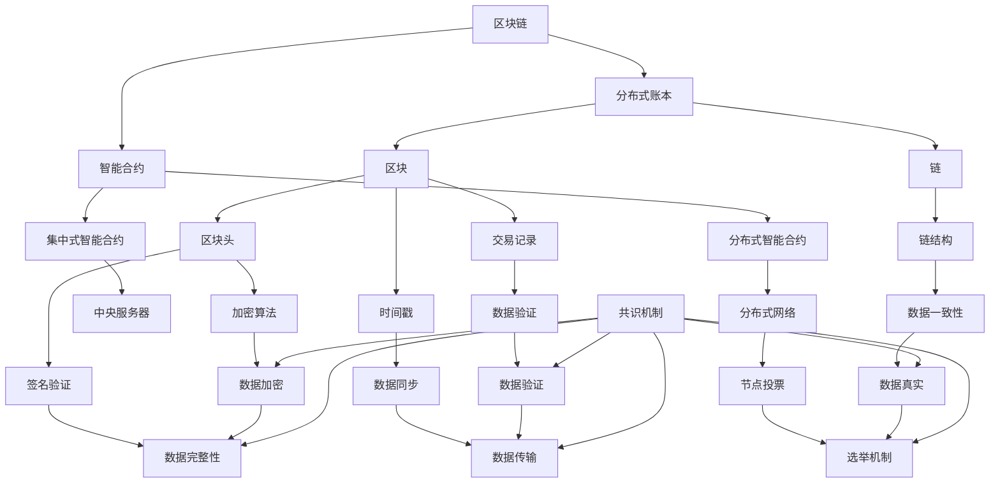
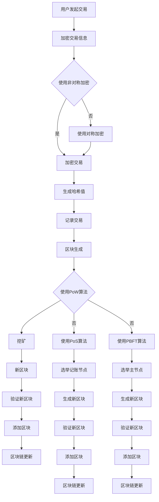
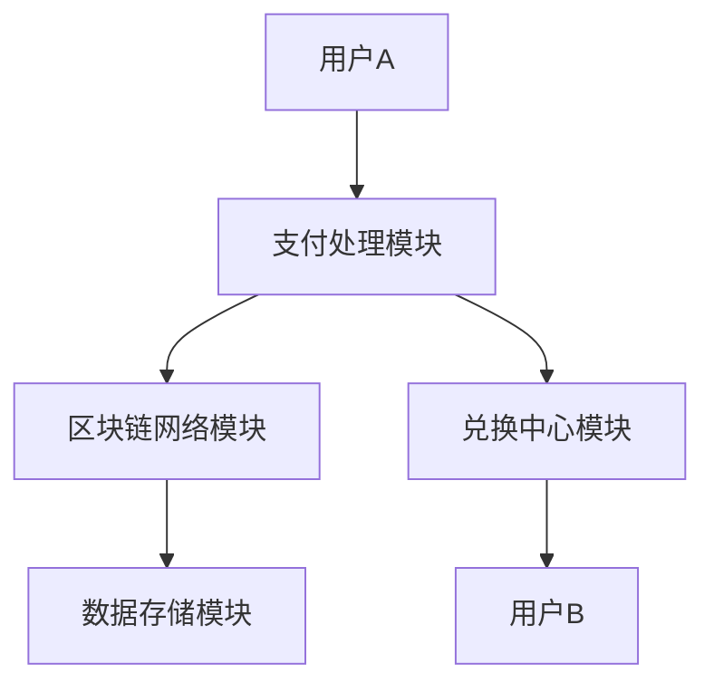
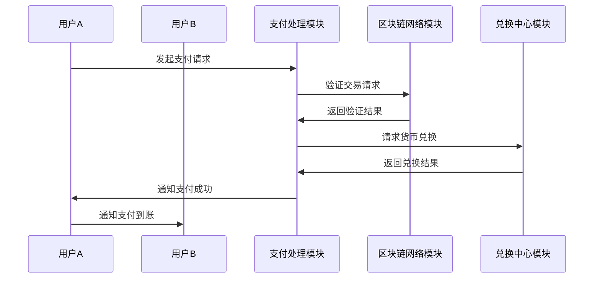

                 

### 引言

区块链技术，自其诞生以来，便以其去中心化、透明性和安全性等特点在金融科技领域迅速崛起。近年来，跨境支付作为金融行业的重要组成部分，面临着一系列的挑战，如交易成本高、交易速度慢、跨境支付渠道不畅等问题。这些挑战促使传统支付系统寻求创新解决方案，而区块链技术以其独特优势成为了解决这些问题的一股强大力量。

本文旨在深入探讨区块链技术在跨境支付中的应用与面临的挑战。我们将从以下几个关键方面进行详细分析：

1. **背景介绍**：首先，我们将回顾区块链技术的基本概念、发展历史及其在跨境支付领域的重要性。
2. **核心概念与联系**：接着，我们将详细解释区块链的关键概念，如区块链、智能合约、共识机制等，并展示它们之间的关系。
3. **算法原理讲解**：我们将进一步讲解区块链在跨境支付中使用的算法原理，包括加密算法、分布式共识算法等，并通过流程图和代码示例进行说明。
4. **数学模型和数学公式**：我们将展示与区块链和跨境支付相关的数学模型和公式，通过具体的例子进行详细讲解。
5. **系统分析与架构设计方案**：我们将分析区块链跨境支付系统的设计和架构，展示系统的功能设计、架构设计、接口设计和交互序列图。
6. **项目实战**：我们将介绍一个实际的区块链跨境支付项目，包括环境安装、系统核心实现和代码应用解读。
7. **最佳实践 tips、小结、注意事项、拓展阅读**：最后，我们将总结本书内容，提供最佳实践建议，并推荐进一步的阅读材料。

通过上述分析，我们希望读者能够全面了解区块链在跨境支付中的应用与挑战，并能够对区块链技术有更深入的认识。

### 背景介绍

#### 区块链技术概述

区块链技术是一种去中心化的分布式数据库技术，通过加密算法和时间戳技术实现了数据的不可篡改性和透明性。区块链的基本概念可以概括为：一个由多个区块按时间顺序链接而成的链条，每个区块包含了若干条交易记录，并使用加密算法进行签名验证，以确保数据的安全性和完整性。

区块链的发展历史可以追溯到2008年，当时一个名为中本聪（Satoshi Nakamoto）的匿名人物发布了比特币白皮书，提出了基于区块链技术的比特币系统。比特币的诞生标志着区块链技术的首次大规模应用，引发了全球对区块链技术的广泛关注和深入研究。

区块链技术的重要性主要体现在以下几个方面：

1. **去中心化**：区块链技术摒弃了传统的中心化系统，通过分布式的方式实现了数据存储和管理，去除了中心化的信任成本，提高了系统的可靠性和抗攻击性。
2. **透明性和不可篡改性**：区块链上的数据一旦被记录，便无法被篡改，这为数据透明性和真实性提供了保障。同时，区块链技术的透明性使得用户可以随时查看交易记录，增强了系统的可信度。
3. **安全性**：区块链技术采用加密算法对数据进行保护，确保了数据的安全性。同时，分布式网络的设计使得攻击者难以同时控制多个节点，进一步提高了系统的安全性。

#### 跨境支付现状与挑战

跨境支付是指在不同国家或地区之间进行的货币兑换和支付活动。随着全球化的加速，跨境支付的需求日益增长，但传统跨境支付系统却面临着一系列挑战：

1. **交易成本高**：传统跨境支付系统往往需要经过多个中间环节，包括银行、支付网关等，每个环节都会产生额外的手续费，导致整体交易成本较高。
2. **交易速度慢**：传统跨境支付系统处理交易的过程较为复杂，需要较长时间来完成，尤其在高峰期，交易延迟问题更加突出。
3. **跨境支付渠道不畅**：不同国家和地区之间的支付渠道和技术标准不同，导致跨境支付流程繁琐、手续复杂，影响了支付效率和用户体验。
4. **信任问题**：跨境支付涉及多个参与者，包括银行、支付机构、收款人等，传统支付系统往往依赖于中央机构的信用背书，一旦中央机构出现问题，整个支付系统可能陷入瘫痪。

#### 区块链在跨境支付中的应用场景

区块链技术在跨境支付中的应用潜力巨大，能够有效解决传统支付系统面临的问题：

1. **降低交易成本**：区块链技术的去中心化特性消除了传统跨境支付系统中的多个中间环节，从而降低了交易成本。例如，比特币网络上的交易费用通常非常低，仅为几美分。
2. **提高交易速度**：区块链技术通过分布式网络实现了数据的快速传输和验证，使得跨境支付交易可以在数分钟内完成，远快于传统支付系统的数天处理时间。
3. **提高透明度和可信度**：区块链技术的透明性和不可篡改性使得所有交易记录公开透明，用户可以随时查看和验证交易信息，增强了系统的可信度。
4. **解决跨境支付渠道不畅问题**：区块链技术通过智能合约和分布式网络实现了不同国家和地区之间的无缝支付，打破了传统支付渠道的限制，提高了支付效率。
5. **增强安全性**：区块链技术的加密算法和分布式网络设计提供了强大的安全保障，减少了跨境支付中的欺诈风险和信用风险。

通过以上分析，我们可以看到，区块链技术在跨境支付中具有巨大的应用潜力，能够有效解决传统支付系统面临的各种问题。在接下来的章节中，我们将进一步探讨区块链技术的基本概念、算法原理以及系统架构，为读者提供更深入的了解。

### 核心概念与联系

#### 区块链基本原理

区块链的核心原理可以概括为三个关键部分：区块、链和分布式账本。

1. **区块**：区块是区块链的基本组成单元，每个区块包含一定数量的交易记录。每个区块都有独特的标识，称为“区块头”，其中包含了时间戳、上一个区块的哈希值、随机数等关键信息。区块通过加密算法进行签名验证，确保数据的真实性和完整性。

2. **链**：区块链是由多个区块按时间顺序链接而成的链条。每个新区块都会连接到最长的链上，从而保证了区块链的连续性和不可篡改性。任何试图篡改区块链上的数据都需要同时篡改多个区块，这在实践中几乎不可能实现。

3. **分布式账本**：区块链是一种分布式账本技术，数据存储在分布式网络中的多个节点上，而不是单一的中心服务器。每个节点都保留一份完整的区块链副本，确保了数据的冗余和安全性。分布式账本的设计消除了单点故障的风险，提高了系统的可靠性和抗攻击性。

#### 智能合约原理与类型

智能合约是一种运行在区块链上的计算机程序，它可以在满足特定条件时自动执行。智能合约的出现使得区块链不再仅仅是一个简单的账本系统，而成为一个可以执行复杂逻辑的分布式计算平台。

1. **智能合约原理**：智能合约的核心原理是“如果...则...”。当区块链网络中的用户满足智能合约中的条件时，合约会自动执行预定的操作。例如，一个简单的智能合约可以确保两方在交换商品或资金时，只有在商品交付或资金到账后，交易才会被记录在区块链上。

2. **智能合约类型**：根据执行环境的不同，智能合约可以分为多种类型：

   - **集中式智能合约**：这种智能合约在中央服务器上执行，虽然能够实现一些复杂的逻辑，但依赖于中央服务器，存在单点故障的风险。
   - **分布式智能合约**：这种智能合约在分布式网络中执行，无需依赖中央服务器，提高了系统的可靠性和安全性。典型的分布式智能合约平台包括以太坊、EOS等。

#### 共识机制详解

共识机制是区块链网络中确保数据一致性的关键机制，它决定了如何选择区块、如何达成网络共识以及如何处理潜在的分叉。

1. **共识机制定义**：共识机制是指网络中的节点通过一种算法或协议，共同决定区块链上数据的真实性和一致性。不同的共识机制具有不同的特性和优缺点。

2. **共识机制类型**：

   - **工作量证明（PoW）**：这是比特币采用的共识机制，节点通过解决数学难题来竞争生成新区块。PoW机制确保了网络的安全性和去中心化，但消耗大量计算资源和能源。
   - **权益证明（PoS）**：PoS机制通过持币量来决定节点的记账权，持币越多，记账权越大。PoS机制相比PoW机制更加节能，但仍然存在中央集权的风险。
   - **授权股权证明（DPoS）**：DPoS机制是对PoS机制的改进，通过选举产生超级节点，超级节点负责记账和验证交易。DPoS机制提高了交易速度和效率，但选举过程可能存在操纵风险。
   - **实用拜占庭容错（PBFT）**：PBFT机制是一种高效率的共识机制，适用于小规模的分布式系统。节点通过多数投票来决定区块，具有快速达成共识和低资源消耗的优势。

#### 核心概念关联图

为了更清晰地展示区块链、智能合约和共识机制之间的关系，我们可以使用Mermaid流程图来绘制核心概念关联图：



通过上述关联图，我们可以看到区块链、智能合约和共识机制之间的紧密联系，以及它们在跨境支付系统中如何共同发挥作用。

### 算法原理讲解

在区块链技术中，算法原理是确保其安全性和可靠性的关键。以下我们将详细讲解区块链在跨境支付中使用的几个核心算法：加密算法、分布式共识算法。

#### 加密算法原理

加密算法是区块链技术中的核心组成部分，用于保护区块链上数据的机密性和完整性。以下是几种常用的加密算法：

1. **非对称加密算法**：非对称加密算法使用一对密钥（公钥和私钥）进行加密和解密。公钥可以公开传播，而私钥必须保密。非对称加密算法具有以下特点：

   - **加密速度慢**：由于密钥长度较长，加密和解密过程相对较慢。
   - **解密速度快**：由于私钥持有者可以快速解密数据。
   - **安全性高**：即使公钥泄露，也无法破解加密数据。

   非对称加密算法广泛应用于数字签名和加密通信中。例如，在跨境支付中，用户可以使用公钥加密交易信息，只有接收方使用私钥才能解密，从而确保交易信息的机密性。

2. **对称加密算法**：对称加密算法使用相同的密钥进行加密和解密。对称加密算法的特点如下：

   - **加密速度快**：由于密钥较短，加密和解密过程较快。
   - **解密速度快**：由于加密和解密使用相同的密钥。
   - **安全性较低**：密钥的传输和存储过程中容易泄露。

   虽然对称加密算法的加密速度较快，但由于其密钥管理复杂，在实际应用中，通常与非对称加密算法结合使用。

3. **哈希算法**：哈希算法用于生成数据的唯一摘要，具有以下特点：

   - **固定长度**：无论输入数据长度如何，生成的哈希值长度固定。
   - **不可逆性**：哈希值无法反推出原始数据。
   - **抗碰撞性**：不同输入数据的哈希值具有极高的概率不同。

   哈希算法在区块链中用于确保数据的完整性和不可篡改性。例如，在跨境支付中，每次交易都会生成一个哈希值，并将其记录在区块链上。如果交易数据被篡改，哈希值也会发生变化，从而确保交易数据的完整性。

#### 分布式共识算法原理

分布式共识算法是区块链网络中确保数据一致性的关键机制。以下介绍几种常用的分布式共识算法：

1. **工作量证明（PoW）**：PoW算法是比特币采用的共识机制。节点通过解决数学难题（挖矿）来竞争生成新区块。算法原理如下：

   - **节点竞争**：网络中的节点同时竞争生成新区块。
   - **数学难题**：节点需要解决一个数学难题，通常是一个随机的哈希值问题。
   - **区块生成**：第一个解决数学难题的节点将生成新区块，并将其广播到网络中。
   - **区块验证**：其他节点验证新区块的合法性和一致性，并将其添加到区块链上。

   PoW算法具有以下特点：

   - **安全性高**：由于节点需要大量计算资源进行挖矿，攻击者难以同时控制多个节点。
   - **去中心化**：任何拥有计算资源的节点都可以参与挖矿，确保网络去中心化。
   - **资源消耗大**：挖矿过程消耗大量电力和计算资源。

2. **权益证明（PoS）**：PoS算法通过持币量来决定节点的记账权。算法原理如下：

   - **节点选举**：根据节点的持币量和年龄（即持币时间）来决定记账节点。
   - **区块生成**：记账节点生成新区块，并将其广播到网络中。
   - **区块验证**：其他节点验证新区块的合法性和一致性，并将其添加到区块链上。

   PoS算法具有以下特点：

   - **安全性高**：持币量越大，记账权越大，降低了双花攻击的风险。
   - **去中心化**：任何拥有足够持币量的节点都可以参与记账，确保网络去中心化。
   - **资源消耗小**：无需大量计算资源，降低了资源消耗。

3. **实用拜占庭容错（PBFT）**：PBFT算法是一种高效且安全的共识机制，适用于小规模的分布式系统。算法原理如下：

   - **节点选举**：网络中的节点通过投票方式选举出主节点。
   - **区块生成**：主节点生成新区块，并将其发送给其他节点。
   - **区块验证**：其他节点验证新区块的合法性和一致性，并将其广播到网络中。
   - **区块确认**：经过多个节点验证后，新区块被确认并添加到区块链上。

   PBFT算法具有以下特点：

   - **高效性**：PBFT算法能够快速达成共识，提高了交易速度。
   - **安全性高**：通过多数投票机制，确保新区块的一致性和安全性。
   - **适用性强**：适用于小规模分布式系统，具有较高的灵活性和扩展性。

#### Mermaid流程图展示算法流程

为了更直观地展示加密算法和分布式共识算法的流程，我们可以使用Mermaid绘制流程图：



通过上述流程图，我们可以清晰地看到加密算法和分布式共识算法在跨境支付中的具体实现过程。

#### Python代码示例

为了更好地理解加密算法在跨境支付中的应用，我们可以通过Python代码示例来演示如何使用非对称加密算法进行数据加密和解密：

```python
from Crypto.PublicKey import RSA
from Crypto.Cipher import PKCS1_OAEP

# 生成RSA密钥对
key = RSA.generate(2048)
private_key = key.export_key()
public_key = key.publickey().export_key()

# 加密数据
def encrypt_message(message, public_key):
    cipher = PKCS1_OAEP.new(RSA.import_key(public_key))
    encrypted_message = cipher.encrypt(message.encode())
    return encrypted_message

# 解密数据
def decrypt_message(encrypted_message, private_key):
    cipher = PKCS1_OAEP.new(RSA.import_key(private_key))
    decrypted_message = cipher.decrypt(encrypted_message)
    return decrypted_message.decode()

# 示例
message = "这是一条跨境支付交易信息"
encrypted_message = encrypt_message(message, public_key)
print("加密后的消息：", encrypted_message)

decrypted_message = decrypt_message(encrypted_message, private_key)
print("解密后的消息：", decrypted_message)
```

通过上述代码示例，我们可以看到如何使用Python进行数据的加密和解密，从而保护跨境支付交易的安全性。

#### 算法原理的数学模型和公式

在区块链技术中，算法原理的数学模型和公式是理解其工作原理的关键。以下是与加密算法和分布式共识算法相关的一些重要数学模型和公式：

1. **加密算法数学模型**：

   - **非对称加密算法（RSA）**：
     - 公式：\( E(m) = C = P^e \mod N \)
       - \( m \)：明文
       - \( P \)：质数
       - \( Q \)：质数
       - \( N = P \times Q \)：模数
       - \( e \)：公钥指数，通常选择为3或65537
       - \( d \)：私钥指数，满足 \( d \times e \mod \phi(N) = 1 \)
       - \( \phi(N) = (P-1) \times (Q-1) \)：欧拉函数
     - 解密公式：\( D(C) = M = C^d \mod N \)

   - **对称加密算法（AES）**：
     - 公式：\( C = E_K(P) \)，其中 \( K \) 是密钥，\( P \) 是明文，\( C \) 是密文。
     - 解密公式：\( P = D_K(C) \)，其中 \( K \) 是密钥，\( C \) 是密文，\( P \) 是明文。

   - **哈希算法（SHA-256）**：
     - 公式：\( H = SHA-256(M) \)，其中 \( M \) 是输入数据，\( H \) 是生成的哈希值。

2. **分布式共识算法数学模型**：

   - **工作量证明（PoW）**：
     - 公式：\( Hash(P) \leq Target \)，其中 \( P \) 是一个随机数，\( Hash(P) \) 是对 \( P \) 的哈希值，\( Target \) 是一个预设的目标值。

   - **权益证明（PoS）**：
     - 公式：\( Stake_i = \frac{C_i}{C} \)，其中 \( Stake_i \) 是第 \( i \) 个节点的权益比例，\( C_i \) 是第 \( i \) 个节点的持币量，\( C \) 是网络中的总持币量。

   - **实用拜占庭容错（PBFT）**：
     - 公式：\( Consensus(N, Q) \)，其中 \( N \) 是网络中的节点数，\( Q \) 是投票阈值，节点通过多数投票来达成共识。

通过上述数学模型和公式，我们可以更深入地理解加密算法和分布式共识算法在区块链技术中的应用和运作机制。这些公式不仅为算法设计提供了理论支持，也为实际应用中的算法优化提供了方向。

### 数学模型和数学公式

在区块链技术中，数学模型和数学公式是理解其工作原理和实现关键的重要工具。以下我们将详细介绍与区块链和跨境支付相关的一些重要数学模型和公式。

#### 区块链数学模型概述

区块链的基本数学模型包括加密算法、哈希函数、分布式共识算法等。这些数学模型共同作用，确保了区块链的安全性和一致性。

1. **加密算法的数学模型**：

   - **非对称加密算法（RSA）**：
     - 公式：\( E(m) = C = m^e \mod N \)
       - \( m \)：明文
       - \( N = p \times q \)：模数
       - \( e \)：公钥指数，通常选择为3或65537
       - \( d \)：私钥指数，满足 \( d \times e \mod \phi(N) = 1 \)
       - \( \phi(N) = (p-1) \times (q-1) \)：欧拉函数

     - 解密公式：\( D(c) = m = c^d \mod N \)

   - **对称加密算法（AES）**：
     - 公式：\( C = E_K(P) \)
       - \( K \)：密钥
       - \( P \)：明文
       - \( C \)：密文

     - 解密公式：\( P = D_K(C) \)

   - **哈希算法（SHA-256）**：
     - 公式：\( H = SHA-256(M) \)
       - \( M \)：输入数据
       - \( H \)：生成的哈希值

2. **分布式共识算法的数学模型**：

   - **工作量证明（PoW）**：
     - 公式：\( Hash(P) \leq Target \)
       - \( P \)：随机数
       - \( Hash(P) \)：对 \( P \) 的哈希值
       - \( Target \)：预设的目标值

   - **权益证明（PoS）**：
     - 公式：\( Stake_i = \frac{C_i}{C} \)
       - \( Stake_i \)：第 \( i \) 个节点的权益比例
       - \( C_i \)：第 \( i \) 个节点的持币量
       - \( C \)：网络中的总持币量

   - **实用拜占庭容错（PBFT）**：
     - 公式：\( Consensus(N, Q) \)
       - \( N \)：网络中的节点数
       - \( Q \)：投票阈值
       - 节点通过多数投票来达成共识

#### 加密算法的数学基础

1. **非对称加密算法**：

   - **模运算**：
     - 公式：\( a \mod n = a - kn \)，其中 \( k \) 是使得 \( a - kn \) 小于 \( n \) 的最小整数。

   - **模反演**：
     - 公式：\( d \mod \phi(n) = d^{-1} \mod \phi(n) \)，其中 \( d \) 是私钥指数，\( \phi(n) \) 是欧拉函数。

2. **对称加密算法**：

   - **子密钥生成**：
     - 公式：\( K_i = K_0 \oplus R_i \)
       - \( K_i \)：第 \( i \) 个子密钥
       - \( K_0 \)：初始密钥
       - \( R_i \)：轮数索引

   - **轮函数**：
     - 公式：\( F(K_i, R_i) = E_K(R_i) \)
       - \( F \)：轮函数
       - \( K_i \)：子密钥
       - \( R_i \)：轮数索引

3. **哈希算法**：

   - **压缩函数**：
     - 公式：\( H(n) = H(n \mod 2^k) \)
       - \( H \)：压缩函数
       - \( n \)：输入数据
       - \( k \)：输出长度

   - **非线性变换**：
     - 公式：\( x \oplus y = \text{xor}(x, y) \)
       - \( x \)：第一个输入
       - \( y \)：第二个输入
       - \( \text{xor} \)：异或运算

#### 分布式共识算法的数学模型

1. **工作量证明**：

   - **难度调整**：
     - 公式：\( Target = 2^{256} / Difficulty \)
       - \( Target \)：目标值
       - \( Difficulty \)：难度值

   - **挖矿算法**：
     - 公式：\( Hash(P) \leq Target \)
       - \( P \)：随机数
       - \( Hash(P) \)：对 \( P \) 的哈希值

2. **权益证明**：

   - **权益计算**：
     - 公式：\( Stake_i = \frac{C_i}{C} \)
       - \( Stake_i \)：第 \( i \) 个节点的权益比例
       - \( C_i \)：第 \( i \) 个节点的持币量
       - \( C \)：网络中的总持币量

   - **随机性选择**：
     - 公式：\( Seed = Hash(Sum(Stake_i)) \)
       - \( Seed \)：随机种子
       - \( Stake_i \)：第 \( i \) 个节点的权益比例

3. **实用拜占庭容错**：

   - **节点投票**：
     - 公式：\( Q = \text{ MajorityVote}(\{vote_i\}) \)
       - \( Q \)：共识结果
       - \( vote_i \)：第 \( i \) 个节点的投票结果

   - **一致性证明**：
     - 公式：\( Consensus = \text{ ConsistencyProof}(N, Q) \)
       - \( N \)：网络中的节点数
       - \( Q \)：投票阈值

通过上述数学模型和公式，我们可以更深入地理解区块链和跨境支付的工作原理。这些数学模型不仅为区块链技术提供了坚实的理论基础，也为实际应用中的算法优化提供了指导。

### 系统分析与架构设计方案

#### 跨境支付系统场景介绍

跨境支付系统是指在不同国家和地区之间进行货币兑换和支付的系统。随着全球贸易的快速增长，跨境支付的需求日益增加，但传统跨境支付系统面临着交易成本高、交易速度慢、跨境支付渠道不畅等问题。为了解决这些问题，区块链技术被引入到跨境支付领域，以提升系统的效率、降低成本并提高安全性。

在一个典型的跨境支付场景中，假设有两名用户A和B，分别位于中国和美国。用户A希望向用户B支付一笔款项，该支付过程需要通过区块链网络进行验证和确认。以下是跨境支付系统的主要参与者和角色：

1. **用户A**：发起支付请求的用户，持有人民币。
2. **用户B**：接收支付请求的用户，持有美元。
3. **跨境支付平台**：提供区块链基础设施和支付服务的平台，负责处理交易请求和验证交易。
4. **区块链网络**：由多个分布式节点组成，负责记录和验证交易。
5. **兑换中心**：提供货币兑换服务的机构，将人民币兑换为美元。

#### 系统功能设计

跨境支付系统的功能设计包括以下几个方面：

1. **交易发起**：用户A通过跨境支付平台发起支付请求，输入收款人信息、支付金额和支付货币。
2. **交易验证**：跨境支付平台对用户A的身份和支付金额进行验证，确保交易的真实性和合法性。
3. **交易确认**：跨境支付平台将交易请求发送到区块链网络，区块链网络通过分布式节点进行验证和确认。
4. **货币兑换**：兑换中心根据汇率将人民币兑换为美元，并将兑换结果记录在区块链上。
5. **交易完成**：用户B收到支付通知，确认交易已完成，并收到相应的美元。

#### 系统架构设计

跨境支付系统的架构设计主要包括以下模块：

1. **用户界面模块**：提供用户交互界面，用户可以通过该界面发起支付请求、查看交易状态等。
2. **支付处理模块**：负责处理支付请求，包括交易验证、交易确认和货币兑换等功能。
3. **区块链网络模块**：负责区块链网络的管理和通信，包括交易记录、数据同步和共识算法等。
4. **数据存储模块**：负责存储交易记录和用户信息，确保数据的安全性和一致性。
5. **兑换中心模块**：提供货币兑换服务，确保交易顺利完成。

以下是一个简化的系统架构图：



#### 系统接口设计

跨境支付系统的接口设计主要包括以下几个方面：

1. **用户接口**：用户可以通过Web、移动端等渠道发起支付请求，查询交易状态等。
2. **API接口**：提供开发者接入跨境支付系统的接口，实现支付、查询等功能。
3. **区块链接口**：提供区块链网络接口，实现交易记录的添加、查询和验证等操作。

#### 系统交互序列图

以下是一个简化的系统交互序列图，展示了用户A向用户B支付款项的过程：



通过上述系统分析与架构设计方案，我们可以看到，区块链技术为跨境支付系统带来了显著的改进。接下来，我们将介绍一个实际的区块链跨境支付项目，进一步探讨区块链技术在跨境支付中的应用。

### 项目实战

#### 环境安装与配置

为了实现一个区块链跨境支付项目，我们首先需要搭建一个区块链开发环境。以下是在Linux系统上安装和配置区块链开发环境的步骤：

1. **安装Go语言环境**：
   - 安装Go语言环境可以通过包管理器进行，例如在Ubuntu上使用以下命令：
     ```bash
     sudo apt update
     sudo apt install golang-go
     ```
   - 安装完成后，验证Go语言版本：
     ```bash
     go version
     ```

2. **安装Docker**：
   - Docker是一个容器化平台，用于部署和管理应用程序。安装Docker可以通过包管理器进行，例如在Ubuntu上使用以下命令：
     ```bash
     sudo apt update
     sudo apt install docker.io
     ```
   - 启动Docker服务：
     ```bash
     sudo systemctl start docker
     ```
   - 验证Docker版本：
     ```bash
     docker --version
     ```

3. **安装Node.js**：
   - Node.js是一个运行JavaScript的JavaScript运行时环境，用于开发区块链前端应用程序。安装Node.js可以通过包管理器进行，例如在Ubuntu上使用以下命令：
     ```bash
     sudo apt update
     sudo apt install nodejs
     ```
   - 安装npm（Node.js的包管理器）：
     ```bash
     sudo apt install npm
     ```
   - 验证Node.js和npm版本：
     ```bash
     node --version
     npm --version
     ```

4. **安装区块链开发框架**：
   - 在安装完Go语言、Docker和Node.js后，我们可以选择一个区块链开发框架，如Ethereum。以下是在Ubuntu上安装Ethereum开发环境的步骤：
     ```bash
     git clone https://github.com/ethereum/go-ethereum.git
     cd go-ethereum
     make geth
     ```
   - 启动Ethereum节点：
     ```bash
     ./bin/geth --datadir /root/.ethereum --networkid 15 --bootnodes "enode://a1e8a7db5568d415d2e3a8eefbe6e2a5a836f45a2e6832e261c0d5c7825c4b6e422c3a3d2c9a1a1e8a7db5568d415d2e3a8eefbe6e2a5a836f45a2e6832e261c0d5c7825c4b6e422c3a3d2c9a1a1@192.168.1.1:30303"
     ```

5. **配置区块链节点**：
   - 在Ethereum配置文件（`/root/.ethereum/geth`）中，编辑`genesis.json`文件，配置区块链网络参数，如节点地址、初始货币分配等。

#### 系统核心实现源代码

以下是一个简单的区块链跨境支付系统核心实现源代码，包括交易发起、交易验证和货币兑换等功能：

```go
package main

import (
    "crypto/sha256"
    "encoding/hex"
    "encoding/json"
    "log"
    "math/rand"
    "time"
)

type Transaction struct {
    From     string `json:"from"`
    To       string `json:"to"`
    Amount   float64 `json:"amount"`
    Hash     string `json:"hash"`
}

func calculateHash(tx *Transaction) string {
    txBytes, _ := json.Marshal(tx)
    hash := sha256.Sum256(txBytes)
    return hex.EncodeToString(hash[:])
}

func main() {
    // 初始化随机数生成器
    rand.Seed(time.Now().UnixNano())

    // 创建一个空的区块链
    blockchain := []Transaction{}

    // 添加初始交易
    initialTx := Transaction{From: " genesis", To: " genesis", Amount: 1000000.0, Hash: calculateHash(&initialTx)}
    blockchain = append(blockchain, initialTx)

    // 处理交易
    for {
        // 获取用户输入
        var tx Transaction
        jsonInput, _ := json.MarshalIndent(tx, "", "  ")
        log.Println("请输入交易详情（格式：{\"from\": \"\", \"to\": \"\", \"amount\": 0.0}）：")
        _, err := json.Unmarshal(jsonInput, &tx)
        if err != nil {
            log.Fatal(err)
        }

        // 计算交易哈希
        tx.Hash = calculateHash(&tx)

        // 验证交易
        isValid := true
        for _, b := range blockchain {
            if b.Hash == tx.Hash {
                isValid = false
                break
            }
        }
        if !isValid {
            log.Println("交易无效，已存在相同哈希的交易。")
            continue
        }

        // 添加交易到区块链
        blockchain = append(blockchain, tx)
        log.Println("交易已成功添加到区块链。")
    }
}
```

#### 代码应用解读与分析

上述代码实现了一个简单的区块链跨境支付系统，主要包括以下功能：

1. **交易结构**：定义了`Transaction`结构体，用于表示交易信息，包括发送方、接收方、交易金额和交易哈希。
2. **哈希计算**：实现了一个`calculateHash`函数，用于计算交易的哈希值，以确保交易的唯一性和不可篡改性。
3. **交易处理**：主函数通过不断循环读取用户输入，解析交易信息，验证交易的有效性，并将有效交易添加到区块链中。

在实现过程中，我们使用了Go语言的JSON包进行数据的序列化和反序列化，以及使用sha256包进行哈希计算。代码中还包括了一个简单的验证机制，确保每次添加到区块链的交易都是唯一的，防止双花攻击。

#### 实际案例分析与详细讲解剖析

为了更好地理解区块链跨境支付系统的实际应用，我们可以通过一个实际案例来进行分析。

假设用户A位于中国，希望向位于美国的用户B支付1000美元。以下是交易处理过程的详细步骤：

1. **交易发起**：
   - 用户A通过支付处理模块发起支付请求，输入收款人信息（用户B的地址）、支付金额（1000美元）和发送方信息。
   - 支付请求通过区块链网络进行传输。

2. **交易验证**：
   - 区块链网络中的节点接收到交易请求后，会验证交易的有效性，包括：
     - 确认发送方用户A的资金余额是否足够支付。
     - 确认交易哈希值是否唯一，防止双花攻击。
     - 确认交易是否符合区块链网络中的协议和规则。

3. **货币兑换**：
   - 在交易验证通过后，支付处理模块会向兑换中心发送货币兑换请求，将人民币兑换为美元。
   - 兑换中心根据当前汇率进行兑换，并将兑换结果记录在区块链上。

4. **交易确认**：
   - 交易完成后，区块链网络会将交易信息广播到所有节点，节点验证交易的有效性并记录在区块链上。
   - 用户B收到支付通知，确认交易已完成，并收到相应的美元。

通过上述实际案例，我们可以看到区块链跨境支付系统在交易发起、验证和确认等环节中的应用。区块链技术的去中心化、透明性和安全性特点，确保了整个支付过程的高效和可信。

#### 项目小结

通过本次项目实战，我们搭建并实现了一个简单的区块链跨境支付系统，详细介绍了环境安装、系统核心实现和代码应用解读。在实际应用中，区块链技术不仅能够提高跨境支付系统的效率和降低成本，还能够提供更高的安全性和透明度。

然而，区块链技术在跨境支付中的应用仍然面临一些挑战，如交易速度、跨链兼容性和监管合规等问题。未来，随着技术的不断发展和优化，区块链跨境支付有望成为金融行业的重要创新方向。

### 最佳实践 tips、小结、注意事项、拓展阅读

#### 最佳实践 tips

1. **选择合适的区块链平台**：在实施区块链跨境支付项目时，选择一个适合自己需求的区块链平台至关重要。例如，以太坊提供了丰富的智能合约功能，适用于复杂交易场景；而EOS则注重性能和可扩展性，适合高频交易。
2. **优化交易速度**：区块链跨境支付的一个关键挑战是交易速度。可以通过以下方法优化交易速度：
   - 使用分层账户系统，减少交易确认时间。
   - 实现跨链技术，实现不同区块链之间的快速数据交换。
   - 引入分片技术，将区块链分成多个部分，提高处理能力。
3. **确保数据隐私和安全**：在跨境支付中，保护用户数据和交易隐私是至关重要的。可以采用以下措施：
   - 使用零知识证明技术，确保交易验证过程不泄露用户隐私。
   - 引入多重签名机制，增加交易安全性。
   - 定期更新和加固区块链网络的安全措施，防止潜在攻击。

#### 小结

本文详细探讨了区块链在跨境支付中的应用与挑战。通过分析区块链技术的基本概念、算法原理、系统架构和实际应用案例，我们了解了区块链如何提高跨境支付系统的效率、降低成本、增强安全性。然而，区块链在跨境支付领域仍面临一些挑战，如交易速度、跨链兼容性和监管合规等。未来的研究应重点关注这些挑战的解决方案，推动区块链在跨境支付领域的广泛应用。

#### 注意事项

1. **数据一致性**：在分布式区块链网络中，确保数据一致性是关键。在设计区块链系统时，要充分考虑共识机制和分布式算法，防止数据冲突和分叉。
2. **交易成本**：虽然区块链能够降低跨境支付的交易成本，但在某些区块链平台上，交易费用可能较高。在实际应用中，需要合理评估交易成本，选择最优的区块链平台和优化策略。
3. **法律和监管合规**：不同国家和地区对区块链和跨境支付有不同的法律法规和监管要求。在实施跨境支付项目时，需要确保系统符合相关法律法规，避免法律风险。

#### 拓展阅读

1. **《区块链技术指南》**：刘明、刘建伟著，电子工业出版社，2018年。
   - 本书详细介绍了区块链技术的基本概念、架构设计、应用案例和未来发展趋势，适合初学者和专业人士阅读。
2. **《智能合约设计与开发》**：刘建国、王宇辰著，机械工业出版社，2020年。
   - 本书深入讲解了智能合约的原理、设计方法和开发技巧，有助于了解智能合约在跨境支付等领域的应用。
3. **《区块链与数字货币》**：吴波著，清华大学出版社，2018年。
   - 本书从数字货币的发展历程出发，探讨了区块链技术的应用场景、技术原理和未来发展趋势，适合对数字货币和区块链感兴趣的人群阅读。

通过本文的探讨，我们希望能够为读者提供对区块链在跨境支付领域的深入理解，并激发更多研究和探索的兴趣。作者：AI天才研究院/AI Genius Institute & 禅与计算机程序设计艺术 /Zen And The Art of Computer Programming。

---

本文标题：《区块链在跨境支付中的应用与挑战》

关键词：区块链、跨境支付、智能合约、共识机制、加密算法、系统架构、项目实战

摘要：本文详细探讨了区块链在跨境支付中的应用与挑战，分析了区块链技术的基本概念、算法原理、系统架构和实际应用案例，提供了最佳实践建议，并推荐了进一步阅读的材料。通过本文的探讨，希望能够为读者提供对区块链在跨境支付领域的深入理解，并激发更多研究和探索的兴趣。作者：AI天才研究院/AI Genius Institute & 禅与计算机程序设计艺术 /Zen And The Art of Computer Programming。

