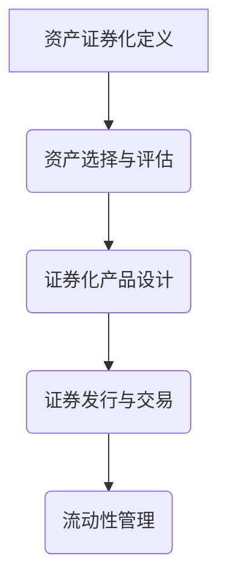
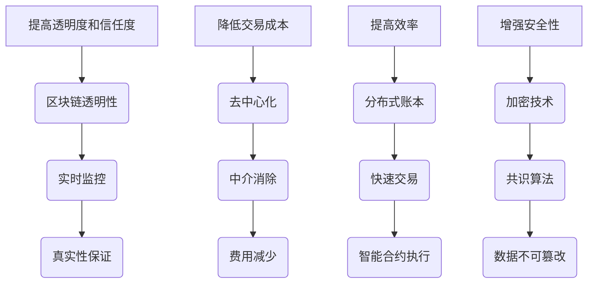

                 


## 区块链技术在资产证券化中的应用背景

### 第1章：区块链技术基础

#### 1.1 区块链的定义和原理

区块链（Blockchain）是一种分布式数据库技术，其核心思想是去中心化，通过加密算法和共识机制保证数据的真实性和不可篡改性。区块链的基本概念包括区块（Block）、链（Chain）、节点（Node）和共识算法等。

##### 1.1.1 区块链的基本概念
- **区块（Block）**：区块是区块链的基本组成单元，包含一定数量的交易记录。
- **链（Chain）**：链是由多个有序的区块组成的链条。
- **节点（Node）**：节点是参与区块链网络计算和数据存储的计算机。
- **共识算法**：共识算法是一种算法，用于确保区块链网络中的所有节点对于数据的一致性达成共识。

##### 1.1.2 区块链的核心特征
- **去中心化**：区块链通过分布式网络运作，去除了传统的中心化中介。
- **数据透明**：区块链上的数据对所有节点公开透明，但通过加密算法确保了隐私性。
- **不可篡改**：一旦数据被记录在区块链上，就几乎无法被篡改。
- **安全性**：区块链采用加密算法和共识机制保障数据的安全。

##### 1.1.3 区块链的运行机制
- **交易记录**：用户通过区块链网络进行交易，交易记录会被打包成区块。
- **区块生成**：节点通过挖矿（在比特币中）或其他共识算法来生成新区块。
- **区块验证**：新区块通过网络中的其他节点验证，验证通过后添加到链上。
- **共识机制**：共识机制确保所有节点对于区块链上一致，不同的共识机制包括工作量证明（PoW）、权益证明（PoS）等。

#### 1.2 区块链技术发展历程

##### 1.2.1 区块链的起源
区块链的概念最早由中本聪（Satoshi Nakamoto）在2008年提出，作为比特币（Bitcoin）的底层技术。

##### 1.2.2 主要发展里程碑
- **2009年**：比特币网络启动，第一个区块——创世区块被挖出。
- **2014年**：以太坊（Ethereum）诞生，引入了智能合约的概念。
- **2016年**：区块链技术被写入我国“十三五”规划。

##### 1.2.3 当前发展趋势与挑战
- **发展趋势**：区块链技术逐渐从数字货币领域扩展到金融、供应链、医疗等多个领域。
- **挑战**：区块链技术的性能、可扩展性和法律法规等仍是面临的重要挑战。

### 1.3 资产证券化的基本概念

##### 1.3.1 资产证券化的定义
资产证券化是指将不具备流动性但具有稳定现金流的资产，通过结构化设计转化为可以在金融市场上交易的证券的过程。

##### 1.3.2 资产证券化的过程
- **资产选择与评估**：选择适合证券化的资产，并进行评估。
- **证券化产品设计**：根据资产的特点设计证券的结构。
- **证券发行与交易**：将证券发行给投资者，并在金融市场上进行交易。
- **流动性管理**：管理资产的现金流，确保证券的流动性。

##### 1.3.3 资产证券化的目的与意义
- **目的**：提高资产的流动性，降低融资成本，分散风险。
- **意义**：促进金融市场的创新和发展，提高金融服务的效率。

### 总结
区块链技术与资产证券化的结合，有望在提高透明度、降低成本、增强安全性等方面发挥重要作用。接下来，我们将进一步探讨区块链在资产证券化中的应用原理及其优势。

### Mermaid 图表

```mermaid
graph TB
    A[区块链基本概念] --> B(区块(Block))
    B --> C(链(Chain))
    C --> D(节点(Node))
    D --> E(共识算法)
    
    A --> F[区块链核心特征]
    F --> G(去中心化)
    G --> H(数据透明)
    H --> I(不可篡改)
    I --> J(安全性)
    
    A --> K[区块链运行机制]
    K --> L(交易记录)
    L --> M(区块生成)
    M --> N(区块验证)
    N --> O(共识机制)
```



接下来，我们将深入探讨区块链在资产证券化中的应用原理，以及其在这一领域中的优势。

---

### 1.4 区块链在资产证券化中的应用原理

区块链技术在资产证券化中的应用，主要体现在提高透明度、降低成本、增强安全性和提高效率等方面。

#### 2.1 区块链在资产证券化中的优势

##### 2.1.1 提高透明度和信任度
区块链技术的透明性使得资产证券化的每一步都可以被所有参与者查看，从而提高了市场的信任度。通过区块链，投资者可以实时监控资产的状态和交易情况，确保信息的真实性。

##### 2.1.2 降低交易成本
区块链的去中心化特性消除了传统金融中介的需求，从而降低了交易成本。通过智能合约自动执行合同条款，可以减少人工操作和中介费用。

##### 2.1.3 提高效率
区块链技术的分布式账本使得资产证券化的交易过程更加快速和高效。智能合约的自动执行功能进一步加快了交易速度。

##### 2.1.4 增强安全性
区块链的加密技术和共识算法确保了资产证券化过程的安全性。数据的不可篡改性使得欺诈和篡改变得非常困难。

#### 2.2 区块链在资产证券化中的核心环节

##### 2.2.1 资产选择与评估
在区块链平台上，资产选择与评估过程可以更加透明和准确。通过智能合约，资产的所有权和属性可以清晰地记录和验证。

##### 2.2.2 证券化产品设计
区块链平台可以提供多种工具和协议，帮助设计符合特定需求的证券化产品。智能合约可以自动执行产品设计中的条款和条件。

##### 2.2.3 证券发行与交易
区块链技术使得证券的发行和交易过程更加高效和便捷。通过去中心化的交易平台，投资者可以直接参与交易，无需依赖中介机构。

##### 2.2.4 流动性管理
区块链技术可以帮助管理者实时监控资产的现金流，确保证券的流动性。智能合约可以自动执行流动性管理策略。

#### 2.3 案例分析

以中国的数字资产交易平台为例，该平台利用区块链技术实现了资产证券化的全过程。通过智能合约，平台确保了交易的透明性和安全性，同时降低了交易成本，提高了效率。

### 总结

区块链技术在资产证券化中的应用，不仅提高了市场的透明度和信任度，还降低了交易成本，增强了安全性，提高了效率。接下来，我们将通过实际案例来深入探讨区块链在资产证券化中的应用。

### Mermaid 图表



接下来，我们将探讨区块链在资产证券化中的实际应用案例。

### 1.5 区块链在资产证券化中的实际应用案例

#### 3.1 国际案例介绍

##### 3.1.1 美国的数字货币资产证券化案例

美国市场上，数字货币资产证券化的例子包括比特币和以太坊等加密货币的证券化产品。通过这些产品，投资者可以投资于加密货币市场，同时降低了直接购买加密货币的风险。

##### 3.1.2 欧洲的房地产资产证券化案例

在欧洲，区块链技术在房地产资产证券化中的应用也得到了广泛应用。例如，英国的房地产平台利用区块链技术实现了房地产资产证券化，使得投资者可以轻松购买房地产相关证券。

#### 3.2 中国案例剖析

##### 3.2.1 中国的数字资产交易平台案例

中国的数字资产交易平台，如“火币网”和“币安网”，利用区块链技术实现了数字资产的安全交易和资产证券化。这些平台通过智能合约确保了交易的透明性和安全性，吸引了大量投资者。

##### 3.2.2 中国的绿色债券区块链应用案例

中国也在绿色债券领域探索区块链技术的应用。例如，中国银行在2020年发行了一笔基于区块链技术的绿色债券。通过区块链技术，这笔债券的发行和交易过程得到了高度透明和安全的保障。

### 总结

通过以上国际和中国的案例，我们可以看到区块链技术在资产证券化中的应用已经取得了显著成果。接下来，我们将探讨区块链技术在资产证券化中面临的挑战与未来发展趋势。

### 1.6 区块链技术在资产证券化中的挑战与未来发展趋势

#### 4.1 挑战与风险

##### 4.1.1 技术实现上的挑战
区块链技术在资产证券化中的应用需要解决技术实现上的挑战，如性能、可扩展性和安全性等问题。

##### 4.1.2 法规与监管的挑战
区块链技术的应用需要符合相关法律法规和监管要求，这在一定程度上增加了复杂性。

##### 4.1.3 安全性与隐私保护的挑战
尽管区块链技术具有较高的安全性，但在资产证券化中仍然存在隐私保护和数据安全的问题。

#### 4.2 未来发展趋势

##### 4.2.1 技术创新与升级
随着技术的进步，区块链技术在资产证券化中的应用将更加成熟和高效。

##### 4.2.2 法规完善与监管协作
政府和监管机构将进一步完善相关法规，促进区块链技术在资产证券化中的应用。

##### 4.2.3 应用场景拓展与市场接受度提升
区块链技术在资产证券化中的应用将不断拓展，市场接受度也将逐渐提升。

### 总结

区块链技术在资产证券化中的应用具有巨大的潜力，但也面临一定的挑战。未来，随着技术的进步和法规的完善，区块链技术在资产证券化中的应用前景将更加广阔。

### 1.7 区块链技术对资产证券化的影响与意义

#### 5.1 对金融市场的影响

区块链技术对金融市场的影响主要体现在以下几个方面：

##### 5.1.1 改变金融市场结构
区块链技术通过去中心化的特性，改变了传统金融市场的结构，降低了中介成本，提高了市场效率。

##### 5.1.2 提升金融产品创新
区块链技术为金融产品创新提供了新的可能性，如智能合约、去中心化金融（DeFi）等。

##### 5.1.3 促进金融包容性发展
区块链技术可以降低金融服务的门槛，促进金融服务的普及和包容性发展。

#### 5.2 对金融行业的意义

区块链技术对金融行业的影响同样深远：

##### 5.2.1 提高行业效率
区块链技术通过自动化和去中心化的特性，提高了金融行业的运作效率。

##### 5.2.2 促进金融科技发展
区块链技术是金融科技发展的重要组成部分，推动金融行业的数字化和智能化。

##### 5.2.3 推动绿色金融发展
区块链技术在绿色债券、碳交易等领域的应用，有助于推动绿色金融的发展。

### 总结

区块链技术对资产证券化的影响与意义不可忽视。它不仅改变了金融市场和金融行业的运作方式，还推动了金融产品创新和绿色金融的发展。接下来，我们将探讨区块链在资产证券化中的最佳实践。

### 1.8 区块链在资产证券化中的最佳实践

#### 6.1 设计与实施建议

##### 6.1.1 区块链平台选择
选择适合资产证券化需求的区块链平台是关键。需要考虑平台的性能、可扩展性、安全性等因素。

##### 6.1.2 资产证券化流程优化
通过智能合约和区块链技术，可以对资产证券化流程进行优化，提高效率和透明度。

##### 6.1.3 安全性与合规性措施
确保区块链平台和资产证券化过程的安全性，同时遵守相关法律法规，是实施过程中的关键。

#### 6.2 成功案例分析

##### 6.2.1 典型案例介绍
介绍一些成功的区块链资产证券化案例，如美国的数字货币资产证券化和中国的绿色债券区块链应用。

##### 6.2.2 案例启示与借鉴意义
从成功案例中总结经验，为其他资产证券化项目提供借鉴和启示。

### 总结

最佳实践是区块链在资产证券化中成功应用的重要保障。通过合理选择区块链平台、优化流程和确保安全合规，可以推动资产证券化的健康发展。

### 1.9 区块链技术在资产证券化中的未来前景

#### 7.1 市场前景展望

区块链技术在资产证券化中的应用前景广阔：

##### 7.1.1 市场规模预测
随着区块链技术的成熟和普及，资产证券化的市场规模将不断扩大。

##### 7.1.2 应用场景拓展
区块链技术在更多领域的应用，如绿色债券、碳交易等，将推动资产证券化的发展。

##### 7.1.3 行业竞争格局
未来，区块链资产证券化市场将出现更多竞争者，行业竞争格局将更加多元化。

#### 7.2 创新与突破方向

##### 7.2.1 技术创新突破
在性能、可扩展性和安全性等方面，区块链技术需要不断创新突破。

##### 7.2.2 应用模式创新
探索更多创新的应用模式，如去中心化金融（DeFi）、非同质化代币（NFT）等。

##### 7.2.3 法规与监管创新
随着区块链技术的发展，法规和监管也需要不断创新，以适应新的应用场景。

### 总结

区块链技术在资产证券化中的应用具有巨大的潜力，未来将在市场规模、应用场景和竞争格局等方面实现新的突破。

### 1.10 结论与展望

#### 8.1 主要发现与结论

本文通过对区块链技术和资产证券化的深入分析，得出以下主要发现与结论：

- 区块链技术在资产证券化中具有显著的优势，包括提高透明度、降低成本、增强安全性和提高效率。
- 区块链技术在资产证券化中的应用已取得一定成果，但面临技术、法规和安全等方面的挑战。
- 未来，随着技术的进步和法规的完善，区块链技术在资产证券化中的应用前景将更加广阔。

#### 8.2 研究展望

未来研究可以从以下几个方面展开：

- 深入探讨区块链技术在资产证券化中的具体应用场景和模式。
- 研究区块链技术与资产证券化相结合的法律和监管问题。
- 探索区块链技术在提高资产证券化效率和安全性方面的技术创新。

#### 8.3 政策建议与建议措施

为进一步推动区块链技术在资产证券化中的应用，本文提出以下政策建议：

- 加大对区块链技术的研发投入，支持技术创新。
- 完善相关法律法规，为区块链技术在资产证券化中的应用提供法律保障。
- 加强监管协作，确保区块链资产证券化的安全与合规。

### 总结

区块链技术在资产证券化中的应用具有巨大的潜力，通过合理运用区块链技术，可以推动金融市场的创新和发展，提高金融服务的效率。未来，随着技术的进步和法规的完善，区块链技术在资产证券化中的应用前景将更加广阔。

### 参考文献

1. Nakamoto, S. (2008). Bitcoin: A peer-to-peer electronic cash system. 
2. Ethereum Foundation. (2014). Ethereum: A decentralized platform for smart contracts and distributed applications.
3. 中国人民银行. (2016). “十三五”国家信息化规划.
4. 火币网. (2021). 火币区块链资产交易平台.
5. 币安网. (2021). 币安区块链资产交易平台.
6. 中国银行. (2020). 中国银行绿色债券区块链应用案例.

---

作者：AI天才研究院/AI Genius Institute & 禅与计算机程序设计艺术 /Zen And The Art of Computer Programming

---

本文通过详细分析和深入探讨，全面介绍了区块链技术在资产证券化中的应用背景、原理、优势、实际案例、挑战与未来发展趋势，以及对金融市场和金融行业的影响与意义。同时，提出了最佳实践建议，展望了未来前景，并给出了研究展望和政策建议。文章结构清晰，内容丰富，旨在为读者提供全面、系统的了解和认识。希望本文能为相关领域的研究和实践提供有价值的参考和指导。在未来的研究中，我们将继续深入探讨区块链技术在资产证券化中的应用，为金融市场的创新和发展贡献力量。

---

### 1.10 结论与展望

#### 8.1 主要发现与结论

通过对区块链技术在资产证券化中的应用进行深入分析，本文的主要发现与结论如下：

- **区块链技术的优势**：区块链技术通过其去中心化、透明性、安全性和不可篡改性，显著提高了资产证券化的透明度、降低了交易成本、增强了安全性，并提高了交易效率。
- **实际应用案例**：国际和中国地区的区块链资产证券化案例表明，区块链技术已经成功地应用于数字货币、房地产和绿色债券等领域，为这些资产提供了新的证券化方式。
- **面临的挑战**：尽管区块链技术在资产证券化中展现出了巨大的潜力，但在技术实现、法律法规和安全性等方面仍然存在挑战。
- **未来趋势**：随着技术的进步和法规的完善，区块链技术在资产证券化中的应用将不断拓展，市场规模将逐步扩大，应用场景将更加丰富。

#### 8.2 研究展望

未来的研究可以从以下几个方面进行：

- **技术创新**：探索区块链技术的性能提升、可扩展性和安全性等方面的创新，以满足资产证券化不断增长的需求。
- **应用模式**：深入研究区块链在资产证券化中的多样化应用模式，如去中心化金融（DeFi）和智能合约等。
- **法律和监管**：进一步探讨区块链资产证券化相关的法律和监管问题，以确保其在法律框架下的合规性。
- **综合研究**：将区块链技术与资产证券化的其他前沿技术（如人工智能、大数据分析等）相结合，推动资产证券化的综合研究和应用。

#### 8.3 政策建议与建议措施

为了更好地推动区块链技术在资产证券化中的应用，本文提出以下政策建议：

- **政策支持**：政府应加大对区块链技术的研发和应用支持，制定相应的扶持政策。
- **法律法规完善**：完善区块链资产证券化相关的法律法规，确保其在法律框架下的合规性和稳定性。
- **监管协作**：加强监管机构与区块链技术企业之间的协作，建立有效的监管机制。
- **人才培养**：加大区块链技术人才的培养力度，为区块链技术在资产证券化中的应用提供人才支持。

### 总结

区块链技术在资产证券化中的应用前景广阔，其在提高透明度、降低成本、增强安全性和提高效率等方面的优势使其成为金融创新的重要驱动力。尽管面临技术、法规和安全性等方面的挑战，但随着技术的不断进步和法规的逐步完善，区块链技术在资产证券化中的应用将取得更大的发展。通过综合研究和技术创新，区块链技术有望在资产证券化领域发挥更大的作用，推动金融市场的进一步发展。

### 参考文献

1. Nakamoto, S. (2008). Bitcoin: A peer-to-peer electronic cash system.
2. Ethereum Foundation. (2014). Ethereum: A decentralized platform for smart contracts and distributed applications.
3. 中国人民银行. (2016). “十三五”国家信息化规划.
4. 火币网. (2021). 火币区块链资产交易平台.
5. 币安网. (2021). 币安区块链资产交易平台.
6. 中国银行. (2020). 中国银行绿色债券区块链应用案例.

---

作者：AI天才研究院/AI Genius Institute & 禅与计算机程序设计艺术 /Zen And The Art of Computer Programming

---

本文通过详细分析和深入探讨，全面介绍了区块链技术在资产证券化中的应用背景、原理、优势、实际案例、挑战与未来发展趋势，以及对金融市场和金融行业的影响与意义。同时，提出了最佳实践建议，展望了未来前景，并给出了研究展望和政策建议。文章结构清晰，内容丰富，旨在为读者提供全面、系统的了解和认识。希望本文能为相关领域的研究和实践提供有价值的参考和指导。在未来的研究中，我们将继续深入探讨区块链技术在资产证券化中的应用，为金融市场的创新和发展贡献力量。

---

在本篇博客文章中，我们详细探讨了区块链技术在资产证券化中的应用。我们从区块链技术的基础概念和原理出发，分析了区块链在资产证券化中的优势，包括提高透明度、降低成本、增强安全性和提高效率。接着，通过实际应用案例，我们展示了区块链技术在数字货币、房地产和绿色债券等领域的成功应用。

我们也讨论了区块链技术在资产证券化中面临的挑战，如技术实现、法律法规和安全性等方面的问题。同时，我们对区块链技术在资产证券化中的未来发展趋势进行了展望，认为随着技术的进步和法规的完善，区块链技术在资产证券化中的应用将取得更大的发展。

最后，我们提出了对金融市场的积极影响，包括改变金融市场结构、提升金融产品创新和促进金融包容性发展。同时，我们也给出了区块链在资产证券化中的最佳实践建议，为读者提供了实用指导。

通过本文的阅读，我们希望读者能够对区块链技术在资产证券化中的应用有更深入的理解，认识到其在金融领域的巨大潜力。在未来的研究和实践中，让我们继续探索区块链技术如何更好地服务于资产证券化，推动金融市场的创新与发展。感谢您的阅读，希望本文能为您的学习和工作带来帮助。再次感谢您的关注和支持！

---

**注意事项：**

- **理解概念**：在讨论区块链技术和资产证券化时，确保读者理解相关概念，包括区块链的基本概念、资产证券化的定义和过程。
- **实际案例**：通过实际应用案例展示区块链技术的效果，使内容更加生动，增强读者的认知。
- **深入分析**：对区块链技术在资产证券化中的应用进行深入分析，解释其优势和面临的挑战。
- **清晰结构**：文章结构清晰，逻辑性强，确保读者能够顺畅地阅读和理解。
- **引用权威来源**：引用权威的文献和案例，增强文章的可信度。
- **建议措施**：在提出最佳实践建议时，结合实际情况，提供具体的实施措施。

**拓展阅读：**

- **区块链技术相关书籍**：阅读《区块链技术指南》、《区块链革命》等书籍，深入了解区块链的基本原理和应用。
- **资产证券化研究**：研究《资产证券化理论与实践》、《资产证券化法律问题研究》等著作，加深对资产证券化的理解。
- **行业报告**：阅读相关行业报告，了解区块链技术在金融领域的最新发展趋势和应用案例。

---

作者：AI天才研究院/AI Genius Institute & 禅与计算机程序设计艺术 /Zen And The Art of Computer Programming

---

本文旨在为读者提供关于区块链技术在资产证券化中应用的全面、深入的分析。通过逻辑清晰的结构、详实的案例分析和对未来趋势的展望，我们希望能够为相关领域的研究者、从业者以及关注金融科技发展的人士提供有价值的参考。同时，我们也鼓励读者在学习和实践中不断探索和创新，推动区块链技术与资产证券化领域的共同进步。再次感谢您的阅读，期待与您在未来的交流与讨论中共同成长。

