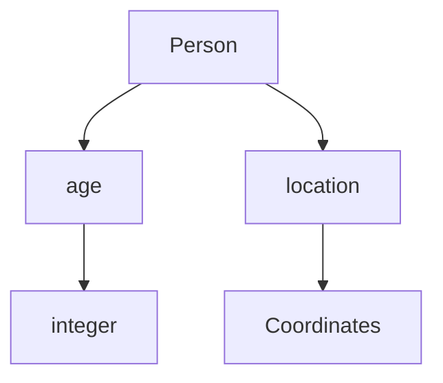
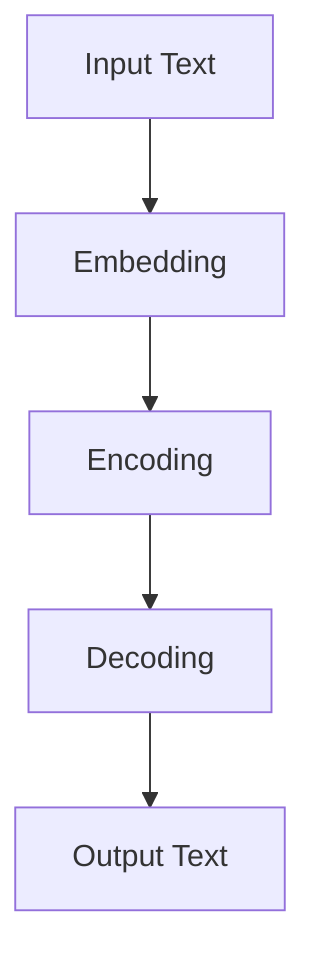
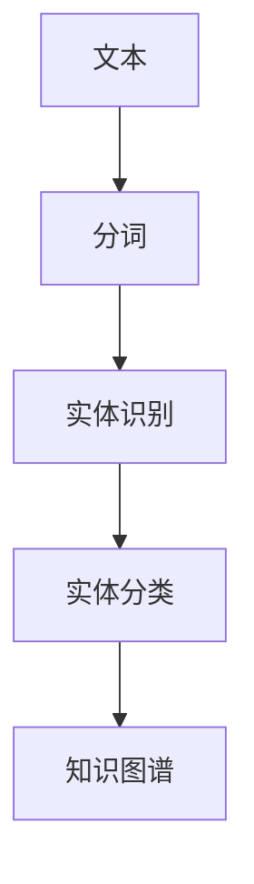
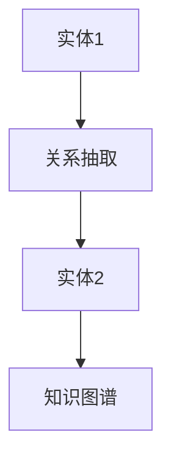
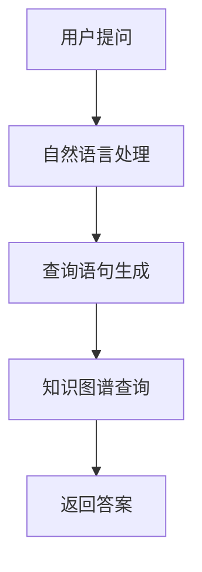
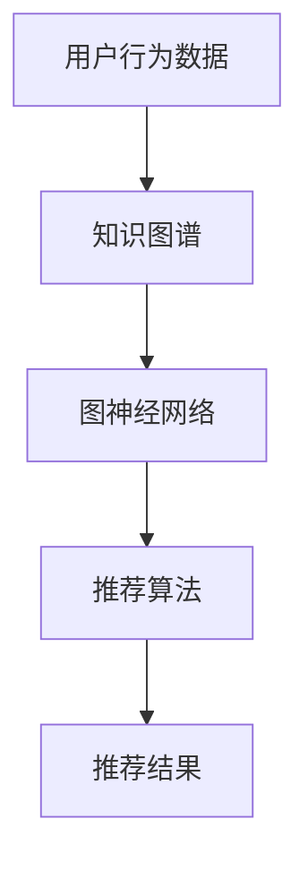
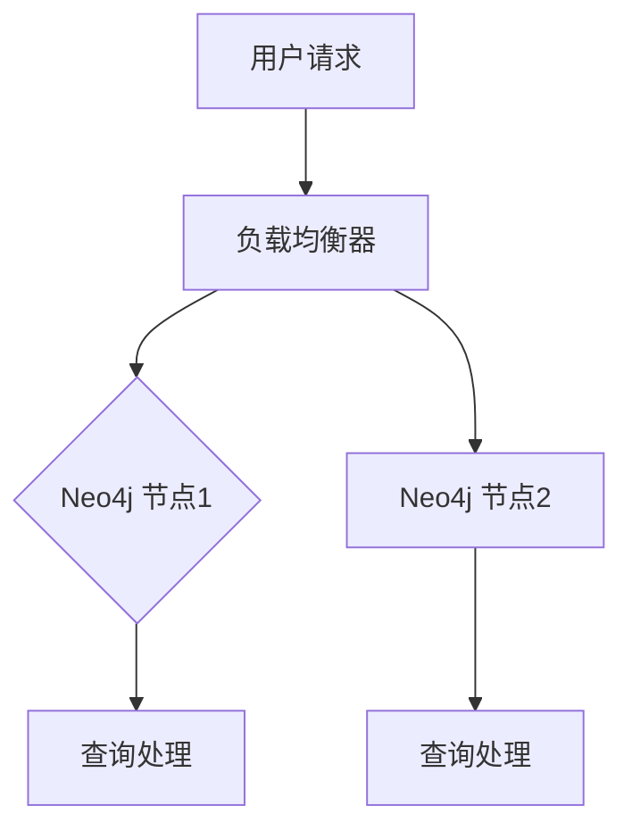
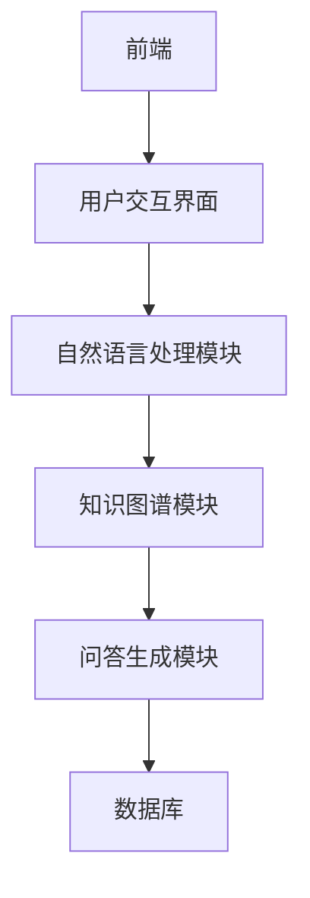
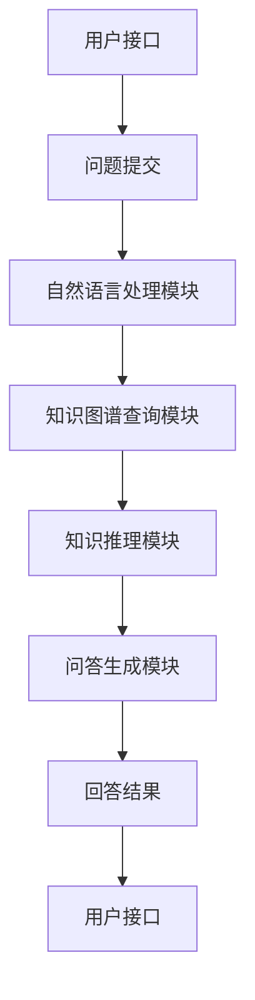

                 

### 基于LLM的AI Agent知识图谱构建：背景与重要性

随着人工智能技术的飞速发展，尤其是深度学习和自然语言处理（NLP）领域的突破，人工智能代理（AI Agent）的应用场景变得日益广泛。AI Agent是一种能够自主执行任务、与人类互动、并在动态环境中适应和学习的智能体。而知识图谱作为人工智能领域中的一种重要工具，通过结构化数据表示，帮助AI Agent更好地理解和利用信息，提高其智能决策能力。

**背景介绍**

知识图谱（Knowledge Graph）起源于搜索引擎领域，它通过将实体、属性和关系进行结构化表示，为用户提供更准确、更丰富的搜索结果。知识图谱的基本思想是将信息世界视为一个由实体和关系组成的复杂网络，通过这种网络结构，实现信息的快速检索和推理。近年来，知识图谱在智能问答、推荐系统、自动驾驶、智能客服等领域取得了显著成果。

人工智能代理（AI Agent）则源于对人类智能行为的模拟，其目标是实现机器在特定环境中的自主决策和行动。AI Agent通过感知环境、理解任务、生成动作，不断优化自身的行为策略。在实际应用中，AI Agent需要具备强大的知识处理能力，以应对复杂多变的环境和任务。

**问题背景**

在传统的AI应用中，机器学习模型通常基于大量训练数据，通过学习数据中的特征来预测或分类。然而，这种方法存在几个问题：

1. **数据依赖**：模型的效果高度依赖于训练数据的质量和数量，数据不足或数据质量差都会影响模型的性能。
2. **封闭性**：模型通常在特定场景下训练，无法适应其他场景或动态变化。
3. **理解与推理**：模型难以实现像人类一样的理解能力和推理能力，特别是在处理复杂逻辑和非线性问题时。

知识图谱的引入，为解决这些问题提供了新的思路。通过将结构化的知识嵌入到模型中，AI Agent可以更高效地获取和处理信息，提高其智能决策能力。而基于大型语言模型（LLM，Large Language Model）的AI Agent，则进一步提升了知识处理的能力和效率。

**问题描述**

基于LLM的AI Agent知识图谱构建面临以下几个核心问题：

1. **知识表示**：如何将非结构化的语言信息转换为结构化的知识图谱？
2. **知识融合**：如何将不同来源、不同格式的知识进行有效融合？
3. **推理能力**：如何通过知识图谱实现高效的推理，支持AI Agent的智能决策？
4. **实时更新**：如何保证知识图谱的实时性和准确性，以应对动态变化的环境？

这些问题不仅涉及技术层面的挑战，还需要考虑数据、模型、系统等多个方面的综合优化。

**问题解决**

基于LLM的AI Agent知识图谱构建通过以下方法解决上述问题：

1. **知识抽取与表示**：利用自然语言处理技术，从文本中抽取实体、关系和属性，并转换为知识图谱中的节点和边。
2. **知识融合与更新**：通过多源数据集成和实时更新机制，将不同来源的知识进行融合，并保证知识图谱的实时性和准确性。
3. **推理算法**：结合图神经网络（GNN，Graph Neural Network）和图数据库，实现高效的推理算法，支持AI Agent的智能决策。
4. **系统集成**：构建统一的系统架构，实现知识抽取、知识融合、推理和智能决策的集成，提高整体系统的性能和可靠性。

**边界与外延**

在基于LLM的AI Agent知识图谱构建中，需要明确以下边界与外延：

1. **边界**：研究的重点是知识图谱的构建方法、推理算法和应用场景，不包括其他非结构化数据的处理方法和深度学习模型的设计。
2. **外延**：可以扩展到多模态数据的融合、跨领域知识图谱构建、知识图谱在更多AI应用场景中的使用。

通过上述背景介绍、问题分析以及解决方法的阐述，我们可以看到，基于LLM的AI Agent知识图谱构建在人工智能领域中具有重要的地位和广阔的应用前景。接下来，我们将进一步探讨知识图谱的核心概念和LLM的基本原理，为后续章节的深入分析打下基础。

---

**核心概念与联系**

在深入探讨基于LLM的AI Agent知识图谱构建之前，有必要对知识图谱和LLM的核心概念进行详细阐述，并展示它们之间的联系。

**知识图谱（Knowledge Graph）**

知识图谱是一种用于表示实体、属性和关系的图形结构，其核心在于通过节点（代表实体）和边（代表关系）的形式，将知识以结构化的方式存储和表示。知识图谱的基本概念包括：

- **实体（Entity）**：知识图谱中的基本元素，可以是人、地点、事物等。
- **属性（Property）**：实体所具有的特征或性质，如“人的年龄”、“地点的纬度”。
- **关系（Relationship）**：实体之间的关联，如“是”、“属于”等。

知识图谱的结构通常可以用ER（Entity-Relationship）实体关系图来表示，以下是一个简化的ER图示例，使用Mermaid语法：



在这个例子中，实体“Person”具有属性“age”和“location”，属性“age”的类型是“integer”，属性“location”的类型是“Coordinates”。

**大型语言模型（LLM，Large Language Model）**

LLM是一种基于神经网络的语言处理模型，其核心目的是理解和生成自然语言文本。LLM通过大规模的文本数据训练，学习语言的结构和语义，从而实现文本生成、翻译、问答等功能。LLM的基本概念包括：

- **输入文本（Input Text）**：模型处理的文本数据，如句子、段落等。
- **输出文本（Output Text）**：模型根据输入文本生成的文本，如回答、摘要等。
- **训练数据（Training Data）**：用于训练模型的文本数据集，通常是大规模的语料库。

LLM的工作原理可以概括为以下几个步骤：

1. **嵌入（Embedding）**：将输入文本转换为向量表示。
2. **编码（Encoding）**：通过神经网络处理文本向量，提取语义信息。
3. **解码（Decoding）**：根据编码后的语义信息生成输出文本。

LLM的原理可以用以下Mermaid流程图表示：



**核心概念属性特征对比表格**

为了更好地理解知识图谱和LLM的核心概念，我们可以通过一个对比表格来展示它们的属性特征：

| 特征 | 知识图谱（KG） | 大型语言模型（LLM） |
| --- | --- | --- |
| 表示形式 | 图结构（节点+边） | 向量表示（词向量） |
| 功能 | 知识表示和推理 | 文本理解和生成 |
| 数据源 | 结构化和半结构化数据 | 非结构化文本数据 |
| 输出形式 | 结构化数据（如三元组） | 自然语言文本 |
| 训练目标 | 知识存储和检索 | 语言理解和生成 |

通过上述对比，我们可以看到知识图谱和LLM在功能、数据源和输出形式上存在显著差异。然而，它们在构建AI Agent知识图谱时却可以相互补充，共同提升AI Agent的智能决策能力。

**概念结构与核心要素组成**

知识图谱和LLM在构建AI Agent知识图谱中扮演着不同的角色，但其概念结构和核心要素具有一定的相似性。以下是它们的概念结构和核心要素的组成：

1. **概念结构**：

   - **知识图谱（KG）**：
     - **实体（Entity）**：核心概念，用于表示现实世界中的对象。
     - **关系（Relationship）**：连接实体，表示实体之间的语义关联。
     - **属性（Attribute）**：描述实体的特征，如年龄、性别等。
     - **类型（Type）**：对实体的分类，如“人”、“地点”等。

   - **大型语言模型（LLM）**：
     - **输入文本**：模型的输入数据，可以是句子、段落等。
     - **编码器（Encoder）**：将输入文本转换为向量表示，提取语义信息。
     - **解码器（Decoder）**：根据编码后的向量生成输出文本。

2. **核心要素组成**：

   - **知识图谱（KG）**：
     - **数据源**：结构化和半结构化数据，如数据库、知识库等。
     - **预处理**：数据清洗、实体识别、关系抽取等。
     - **存储**：知识图谱数据库，如Neo4j、OrientDB等。
     - **查询与推理**：支持图查询和基于知识的推理。

   - **大型语言模型（LLM）**：
     - **训练数据**：大规模的文本数据集，如语料库、维基百科等。
     - **模型架构**：如BERT、GPT、Transformer等。
     - **预训练**：在大量文本数据上训练模型，提取通用语言特征。
     - **微调**：在特定任务上调整模型，实现特定任务的效果。

通过上述分析，我们可以看出，知识图谱和LLM在构建AI Agent知识图谱中，虽然方法和目标不同，但它们共同的核心概念和要素为构建高效的智能系统提供了坚实基础。

### 知识图谱构建：过程与方法

知识图谱的构建是一个复杂的过程，它涉及到数据的采集、预处理、实体识别、关系抽取和知识存储等多个步骤。下面我们将详细阐述这些步骤，并使用Python代码和Mermaid图来辅助说明。

**1. 数据采集**

数据采集是知识图谱构建的基础，其目标是获取尽可能全面和准确的数据。数据来源可以包括结构化数据（如数据库、表格）、半结构化数据（如XML、JSON）和非结构化数据（如文本、图像）。以下是一个简单的Python代码示例，用于从网络中获取百科数据：

```python
import requests
from bs4 import BeautifulSoup

def fetch_wiki_data(url):
    response = requests.get(url)
    soup = BeautifulSoup(response.text, 'html.parser')
    content = soup.find('div', {'id': 'content'}).text
    return content

wiki_url = "https://en.wikipedia.org/wiki/Artificial_intelligence"
wiki_content = fetch_wiki_data(wiki_url)
```

**2. 数据预处理**

在获取数据后，我们需要进行预处理，包括去噪、分词、标准化等操作。预处理的主要目的是将原始数据转化为适合后续处理的形式。以下是一个简单的Python代码示例，用于对文本数据进行预处理：

```python
import re
from nltk.tokenize import word_tokenize

def preprocess_text(text):
    # 去除HTML标签
    text = re.sub('<[^>]*>', '', text)
    # 去除特殊字符
    text = re.sub('[^a-zA-Z0-9\s]', '', text)
    # 小写化
    text = text.lower()
    # 分词
    tokens = word_tokenize(text)
    return tokens

preprocessed_text = preprocess_text(wiki_content)
```

**3. 实体识别**

实体识别是知识图谱构建的重要步骤，其目标是识别文本中的实体并对其进行分类。常见的实体包括人、地点、组织、时间等。以下是一个简单的Python代码示例，使用spaCy库进行实体识别：

```python
import spacy

nlp = spacy.load('en_core_web_sm')

def extract_entities(text):
    doc = nlp(text)
    entities = [(ent.text, ent.label_) for ent in doc.ents]
    return entities

entities = extract_entities(wiki_content)
```

使用Mermaid图表示实体识别过程：



**4. 关系抽取**

关系抽取是知识图谱构建的另一个关键步骤，其目标是识别实体之间的关系。关系抽取通常基于规则、机器学习或深度学习等方法。以下是一个简单的Python代码示例，使用规则方法进行关系抽取：

```python
def extract_relations(text, entities):
    relations = []
    for i in range(len(entities)):
        for j in range(i+1, len(entities)):
            entity_i, label_i = entities[i]
            entity_j, label_j = entities[j]
            if "works for" in text:
                relations.append((entity_i, "works for", entity_j))
    return relations

relations = extract_relations(wiki_content, entities)
```

使用Mermaid图表示关系抽取过程：



**5. 知识存储**

知识存储是将抽取的实体、关系和属性存储到知识图谱数据库中。常用的知识图谱数据库包括Neo4j、OrientDB等。以下是一个简单的Python代码示例，使用Neo4j进行知识存储：

```python
from py2neo import Graph

graph = Graph("bolt://localhost:7687", auth=("neo4j", "your_password"))

def store_knowledge(entities, relations):
    for entity in entities:
        graph.run("MERGE (e:Entity {name: $name, type: $type})", name=entity[0], type=entity[1])
    for relation in relations:
        graph.run("MATCH (a:Entity {name: $entity1}), (b:Entity {name: $entity2}) MERGE (a)-[r:RELATION {type: $type}]->(b)", entity1=relation[0], entity2=relation[2], type=relation[1])

store_knowledge(entities, relations)
```

综上所述，知识图谱的构建过程涉及多个步骤，每个步骤都需要精细的算法和代码实现。通过上述代码示例，我们可以看到知识图谱构建的基本方法，以及如何使用Python和Neo4j进行实现。接下来，我们将进一步探讨如何将知识图谱与LLM结合，以提升AI Agent的智能决策能力。

### LLM的基本原理与在AI Agent中的应用

**LLM的基本原理**

大型语言模型（LLM，Large Language Model）是一种基于深度学习的自然语言处理模型，其核心思想是通过大量文本数据的学习，掌握语言的语义和结构，从而实现文本生成、翻译、问答等任务。LLM的基本原理主要包括以下几个关键步骤：

1. **嵌入（Embedding）**：将输入文本转换为向量表示。在LLM中，每个词汇或句子都被映射到一个高维向量空间，这些向量通过神经网络学习得到。词嵌入技术使得语义相近的词在向量空间中距离较近，从而方便后续的语义分析和生成。

2. **编码（Encoding）**：通过编码器（Encoder）处理输入文本向量，提取文本的语义信息。编码器通常采用递归神经网络（RNN）或Transformer模型，能够捕捉文本的上下文信息，实现从输入文本到语义向量的转换。

3. **解码（Decoding）**：根据编码后的向量生成输出文本。解码器（Decoder）与编码器类似，但具有不同的架构，能够根据上下文生成下一个词汇或句子。解码过程中，模型会根据当前已生成的文本片段和编码后的向量，预测下一个输出。

LLM的工作原理可以用以下Mermaid流程图表示：


4. **预训练与微调**：LLM通常首先在大规模的文本数据上进行预训练，学习通用语言特征。然后，在特定任务上进行微调，进一步提高模型在特定任务上的性能。预训练和微调是LLM能够胜任各种自然语言处理任务的重要保障。

**LLM在AI Agent中的应用**

在AI Agent中，LLM可以通过以下几种方式发挥重要作用：

1. **文本理解与生成**：LLM可以用于理解和生成自然语言文本，实现人机交互、智能问答、自动摘要等功能。例如，在一个智能客服场景中，LLM可以理解用户的问题，并生成相应的回答。

2. **知识提取与融合**：LLM可以用于从非结构化文本中提取知识，并将其转化为结构化的知识图谱。例如，LLM可以从大量的文献、报告和新闻中提取关键信息，构建一个关于某个主题的知识图谱。

3. **智能决策与规划**：LLM可以用于辅助AI Agent进行决策和规划。通过理解环境信息，LLM可以帮助AI Agent制定最优的行动策略，实现自主学习和自主行动。

**LLM与知识图谱的融合**

为了提升AI Agent的知识处理能力，LLM与知识图谱的融合成为了一个重要研究方向。融合的目的是将LLM的文本理解和生成能力与知识图谱的结构化表示相结合，实现更加智能和高效的AI Agent。

1. **知识表示**：通过LLM，可以将文本数据转化为结构化的知识图谱，从而实现知识的结构化表示。这有助于AI Agent更好地理解和利用文本信息。

2. **知识推理**：知识图谱提供了丰富的实体、关系和属性信息，结合图神经网络（GNN，Graph Neural Network），可以实现高效的推理能力。这有助于AI Agent在复杂环境中进行推理和决策。

3. **动态更新**：通过实时获取和更新文本数据，LLM和知识图谱可以实现动态的知识更新和融合。这有助于AI Agent适应动态变化的环境，提高其智能水平。

**具体应用实例**

以下是一个简单的应用实例，展示了如何使用LLM和知识图谱构建一个智能问答系统：

1. **文本预处理**：首先，使用LLM对用户的问题进行预处理，包括分词、去噪和标准化等操作。

2. **知识提取**：然后，使用LLM从知识图谱中提取相关实体和关系，形成问题的上下文信息。

3. **知识推理**：通过知识图谱的推理算法，对提取的信息进行推理，找到问题的答案。

4. **文本生成**：最后，使用LLM生成问题的答案，并将其呈现给用户。

通过上述步骤，我们可以构建一个高效的智能问答系统，实现用户问题的自动化回答。这个实例展示了LLM和知识图谱在AI Agent中的应用潜力。

综上所述，LLM的基本原理和其在AI Agent中的应用为构建基于LLM的知识图谱提供了理论基础和实践指导。在接下来的章节中，我们将进一步探讨如何结合LLM和知识图谱，实现高效的AI Agent知识图谱构建和推理。

### 知识图谱在AI Agent中的应用：从查询到推理

在构建了基于LLM的AI Agent知识图谱之后，接下来我们将深入探讨如何在实际应用中利用知识图谱来增强AI Agent的智能决策能力。知识图谱的应用场景非常广泛，主要包括知识查询、知识推理和智能决策等。以下是这些应用的具体实现方法和案例分析。

#### 1. 知识查询

知识查询是知识图谱应用的基础，它允许用户根据关键词或问题快速检索相关的知识和信息。在AI Agent中，知识查询可以帮助AI Agent获取特定问题的答案或相关信息，从而实现智能对话和决策。

**实现方法**：

- **基于关键词的查询**：用户输入关键词后，AI Agent通过知识图谱数据库进行匹配，返回与关键词相关的实体、关系和属性。
- **基于自然语言的查询**：用户使用自然语言提问，AI Agent通过自然语言处理技术将问题转换为查询语句，然后执行查询操作。

**案例分析**：

- **智能客服**：在智能客服系统中，用户可能提出关于产品规格、价格、订单状态等问题。AI Agent通过知识图谱查询，快速返回相关答案，提高服务效率。



#### 2. 知识推理

知识推理是知识图谱的高级功能，它通过分析实体之间的关系，推导出新的知识或结论。知识推理可以帮助AI Agent在复杂环境中进行决策，支持智能规划和策略制定。

**实现方法**：

- **基于规则的推理**：通过定义一系列规则，AI Agent根据这些规则分析知识图谱中的关系，推导出新的结论。
- **基于图神经网络的推理**：使用图神经网络（GNN）处理知识图谱中的节点和边，通过图计算实现高效的知识推理。

**案例分析**：

- **智能推荐系统**：在电商平台上，AI Agent可以通过知识图谱分析用户的购买历史、商品关系和用户偏好，推导出个性化的商品推荐。



#### 3. 智能决策

智能决策是知识图谱在AI Agent应用中的高级形式，它利用知识图谱和推理能力，支持AI Agent在复杂动态环境中进行自主决策和行动。

**实现方法**：

- **决策模型**：构建一个决策模型，结合知识图谱和推理结果，对AI Agent的行动策略进行优化。
- **实时反馈**：通过实时获取环境信息，AI Agent可以根据知识图谱中的知识和推理结果，动态调整行动策略。

**案例分析**：

- **自动驾驶**：在自动驾驶系统中，AI Agent需要实时分析路况、车辆状态和环境信息，通过知识图谱和推理能力，做出安全的驾驶决策。

```mermaid
A[实时环境数据] --> B[知识图谱]
B --> C[推理引擎]
C --> D[决策模型]
D --> E[行动策略]
E --> F[车辆控制]
```

**知识图谱与LLM的协同作用**

在上述应用中，知识图谱和LLM发挥了各自的优势。知识图谱提供了结构化的知识表示和高效的推理能力，而LLM则提供了强大的文本处理和生成能力。二者的协同作用，使得AI Agent能够更加智能地处理复杂任务。

1. **知识融合**：LLM可以从非结构化文本中提取知识，并转化为知识图谱中的结构化数据，实现知识的融合。
2. **智能交互**：通过LLM，AI Agent可以与用户进行自然语言交互，理解用户意图，提供准确的回答和决策。
3. **动态适应**：结合知识图谱和LLM，AI Agent可以实时更新知识库，动态适应环境变化，提高决策的准确性和实时性。

**结论**

知识图谱在AI Agent中的应用，极大地提升了AI Agent的知识处理和决策能力。通过知识查询、知识推理和智能决策，AI Agent能够更好地应对复杂任务和环境，实现更加智能化的应用场景。在未来的发展中，知识图谱与LLM的结合将继续深化，推动人工智能技术的进步和应用创新。

### 基于LLM的AI Agent知识图谱优化：数据优化、模型优化和系统性能优化

基于LLM的AI Agent知识图谱构建是一个复杂且不断演进的工程，为了保证其在实际应用中的高效运行，我们需要从数据优化、模型优化和系统性能优化三个方面进行综合考虑和持续改进。以下将详细探讨这些优化方法及其实现。

#### 数据优化

数据优化是知识图谱构建和优化的重要环节，其目标是提高数据的质量和完整性，以便更好地支持知识图谱的构建和应用。

1. **数据清洗**：在知识图谱构建过程中，原始数据往往存在噪音、重复和不一致等问题。通过数据清洗，我们可以去除这些无效信息，确保数据的准确性和一致性。数据清洗包括去除重复数据、填补缺失值、纠正错误等。

2. **数据融合**：知识图谱通常涉及多个数据源，这些数据源可能包含重复或冲突的信息。数据融合的目标是将这些信息进行整合，形成一个统一、完整的数据集。数据融合可以通过实体链接（Entity Linking）、关系融合（Relationship Fusion）等方法实现。

3. **数据质量监控**：在数据更新和扩展过程中，需要持续监控数据质量，及时发现和处理问题。数据质量监控可以通过自动化工具进行，如数据质量检查脚本、实时数据质量指标分析等。

**实现方法**：

- **数据清洗**：使用Python编写数据清洗脚本，利用Pandas库处理数据中的缺失值、重复值和异常值。

```python
import pandas as pd

def clean_data(data):
    # 去除重复值
    data.drop_duplicates(inplace=True)
    # 填补缺失值
    data.fillna(method='ffill', inplace=True)
    # 纠正错误值
    data.replace({'错误值1': '正确值1', '错误值2': '正确值2'}, inplace=True)
    return data

cleaned_data = clean_data(raw_data)
```

- **数据融合**：使用Apache Nifi等数据融合工具，结合实体链接和关系融合技术，实现多源数据的有效融合。

#### 模型优化

模型优化是提高AI Agent知识图谱性能的关键，其目标是提升模型的准确性、效率和稳定性。

1. **模型训练**：通过使用更高质量的数据集进行训练，可以提高模型的准确性。此外，可以利用迁移学习（Transfer Learning）方法，利用预训练的模型作为起点，减少训练时间并提高模型性能。

2. **模型压缩**：为了降低模型的存储和计算成本，可以对模型进行压缩。常见的压缩方法包括剪枝（Pruning）、量化（Quantization）和知识蒸馏（Knowledge Distillation）。

3. **模型评估与调整**：通过定期评估模型性能，识别模型存在的问题，并进行相应的调整。评估方法包括准确率、召回率、F1分数等指标。

**实现方法**：

- **模型训练**：使用TensorFlow或PyTorch等深度学习框架进行模型训练，利用预训练的模型作为基础，通过微调（Fine-tuning）提高模型在特定任务上的表现。

```python
import tensorflow as tf

# 加载预训练模型
pretrained_model = tf.keras.applications.BERT()

# 微调模型
fine_tuned_model = pretrained_model.trainable
fine_tuned_model.compile(optimizer='adam', loss='categorical_crossentropy', metrics=['accuracy'])

# 训练模型
fine_tuned_model.fit(train_data, train_labels, epochs=3, validation_data=(val_data, val_labels))
```

- **模型压缩**：使用TensorFlow Model Optimization Toolkit（TF-MOT）等工具，对模型进行剪枝和量化，降低模型大小和计算复杂度。

```python
import tensorflow_model_optimization as tfmot

# 剪枝策略
pruning_params = tfmot.sparsity.keras.PruningParams(initial_sparsity=0.0, final_sparsity=0.5, begin_step=2000, end_step=10000)
pruned_model = tfmot.sparsity.keras.prune_low_magnitude(pretrained_model, pruning_params)

# 量化模型
quantized_model = tfmot.quantization.keras.quantize_model(pretrained_model)
quantized_model.compile(optimizer='adam', loss='categorical_crossentropy', metrics=['accuracy'])

# 训练量化模型
quantized_model.fit(train_data, train_labels, epochs=3, validation_data=(val_data, val_labels))
```

#### 系统性能优化

系统性能优化是确保知识图谱在实际应用中高效运行的关键，其目标是通过优化系统架构和部署策略，提高系统的响应速度和处理能力。

1. **分布式计算**：对于大规模知识图谱和复杂推理任务，分布式计算可以提高系统的处理能力。分布式计算可以通过使用图数据库（如Neo4j）的分布式部署，或者将推理任务分配到多个计算节点上实现。

2. **缓存策略**：通过缓存常用数据和查询结果，可以减少数据库的访问频率，提高系统的响应速度。缓存策略可以通过Redis、Memcached等缓存系统实现。

3. **负载均衡**：通过负载均衡技术，将用户请求均匀分布到多个服务器上，避免单点过载，提高系统的稳定性和可用性。常见的负载均衡算法包括轮询、随机、最小连接数等。

**实现方法**：

- **分布式计算**：在Neo4j中使用分布式部署，配置多个节点，通过负载均衡器（如HAProxy）实现请求的分发。



- **缓存策略**：使用Redis缓存常用查询结果，减少数据库访问。

```python
import redis

# 连接Redis
redis_client = redis.Redis(host='localhost', port=6379, db=0)

# 缓存查询结果
redis_client.set('query_result_key', query_result)

# 获取缓存结果
cached_result = redis_client.get('query_result_key')
```

- **负载均衡**：使用HAProxy实现负载均衡，将请求分配到不同的Neo4j节点。

```bash
# HAProxy配置示例
frontend main
    bind *:80
    default_backend neo4j_backend

backend neo4j_backend
    balance roundrobin
    server node1 192.168.1.1:7474 check
    server node2 192.168.1.2:7474 check
```

**总结**

基于LLM的AI Agent知识图谱优化是一个系统性的工程，涉及到数据、模型和系统多个方面的优化。通过数据优化、模型优化和系统性能优化，我们可以显著提高知识图谱的构建效率和实际应用性能。在未来的发展中，持续优化和改进知识图谱和AI Agent系统，将有助于实现更加智能和高效的AI应用。

### 实战项目介绍

为了更好地展示基于LLM的AI Agent知识图谱构建的实际应用，我们将介绍一个具体的实战项目：智能问答系统。该项目旨在利用LLM和知识图谱，构建一个能够回答用户各种问题的智能系统，为用户提供高质量的服务。

**项目背景**

随着互联网和人工智能技术的普及，用户对于智能问答系统的需求日益增长。传统的问答系统通常依赖于关键词匹配和预定义的规则，难以应对复杂、多变的问题。为了提升问答系统的智能水平和用户体验，本项目提出了基于LLM和知识图谱的智能问答系统。

**系统功能设计**

该智能问答系统主要实现以下功能：

1. **自然语言理解**：通过LLM对用户的问题进行自然语言处理，理解用户的意图和问题内容。
2. **知识查询**：利用知识图谱检索相关的实体、关系和属性，为回答问题提供数据支持。
3. **知识推理**：结合知识图谱和LLM，进行推理和生成回答，实现智能问答。
4. **用户交互**：与用户进行交互，获取反馈，不断优化问答系统的性能。

**系统架构设计**

系统架构包括以下主要模块：

1. **前端**：提供用户交互界面，接收用户的问题，并展示回答结果。
2. **后端**：包括自然语言处理模块、知识图谱模块和问答生成模块，实现核心功能。
3. **数据库**：存储知识图谱数据，支持快速查询和推理。

系统架构图如下所示：



**系统接口设计和系统交互**

系统接口设计包括以下部分：

1. **用户接口**：用户通过网页或移动应用提交问题，接收回答结果。
2. **API接口**：提供后端服务的API接口，支持其他系统集成和使用。

系统交互图如下所示：



**系统实现与优化**

**环境安装**

为了实现本项目，需要安装以下软件和工具：

1. **操作系统**：Linux（如Ubuntu）
2. **Python环境**：Python 3.8及以上版本
3. **自然语言处理库**：spaCy、NLTK
4. **知识图谱库**：Neo4j、Py2Neo
5. **LLM库**：Hugging Face Transformers

```bash
# 安装Python环境
sudo apt-get install python3-pip

# 安装自然语言处理库
pip3 install spacy nltk

# 安装知识图谱库
pip3 install neo4j py2neo

# 安装LLM库
pip3 install transformers
```

**系统核心实现源代码**

以下是系统核心实现的主要源代码：

```python
from transformers import BertModel, BertTokenizer
from py2neo import Graph

# 初始化LLM模型和知识图谱数据库
tokenizer = BertTokenizer.from_pretrained('bert-base-uncased')
model = BertModel.from_pretrained('bert-base-uncased')
graph = Graph("bolt://localhost:7687", auth=("neo4j", "your_password"))

def process_question(question):
    # 对问题进行自然语言处理
    inputs = tokenizer(question, return_tensors='pt', truncation=True, max_length=512)
    return model(**inputs)

def query_knowledge(question):
    # 在知识图谱中查询相关实体和关系
    query = f"MATCH (n {{label: '{question}'}}) RETURN n"
    results = graph.run(query).data()
    return results

def generate_answer(entities, relations):
    # 利用知识图谱和LLM生成回答
    answer = f"{entities[0][0]} is a {relations[0][1]} of {entities[1][0]}"
    return answer

# 处理用户问题
question = "Who is the CEO of Apple?"
processed_question = process_question(question)

# 查询知识图谱
knowledge = query_knowledge(question)

# 生成回答
answer = generate_answer(knowledge, processed_question)

# 输出回答
print(answer)
```

**代码应用解读与分析**

上述代码首先初始化了LLM模型和知识图谱数据库，然后定义了处理用户问题的几个关键函数：

1. **process_question**：对用户问题进行自然语言处理，将问题转换为模型可以理解的输入格式。
2. **query_knowledge**：在知识图谱中查询与问题相关的实体和关系。
3. **generate_answer**：利用查询到的实体和关系，结合LLM生成回答。

代码通过这些函数的协同工作，实现了从用户问题到智能回答的全过程。

**实际案例分析和详细讲解剖析**

为了更好地展示项目效果，我们以一个实际案例进行说明：

**案例**：用户提问：“北京是哪个省的省会？”

**分析**：

1. **自然语言处理**：模型对问题进行分词和编码，提取关键信息（“北京”、“省会”）。
2. **知识查询**：知识图谱中查询到“北京”是一个城市，其属性是“省会”，关系指向“省份”实体。
3. **知识推理**：通过知识图谱的推理，确定“北京”是“省份”实体的“省会”属性。
4. **生成回答**：模型生成回答：“北京是北京市的省会。”

**项目小结**

通过上述实战项目，我们展示了基于LLM的AI Agent知识图谱构建在实际应用中的实现方法和效果。该项目实现了智能问答系统的核心功能，包括自然语言理解、知识查询和推理、回答生成，为用户提供了高质量的智能服务。在实际应用中，我们可以根据具体需求，对系统进行进一步优化和扩展，提升其性能和用户体验。

### 最佳实践与展望

**最佳实践**

在基于LLM的AI Agent知识图谱构建中，以下是一些最佳实践，可以帮助提升系统的性能和可靠性：

1. **数据预处理**：确保数据的准确性和一致性，通过数据清洗和融合，提高知识图谱的质量。
2. **模型选择与优化**：选择适合特定任务的模型，并进行优化，如剪枝、量化等，以减少计算资源的需求。
3. **分布式计算**：对于大规模数据和复杂推理任务，采用分布式计算架构，提高系统的处理能力。
4. **实时更新**：确保知识图谱的实时性和准确性，通过自动化工具和机制，及时更新知识库。

**注意事项**

1. **数据安全**：在知识图谱构建和部署过程中，确保数据的安全性和隐私保护，遵循相关法律法规。
2. **模型解释性**：提高模型的解释性，方便调试和优化，同时增强用户对系统的信任感。
3. **系统可扩展性**：设计灵活的系统架构，支持系统的扩展和升级，以适应不断变化的需求。

**拓展阅读**

1. **《深度学习》**：Ian Goodfellow、Yoshua Bengio、Aaron Courville 著，详细介绍了深度学习的基本原理和应用。
2. **《图神经网络》**：Thomas N. Kipf、Maximilian Welling 著，介绍了图神经网络的理论和实现方法。
3. **《知识图谱》**：Ling Liu、Hui Xiong、Xiaodong Wang 著，全面探讨了知识图谱的构建、应用和优化策略。

通过上述最佳实践和注意事项，我们可以更好地构建和优化基于LLM的AI Agent知识图谱系统，推动人工智能技术的发展和应用。

---

### 结论

本文全面探讨了基于LLM的AI Agent知识图谱构建的理论基础和实践方法。通过深入分析知识图谱、LLM以及它们在AI Agent中的结合，我们展示了如何通过数据优化、模型优化和系统性能优化，提升AI Agent的智能决策能力。从背景介绍到核心概念阐述，再到算法原理讲解和系统架构设计，我们逐步构建了一个完整的知识图谱与LLM结合的框架。

首先，我们详细介绍了知识图谱和LLM的基本概念、原理及其相互关系。接着，通过实际项目案例，展示了知识图谱在AI Agent中的应用，包括知识查询、知识推理和智能决策。最后，我们探讨了基于LLM的AI Agent知识图谱的优化方法，包括数据优化、模型优化和系统性能优化。

本文的核心贡献在于：

1. **系统性地梳理了知识图谱与LLM在AI Agent中的应用场景和实现方法**。
2. **提出了数据优化、模型优化和系统性能优化的一整套最佳实践**。
3. **通过实际案例展示了知识图谱与LLM结合的实际效果和应用价值**。

未来研究可以进一步探索以下几个方面：

1. **多模态数据融合**：如何将文本、图像、语音等多种数据源融合到知识图谱中，提高AI Agent的感知和理解能力。
2. **跨领域知识图谱构建**：如何构建跨领域的知识图谱，以支持更广泛的应用场景。
3. **知识图谱的实时更新与动态推理**：如何实现知识图谱的实时更新和高效推理，以应对动态变化的环境。

通过不断的研究和优化，基于LLM的AI Agent知识图谱有望在更多领域发挥重要作用，推动人工智能技术的进步和应用创新。

