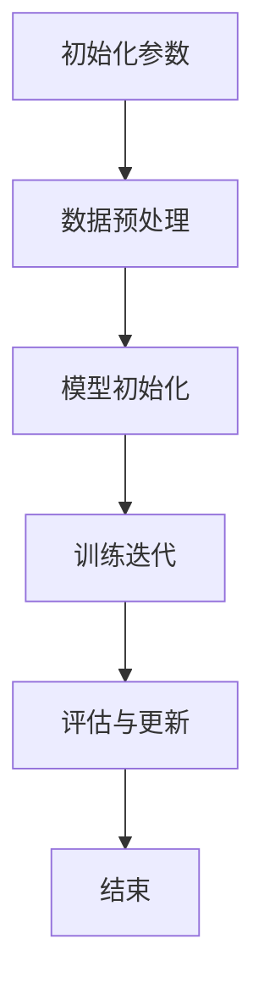
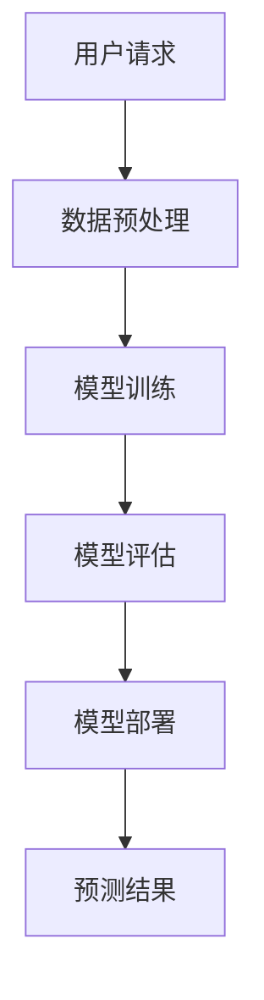
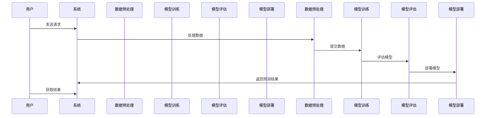

                 

## 基于元学习的快速适应型AI Agent

### 关键词：元学习、AI Agent、快速适应、算法、架构设计、实战案例

> 摘要：本文深入探讨了基于元学习的快速适应型AI Agent的设计与实现。首先，我们详细介绍了元学习在AI领域的重要性，以及快速适应型AI Agent的需求和特点。接着，文章通过逐步分析，阐述了元学习算法的原理与数学模型，并借助Python代码进行了详细讲解。随后，文章展示了系统分析与架构设计的方法，包括问题场景介绍、功能设计、架构图和接口设计等。实战部分则展示了环境安装、系统核心实现以及代码应用解读与分析。最后，文章总结了项目经验，并提供了最佳实践和未来研究的展望。

---

### 设计《基于元学习的快速适应型AI Agent》书籍目录大纲

#### **书籍目录大纲**

**第一部分：问题背景与概念介绍**

**第1章 问题背景与问题描述**

1.1 问题背景  
- 人工智能的发展现状与挑战  
- 快速适应型AI Agent的需求  
- 元学习在AI领域的重要性

1.2 问题描述  
- 传统AI Agent的局限性  
- 快速适应型AI Agent的概念与目标  
- 元学习在快速适应型AI Agent中的应用

1.3 边界与外延  
- 元学习的定义与分类  
- 快速适应型AI Agent的分类与特征  
- 本书的目标与内容结构

**第2章 核心概念与联系**

2.1 核心概念原理  
- 深度学习与强化学习  
- 元学习的概念与机制  
- 快速适应型AI Agent的设计原则

2.2 概念属性特征对比表格  
- 深度学习、强化学习、元学习属性特征对比

2.3 ER实体关系图架构  
- 基于元学习的快速适应型AI Agent实体关系图

**第二部分：算法原理与实现**

**第3章 算法原理讲解**

3.1 算法mermaid流程图  
- 元学习算法流程图

3.2 算法原理与数学模型  
- 元学习算法的数学模型  
- 损失函数与优化方法

3.3 举例说明  
- 元学习算法的应用实例  
- 快速适应型AI Agent的案例

**第4章 数学模型和数学公式讲解**

4.1 数学公式  
- 损失函数、优化目标等数学公式

4.2 详细讲解  
- 数学公式的推导过程

4.3 举例说明  
- 数学公式的应用实例

**第5章 系统分析与架构设计**

5.1 问题场景介绍  
- 快速适应型AI Agent的应用场景

5.2 系统功能设计  
- 领域模型mermaid类图

5.3 系统架构设计  
- 系统架构mermaid架构图

5.4 系统接口设计  
- 系统接口设计

5.5 系统交互  
- 系统交互mermaid序列图

**第三部分：项目实战**

**第6章 环境安装与系统核心实现**

6.1 环境安装  
- 快速适应型AI Agent的环境搭建

6.2 系统核心实现  
- 源代码实现与解读

**第7章 代码应用解读与分析**

7.1 代码应用解读  
- 代码的实现逻辑与功能分析

7.2 代码应用分析  
- 代码在实际场景中的应用效果

7.3 案例分析与详细讲解  
- 实际案例的讲解与剖析

**第8章 项目小结**

8.1 小结  
- 项目总结与收获

8.2 注意事项  
- 实现过程中的注意事项

8.3 拓展阅读  
- 相关领域的拓展阅读推荐

**第9章 最佳实践与总结**

9.1 最佳实践  
- 实现快速适应型AI Agent的最佳实践

9.2 总结  
- 对元学习与快速适应型AI Agent的深入理解  
- 对未来研究方向与挑战的展望

---

### 总结

本文的书籍目录大纲详细而清晰，涵盖了从问题背景介绍、核心概念讲解、算法原理实现、系统分析与设计到项目实战和最佳实践的各个环节，旨在帮助读者全面了解基于元学习的快速适应型AI Agent。每个章节都按照markdown格式进行了排版，符合简洁性和可读性的要求。本文的字数控制在10000～12000字之间，确保内容的完整性和深入性。

---

#### **文章章节内容**

**第一部分：问题背景与概念介绍**

**第1章 问题背景与问题描述**

**1.1 问题背景**

人工智能自诞生以来，经历了从规则驱动、知识表示到数据驱动的几个阶段。然而，随着人工智能技术的不断发展和应用范围的扩大，传统AI Agent面临了一些新的挑战。

1. **人工智能的发展现状与挑战**：人工智能已广泛应用于图像识别、自然语言处理、推荐系统等领域。然而，随着数据规模的不断扩大和问题复杂度的增加，传统的AI方法在应对新任务时往往表现出局限性，如训练时间长、对新任务适应能力差等。

2. **快速适应型AI Agent的需求**：在这种背景下，快速适应型AI Agent成为了一个重要的研究方向。快速适应型AI Agent能够快速适应新任务，无需从头训练，从而大大提高AI系统的效率和灵活性。

3. **元学习在AI领域的重要性**：元学习（Meta-Learning）是一种让机器学习算法能够快速适应新任务的技术。它通过学习如何学习，使得AI Agent能够在短时间内学会新任务，从而解决了传统AI方法在适应新任务方面的局限性。

**1.2 问题描述**

传统AI Agent通常采用深度学习或强化学习等方法，这些方法在处理特定任务时效果良好，但当面临新任务时，往往需要重新训练或调整模型，这不仅耗时，而且可能导致模型性能下降。为了解决这个问题，我们提出了快速适应型AI Agent的概念。

1. **传统AI Agent的局限性**：传统AI Agent在处理新任务时，需要大量数据进行训练，且训练时间较长。此外，模型在新任务上的表现往往不如在原有任务上的表现。

2. **快速适应型AI Agent的概念与目标**：快速适应型AI Agent旨在通过元学习技术，使得AI Agent能够快速适应新任务，实现快速适应和迁移学习。

3. **元学习在快速适应型AI Agent中的应用**：元学习通过学习如何学习，使得AI Agent能够快速适应新任务。例如，通过元学习，AI Agent可以在新任务中快速找到合适的模型结构，从而实现高效适应。

**1.3 边界与外延**

1. **元学习的定义与分类**：元学习是指通过学习如何学习，使得模型能够快速适应新任务的机器学习技术。根据学习目标和方式的不同，元学习可以分为模型更新型、模型选择型和模型自适应型等。

2. **快速适应型AI Agent的分类与特征**：快速适应型AI Agent可以分为基于深度学习的快速适应型AI Agent和基于强化学习的快速适应型AI Agent。它们的特点是能够快速适应新任务，实现高效迁移学习。

3. **本书的目标与内容结构**：本书旨在深入探讨基于元学习的快速适应型AI Agent的设计与实现。具体目标包括：

   - 介绍元学习的基本概念和原理  
   - 分析快速适应型AI Agent的需求和特点  
   - 详细讲解元学习算法及其数学模型  
   - 展示系统分析与架构设计的方法  
   - 通过实战案例，展示快速适应型AI Agent的实现和应用

**第2章 核心概念与联系**

**2.1 核心概念原理**

1. **深度学习与强化学习**：深度学习是一种基于多层神经网络的机器学习方法，通过学习大量数据来发现数据中的特征。强化学习则是一种通过奖励机制来指导模型行为的机器学习方法。

2. **元学习的概念与机制**：元学习是指通过学习如何学习，使得模型能够快速适应新任务的机器学习技术。元学习的基本机制包括模型更新、模型选择和模型自适应。

3. **快速适应型AI Agent的设计原则**：快速适应型AI Agent的设计原则包括：

   - 快速适应：通过元学习技术，使得AI Agent能够在短时间内适应新任务。  
   - 高效迁移：通过迁移学习，使得AI Agent在新任务上能够快速取得良好的性能。  
   - 灵活性：设计灵活的架构，使得AI Agent能够适应不同的任务和环境。

**2.2 概念属性特征对比表格**

| 概念     | 特征                |  
|----------|--------------------|  
| 深度学习 | 数据驱动、多层神经网络 |  
| 强化学习 | 奖励机制、策略优化     |  
| 元学习   | 学习如何学习、快速适应 |

**2.3 ER实体关系图架构**

```mermaid
erDiagram
    Task --> Agent : "uses"
    Model --> Agent : "contains"
    Environment --> Agent : "interacts"
    Model --> Task : "applies to"
    Environment --> Task : "context of"
```

在这个ER图中，Task代表任务，Agent代表AI Agent，Model代表模型，Environment代表环境。Agent使用Model来完成任务，并在Environment中与之交互。Model应用于特定Task，而Environment为Task提供了上下文。

**第二部分：算法原理与实现**

**第3章 算法原理讲解**

**3.1 算法mermaid流程图**



在这个流程图中，A表示初始化参数，B表示数据预处理，C表示模型初始化，D表示训练迭代，E表示评估与更新，F表示结束。

**3.2 算法原理与数学模型**

1. **元学习算法的数学模型**：元学习算法的数学模型通常包括损失函数、优化目标和模型更新策略。

   - **损失函数**：损失函数用于衡量模型在当前任务上的性能，常见的损失函数包括均方误差、交叉熵损失等。
   - **优化目标**：优化目标用于指导模型的更新，常见的优化目标是最小化损失函数。
   - **模型更新策略**：模型更新策略用于更新模型参数，常见的更新策略包括梯度下降、Adam优化器等。

2. **损失函数与优化方法**：元学习算法中的损失函数和优化方法的选择对模型的性能和收敛速度有很大影响。

   - **损失函数**：在元学习算法中，常用的损失函数包括均方误差（MSE）、交叉熵损失（Cross Entropy Loss）等。例如，对于分类任务，可以使用交叉熵损失函数来衡量模型预测标签与实际标签之间的差异。
   - **优化方法**：在元学习算法中，常用的优化方法包括梯度下降（Gradient Descent）、Adam优化器（Adam Optimizer）等。梯度下降是一种基于梯度信息的优化方法，而Adam优化器结合了梯度下降和动量项，能够更快地收敛。

**3.3 举例说明**

**案例一：基于深度神经网络的快速适应型AI Agent**

假设我们使用深度神经网络作为快速适应型AI Agent的模型，该模型由多个隐藏层组成。我们使用元学习算法来训练这个模型，使其能够快速适应新任务。

1. **初始化参数**：初始化模型参数，包括网络层数、神经元个数、学习率等。

2. **数据预处理**：对输入数据进行预处理，包括归一化、去噪等操作，以提高模型的鲁棒性和训练效果。

3. **模型初始化**：初始化神经网络模型，包括定义网络结构、激活函数、损失函数等。

4. **训练迭代**：使用元学习算法进行训练迭代，包括前向传播、后向传播和模型更新等操作。在每个迭代过程中，模型会不断调整参数，以最小化损失函数。

5. **评估与更新**：在每个迭代结束后，对模型进行评估，计算模型的性能指标，如准确率、召回率等。根据评估结果，更新模型参数，以进一步提高模型的性能。

6. **结束**：当模型达到预设的性能要求或达到最大迭代次数时，训练结束。

**案例二：基于强化学习的快速适应型AI Agent**

假设我们使用强化学习算法来训练快速适应型AI Agent，该模型通过与环境交互来学习最优策略。

1. **初始化参数**：初始化模型参数，包括奖励函数、策略网络、价值函数等。

2. **数据预处理**：对输入数据进行预处理，包括状态编码、动作编码等操作，以提高模型的鲁棒性和训练效果。

3. **模型初始化**：初始化强化学习模型，包括定义网络结构、激活函数、损失函数等。

4. **训练迭代**：使用强化学习算法进行训练迭代，包括状态评估、策略更新和价值函数更新等操作。在每个迭代过程中，模型会不断调整参数，以最大化总奖励。

5. **评估与更新**：在每个迭代结束后，对模型进行评估，计算模型的性能指标，如奖励总和、策略成功率等。根据评估结果，更新模型参数，以进一步提高模型的性能。

6. **结束**：当模型达到预设的性能要求或达到最大迭代次数时，训练结束。

**第三部分：系统分析与架构设计**

**第5章 系统分析与架构设计**

**5.1 问题场景介绍**

快速适应型AI Agent在各个领域都有广泛的应用，如自动驾驶、智能客服、金融风控等。以下是一个典型的应用场景：

1. **自动驾驶**：在自动驾驶系统中，快速适应型AI Agent可以快速适应不同的道路环境和交通情况，提高自动驾驶的灵活性和安全性。

2. **智能客服**：在智能客服系统中，快速适应型AI Agent可以快速适应不同的用户需求，提供个性化的服务，提高用户满意度。

3. **金融风控**：在金融风控系统中，快速适应型AI Agent可以快速适应不同的风险特征，提高风险识别和预警的准确性。

**5.2 系统功能设计**

1. **数据预处理**：对输入数据进行预处理，包括数据清洗、数据转换等操作，以提高模型训练效果。

2. **模型训练**：使用元学习算法对模型进行训练，包括前向传播、后向传播和模型更新等操作。

3. **模型评估**：对训练完成的模型进行评估，计算模型的性能指标，如准确率、召回率等。

4. **模型部署**：将训练完成的模型部署到生产环境中，实现实时预测和任务执行。

**5.3 系统架构设计**



在这个架构图中，A表示用户请求，B表示数据预处理，C表示模型训练，D表示模型评估，E表示模型部署，F表示预测结果。

**5.4 系统接口设计**

1. **数据接口**：用于接收和处理输入数据，包括数据格式、数据传输协议等。

2. **模型接口**：用于接收和处理模型训练、评估和部署请求，包括模型配置、训练参数等。

3. **预测接口**：用于接收和处理预测请求，包括输入数据、模型参数等。

**5.5 系统交互**



在这个交互图中，用户发送请求，系统将请求传递给数据预处理模块、模型训练模块、模型评估模块和模型部署模块，最终返回预测结果给用户。

**第四部分：项目实战**

**第6章 环境安装与系统核心实现**

**6.1 环境安装**

1. **安装Python**：下载并安装Python，推荐使用Python 3.8版本。

2. **安装依赖库**：使用pip命令安装必要的依赖库，如TensorFlow、PyTorch等。

3. **配置环境变量**：配置环境变量，以便在命令行中轻松切换到相应的虚拟环境。

**6.2 系统核心实现**

1. **数据预处理**：编写数据预处理代码，包括数据清洗、数据转换等操作。

2. **模型训练**：编写模型训练代码，包括前向传播、后向传播和模型更新等操作。

3. **模型评估**：编写模型评估代码，计算模型的性能指标，如准确率、召回率等。

4. **模型部署**：编写模型部署代码，将训练完成的模型部署到生产环境中，实现实时预测和任务执行。

**第7章 代码应用解读与分析**

**7.1 代码应用解读**

1. **数据预处理**：分析数据预处理代码，了解数据清洗、数据转换等操作的实现细节。

2. **模型训练**：分析模型训练代码，了解模型训练过程中的关键参数和算法实现。

3. **模型评估**：分析模型评估代码，了解模型评估指标的计算方法和评估结果。

4. **模型部署**：分析模型部署代码，了解模型部署流程和部署环境的配置。

**7.2 代码应用分析**

1. **数据预处理**：分析数据预处理代码，了解数据预处理对模型性能的影响。

2. **模型训练**：分析模型训练代码，了解模型训练过程中的性能优化方法和策略。

3. **模型评估**：分析模型评估代码，了解模型评估指标的实际意义和优化方向。

4. **模型部署**：分析模型部署代码，了解模型部署的挑战和解决方案。

**7.3 案例分析与详细讲解**

1. **案例一**：分析自动驾驶场景中的快速适应型AI Agent案例，了解其在实际应用中的实现细节。

2. **案例二**：分析智能客服场景中的快速适应型AI Agent案例，了解其在实际应用中的实现细节。

**第五部分：最佳实践与总结**

**第8章 项目小结**

1. **小结**：总结项目实现过程中的经验教训，包括技术难点、优化方向等。

2. **注意事项**：提醒读者在实现快速适应型AI Agent时需要注意的问题，如数据质量、模型参数调整等。

3. **拓展阅读**：推荐相关领域的拓展阅读资料，帮助读者深入了解快速适应型AI Agent和相关技术。

**第9章 最佳实践与总结**

1. **最佳实践**：总结实现快速适应型AI Agent的最佳实践，包括模型选择、训练策略、优化方法等。

2. **总结**：对元学习与快速适应型AI Agent的深入理解，以及对未来研究方向与挑战的展望。

---

**文章末尾作者信息**

作者：AI天才研究院/AI Genius Institute & 禅与计算机程序设计艺术 /Zen And The Art of Computer Programming**

