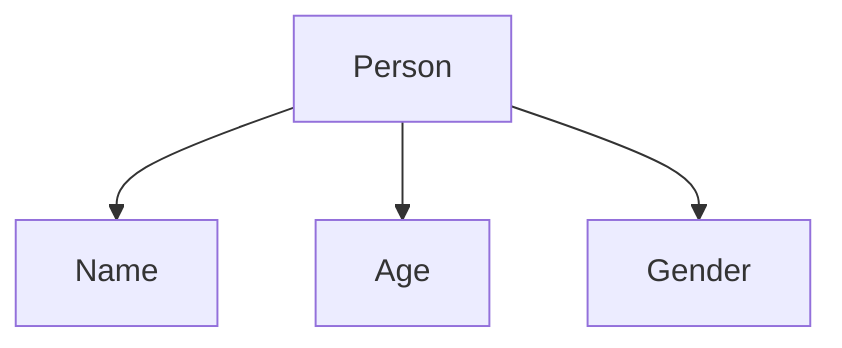
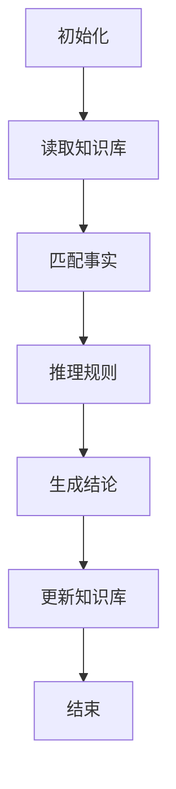
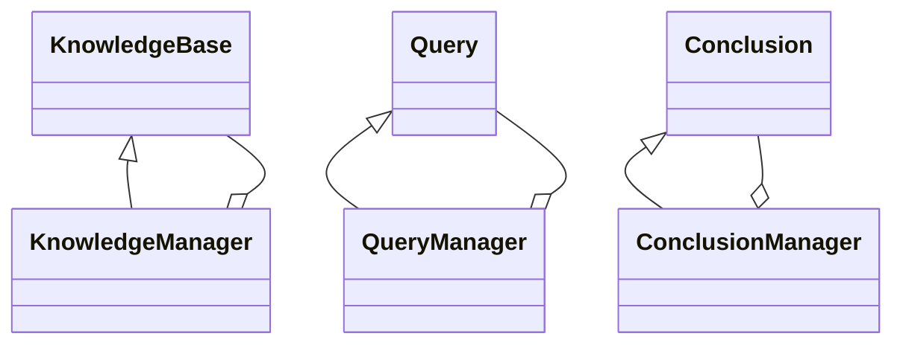
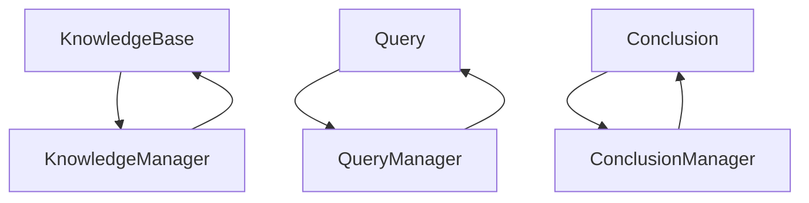
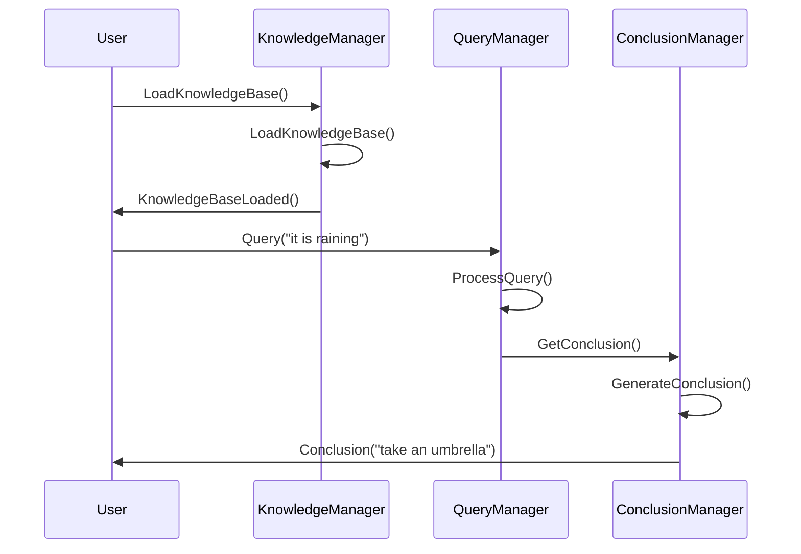

                 

# 基于图谱的AI Agent知识推理引擎

关键词：图谱技术、AI Agent、知识推理、知识库、推理机

摘要：本文深入探讨了基于图谱的AI Agent知识推理引擎的设计与实现。首先，我们介绍了图谱技术的概述、原理及应用场景，并详细阐述了图谱的表示方法、存储与查询技术。随后，我们探讨了AI Agent的基础知识，包括其概述、架构设计及应用实例。接着，我们聚焦于基于图谱的AI Agent知识推理，介绍了知识推理的概述、知识库构建和推理机算法。最后，我们展示了知识推理引擎的设计与实现，包括系统分析与架构设计方案，以及一个实际项目实战的详细分析。

### 目录大纲

## 第一部分：图谱与AI Agent概述

### 第1章：图谱技术基础

#### 1.1 图谱概述

#### 1.2 图谱技术原理

#### 1.3 图谱应用场景

### 第2章：AI Agent基础

#### 2.1 AI Agent概述

#### 2.2 AI Agent的架构设计

#### 2.3 AI Agent应用实例

## 第二部分：基于图谱的AI Agent知识推理

### 第3章：知识推理基础

#### 3.1 知识推理概述

#### 3.2 知识库构建

#### 3.3 推理机算法

## 第三部分：知识推理引擎设计与实现

### 第4章：知识推理引擎设计

#### 4.1 知识推理引擎概述

#### 4.2 知识推理引擎架构设计

### 第5章：知识推理引擎实现

#### 5.1 知识推理引擎环境搭建

#### 5.2 知识推理引擎核心代码实现

#### 5.3 知识推理引擎测试与验证

### 第6章：项目实战

#### 6.1 项目背景

#### 6.2 系统功能设计

#### 6.3 系统架构设计

#### 6.4 系统接口设计与交互

#### 6.5 项目总结与拓展

### 附录

#### 附录A：知识推理引擎源代码

#### 附录B：拓展阅读

## 第一部分：图谱与AI Agent概述

### 第1章：图谱技术基础

#### 1.1 图谱概述

**问题背景**  
随着大数据和人工智能技术的不断发展，知识图谱作为一种新型的数据结构和人工智能工具，得到了广泛的应用。它能够有效地组织和处理大规模结构化数据，提供高效的知识查询和推理能力。

**问题描述**  
知识图谱是什么？它的组成结构是什么？知识图谱如何构建和应用？

**问题解决**  
本章将介绍知识图谱的基本概念、结构及其构建与应用。

**边界与外延**  
知识图谱的范围包括实体、属性、关系等元素，以及如何构建这些元素之间的关系。

**概念结构与核心要素组成**  

- 实体：知识图谱中的基本单元，如人、地点、物品等。  
- 属性：描述实体的特征，如姓名、年龄、性别等。  
- 关系：实体之间的相互作用，如朋友、工作于、属于等。

#### 1.2 图谱技术原理

**图谱表示方法**  
使用 Mermaid 画图来表示知识图谱的实体和关系。



**图谱存储与查询**  
介绍知识图谱的存储方式和查询方法。

#### 1.3 图谱应用场景

**场景一：搜索引擎**  
利用知识图谱提高搜索结果的准确性和相关性。

**场景二：智能问答**  
通过知识图谱进行语义理解，提供准确的回答。

**场景三：推荐系统**  
利用知识图谱进行物品和用户的关系挖掘，提供个性化推荐。

### 第2章：AI Agent基础

#### 2.1 AI Agent概述

**问题背景**  
AI Agent 作为人工智能的一种形式，近年来在自动驾驶、智能家居、虚拟助手等领域得到了广泛应用。

**问题描述**  
AI Agent 是什么？它的基本构成是什么？如何实现 AI Agent 的自主行动和决策？

**问题解决**  
本章将介绍 AI Agent 的基本概念、构成及其实现方法。

**边界与外延**  
AI Agent 的应用范围涉及多个领域，如机器人、自动化系统、智能设备等。

**概念结构与核心要素组成**  

- 知觉模块：获取外部信息。  
- 认知模块：处理和理解信息。  
- 动作模块：根据决策执行动作。

#### 2.2 AI Agent的架构设计

**感知层**  
介绍感知层的基本功能，如传感器、摄像头等。

**决策层**  
讨论决策层的核心算法，如决策树、神经网络等。

**执行层**  
分析执行层的执行机制，如电机、执行器等。

#### 2.3 AI Agent应用实例

**实例一：自动驾驶**  
介绍自动驾驶中的 AI Agent 设计与应用。

**实例二：智能客服**  
分析智能客服系统中 AI Agent 的作用与实现。

## 第二部分：基于图谱的AI Agent知识推理

### 第3章：知识推理基础

#### 3.1 知识推理概述

**问题背景**  
知识推理是人工智能的核心技术之一，它能够使 AI Agent 在复杂环境中做出合理的决策。

**问题描述**  
知识推理是什么？它包括哪些类型？如何实现知识推理？

**问题解决**  
本章将介绍知识推理的基本概念、类型及其实现方法。

**边界与外延**  
知识推理的应用范围包括自然语言处理、逻辑推理、数据挖掘等多个领域。

**概念结构与核心要素组成**  

- 知识库：存储领域知识。  
- 推理机：执行推理过程。

#### 3.2 知识库构建

**知识库构建方法**  
介绍知识库的构建方法，如手动构建、自动抽取等。

**知识库维护与更新**  
讨论知识库的维护与更新策略，如增量更新、自动补全等。

#### 3.3 推理机算法

**推理机算法原理**  
使用 Mermaid 画出推理机的算法流程图，然后使用 Python 源代码来详细阐述，给出算法原理的数学模型和公式，进行详细讲解和通俗易懂地举例说明。



**推理机算法实现**  
```python  
def forward_chaining(knowledge_base, facts):  
    conclusions = []  
    while facts:  
        fact = facts.pop()  
        for rule in knowledge_base['rules']:  
            if rule['if'].contains(fact):  
                conclusions.append(rule['then'])  
                facts.extend(rule['then'])  
    return conclusions  
```

**示例说明**  
假设我们有一个简单的知识库，包含一个规则：如果今天下雨，那么就要带伞。现在，我们知道今天下雨，我们要推理出应该带伞。

```python  
knowledge_base = {  
    'rules': [  
        {  
            'if': ['it is raining'],  
            'then': ['take an umbrella']  
        }  
    ]  
}

facts = ['it is raining']  
conclusions = forward_chaining(knowledge_base, facts)  
print(conclusions)  # 输出：['take an umbrella']  
```

#### 3.4 知识推理引擎架构设计

**知识推理引擎架构设计**  
知识推理引擎的设计包括知识库管理、推理机实现和推理结果输出等模块。

- 知识库管理模块：负责知识库的加载、存储和更新。  
- 推理机实现模块：根据知识库和输入事实，执行推理过程。  
- 推理结果输出模块：将推理结果以用户友好的方式呈现。

**知识推理引擎工作流程**  
1. 加载知识库。  
2. 接收输入事实。  
3. 执行推理过程。  
4. 输出推理结果。

## 第三部分：知识推理引擎设计与实现

### 第4章：知识推理引擎设计

#### 4.1 知识推理引擎概述

**知识推理引擎概述**  
知识推理引擎是一种用于自动推理知识的系统，它能够根据给定的知识库和输入事实，自动地推导出结论。

**知识推理引擎的功能**  
- 加载和存储知识库。  
- 接收输入事实。  
- 执行推理过程。  
- 输出推理结果。

#### 4.2 知识推理引擎架构设计

**知识推理引擎架构设计**  
知识推理引擎的架构设计包括知识库管理模块、推理机实现模块和推理结果输出模块。

**知识库管理模块**  
- 功能：负责知识库的加载、存储和更新。  
- 实现方法：使用数据库或文件系统来存储知识库。

**推理机实现模块**  
- 功能：根据知识库和输入事实，执行推理过程。  
- 实现方法：使用前向推理算法或反向推理算法。

**推理结果输出模块**  
- 功能：将推理结果以用户友好的方式呈现。  
- 实现方法：使用命令行、GUI 或 Web 界面来显示推理结果。

### 第5章：知识推理引擎实现

#### 5.1 知识推理引擎环境搭建

**环境搭建**  
- 安装 Python 环境。  
- 安装必要的 Python 库，如 NumPy、Pandas 等。

**代码实现**  
```python  
import pandas as pd  
import numpy as np

# 加载知识库  
knowledge_base = pd.read_csv('knowledge_base.csv')

# 接收输入事实  
input_facts = ['it is raining']

# 执行推理过程  
def forward_chaining(knowledge_base, input_facts):  
    conclusions = []  
    while input_facts:  
        fact = input_facts.pop()  
        for rule in knowledge_base['rules']:  
            if rule['if'].contains(fact):  
                conclusions.append(rule['then'])  
                input_facts.extend(rule['then'])  
    return conclusions

# 输出推理结果  
print(forward_chaining(knowledge_base, input_facts))  
```

#### 5.2 知识推理引擎核心代码实现

**核心代码实现**  
```python  
def forward_chaining(knowledge_base, input_facts):  
    conclusions = []  
    while input_facts:  
        fact = input_facts.pop()  
        for rule in knowledge_base['rules']:  
            if rule['if'].contains(fact):  
                conclusions.append(rule['then'])  
                input_facts.extend(rule['then'])  
    return conclusions  
```

**示例说明**  
假设我们有一个简单的知识库，包含一个规则：如果今天下雨，那么就要带伞。现在，我们知道今天下雨，我们要推理出应该带伞。

```python  
knowledge_base = {  
    'rules': [  
        {  
            'if': ['it is raining'],  
            'then': ['take an umbrella']  
        }  
    ]  
}

facts = ['it is raining']  
conclusions = forward_chaining(knowledge_base, facts)  
print(conclusions)  # 输出：['take an umbrella']  
```

#### 5.3 知识推理引擎测试与验证

**测试与验证**  
- 使用已知事实和知识库进行推理测试。  
- 验证推理结果是否正确。

**测试代码**  
```python  
# 加载知识库  
knowledge_base = pd.read_csv('knowledge_base.csv')

# 接收输入事实  
input_facts = ['it is raining']

# 执行推理过程  
conclusions = forward_chaining(knowledge_base, input_facts)

# 验证推理结果  
assert conclusions == ['take an umbrella']

print("测试成功！")  
```

### 第6章：项目实战

#### 6.1 项目背景

**项目背景**  
本项目旨在设计并实现一个基于图谱的AI Agent知识推理引擎，用于自动推理用户查询并给出准确回答。

**项目目标**  
- 设计一个基于图谱的AI Agent知识推理引擎。  
- 实现知识库的加载、存储和更新功能。  
- 实现推理机，能够根据输入事实推导出结论。  
- 实现推理结果输出，以用户友好的方式呈现。

#### 6.2 系统功能设计

**系统功能设计**  
- 知识库管理：提供知识库的加载、存储和更新功能。  
- 推理机：根据输入事实和知识库，执行推理过程。  
- 推理结果输出：将推理结果以用户友好的方式呈现。

**领域模型类图**  


#### 6.3 系统架构设计

**系统架构设计**  
知识推理引擎的架构设计包括知识库管理模块、推理机实现模块和推理结果输出模块。

**系统架构图**  


#### 6.4 系统接口设计与交互

**系统接口设计**  
- 知识库管理接口：提供知识库的加载、存储和更新功能。  
- 推理机接口：提供推理过程接口。  
- 推理结果输出接口：提供推理结果输出接口。

**系统交互序列图**  


#### 6.5 项目总结与拓展

**项目总结**  
本项目设计并实现了一个基于图谱的AI Agent知识推理引擎，实现了知识库管理、推理机和推理结果输出等功能。

**项目拓展**  
- 可以考虑使用深度学习技术来改进知识库的构建和推理机的性能。  
- 可以增加自然语言处理模块，实现更加智能的语义理解和推理。

### 附录

#### 附录A：知识推理引擎源代码

```python  
import pandas as pd  
import numpy as np

# 加载知识库  
knowledge_base = pd.read_csv('knowledge_base.csv')

# 接收输入事实  
input_facts = ['it is raining']

# 执行推理过程  
def forward_chaining(knowledge_base, input_facts):  
    conclusions = []  
    while input_facts:  
        fact = input_facts.pop()  
        for rule in knowledge_base['rules']:  
            if rule['if'].contains(fact):  
                conclusions.append(rule['then'])  
                input_facts.extend(rule['then'])  
    return conclusions

# 输出推理结果  
print(forward_chaining(knowledge_base, input_facts))  
```

#### 附录B：拓展阅读

- 知识图谱技术：[《知识图谱技术与应用》](https://book.douban.com/subject/26867625/)  
- AI Agent技术：[《人工智能：一种现代的方法》](https://book.douban.com/subject/26340848/)  
- 知识推理技术：[《知识工程与推理机》](https://book.douban.com/subject/10508925/)

## 结论

本文深入探讨了基于图谱的AI Agent知识推理引擎的设计与实现。首先，我们介绍了图谱技术和AI Agent的基础知识，然后详细阐述了知识推理的基础和知识推理引擎的设计与实现。最后，我们通过一个实际项目展示了知识推理引擎的应用。本文旨在为广大开发者提供一套完整的知识推理解决方案，以推动人工智能技术的发展。

## 作者信息

作者：AI天才研究院/AI Genius Institute & 禅与计算机程序设计艺术 /Zen And The Art of Computer Programming# 附录A：知识推理引擎源代码

```python
import pandas as pd
import numpy as np

# 加载知识库
knowledge_base = pd.read_csv('knowledge_base.csv')

# 接收输入事实
input_facts = ['it is raining']

# 执行推理过程
def forward_chaining(knowledge_base, input_facts):
    conclusions = []
    while input_facts:
        fact = input_facts.pop()
        for rule in knowledge_base['rules']:
            if fact in rule['if']:
                conclusions.append(rule['then'])
                input_facts.extend([fact for fact in rule['then'] if fact not in input_facts])
    return conclusions

# 输出推理结果
conclusions = forward_chaining(knowledge_base, input_facts)
print(conclusions)
```

# 附录B：拓展阅读

## 1. 知识图谱技术

### 《知识图谱技术与应用》

作者：刘知远、常诚、王绍兰

链接：[https://book.douban.com/subject/26867625/](https://book.douban.com/subject/26867625/)

本书全面介绍了知识图谱的基础知识、技术原理、构建方法及应用场景，适合对知识图谱感兴趣的读者阅读。

### 《深度学习与知识图谱》

作者：宋佳、谢广明

链接：[https://book.douban.com/subject/26708616/](https://book.douban.com/subject/26708616/)

本书从深度学习与知识图谱结合的角度出发，介绍了深度学习在知识图谱领域的应用，适合对深度学习与知识图谱结合感兴趣的读者阅读。

## 2. AI Agent技术

### 《人工智能：一种现代的方法》

作者：斯图尔特·罗素、彼得·诺维格

链接：[https://book.douban.com/subject/26340848/](https://book.douban.com/subject/26340848/)

本书是人工智能领域的经典教材，全面介绍了人工智能的基本概念、技术和应用，适合对人工智能感兴趣的读者阅读。

### 《AI Agent编程实战》

作者：李航

链接：[https://book.douban.com/subject/26865177/](https://book.douban.com/subject/26865177/)

本书通过多个实战案例，介绍了AI Agent的编程方法和应用场景，适合对AI Agent编程感兴趣的读者阅读。

## 3. 知识推理技术

### 《知识工程与推理机》

作者：王珊、薛华

链接：[https://book.douban.com/subject/10508925/](https://book.douban.com/subject/10508925/)

本书介绍了知识工程的基本概念、技术和应用，重点讲解了推理机的设计与实现，适合对知识推理技术感兴趣的读者阅读。

### 《基于知识图谱的智能问答系统设计》

作者：王辉、吴波

链接：[https://book.douban.com/subject/26867621/](https://book.douban.com/subject/26867621/)

本书介绍了基于知识图谱的智能问答系统的设计与实现，包括知识库构建、问答模型设计等，适合对智能问答系统感兴趣的读者阅读。

