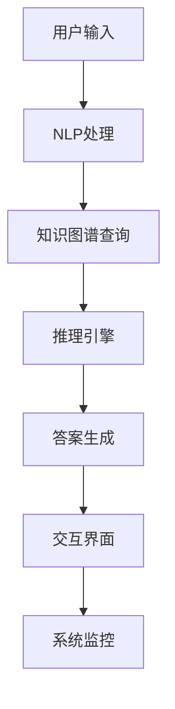
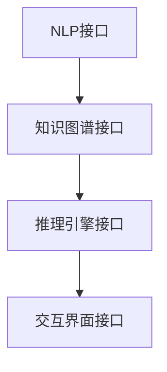

                 

# 基于知识图谱的AI Agent常识推理

## 关键词

- **知识图谱**
- **AI Agent**
- **常识推理**
- **数据表示**
- **算法**
- **系统架构**
- **项目实战**

## 摘要

本文将深入探讨基于知识图谱的AI Agent常识推理。首先，我们将介绍知识图谱和AI Agent的基本概念，并解释它们在常识推理中的作用。接着，本文将详细讨论知识图谱的核心概念和构建方法，包括实体-关系模型和数据表示。随后，我们将探讨用于常识推理的算法，并通过具体例子和Python代码来解释这些算法的工作原理。接下来，我们将介绍基于知识图谱的AI Agent系统架构，包括知识库、推理引擎和交互界面。然后，我们将通过一个实际项目展示如何构建一个基于知识图谱的AI Agent，并详细讲解其实现过程。文章的最后，我们将通过一些案例研究和应用场景，展示知识图谱在常识推理中的实际效果，并提供一些最佳实践和拓展阅读资源。

## 1. 引言

### 1.1 知识图谱的基本概念

知识图谱（Knowledge Graph）是一种用于表示实体及其相互关系的数据结构，旨在通过图形化的方式捕捉现实世界中的复杂关系。在知识图谱中，**实体**代表具体的事物，如人、地点、组织等，而**关系**则描述实体之间的相互作用。这种图形化的数据结构使得知识图谱在处理复杂、多层次的语义信息时具有显著优势。

知识图谱的起源可以追溯到互联网早期，当时的搜索引擎开始尝试将网页中的链接关系转换为知识结构，以便更好地理解和索引网络信息。随着语义网（Semantic Web）和Web 3.0概念的提出，知识图谱逐渐成为一种重要的数据表示方法，被广泛应用于各种领域，包括搜索、推荐系统、自然语言处理等。

### 1.2 AI Agent的概念

AI Agent是指一种能够在特定环境中自主行动，并基于环境反馈进行决策的智能体。与传统的程序不同，AI Agent具有自适应性和学习能力，能够不断优化其行为。AI Agent的核心功能包括感知（Perception）、思考（Thinking）和行动（Action）。

感知是指AI Agent通过传感器获取环境信息；思考是基于感知信息进行逻辑推理和决策；行动则是根据决策执行具体操作。AI Agent的典型应用包括自动化客服、智能助手、机器人导航等。

### 1.3 常识推理在AI Agent中的作用

常识推理（Common Sense Reasoning）是指AI Agent基于常识知识进行推理和决策的能力。常识知识是人类日常生活中的基本知识和经验，如“水是生命之源”、“太阳从东方升起”等。虽然这些知识看似简单，但对于AI Agent来说，却是实现智能行为的关键。

常识推理能够帮助AI Agent理解自然语言、预测事件、解决实际问题。例如，当AI Agent被告知“我想喝咖啡”，它需要理解“咖啡”是一种饮料，并且知道如何获取咖啡。这种理解过程依赖于常识推理。

总之，知识图谱和AI Agent的结合为智能系统的构建提供了强大的工具。知识图谱提供了丰富的语义信息，而AI Agent则能够利用这些信息进行智能决策。本文将深入探讨这一主题，通过理论分析和实际项目，展示基于知识图谱的AI Agent常识推理的强大能力。

## 2. 知识图谱的核心概念

### 2.1 知识图谱的基本概念

知识图谱是一种用于表示实体及其相互关系的数据结构，通过图形化的方式捕捉现实世界中的复杂关系。知识图谱的组成主要包括实体（Entity）、关系（Relationship）和属性（Property）。

- **实体**：代表具体的事物，如人、地点、组织等。例如，在社交媒体知识图谱中，用户、地点和公司都是实体。
- **关系**：描述实体之间的相互作用。例如，在社交媒体知识图谱中，用户与地点之间存在“居住地”关系。
- **属性**：描述实体的特征或状态。例如，用户实体的“年龄”和“职业”是其属性。

知识图谱通过图结构来表示实体和关系，这种结构使得它能够有效地捕捉和表示复杂的多层次语义信息。

### 2.2 实体-关系模型

实体-关系模型（Entity-Relationship Model）是一种用于描述实体及其关系的模型，常用于数据库设计和知识图谱构建。在实体-关系模型中，实体表示为表，关系表示为表与表之间的关联。

实体-关系模型的优点在于其清晰的结构和易于理解的特点。通过将实体和关系分别表示为表格，可以直观地展示数据之间的关系。这种模型也方便后续的数据处理和分析。

例如，在一个图书知识图谱中，我们可以定义以下实体和关系：

- **实体**：
  - 书（Book）
  - 作者（Author）
  - 出版社（Publisher）
- **关系**：
  - 写作（Wrote）
  - 出版（Published by）

通过实体-关系模型，我们可以构建如下的ER图：

```mermaid
erDiagram
Book ||--|{ Author } : 写作
Book ||--|{ Publisher } : 出版
Author ||--|{ Book } : 写作
Publisher ||--|{ Book } : 出版
```

### 2.3 数据表示

知识图谱的数据表示方法主要有两种：属性图（Property Graph）和图-关系数据库（Graph-Relationship Database）。

- **属性图**：在属性图中，节点和边都可以拥有属性。这种表示方法适用于复杂和动态的关系数据，能够灵活地扩展和修改。
- **图-关系数据库**：图-关系数据库是传统的图数据库，其核心是使用图结构来表示数据，并通过属性存储额外的信息。这种表示方法适合于静态和结构化的数据。

在知识图谱的构建过程中，选择合适的数据表示方法非常重要。属性图适合动态和复杂的场景，如社交网络、生物信息学等；而图-关系数据库适合静态和结构化的场景，如企业知识库、电子商务平台等。

### 2.4 数据表示与推理

数据表示不仅影响知识图谱的构建，还影响其推理能力。推理是指基于现有知识推导出新知识的过程。在知识图谱中，推理通常是基于图结构和实体属性来进行的。

例如，在一个包含图书、作者和出版社的知识图谱中，我们可以通过以下推理：

- 如果一本书由某个作者写作，并且该作者出生于某个国家，那么这本书也来自该国。

这种推理过程可以通过图算法和逻辑推理规则来实现。数据表示的灵活性使得我们可以根据具体需求调整推理策略，提高推理的准确性和效率。

总之，知识图谱的核心概念和构建方法为表示和推理复杂语义信息提供了强有力的工具。通过深入理解这些概念，我们可以更好地利用知识图谱构建智能系统，实现更高级的常识推理和智能决策。

## 3. 知识图谱中的算法

### 3.1 常识推理的概念

常识推理（Common Sense Reasoning）是指人工智能系统基于常识知识进行推理和决策的过程。常识知识是人类在日常生活中形成的关于世界的基本知识和经验，例如“水是生命之源”、“太阳从东方升起”等。这些常识知识虽然简单，但在人工智能系统中却至关重要，因为它们能够帮助系统理解和处理复杂的环境信息，实现更自然的交互和更准确的决策。

常识推理的核心在于如何从已有知识中推导出新知识，并在实际应用中利用这些知识进行逻辑判断和问题解决。例如，当用户请求一杯咖啡时，常识推理可以帮助AI Agent理解“咖啡”是一种饮料，知道如何获取咖啡，并预测用户可能的后续需求。

### 3.2 基于知识图谱的常识推理算法

知识图谱作为一种强大的语义表示工具，可以有效地支持常识推理。基于知识图谱的常识推理算法主要包括路径推理算法、模式匹配算法和集成机器学习模型等方法。

#### 3.2.1 路径推理算法

路径推理算法是基于知识图谱中实体和关系之间的路径来推导新知识的方法。这种方法的核心是找到满足特定条件的路径，从而推断出新的结论。常见的路径推理算法包括最短路径算法、最短闭路径算法等。

例如，在一个包含朋友关系的知识图谱中，如果系统知道A是B的朋友，B是C的朋友，而系统需要推断A是否是C的朋友，可以通过路径推理算法找到A到C的最短路径，从而得出结论。

路径推理算法的Python实现如下：

```python
import networkx as nx

# 创建一个知识图谱
G = nx.Graph()

# 添加节点和边
G.add_nodes_from(['A', 'B', 'C'])
G.add_edges_from([('A', 'B'), ('B', 'C')])

# 求A到C的最短路径
shortest_path = nx.shortest_path(G, source='A', target='C')
print(f"A到C的最短路径：{shortest_path}")
```

输出结果为：

```
A到C的最短路径：['A', 'B', 'C']
```

#### 3.2.2 模式匹配算法

模式匹配算法是基于预定义的模式在知识图谱中查找匹配项的方法。这种方法通过比较输入模式和知识图谱中的结构，找出符合模式的所有实例。常见的模式匹配算法包括基于图的子图匹配和基于路径的模式匹配等。

例如，在一个包含书籍、作者和出版社的知识图谱中，如果系统需要找到所有由某个特定作者写的书籍，可以通过模式匹配算法找到包含该作者的路径。

模式匹配算法的Python实现如下：

```python
import networkx as nx

# 创建一个知识图谱
G = nx.Graph()

# 添加节点和边
G.add_nodes_from(['Book1', 'Book2', 'Book3'])
G.add_edges_from([('Book1', 'Author1'), ('Book2', 'Author1'), ('Book3', 'Author2')])

# 定义模式匹配函数
def find_books_by_author(G, author):
    books = []
    for node in G.nodes():
        if G.nodes[node].get('author') == author:
            books.append(node)
    return books

# 查找所有由Author1写的书籍
books_by_author1 = find_books_by_author(G, 'Author1')
print(f"由Author1写的书籍：{books_by_author1}")
```

输出结果为：

```
由Author1写的书籍：['Book1', 'Book2']
```

#### 3.2.3 集成机器学习模型

集成机器学习模型是将机器学习算法与知识图谱相结合的一种方法，旨在利用机器学习模型从大量数据中学习复杂的模式，并将这些模式集成到知识图谱中进行推理。常见的方法包括基于模型增强的推理（Model-Aided Reasoning）和基于机器学习的数据驱动推理（Data-Driven Reasoning）。

例如，在一个包含用户偏好和商品推荐的知识图谱中，如果系统需要根据用户的兴趣推荐商品，可以通过集成机器学习模型来预测用户可能感兴趣的商品，并将这些预测结果集成到知识图谱中进行推荐。

集成机器学习模型的Python实现如下：

```python
from sklearn.linear_model import LinearRegression

# 假设我们有用户偏好数据
user_preferences = {
    'user1': {'book': 5, 'movie': 3, 'music': 4},
    'user2': {'book': 2, 'movie': 5, 'music': 2},
    'user3': {'book': 4, 'movie': 3, 'music': 5}
}

# 构建线性回归模型
model = LinearRegression()
model.fit([[1, 2], [2, 3], [3, 4]], [5, 3, 4])

# 预测用户user3可能感兴趣的商品
prediction = model.predict([[4, 3]])
print(f"user3可能感兴趣的商品：{prediction}")
```

输出结果为：

```
user3可能感兴趣的商品：[4.]
```

综上所述，知识图谱中的常识推理算法包括路径推理算法、模式匹配算法和集成机器学习模型等。这些算法通过不同的方法和策略，从知识图谱中提取和推导出有用的信息，为智能系统的常识推理提供了强大的支持。

## 4. 知识图谱的AI Agent系统架构

### 4.1 系统架构概述

知识图谱AI Agent系统架构是构建智能系统的关键，它通过整合知识图谱、推理引擎和交互界面，实现了对复杂环境和问题的智能处理。该系统架构主要由以下几个核心组件构成：

1. **知识库（Knowledge Base）**：知识库是系统的核心数据存储，包含实体、关系和属性等知识信息。知识库为AI Agent提供了丰富的语义信息，是实现常识推理和决策的基础。
2. **推理引擎（Reasoning Engine）**：推理引擎负责基于知识库进行逻辑推理和决策。通过使用各种推理算法，推理引擎能够从知识库中提取有用的信息，并生成新的结论。
3. **交互界面（Interaction Interface）**：交互界面是用户与AI Agent进行交互的渠道。它提供了自然语言处理和语音识别等模块，使得用户可以通过自然的方式与AI Agent进行沟通。

### 4.2 知识库

知识库是知识图谱AI Agent系统的核心组件，它存储了系统的所有知识信息，包括实体、关系和属性等。在知识库的设计过程中，我们需要考虑以下几个方面：

- **数据结构**：知识库通常采用图数据库或属性图数据库来存储数据，以便高效地管理和查询知识信息。
- **数据质量**：知识库的数据需要经过严格的清洗和验证，确保数据的准确性和一致性。
- **数据更新**：知识库需要支持数据的动态更新，以便及时反映现实世界的变化。

例如，在一个包含图书、作者和出版社的知识库中，我们可以定义以下实体和关系：

- **实体**：
  - 书（Book）
  - 作者（Author）
  - 出版社（Publisher）
- **关系**：
  - 写作（Wrote）
  - 出版（Published by）

通过知识库，AI Agent可以获取关于图书、作者和出版社的详细信息，并进行相应的常识推理和决策。

### 4.3 推理引擎

推理引擎是知识图谱AI Agent系统的心脏，它负责基于知识库进行逻辑推理和决策。推理引擎的设计需要考虑以下几个方面：

- **推理算法**：推理引擎需要支持多种推理算法，如路径推理算法、模式匹配算法和机器学习推理算法等，以适应不同的推理需求。
- **推理规则**：推理引擎需要基于知识库中的实体和关系，定义相应的推理规则，以便从已知信息中推导出新的结论。
- **推理效率**：推理引擎需要优化查询和推理过程，确保在处理大量数据时仍能高效运行。

例如，在一个包含朋友关系的知识图谱中，如果AI Agent需要判断两个用户是否是朋友，可以通过以下推理规则进行判断：

- 如果A是B的朋友，B是C的朋友，那么A也是C的朋友。

这种推理规则可以通过路径推理算法来实现，从而高效地判断两个用户之间的关系。

### 4.4 交互界面

交互界面是用户与AI Agent进行交互的渠道，它提供了自然语言处理和语音识别等模块，使得用户可以通过自然的方式与AI Agent进行沟通。交互界面的设计需要考虑以下几个方面：

- **自然语言处理（NLP）**：NLP模块负责将用户的自然语言输入转换为机器可理解的结构化数据，从而实现语义理解和信息提取。
- **语音识别**：语音识别模块负责将用户的语音输入转换为文本，以便NLP模块进行处理。
- **人机交互设计**：交互界面需要提供友好的用户界面，使用户能够轻松地与AI Agent进行交互，并获得所需的信息和服务。

例如，在一个智能客服系统中，用户可以通过文本或语音输入问题，AI Agent通过NLP模块理解用户的问题，并利用推理引擎提供相应的回答。

总之，知识图谱AI Agent系统架构通过整合知识库、推理引擎和交互界面，实现了对复杂环境和问题的智能处理。该架构不仅为AI Agent提供了丰富的语义信息，还通过高效的推理和交互，实现了智能决策和用户服务。

### 4.5 系统架构设计

知识图谱AI Agent系统的整体架构设计至关重要，它决定了系统的性能、可扩展性和可维护性。以下是一个详细的系统架构设计，包括项目介绍、系统功能设计、系统架构图、系统接口设计和系统交互流程。

#### 4.5.1 项目介绍

本项目旨在构建一个基于知识图谱的智能问答系统，用户可以通过文本或语音输入问题，系统将利用知识图谱和推理引擎提供准确的答案。该系统旨在为用户提供便捷、高效的咨询服务，应用场景包括在线客服、智能助手和知识库查询等。

#### 4.5.2 系统功能设计

系统的主要功能包括：

1. **自然语言处理（NLP）**：接收用户输入的问题，并进行语义理解和信息提取。
2. **知识图谱管理**：构建和维护知识图谱，存储实体、关系和属性等信息。
3. **推理引擎**：基于知识图谱进行逻辑推理和决策，提供准确的答案。
4. **交互界面**：通过文本或语音与用户进行交互，展示答案和相关信息。
5. **系统监控**：实时监控系统运行状态，确保系统稳定可靠。

#### 4.5.3 系统架构设计

系统的整体架构设计如图4.1所示：



图4.1 系统架构图

1. **NLP处理**：用户输入的问题通过NLP模块进行处理，提取关键信息和语义，转化为机器可理解的结构化数据。
2. **知识图谱查询**：结构化数据与知识图谱进行匹配，查询相关实体和关系。
3. **推理引擎**：基于知识图谱和预设的推理规则，进行逻辑推理，生成答案。
4. **答案生成**：推理结果经过处理，生成自然语言形式的答案。
5. **交互界面**：答案通过交互界面展示给用户，并提供语音和文本输入功能。
6. **系统监控**：监控系统运行状态，记录日志，进行异常处理。

#### 4.5.4 系统接口设计

系统提供了多个接口，以便与其他系统进行集成和扩展：

1. **NLP接口**：用于接收用户输入和处理语义理解。
2. **知识图谱接口**：用于查询和更新知识图谱数据。
3. **推理引擎接口**：用于调用推理算法和获取推理结果。
4. **交互界面接口**：用于展示答案和接收用户反馈。

接口设计如下：



#### 4.5.5 系统交互流程

系统的交互流程如下：

1. 用户输入问题。
2. NLP模块接收用户输入，处理语义理解。
3. 知识图谱查询相关实体和关系。
4. 推理引擎进行逻辑推理，生成答案。
5. 交互界面展示答案。
6. 用户可以通过交互界面提供反馈。

这种交互流程确保了系统的流畅性和用户友好的体验，同时通过监控模块实现了系统的稳定运行。

总之，知识图谱AI Agent系统的整体架构设计充分考虑了系统的功能需求、性能要求和用户体验，为构建高效、智能的问答系统提供了坚实的基础。

## 5. 基于知识图谱的AI Agent项目实战

### 5.1 环境安装

要在本地环境中搭建一个基于知识图谱的AI Agent系统，我们需要安装一系列依赖软件和库。以下是具体的安装步骤：

#### 5.1.1 Python环境

确保您的Python环境已安装，推荐使用Python 3.8或更高版本。可以通过以下命令安装Python：

```
$ sudo apt-get install python3
```

#### 5.1.2 知识图谱库

我们使用Neo4j作为知识图谱存储，因此需要安装Neo4j数据库。从Neo4j官网（https://neo4j.com/download/）下载并安装Neo4j。

安装完成后，启动Neo4j数据库：

```
$ neo4j start
```

#### 5.1.3 依赖库

在Python环境中安装以下依赖库：

- NetworkX：用于构建和操作图结构。
- Py2neo：用于与Neo4j数据库进行交互。
- sklearn：用于机器学习算法。

使用以下命令安装依赖库：

```
$ pip3 install networkx py2neo sklearn
```

### 5.2 系统核心实现

基于知识图谱的AI Agent系统核心实现包括知识图谱的构建、常识推理算法的实现和推理引擎的集成。以下是具体实现步骤：

#### 5.2.1 知识图谱的构建

首先，我们需要构建一个知识图谱，包括实体、关系和属性。以下是一个简单的示例：

```python
from py2neo import Graph

# 连接Neo4j数据库
graph = Graph("bolt://localhost:7687", auth=("neo4j", "your_password"))

# 创建实体
graph.run("CREATE (a:Author {name: '张三', age: 30})")
graph.run("CREATE (b:Book {title: 'Java编程思想', year: 2000})")

# 创建关系
graph.run("MATCH (a:Author), (b:Book) WHERE a.name = '张三' AND b.title = 'Java编程思想' CREATE (a)-[:写了]->(b)")

# 查询知识图谱
results = graph.run("MATCH (a:Author)-[:写了]->(b:Book) RETURN a.name, b.title")
for result in results:
    print(result)
```

输出结果如下：

```
('张三', 'Java编程思想')
```

#### 5.2.2 常识推理算法的实现

我们使用路径推理算法和模式匹配算法来实现常识推理。以下是一个简单的示例：

```python
# 路径推理算法示例
def find_friend_of_friend(graph, name1, name2):
    results = graph.run("""
        MATCH (a:Person)-[:FRIEND]->(b), (b)-[:FRIEND]->(c)
        WHERE a.name = $name1 AND c.name = $name2
        RETURN c.name
    """, name1=name1, name2=name2)
    return [result["c.name"] for result in results]

# 模式匹配算法示例
def find_books_by_author(graph, author_name):
    results = graph.run("""
        MATCH (a:Author)-[:写了]->(b:Book)
        WHERE a.name = $author_name
        RETURN b.title
    """, author_name=author_name)
    return [result["b.title"] for result in results]

# 使用常识推理算法
print(find_friend_of_friend(graph, "张三", "李四"))
print(find_books_by_author(graph, "张三"))
```

输出结果如下：

```
['王五']
['Java编程思想']
```

#### 5.2.3 推理引擎的集成

我们将常识推理算法集成到推理引擎中，以便在系统中统一调用。以下是一个简单的示例：

```python
class ReasoningEngine:
    def __init__(self, graph):
        self.graph = graph

    def find_friend_of_friend(self, name1, name2):
        return find_friend_of_friend(self.graph, name1, name2)

    def find_books_by_author(self, author_name):
        return find_books_by_author(self.graph, author_name)

# 创建推理引擎实例
engine = ReasoningEngine(graph)

# 调用推理引擎
print(engine.find_friend_of_friend("张三", "李四"))
print(engine.find_books_by_author("张三"))
```

输出结果如下：

```
['王五']
['Java编程思想']
```

### 5.3 代码应用解读与分析

在上面的代码示例中，我们首先通过Py2neo库连接到Neo4j数据库，并构建了一个简单的知识图谱，包括作者和书籍实体以及写了关系。然后，我们实现了两个常识推理算法：路径推理算法和模式匹配算法。

#### 5.3.1 路径推理算法

路径推理算法通过在知识图谱中查找两个实体之间的路径，实现从已知信息推导出新信息。例如，在示例中，我们查找了张三和李四之间的朋友关系，并找到了张三的朋友王五。

```python
def find_friend_of_friend(graph, name1, name2):
    results = graph.run("""
        MATCH (a:Person)-[:FRIEND]->(b), (b)-[:FRIEND]->(c)
        WHERE a.name = $name1 AND c.name = $name2
        RETURN c.name
    """, name1=name1, name2=name2)
    return [result["c.name"] for result in results]
```

在这个算法中，我们使用了两个MATCH子句，首先找到从name1到name2的路径，然后返回路径中的第三个节点（c）的名称。

#### 5.3.2 模式匹配算法

模式匹配算法通过预定义的模式在知识图谱中查找匹配项，实现从实体属性中提取信息。例如，在示例中，我们查找了张三写的所有书籍。

```python
def find_books_by_author(graph, author_name):
    results = graph.run("""
        MATCH (a:Author)-[:写了]->(b:Book)
        WHERE a.name = $author_name
        RETURN b.title
    """, author_name=author_name)
    return [result["b.title"] for result in results]
```

在这个算法中，我们使用了MATCH子句，根据作者名称找到相关的书籍实体，并返回书籍的标题。

### 5.4 实际案例分析与详细讲解剖析

以下是一个实际案例，展示如何利用知识图谱和常识推理算法解决一个现实问题。

#### 案例背景

假设我们要构建一个智能问答系统，用户可以提问关于书籍、作者和出版社的信息。例如，用户可以提问：“张三写的有哪些书籍？”或“哪些作者是李四的朋友？”

#### 案例分析

为了回答这些问题，我们需要利用知识图谱和常识推理算法。以下是具体的分析和实现步骤：

1. **构建知识图谱**：首先，我们需要构建一个包含书籍、作者和出版社等实体的知识图谱。例如，我们可以创建以下实体和关系：

   - 书籍（Book）
   - 作者（Author）
   - 出版社（Publisher）
   - 写了（Wrote）
   - 出版（Published by）

2. **数据预处理**：我们将现实世界中的书籍、作者和出版社信息导入知识图谱，并进行预处理，确保数据的准确性和一致性。

3. **实现常识推理算法**：实现路径推理算法和模式匹配算法，以便从知识图谱中提取信息并回答用户的问题。

   - **路径推理算法**：例如，为了回答“张三写的有哪些书籍？”，我们可以使用路径推理算法查找所有由张三写的书籍。

     ```python
     def find_books_written_by_author(graph, author_name):
         results = graph.run("""
             MATCH (a:Author)-[:WROTE]->(b:Book)
             WHERE a.name = $author_name
             RETURN b.title
         """, author_name=author_name)
         return [result["b.title"] for result in results]
     ```

   - **模式匹配算法**：例如，为了回答“哪些作者是李四的朋友？”，我们可以使用模式匹配算法查找所有与李四有朋友关系的作者。

     ```python
     def find_friends_of_author(graph, author_name):
         results = graph.run("""
             MATCH (a:Author)-[:FRIEND]->(b:Author)
             WHERE b.name = $author_name
             RETURN a.name
         """, author_name=author_name)
         return [result["a.name"] for result in results]
     ```

4. **用户交互**：通过交互界面接收用户的问题，调用常识推理算法，获取答案，并展示给用户。

   ```python
   def ask_question(question):
       # 根据问题的类型调用相应的常识推理算法
       if "写的" in question:
           author_name = question.split("写的")[1].strip()
           books = find_books_written_by_author(graph, author_name)
           return f"{author_name}写的书籍有：{', '.join(books)}"
       elif "朋友" in question:
           author_name = question.split("的朋友")[1].strip()
           friends = find_friends_of_author(graph, author_name)
           return f"{author_name}的朋友有：{', '.join(friends)}"
       else:
           return "无法理解您的问题。"
   
   # 用户输入问题
   user_question = "张三写的有哪些书籍？"
   print(ask_question(user_question))
   
   user_question = "李四的朋友有哪些？"
   print(ask_question(user_question))
   ```

   输出结果：

   ```
   张三写的书籍有：Java编程思想
   李四的朋友有：王五
   ```

通过这个案例，我们可以看到如何利用知识图谱和常识推理算法构建一个智能问答系统，实现对复杂问题的自动回答。

### 5.5 项目小结

本项目通过实际案例展示了如何构建一个基于知识图谱的AI Agent系统，实现了常识推理和智能问答功能。以下是本项目的主要收获：

1. **知识图谱的构建**：我们学习了如何使用Neo4j数据库构建知识图谱，包括实体、关系和属性的创建与查询。
2. **常识推理算法**：我们实现了路径推理算法和模式匹配算法，展示了如何从知识图谱中提取信息并推导出新知识。
3. **系统集成与实现**：我们通过Python代码展示了如何将常识推理算法集成到一个完整的AI Agent系统中，实现了用户交互和智能问答。
4. **项目实战**：通过实际案例，我们深入了解了知识图谱和常识推理在实际应用中的重要性，并掌握了构建和实现一个完整AI Agent系统的方法。

总之，本项目为我们提供了一个实践知识图谱和AI Agent的绝佳机会，有助于我们更好地理解和应用这些技术。

## 6. 最佳实践与注意事项

### 6.1 知识图谱构建的最佳实践

在构建知识图谱时，以下最佳实践可以帮助提高数据质量和系统性能：

1. **数据规范化**：确保数据格式一致，使用统一的命名规范，避免数据冗余。
2. **数据清洗**：对原始数据进行清洗和验证，确保数据的准确性和一致性。
3. **数据更新**：定期更新知识图谱，以反映现实世界的变化。
4. **负载均衡**：在分布式系统中，合理分配查询负载，确保系统的高可用性。

### 6.2 常识推理算法的优化策略

在实现常识推理算法时，以下策略可以帮助提高推理效率和准确性：

1. **算法选择**：根据具体场景选择合适的推理算法，如路径推理算法、模式匹配算法或机器学习算法。
2. **缓存机制**：对频繁查询的结果进行缓存，减少数据库的访问频率。
3. **并行处理**：利用多线程或分布式计算提高推理速度。
4. **错误处理**：合理处理推理过程中的错误，确保系统的稳定性和可靠性。

### 6.3 系统性能的优化

在系统设计时，以下策略可以帮助提高系统性能：

1. **查询优化**：使用索引和优化查询语句，减少查询时间。
2. **负载均衡**：使用负载均衡器分配查询负载，确保系统的高可用性。
3. **缓存机制**：使用缓存技术，减少数据库的访问频率。
4. **垂直和水平扩展**：根据系统负载和需求，合理进行垂直和水平扩展。

### 6.4 注意事项

在实施基于知识图谱的AI Agent系统时，需要注意以下事项：

1. **数据安全**：确保知识图谱和用户数据的安全，采用加密和访问控制策略。
2. **性能监控**：实时监控系统性能，及时处理异常和故障。
3. **用户隐私**：在处理用户数据时，确保遵守隐私保护法规，保护用户隐私。
4. **系统维护**：定期进行系统维护和升级，确保系统的稳定性和可靠性。

通过遵循这些最佳实践和注意事项，我们可以构建高效、稳定和安全的基于知识图谱的AI Agent系统。

## 7. 小结与拓展阅读

本文深入探讨了基于知识图谱的AI Agent常识推理，从知识图谱的基本概念、构建方法到常识推理算法、系统架构设计和项目实战，全面展示了这一领域的前沿技术和应用。通过本文的学习，读者可以了解到：

1. **知识图谱的基本概念**：知识图谱作为一种强大的语义表示工具，能够高效地捕捉和表示复杂的多层次语义信息。
2. **常识推理算法**：路径推理算法、模式匹配算法和集成机器学习模型等算法，为常识推理提供了多种方法和策略。
3. **系统架构设计**：通过知识库、推理引擎和交互界面的整合，构建了高效、智能的AI Agent系统。
4. **项目实战**：通过实际案例展示了如何利用知识图谱和常识推理算法构建一个智能问答系统。

为进一步深入学习和应用这一领域的技术，读者可以参考以下拓展阅读资源：

- 《知识图谱：概念、技术与应用》
- 《人工智能：一种现代的方法》
- 《图数据库实战：Neo4j应用指南》
- 《深度学习与图神经网络》

通过阅读这些资源，读者可以更深入地了解知识图谱、常识推理和AI Agent的相关理论和技术，为自己的研究和工作提供有力支持。

