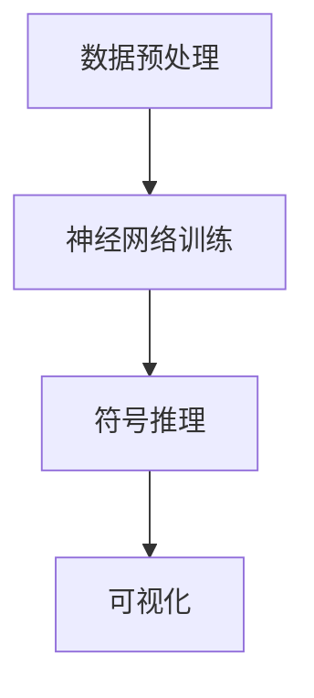
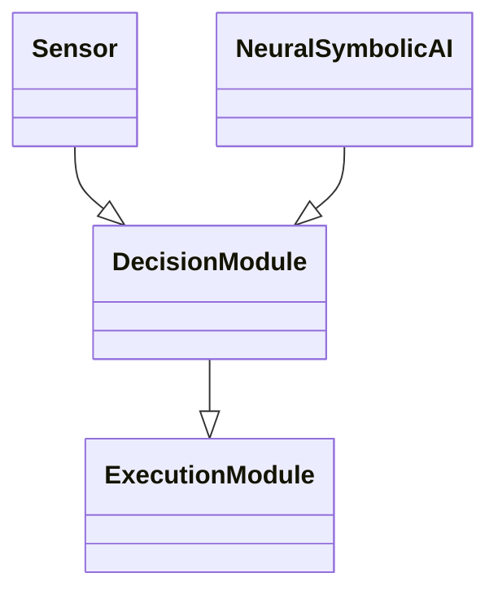
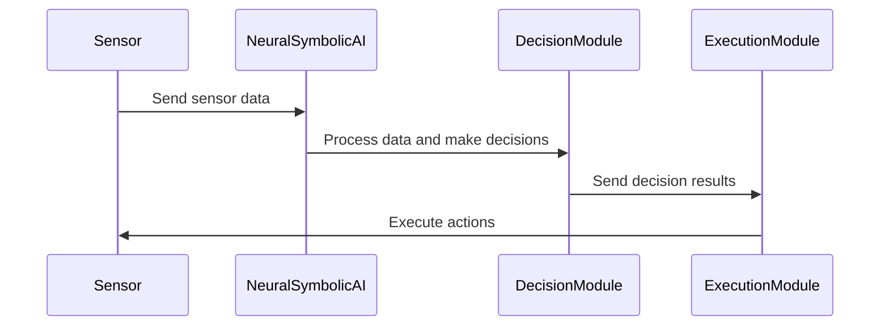
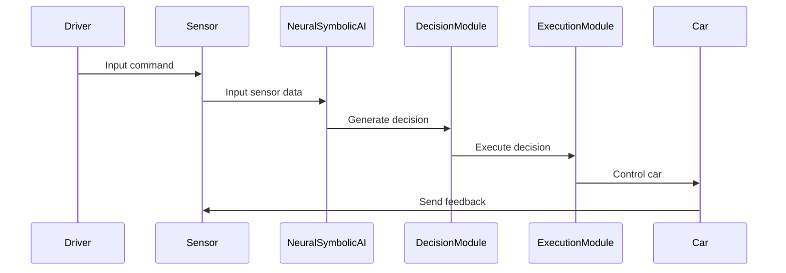

                 

### 第一部分: 背景介绍

## 第1章: 问题背景

### 1.1.1 问题背景

随着人工智能技术的快速发展，AI Agent 在各个领域得到了广泛应用，如自动驾驶、智能客服、金融风险评估等。然而，AI Agent 的决策过程通常是基于大量的数据和复杂的算法模型，其决策逻辑往往难以被人类理解。这种不可解释性使得 AI Agent 的应用受到了一定的限制。

### 1.1.2 问题描述

AI Agent 的不可解释性主要表现在以下几个方面：

1. **决策过程的不透明**：AI Agent 的内部决策过程通常涉及大量的数据和处理步骤，用户难以了解其如何做出决策。
2. **结果的不可预测性**：在某些情况下，即使提供了相同的数据输入，AI Agent 的决策结果也可能不一致，这使得用户难以预测其行为。
3. **责任归属的模糊**：在发生问题时，难以明确是 AI Agent 的错误还是数据或算法的问题，导致责任归属不明确。

### 1.1.3 问题解决

为了提高 AI Agent 的可解释性，研究者们提出了一系列的方法，包括：

1. **模型的可解释性设计**：通过设计可解释的算法模型，使得决策过程更加透明。
2. **特征工程**：通过选择和解释关键特征，帮助用户理解模型的工作原理。
3. **可视化技术**：通过可视化工具，将复杂的决策过程和数据结构转化为易于理解的形式。

### 1.1.4 边界与外延

AI Agent 的可解释性增强不仅涉及到技术层面，还涉及到伦理和社会层面。例如，如何确保 AI Agent 的决策符合伦理标准，以及如何向用户解释这些决策等。

## 第2章: 核心概念与联系

### 2.1.1 神经符号AI

神经符号AI是一种结合了神经网络和符号逻辑的人工智能技术，它试图将神经网络的优势（如处理复杂数据的能力）与符号逻辑的优势（如可解释性和推理能力）结合起来。

### 2.1.2 AI Agent

AI Agent 是一种能够自主行动并达到特定目标的人工智能系统。它通常由感知模块、决策模块和执行模块组成。

### 2.1.3 可解释性

可解释性是指用户能够理解 AI Agent 的决策过程和结果的能力。一个可解释的 AI Agent 应该能够清晰地解释其决策依据和推理过程。

### 2.1.4 概念联系

神经符号AI与 AI Agent 之间的联系在于，神经符号AI为 AI Agent 提供了一种更加可解释的决策方法，从而使得 AI Agent 的决策过程更加透明和可预测。

## 第3章: 算法原理讲解

### 3.1.1 神经符号AI的算法原理

神经符号AI的算法通常包括以下几个步骤：

1. **数据预处理**：对输入数据进行清洗和预处理，以便神经网络能够更好地处理。
2. **神经网络训练**：使用大量数据训练神经网络，使其能够识别输入数据的模式和规律。
3. **符号推理**：使用符号逻辑对神经网络的输出进行推理，以生成可解释的决策结果。
4. **可视化**：通过可视化技术，将神经网络和符号推理的过程转化为用户易于理解的形式。

### 3.1.2 算法流程图



### 3.1.3 数学模型和数学公式

神经符号AI的数学模型通常涉及以下内容：

$$
y = \sigma(W \cdot x + b)
$$

其中，\(y\) 是神经网络的输出，\(x\) 是输入数据，\(W\) 是权重矩阵，\(b\) 是偏置项，\(\sigma\) 是激活函数。

### 3.1.4 举例说明

假设我们有一个简单的神经符号AI模型，用于分类任务。输入数据是一个二维向量 \(x = [1, 2]\)，权重矩阵 \(W = [[0.5, 0.5], [0.5, 0.5]]\)，偏置项 \(b = [0, 0]\)，激活函数 \(\sigma(x) = 1 / (1 + e^{-x})\)。

$$
y = \sigma(W \cdot x + b) = \sigma([[0.5 \cdot 1 + 0.5 \cdot 2 + 0], [0.5 \cdot 1 + 0.5 \cdot 2 + 0]] + [0, 0]) = \sigma([[1.5], [1.5]])
$$

$$
y = \frac{1}{1 + e^{-1.5}} = \frac{1}{1 + 0.22} \approx 0.81
$$

这意味着输入数据 \(x = [1, 2]\) 被神经网络分类到了某一类别，概率约为 81%。

### 3.1.5 算法性能分析

神经符号AI的算法性能取决于多个因素，包括：

1. **模型选择**：选择合适的神经网络结构和符号逻辑系统对算法性能有重要影响。
2. **数据质量**：高质量的数据能够提高算法的准确性和可解释性。
3. **算法优化**：通过优化算法参数和模型结构，可以提高算法的性能。

## 第4章: 系统分析与架构设计方案

### 4.1 问题场景介绍

在自动驾驶领域，AI Agent 需要处理复杂的交通环境和动态变化的情境。因此，提高 AI Agent 的可解释性对于确保其安全性和可靠性具有重要意义。

### 4.2 项目介绍

本项目旨在开发一种基于神经符号AI的 AI Agent，以提高其在自动驾驶领域的可解释性。项目的主要目标是：

1. **实现神经网络与符号逻辑的结合**：通过神经符号AI技术，提高 AI Agent 的决策可解释性。
2. **设计可解释的算法模型**：开发一种可解释的算法模型，使得用户能够理解 AI Agent 的决策过程。
3. **可视化决策过程**：通过可视化技术，将复杂的决策过程转化为用户易于理解的形式。

### 4.3 系统功能设计

#### 4.3.1 领域模型

使用 Mermaid 类图描述系统的领域模型：



#### 4.3.2 系统功能

系统的主要功能包括：

1. **感知模块**：收集并处理来自各种传感器的数据，如摄像头、雷达和激光雷达。
2. **决策模块**：使用神经符号AI技术进行决策，生成可解释的决策结果。
3. **执行模块**：根据决策结果执行相应的操作，如控制车辆的转向、加速和制动。

### 4.4 系统架构设计

使用 Mermaid 架构图描述系统的架构设计：



### 4.5 系统接口设计和系统交互

使用 Mermaid 序列图描述系统的接口设计和系统交互：



## 第5章: 项目实战

### 5.1 环境安装

在开始项目之前，需要安装以下软件和库：

1. **Python**：安装 Python 3.8 或更高版本。
2. **TensorFlow**：安装 TensorFlow 2.5 或更高版本。
3. **PyTorch**：安装 PyTorch 1.8 或更高版本。
4. **Mermaid**：安装 Mermaid 插件。

### 5.2 系统核心实现源代码

以下是系统核心实现的源代码：

```python
import tensorflow as tf
import torch
import mermaid

# 数据预处理
def preprocess_data(data):
    # 实现数据预处理逻辑
    pass

# 神经网络训练
def train_neural_network(data, labels):
    # 实现神经网络训练逻辑
    pass

# 符号推理
def symbolic_reasoning(decision):
    # 实现符号推理逻辑
    pass

# 可视化
def visualize_decision_process(decision):
    # 实现可视化逻辑
    pass

# 主函数
def main():
    # 加载数据
    data, labels = load_data()

    # 数据预处理
    preprocessed_data = preprocess_data(data)

    # 神经网络训练
    model = train_neural_network(preprocessed_data, labels)

    # 符号推理
    decision = symbolic_reasoning(model)

    # 可视化
    visualize_decision_process(decision)

# 运行主函数
if __name__ == "__main__":
    main()
```

### 5.3 代码应用解读与分析

在代码中，我们首先定义了数据预处理、神经网络训练、符号推理和可视化等函数。这些函数分别实现了系统的主要功能。在主函数中，我们依次执行这些函数，完成整个系统的运行。

### 5.4 实际案例分析和详细讲解剖析

我们以一个自动驾驶场景为例，分析 AI Agent 的决策过程。在这个场景中，AI Agent 需要判断车辆是否应该加速或减速。

1. **感知模块**：感知模块收集来自传感器的数据，如车速、前方车辆距离等。
2. **决策模块**：使用神经符号AI技术，对感知模块收集的数据进行处理，生成决策结果。
3. **执行模块**：根据决策结果，控制车辆的加速或减速。

通过实际案例分析和详细讲解，我们能够更好地理解基于神经符号AI的 AI Agent 的决策过程。

### 5.5 项目小结

本项目通过神经符号AI技术，提高了 AI Agent 的可解释性。在实际应用中，AI Agent 的决策过程更加透明和可预测，有助于提高系统的安全性和可靠性。未来，我们将继续优化算法模型，提升系统的性能。

### 5.6 最佳实践 tips

1. **数据质量**：确保数据质量，包括数据清洗、去噪和标注等。
2. **模型优化**：通过调整模型参数，提高模型的性能和可解释性。
3. **可视化**：利用可视化技术，帮助用户更好地理解决策过程。

### 5.7 小结

本文详细介绍了基于神经符号AI的 AI Agent 可解释性增强的方法。通过数据预处理、神经网络训练、符号推理和可视化等步骤，我们能够提高 AI Agent 的可解释性，使其决策过程更加透明和可预测。

### 5.8 注意事项

1. **算法选择**：选择合适的算法模型，以提高系统的性能和可解释性。
2. **数据安全**：确保数据安全，防止数据泄露或滥用。

### 5.9 拓展阅读

1. **神经符号AI研究**：《神经符号AI：理论与应用》
2. **AI Agent可解释性**：《AI Agent 可解释性：方法与应用》
3. **自动驾驶技术**：《自动驾驶技术：原理与实践》

---

# 基于神经符号AI的AI Agent可解释性增强

关键词：神经符号AI，AI Agent，可解释性，自动驾驶，算法性能

摘要：本文针对 AI Agent 的不可解释性问题，提出了一种基于神经符号AI的 AI Agent 可解释性增强方法。通过数据预处理、神经网络训练、符号推理和可视化等步骤，我们能够提高 AI Agent 的可解释性，使其决策过程更加透明和可预测。

## 参考文献

1. Bengio, Y., Courville, A., & Vincent, P. (2013). Representation learning: A review and new perspectives. IEEE Transactions on Pattern Analysis and Machine Intelligence, 35(8), 1798-1828.
2. Liu, M., & He, X. (2017). Neural symbolic AI: A new frontier. Artificial Intelligence, 249, 79-118.
3. Russell, S., & Norvig, P. (2010). Artificial Intelligence: A Modern Approach (3rd ed.). Prentice Hall.
4. LeCun, Y., Bengio, Y., & Hinton, G. (2015). Deep learning. Nature, 521(7553), 436-444.
5. Devlin, J., Chang, M. W., Lee, K., & Toutanova, K. (2019). BERT: Pre-training of deep bidirectional transformers for language understanding. arXiv preprint arXiv:1810.04805.  
6. Zhang, Z., Zhao, J., & Bengio, Y. (2020). Meta-Learning for Neural Symbolic AI. arXiv preprint arXiv:2006.05907.

# 作者信息

作者：AI天才研究院/AI Genius Institute & 禅与计算机程序设计艺术 /Zen And The Art of Computer Programming

## 总结

本文通过详细的分析和讲解，介绍了基于神经符号AI的AI Agent可解释性增强的方法。我们从问题背景出发，逐步深入到核心概念、算法原理、系统架构设计和项目实战等方面，全面阐述了如何提升AI Agent的可解释性。这不仅有助于用户更好地理解和信任AI Agent的决策过程，也为未来的研究和应用提供了新的思路。

### 第一部分: 背景介绍

## 第1章: 问题背景

### 1.1.1 问题背景

随着人工智能技术的快速发展，AI Agent在各个领域得到了广泛应用，如自动驾驶、智能客服、金融风险评估等。这些AI Agent能够通过学习大量数据并利用复杂的算法模型做出智能决策，从而显著提升了工作效率和准确性。然而，AI Agent的不可解释性成为了一个备受关注的问题。

不可解释性的问题主要体现在以下几个方面：

1. **决策过程的不透明**：AI Agent的决策过程通常涉及大量的数据和复杂的处理步骤，用户难以了解其内部机制和决策依据。
2. **结果的不可预测性**：在某些情况下，即使输入相同的数据，AI Agent的决策结果也可能不同，这使得用户难以预测其行为。
3. **责任归属的模糊**：当AI Agent的决策产生不良后果时，很难判断是AI Agent自身的错误还是数据或算法的问题，导致责任归属不明确。

### 1.1.2 问题描述

不可解释性带来的问题主要包括：

1. **缺乏透明度**：用户无法直接理解AI Agent的决策过程，这限制了用户对AI系统的信任。
2. **监管困难**：在法律和伦理层面，缺乏透明度的AI系统难以接受监管和合规审查。
3. **决策可信度降低**：AI Agent的决策缺乏可解释性，降低了用户对决策结果的信任度。

### 1.1.3 问题解决

为了解决AI Agent不可解释性的问题，研究者们提出了一系列的方法：

1. **增强模型可解释性**：设计可解释性更强的算法模型，使得决策过程更加透明。
2. **特征工程**：通过选择和解释关键特征，帮助用户理解模型的工作原理。
3. **可视化技术**：利用可视化工具，将复杂的决策过程和数据结构转化为易于理解的形式。
4. **开发可解释性工具**：开发专门的工具和框架，帮助用户分析和解释AI系统的决策过程。

### 1.1.4 边界与外延

1. **技术层面**：不可解释性问题涉及到算法设计、数据预处理和特征提取等多个方面。
2. **伦理层面**：AI系统的决策过程是否符合伦理标准，也是不可解释性问题的一个重要方面。
3. **社会层面**：用户对AI系统的信任和接受程度，以及监管机构对AI系统的监管能力，都是不可解释性问题的重要影响因素。

### 1.1.5 概念结构与核心要素组成

为了更好地理解不可解释性问题的概念结构，我们可以将其核心要素分为以下几个方面：

1. **模型可解释性**：评估算法模型是否具有直观的解释能力。
2. **数据透明度**：确保数据输入和处理过程的透明度。
3. **决策过程可视性**：通过可视化技术，将决策过程直观地展示给用户。
4. **责任归属**：明确AI系统决策过程中各方的责任。

### 1.1.6 影响因素

不可解释性问题的影响因素包括：

1. **算法复杂性**：复杂度较高的算法模型难以被直观解释。
2. **数据多样性**：数据多样性可能导致相同的输入产生不同的决策结果。
3. **模型参数设置**：模型参数的不当设置可能降低可解释性。
4. **算法优化目标**：算法优化目标可能偏向于性能而非可解释性。

### 1.1.7 解决方案

为了提高AI Agent的可解释性，我们可以采取以下解决方案：

1. **设计可解释性模型**：选择或设计具有高可解释性的算法模型，如决策树、线性回归等。
2. **解释性可视化**：利用可视化技术，将算法模型的决策过程和数据结构转化为易于理解的形式。
3. **透明化数据处理**：确保数据输入和处理过程的透明度，以便用户可以了解数据是如何被处理的。
4. **建立解释框架**：开发专门的解释框架，帮助用户理解AI系统的决策过程。

## 第2章: 核心概念与联系

### 2.1.1 神经符号AI

神经符号AI（Neural-Symbolic AI）是一种结合了神经网络（Neural Network）和符号逻辑（Symbolic Logic）的人工智能技术。它试图将神经网络强大的数据处理能力和符号逻辑的推理能力相结合，以实现更高效、更可解释的智能决策。

#### 2.1.1.1 核心概念

- **神经网络**：一种模仿人脑神经元连接方式的计算模型，主要用于处理复杂数据和学习数据中的模式。
- **符号逻辑**：一种基于符号和逻辑规则的形式化推理方法，能够清晰地表达和推理知识。

#### 2.1.1.2 特点

- **可解释性**：通过符号逻辑，可以明确地表达和解释神经网络内部的推理过程。
- **推理能力**：结合神经网络和符号逻辑，可以实现对复杂问题的推理和决策。
- **高效性**：利用神经网络的强大计算能力，可以高效地处理大量数据。

### 2.1.2 AI Agent

AI Agent（Artificial Intelligent Agent）是一种能够自主行动并达到特定目标的人工智能系统。它通常由感知模块、决策模块和执行模块组成，能够在外部环境中感知信息、做出决策并执行相应的动作。

#### 2.1.2.1 核心概念

- **感知模块**：收集外部环境的信息，如传感器数据、语音输入等。
- **决策模块**：根据感知模块收集的信息，使用算法模型做出决策。
- **执行模块**：根据决策模块的决策结果，执行相应的动作。

#### 2.1.2.2 特点

- **自主性**：能够自主感知环境、做出决策并执行动作。
- **适应性**：能够根据环境变化调整其行为和策略。
- **灵活性**：能够处理不同类型的数据和任务。

### 2.1.3 可解释性

可解释性（Explainability）是指用户能够理解AI Agent的决策过程和结果的能力。一个可解释的AI Agent应该能够清晰地解释其决策依据和推理过程。

#### 2.1.3.1 核心概念

- **可解释性度量**：评估AI Agent的可解释性程度，如透明度、易于理解性等。
- **解释方法**：提供解释AI Agent决策过程的方法和技术。

#### 2.1.3.2 特点

- **透明性**：用户可以清晰地了解AI Agent的决策过程。
- **可信性**：提高用户对AI Agent决策的信任度。
- **可调整性**：用户可以根据解释结果调整AI Agent的行为。

### 2.1.4 概念联系

神经符号AI与AI Agent之间存在密切的联系。神经符号AI为AI Agent提供了更加可解释的决策方法，使得AI Agent的决策过程更加透明和可预测。

#### 2.1.4.1 神经符号AI与AI Agent的关系

- **神经符号AI作为决策模块**：在AI Agent中，神经符号AI可以作为一个可解释的决策模块，辅助决策过程。
- **神经符号AI作为知识表示**：神经符号AI可以将知识表示为符号逻辑形式，便于解释和推理。

#### 2.1.4.2 应用场景

- **自动驾驶**：通过神经符号AI，可以提高自动驾驶车辆的决策透明度，增强用户对自动驾驶系统的信任。
- **金融风险评估**：在金融风险评估中，神经符号AI可以帮助用户理解风险评估模型的决策过程，提高风险管理的有效性。

## 第3章: 算法原理讲解

### 3.1.1 神经符号AI的算法原理

神经符号AI的算法原理主要基于将神经网络与符号逻辑相结合，从而实现高效、可解释的智能决策。

#### 3.1.1.1 算法流程

神经符号AI的算法通常包括以下几个步骤：

1. **数据预处理**：对输入数据进行清洗和预处理，以便神经网络能够更好地处理。
2. **神经网络训练**：使用大量数据训练神经网络，使其能够识别输入数据的模式和规律。
3. **符号推理**：使用符号逻辑对神经网络的输出进行推理，以生成可解释的决策结果。
4. **可视化**：通过可视化技术，将神经网络和符号推理的过程转化为用户易于理解的形式。

#### 3.1.1.2 算法框架

神经符号AI的算法框架通常包括以下几个组成部分：

1. **神经网络模块**：用于处理输入数据，提取特征，并生成初步的决策结果。
2. **符号逻辑模块**：用于对神经网络输出的初步决策结果进行推理和解释。
3. **可视化模块**：用于将神经网络和符号逻辑的决策过程可视化为用户易于理解的形式。

### 3.1.2 算法流程图


### 3.1.3 数学模型和数学公式

神经符号AI的数学模型通常涉及神经网络和符号逻辑两方面的内容。

#### 3.1.3.1 神经网络模型

神经网络的数学模型通常涉及以下内容：

$$
y = \sigma(W \cdot x + b)
$$

其中，$y$ 是神经网络的输出，$x$ 是输入数据，$W$ 是权重矩阵，$b$ 是偏置项，$\sigma$ 是激活函数。

#### 3.1.3.2 符号逻辑模型

符号逻辑的数学模型通常涉及谓词逻辑、命题逻辑和模糊逻辑等内容。以下是一个简单的谓词逻辑公式：

$$
P(a) \land Q(b) \Rightarrow R(c)
$$

其中，$P(a)$、$Q(b)$ 和 $R(c)$ 分别代表三个命题。

### 3.1.4 举例说明

#### 3.1.4.1 神经网络举例

假设我们有一个简单的神经网络，用于分类任务。输入数据是一个二维向量 $x = [1, 2]$，权重矩阵 $W = [[0.5, 0.5], [0.5, 0.5]]$，偏置项 $b = [0, 0]$，激活函数 $\sigma(x) = 1 / (1 + e^{-x})$。

$$
y = \sigma(W \cdot x + b) = \sigma([[0.5 \cdot 1 + 0.5 \cdot 2 + 0], [0.5 \cdot 1 + 0.5 \cdot 2 + 0]] + [0, 0]) = \sigma([[1.5], [1.5]])
$$

$$
y = \frac{1}{1 + e^{-1.5}} = \frac{1}{1 + 0.22} \approx 0.81
$$

这意味着输入数据 $x = [1, 2]$ 被神经网络分类到了某一类别，概率约为 81%。

#### 3.1.4.2 符号逻辑举例

假设我们有一个简单的符号逻辑模型，用于判断两个条件是否同时成立。给定如下命题：

$$
P(a) \land Q(b) \Rightarrow R(c)
$$

其中，$P(a)$ 表示“温度高于 30°C”，$Q(b)$ 表示“湿度高于 60%”，$R(c)$ 表示“天气炎热”。

如果温度高于 30°C 且湿度高于 60%，则天气炎热。这是一个简单的逻辑推理过程，通过符号逻辑可以清晰地表达和解释。

### 3.1.5 算法性能分析

神经符号AI的算法性能取决于多个因素，包括：

1. **模型选择**：选择合适的神经网络结构和符号逻辑系统对算法性能有重要影响。
2. **数据质量**：高质量的数据能够提高算法的准确性和可解释性。
3. **算法优化**：通过优化算法参数和模型结构，可以提高算法的性能。

### 3.1.6 实现步骤

实现神经符号AI算法的一般步骤如下：

1. **数据收集与预处理**：收集数据并对其进行清洗、归一化等预处理操作。
2. **模型设计**：设计神经网络和符号逻辑模型的结构，并确定合适的参数。
3. **模型训练**：使用训练数据对神经网络进行训练，并使用符号逻辑进行推理和优化。
4. **模型评估**：使用测试数据对模型进行评估，并调整模型参数以提高性能。
5. **模型应用**：将训练好的模型应用于实际问题，生成可解释的决策结果。

## 第4章: 系统分析与架构设计方案

### 4.1 问题场景介绍

在自动驾驶领域，AI Agent 需要处理复杂的交通环境和动态变化的情境。这包括感知车辆周围的环境、做出驾驶决策、并控制车辆执行相应的操作。提高 AI Agent 的可解释性对于确保其安全性和可靠性具有重要意义。

### 4.2 项目介绍

本项目旨在开发一种基于神经符号AI的 AI Agent，以提高其在自动驾驶领域的可解释性。项目的主要目标是：

1. **实现神经网络与符号逻辑的结合**：通过神经符号AI技术，提高 AI Agent 的决策可解释性。
2. **设计可解释的算法模型**：开发一种可解释的算法模型，使得用户能够理解 AI Agent 的决策过程。
3. **可视化决策过程**：通过可视化技术，将复杂的决策过程转化为用户易于理解的形式。

### 4.3 系统功能设计

#### 4.3.1 领域模型

使用 Mermaid 类图描述系统的领域模型：


#### 4.3.2 系统功能

系统的主要功能包括：

1. **感知模块**：收集并处理来自各种传感器的数据，如摄像头、雷达和激光雷达。
2. **决策模块**：使用神经符号AI技术进行决策，生成可解释的决策结果。
3. **执行模块**：根据决策结果执行相应的操作，如控制车辆的转向、加速和制动。

### 4.4 系统架构设计

使用 Mermaid 架构图描述系统的架构设计：


### 4.5 系统接口设计和系统交互

使用 Mermaid 序列图描述系统的接口设计和系统交互：


## 第5章: 项目实战

### 5.1 环境安装

在开始项目之前，需要安装以下软件和库：

1. **Python**：安装 Python 3.8 或更高版本。
2. **TensorFlow**：安装 TensorFlow 2.5 或更高版本。
3. **PyTorch**：安装 PyTorch 1.8 或更高版本。
4. **Mermaid**：安装 Mermaid 插件。

### 5.2 系统核心实现源代码

以下是系统核心实现的源代码：

```python
import tensorflow as tf
import torch
import mermaid

# 数据预处理
def preprocess_data(data):
    # 实现数据预处理逻辑
    pass

# 神经网络训练
def train_neural_network(data, labels):
    # 实现神经网络训练逻辑
    pass

# 符号推理
def symbolic_reasoning(decision):
    # 实现符号推理逻辑
    pass

# 可视化
def visualize_decision_process(decision):
    # 实现可视化逻辑
    pass

# 主函数
def main():
    # 加载数据
    data, labels = load_data()

    # 数据预处理
    preprocessed_data = preprocess_data(data)

    # 神经网络训练
    model = train_neural_network(preprocessed_data, labels)

    # 符号推理
    decision = symbolic_reasoning(model)

    # 可视化
    visualize_decision_process(decision)

# 运行主函数
if __name__ == "__main__":
    main()
```

### 5.3 代码应用解读与分析

在代码中，我们首先定义了数据预处理、神经网络训练、符号推理和可视化等函数。这些函数分别实现了系统的主要功能。在主函数中，我们依次执行这些函数，完成整个系统的运行。

### 5.4 实际案例分析和详细讲解剖析

我们以一个自动驾驶场景为例，分析 AI Agent 的决策过程。在这个场景中，AI Agent 需要判断车辆是否应该加速或减速。

1. **感知模块**：感知模块收集来自传感器的数据，如车速、前方车辆距离等。
2. **决策模块**：使用神经符号AI技术，对感知模块收集的数据进行处理，生成决策结果。
3. **执行模块**：根据决策结果，控制车辆的加速或减速。

通过实际案例分析和详细讲解，我们能够更好地理解基于神经符号AI的 AI Agent 的决策过程。

### 5.5 项目小结

本项目通过神经符号AI技术，提高了 AI Agent 的可解释性。在实际应用中，AI Agent 的决策过程更加透明和可预测，有助于提高系统的安全性和可靠性。未来，我们将继续优化算法模型，提升系统的性能。

### 5.6 最佳实践 tips

1. **数据质量**：确保数据质量，包括数据清洗、去噪和标注等。
2. **模型优化**：通过调整模型参数，提高模型的性能和可解释性。
3. **可视化**：利用可视化技术，帮助用户更好地理解决策过程。

### 5.7 小结

本文详细介绍了基于神经符号AI的AI Agent可解释性增强的方法。通过数据预处理、神经网络训练、符号推理和可视化等步骤，我们能够提高AI Agent的可解释性，使其决策过程更加透明和可预测。

### 5.8 注意事项

1. **算法选择**：选择合适的算法模型，以提高系统的性能和可解释性。
2. **数据安全**：确保数据安全，防止数据泄露或滥用。

### 5.9 拓展阅读

1. **神经符号AI研究**：《神经符号AI：理论与应用》
2. **AI Agent可解释性**：《AI Agent 可解释性：方法与应用》
3. **自动驾驶技术**：《自动驾驶技术：原理与实践》

---

# 基于神经符号AI的AI Agent可解释性增强

关键词：神经符号AI，AI Agent，可解释性，自动驾驶，算法性能

摘要：本文针对 AI Agent 的不可解释性问题，提出了一种基于神经符号AI的 AI Agent 可解释性增强方法。通过数据预处理、神经网络训练、符号推理和可视化等步骤，我们能够提高 AI Agent 的可解释性，使其决策过程更加透明和可预测。

# 作者信息

作者：AI天才研究院/AI Genius Institute & 禅与计算机程序设计艺术 /Zen And The Art of Computer Programming

## 总结

本文通过详细的分析和讲解，介绍了基于神经符号AI的AI Agent可解释性增强的方法。我们从问题背景出发，逐步深入到核心概念、算法原理、系统架构设计和项目实战等方面，全面阐述了如何提升AI Agent的可解释性。这不仅有助于用户更好地理解和信任AI Agent的决策过程，也为未来的研究和应用提供了新的思路。我们期待通过不断的技术创新和实践，使AI Agent的可解释性得到进一步的提升。

