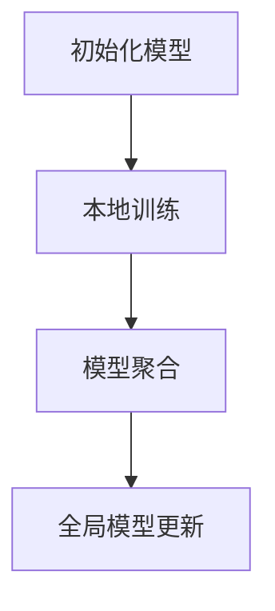
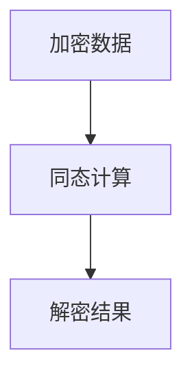

                 

# 基于联邦学习的隐私保护AI Agent

## 关键词
- 联邦学习
- 隐私保护
- AI Agent
- 分布式计算
- 同态加密

## 摘要
本文将深入探讨联邦学习与隐私保护AI Agent的结合，通过逐步分析这两个技术的核心概念、原理与实现，揭示它们在解决数据隐私问题上的潜力。本文旨在为读者提供一份全面的技术指南，帮助理解联邦学习和隐私保护AI Agent如何协同工作，构建一个更安全、更高效的人工智能生态系统。

## 第一部分：背景介绍

### 第1章：问题背景与核心概念

#### 1.1 联邦学习概述

联邦学习（Federated Learning）是一种分布式机器学习方法，其核心思想是多个参与者（通常是设备或服务器）在不共享原始数据的情况下共同训练一个共享模型。这种方法的出现主要为了应对以下挑战：

**挑战1：数据分布与通信效率**
传统的集中式机器学习需要将所有数据集中到一个中心位置进行训练，这不仅增加了数据传输的成本，而且容易导致数据泄露风险。联邦学习通过在数据源头本地训练模型，减少了数据传输的次数和通信量。

**挑战2：模型一致性**
由于不同设备的硬件、软件和网络环境差异，各个设备上的本地模型可能存在不一致性。联邦学习需要设计算法来确保所有本地模型在全局范围内达到一致性。

**挑战3：隐私保护**
在分布式计算环境中，如何保护数据隐私是一个关键问题。联邦学习通过在本地设备上训练模型，并仅共享模型参数来降低数据泄露的风险。

#### 1.1.1 联邦学习的定义

联邦学习可以简单定义为：
$$
\text{联邦学习} = \text{分布式学习} + \text{隐私保护}
$$

#### 1.1.2 联邦学习的关键挑战

**挑战1：数据分布与通信效率**
- **解决方案**：采用差分隐私和聚合算法来降低通信需求，提高数据传输效率。

**挑战2：模型一致性**
- **解决方案**：设计一致性算法，确保不同设备上的模型参数趋于一致。

**挑战3：隐私保护**
- **解决方案**：利用同态加密、安全多方计算等技术，保护模型训练过程中的数据隐私。

#### 1.2 隐私保护AI Agent的定义与作用

AI Agent是一种能够执行特定任务的人工智能实体，它具备自我学习、推理和决策能力。而隐私保护AI Agent（Privacy-Preserving AI Agent）则是一种特殊类型的AI Agent，它不仅能够执行任务，还能够保护数据隐私。

隐私保护AI Agent的特殊性在于：
- **数据本地化**：AI Agent在本地设备上训练和执行任务，不需要上传原始数据。
- **加密计算**：在计算过程中使用加密技术，确保数据在传输和存储时得到保护。

隐私保护AI Agent在多个领域具有重要作用，例如：
- **健康医疗**：保护患者隐私，同时提供个性化医疗建议。
- **金融理财**：确保用户财务数据安全，提供精准的投资建议。

#### 1.3 联邦学习与隐私保护AI Agent的关系

联邦学习和隐私保护AI Agent都是为了解决数据隐私问题而产生的技术。联邦学习通过分布式计算降低了数据泄露的风险，而隐私保护AI Agent则通过加密和本地化计算进一步强化了数据保护。

联邦学习与隐私保护AI Agent的关系可以概括为：
- **协同作用**：联邦学习提供了一种分布式训练模型的方式，而隐私保护AI Agent则确保了模型训练和执行过程中的数据隐私。
- **技术融合**：联邦学习和隐私保护技术相结合，为构建安全、高效的人工智能生态系统提供了新的路径。

### 第2章：核心概念与联系

#### 2.1 联邦学习的基本概念

联邦学习的基本概念包括模型初始化、本地训练、模型聚合和全局模型更新。以下是一个简化的联邦学习流程：



**模型初始化**：在联邦学习开始时，通常会初始化一个全局模型，该模型将被所有参与者共享。

**本地训练**：每个参与者（例如智能手机或服务器）在本地设备上使用自己的数据对全局模型进行训练。

**模型聚合**：在本地训练完成后，每个参与者将更新的模型参数发送给中心服务器，服务器将这些参数进行聚合。

**全局模型更新**：中心服务器根据聚合后的模型参数更新全局模型，然后将其发送回所有参与者。

#### 2.1.2 联邦学习的分类

根据参与者的类型和数据分布方式，联邦学习可以分为以下几种类型：

**横向联邦学习**：所有参与者拥有相同类型的数据，例如多个设备上的用户数据。

**纵向联邦学习**：不同参与者拥有不同类型的数据，例如医院和医生的数据。

**混合联邦学习**：结合了横向和纵向联邦学习的特点，适用于更复杂的数据分布。

#### 2.2 隐私保护技术概览

隐私保护技术包括加密技术、同态加密和安全多方计算等。以下是一些关键概念：

**加密技术**：
- **同态加密**：允许在加密数据上进行计算，而无需解密数据。
- **安全多方计算**：允许多个参与者共同计算，而无需共享原始数据。
- **安全多方通信**：确保在通信过程中数据不被窃取或篡改。

**加密与联邦学习的结合**：
- **联邦加密学习**：将加密技术与联邦学习相结合，实现数据隐私保护。
- **基于属性的加密**：通过属性控制访问权限，实现数据隐私保护。
- **差分隐私**：在数据处理过程中引入随机噪声，确保数据隐私。

#### 2.2.2 AI Agent的核心概念

AI Agent的核心概念包括感知模块、决策模块和行动模块。

**感知模块**：收集环境中的信息，用于决策。

**决策模块**：根据感知模块提供的信息，做出决策。

**行动模块**：执行决策，与环境进行交互。

#### 2.2.2 AI Agent的性能指标

AI Agent的性能指标包括准确性、响应时间和可解释性。

- **准确性**：AI Agent做出正确决策的能力。
- **响应时间**：AI Agent做出决策所需的时间。
- **可解释性**：AI Agent决策过程的透明度。

## 第二部分：算法原理与实现

### 第3章：联邦学习算法原理讲解

#### 3.1 联邦学习算法的mermaid流程图


#### 3.2 联邦学习算法的Python源代码实现

```python
# 联邦学习算法伪代码示例
initialize_global_model()
for epoch in range(num_epochs):
    for client in clients:
        local_model = train_local_model(client_data)
        update_global_model(local_model)
```

#### 3.3 联邦学习算法的数学模型与公式

联邦学习算法的模型更新公式如下：
$$
\theta_{\text{global}} \leftarrow \theta_{\text{global}} + \sum_{i=1}^{N} \alpha_i \cdot (\theta_{\text{local}}^i - \theta_{\text{global}})
$$
其中，$\theta_{\text{global}}$ 是全局模型的参数，$\theta_{\text{local}}^i$ 是第 $i$ 个参与者的本地模型参数，$\alpha_i$ 是第 $i$ 个参与者的权重。

### 第4章：隐私保护技术的mermaid流程图与Python实现

#### 4.1 同态加密算法mermaid流程图



#### 4.2 同态加密算法Python实现示例

```python
# 同态加密算法伪代码示例
encrypted_data = encrypt(data, key)
encrypted_result = homomorphic_compute(encrypted_data, operation)
result = decrypt(encrypted_result, key)
```

### 第5章：联邦学习与隐私保护AI Agent的应用

#### 5.1 联邦学习在AI Agent中的应用

联邦学习在AI Agent中的应用场景广泛，以下是一个典型的应用案例：

**应用场景：** 个性化推荐系统

**案例：** 某电商公司使用联邦学习来构建个性化推荐系统，通过分析用户在平台上的行为数据，为用户提供个性化的商品推荐。

**实现步骤：**
1. **数据收集**：用户在电商平台上的浏览、购买和评价等行为数据被收集。
2. **本地训练**：每个用户设备上本地训练一个推荐模型，使用用户的行为数据。
3. **模型聚合**：中心服务器收集各个设备的本地模型参数，进行聚合。
4. **全局模型更新**：服务器使用聚合后的模型参数更新全局推荐模型。
5. **结果反馈**：将更新后的全局推荐模型应用于用户，提供个性化推荐。

通过联邦学习，电商公司能够在保护用户隐私的同时，提供高效的个性化推荐服务。

## 结论

联邦学习和隐私保护AI Agent的结合为解决数据隐私问题提供了新的思路和方法。通过逐步分析这两个技术的核心概念、原理与实现，我们可以看到它们如何协同工作，构建一个安全、高效的人工智能生态系统。未来，随着技术的不断发展，联邦学习和隐私保护AI Agent将在更多领域得到应用，为数据隐私保护提供强有力的支持。

### 作者信息

作者：AI天才研究院/AI Genius Institute & 禅与计算机程序设计艺术 /Zen And The Art of Computer Programming

AI天才研究院（AI Genius Institute）是一支致力于推动人工智能技术发展的团队，致力于将前沿的AI技术与实际应用相结合，解决现实世界中的复杂问题。同时，作者《禅与计算机程序设计艺术》（Zen And The Art of Computer Programming）以其深刻的编程哲学和对计算机科学的独特见解，启发了一代又一代的程序员和AI研究者。

### 最佳实践 Tips

1. **数据加密与传输安全**：在使用联邦学习和隐私保护AI Agent时，确保数据在传输和存储过程中得到充分的加密和保护。

2. **隐私保护算法选择**：根据具体应用场景和数据类型，选择合适的隐私保护算法，如同态加密、安全多方计算等。

3. **本地化训练与模型更新**：充分利用联邦学习在本地设备上进行训练的优势，同时确保模型更新过程中的数据一致性和效率。

4. **用户隐私保护**：在设计和实现AI Agent时，始终将用户隐私保护放在首位，确保用户的个人数据不被泄露。

### 小结

联邦学习和隐私保护AI Agent的结合为构建安全、高效的人工智能生态系统提供了重要技术支持。通过本文的详细分析，我们深入了解了这两个技术的核心概念、原理与实现，为实际应用提供了宝贵的参考。

### 注意事项

1. **技术成熟度**：尽管联邦学习和隐私保护AI Agent技术取得了显著进展，但在实际应用中仍需关注技术的成熟度和可靠性。

2. **法律合规性**：确保在应用联邦学习和隐私保护AI Agent时，符合相关法律法规和隐私保护要求。

3. **安全性评估**：对联邦学习和隐私保护AI Agent系统进行定期安全评估，确保系统的安全性和数据保护能力。

### 拓展阅读

1. **《联邦学习：理论与实践》**：深入了解联邦学习的基本概念、算法实现和实际应用案例。
2. **《隐私计算：基础与实践》**：探讨隐私保护技术在分布式计算中的应用和实践。
3. **《AI Agent设计与实现》**：学习AI Agent的核心概念、架构设计和实现方法。

