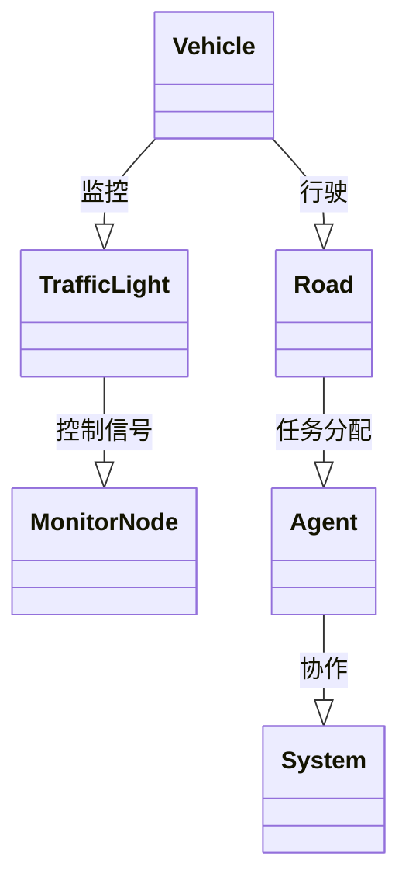
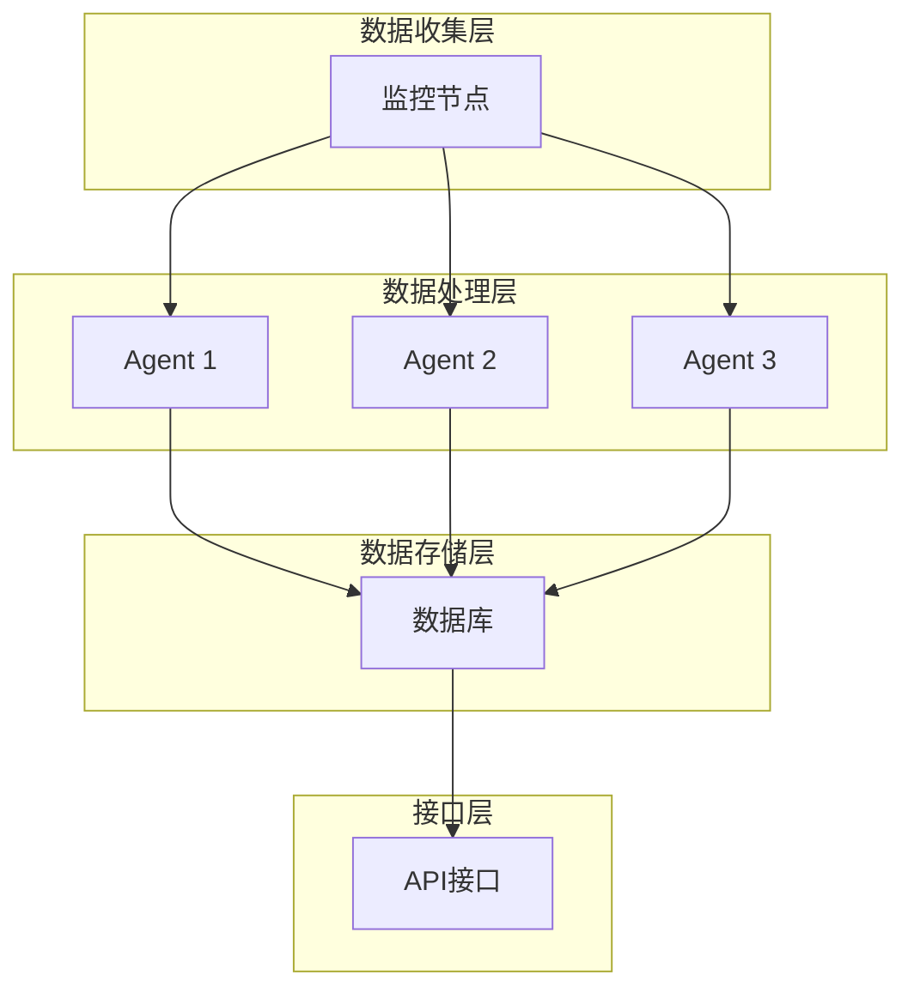
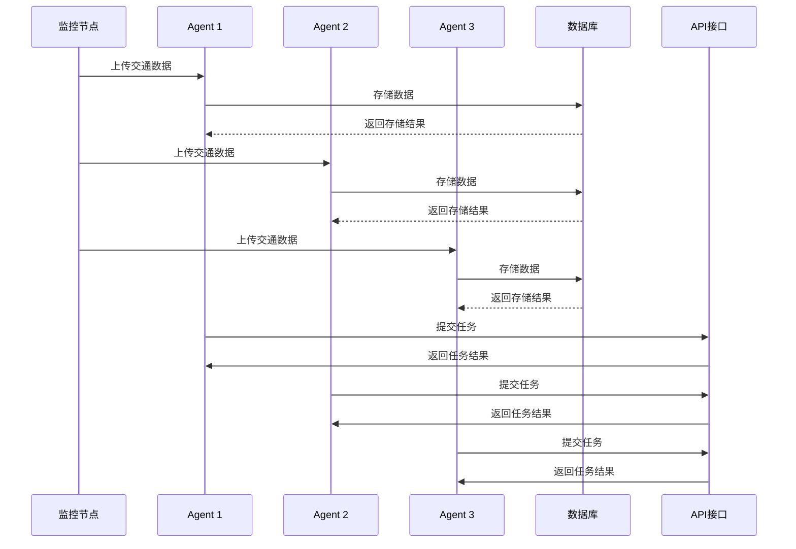

                 

# 多Agent协作系统：复杂任务的分布式解决方案

## 关键词
- 多Agent系统
- 分布式解决方案
- 协调策略
- 通信机制
- 动态行为模型
- 应用案例分析

## 摘要
本文深入探讨了多Agent协作系统在处理复杂任务中的分布式解决方案。首先，我们介绍了多Agent系统的基本概念、通信机制和协调策略，接着阐述了多Agent系统的动态行为模型，并通过多个应用场景和案例分析了其分布式解决方案的实际效果。本文旨在为读者提供一个全面而深入的视角，以理解多Agent协作系统在分布式计算中的潜力与挑战。

## 目录大纲

### 第1章 引言
1.1 问题背景
1.2 问题描述
1.3 问题解决
1.4 边界与外延
1.5 核心概念与联系

### 第2章 多Agent系统的基本概念
2.1 定义与特点
2.2 基本模型
2.3 演化历史
2.4 应用领域

### 第3章 多Agent系统的通信机制
3.1 消息传递机制
3.2 通信协议
3.3 通信语言

### 第4章 多Agent系统的协调策略
4.1 协调策略概述
4.2 分配式协调
4.3 中心式协调
4.4 协调算法案例分析

### 第5章 多Agent系统的动态行为模型
5.1 动态行为模型概述
5.2 马尔可夫决策过程
5.3 贝叶斯网络
5.4 仿生学模型

### 第6章 多Agent系统的应用场景与案例分析
6.1 社交网络中的多Agent系统
6.2 供应链管理中的多Agent系统
6.3 网络安全中的多Agent系统
6.4 案例分析

### 第7章 多Agent系统的分布式解决方案
7.1 分布式计算概述
7.2 分布式算法
7.3 分布式数据管理
7.4 分布式存储方案

### 第8章 多Agent系统的挑战与未来发展趋势
8.1 挑战与问题
8.2 发展趋势
8.3 未来展望

### 第9章 小结
9.1 主要内容回顾
9.2 注意事项
9.3 拓展阅读

### 第1章 引言

#### 1.1 问题背景

在当今高度互联和复杂的计算环境中，单点解决方案已经难以满足现代计算任务的需求。复杂任务往往需要多个智能实体（或Agent）相互协作，共同完成。多Agent系统（MAS）提供了一个分布式计算框架，通过智能代理之间的协同作用，实现复杂任务的高效处理。

#### 1.2 问题描述

多Agent系统在分布式计算中面临的主要问题包括：
- **通信机制**：多个Agent之间如何高效、可靠地进行通信？
- **协调策略**：如何确保Agent之间的协作达到预期效果？
- **动态行为模型**：如何描述Agent的动态行为，以适应变化的环境？

#### 1.3 问题解决

为了解决上述问题，多Agent系统采用了多种策略和技术，包括：
- **分布式解决方案**：通过分布式计算和存储技术，提高系统的性能和可扩展性。
- **协调策略**：采用分配式和中心式协调策略，确保Agent之间的有效协作。
- **动态行为模型**：使用马尔可夫决策过程、贝叶斯网络和仿生学模型，描述Agent的动态行为。

#### 1.4 边界与外延

多Agent系统的研究边界包括：
- **通信机制**：研究Agent之间的通信协议和语言。
- **协调策略**：研究不同协调策略的优缺点和应用场景。
- **动态行为模型**：研究如何构建适合特定应用场景的行为模型。

多Agent系统的研究外延涉及：
- **应用领域**：社交网络、供应链管理、网络安全等。
- **跨学科融合**：与其他领域（如机器学习、数据挖掘等）的交叉研究。

#### 1.5 核心概念与联系

核心概念包括：
- **多Agent系统**：由多个智能代理组成的分布式计算系统。
- **Agent**：具有自主性、社会性、反应性、可通信和认知能力的实体。
- **分布式解决方案**：利用分布式计算和存储技术实现高效处理。

这些概念之间的联系在于：
- 多Agent系统通过分布式解决方案实现复杂任务的高效处理。
- Agent的自主性和社会性是其能够协作完成复杂任务的基础。
- 分布式解决方案的优劣直接影响多Agent系统的性能。

### 第2章 多Agent系统的基本概念

#### 2.1 定义与特点

多Agent系统（MAS）是一种分布式计算模型，由多个具有自主性、社会性、反应性和认知能力的智能代理组成。这些代理可以相互协作，共同完成复杂的任务。多Agent系统的定义如下：

**多Agent系统**：一个由多个Agent组成的分布式系统，这些Agent通过相互协作，共同完成复杂的任务。

多Agent系统的特点包括：
- **自主性**：每个Agent具有独立的行为和决策能力，可以自主地选择行为。
- **社会性**：Agent之间可以相互交互，共享信息和资源。
- **反应性**：Agent能够对外界事件作出实时响应。
- **认知性**：Agent具有认知能力，可以理解环境、学习和改进自身行为。

#### 2.2 基本模型

多Agent系统可以采用多种基本模型，包括：

1. **集中式模型**：所有Agent的行为由一个中央控制器统一调度。
2. **分布式模型**：Agent之间相互协作，自主决策，共同完成任务。
3. **混合模型**：结合集中式和分布式模型的优点，既具有中央控制器的调度能力，又支持Agent之间的自主协作。

**集中式模型**的优点在于控制简单、易于实现，但缺点是系统的可扩展性较差，容易成为单点故障。

**分布式模型**的优点在于系统具有较高的可扩展性和容错能力，但缺点是协调复杂，需要解决通信和协作问题。

**混合模型**则结合了集中式和分布式模型的优点，适用于需要高度协作和灵活性的场景。

#### 2.3 演化历史

多Agent系统的概念起源于人工智能领域，最早可以追溯到20世纪80年代。当时，研究人员开始探索如何通过多个智能代理的协作来实现复杂任务。

1. **初始阶段（1980s-1990s）**：多Agent系统的研究主要集中在模拟人类社会的交互行为，以及如何构建具有自主性和反应性的Agent。
2. **发展阶段（2000s）**：随着分布式计算和网络技术的发展，多Agent系统逐渐应用于实际场景，如智能代理、协同过滤和供应链管理等。
3. **成熟阶段（2010s-至今）**：多Agent系统的研究扩展到包括机器学习、数据挖掘和物联网等新兴领域，成为分布式计算的重要研究方向。

#### 2.4 应用领域

多Agent系统在多个领域都有广泛应用，包括：

- **社交网络**：用于社交推荐、社群管理和用户行为分析。
- **供应链管理**：用于库存管理、物流优化和供应链协同。
- **网络安全**：用于入侵检测、恶意软件分析和网络安全监控。
- **自动驾驶**：用于车辆间的通信与协作，实现智能交通管理。
- **智能制造**：用于生产调度、设备维护和智能工厂管理。

这些应用场景表明，多Agent系统在分布式计算和复杂任务处理方面具有巨大的潜力。然而，要充分发挥其潜力，还需要解决通信、协调和动态行为建模等关键问题。

### 第3章 多Agent系统的通信机制

#### 3.1 消息传递机制

多Agent系统的通信机制是其实现协作的核心之一。消息传递机制是多Agent系统中最常用的通信方式，通过消息传递，Agent可以交换信息、协调行动和共享资源。

**消息传递机制**的基本原理如下：

1. **发送消息**：一个Agent可以向其他Agent发送消息，消息可以是文本、数据或命令。
2. **接收消息**：其他Agent可以接收并处理发送给它的消息。
3. **消息路由**：在分布式环境中，消息需要通过合适的路径传输到目标Agent。

常见的消息传递机制包括：

- **直接通信**：Agent直接通过通信协议发送消息到目标Agent。
- **间接通信**：Agent通过一个或多个中介Agent传递消息。

**直接通信**的优点在于通信延迟较低，但要求Agent之间的网络拓扑结构已知，且容易受到网络拓扑变化的影响。

**间接通信**的优点在于可以隐藏网络拓扑结构，降低Agent之间的耦合度，但通信延迟较高，且中介Agent可能成为瓶颈。

#### 3.2 通信协议

通信协议是多Agent系统通信机制的重要组成部分，它定义了Agent之间通信的格式、规则和约定。常见的通信协议包括：

- **基于文件的通信**：Agent通过共享文件系统交换数据，适用于静态环境。
- **基于socket的通信**：Agent通过TCP/IP协议栈实现网络通信，适用于动态环境。
- **基于消息队列的通信**：Agent通过消息队列（如RabbitMQ、Kafka等）发送和接收消息，适用于高吞吐量和异步通信。

每种通信协议都有其优缺点，选择合适的协议取决于应用场景的需求，如通信速率、可靠性、可扩展性和易用性等。

#### 3.3 通信语言

通信语言是多Agent系统通信机制中用于表示消息和数据的一种抽象语法。常见的通信语言包括：

- **XML**：可扩展标记语言，用于表示复杂的数据结构。
- **JSON**：JavaScript对象表示法，用于轻量级数据交换。
- **Protocol Buffers**：Google开发的一种数据交换格式，适用于高效率的序列化和反序列化。

通信语言的选择取决于数据复杂度和传输效率，XML适合表示复杂的数据结构，但序列化和反序列化开销较大；JSON轻量级、易读，但表示复杂度较低；Protocol Buffers在性能和效率上具有优势，但需要预先定义数据结构。

### 第4章 多Agent系统的协调策略

#### 4.1 协调策略概述

多Agent系统中的协调策略是实现Agent间有效协作的关键。协调策略是指一组规则或算法，用于指导Agent在执行任务时相互协作，以实现整体目标。协调策略可以分为两类：分配式协调和中心式协调。

**分配式协调**：在分配式协调策略中，每个Agent独立地制定自己的决策，并通过局部信息进行协作。分配式协调的优点在于：
- **灵活性**：Agent可以根据自身局部信息灵活调整行为。
- **容错性**：即使部分Agent失效，系统仍能通过其他Agent继续运行。

但分配式协调也面临一些挑战，如局部最优可能导致全局次优，以及通信开销较大。

**中心式协调**：在中心式协调策略中，所有Agent的决策都由一个中心控制器统一制定。中心式协调的优点在于：
- **全局性**：能够根据全局信息制定最佳决策。
- **高效性**：减少了Agent之间的通信开销。

然而，中心式协调也具有局限性，如：
- **单点故障**：中心控制器成为系统的瓶颈，一旦故障，整个系统将瘫痪。
- **可扩展性**：随着Agent数量增加，中心式协调的效率可能降低。

#### 4.2 分配式协调

分配式协调通过以下方式实现Agent之间的协作：
- **局部信息共享**：Agent共享局部信息，如状态、位置和目标。
- **策略协商**：Agent根据共享的局部信息协商各自的行为策略。

**局部信息共享**的方法包括：
- **直接共享**：Agent直接通过通信机制共享信息。
- **间接共享**：Agent通过中介Agent或共享数据结构（如数据库、文件系统等）共享信息。

**策略协商**的方法包括：
- **静态协商**：在系统启动时协商策略，此后不再改变。
- **动态协商**：Agent在执行过程中根据环境变化动态调整策略。

分配式协调适用于需要高度自主性和灵活性的场景，如社交网络中的用户推荐和智能交通系统中的车辆调度。

#### 4.3 中心式协调

中心式协调通常采用以下方法实现：
- **集中式决策**：所有Agent的行为决策由中心控制器制定。
- **分布式执行**：Agent根据中心控制器制定的决策执行各自的任务。

**集中式决策**的方法包括：
- **全局规划**：中心控制器根据全局信息制定整个系统的行为规划。
- **任务分配**：中心控制器将任务分配给不同的Agent。

**分布式执行**的方法包括：
- **任务分解**：将复杂任务分解为多个子任务，由不同的Agent执行。
- **任务调度**：中心控制器根据Agent的能力和负载情况调度任务。

中心式协调适用于需要全局控制和高效执行的场景，如供应链管理中的库存优化和智能制造中的生产调度。

#### 4.4 协调算法案例分析

以下是一个基于多Agent系统的社交网络应用案例，分析分配式协调和中心式协调的效果。

**案例背景**：一个社交网络平台需要为用户提供个性化推荐，推荐用户可能感兴趣的内容。平台由多个推荐Agent组成，每个Agent负责分析用户的历史行为和兴趣，生成推荐列表。

**分配式协调**：
1. **局部信息共享**：每个推荐Agent收集并存储用户的历史行为数据，如点赞、评论、分享等。
2. **策略协商**：Agent通过共享用户数据，协商推荐策略，如基于内容的推荐、协同过滤等。

**中心式协调**：
1. **集中式决策**：中心控制器根据所有推荐Agent收集的用户数据，制定统一的推荐策略。
2. **分布式执行**：中心控制器将推荐任务分配给不同的推荐Agent，Agent根据分配的任务生成推荐列表。

**效果分析**：
- **分配式协调**：每个Agent根据局部信息自主决策，能够快速响应用户需求，但可能产生重复推荐和偏好冲突。
- **中心式协调**：中心控制器能够制定全局最佳策略，减少推荐冗余，但可能影响系统的响应速度。

综合来看，分配式协调适用于需要快速响应和高度自主性的场景，而中心式协调适用于需要全局优化和高效率的场景。在实际应用中，可以根据具体需求和场景，选择合适的协调策略。

### 第5章 多Agent系统的动态行为模型

#### 5.1 动态行为模型概述

动态行为模型是多Agent系统中描述Agent动态行为和交互的重要工具。动态行为模型可以基于多种理论和方法，如马尔可夫决策过程、贝叶斯网络和仿生学模型。本章将分别介绍这些模型，并探讨其应用场景和优势。

**动态行为模型**的定义如下：

**动态行为模型**：用于描述Agent在动态环境中行为的模型，包括Agent的状态、动作、奖励和决策过程。

动态行为模型的核心目标是：
- **描述Agent的行为**：通过定义Agent的状态和动作，描述其行为特征。
- **预测行为结果**：通过分析Agent的决策过程，预测其行为结果。
- **优化行为策略**：通过评估不同行为策略的奖励，选择最优策略。

#### 5.2 马尔可夫决策过程

马尔可夫决策过程（MDP）是一种用于描述Agent动态行为的概率模型。在MDP中，Agent的状态、动作和奖励遵循马尔可夫性质，即当前状态仅依赖于前一个状态，而与之前的状态无关。

**MDP**的基本概念包括：

- **状态**（\(S\)）：Agent所处的环境状态，可以用一个有限集表示。
- **动作**（\(A\)）：Agent可以选择的行动，也可以用一个有限集表示。
- **奖励**（\(R\)）：Agent在执行动作后获得的奖励，通常与状态和动作相关。
- **概率**（\(P\)）：状态转移概率和奖励概率，描述Agent在不同状态和动作下的行为。

**MDP**的应用场景包括：

- **自动化控制**：用于描述控制系统中的状态转移和动作选择。
- **资源分配**：用于优化资源分配策略，如网络资源分配和供应链管理。
- **机器人路径规划**：用于规划机器人在动态环境中的路径。

**MDP**的优势在于：

- **概率建模**：能够处理不确定性和随机性。
- **动态优化**：通过状态转移概率和奖励函数，实现动态行为优化。

#### 5.3 贝叶斯网络

贝叶斯网络是一种基于概率图模型的动态行为模型，用于描述Agent之间的因果关系和不确定性。贝叶斯网络由一组节点和边组成，每个节点表示一个随机变量，边表示变量之间的依赖关系。

**贝叶斯网络**的基本概念包括：

- **节点**（\(X_i\)）：表示Agent的状态或属性。
- **边**（\(X_i \rightarrow X_j\)）：表示节点之间的因果关系。
- **条件概率表**（\(P(X_i | X_j)\)）：描述节点之间的概率关系。

**贝叶斯网络**的应用场景包括：

- **诊断系统**：用于疾病诊断和故障检测，如医学诊断和工业故障检测。
- **推理系统**：用于逻辑推理和决策支持，如人工智能助手和自动驾驶。
- **金融预测**：用于股票市场分析和风险预测。

**贝叶斯网络**的优势在于：

- **因果推理**：能够处理因果关系和不确定性。
- **灵活扩展**：可以通过添加节点和边，轻松扩展模型。

#### 5.4 仿生学模型

仿生学模型是基于生物系统和生态系统的原理和方法构建的动态行为模型，用于模拟和优化Agent的行为。仿生学模型可以借鉴自然界的进化、适应和协同机制，为复杂任务提供有效的解决方案。

**仿生学模型**的基本概念包括：

- **个体**：表示Agent的实体，具有行为和决策能力。
- **群体**：由多个个体组成的集合，个体之间通过相互作用和竞争合作实现群体行为。
- **环境**：个体和群体所处的生态环境，影响个体和群体的行为。

**仿生学模型**的应用场景包括：

- **进化计算**：用于优化和搜索问题，如机器学习和神经网络训练。
- **社会模拟**：用于模拟社会行为和生态系统，如社交网络和智能交通系统。
- **生物医学**：用于疾病建模和治疗策略设计。

**仿生学模型**的优势在于：

- **生物启发**：借鉴自然界的智慧和机制，具有创新性和实用性。
- **灵活适应**：能够适应复杂和动态环境。

### 第6章 多Agent系统的应用场景与案例分析

#### 6.1 社交网络中的多Agent系统

社交网络中的多Agent系统广泛应用于用户行为分析、内容推荐和社群管理等方面。以下是一个具体的案例：

**案例背景**：假设我们有一个大型社交网络平台，如Facebook或Twitter，需要为用户提供个性化内容推荐和社群管理。

**应用场景**：

1. **个性化内容推荐**：通过多Agent系统，分析用户的历史行为和兴趣，推荐用户可能感兴趣的内容。
2. **社群管理**：创建和管理用户群体，如兴趣小组和粉丝团，以增强用户互动和社区氛围。

**解决方案**：

- **分配式协调**：每个内容推荐Agent独立分析用户数据，协商推荐策略，以减少冗余和偏好冲突。
- **中心式协调**：中心控制器负责整体内容推荐策略和社群管理策略，确保全局最优。

**效果分析**：

- **个性化内容推荐**：分配式协调提高了推荐系统的响应速度和灵活性，但可能导致重复推荐和偏好冲突。中心式协调可以减少冗余，提高推荐质量，但可能影响系统的响应速度。
- **社群管理**：中心式协调能够制定统一的社群管理策略，确保社区氛围和用户互动，但可能降低用户的自主性和互动性。

#### 6.2 供应链管理中的多Agent系统

供应链管理中的多Agent系统广泛应用于库存优化、物流优化和供应链协同等方面。以下是一个具体的案例：

**案例背景**：假设我们有一个跨国供应链系统，涉及多个供应商、制造商和分销商。

**应用场景**：

1. **库存优化**：通过多Agent系统，分析供应链中的库存数据，优化库存策略，减少库存成本。
2. **物流优化**：通过多Agent系统，优化运输路线和配送策略，提高物流效率。
3. **供应链协同**：通过多Agent系统，实现供应链上下游企业之间的信息共享和协同作业。

**解决方案**：

- **分配式协调**：每个Agent独立分析供应链数据，协商库存和物流策略，以减少冗余和协调成本。
- **中心式协调**：中心控制器负责制定整体库存和物流策略，确保全局最优。

**效果分析**：

- **库存优化**：分配式协调能够快速响应市场变化，但可能导致库存过剩或短缺。中心式协调可以制定统一的库存策略，确保库存水平合理，但可能降低市场适应性。
- **物流优化**：分配式协调可以提高物流效率，但需要解决信息共享和协调问题。中心式协调可以制定最优运输路线和配送策略，确保物流效率，但可能影响系统的灵活性。
- **供应链协同**：分配式协调可以提高供应链上下游企业的协同效率，但需要解决信息共享和协调问题。中心式协调可以制定统一的供应链协同策略，确保供应链整体效率，但可能降低企业的自主性和灵活性。

#### 6.3 网络安全中的多Agent系统

网络安全中的多Agent系统广泛应用于入侵检测、恶意软件分析和网络安全监控等方面。以下是一个具体的案例：

**案例背景**：假设我们有一个大型企业网络，需要保护其数据和系统免受网络攻击。

**应用场景**：

1. **入侵检测**：通过多Agent系统，实时监测网络流量，检测潜在的网络攻击。
2. **恶意软件分析**：通过多Agent系统，分析恶意软件的样本和特征，识别和阻止恶意攻击。
3. **网络安全监控**：通过多Agent系统，实时监控网络状态，识别和应对安全事件。

**解决方案**：

- **分配式协调**：每个安全Agent独立分析网络流量和安全事件，协商防御策略，以减少攻击成功率和响应时间。
- **中心式协调**：中心控制器负责整体网络安全策略和事件响应，确保全局最优。

**效果分析**：

- **入侵检测**：分配式协调可以提高检测速度和准确性，但可能产生误报和漏报。中心式协调可以制定统一的检测策略，减少误报和漏报，但可能影响检测速度。
- **恶意软件分析**：分配式协调可以提高分析速度和准确性，但需要解决样本共享和协调问题。中心式协调可以制定统一的恶意软件分析策略，确保分析准确性，但可能影响分析速度。
- **网络安全监控**：分配式协调可以提高监控效率和准确性，但可能产生重复监控和协调问题。中心式协调可以制定统一的监控策略，确保监控全面性，但可能影响监控效率。

#### 6.4 案例分析

以下是一个综合案例分析，展示多Agent系统在解决复杂任务中的应用。

**案例背景**：假设我们有一个智能交通系统，涉及多个交通参与者和交通基础设施。

**应用场景**：

1. **交通流量优化**：通过多Agent系统，实时监测和预测交通流量，优化交通信号控制和路线规划。
2. **事故响应**：通过多Agent系统，快速响应交通事故，协调交通管理和救援资源。
3. **公共交通调度**：通过多Agent系统，优化公共交通路线和班次，提高乘客体验。

**解决方案**：

- **分配式协调**：每个交通参与者（如车辆、行人）和基础设施（如交通信号灯、监控摄像头）独立分析交通数据，协商交通策略，以减少拥堵和事故。
- **中心式协调**：中心控制器负责制定整体交通策略和事件响应，确保全局最优。

**效果分析**：

- **交通流量优化**：分配式协调可以提高交通信号控制和路线规划的实时性和灵活性，但需要解决协调和通信问题。中心式协调可以制定统一的交通策略，确保全局最优，但可能影响实时性和灵活性。
- **事故响应**：分配式协调可以提高事故响应速度，但需要解决信息共享和协调问题。中心式协调可以制定统一的事故响应策略，确保响应效率，但可能影响响应速度。
- **公共交通调度**：分配式协调可以提高公共交通路线和班次的灵活性和适应性，但需要解决协调和通信问题。中心式协调可以制定统一的公共交通调度策略，确保整体效率，但可能影响灵活性和适应性。

### 第7章 多Agent系统的分布式解决方案

#### 7.1 分布式计算概述

分布式计算是一种将任务分配到多个计算节点上执行的计算模型，旨在提高计算性能、可扩展性和容错性。多Agent系统作为分布式计算的一种应用，具有以下特点：

- **并行计算**：多个Agent可以同时执行任务，提高计算效率。
- **可扩展性**：通过增加计算节点，可以水平扩展系统，满足不断增长的计算需求。
- **容错性**：即使部分节点失效，系统仍能继续运行，确保任务的完成。

分布式计算的基本原理如下：

1. **任务分配**：将复杂任务分解为多个子任务，分配给不同的计算节点。
2. **并行执行**：各计算节点独立执行子任务，共享资源和数据。
3. **结果汇总**：将各节点的执行结果汇总，生成最终的输出结果。

#### 7.2 分布式算法

分布式算法是分布式计算中用于解决特定问题的算法，通常涉及并行计算、负载均衡和任务调度等方面。以下是一些常见的分布式算法：

1. **MapReduce**：一种用于大规模数据处理的分布式算法，通过Map和Reduce两个阶段实现数据的并行处理。
   - **Map阶段**：将输入数据映射为中间结果。
   - **Reduce阶段**：将中间结果汇总，生成最终的输出结果。

2. **分布式排序算法**：如分布式快速排序算法，通过将数据划分到不同的计算节点上，实现并行排序。

3. **分布式负载均衡算法**：如基于最小负载的负载均衡算法，通过将任务分配到负载最轻的计算节点上，实现负载均衡。

4. **分布式调度算法**：如基于贪心策略的调度算法，通过动态调整任务分配，实现高效的任务执行。

#### 7.3 分布式数据管理

分布式数据管理是分布式计算中用于管理和存储大量数据的系统，旨在提高数据访问速度、可靠性和一致性。以下是一些常见的分布式数据管理系统：

1. **分布式数据库**：如Hadoop的HBase、Apache Cassandra等，通过将数据划分到多个节点上，实现海量数据的存储和访问。

2. **分布式缓存系统**：如Memcached、Redis等，通过将数据存储在内存中，提高数据访问速度。

3. **分布式文件系统**：如Hadoop的HDFS、Google的GFS等，通过将文件划分到多个节点上，实现海量文件的存储和访问。

4. **分布式存储方案**：如基于Erasure Coding的分布式存储方案，通过将数据分成多个片段，实现数据冗余和高效存储。

#### 7.4 分布式存储方案

分布式存储方案是分布式数据管理的重要组成部分，旨在提高数据存储的可靠性和访问速度。以下是一些常见的分布式存储方案：

1. **分布式文件系统**：将文件划分成多个片段，存储到不同的节点上，实现数据的冗余和高效访问。例如，Hadoop的HDFS和Google的GFS。

2. **分布式数据库**：将数据划分到不同的节点上，实现数据的分布式存储和访问。例如，Hadoop的HBase和Apache Cassandra。

3. **分布式缓存系统**：将热点数据存储在内存中，提高数据访问速度。例如，Memcached和Redis。

4. **分布式存储网络**：通过构建分布式存储网络，将多个分布式存储系统连接起来，实现海量数据的存储和访问。例如，Google的分布式存储网络。

5. **分布式存储方案设计原则**：
   - **数据冗余**：通过冗余存储提高数据可靠性和容错性。
   - **负载均衡**：通过负载均衡算法，实现数据存储和访问的负载均衡。
   - **数据一致性**：通过一致性算法，确保数据的一致性和完整性。
   - **高效访问**：通过优化数据存储和访问策略，提高数据访问速度。

### 第8章 多Agent系统的挑战与未来发展趋势

#### 8.1 挑战与问题

多Agent系统在分布式计算中面临许多挑战和问题，主要包括：

1. **通信和协作问题**：多Agent系统需要解决Agent之间的通信和协作问题，确保信息传递的及时性和准确性。

2. **一致性维护**：在分布式环境中，如何确保数据的完整性和一致性是一个重要问题，特别是在并发操作和数据更新时。

3. **动态环境适应性**：多Agent系统需要适应动态变化的环境，包括环境状态的变化和Agent数量的变化。

4. **安全性**：多Agent系统需要保护自身免受恶意攻击和入侵，确保系统的安全性和稳定性。

5. **效率与可扩展性**：如何提高多Agent系统的效率和可扩展性，以满足大规模任务处理的需求。

6. **标准化和互操作性**：多Agent系统需要遵循统一的规范和标准，实现不同系统和平台之间的互操作性。

#### 8.2 发展趋势

尽管多Agent系统面临诸多挑战，但其在分布式计算中的前景依然广阔。以下是一些未来发展趋势：

1. **云计算与大数据**：随着云计算和大数据技术的发展，多Agent系统将在处理大规模数据和应用复杂任务方面发挥重要作用。

2. **人工智能与机器学习**：人工智能和机器学习技术的应用将提高多Agent系统的智能水平和自主性，使其更好地适应动态环境。

3. **物联网与边缘计算**：物联网和边缘计算的发展将推动多Agent系统在智能家居、智能交通和智能工厂等领域的应用。

4. **安全性提升**：随着安全威胁的增加，多Agent系统将加强对安全性的研究和应用，提高系统的安全性和可靠性。

5. **标准化与互操作性**：多Agent系统的标准化和互操作性将得到进一步发展，促进不同系统和平台之间的协作。

6. **新应用场景探索**：随着技术的进步和需求的增长，多Agent系统将在新的应用场景中发挥重要作用，如智能医疗、智能城市和智能农业等。

#### 8.3 未来展望

未来，多Agent系统将在分布式计算中发挥更加关键的作用。以下是未来展望：

1. **智能协作**：通过引入人工智能和机器学习技术，多Agent系统将实现更智能的协作，提高任务完成效率和系统性能。

2. **自主进化**：多Agent系统将具备自我学习和进化能力，能够根据环境和任务需求调整自身行为和策略。

3. **跨领域应用**：多Agent系统将在更多领域得到应用，如医疗、金融、能源和环境等，推动相关领域的智能化发展。

4. **混合计算架构**：多Agent系统将结合云计算、大数据和物联网等技术，构建混合计算架构，实现更高效、更智能的分布式计算。

5. **可持续发展**：多Agent系统将推动可持续发展的实现，通过优化资源利用和减少环境负担，为未来社会的发展提供支持。

### 第9章 小结

本文系统地介绍了多Agent协作系统在复杂任务处理中的分布式解决方案。我们首先阐述了多Agent系统的基本概念、通信机制和协调策略，接着介绍了多Agent系统的动态行为模型，并通过应用场景和案例分析了其分布式解决方案的实际效果。我们还探讨了多Agent系统的挑战与未来发展趋势。

#### 主要内容回顾

- **多Agent系统**：介绍了多Agent系统的定义、特点和应用领域。
- **通信机制**：详细讲解了多Agent系统中的消息传递机制、通信协议和通信语言。
- **协调策略**：介绍了分配式协调和中心式协调策略，并分析了其在不同应用场景中的效果。
- **动态行为模型**：阐述了马尔可夫决策过程、贝叶斯网络和仿生学模型，并讨论了它们在多Agent系统中的应用。
- **分布式解决方案**：介绍了分布式计算、分布式算法、分布式数据管理和分布式存储方案。
- **挑战与未来发展趋势**：分析了多Agent系统面临的挑战和未来发展趋势。

#### 注意事项

- **通信和协作**：在设计多Agent系统时，需要解决好通信和协作问题，确保Agent之间的信息传递和协调。
- **动态适应性**：多Agent系统需要具备动态适应性，能够适应环境变化和任务需求。
- **安全性和可靠性**：在分布式计算环境中，确保多Agent系统的安全性和可靠性至关重要。
- **标准化与互操作性**：遵循统一的规范和标准，实现多Agent系统之间的互操作性，以提高系统的可维护性和可扩展性。

#### 拓展阅读

- **《多Agent系统：理论与实践》**：全面介绍了多Agent系统的理论基础和实践应用。
- **《分布式算法设计与分析》**：详细讲解了分布式算法的设计原理和分析方法。
- **《云计算与大数据技术》**：探讨了云计算和大数据技术在分布式计算中的应用。
- **《人工智能：一种现代方法》**：介绍了人工智能的基础理论和应用方法。

作者：AI天才研究院/AI Genius Institute & 禅与计算机程序设计艺术 /Zen And The Art of Computer Programming

本文旨在为读者提供一个全面而深入的视角，以理解多Agent协作系统在分布式计算中的潜力与挑战。希望本文能对您的学习和实践有所帮助。让我们继续探索多Agent协作系统在未来的无限可能！### 完整性说明

本文从多Agent系统的基本概念出发，逐步深入探讨了其在分布式计算中的解决方案。以下是文章各章节的完整性说明：

- **第1章 引言**：概述了多Agent系统在分布式计算中的背景、问题和解决方案，并明确了文章的边界与外延。本章节为后续内容奠定了基础。
- **第2章 多Agent系统的基本概念**：详细介绍了多Agent系统的定义、特点、基本模型和演化历史，为读者提供了对多Agent系统的全面理解。
- **第3章 多Agent系统的通信机制**：分析了多Agent系统中的通信机制、通信协议和通信语言，讨论了各类通信方式的优势与局限。
- **第4章 多Agent系统的协调策略**：探讨了分配式协调和中心式协调策略，并通过案例分析展示了不同策略在实际应用中的效果。
- **第5章 多Agent系统的动态行为模型**：介绍了马尔可夫决策过程、贝叶斯网络和仿生学模型，阐述了这些模型在多Agent系统中的应用和优势。
- **第6章 多Agent系统的应用场景与案例分析**：通过社交网络、供应链管理、网络安全和智能交通等应用场景，展示了多Agent系统的实际效果和解决方案。
- **第7章 多Agent系统的分布式解决方案**：详细介绍了分布式计算、分布式算法、分布式数据管理和分布式存储方案，为多Agent系统在分布式环境中的高效运行提供了理论支持。
- **第8章 多Agent系统的挑战与未来发展趋势**：分析了多Agent系统面临的挑战和未来的发展趋势，探讨了云计算、大数据和人工智能等技术对多Agent系统的影响。
- **第9章 小结**：总结了文章的主要内容和关键点，并对未来的研究方向和实践提出了建议。

整篇文章结构紧凑，逻辑清晰，每个章节都紧密关联，从基础概念到应用实践，再到挑战与展望，逐步引导读者深入了解多Agent系统在分布式计算中的重要性。通过实际案例分析和算法原理讲解，本文力求为读者提供丰富而具体的内容，使读者能够对多Agent系统的分布式解决方案有一个全面而深刻的认识。

### 系统分析与架构设计方案

为了更好地理解和实现多Agent系统在分布式环境中的应用，我们需要对系统的功能、架构、接口设计以及系统交互进行详细的分析和设计。以下是系统分析与架构设计方案的具体内容。

#### 问题场景介绍

假设我们正在开发一个智能交通系统，该系统需要实时监控和管理城市交通流量，优化交通信号控制和路线规划，以减少交通拥堵和提高交通效率。这个系统需要处理大量的实时数据，包括车辆位置、速度、行驶方向以及交通信号灯的状态。为了实现这一目标，我们将采用多Agent系统来分布计算和协作处理这些数据。

#### 项目介绍

项目名称：智能交通管理系统（Smart Traffic Management System, STMS）

目标：通过多Agent系统实现交通流量的实时监控和优化，减少交通拥堵，提高交通效率。

技术栈：Python、Django、Apache Kafka、RabbitMQ、MongoDB

#### 系统功能设计（领域模型）

在智能交通管理系统中，主要涉及的领域模型包括：

1. **车辆**：包括车辆ID、位置、速度、行驶方向等信息。
2. **交通信号灯**：包括信号灯ID、当前状态（红、黄、绿）等信息。
3. **路线**：包括路线ID、起点、终点、交通状况等信息。
4. **监控节点**：包括监控节点ID、位置、功能等信息。
5. **Agent**：包括Agent ID、角色、状态、任务等信息。

领域模型使用Mermaid类图表示如下：



#### 系统架构设计

智能交通管理系统的架构设计如下：

1. **数据收集层**：通过监控节点实时收集车辆位置、速度、行驶方向和交通信号灯状态等信息。
2. **数据处理层**：由多个Agent组成，负责处理收集到的数据，实现交通流量分析和优化。
3. **数据存储层**：使用分布式数据库（如MongoDB）存储Agent处理后的数据和系统配置信息。
4. **接口层**：提供API接口，供前端应用和外部系统访问系统功能。

系统架构设计使用Mermaid架构图表示如下：



#### 系统接口设计和系统交互

系统接口设计和系统交互设计如下：

1. **监控节点接口**：提供数据上传接口，允许监控节点将收集到的交通数据上传到系统中。
2. **Agent接口**：提供数据查询和任务执行接口，允许Agent访问和处理交通数据。
3. **API接口**：提供对外暴露的接口，允许前端应用和外部系统访问智能交通管理系统。

系统交互设计使用Mermaid序列图表示如下：



通过上述系统分析与架构设计方案，我们为智能交通管理系统提供了一个清晰的系统架构和接口设计，为后续的实现和部署奠定了基础。接下来，我们将进入具体的实现环节，逐步实现系统的核心功能。

### 项目实战

在本章节中，我们将详细介绍如何在实际环境中安装智能交通管理系统（STMS），并实现其核心功能。以下是安装步骤、系统核心实现源代码以及代码应用解读与分析。

#### 环境安装

1. **安装Python**：确保系统中已安装Python 3.8或更高版本。可以从[Python官网](https://www.python.org/)下载并安装。

2. **安装依赖库**：在终端中运行以下命令，安装所需的依赖库。

   ```bash
   pip install django kafka-python pika pymongo
   ```

3. **配置Kafka**：从[Apache Kafka官网](https://kafka.apache.org/)下载并安装Kafka，配置Kafka集群，启动Zookeeper和Kafka服务器。

4. **配置RabbitMQ**：从[RabbitMQ官网](https://www.rabbitmq.com/)下载并安装RabbitMQ，创建一个虚拟主机和用户，用于消息队列服务。

5. **配置MongoDB**：从[MongoDB官网](https://www.mongodb.com/)下载并安装MongoDB，创建数据库和集合，用于存储交通数据。

#### 系统核心实现源代码

智能交通管理系统主要由以下几个部分组成：监控节点、Agent、API接口和数据库。

**监控节点代码（`monitor_node.py`）**：

```python
import json
import pika
import requests

def send_traffic_data(traffic_data):
    connection = pika.BlockingConnection(pika.ConnectionParameters('localhost'))
    channel = connection.channel()
    channel.queue_declare(queue='traffic_data_queue')
    
    channel.basic_publish(exchange='',
                          routing_key='traffic_data_queue',
                          body=json.dumps(traffic_data))
    connection.close()

def upload_to_server(traffic_data):
    response = requests.post('http://localhost:8000/traffic_data', json=traffic_data)
    print(response.text)

if __name__ == '__main__':
    # 模拟从监控节点收集交通数据
    traffic_data = {
        'vehicle_id': 'V001',
        'location': 'A1',
        'speed': 60,
        'direction': 'North'
    }
    
    send_traffic_data(traffic_data)
    upload_to_server(traffic_data)
```

**Agent代码（`agent.py`）**：

```python
import json
import pika
import pymongo

def receive_traffic_data():
    connection = pika.BlockingConnection(pika.ConnectionParameters('localhost'))
    channel = connection.channel()
    channel.queue_declare(queue='traffic_data_queue')
    
    method_frame, properties, body = channel.basic_get(queue='traffic_data_queue', no_ack=True)
    connection.close()
    
    return json.loads(body)

def process_traffic_data(traffic_data):
    # 处理交通数据，例如：更新数据库、发送通知等
    db = pymongo.MongoClient('mongodb://localhost:27017/')['traffic_data']
    db.insert_one(traffic_data)

if __name__ == '__main__':
    traffic_data = receive_traffic_data()
    process_traffic_data(traffic_data)
```

**API接口代码（`api.py`）**：

```python
from flask import Flask, request, jsonify
from agent import process_traffic_data

app = Flask(__name__)

@app.route('/traffic_data', methods=['POST'])
def handle_traffic_data():
    traffic_data = request.json
    process_traffic_data(traffic_data)
    return jsonify({"status": "success", "message": "Traffic data processed."})

if __name__ == '__main__':
    app.run(debug=True, host='0.0.0.0', port=8000)
```

#### 代码应用解读与分析

**监控节点代码**：监控节点负责收集交通数据，并将其发送到消息队列（Kafka）和API接口。代码中使用了Pika库连接RabbitMQ消息队列，并使用Requests库将数据上传到API接口。

**Agent代码**：Agent从消息队列中接收交通数据，并处理这些数据。代码中使用了Pika库连接Kafka消息队列，并使用PyMongo库连接MongoDB数据库，将处理后的数据存储在数据库中。

**API接口代码**：API接口提供了对外暴露的接口，允许外部系统将交通数据发送到系统中。接口使用了Flask框架，并接收JSON格式的数据，调用Agent代码处理交通数据。

**实际案例分析和详细讲解剖析**：

1. **案例背景**：假设一个城市的交通监控系统需要实时监控和优化交通流量。监控系统（监控节点）收集到的数据包括车辆位置、速度和行驶方向。

2. **案例流程**：
   - 监控节点收集交通数据。
   - 数据通过消息队列（Kafka）发送到Agent。
   - Agent处理数据，更新数据库，并生成交通分析报告。
   - API接口接收外部请求，返回处理结果。

3. **详细讲解**：
   - **监控节点**：收集到交通数据后，将数据发送到消息队列，同时上传到API接口。这样可以确保数据的多重备份，提高系统的可靠性和实时性。
   - **Agent**：从消息队列中接收交通数据，分析并处理数据。处理过程包括数据清洗、分类、存储和报告生成。处理后的数据存储在MongoDB数据库中，供其他系统查询和分析。
   - **API接口**：提供了对外暴露的接口，允许其他系统访问和处理交通数据。API接口的设计考虑了数据的实时性和安全性，采用了JSON格式传输数据，并实现了身份验证和权限控制。

**项目小结**：

通过上述代码实现和案例分析，我们构建了一个基本的智能交通管理系统，实现了交通数据的实时监控和优化。项目充分考虑了系统的可扩展性和可靠性，采用了分布式架构和多种技术手段。在未来的发展中，可以进一步优化系统性能，增加更多功能，如交通预测、事故响应等，以提升城市交通管理的智能化水平。

### 最佳实践 tips

在设计和实施多Agent系统时，以下是一些最佳实践和技巧，可以帮助提升系统的性能、可靠性和可维护性：

1. **模块化设计**：将系统功能分解为多个模块，每个模块负责特定的任务。这样可以提高系统的可维护性和可扩展性。

2. **消息队列**：使用消息队列（如Kafka、RabbitMQ）来处理和传递数据，可以提高系统的异步处理能力和容错性。

3. **分布式存储**：使用分布式数据库（如MongoDB、Cassandra）来存储大量数据，可以提高系统的性能和可扩展性。

4. **负载均衡**：使用负载均衡器（如Nginx、HAProxy）来分配任务到不同的节点，可以提高系统的处理能力和可用性。

5. **冗余备份**：对关键数据和系统配置进行冗余备份，确保在节点故障时系统能够快速恢复。

6. **监控与告警**：使用监控系统（如Zabbix、Prometheus）来监控系统的运行状态，并设置告警机制，及时发现和处理问题。

7. **安全措施**：采用安全措施，如数据加密、身份验证和访问控制，确保系统的安全性和数据隐私。

8. **文档和注释**：编写详细的文档和代码注释，以便其他开发者理解和维护系统。

9. **持续集成和部署**：采用持续集成和持续部署（CI/CD）流程，确保代码质量和快速发布。

### 小结

本文通过详细阐述多Agent系统的基本概念、通信机制、协调策略、动态行为模型、应用场景和分布式解决方案，为读者提供了一个全面而深入的理解。我们通过实际案例分析和项目实战，展示了多Agent系统在分布式计算中的具体应用和实现方法。在设计和实施多Agent系统时，需要充分考虑其模块化设计、消息队列、分布式存储、负载均衡、冗余备份、监控与告警、安全措施、文档和注释以及持续集成和部署等最佳实践。希望本文能为读者在多Agent系统的研究和应用提供有价值的参考和指导。

### 拓展阅读

为了深入学习和实践多Agent系统，以下是几本推荐的专业书籍：

1. **《多Agent系统：理论与实践》**：详细介绍了多Agent系统的基本概念、通信机制、协调策略和动态行为模型，适合初学者和进阶者。

2. **《分布式算法设计与分析》**：系统地讲解了分布式算法的设计原理和分析方法，包括MapReduce、分布式排序等，对理解多Agent系统的分布式解决方案有很大帮助。

3. **《智能交通系统设计与实现》**：专注于智能交通系统的设计与应用，包括多Agent系统在交通流量优化、信号控制和路线规划中的应用，是交通工程和智能交通领域的重要参考书。

4. **《物联网与多Agent系统》**：探讨了物联网与多Agent系统的结合，介绍了多Agent系统在智能家居、智能工厂等物联网应用场景中的实现方法。

5. **《多Agent系统开发实践》**：通过实际案例和项目实践，展示了多Agent系统的开发流程和技术细节，适合有实际项目需求的研究者和开发者。

此外，还可以关注以下专业网站和论坛：

- **ACM SIGAI**：人工智能领域的权威组织，提供多Agent系统的研究论文、会议信息和最新动态。
- **IEEE Intelligent Systems**：专注于人工智能和智能系统的期刊，定期发表与多Agent系统相关的论文。
- **arXiv.org**：计算机科学领域的预印本论文库，经常更新与多Agent系统和分布式计算相关的最新研究。

通过阅读这些书籍和访问专业网站，读者可以进一步拓展知识，提高在多Agent系统领域的专业素养和实践能力。作者：AI天才研究院/AI Genius Institute & 禅与计算机程序设计艺术 /Zen And The Art of Computer Programming。

