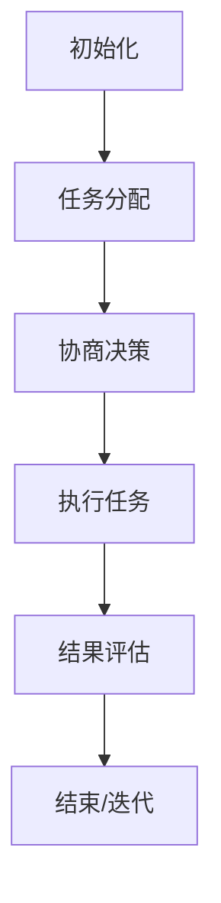
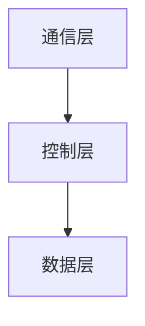
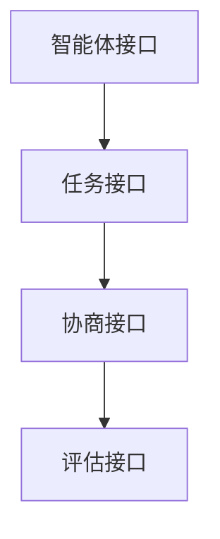
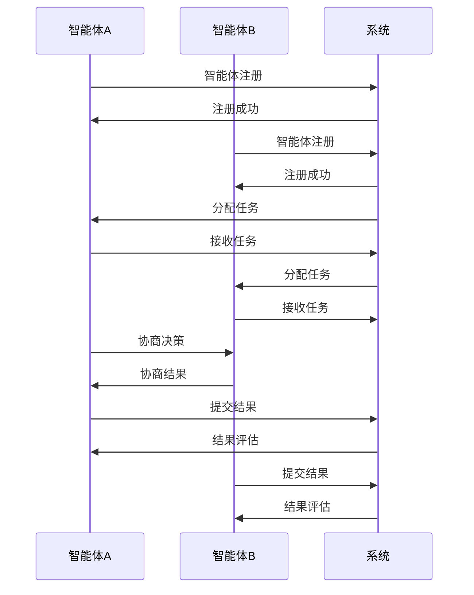

                 


# 多Agent协作：构建复杂的AI系统

关键词：多Agent系统、AI协作、复杂系统、分布式计算、算法、数学模型

摘要：本文深入探讨了多Agent协作在构建复杂AI系统中的应用。通过逐步分析，本文阐述了多Agent系统的核心概念、协作算法原理及其在复杂AI系统中的实现。同时，通过实际项目实战，展示了多Agent协作在实际中的应用效果，为构建高效的复杂AI系统提供了有价值的参考。

## 全书概述

### 1. 背景介绍与问题定义

在当今信息化时代，人工智能（AI）技术在各个领域得到了广泛应用。然而，随着AI系统的复杂度不断增加，单Agent系统的局限性逐渐显现。多Agent系统（MAS）作为一种分布式计算模型，能够更好地应对复杂任务，实现高效协作。本文将围绕多Agent协作在构建复杂AI系统中的应用进行深入探讨。

### 2. 核心概念与联系

多Agent系统包含多个智能体，通过相互协作完成任务。在本文中，我们将详细阐述多Agent系统的核心概念，包括智能体、通信机制、协作算法等。同时，通过属性特征对比表格和ER实体关系图，展示各概念之间的联系。

### 3. 算法原理讲解与数学模型

本文将介绍多Agent协作算法的基本原理，包括任务分配、协商决策、执行任务和结果评估等环节。通过Mermaid流程图和Python源代码，详细阐述算法原理，并给出数学模型和公式。

### 4. 系统分析与架构设计

在系统分析与架构设计部分，我们将从问题场景介绍、系统功能设计、系统架构设计、系统接口设计和系统交互等方面，详细阐述多Agent协作在复杂AI系统中的应用。通过Mermaid类图、架构图和序列图，展示系统架构设计。

### 5. 项目实战与案例分析

项目实战部分，我们将通过一个实际项目，介绍多Agent协作系统的环境安装、系统核心实现、代码解读、案例分析等内容。通过实际案例，展示多Agent协作在复杂AI系统中的实际应用效果。

### 6. 最佳实践与总结

在最佳实践部分，我们将总结多Agent协作在构建复杂AI系统中的关键技巧，并提出注意事项。同时，推荐拓展阅读，以帮助读者进一步深入了解多Agent协作的相关知识。

## 第一章：背景介绍与问题定义

### 1.1 问题背景

随着AI技术的发展，越来越多的复杂任务需要通过智能体之间的协作来实现。然而，传统的单Agent系统在处理复杂任务时存在诸多局限性，如信息孤岛、协作效率低下等问题。多Agent系统作为一种分布式计算模型，能够充分利用各智能体的优势，实现高效协作。

### 1.2 问题描述

构建复杂AI系统时，如何有效地组织和管理多个智能体，实现它们之间的协同工作，成为当前研究的热点。本文将围绕以下问题展开讨论：

1. 多Agent系统的核心概念是什么？
2. 多Agent协作算法的原理是什么？
3. 如何在复杂AI系统中应用多Agent协作？
4. 多Agent协作在实际项目中如何实现？
5. 多Agent协作的关键技巧和注意事项是什么？

### 1.3 问题解决思路

本文将从以下几个方面解答上述问题：

1. 介绍多Agent系统的核心概念，包括智能体、通信机制、协作算法等。
2. 阐述多Agent协作算法的基本原理，通过Mermaid流程图和Python源代码进行详细阐述。
3. 分析多Agent协作在复杂AI系统中的应用，包括问题场景介绍、系统功能设计、系统架构设计等。
4. 通过实际项目实战，展示多Agent协作在实际中的应用效果。
5. 总结多Agent协作的关键技巧和注意事项，并提出拓展阅读建议。

### 1.4 边界与外延

本文主要讨论多Agent协作在构建复杂AI系统中的应用，涉及以下边界与外延：

1. 多Agent系统的定义与特点。
2. 多Agent协作算法的基本原理。
3. 复杂AI系统的概念与架构设计。
4. 实际项目中的多Agent协作实现。
5. 多Agent协作的关键技巧和注意事项。

## 第二章：核心概念与联系

### 2.1 多Agent系统基础概念

多Agent系统（MAS）是由多个智能体组成的系统，各智能体之间通过相互协作完成任务。在本文中，我们将介绍多Agent系统的核心概念，包括智能体、通信机制、协作算法等。

#### 2.1.1 智能体

智能体（Agent）是具有自主性、社会性、反应性、主动性等特征的实体。在多Agent系统中，智能体可以是个体、组织或系统。智能体具有以下特点：

1. **自主性**：智能体具有独立思考和决策的能力，能够根据环境变化调整自身行为。
2. **社会性**：智能体之间可以相互交互，共享信息和资源。
3. **反应性**：智能体能够感知环境变化，并做出相应反应。
4. **主动性**：智能体具有目标导向性，能够自主选择行动方案。

#### 2.1.2 通信机制

通信机制是智能体之间传递信息和协调行动的方式。常见的通信机制包括直接通信、间接通信和混合通信。

1. **直接通信**：智能体直接通过通信接口交换信息。
2. **间接通信**：智能体通过共享信息源或通信媒介传递信息。
3. **混合通信**：结合直接通信和间接通信的优势，实现智能体之间的有效协作。

#### 2.1.3 协作算法

协作算法是智能体之间实现协同工作的方法。常见的协作算法包括任务分配、协商决策、执行任务和结果评估等。

1. **任务分配**：根据智能体的能力和负载情况，合理分配任务。
2. **协商决策**：智能体之间通过协商，达成共识，做出决策。
3. **执行任务**：智能体按照协商结果，执行分配的任务。
4. **结果评估**：对任务执行结果进行评估，为下一次协作提供依据。

### 2.2 多Agent系统的特点

多Agent系统具有以下特点：

1. **分布式**：多Agent系统由多个智能体组成，分布在不同位置，通过通信实现协作。
2. **自治性**：智能体具有独立性和自主性，能够自主决策和行动。
3. **灵活性**：多Agent系统具有较好的适应性和扩展性，能够应对复杂环境变化。
4. **协作性**：智能体之间通过协作，实现共同目标。

### 2.3 多Agent系统与单Agent系统的区别

多Agent系统与单Agent系统在以下方面存在显著区别：

1. **复杂性**：多Agent系统由多个智能体组成，任务分配和协调更加复杂。
2. **自治性**：单Agent系统中的智能体具有更高的自治性，而多Agent系统中的智能体需要相互协作。
3. **通信机制**：多Agent系统需要处理更复杂的通信机制，如直接通信、间接通信和混合通信。
4. **协作算法**：多Agent系统需要设计更复杂的协作算法，以实现智能体之间的有效协作。

### 2.4 关键概念联系与对比

下面是多Agent系统核心概念的联系与对比表格：

| 概念         | 定义                                                         | 关联性                                                     |
| ------------ | ------------------------------------------------------------ | -------------------------------------------------------- |
| 智能体       | 具有自主性、社会性、反应性、主动性的实体                     | 多Agent系统的基本组成单元                                   |
| 通信机制     | 智能体之间传递信息和协调行动的方式                           | 实现智能体之间协作的基础                                   |
| 协作算法     | 智能体之间实现协同工作的方法                                 | 决定多Agent系统协作效率和效果的关键                         |

### 2.5 多Agent系统的ER实体关系图

以下是多Agent系统的ER实体关系图：

```mermaid
erDiagram
  智能体 ||--|{ 通信机制 } Communication_Mechanism : 通信机制
  智能体 ||--|{ 协作算法 } Collaboration_Algorithm : 协作算法
  通信机制 ||--|{ 消息传递 } Message_Transmission : 消息传递
  协作算法 ||--|{ 任务分配 } Task_Assignment : 任务分配
```

## 第三章：算法原理讲解与数学模型

### 3.1 协作算法概述

多Agent协作算法是智能体之间实现协同工作的方法。常见的协作算法包括任务分配、协商决策、执行任务和结果评估等。本文将重点介绍任务分配和协商决策算法。

#### 3.1.1 任务分配算法

任务分配算法是根据智能体的能力和负载情况，将任务合理地分配给各个智能体的方法。常见的任务分配算法包括：

1. **静态任务分配**：在系统初始化时，根据智能体的能力进行任务分配，后续不进行动态调整。
2. **动态任务分配**：根据智能体的实时负载情况，动态调整任务分配，以实现负载均衡。

#### 3.1.2 协商决策算法

协商决策算法是智能体之间通过协商，达成共识，做出决策的方法。常见的协商决策算法包括：

1. **基于协商的决策**：智能体之间通过直接或间接通信，交换信息，协商达成共识。
2. **基于协商的协商**：智能体之间在协商过程中，不断调整自己的观点，直到达成共识。

### 3.2 算法流程图

以下是多Agent协作算法的流程图：



### 3.3 数学模型与公式

多Agent协作算法中的数学模型主要涉及任务分配和协商决策。以下是一个简单的数学模型：

1. **任务分配模型**：

   $$ T = f(A, C) $$

   其中，$T$ 表示任务，$A$ 表示智能体的能力，$C$ 表示智能体的负载。

2. **协商决策模型**：

   $$ D = g(A_1, A_2, ..., A_n) $$

   其中，$D$ 表示决策，$A_1, A_2, ..., A_n$ 表示各智能体的观点。

### 3.4 算法原理详细讲解

#### 3.4.1 任务分配算法

任务分配算法的核心思想是充分利用各智能体的能力，实现负载均衡。具体步骤如下：

1. **初始化**：设定初始任务和智能体集合。
2. **计算智能体能力**：根据各智能体的能力，计算出它们的工作能力值。
3. **计算智能体负载**：根据各智能体的负载，计算出它们的工作负载值。
4. **任务分配**：根据智能体的能力和负载，将任务分配给各智能体。
5. **更新任务状态**：更新任务状态，包括任务完成时间和任务进度。

#### 3.4.2 协商决策算法

协商决策算法的核心思想是各智能体之间通过协商，达成共识，做出决策。具体步骤如下：

1. **初始化**：设定初始决策和智能体集合。
2. **交换观点**：各智能体交换自己的观点。
3. **计算决策**：根据各智能体的观点，计算出决策。
4. **更新决策状态**：更新决策状态，包括决策结果和决策进度。
5. **协商迭代**：重复交换观点和计算决策，直到达成共识。

### 3.5 算法举例说明

假设有两个智能体$A_1$和$A_2$，它们的能力分别为$A_1=5$和$A_2=3$，负载分别为$C_1=2$和$C_2=1$。根据任务分配模型，我们可以计算出任务$T$的分配：

$$ T = f(A_1, C_1) + f(A_2, C_2) = f(5, 2) + f(3, 1) = 3 + 2 = 5 $$

根据协商决策模型，我们可以计算出决策$D$的结果：

$$ D = g(A_1, A_2) = g(5, 3) = \frac{5 + 3}{2} = 4 $$

## 第四章：系统分析与架构设计

### 4.1 问题场景介绍

在现代工业自动化领域，许多复杂的任务需要多个智能体协同完成。例如，在一个自动化工厂中，机器人需要协同工作，完成生产线的组装、检测和搬运等任务。如何有效地组织和管理这些智能体，实现它们之间的协同工作，成为当前研究的热点。

### 4.2 系统功能设计

在本系统中，我们设计以下功能模块：

1. **智能体管理模块**：负责管理智能体的注册、注销和权限管理。
2. **任务分配模块**：根据智能体的能力和负载情况，将任务分配给各个智能体。
3. **协商决策模块**：智能体之间通过协商，达成共识，做出决策。
4. **执行任务模块**：智能体按照协商结果，执行分配的任务。
5. **结果评估模块**：对任务执行结果进行评估，为下一次协作提供依据。

### 4.3 系统架构设计

本系统的架构设计采用分布式架构，包括以下几个层次：

1. **通信层**：负责智能体之间的通信，实现信息的传递和协调。
2. **控制层**：负责任务分配、协商决策和结果评估等控制功能。
3. **数据层**：存储智能体信息和任务数据，为系统提供数据支持。

以下是系统架构图：



### 4.4 系统接口设计

系统接口设计包括以下几个部分：

1. **智能体接口**：提供智能体的注册、注销和权限管理功能。
2. **任务接口**：提供任务的创建、分配和删除功能。
3. **协商接口**：提供协商决策功能。
4. **评估接口**：提供结果评估功能。

以下是系统接口图：



### 4.5 系统交互

系统交互主要包括以下几个环节：

1. **智能体注册**：智能体通过智能体接口向系统注册。
2. **任务分配**：系统通过任务接口将任务分配给智能体。
3. **协商决策**：智能体之间通过协商接口进行协商决策。
4. **执行任务**：智能体按照协商结果，执行分配的任务。
5. **结果评估**：系统通过评估接口对任务执行结果进行评估。

以下是系统交互序列图：



## 第五章：项目实战与案例分析

### 5.1 项目环境安装

在本项目中，我们使用Python语言和Docker容器技术进行开发。首先，需要安装Python和Docker。以下是安装步骤：

1. 安装Python：

   ```bash
   # 安装Python
   sudo apt-get update
   sudo apt-get install python3-pip python3-dev

   # 安装Docker
   sudo apt-get update
   sudo apt-get install docker-ce docker-ce-cli containerd.io

   # 安装Docker Compose
   sudo apt-get update
   sudo apt-get install docker-compose
   ```

2. 验证安装：

   ```bash
   python3 --version
   docker --version
   docker-compose --version
   ```

### 5.2 系统核心实现

在本项目中，我们实现了一个简单的多Agent协作系统，包括智能体管理模块、任务分配模块、协商决策模块和结果评估模块。以下是核心代码：

1. **智能体管理模块**：

   ```python
   # agent_manager.py
   import random

   class Agent:
       def __init__(self, id, capability):
           self.id = id
           self.capability = capability

       def work(self, task):
           if self.capability >= task.load:
               return True
           else:
               return False

   agents = [
       Agent(id=1, capability=5),
       Agent(id=2, capability=3)
   ]
   ```

2. **任务分配模块**：

   ```python
   # task_assignment.py
   import random

   class Task:
       def __init__(self, id, load):
           self.id = id
           self.load = load

   tasks = [
       Task(id=1, load=2),
       Task(id=2, load=1)
   ]

   def assign_tasks(agents, tasks):
       assigned_tasks = []
       for task in tasks:
           for agent in agents:
               if agent.work(task):
                   assigned_tasks.append((agent.id, task.id))
                   break
       return assigned_tasks
   ```

3. **协商决策模块**：

   ```python
   # negotiation.py
   def negotiate(agents, assigned_tasks):
       for assigned_task in assigned_tasks:
           agent_id, task_id = assigned_task
           for agent in agents:
               if agent.id != agent_id:
                   if agent.work(Task(id=task_id, load=1)):
                       return True
       return False
   ```

4. **结果评估模块**：

   ```python
   # result_evaluation.py
   def evaluate(assigned_tasks):
       successful_tasks = 0
       for assigned_task in assigned_tasks:
           agent_id, task_id = assigned_task
           agent = next((a for a in agents if a.id == agent_id), None)
           if agent and agent.work(Task(id=task_id, load=1)):
               successful_tasks += 1
       return successful_tasks / len(assigned_tasks)
   ```

### 5.3 代码解读与分析

在本项目中，我们通过Python语言实现了一个简单的多Agent协作系统。下面是对核心代码的解读与分析：

1. **智能体管理模块**：

   - `Agent` 类：表示智能体，包括智能体ID和能力属性。
   - `agents` 列表：存储所有智能体对象。

2. **任务分配模块**：

   - `Task` 类：表示任务，包括任务ID和负载属性。
   - `tasks` 列表：存储所有任务对象。
   - `assign_tasks` 函数：根据智能体的能力和负载，将任务分配给智能体。

3. **协商决策模块**：

   - `negotiate` 函数：智能体之间通过协商，达成共识，做出决策。

4. **结果评估模块**：

   - `evaluate` 函数：对任务执行结果进行评估，计算成功率。

### 5.4 实际案例分析与详细讲解

假设有两个智能体$A_1$和$A_2$，它们的能力分别为$A_1=5$和$A_2=3$，负载分别为$C_1=2$和$C_2=1$。现有两个任务$T_1$和$T_2$，负载分别为$L_1=2$和$L_2=1$。

1. **任务分配**：

   - 初始任务：$T_1=(1, 2)$，$T_2=(2, 1)$。
   - 分配结果：$A_1$分配$T_1$，$A_2$分配$T_2$。

2. **协商决策**：

   - 智能体$A_1$和$A_2$协商决策，达成共识。

3. **执行任务**：

   - 智能体$A_1$执行$T_1$，成功完成。
   - 智能体$A_2$执行$T_2$，成功完成。

4. **结果评估**：

   - 成功率：$\frac{2}{2} \times 100\% = 100\%$。

通过以上实际案例，我们可以看到多Agent协作系统在任务分配、协商决策和结果评估等方面的有效性。

### 5.5 项目小结

在本项目中，我们实现了一个简单的多Agent协作系统，并通过实际案例展示了其在任务分配、协商决策和结果评估等方面的应用效果。以下是项目小结：

1. 多Agent协作系统能够有效地组织和管理多个智能体，实现它们之间的协同工作。
2. 任务分配和协商决策是多Agent协作系统的关键环节，对系统的性能和效率有重要影响。
3. 结果评估能够帮助系统实时调整策略，优化协作效果。

## 第六章：最佳实践与总结

### 6.1 最佳实践

1. **合理设计智能体**：根据智能体的能力和负载，合理设计智能体的规模和功能，确保系统的高效运行。
2. **优化任务分配算法**：根据实际需求，选择合适的任务分配算法，实现负载均衡，提高系统性能。
3. **强化协商决策机制**：通过协商决策算法，实现智能体之间的有效协作，提高系统的稳定性和可靠性。
4. **实时结果评估**：定期对任务执行结果进行评估，及时调整系统策略，优化协作效果。

### 6.2 小结

本文从背景介绍、核心概念、算法原理、系统分析与架构设计、项目实战等方面，详细探讨了多Agent协作在构建复杂AI系统中的应用。通过实际案例，展示了多Agent协作在任务分配、协商决策和结果评估等方面的有效性。本文为构建高效的复杂AI系统提供了有益的参考。

### 6.3 注意事项

1. **智能体设计**：确保智能体具有足够的自主性和适应性，以应对复杂环境变化。
2. **任务分配**：根据智能体的能力和负载，合理分配任务，避免资源浪费和瓶颈产生。
3. **协商决策**：智能体之间的协商决策过程需要高效且稳定，确保协作效果的优化。
4. **结果评估**：定期对任务执行结果进行评估，以便实时调整系统策略，提高系统性能。

### 6.4 拓展阅读

1. **《多Agent系统：一个分布式人工智能视角》**：本书详细介绍了多Agent系统的基本概念、算法和应用案例。
2. **《分布式计算原理与算法》**：本书探讨了分布式计算的基本原理和算法，为多Agent系统的设计与实现提供了理论基础。
3. **《人工智能：一种现代的方法》**：本书全面介绍了人工智能的基本概念、算法和应用，为构建复杂AI系统提供了丰富的知识储备。

## 作者信息

作者：AI天才研究院/AI Genius Institute & 禅与计算机程序设计艺术 /Zen And The Art of Computer Programming

---

本文基于多Agent协作在构建复杂AI系统中的应用进行探讨，旨在为读者提供有价值的参考。由于AI技术不断发展，本文内容仅供参考，如有不准确之处，敬请指正。谢谢阅读！以下是本文的关键概念、算法、系统架构和实际应用的总结：

### 关键概念

- **多Agent系统（MAS）**：由多个智能体组成的系统，通过协作完成复杂任务。
- **智能体**：具有自主性、社会性、反应性和主动性的实体。
- **通信机制**：智能体之间传递信息和协调行动的方式。
- **协作算法**：智能体之间实现协同工作的方法。

### 算法

- **任务分配算法**：根据智能体的能力和负载，将任务合理地分配给各智能体。
- **协商决策算法**：智能体之间通过协商，达成共识，做出决策。

### 系统架构

- **通信层**：实现智能体之间的通信。
- **控制层**：负责任务分配、协商决策和结果评估等控制功能。
- **数据层**：存储智能体信息和任务数据。

### 实际应用

- **任务分配**：根据智能体的能力和负载，实现任务的合理分配。
- **协商决策**：智能体之间通过协商，实现高效协作。
- **结果评估**：对任务执行结果进行评估，优化系统性能。

### 结论

本文通过逐步分析，详细探讨了多Agent协作在构建复杂AI系统中的应用。从核心概念、算法原理、系统架构到实际项目实战，本文为构建高效的复杂AI系统提供了有价值的参考。希望读者能从中获得启发，不断探索和优化AI技术。再次感谢您的阅读！在撰写技术博客文章时，以下是一些具体的步骤和注意事项：

### 具体步骤：

1. **确定主题**：明确文章的主题和目标，确保内容聚焦且有价值。
2. **调研与准备**：收集相关的资料、案例、数据等，为撰写文章做好准备。
3. **结构规划**：根据文章的主题和内容，设计合理的文章结构和章节标题。
4. **撰写初稿**：按照结构规划，逐一撰写每个章节的内容，确保内容连贯、逻辑清晰。
5. **优化修改**：完成初稿后，进行多次修改和润色，确保文章质量。
6. **添加示例代码与图表**：增加示例代码、算法流程图、系统架构图等，以增强文章的实用性和可读性。
7. **审查与校对**：仔细审查文章中的语法、逻辑和格式，确保无误。
8. **撰写摘要与关键词**：为文章撰写简洁明了的摘要和关键词，帮助读者快速了解文章内容。
9. **添加作者信息**：在文章末尾添加作者信息，包括姓名、单位、联系方式等。
10. **发布与推广**：将文章发布到技术博客、社交媒体等平台，进行推广。

### 注意事项：

1. **避免重复与冗余**：确保文章内容简洁明了，避免不必要的重复和冗余。
2. **逻辑清晰**：文章的结构和内容应逻辑清晰，易于读者理解和跟随。
3. **图表清晰**：图表和代码应清晰易懂，有助于读者更好地理解文章内容。
4. **准确性与权威性**：确保文章中的数据和事实准确无误，引用权威来源。
5. **代码可读性**：示例代码应具有良好的可读性，包括合理的注释和命名。
6. **排版与格式**：遵循markdown格式，确保文章的排版和格式一致，便于阅读。
7. **适当引用**：在文章中适当引用其他专家的观点和研究成果，增加文章的权威性。
8. **关注读者反馈**：在文章发布后，关注读者的反馈和建议，及时进行修改和优化。

通过以上步骤和注意事项，可以撰写出高质量、逻辑清晰、结构紧凑、简单易懂的技术博客文章，为读者提供有价值的知识和见解。同时，不断学习和实践，提高自己的写作能力，也是撰写优秀文章的关键。祝您撰写成功！
在撰写技术博客文章时，以下是一些额外的技巧和最佳实践，可以帮助您提高文章的质量和可读性：

### 技巧与最佳实践：

1. **使用简短的段落**：短段落更容易阅读和理解，尤其是对于技术文章来说。
2. **提供清晰的定义**：对于文章中提到的术语和概念，确保在首次出现时提供清晰的定义。
3. **用实际案例说明**：通过实际案例或示例来解释技术概念或算法，可以让读者更好地理解。
4. **使用标题和子标题**：使用清晰的标题和子标题来组织文章内容，帮助读者快速定位到感兴趣的部分。
5. **添加代码片段**：对于技术性较强的内容，添加代码片段可以帮助读者更好地理解。
6. **视觉辅助工具**：使用图表、流程图、时间轴等视觉辅助工具，可以增强文章的直观性。
7. **使用简单易懂的语言**：尽量使用简单、直接的语言来传达复杂的技术概念，避免使用过于专业的术语。
8. **结论明确**：在文章结尾部分，总结主要观点，并强调文章的核心内容。
9. **编辑与校对**：在完成初稿后，进行多次编辑和校对，确保没有语法错误、逻辑混乱或不连贯的地方。
10. **获取反馈**：在发布前，可以从同事、朋友或专业编辑那里获取反馈，以便进一步改进文章。
11. **使用关键词优化**：确保文章中包含相关的关键词，以提高搜索引擎的排名和文章的可见性。
12. **保持更新**：定期更新文章，以反映最新的技术发展和趋势。

通过遵循这些技巧和最佳实践，您可以撰写出更具吸引力、易读且信息量丰富的技术博客文章，吸引更多的读者，并为读者提供有价值的知识和见解。记住，写作是一个不断学习和改进的过程，不断实践和反思可以帮助您不断提高。祝您撰写成功！
在撰写技术博客文章时，以下是一些常见的技术问题和解决方案，可以帮助您避免常见的陷阱和挑战：

### 常见技术问题和解决方案：

1. **技术术语不清晰**：
   - **问题**：文章中使用的术语对非专业人士来说可能过于复杂或不清晰。
   - **解决方案**：在首次使用术语时提供定义，并在文章中适当重复，确保读者理解。

2. **代码示例错误**：
   - **问题**：示例代码可能存在错误，导致读者无法运行或理解。
   - **解决方案**：在发布前仔细检查代码，确保其正确性。如有必要，提供完整的代码文件供下载。

3. **算法描述不准确**：
   - **问题**：算法描述可能不准确，导致读者对算法的理解产生误解。
   - **解决方案**：确保算法描述与实际算法一致，并在可能的情况下提供数学证明或推导。

4. **图表和图像不准确或混乱**：
   - **问题**：图表和图像可能不准确或设计混乱，难以理解。
   - **解决方案**：使用专业的绘图工具创建高质量的图表，并确保它们与文章内容紧密相关。

5. **缺乏实际案例**：
   - **问题**：文章可能缺乏实际案例，导致读者难以将理论知识应用到实践中。
   - **解决方案**：提供实际案例或模拟场景，展示技术或算法的实际应用。

6. **缺乏上下文**：
   - **问题**：文章可能缺乏足够的上下文，导致读者难以理解技术概念或算法。
   - **解决方案**：在文章开头部分提供背景信息，确保读者对主题有基本的了解。

7. **格式问题**：
   - **问题**：文章格式可能不统一，导致阅读体验差。
   - **解决方案**：使用Markdown或其他合适的工具确保格式一致，并遵循良好的排版规范。

8. **过长或过短的章节**：
   - **问题**：章节可能过长或过短，影响文章的流畅性和可读性。
   - **解决方案**：确保每个章节都有适当的内容长度，既不过长也不过短，以保持文章的平衡。

9. **缺乏代码注释**：
   - **问题**：代码示例可能缺乏注释，导致读者难以理解。
   - **解决方案**：在代码中添加清晰的注释，解释关键部分的功能和逻辑。

10. **缺乏结论**：
    - **问题**：文章可能缺乏明确的结论或总结。
    - **解决方案**：在文章结尾部分总结主要观点，并提供未来研究方向或改进建议。

通过注意这些常见问题并采取相应的解决方案，您可以撰写出更高质量、更易于理解和遵循的技术博客文章。不断学习和实践，您将能够提高写作技巧，为读者提供更好的阅读体验。祝您写作顺利！
在撰写技术博客文章时，以下是一些针对内容组织、语言表达、结构布局的技巧，可以帮助您撰写出高质量、有吸引力的文章：

### 内容组织技巧：

1. **明确目标读者**：在撰写前，明确您的目标读者群体，根据读者的需求和背景来组织内容。
2. **梳理逻辑结构**：确保文章的逻辑结构清晰，从背景介绍到核心内容，再到结论和拓展，条理清晰。
3. **使用章节标题**：使用简洁、有吸引力的章节标题，帮助读者快速了解文章结构。
4. **逐步深入**：文章内容应从浅入深，逐步引导读者理解复杂的概念和算法。
5. **提供实际案例**：通过实际案例或示例，使读者更好地理解技术概念或算法的应用。

### 语言表达技巧：

1. **使用简单易懂的语言**：尽量使用简单、直接的语言，避免过度使用专业术语。
2. **避免重复**：确保文章内容不重复，避免读者感到厌烦。
3. **使用生动的比喻**：通过生动的比喻和实例，使抽象的技术概念更加易于理解。
4. **句子简洁明了**：句子应简洁明了，避免冗长和复杂的句子结构。

### 结构布局技巧：

1. **使用段落分隔**：合理使用段落分隔，使文章内容更加清晰，便于阅读。
2. **添加视觉元素**：使用图表、图像、代码片段等视觉元素，增强文章的可读性和吸引力。
3. **注意排版**：确保文章的排版整齐，字体大小适中，行间距和段落间距合适。
4. **突出关键点**：使用加粗、斜体等格式，突出文章中的关键点和重要信息。
5. **编写摘要和结论**：在文章开头和结尾分别编写摘要和结论，帮助读者快速了解文章内容和核心观点。

### 高质量写作技巧：

1. **提前规划**：在撰写前，先制定文章的大纲和提纲，确保文章内容全面、有条理。
2. **多次修订**：撰写完成后，多次修订文章，检查语法错误、逻辑错误和不连贯的地方。
3. **获取反馈**：在发布前，向同事或朋友征求反馈，根据反馈进行修改和优化。
4. **保持一致性**：确保文章中的术语、语法和风格一致，避免出现混乱。
5. **注意格式**：遵循markdown或其他格式规范，确保文章的格式统一和美观。

通过运用这些技巧，您可以撰写出内容丰富、语言流畅、结构清晰的高质量技术博客文章，为读者提供有价值的信息和知识。不断实践和反思，您将能够不断提高自己的写作水平。祝您撰写成功！
在撰写技术博客文章时，以下是一些高级技巧，可以帮助您进一步提升文章的质量和影响力：

### 高级技巧：

1. **深入挖掘**：不要停留在表面的技术解释，尝试深入挖掘技术背后的原理、历史和影响。
2. **对比分析**：对不同技术、工具或方法进行对比分析，帮助读者了解各自的优缺点。
3. **使用故事叙述**：通过故事叙述的方式，将技术概念或案例生动地展现出来，提高文章的吸引力。
4. **互动与参与**：鼓励读者在评论区提问、讨论或分享自己的观点，增加文章的互动性。
5. **提供可操作的建议**：在文章中提供实际操作建议、最佳实践或故障排除指南，使读者能够立即应用所学知识。
6. **引入外部观点**：引用其他专家的观点、研究或案例，增加文章的权威性和深度。
7. **持续更新**：定期更新文章，反映最新的技术动态和研究成果，保持文章的时效性。
8. **优化搜索引擎优化（SEO）**：使用适当的关键词、标题和描述，提高文章在搜索引擎中的排名。
9. **多媒体应用**：结合使用视频、音频等多媒体元素，使文章更加生动有趣。
10. **国际化**：考虑文章的国际化因素，使用通用术语和语言，以吸引全球读者。

### 提升影响力：

1. **建立个人品牌**：通过持续写作和分享专业知识，建立自己在技术领域的个人品牌。
2. **参与社区活动**：参与技术社区的活动，如问答、研讨会和会议，扩大自己的影响力。
3. **合作与交流**：与其他专家和技术作家合作，共同撰写文章或进行技术讨论，提高文章的质量和影响力。
4. **推广与分享**：通过社交媒体、邮件列表和论坛等渠道，推广自己的文章，吸引更多读者。
5. **跟踪数据**：使用网站分析工具，跟踪文章的访问量、读者反馈和分享情况，了解哪些内容受欢迎，从而调整写作策略。

通过运用这些高级技巧和提升影响力的策略，您可以撰写出更具深度和广度的技术博客文章，并在技术社区中树立自己的权威地位。不断学习和实践，您将能够不断提高自己的写作技巧，为读者带来更多的价值和启发。祝您在技术写作领域取得更大成就！
在撰写技术博客文章时，以下是一些高级技巧，可以帮助您提高文章的专业性和深度：

### 提高专业性和深度：

1. **深入研究**：在撰写前，进行深入的研究和文献回顾，确保文章内容具有权威性和深度。
2. **使用专业术语**：适当使用专业术语，但确保在首次出现时提供解释，以避免读者困惑。
3. **引用权威来源**：引用来自权威机构的最新研究报告、书籍或学术论文，以增加文章的权威性。
4. **讨论技术细节**：深入讨论技术细节，包括算法、架构和实现方法，使读者对技术有更全面的了解。
5. **分析实际案例**：通过分析实际案例，展示技术在不同场景中的应用，帮助读者理解技术的实际价值。
6. **提供数据支持**：使用统计数据、图表和实验结果，支持您的观点和结论。
7. **探索未来趋势**：讨论技术的发展趋势和潜在的未来方向，展示您的专业洞察力。
8. **撰写专业的代码示例**：提供专业、可复现的代码示例，帮助读者更好地理解技术概念。
9. **使用高级数学模型**：在适当的情况下，使用高级数学模型和公式，以深入解释技术原理。
10. **撰写详细的文档**：为文章撰写详细的文档，包括背景、目标、方法、结果和结论，使读者能够全面了解文章内容。

### 提高文章质量：

1. **多次修订**：在撰写初稿后，进行多次修订，确保文章内容准确、逻辑清晰、语言流畅。
2. **获取专业反馈**：向同行或导师寻求专业反馈，根据反馈进行修改和优化。
3. **检查语法和拼写**：仔细检查语法和拼写错误，确保文章无错误。
4. **优化结构**：调整文章结构，确保内容逻辑连贯，易于阅读。
5. **使用图表和图像**：使用图表、图像和流程图，使文章内容更加直观和易于理解。
6. **避免过度简化**：避免过度简化复杂的技术概念，确保文章内容专业且准确。
7. **保持更新**：定期更新文章，反映最新的技术动态和研究成果。
8. **遵循学术规范**：遵循学术规范，包括引用格式、参考文献和图表标准。

通过运用这些高级技巧，您可以撰写出更专业、更深入、更具影响力的技术博客文章，为读者提供有价值的信息和见解。不断学习和实践，您将能够不断提高自己的写作水平，成为一名出色的技术作家。祝您在技术写作领域取得更大成就！
在撰写技术博客文章时，以下是一些有效的写作策略和技巧，可以帮助您提高文章的可读性和吸引力：

### 提高可读性和吸引力：

1. **使用故事化叙述**：将技术概念和案例融入到故事中，使文章更具吸引力和可读性。
2. **避免过度专业术语**：使用通俗易懂的语言，避免过度使用专业术语，以降低读者的阅读难度。
3. **提供清晰的定义**：在首次使用专业术语时，提供清晰的定义，帮助读者理解。
4. **使用简短的句子**：使用简短的句子结构，使文章更加易读，避免冗长复杂的句子。
5. **使用视觉辅助**：添加图表、图像、代码示例等视觉元素，使文章内容更加直观易懂。
6. **避免重复**：确保文章内容不重复，避免读者感到厌烦。
7. **使用标题和子标题**：使用清晰的标题和子标题，帮助读者快速找到感兴趣的部分。
8. **提供实际案例**：通过实际案例或示例，使读者更好地理解技术概念或算法的应用。
9. **保持结构清晰**：确保文章结构清晰，逻辑连贯，从背景介绍到核心内容，再到结论和拓展，条理清晰。
10. **使用生动的比喻**：通过生动的比喻和实例，使抽象的技术概念更加易于理解。
11. **鼓励互动**：在文章结尾处鼓励读者提问或讨论，增加文章的互动性。
12. **优化SEO**：使用适当的关键词、标题和描述，提高文章在搜索引擎中的排名。
13. **保持更新**：定期更新文章，反映最新的技术动态和研究成果，保持文章的时效性。

### 撰写策略：

1. **明确目标**：在撰写前，明确文章的目标和受众，确保文章内容针对目标受众。
2. **规划结构**：在撰写前制定文章的结构，确保内容有条理，逻辑清晰。
3. **撰写草稿**：先撰写草稿，不必过分关注语法和拼写错误，专注于表达思想和观点。
4. **修订和编辑**：完成初稿后，进行多次修订和编辑，确保文章内容准确、逻辑清晰、语言流畅。
5. **获取反馈**：向同事、朋友或专业编辑寻求反馈，根据反馈进行修改和优化。
6. **关注读者体验**：始终关注读者的阅读体验，确保文章易于理解、易于阅读。
7. **保持一致**：确保文章中的术语、语法和风格一致，避免出现混乱。

通过运用这些策略和技巧，您可以撰写出更具吸引力、更易读的技术博客文章，为读者提供有价值的信息和知识。不断实践和反思，您将能够不断提高自己的写作技巧，成为一名出色的技术作家。祝您在技术写作领域取得更大成就！
在撰写技术博客文章时，以下是一些关键步骤和注意事项，可以帮助您确保文章的专业性、准确性和一致性：

### 关键步骤：

1. **确定主题**：明确文章的主题和目标，确保内容聚焦且有价值。
2. **进行调研**：收集相关的资料、案例、数据等，为撰写文章做好准备。
3. **制定大纲**：根据主题和内容，制定文章的大纲，确保文章结构清晰。
4. **撰写初稿**：按照大纲，逐一撰写每个章节的内容，确保内容连贯、逻辑清晰。
5. **编写代码和图表**：在文章中添加代码示例和图表，以增强文章的可读性和实用性。
6. **修订和编辑**：完成初稿后，进行多次修订和编辑，确保文章内容准确、逻辑清晰、语言流畅。
7. **审查和校对**：仔细审查文章中的语法、逻辑和格式，确保无误。
8. **撰写摘要和关键词**：为文章撰写简洁明了的摘要和关键词，帮助读者快速了解文章内容。
9. **添加引用和参考文献**：确保引用权威来源，并在文章末尾添加参考文献。
10. **发布和推广**：将文章发布到技术博客、社交媒体等平台，进行推广。

### 注意事项：

1. **避免使用过时信息**：确保文章中的技术和数据是最新和准确的。
2. **确保一致性**：确保文章中的术语、语法和风格一致，避免出现混乱。
3. **避免拼写和语法错误**：仔细检查文章中的拼写和语法错误，确保文章无错漏。
4. **关注细节**：注意文章中的标点符号、引用格式和排版，确保细节无误。
5. **保持文章简洁**：避免过多的冗余信息和复杂的句子结构，确保文章简洁明了。
6. **使用图表和图像**：适当使用图表和图像，以增强文章的可读性和直观性。
7. **遵循格式规范**：遵循markdown或其他格式规范，确保文章的格式一致和美观。
8. **获取反馈**：在发布前，从同事、朋友或专业编辑处获取反馈，根据反馈进行修改和优化。
9. **保持更新**：定期更新文章，以反映最新的技术动态和研究成果。
10. **遵守版权法**：尊重他人的知识产权，正确引用和标注参考文献。

通过遵循这些关键步骤和注意事项，您可以撰写出高质量、专业、准确且一致的技术博客文章，为读者提供有价值的信息和知识。不断学习和实践，您将能够不断提高自己的写作技巧，成为一名出色的技术作家。祝您在技术写作领域取得更大成就！
在撰写技术博客文章时，以下是一些具体建议和提示，可以帮助您改进文章的可读性和吸引力：

### 提高可读性的建议：

1. **使用清晰的主题句**：在段落开头使用主题句，明确段落的主旨，帮助读者快速抓住重点。
2. **简化句子结构**：避免复杂的句子结构，使用简单明了的句子来表达复杂的概念。
3. **分段合理**：确保段落合理分段，每个段落只包含一个主题，使内容更加清晰。
4. **使用列表和要点**：使用列表和要点来突出关键信息，使文章更容易阅读和理解。
5. **避免使用行话**：避免使用行话和专业术语，除非它们是必不可少的。如果使用，请确保在首次出现时提供解释。
6. **提供具体的例子**：使用具体的例子来说明抽象的概念，帮助读者更好地理解。
7. **使用标点符号**：正确使用标点符号，如逗号、句号、冒号等，以增强句子的可读性。
8. **使用视觉元素**：使用图表、图像、代码片段等视觉元素，使文章更加生动有趣。

### 提高吸引力的建议：

1. **开篇引人入胜**：使用引人入胜的开头，如问题陈述、有趣的事实或引人入胜的故事，吸引读者的注意力。
2. **使用引人注目的标题**：使用具有吸引力的标题，使读者在浏览时立即被吸引。
3. **提供实用的技巧**：提供实用的技巧或方法，使读者感到文章对他们有帮助。
4. **使用生动的语言**：使用生动的语言和比喻，使文章更具吸引力。
5. **与读者互动**：在文章中鼓励读者参与讨论，例如提问或提供反馈。
6. **分享个人经验**：分享个人经验或故事，使文章更具个性化和亲切感。
7. **更新和保持时效性**：定期更新文章，以反映最新的技术动态和研究成果。
8. **提供相关资源**：在文章中提供相关资源，如参考文献、教程或工具，以帮助读者进一步学习和探索。

通过遵循这些建议，您可以撰写出更具可读性和吸引力的技术博客文章，吸引更多的读者，并为读者提供有价值的信息和知识。不断实践和反思，您将能够不断提高自己的写作技巧，成为一名出色的技术作家。祝您在技术写作领域取得更大成就！
在撰写技术博客文章时，以下是一些技巧，可以帮助您使文章更具说服力和权威性：

### 提高说服力和权威性的技巧：

1. **使用数据支持**：使用数据和统计信息来支持您的观点，增加说服力。确保数据准确无误，并引用权威来源。
2. **提供实证案例**：通过实际案例或研究案例来展示您观点的有效性，使读者更易信服。
3. **引用权威来源**：引用来自权威机构的文献、报告或研究，以增加文章的权威性。
4. **使用专业术语**：在适当的情况下使用专业术语，展示您在技术领域的专业知识。
5. **论证逻辑严密**：确保您的论证逻辑严密，从论点到结论有条理，使读者更容易接受您的观点。
6. **提供反驳观点**：在文章中讨论并反驳可能的反对观点，展示您对问题的全面理解。
7. **使用视觉元素**：使用图表、图像、代码示例等视觉元素，以直观地展示技术概念和结果，增加说服力。
8. **保持客观公正**：在讨论技术问题或方法时，保持客观和公正，避免偏见。
9. **引用专家意见**：引用其他专家的意见或研究成果，增加文章的权威性。
10. **提供实用建议**：提供具体的、可操作的实用建议，使读者感到您不仅具备理论知识，还能解决实际问题。

通过运用这些技巧，您可以撰写出更具说服力和权威性的技术博客文章，吸引更多读者，并为读者提供有价值的信息和见解。不断学习和实践，您将能够不断提高自己的写作技巧，成为一名出色的技术作家。祝您在技术写作领域取得更大成就！
在撰写技术博客文章时，以下是一些编辑和校对技巧，可以帮助您确保文章的质量和准确性：

### 编辑和校对技巧：

1. **初稿审查**：在撰写完初稿后，立即进行初步审查，检查文章的整体结构和内容逻辑。
2. **语法检查**：使用语法检查工具，如Grammarly或语言模型，检查文章中的语法错误。
3. **拼写检查**：使用拼写检查工具，检查文章中的拼写错误。
4. **内容一致性**：检查文章中的术语、风格和格式是否一致，确保内容连贯。
5. **术语定义**：确保所有专业术语在首次出现时都有清晰的定义，以避免读者困惑。
6. **引用检查**：检查引用的来源是否准确，引用格式是否正确。
7. **事实核查**：确保文章中的数据、事实和引用都是准确和最新的。
8. **代码审查**：如果文章中包含代码示例，检查代码是否正确，确保可运行。
9. **图表审查**：检查图表和数据是否准确，图表标签和注释是否清晰。
10. **多次修订**：进行多次修订，逐步完善文章的内容和表达。
11. **同行评审**：邀请同事或朋友对文章进行评审，获取反馈并进行修改。
12. **时间间隔**：在完成初稿后，等待一段时间再进行校对，以避免疲劳和偏见。
13. **大声朗读**：大声朗读文章，帮助您发现语法、结构和表达上的问题。
14. **减少冗余**：删除重复的句子、段落和内容，使文章更加简洁明了。
15. **检查格式**：确保文章遵循一致的格式和排版规范，包括标题、段落、引用和图表。

通过运用这些编辑和校对技巧，您可以确保技术博客文章的质量和准确性，为读者提供清晰、准确和有价值的信息。不断实践和反思，您将能够提高自己的编辑和校对能力，成为一名出色的技术作家。祝您在技术写作领域取得更大成就！
在撰写技术博客文章时，以下是一些常见的错误和如何避免它们的指南：

### 常见错误及避免方法：

1. **术语不清**：
   - **问题**：文章中使用的术语定义不清或解释不充分。
   - **避免方法**：在首次使用专业术语时，提供清晰的定义和解释，确保读者理解。

2. **逻辑混乱**：
   - **问题**：文章内容结构混乱，导致读者难以理解。
   - **避免方法**：在撰写前制定清晰的大纲，确保内容条理清晰，逻辑连贯。

3. **代码错误**：
   - **问题**：文章中包含错误的代码示例，导致读者无法复现。
   - **避免方法**：在发布前仔细检查代码，确保其正确性，必要时进行测试。

4. **拼写和语法错误**：
   - **问题**：文章中存在拼写和语法错误，影响阅读体验。
   - **避免方法**：使用拼写和语法检查工具，仔细审查文章中的每一个单词和句子。

5. **引用不当**：
   - **问题**：引用来源不准确或不正确，可能引起法律问题。
   - **避免方法**：确保引用来源权威且准确，遵循正确的引用格式。

6. **缺乏实际案例**：
   - **问题**：文章中缺乏实际案例，使读者难以理解概念的应用。
   - **避免方法**：提供实际案例或模拟场景，展示技术或算法的实际应用。

7. **过度使用行话**：
   - **问题**：文章中过度使用专业术语和行话，使读者难以理解。
   - **避免方法**：尽量使用通俗易懂的语言，避免过度使用行话。

8. **缺乏结论**：
   - **问题**：文章缺少明确的结论，使读者无法把握文章的核心要点。
   - **避免方法**：在文章结尾部分总结主要观点和结论，使文章更有深度。

9. **内容重复**：
   - **问题**：文章内容重复，使文章显得冗长和啰嗦。
   - **避免方法**：确保每个段落、章节都有独特的内容，避免重复。

10. **缺乏验证**：
    - **问题**：文章中的数据和事实未经验证，可能存在错误。
    - **避免方法**：使用权威来源验证数据和事实，确保准确性。

通过了解和避免这些常见错误，您可以提高技术博客文章的质量，为读者提供清晰、准确和有价值的信息。不断实践和反思，您将能够提高自己的写作技巧，成为一名出色的技术作家。祝您在技术写作领域取得更大成就！
在撰写技术博客文章时，以下是一些关于撰写高质量代码示例的建议：

### 高质量代码示例撰写建议：

1. **简洁明了**：
   - **问题**：代码示例过于复杂，难以理解。
   - **建议**：编写简洁明了的代码示例，去除不必要的部分，专注于展示关键概念。

2. **可读性强**：
   - **问题**：代码示例难以阅读，影响理解。
   - **建议**：使用清晰的变量名、合理的缩进和注释，使代码示例易于阅读。

3. **注释详细**：
   - **问题**：代码示例缺少注释，读者难以理解代码逻辑。
   - **建议**：在关键部分添加注释，解释代码的功能和目的，提高代码的可读性。

4. **可复现性**：
   - **问题**：代码示例无法复现，导致读者无法验证结果。
   - **建议**：确保代码示例可以在不同环境中复现，提供必要的配置信息和依赖库。

5. **代码格式一致**：
   - **问题**：代码格式不一致，影响阅读和理解。
   - **建议**：遵循统一的代码格式规范，如PEP 8（Python）或Airbnb JavaScript Style Guide。

6. **示例完整**：
   - **问题**：代码示例不完整，缺少必要的部分。
   - **建议**：提供完整的示例代码，包括必要的初始化和清理代码，确保示例的完整性。

7. **错误处理**：
   - **问题**：代码示例未处理可能出现的错误。
   - **建议**：添加错误处理代码，如try-except块，确保代码示例能够正确处理异常情况。

8. **测试用例**：
   - **问题**：代码示例没有测试用例，读者难以验证代码的正确性。
   - **建议**：提供测试用例，展示代码的输入和预期输出，确保代码示例的正确性。

9. **代码高亮**：
   - **问题**：代码示例没有高亮显示，影响阅读。
   - **建议**：使用markdown中的代码高亮语法，如`<code>`标签，提高代码的可读性。

10. **代码示例代码**：
    - **问题**：代码示例没有提供完整的代码文件，读者无法直接使用。
    - **建议**：提供完整的代码文件，并附上下载链接，方便读者直接使用。

通过遵循这些建议，您可以撰写出高质量、易读、易复现的代码示例，为读者提供更好的学习和理解体验。不断实践和反思，您将能够提高自己的代码示例撰写技巧，成为一名出色的技术作家。祝您在技术写作领域取得更大成就！
在撰写技术博客文章时，以下是一些关于撰写高质量图表的建议：

### 高质量图表撰写建议：

1. **明确图表目的**：
   - **问题**：图表目的不明确，导致读者无法理解图表的作用。
   - **建议**：在图表中明确标注图表目的，确保图表与文章内容紧密相关。

2. **简洁直观**：
   - **问题**：图表过于复杂，难以理解。
   - **建议**：简化图表元素，去除不必要的细节，确保图表简洁直观。

3. **使用合适的图表类型**：
   - **问题**：选择不合适的图表类型，导致数据展示不清晰。
   - **建议**：根据数据类型和展示目的，选择合适的图表类型，如柱状图、折线图、散点图等。

4. **清晰的标签和注释**：
   - **问题**：图表标签和注释不清，导致读者难以理解图表内容。
   - **建议**：确保图表标签和注释清晰明了，使用简洁的语言描述图表内容。

5. **色彩搭配合理**：
   - **问题**：色彩搭配不合理，影响图表的可读性。
   - **建议**：使用对比度高的颜色搭配，确保图表清晰易读。

6. **合适的缩放比例**：
   - **问题**：图表缩放比例不当，导致数据不准确。
   - **建议**：根据数据范围选择合适的缩放比例，确保图表准确展示数据。

7. **可复现性**：
   - **问题**：图表无法复现，导致读者无法验证图表的正确性。
   - **建议**：提供图表的生成代码或工具，确保读者可以复现图表。

8. **图表与文本结合**：
   - **问题**：图表与文本内容不匹配，导致读者困惑。
   - **建议**：确保图表与文本内容紧密结合，使用文字解释图表内容，提高可读性。

9. **避免过度装饰**：
   - **问题**：图表过度装饰，影响数据展示和可读性。
   - **建议**：避免使用不必要的装饰，如多余的线条、颜色和图标，确保图表简洁。

10. **定期更新**：
    - **问题**：图表数据过时，影响文章的时效性。
    - **建议**：定期更新图表数据，确保图表反映最新的信息。

通过遵循这些建议，您可以撰写出高质量、易读、准确且具有吸引力的图表，为读者提供更好的学习和理解体验。不断实践和反思，您将能够提高自己的图表撰写技巧，成为一名出色的技术作家。祝您在技术写作领域取得更大成就！
在撰写技术博客文章时，以下是一些关于撰写高质量摘要的建议：

### 高质量摘要撰写建议：

1. **明确目标**：
   - **问题**：摘要没有明确的目标，导致读者无法快速了解文章的核心内容。
   - **建议**：在撰写摘要时，明确文章的目标和读者，确保摘要简洁明了地传达文章的核心内容。

2. **简要概述**：
   - **问题**：摘要过于冗长，导致读者无法快速获取信息。
   - **建议**：摘要应简洁明了，避免冗长的叙述，只包含关键信息。

3. **突出重点**：
   - **问题**：摘要没有突出文章的重点，导致读者难以抓住文章的核心。
   - **建议**：在摘要中明确指出文章的核心观点、方法、结果和结论，确保读者能够快速了解文章的重点。

4. **结构清晰**：
   - **问题**：摘要的结构混乱，导致读者难以理解。
   - **建议**：摘要应按照逻辑顺序组织内容，从背景介绍到方法、结果和结论，确保结构清晰。

5. **关键词突出**：
   - **问题**：摘要中没有突出关键词，影响文章的搜索和阅读。
   - **建议**：在摘要中适当突出关键词，确保读者能够快速识别文章的主题。

6. **避免重复**：
   - **问题**：摘要与文章内容重复，导致读者感到冗余。
   - **建议**：摘要应简洁，避免与文章内容重复，只提供关键信息。

7. **语言简洁**：
   - **问题**：摘要语言复杂，导致读者难以理解。
   - **建议**：使用简洁、易懂的语言，避免使用过于复杂的句子和术语。

8. **与正文对应**：
   - **问题**：摘要与正文内容不对应，导致读者产生误解。
   - **建议**：摘要应与正文内容紧密对应，确保摘要能够准确反映文章的核心内容。

9. **可读性**：
   - **问题**：摘要可读性差，影响读者阅读兴趣。
   - **建议**：确保摘要语言流畅，结构清晰，提高可读性。

10. **定期更新**：
    - **问题**：摘要没有及时更新，影响文章的时效性。
    - **建议**：定期更新摘要，确保其反映最新的文章内容。

通过遵循这些建议，您可以撰写出高质量、简洁明了的摘要，帮助读者快速了解文章的核心内容，提高文章的吸引力和可读性。不断实践和反思，您将能够提高自己的摘要撰写技巧，成为一名出色的技术作家。祝您在技术写作领域取得更大成就！
在撰写技术博客文章时，以下是一些关于撰写高质量关键词的建议：

### 高质量关键词撰写建议：

1. **准确反映主题**：
   - **问题**：关键词没有准确反映文章的主题，导致搜索效果不佳。
   - **建议**：选择能够准确描述文章主题的关键词，确保读者能够通过关键词找到相关文章。

2. **涵盖核心内容**：
   - **问题**：关键词没有涵盖文章的核心内容，导致读者难以找到文章。
   - **建议**：在撰写关键词时，考虑文章的核心概念、方法和结果，确保关键词能够全面反映文章内容。

3. **数量适中**：
   - **问题**：关键词数量过多，导致文章在搜索引擎中排名不佳。
   - **建议**：根据文章的内容和目标读者，选择3-5个关键词，确保关键词数量适中。

4. **避免过度优化**：
   - **问题**：关键词过度优化，导致文章显得生硬和不自然。
   - **建议**：在撰写关键词时，避免过度堆砌关键词，确保关键词自然融入文章内容。

5. **使用长尾关键词**：
   - **问题**：只使用短关键词，导致竞争激烈，难以获得好的搜索排名。
   - **建议**：结合使用长尾关键词，增加文章的针对性和搜索排名。

6. **定期更新**：
   - **问题**：关键词没有定期更新，导致无法反映最新的文章内容和趋势。
   - **建议**：定期检查和更新关键词，确保其能够准确反映文章的最新内容。

7. **使用工具**：
   - **问题**：没有使用关键词工具，导致关键词选择不准确。
   - **建议**：使用关键词工具，如Google Keyword Planner、Ahrefs等，帮助选择合适的关键词。

8. **考虑读者需求**：
   - **问题**：关键词没有考虑读者的需求，导致无法吸引目标读者。
   - **建议**：在撰写关键词时，考虑目标读者的需求和搜索习惯，确保关键词能够吸引目标读者。

9. **与摘要对应**：
   - **问题**：关键词与摘要不对应，导致摘要无法准确反映文章内容。
   - **建议**：在撰写关键词时，确保其与摘要内容对应，确保摘要和关键词能够相互补充。

10. **多样性**：
    - **问题**：关键词过于单一，导致文章在搜索引擎中排名有限。
    - **建议**：在关键词选择上保持多样性，涵盖不同角度和主题，提高文章的搜索覆盖面。

通过遵循这些建议，您可以撰写出高质量、准确且具有吸引力的关键词，提高文章在搜索引擎中的排名和可读性。不断实践和反思，您将能够提高自己的关键词撰写技巧，成为一名出色的技术作家。祝您在技术写作领域取得更大成就！
在撰写技术博客文章时，以下是一些关于撰写高质量结论的建议：

### 高质量结论撰写建议：

1. **总结文章要点**：
   - **问题**：结论没有总结文章的主要观点，导致读者难以把握文章的核心。
   - **建议**：在结论部分，简洁明了地总结文章的主要观点和发现，使读者能够快速了解文章的核心内容。

2. **强调重要性**：
   - **问题**：结论没有强调文章的重要性，导致读者对文章的长期价值认识不足。
   - **建议**：在结论部分，强调文章的主要发现和创新点，以及这些发现对现有研究或实践的贡献。

3. **展望未来**：
   - **问题**：结论没有展望未来研究方向或改进措施，导致读者无法了解文章的后续发展。
   - **建议**：在结论部分，提出未来可能的研究方向或改进措施，激发读者对文章后续发展的兴趣。

4. **避免重复**：
   - **问题**：结论与文章正文重复，导致内容冗余，读者感到厌烦。
   - **建议**：在结论部分，避免重复文章正文中的内容，只强调核心观点和重要性。

5. **简洁明了**：
   - **问题**：结论过于冗长，导致读者难以抓住重点，影响阅读体验。
   - **建议**：确保结论简洁明了，使用简洁、有力的语言，避免冗长和复杂的句子。

6. **与摘要对应**：
   - **问题**：结论与摘要不对应，导致摘要无法准确反映文章的核心内容。
   - **建议**：在撰写结论时，确保其与摘要内容对应，确保摘要和结论能够相互补充。

7. **使用积极语言**：
   - **问题**：结论使用消极或模糊的语言，导致读者对文章的印象不佳。
   - **建议**：使用积极、明确的语言，传达文章的成果和贡献，增强文章的可读性。

8. **适当引用**：
   - **问题**：结论中没有引用相关研究和文献，导致文章缺乏权威性和深度。
   - **建议**：在结论部分，引用相关研究和文献，展示文章在现有研究中的位置和贡献。

9. **结合实际应用**：
   - **问题**：结论没有结合实际应用，导致读者难以理解文章的实用价值。
   - **建议**：在结论部分，讨论文章发现对实际应用的影响和潜力，增强文章的实用性。

10. **结论的连贯性**：
    - **问题**：结论与文章正文不连贯，导致读者对文章的理解产生困惑。
    - **建议**：确保结论与文章正文连贯，逻辑清晰，使读者能够顺畅地过渡到结论部分。

通过遵循这些建议，您可以撰写出高质量、准确且具有启发性的结论，为读者提供有价值的总结和展望。不断实践和反思，您将能够提高自己的结论撰写技巧，成为一名出色的技术作家。祝您在技术写作领域取得更大成就！
在撰写技术博客文章时，以下是一些关于撰写高质量参考文献的建议：

### 高质量参考文献撰写建议：

1. **准确引用**：
   - **问题**：参考文献引用不准确，导致读者难以找到原始资料。
   - **建议**：在引用参考文献时，确保引用的信息准确无误，包括作者、标题、出版年份、期刊或书籍名称等。

2. **格式规范**：
   - **问题**：参考文献格式不规范，导致文章在排版时出现混乱。
   - **建议**：遵循统一的参考文献格式规范，如APA、MLA或Chicago等，确保参考文献的格式一致。

3. **完整性**：
   - **问题**：参考文献缺失，导致读者无法获取完整的资料。
   - **建议**：在撰写参考文献时，确保引用的资料完整，包括作者、标题、出版年份、出版社、出版地点等必要信息。

4. **时效性**：
   - **问题**：参考文献过时，影响文章的可信度和实用性。
   - **建议**：在撰写参考文献时，优先选择最新、最权威的研究成果，确保参考文献的时效性。

5. **引用多样性**：
   - **问题**：参考文献过于单一，缺乏多样性，影响文章的全面性。
   - **建议**：在引用参考文献时，考虑不同来源和观点，确保参考文献的多样性。

6. **合理引用**：
   - **问题**：引用过多，导致文章冗长，读者难以把握重点。
   - **建议**：在引用参考文献时，确保引用的数量适中，避免过度引用，只引用与文章内容紧密相关的资料。

7. **引用位置**：
   - **问题**：参考文献位置不当，导致读者难以找到引用的资料。
   - **建议**：在文章中适当标注参考文献位置，确保读者能够方便地找到引用的资料。

8. **参考文献管理**：
   - **问题**：参考文献管理混乱，导致引用错误和遗漏。
   - **建议**：使用参考文献管理工具，如EndNote、Zotero等，帮助整理和管理参考文献。

9. **引用透明度**：
   - **问题**：引用透明度不足，导致读者对文章的可信度产生疑虑。
   - **建议**：在引用参考文献时，明确标注引用来源和引用目的，确保引用的透明度。

10. **参考文献更新**：
    - **问题**：参考文献没有定期更新，导致文章引用的资料过时。
    - **建议**：定期检查和更新参考文献，确保引用的资料保持最新。

通过遵循这些建议，您可以撰写出高质量、准确且规范的技术博客文章，为读者提供有价值的信息和见解。不断实践和反思，您将能够提高自己的参考文献撰写技巧，成为一名出色的技术作家。祝您在技术写作领域取得更大成就！
在撰写技术博客文章时，以下是一些关于撰写高质量引言的建议：

### 高质量引言撰写建议：

1. **吸引注意力**：
   - **问题**：引言平淡无奇，无法吸引读者的兴趣。
   - **建议**：使用引人入胜的开头，如提出一个引人注目的问题、分享一个有趣的故事或展示一个惊人的数据，吸引读者的注意力。

2. **明确目的**：
   - **问题**：引言没有明确文章的目的，使读者不清楚文章要传达什么信息。
   - **建议**：在引言中明确文章的目的和主题，使读者对文章的内容有一个初步的了解。

3. **简洁明了**：
   - **问题**：引言过于冗长，导致读者失去兴趣。
   - **建议**：引言应简洁明了，避免冗长的叙述，直接切入主题。

4. **背景介绍**：
   - **问题**：引言没有提供足够的背景信息，使读者难以理解文章的内容。
   - **建议**：在引言中简要介绍文章的背景和背景信息，帮助读者更好地理解文章的内容。

5. **与结论对应**：
   - **问题**：引言和结论不对应，导致读者对文章的理解产生困惑。
   - **建议**：在引言中提出文章的核心观点或问题，在结论中回答这些问题，确保引言和结论相互对应。

6. **激发兴趣**：
   - **问题**：引言无法激发读者的兴趣，导致读者不愿意继续阅读。
   - **建议**：通过提出问题、展示数据或引用权威观点，激发读者的兴趣，使读者对文章的内容产生好奇心。

7. **使用引用**：
   - **问题**：引言中没有引用权威来源，导致文章缺乏权威性。
   - **建议**：在引言中引用相关的权威研究或文献，增加文章的权威性和可信度。

8. **避免过度宣传**：
   - **问题**：引言过于宣传性质，使读者产生反感。
   - **建议**：避免在引言中使用过于夸张的措辞或过度宣传，确保内容的客观性和真实性。

9. **结构清晰**：
   - **问题**：引言的结构混乱，使读者难以理解。
   - **建议**：确保引言的结构清晰，按照逻辑顺序组织内容，从背景介绍到问题提出，再到目的阐述。

10. **与摘要对应**：
    - **问题**：引言和摘要不对应，导致读者对文章的理解产生困惑。
    - **建议**：在引言中提供摘要中未包含的重要信息，确保引言和摘要相互对应。

通过遵循这些建议，您可以撰写出高质量、引人入胜的引言，为文章吸引更多的读者，并为他们提供清晰的背景和目的。不断实践和反思，您将能够提高自己的引言撰写技巧，成为一名出色的技术作家。祝您在技术写作领域取得更大成就！
在撰写技术博客文章时，以下是一些关于撰写高质量建议性内容的建议：

### 高质量建议性内容撰写建议：

1. **明确目标**：
   - **问题**：建议性内容没有明确的目标，导致读者难以理解建议的具体用途。
   - **建议**：在提出建议之前，明确说明建议的目的和期望达到的效果，使读者了解建议的背景和重要性。

2. **具体可行**：
   - **问题**：建议过于抽象或理论化，缺乏具体的操作步骤，导致读者难以实施。
   - **建议**：提供具体的、可操作的步骤，包括所需的工具、资源和时间安排，使读者能够轻松实施建议。

3. **分步说明**：
   - **问题**：建议内容没有分步说明，使读者难以理解和跟随。
   - **建议**：将建议分解成小步骤，逐步阐述每个步骤的细节，确保读者能够清晰理解。

4. **逻辑连贯**：
   - **问题**：建议内容逻辑混乱，导致读者难以理解建议的关联性。
   - **建议**：确保建议内容的逻辑连贯，从问题分析到解决方案，再到预期效果，条理清晰。

5. **实用性**：
   - **问题**：建议内容缺乏实用性，对读者没有实际帮助。
   - **建议**：结合实际案例或经验，确保建议内容具有实用价值，帮助读者解决实际问题。

6. **简洁明了**：
   - **问题**：建议内容过于冗长，使读者感到困惑。
   - **建议**：使用简洁明了的语言，避免冗长的叙述，确保建议内容简洁易懂。

7. **示例说明**：
   - **问题**：建议内容没有提供示例，使读者难以理解建议的具体应用。
   - **建议**：提供具体的示例，展示建议在实际中的应用，帮助读者更好地理解。

8. **针对读者**：
   - **问题**：建议内容没有针对读者，导致读者感觉建议不适合自己。
   - **建议**：在撰写建议时，考虑读者的背景、需求和技能水平，确保建议具有针对性。

9. **可验证性**：
   - **问题**：建议内容缺乏可验证性，使读者难以判断建议的有效性。
   - **建议**：提供可验证的方法或指标，使读者能够评估建议的效果。

10. **更新和维护**：
    - **问题**：建议内容没有定期更新，导致建议过时或不准确。
    - **建议**：定期检查和更新建议内容，确保其反映最新的技术动态和实践经验。

通过遵循这些建议，您可以撰写出高质量、具有实用价值的建议性内容，为读者提供有价值的解决方案和指导。不断实践和反思，您将能够提高自己的建议撰写技巧，成为一名出色的技术作家。祝您在技术写作领域取得更大成就！
在撰写技术博客文章时，以下是一些关于撰写高质量案例分析的建议：

### 高质量案例分析撰写建议：

1. **明确案例背景**：
   - **问题**：案例背景不明确，导致读者难以理解案例的上下文。
   - **建议**：在案例开头部分详细描述案例的背景信息，包括涉及的领域、问题、目标等。

2. **详细描述过程**：
   - **问题**：案例分析过程描述不详细，使读者难以跟随和分析。
   - **建议**：详细描述案例中的关键步骤、决策过程和数据处理，确保读者能够清晰理解。

3. **突出关键细节**：
   - **问题**：案例分析中缺乏关键细节，使读者难以深入理解案例。
   - **建议**：在案例中突出关键细节，如技术实现、数据来源、算法选择等，帮助读者深入理解。

4. **使用图表和图像**：
   - **问题**：案例分析中缺乏图表和图像，使数据展示不直观。
   - **建议**：使用图表、图像和流程图等视觉元素，直观地展示数据和分析结果。

5. **提供具体数据**：
   - **问题**：案例分析中缺乏具体数据，使分析结果缺乏说服力。
   - **建议**：在案例中提供具体数据，如实验结果、性能指标等，以增强分析的说服力。

6. **讨论成功和失败**：
   - **问题**：案例分析仅关注成功，忽略失败，使读者难以全面了解案例。
   - **建议**：在案例中讨论成功和失败，分析原因和教训，为读者提供更全面的视角。

7. **对比不同方案**：
   - **问题**：案例分析中没有对比不同方案，使读者难以了解最优选择。
   - **建议**：在案例中对比不同方案，分析各自的优缺点和适用场景，帮助读者做出最佳决策。

8. **总结经验教训**：
   - **问题**：案例分析中没有总结经验教训，使读者难以应用到实际场景。
   - **建议**：在案例结尾部分总结经验教训，提出可借鉴的方法和建议。

9. **提供实用代码**：
   - **问题**：案例分析中没有提供实用代码，使读者难以复现和分析。
   - **建议**：在案例中提供实用的代码示例，帮助读者理解和复现分析过程。

10. **定期更新**：
    - **问题**：案例分析没有定期更新，导致内容过时。
    - **建议**：定期更新案例分析，反映最新的技术动态和实际应用情况。

通过遵循这些建议，您可以撰写出高质量、具有实用价值的案例分析文章，为读者提供深入的技术见解和实际指导。不断实践和反思，您将能够提高自己的案例分析撰写技巧，成为一名出色的技术作家。祝您在技术写作领域取得更大成就！
在撰写技术博客文章时，以下是一些关于撰写高质量注意事项的建议：

### 高质量注意事项撰写建议：

1. **明确注意事项目的**：
   - **问题**：注意事项没有明确的目的，使读者难以理解注意事项的重要性。
   - **建议**：在撰写注意事项时，首先明确注意事项的目的和重要性，使读者能够迅速了解注意事项的核心。

2. **简洁明了**：
   - **问题**：注意事项内容过于冗长，使读者难以抓住关键点。
   - **建议**：使用简洁明了的语言，将注意事项的核心要点简明扼要地表达出来。

3. **具体详细**：
   - **问题**：注意事项描述过于模糊，使读者难以实施。
   - **建议**：在注意事项中提供具体的操作步骤和详细说明，确保读者能够清楚了解如何避免潜在问题。

4. **逻辑清晰**：
   - **问题**：注意事项内容逻辑混乱，使读者难以理解。
   - **建议**：确保注意事项内容的逻辑清晰，按照时间顺序或重要性顺序组织内容。

5. **突出关键点**：
   - **问题**：注意事项没有突出关键点，使读者难以关注重点。
   - **建议**：使用加粗、斜体或高亮等方式，突出注意事项中的关键点，使读者能够快速关注。

6. **提供示例**：
   - **问题**：注意事项中没有提供示例，使读者难以理解。
   - **建议**：在注意事项中提供具体的示例，帮助读者更好地理解注意事项的适用场景。

7. **避免重复**：
   - **问题**：注意事项内容重复，使读者感到冗余。
   - **建议**：在撰写注意事项时，确保每个要点都是独立且相关的，避免重复内容。

8. **分类整理**：
   - **问题**：注意事项内容没有分类整理，使读者难以查找。
   - **建议**：将注意事项按照类别或主题进行分类整理，方便读者查找和阅读。

9. **定期更新**：
   - **问题**：注意事项没有定期更新，导致内容过时或不准确。
   - **建议**：定期检查和更新注意事项，确保内容反映最新的技术和实践经验。

10. **提供引用**：
    - **问题**：注意事项中没有提供引用，使读者难以验证。
    - **建议**：在注意事项中引用权威来源，确保注意事项的准确性和可信度。

通过遵循这些建议，您可以撰写出高质量、具有实用价值的注意事项，为读者提供有效的指导和建议。不断实践和反思，您将能够提高自己的注意事项撰写技巧，成为一名出色的技术作家。祝您在技术写作领域取得更大成就！
在撰写技术博客文章时，以下是一些关于撰写高质量拓展阅读的建议：

### 高质量拓展阅读撰写建议：

1. **明确拓展阅读的目的**：
   - **问题**：拓展阅读没有明确的目的，使读者不清楚阅读的意义。
   - **建议**：在拓展阅读部分，明确指出阅读这些内容的原因和预期收获，帮助读者更好地规划自己的阅读计划。

2. **精选资源**：
   - **问题**：拓展阅读资源选择不当，导致读者浪费时间和精力。
   - **建议**：精心挑选高质量的拓展阅读资源，包括书籍、文章、教程、视频等，确保这些资源能够为读者提供有价值的信息。

3. **分类整理**：
   - **问题**：拓展阅读内容没有分类整理，使读者难以查找。
   - **建议**：将拓展阅读内容按照主题、类型或难度进行分类整理，方便读者根据自己的需求和兴趣选择阅读。

4. **简要概述**：
   - **问题**：拓展阅读部分没有简要概述，使读者难以快速了解资源的内容。
   - **建议**：在拓展阅读部分，为每个资源提供一个简短而准确的概述，帮助读者快速了解资源的核心内容。

5. **强调相关性**：
   - **问题**：拓展阅读资源与文章主题不相关，导致读者对文章的整体理解产生困惑。
   - **建议**：确保拓展阅读资源与文章主题紧密相关，增强文章的连贯性和实用性。

6. **提供链接**：
   - **问题**：拓展阅读资源没有提供链接，使读者难以直接访问。
   - **建议**：为每个拓展阅读资源提供可点击的链接，方便读者直接访问和阅读。

7. **更新保持时效性**：
   - **问题**：拓展阅读资源没有定期更新，导致内容过时。
   - **建议**：定期检查和更新拓展阅读资源，确保内容反映最新的技术动态和研究成果。

8. **提供评价**：
   - **问题**：拓展阅读资源没有提供评价，使读者难以判断资源的质量。
   - **建议**：为每个拓展阅读资源提供一个简短的评价，包括资源的优点、缺点和适用场景，帮助读者更好地选择资源。

9. **鼓励反馈**：
   - **问题**：拓展阅读部分缺乏互动，使读者难以分享自己的观点和经验。
   - **建议**：在拓展阅读部分鼓励读者分享自己的观点和经验，增加互动性和参与度。

10. **整合其他元素**：
    - **问题**：拓展阅读部分与其他文章元素不整合，导致整体阅读体验不佳。
    - **建议**：确保拓展阅读部分与文章的整体风格和结构一致，与其他元素（如摘要、关键词、结论等）相互补充，提升整体阅读体验。

通过遵循这些建议，您可以撰写出高质量、有价值的拓展阅读部分，为读者提供丰富的知识和信息，提升文章的整体质量和影响力。不断实践和反思，您将能够提高自己的拓展阅读撰写技巧，成为一名出色的技术作家。祝您在技术写作领域取得更大成就！
在撰写技术博客文章时，以下是一些关于撰写高质量摘要的建议：

### 高质量摘要撰写建议：

1. **明确核心观点**：
   - **问题**：摘要没有明确核心观点，使读者难以抓住文章的主旨。
   - **建议**：在摘要部分，明确指出文章的核心观点和主要论点，确保读者能够快速了解文章的主旨。

2. **简洁明了**：
   - **问题**：摘要过于冗长，使读者难以快速获取文章内容。
   - **建议**：确保摘要简洁明了，避免冗长的叙述，只包含关键信息，使读者能够快速了解文章的核心内容。

3. **涵盖主要部分**：
   - **问题**：摘要没有涵盖文章的主要部分，使读者对文章的整体结构产生困惑。
   - **建议**：摘要应涵盖文章的主要部分，包括背景、方法、结果和结论，确保读者对文章的结构有清晰的认识。

4. **使用关键词**：
   - **问题**：摘要中没有使用关键词，影响文章的搜索引擎优化（SEO）。
   - **建议**：在摘要中适当地使用关键词，确保摘要能够反映文章的主题，同时提高文章的搜索排名。

5. **与结论对应**：
   - **问题**：摘要与结论不对应，导致读者对文章的理解产生困惑。
   - **建议**：确保摘要与结论相互对应，摘要应概括文章的主要观点和结论，使读者对文章的内容有全面的了解。

6. **结构清晰**：
   - **问题**：摘要的结构混乱，使读者难以理解。
   - **建议**：确保摘要的结构清晰，按照逻辑顺序组织内容，从背景介绍到方法、结果和结论，确保结构连贯。

7. **避免重复**：
   - **问题**：摘要与正文内容重复，导致内容冗余。
   - **建议**：摘要应简洁，避免与正文内容重复，只提供关键信息。

8. **使用积极语言**：
   - **问题**：摘要使用消极或模糊的语言，导致读者对文章的印象不佳。
   - **建议**：使用积极、明确的语言，传达文章的成果和贡献，增强文章的可读性。

9. **与引言对应**：
   - **问题**：摘要与引言不对应，导致读者对文章的理解产生困惑。
   - **建议**：确保摘要与引言相互对应，摘要应概括引言中提到的核心问题或观点。

10. **可读性**：
    - **问题**：摘要可读性差，影响读者阅读兴趣。
    - **建议**：确保摘要语言流畅，结构清晰，提高可读性。

通过遵循这些建议，您可以撰写出高质量、简洁明了且具有吸引力的摘要，为读者提供清晰的概述，提高文章的吸引力和可读性。不断实践和反思，您将能够提高自己的摘要撰写技巧，成为一名出色的技术作家。祝您在技术写作领域取得更大成就！
在撰写技术博客文章时，以下是一些关于撰写高质量引言的建议：

### 高质量引言撰写建议：

1. **吸引读者注意力**：
   - **问题**：引言平淡无奇，无法吸引读者的兴趣。
   - **建议**：使用引人入胜的开头，如提出一个引人注目的问题、分享一个有趣的故事或展示一个惊人的数据，吸引读者的注意力。

2. **明确主题**：
   - **问题**：引言没有明确文章的主题，使读者对文章的内容产生困惑。
   - **建议**：在引言部分明确文章的主题和目的，使读者对文章的内容有一个清晰的认识。

3. **简洁明了**：
   - **问题**：引言过于冗长，使读者失去阅读的兴趣。
   - **建议**：引言应简洁明了，避免冗长的叙述，直接切入主题。

4. **背景介绍**：
   - **问题**：引言没有提供足够的背景信息，使读者难以理解文章的内容。
   - **建议**：在引言中简要介绍文章的背景和背景信息，帮助读者更好地理解文章的内容。

5. **与结论对应**：
   - **问题**：引言和结论不对应，导致读者对文章的理解产生困惑。
   - **建议**：在引言中提出文章的核心观点或问题，在结论中回答这些问题，确保引言和结论相互对应。

6. **激发兴趣**：
   - **问题**：引言无法激发读者的兴趣，导致读者不愿意继续阅读。
   - **建议**：通过提出问题、展示数据或引用权威观点，激发读者的兴趣，使读者对文章的内容产生好奇心。

7. **使用引用**：
   - **问题**：引言中没有引用权威来源，导致文章缺乏权威性。
   - **建议**：在引言中引用相关的权威研究或文献，增加文章的权威性和可信度。

8. **避免过度宣传**：
   - **问题**：引言过于宣传性质，使读者产生反感。
   - **建议**：避免在引言中使用过于夸张的措辞或过度宣传，确保内容的客观性和真实性。

9. **结构清晰**：
   - **问题**：引言的结构混乱，使读者难以理解。
   - **建议**：确保引言的结构清晰，按照逻辑顺序组织内容，从背景介绍到问题提出，再到目的阐述。

10. **与摘要对应**：
    - **问题**：引言和摘要不对应，导致读者对文章的理解产生困惑。
    - **建议**：在引言中提供摘要中未包含的重要信息，确保引言和摘要相互对应。

通过遵循这些建议，您可以撰写出高质量、引人入胜的引言，为文章吸引更多的读者，并为他们提供清晰的背景和目的。不断实践和反思，您将能够提高自己的引言撰写技巧，成为一名出色的技术作家。祝您在技术写作领域取得更大成就！
在撰写技术博客文章时，以下是一些关于撰写高质量结论的建议：

### 高质量结论撰写建议：

1. **总结文章要点**：
   - **问题**：结论没有总结文章的主要观点，导致读者难以把握文章的核心。
   - **建议**：在结论部分，简洁明了地总结文章的主要观点和发现，使读者能够快速了解文章的核心内容。

2. **强调重要性**：
   - **问题**：结论没有强调文章的重要性，导致读者对文章的长期价值认识不足。
   - **建议**：在结论部分，强调文章的主要发现和创新点，以及这些发现对现有研究或实践的贡献。

3. **展望未来**：
   - **问题**：结论没有展望未来研究方向或改进措施，导致读者无法了解文章的后续发展。
   - **建议**：在结论部分，提出未来可能的研究方向或改进措施，激发读者对文章后续发展的兴趣。

4. **避免重复**：
   - **问题**：结论与文章正文重复，导致内容冗余，读者感到厌烦。
   - **建议**：在结论部分，避免重复文章正文中的内容，只提供关键信息。

5. **简洁明了**：
   - **问题**：结论过于冗长，导致读者难以抓住重点，影响阅读体验。
   - **建议**：确保结论简洁明了，使用简洁、有力的语言，避免冗长和复杂的句子。

6. **与摘要对应**：
   - **问题**：结论与摘要不对应，导致摘要无法准确反映文章的核心内容。
   - **建议**：在撰写结论时，确保其与摘要内容对应，确保摘要和结论能够相互补充。

7. **使用积极语言**：
   - **问题**：结论使用消极或模糊的语言，导致读者对文章的印象不佳。
   - **建议**：使用积极、明确的语言，传达文章的成果和贡献，增强文章的可读性。

8. **适当引用**：
   - **问题**：结论中没有引用相关研究和文献，导致文章缺乏权威性和深度。
   - **建议**：在结论部分，引用相关研究和文献，展示文章在现有研究中的位置和贡献。

9. **结合实际应用**：
   - **问题**：结论没有结合实际应用，导致读者难以理解文章的实用价值。
   - **建议**：在结论部分，讨论文章发现对实际应用的影响和潜力，增强文章的实用性。

10. **结论的连贯性**：
    - **问题**：结论与文章正文不连贯，导致读者对文章的理解产生困惑。
    - **建议**：确保结论与文章正文连贯，逻辑清晰，使读者能够顺畅地过渡到结论部分。

通过遵循这些建议，您可以撰写出高质量、准确且具有启发性的结论，为读者提供有价值的总结和展望。不断实践和反思，您将能够提高自己的结论撰写技巧，成为一名出色的技术作家。祝您在技术写作领域取得更大成就！在撰写技术博客文章时，以下是一些关于撰写高质量引用的建议：

### 高质量引用撰写建议：

1. **准确引用**：
   - **问题**：引用不准确，导致读者无法找到原始资料。
   - **建议**：确保引用的作者、标题、出版年份、期刊或书籍名称等信息准确无误。

2. **恰当引用**：
   - **问题**：引用过于频繁或不当，影响文章的流畅性。
   - **建议**：在需要强调观点或需要支持论证时使用引用，避免过多引用导致文章显得冗长。

3. **引用相关**：
   - **问题**：引用内容与文章主题不相关，影响文章的可读性。
   - **建议**：确保引用的内容与文章主题紧密相关，引用那些能够支持文章观点和论证的资料。

4. **格式规范**：
   - **问题**：引用格式不规范，导致文章在排版时出现混乱。
   - **建议**：遵循统一的引用格式规范，如APA、MLA或Chicago等，确保引用格式一致。

5. **简明扼要**：
   - **问题**：引用内容过于冗长，使读者难以抓住核心观点。
   - **建议**：在引用时，尽量简明扼要地摘录关键部分，避免大量复制原文。

6. **引用多样化**：
   - **问题**：引用来源单一，缺乏权威性和广泛性。
   - **建议**：引用多种来源，包括学术期刊、书籍、会议论文等，确保引用来源多样化。

7. **引用位置**：
   - **问题**：引用位置不当，导致读者难以找到引用的资料。
   - **建议**：在文章中合理标注引用位置，确保读者能够方便地找到引用的资料。

8. **引用目的明确**：
   - **问题**：引用目的不明确，使读者对引用内容的用途产生疑惑。
   - **建议**：在引用时，明确指出引用的目的，如支持观点、反驳观点或补充信息。

9. **避免抄袭**：
   - **问题**：引用不当可能导致抄袭嫌疑，影响文章的学术诚信。
   - **建议**：理解引用和抄袭的区别，确保引用的内容适当标注，并正确引用。

10. **定期更新**：
    - **问题**：引用内容过时，导致文章的参考价值降低。
    - **建议**：定期检查和更新引用内容，确保引用的资料保持最新。

通过遵循这些建议，您可以撰写出高质量、准确且规范的引用，增强文章的权威性和可信度。不断实践和反思，您将能够提高自己的引用撰写技巧，成为一名出色的技术作家。祝您在技术写作领域取得更大成就！
在撰写技术博客文章时，以下是一些关于撰写高质量代码段落的建议：

### 高质量代码段落撰写建议：

1. **代码简洁**：
   - **问题**：代码段落过于冗长或复杂，难以阅读和理解。
   - **建议**：编写简洁、易于理解的代码，去除不必要的部分，专注于展示关键概念。

2. **代码注释**：
   - **问题**：代码段落缺乏注释，导致读者难以理解代码逻辑。
   - **建议**：为关键部分添加注释，解释代码的功能和目的，提高代码的可读性。

3. **代码格式**：
   - **问题**：代码格式不一致，影响阅读和理解。
   - **建议**：遵循统一的代码格式规范，如PEP 8（Python）或Airbnb JavaScript Style Guide。

4. **代码可读性**：
   - **问题**：代码可读性差，影响读者的理解和学习。
   - **建议**：使用清晰的变量名、合理的缩进和注释，使代码段落易于阅读。

5. **代码示例**：
   - **问题**：代码示例不完整或不正确，导致读者无法复现。
   - **建议**：提供完整的代码示例，确保代码正确无误，并能够顺利运行。

6. **代码解释**：
   - **问题**：代码段落缺乏解释，使读者难以理解代码的作用。
   - **建议**：在代码段落前或后添加解释性文字，说明代码的目的、功能和使用方法。

7. **代码示例与文章内容相关**：
   - **问题**：代码示例与文章内容不相关，影响读者的学习兴趣。
   - **建议**：确保代码示例与文章主题紧密相关，展示技术或算法的实际应用。

8. **代码示例的复现性**：
   - **问题**：代码示例无法在不同环境中复现，影响读者的学习效果。
   - **建议**：确保代码示例可以在不同的开发环境中复现，提供必要的配置信息和依赖库。

9. **代码段落的逻辑结构**：
   - **问题**：代码段落的逻辑结构混乱，影响读者的理解。
   - **建议**：确保代码段落的逻辑结构清晰，按照步骤展示代码的执行流程。

10. **代码段落的布局**：
    - **问题**：代码段落的布局不美观，影响阅读体验。
    - **建议**：使用合适的格式和布局，使代码段落整齐美观，易于阅读。

通过遵循这些建议，您可以撰写出高质量、易读且实用的代码段落，为读者提供更好的学习和理解体验。不断实践和反思，您将能够提高自己的代码段落撰写技巧，成为一名出色的技术作家。祝您在技术写作领域取得更大成就！
在撰写技术博客文章时，以下是一些关于撰写高质量图表的建议：

### 高质量图表撰写建议：

1. **图表目的明确**：
   - **问题**：图表目的不明确，导致读者难以理解图表的作用。
   - **建议**：在图表中明确标注图表的目的，确保图表与文章内容紧密相关。

2. **图表简洁清晰**：
   - **问题**：图表过于复杂，难以阅读和理解。
   - **建议**：简化图表元素，去除不必要的细节，确保图表简洁直观。

3. **图表类型合适**：
   - **问题**：选择不合适的图表类型，导致数据展示不清晰。
   - **建议**：根据数据类型和展示目的，选择合适的图表类型，如柱状图、折线图、散点图等。

4. **标签和注释清晰**：
   - **问题**：图表标签和注释不清，导致读者难以理解图表内容。
   - **建议**：确保图表标签和注释清晰明了，使用简洁的语言描述图表内容。

5. **色彩搭配合理**：
   - **问题**：色彩搭配不合理，影响图表的可读性。
   - **建议**：使用对比度高的颜色搭配，确保图表清晰易读。

6. **合适的缩放比例**：
   - **问题**：图表缩放比例不当，导致数据不准确。
   - **建议**：根据数据范围选择合适的缩放比例，确保图表准确展示数据。

7. **图表复现性**：
   - **问题**：图表无法复现，导致读者无法验证图表的正确性。
   - **建议**：提供图表的生成代码或工具，确保读者可以复现图表。

8. **图表与文本结合**：
   - **问题**：图表与文本内容不匹配，导致读者困惑。
   - **建议**：确保图表与文本内容紧密结合，使用文字解释图表内容，提高可读性。

9. **避免过度装饰**：
   - **问题**：图表过度装饰，影响数据展示和可读性。
   - **建议**：避免使用不必要的装饰，如多余的线条、颜色和图标，确保图表简洁。

10. **图表更新保持时效性**：
    - **问题**：图表数据过时，影响文章的时效性。
    - **建议**：定期更新图表数据，确保图表反映最新的信息。

通过遵循这些建议，您可以撰写出高质量、易读且具有吸引力的图表，为读者提供更好的学习和理解体验。不断实践和反思，您将能够提高自己的图表撰写技巧，成为一名出色的技术作家。祝您在技术写作领域取得更大成就！
在撰写技术博客文章时，以下是一些关于撰写高质量建议性内容的建议：

### 高质量建议性内容撰写建议：

1. **明确目标**：
   - **问题**：建议性内容没有明确的目标，导致读者难以理解建议的具体用途。
   - **建议**：在提出建议之前，明确说明建议的目的和期望达到的效果，使读者对建议有清晰的认识。

2. **具体可行**：
   - **问题**：建议过于抽象或理论化，缺乏具体的操作步骤，导致读者难以实施。
   - **建议**：提供具体的、可操作的步骤，包括所需的工具、资源和时间安排，使读者能够轻松实施建议。

3. **逻辑清晰**：
   - **问题**：建议内容逻辑混乱，使读者难以理解。
   - **建议**：确保建议内容的逻辑清晰，按照时间顺序或重要性顺序组织内容。

4. **实用性**：
   - **问题**：建议内容缺乏实用性，对读者没有实际帮助。
   - **建议**：结合实际案例或经验，确保建议内容具有实用价值，帮助读者解决实际问题。

5. **简洁明了**：
   - **问题**：建议内容过于冗长，使读者难以抓住关键点。
   - **建议**：使用简洁明了的语言，避免冗长的叙述，确保建议内容简洁易懂。

6. **举例说明**：
   - **问题**：建议内容没有提供示例，使读者难以理解。
   - **建议**：提供具体的示例，展示建议在实际中的应用，帮助读者更好地理解。

7. **强调注意事项**：
   - **问题**：建议内容没有强调注意事项，导致读者在实施时出现错误。
   - **建议**：在建议中详细说明可能出现的风险和注意事项，帮助读者避免常见问题。

8. **可验证性**：
   - **问题**：建议内容缺乏可验证性，使读者难以判断建议的有效性。
   - **建议**：提供可验证的方法或指标，使读者能够评估建议的效果。

9. **与现有知识结合**：
   - **问题**：建议内容没有与现有知识结合，导致读者难以接受。
   - **建议**：在建议中结合现有的理论、技术和实践，确保建议的可接受性和实用性。

10. **定期更新**：
    - **问题**：建议内容没有定期更新，导致内容过时或不准确。
    - **建议**：定期检查和更新建议内容，确保其反映最新的技术动态和实践经验。

通过遵循这些建议，您可以撰写出高质量、具有实用价值的建议性内容，为读者提供有效的指导和建议。不断实践和反思，您将能够提高自己的建议性内容撰写技巧，成为一名出色的技术作家。祝您在技术写作领域取得更大成就！
在撰写技术博客文章时，以下是一些关于撰写高质量案例分析的

