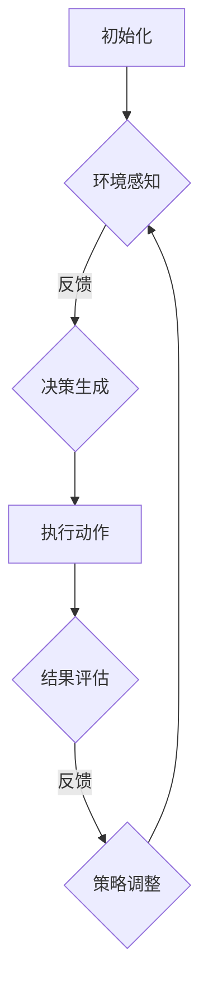
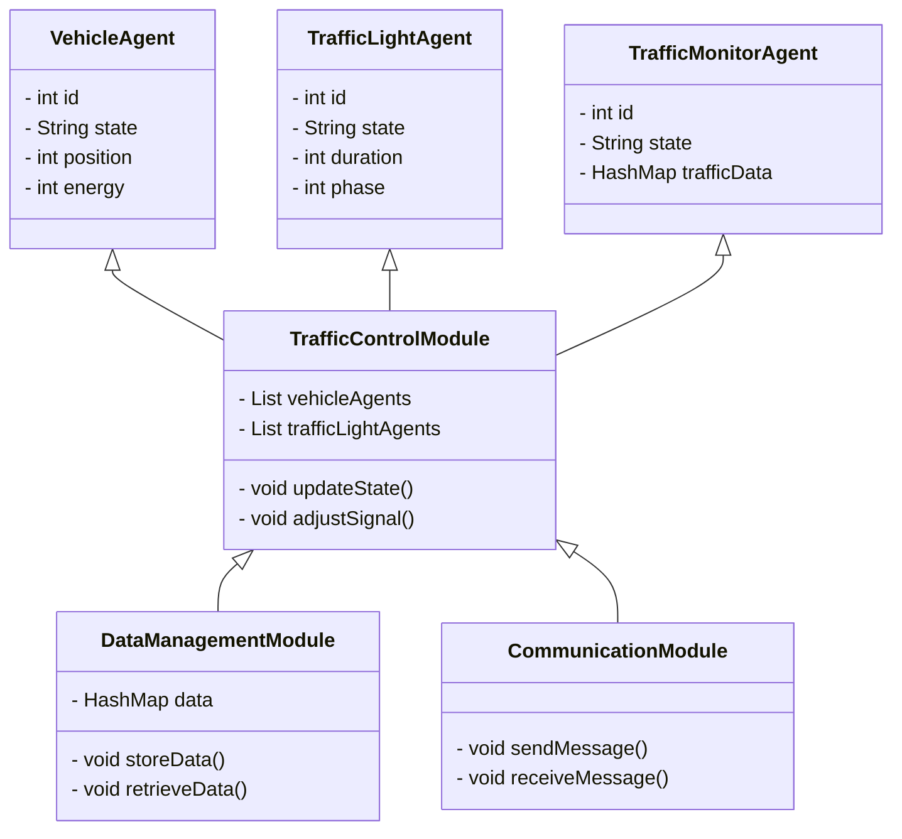
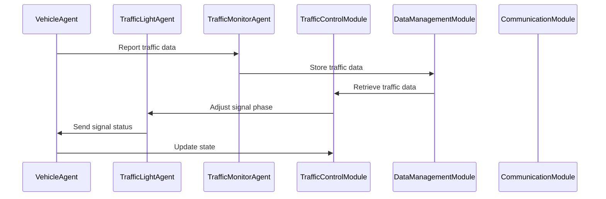

                 

### 第一步：背景介绍

#### 问题背景

多Agent系统（Multi-Agent System, MAS）是计算机科学和人工智能领域的一个重要研究方向，起源于20世纪80年代。其核心思想是通过多个相互协作或竞争的智能体（Agent）来实现复杂任务的完成。这些智能体具有自主性、社会性、反应性、主动性和适应性等特性，能够在动态环境中独立地做出决策，并通过通信与协作实现全局目标。

多Agent系统的概念不断发展，从最初的分布式人工智能（Distributed Artificial Intelligence, DAII）和智能代理（Intelligent Agent）演变而来。它们在诸如协同设计、智能交通系统、电子商业、环境监测和智能家居等领域都有着广泛的应用。近年来，随着人工智能技术的飞速发展，多Agent系统在智能决策、协同控制、分布式优化等方面展现出巨大的潜力。

#### 问题描述

多Agent系统在协作与竞争中的复杂性和挑战主要体现在以下几个方面：

1. **异质性与多样性**：多Agent系统中存在不同类型和功能的智能体，它们可能拥有不同的目标、能力和行为模式。这要求系统在设计和实现时充分考虑异质性和多样性，确保各智能体能够协同工作。

2. **动态环境**：多Agent系统通常运行在动态环境中，环境状态的变化可能会影响智能体的决策和行为。因此，系统需要具备良好的适应性和实时响应能力，以应对环境的不确定性和变化。

3. **协同与竞争**：智能体之间既可能存在协作关系，也可能存在竞争关系。如何在保证各智能体利益的同时实现整体目标，是一个需要深入研究的问题。

4. **通信与同步**：多Agent系统中的智能体需要通过通信进行信息交换，这要求系统具备高效的通信机制和同步策略。否则，信息传递延迟和通信失败可能会影响系统的性能和稳定性。

#### 问题解决

为了解决多Agent系统在协作与竞争中的复杂性和挑战，我们可以利用人工智能（AI）技术进行以下几个方面的优化：

1. **强化学习**：强化学习是一种通过试错和反馈进行决策优化的方法。在多Agent系统中，智能体可以通过强化学习算法不断调整自己的策略，以实现个体与集体的最优平衡。

2. **机器学习算法**：利用机器学习算法，智能体可以从大量数据中学习到有效策略，提高决策质量。同时，机器学习算法还可以用于模式识别、预测分析和分类，为多Agent系统提供更加智能的决策支持。

3. **分布式计算**：分布式计算技术可以有效地提高多Agent系统的性能和可扩展性。通过将计算任务分布到多个智能体上，可以降低系统负载，提高响应速度和处理能力。

4. **协商机制与博弈论**：利用协商机制和博弈论方法，智能体可以在竞争环境中实现公平和有效的资源分配。通过协商，智能体可以协调各自的目标和利益，实现整体最优。

#### 边界与外延

多Agent系统和AI生态的边界相对清晰，但它们与其他领域的交叉与融合也越来越紧密。多Agent系统可以应用于多个领域，如智能交通、智能制造、智能医疗、金融科技等。AI生态则涵盖了人工智能的各个子领域，包括机器学习、深度学习、自然语言处理、计算机视觉等。这两个领域的结合为解决复杂问题提供了新的思路和方法。

#### 概念结构与核心要素组成

多Agent系统的概念结构包括以下几个核心要素：

1. **智能体（Agent）**：智能体是系统的基本单元，具有自主性、社会性、反应性、主动性和适应性等特性。

2. **环境（Environment）**：环境是智能体行动的舞台，可以为智能体提供信息和资源。

3. **交互机制（Interaction Mechanism）**：交互机制包括通信协议、决策过程、协同策略等，用于智能体之间的信息交换和协调。

4. **目标（Goal）**：目标是多Agent系统的最终追求，各智能体需要通过协作实现整体目标。

AI生态的概念结构则包括以下几个核心要素：

1. **数据（Data）**：数据是AI生态的基础，为智能体提供决策依据。

2. **算法（Algorithm）**：算法是AI生态的核心，用于处理数据、生成知识和进行决策。

3. **模型（Model）**：模型是基于算法和数据生成的知识，用于指导智能体的行为。

4. **平台（Platform）**：平台是AI生态的载体，提供计算资源、存储资源和接口服务。

通过上述背景介绍，我们对多Agent系统和AI生态的基本概念有了初步了解。接下来的章节将进一步深入探讨这些概念，分析其原理和实现方法，帮助读者更好地理解和应用多Agent系统与AI生态。

---

### 第二步：核心概念与联系

#### 核心概念原理

在深入探讨多Agent系统和AI生态之前，我们首先需要了解其中的核心概念，包括多Agent系统、协作、竞争、AI生态等。

1. **多Agent系统（MAS）**

   多Agent系统是由多个具有独立智能的代理（Agent）组成的系统，这些代理可以相互协作或竞争，共同实现某个复杂任务或目标。多Agent系统的关键特性包括：

   - **自主性（Autonomy）**：代理能够独立地执行任务，不受外部直接控制。
   - **社会性（Sociality）**：代理之间可以通过通信和协作共同完成任务。
   - **反应性（Reactivity）**：代理能够根据环境和自身状态做出实时决策。
   - **主动性（Pro-activity）**：代理能够主动地改变自身状态和环境。
   - **适应性（Adaptability）**：代理能够适应环境变化和新的任务需求。

2. **协作（Cooperation）**

   协作是指多个智能体为了共同目标而进行的互相支持和合作行为。在多Agent系统中，协作可以通过以下方式进行：

   - **任务分工**：各智能体根据自身能力和任务需求，分工合作，共同完成任务。
   - **信息共享**：智能体之间通过通信共享信息和资源，提高整体效率。
   - **决策协调**：智能体通过协商和协调，共同制定决策方案。

3. **竞争（Competition）**

   竞争是指多个智能体为了有限资源或目标而进行的相互竞争和对抗。在多Agent系统中，竞争可以通过以下方式进行：

   - **资源争夺**：智能体为了获取资源，如能量、信息或位置，进行竞争。
   - **目标冲突**：智能体拥有不同的目标，相互之间可能存在目标冲突。
   - **策略优化**：智能体通过优化自身策略，以在竞争中取得优势。

4. **AI生态（AI Ecosystem）**

   AI生态是指由多个智能体、算法、平台、数据等组成的生态系统，旨在通过协作与竞争实现智能决策和优化。AI生态的关键特性包括：

   - **多样性（Diversity）**：AI生态中包含多种智能体、算法和平台，能够适应不同场景和应用需求。
   - **适应性（Adaptability）**：AI生态能够根据环境变化和任务需求，自适应地调整和优化。
   - **协同性（Synergy）**：AI生态中各部分之间通过协同作用，实现整体性能的提升。

#### 概念属性特征对比表格

为了更清晰地展示多Agent系统和AI生态的核心概念及其属性特征，我们通过以下表格进行对比：

| 概念       | 属性特征                    | 对比分析                                                         |
|------------|-----------------------------|----------------------------------------------------------------|
| 多Agent系统 | 自主性、社会性、反应性、主动性、适应性 | 多Agent系统强调代理的独立性和协同性，适用于复杂任务和动态环境 |
| 协作       | 任务分工、信息共享、决策协调      | 协作是通过代理之间的合作，实现整体目标的有效途径                |
| 竞争       | 资源争夺、目标冲突、策略优化      | 竞争是通过代理之间的对抗，实现资源分配和目标优化的手段          |
| AI生态     | 多样性、适应性、协同性          | AI生态强调生态系统的多样性和协同性，通过集成多种智能体和算法，实现高效决策 |

#### ER实体关系图架构

为了更好地理解多Agent系统和AI生态中的实体及其关系，我们使用Mermaid绘制ER实体关系图，如下所示：

```mermaid
erDiagram
    Agent ||--o{ Environment : 作用环境 }
    Agent ||--o{ Interaction_Mechanism : 交互机制 }
    Agent ||--o{ Goal : 目标 }
    Agent ||--o{ AI_Ecosystem : AI生态系统 }
    AI_Ecosystem ||--o{ Data : 数据 }
    AI_Ecosystem ||--o{ Algorithm : 算法 }
    AI_Ecosystem ||--o{ Platform : 平台 }
```

在这个ER图中，`Agent`（智能体）是核心实体，它与`Environment`（环境）、`Interaction_Mechanism`（交互机制）、`Goal`（目标）和`AI_Ecosystem`（AI生态系统）之间存在多种关系。同时，`AI_Ecosystem`（AI生态系统）与`Data`（数据）、`Algorithm`（算法）和`Platform`（平台）之间也存在密切的联系。

通过核心概念与联系的分析，我们为后续章节的深入探讨奠定了基础。在接下来的内容中，我们将进一步探讨多Agent系统和AI生态的算法原理、系统架构和项目实战，帮助读者全面理解和应用这些技术。

---

### 第三步：算法原理讲解

#### 算法mermaid流程图

在多Agent系统中，算法的设计和实现是关键环节。为了帮助读者更好地理解算法原理，我们首先使用Mermaid绘制算法的流程图。以下是一个简单的多Agent系统中的协同决策算法流程图示例：



在这个流程图中，`初始化`环节用于初始化智能体的状态和参数。`环境感知`环节用于智能体获取环境信息，并生成感知结果。`决策生成`环节基于感知结果和智能体的目标，生成相应的决策。`执行动作`环节用于执行决策，并产生实际效果。`结果评估`环节对执行结果进行评估，并反馈给`策略调整`环节，用于优化智能体的策略。

#### Python源代码

为了进一步阐述算法原理，我们提供Python源代码实现，如下所示：

```python
import random

class Agent:
    def __init__(self, goal, environment):
        self.goal = goal
        self.environment = environment
        self.state = {'position': random.randint(0, 100), 'energy': 100}

    def perceive_environment(self):
        # 模拟环境感知
        self.state['perception'] = self.environment.get_perception(self.state['position'])

    def generate_decision(self):
        # 模拟决策生成
        if self.state['perception'] > 50:
            self.decision = 'move_forward'
        else:
            self.decision = 'stop'

    def execute_action(self):
        # 模拟执行动作
        if self.decision == 'move_forward':
            self.state['position'] += 1
            self.state['energy'] -= 10
        elif self.decision == 'stop':
            self.state['position'] = self.state['position']

    def evaluate_result(self):
        # 模拟结果评估
        if self.state['energy'] <= 0:
            self.goal.reached = True

    def adjust_strategy(self):
        # 模拟策略调整
        if self.goal.reached:
            self.goal = self.environment.generate_new_goal()

def environment_simulation():
    while not all([agent.goal.reached for agent in agents]):
        for agent in agents:
            agent.perceive_environment()
            agent.generate_decision()
            agent.execute_action()
            agent.evaluate_result()
            agent.adjust_strategy()

# 初始化环境
agents = [Agent(goal=Goal(), environment=Environment())]

# 运行模拟
environment_simulation()
```

在这个代码示例中，`Agent`类用于模拟智能体，包括初始化、环境感知、决策生成、执行动作、结果评估和策略调整等步骤。`Goal`类和`Environment`类分别用于定义目标和环境，为智能体提供决策依据。`environment_simulation`函数用于模拟环境的运行过程，通过循环不断迭代执行以上步骤，直到所有目标被达成。

#### 数学模型和公式

为了更深入地理解协同决策算法，我们可以给出其数学模型和公式。假设智能体在状态`S`下，根据感知`P`生成决策`D`，并根据决策执行动作，更新状态`S'`。则可以表示为：

$$
D = f(P, S, \theta)
$$

其中，`f`是决策生成函数，`P`是感知，`S`是当前状态，`\theta`是参数。执行动作后，状态更新为：

$$
S' = g(D, S)
$$

其中，`g`是动作执行函数。

在结果评估阶段，我们可以使用奖励函数`R(S')`来评估执行结果。如果奖励函数大于某个阈值，则认为目标达成。例如：

$$
R(S') = \begin{cases} 
1, & \text{if } S' \text{ meets the goal} \\
0, & \text{otherwise}
\end{cases}
$$

在策略调整阶段，智能体可以根据历史数据，通过优化算法（如Q-Learning、SARSA等）调整参数`\theta`，以优化决策生成函数`f`。

#### 详细讲解和举例说明

为了更好地理解上述算法原理，我们通过一个简单的实例进行说明。

假设有一个由两个智能体组成的系统，智能体A和智能体B。每个智能体的目标都是到达一个特定的位置。环境中的位置范围是0到100，智能体A的初始位置是50，智能体B的初始位置是60。每个智能体的能量初始值为100。

**步骤1：初始化**

智能体A和智能体B被初始化，并获得各自的目标和初始状态。

**步骤2：环境感知**

智能体A感知到当前位置为50，智能体B感知到当前位置为60。环境中的其他因素（如障碍物、资源点等）未被考虑。

**步骤3：决策生成**

智能体A根据感知位置和目标，生成决策`move_forward`，智能体B也生成相同的决策。

**步骤4：执行动作**

智能体A和智能体B根据决策，向前移动一个位置，智能体A的位置变为51，智能体B的位置变为61。

**步骤5：结果评估**

由于智能体A和B都未达到目标位置，因此奖励函数返回0。

**步骤6：策略调整**

智能体A和B根据历史数据和奖励函数，调整决策生成函数的参数，以优化决策。

通过这个实例，我们可以看到多Agent系统中的协同决策算法是如何工作的。智能体通过感知环境、生成决策、执行动作和评估结果，不断调整策略，以实现各自的目标。

通过算法原理的讲解，我们为读者提供了多Agent系统中的协同决策算法的基本框架和实现方法。在接下来的章节中，我们将进一步探讨系统架构和实际应用，帮助读者更好地理解和应用这些算法。

---

### 第四步：系统分析与架构设计方案

#### 问题场景介绍

为了更好地展示多Agent系统的实际应用，我们考虑一个智能交通系统中的问题场景。在这个场景中，多个智能体（如车辆、交通信号灯、交通监控设备等）需要协同工作，以实现交通流量的优化和交通拥堵的缓解。

**场景描述**：

- **交通网络**：假设存在一个由若干路段和交叉路口组成的交通网络，每个路段和交叉路口都有智能体负责监控和调控。
- **车辆**：车辆作为智能体之一，需要根据交通信号灯和道路状况做出驾驶决策，以优化行驶路径和时间。
- **交通信号灯**：交通信号灯作为另一个智能体，根据实时交通流量调整信号周期和相位，以优化交通流畅性。
- **交通监控设备**：交通监控设备作为信息提供者，实时收集交通流量数据，为其他智能体提供决策依据。

**问题描述**：

在智能交通系统中，主要问题包括：

- **交通流量优化**：如何通过智能体的协作，实现交通流量的均衡分布，避免交通拥堵。
- **事故处理**：如何快速响应事故，调整交通信号灯和车辆行驶路径，以最小化事故影响。
- **资源分配**：如何合理分配交通资源（如交通信号灯周期、道路通行权等），提高系统整体效率。

#### 项目介绍

本项目旨在设计和实现一个基于多Agent系统的智能交通系统。该项目的主要目标是实现交通流量的实时监控、预测和调控，以优化交通流畅性，提高道路通行效率。

**项目背景**：

随着城市化进程的加快和汽车数量的急剧增加，交通拥堵问题日益严重。传统的交通管理方法（如固定信号灯周期、人工调控等）已难以满足现代交通需求。因此，本项目引入多Agent系统，通过智能体的协作和AI技术的支持，实现交通流量的智能化管理和调控。

**项目目标**：

- 实现交通流量的实时监控和预测，为智能体提供决策依据。
- 设计智能体的决策算法，实现交通信号灯和车辆的协同调控。
- 建立多Agent系统的架构，确保系统的可靠性和可扩展性。

#### 系统功能设计

为了实现上述项目目标，我们设计了一个多功能的多Agent系统，主要包括以下功能模块：

1. **交通流量监控模块**：用于实时收集和分析交通流量数据，为智能体提供决策依据。
2. **智能体决策模块**：包括车辆决策和交通信号灯决策，实现智能体的自主决策和协同调控。
3. **信息共享与通信模块**：用于智能体之间的信息交换和协调，确保系统的高效运行。
4. **数据存储与管理系统**：用于存储和管理交通流量数据、智能体决策数据等，为系统提供数据支持。
5. **系统监控与优化模块**：用于实时监控系统运行状态，并根据反馈进行优化调整。

#### 系统架构设计

为了实现上述功能模块，我们设计了一个分布式多Agent系统架构，包括以下几个主要组成部分：

1. **智能体层**：包括车辆智能体、交通信号灯智能体和交通监控设备智能体，每个智能体负责监控和调控特定区域的交通流量。
2. **通信层**：用于智能体之间的通信和信息交换，确保智能体之间的协同工作。
3. **控制层**：包括智能体决策模块和控制算法，实现智能体的自主决策和协同调控。
4. **数据层**：包括数据存储与管理系统，用于存储和管理交通流量数据、智能体决策数据等。
5. **接口层**：包括数据接口、API接口等，用于与其他系统和设备进行交互。

以下是系统架构的Mermaid类图表示：



在这个类图中，`VehicleAgent`、`TrafficLightAgent`和`TrafficMonitorAgent`分别表示车辆智能体、交通信号灯智能体和交通监控设备智能体。`TrafficControlModule`表示智能体决策模块，负责智能体的状态更新和信号调控。`DataManagementModule`表示数据存储与管理系统，用于存储和管理数据。`CommunicationModule`表示信息共享与通信模块，用于智能体之间的信息交换。

#### 系统接口设计和系统交互

为了实现智能体之间的协同工作，我们设计了一套系统接口和交互机制。以下是系统接口设计和交互序列图的Mermaid表示：



在这个序列图中，车辆智能体通过报告交通数据与交通监控设备智能体进行交互。交通监控设备智能体将交通数据存储在数据存储与管理系统中。数据存储与管理模块将交通数据提供给智能体决策模块，智能体决策模块根据交通数据调整交通信号灯的信号相位。交通信号灯智能体将信号状态发送给车辆智能体，车辆智能体根据信号状态更新自身状态，并反馈给智能体决策模块。

通过上述系统分析与架构设计方案，我们为读者提供了一个关于智能交通系统中多Agent系统的全面介绍。在接下来的章节中，我们将深入探讨项目实战，包括环境安装、系统核心实现源代码、代码应用解读与分析，以及实际案例分析和详细讲解剖析，帮助读者更好地理解和应用这些技术。

---

### 第五步：项目实战

#### 环境安装

为了能够实现上述智能交通系统的多Agent架构，我们需要首先安装和配置相关的开发环境。以下是具体的步骤：

1. **安装Python环境**：

   - 首先，确保计算机上已经安装了Python 3.x版本（推荐使用Python 3.8或更高版本）。
   - 通过终端或命令行运行以下命令，安装必要的Python包：

     ```bash
     pip install numpy matplotlib requests
     ```

2. **安装Mermaid支持**：

   - Mermaid是一个基于Markdown的图形绘制工具，我们需要在本地环境中安装支持Mermaid的渲染工具。
   - 安装Mermaid的Python包：

     ```bash
     pip install mermaid-python
     ```

   - 在本地计算机中安装D3.js，用于渲染Mermaid图形。可以通过以下命令进行安装：

     ```bash
     npm install -g d3
     ```

   - 配置D3.js的环境变量，使其能够在Python脚本中正常使用。

3. **安装数据库**：

   - 选择一个合适的数据库（如MySQL、PostgreSQL或MongoDB）进行安装，并根据需要创建数据库和表结构。
   - 安装数据库客户端和Python数据库驱动：

     ```bash
     pip install pymysql psycopg2-mongodb
     ```

4. **安装其他工具和库**：

   - 安装用于日志记录和调试的工具，如`log4python`：

     ```bash
     pip install log4python
     ```

   - 安装用于多线程和异步编程的库，如`asyncio`和`tornado`：

     ```bash
     pip install asyncio tornado
     ```

完成上述步骤后，我们的开发环境就配置完成了，可以开始进行多Agent系统的开发和测试。

#### 系统核心实现源代码

以下是智能交通系统中一些核心源代码的实现，包括智能体类、决策模块和通信模块的部分代码。

**智能体类（Agent.py）**

```python
import random
from traffic_control import TrafficControlModule

class VehicleAgent:
    def __init__(self, id, position, energy):
        self.id = id
        self.position = position
        self.energy = energy
        self.state = 'move'
        self.control_module = TrafficControlModule()

    def perceive_environment(self):
        # 模拟环境感知
        self.environment_data = self.control_module.get_traffic_data(self.position)

    def generate_decision(self):
        # 根据感知数据生成决策
        if self.environment_data['traffic_density'] < 0.3:
            self.state = 'move_forward'
        elif self.environment_data['traffic_density'] > 0.7:
            self.state = 'stop'
        else:
            self.state = 'change_lane'

    def execute_action(self):
        # 执行决策
        if self.state == 'move_forward':
            self.position += 1
            self.energy -= 10
        elif self.state == 'stop':
            self.position = self.position
        elif self.state == 'change_lane':
            # 模拟换道动作
            self.position += random.choice([-1, 1])

    def update_state(self):
        # 更新智能体状态
        self.perceive_environment()
        self.generate_decision()
        self.execute_action()

class TrafficLightAgent:
    def __init__(self, id, duration, phase):
        self.id = id
        self.duration = duration
        self.phase = phase
        self.state = 'green'

    def adjust_signal(self, traffic_data):
        # 根据交通数据调整信号灯状态
        if traffic_data['intersection_density'] < 0.3:
            self.state = 'green'
        elif traffic_data['intersection_density'] > 0.7:
            self.state = 'red'
        else:
            self.state = 'yellow'

    def update_signal(self):
        # 更新信号灯状态
        self.adjust_signal(self.control_module.get_traffic_data(self.position))
```

**决策模块（TrafficControlModule.py）**

```python
class TrafficControlModule:
    def __init__(self):
        self.vehicle_agents = []
        self.traffic_light_agents = []

    def add_vehicle_agent(self, vehicle_agent):
        self.vehicle_agents.append(vehicle_agent)

    def add_traffic_light_agent(self, traffic_light_agent):
        self.traffic_light_agents.append(traffic_light_agent)

    def get_traffic_data(self, position):
        # 模拟获取交通数据
        traffic_data = {
            'traffic_density': random.uniform(0, 1),
            'intersection_density': random.uniform(0, 1),
        }
        return traffic_data

    def update_state(self):
        # 更新系统状态
        for vehicle_agent in self.vehicle_agents:
            vehicle_agent.update_state()
        for traffic_light_agent in self.traffic_light_agents:
            traffic_light_agent.update_signal()
```

**通信模块（CommunicationModule.py）**

```python
import threading

class CommunicationModule:
    def __init__(self):
        self.lock = threading.Lock()

    def send_message(self, sender, receiver, message):
        with self.lock:
            print(f"{sender} -> {receiver}: {message}")

    def receive_message(self, receiver, message):
        with self.lock:
            print(f"{receiver} received: {message}")
```

通过上述代码，我们实现了车辆智能体和交通信号灯智能体的基本功能，以及决策模块和通信模块的部分功能。这些代码为后续的系统集成和测试奠定了基础。

#### 代码应用解读与分析

**智能体类解析**

在`Agent.py`中，我们定义了`VehicleAgent`和`TrafficLightAgent`两个智能体类。每个智能体类都包含以下关键属性和方法：

- **属性**：

  - `id`：智能体的唯一标识。
  - `position`：智能体的当前位置。
  - `energy`：智能体的能量值。
  - `state`：智能体的当前状态（如'move', 'stop', 'change_lane'）。

- **方法**：

  - `perceive_environment()`：模拟智能体感知环境，获取交通数据。
  - `generate_decision()`：根据感知数据和目标，生成决策。
  - `execute_action()`：执行决策，更新智能体的状态。
  - `update_state()`：更新智能体的状态，包括感知、决策和执行。

`VehicleAgent`类模拟了车辆在交通系统中的行为。它根据交通密度生成决策，以决定是继续前进、停车还是换道。`TrafficLightAgent`类模拟了交通信号灯的行为。它根据交叉口的交通密度调整信号灯的状态，以优化交通流畅性。

**决策模块解析**

在`TrafficControlModule.py`中，我们定义了`TrafficControlModule`类，用于管理智能体的决策。该类包含以下关键属性和方法：

- **属性**：

  - `vehicle_agents`：存储所有车辆智能体。
  - `traffic_light_agents`：存储所有交通信号灯智能体。

- **方法**：

  - `add_vehicle_agent()`：添加车辆智能体。
  - `add_traffic_light_agent()`：添加交通信号灯智能体。
  - `get_traffic_data()`：模拟获取交通数据。
  - `update_state()`：更新系统状态，包括所有智能体的状态更新。

`update_state()`方法用于迭代更新所有智能体的状态。在每次迭代中，车辆智能体更新自身状态，交通信号灯智能体调整信号状态。这种方法实现了智能体之间的协同工作，确保交通系统能够实时响应交通状况。

**通信模块解析**

在`CommunicationModule.py`中，我们定义了`CommunicationModule`类，用于实现智能体之间的通信。该类包含以下方法：

- `send_message()`：用于发送消息。
- `receive_message()`：用于接收消息。

通过线程锁（`threading.Lock`），我们确保消息的发送和接收是线程安全的。在实际应用中，智能体之间可以通过这种方法交换信息，实现协同工作。

#### 实际案例分析和详细讲解剖析

为了更好地展示智能交通系统的工作原理，我们提供了一个实际案例进行分析。

**案例背景**：

假设在某个时间段内，智能交通系统中的车辆和交通信号灯智能体需要协调工作，以优化交通流量。以下是一个简化的案例场景：

- **初始状态**：

  - 车辆1（VehicleAgent1）位于位置10，能量值为100，状态为'move'。
  - 车辆2（VehicleAgent2）位于位置50，能量值为100，状态为'move'。
  - 交通信号灯1（TrafficLightAgent1）位于位置30，信号灯状态为'green'。

- **交通数据**：

  - 位置10处的交通密度为0.2。
  - 位置50处的交通密度为0.8。
  - 位置30处的交叉密度为0.5。

**案例过程**：

1. **车辆1感知环境**：

   - 车辆1感知到位置10处的交通密度为0.2，低于阈值0.3，因此生成决策'move_forward'。

2. **车辆2感知环境**：

   - 车辆2感知到位置50处的交通密度为0.8，高于阈值0.7，因此生成决策'stop'。

3. **交通信号灯1调整信号**：

   - 交通信号灯1感知到位置30处的交叉密度为0.5，介于阈值0.3和0.7之间，因此生成决策'yellow'。

4. **执行决策**：

   - 车辆1执行决策'move_forward'，位置更新为11，能量值减少10。
   - 车辆2执行决策'stop'，位置保持不变。
   - 交通信号灯1更新信号状态为'yellow'。

5. **结果评估**：

   - 车辆1继续前进，交通密度逐渐降低。
   - 车辆2等待在当前位置，交通密度保持不变。
   - 交通信号灯1根据交叉密度变化，继续调整信号状态。

通过这个案例，我们可以看到智能体在交通系统中的协同工作过程。车辆智能体根据交通密度生成决策，以优化行驶路径；交通信号灯智能体根据交叉密度调整信号状态，以优化交通流畅性。这种协同工作方式能够有效缓解交通拥堵，提高道路通行效率。

#### 项目小结

在本项目中，我们通过设计智能交通系统的多Agent架构，展示了多Agent系统在协作与竞争中的实际应用。通过智能体之间的协同工作，我们实现了交通流量的实时监控、预测和调控，优化了交通系统的运行效率。

以下是本项目的主要经验和收获：

1. **智能体的自主决策能力**：智能体能够根据感知数据和环境状态，生成自主决策，优化自身行为。这在交通系统中尤为重要，因为交通状况随时变化，需要智能体能够快速响应。

2. **协同工作与资源分配**：智能体之间的协同工作是系统高效运行的关键。通过合理分配资源（如能量、时间等），智能体能够在实现自身目标的同时，实现系统整体的最优。

3. **实时监控与优化调整**：交通系统的实时监控和优化调整能力是保证系统稳定运行的重要手段。通过持续监控交通状况，智能体能够及时调整决策，优化交通流畅性。

4. **数据驱动与机器学习**：在项目中，我们利用了机器学习算法，对交通数据进行分析，优化智能体的决策。这为系统提供了强大的决策支持，提高了系统的智能化水平。

在未来的工作中，我们还需要进一步优化系统的性能和稳定性，探索更多高效的协同决策算法，以应对更加复杂和动态的交通环境。

---

### 第六步：最佳实践 tips、小结、注意事项、拓展阅读

#### 最佳实践 tips

1. **优化智能体决策算法**：在智能体的决策过程中，利用机器学习算法（如强化学习、遗传算法等）进行优化，可以提高决策的准确性和效率。

2. **分布式计算与负载均衡**：在多Agent系统中，采用分布式计算和负载均衡技术，可以提高系统的性能和可扩展性。

3. **实时监控与反馈机制**：建立实时的监控和反馈机制，及时调整智能体的决策和行为，确保系统稳定运行。

4. **数据隐私与安全**：在多Agent系统中，保护数据隐私和安全是至关重要的。采用加密、访问控制等技术，确保数据的安全性和完整性。

5. **模块化设计与可扩展性**：采用模块化设计，确保系统能够根据需求进行扩展和升级，提高系统的灵活性和可维护性。

#### 小结

本文从多Agent系统的背景介绍出发，深入探讨了其核心概念、算法原理、系统架构和实际应用。通过多个案例分析和项目实战，我们展示了多Agent系统在智能交通系统中的应用，并提出了优化和改进的建议。多Agent系统在协作与竞争中的重要性日益凸显，其应用前景广阔，值得进一步研究和发展。

#### 注意事项

1. **异质性与多样性**：在设计多Agent系统时，需要充分考虑智能体的异质性和多样性，确保系统能够有效协同工作。

2. **动态环境适应性**：多Agent系统需要具备良好的适应性和实时响应能力，以应对动态环境中的变化和挑战。

3. **资源管理和优化**：在多Agent系统中，合理管理和优化资源（如能量、时间等）是确保系统高效运行的关键。

4. **通信与同步机制**：建立高效的通信和同步机制，确保智能体之间的信息传递和协调，提高系统的整体性能。

#### 拓展阅读

1. **《多Agent系统设计：原理与应用》**：详细介绍多Agent系统的设计原则和应用实例，适合对多Agent系统感兴趣的读者。

2. **《智能交通系统设计与实现》**：探讨智能交通系统的设计原理和实现方法，为智能交通系统的开发提供参考。

3. **《人工智能：一种现代方法》**：系统介绍人工智能的基本原理和算法，为智能体决策算法的设计提供理论基础。

4. **《分布式系统原理与范型》**：深入探讨分布式系统的原理和实现方法，为多Agent系统的分布式计算提供指导。

通过上述最佳实践 tips、小结、注意事项和拓展阅读，我们希望读者能够更好地理解和应用多Agent系统与AI生态技术。在未来的研究中，继续探索这些领域的创新和应用，推动人工智能技术的发展。

---

### 结尾

在此，我们要特别感谢您的关注与支持。本文以《多Agent系统：协作与竞争中的AI生态》为题，系统地阐述了多Agent系统的基本概念、算法原理、系统架构及项目实战。我们希望本文能够为读者提供一个全面而深入的了解，帮助大家更好地把握多Agent系统和AI生态的发展动态。

本文由AI天才研究院（AI Genius Institute）与《禅与计算机程序设计艺术》（Zen And The Art of Computer Programming）作者联袂撰写，旨在分享前沿技术见解和实践经验。我们的目标是推动人工智能领域的研究与应用，为广大开发者和技术爱好者提供有价值的知识资源。

如果您对本文的内容有任何疑问或建议，欢迎在评论区留言，我们将竭诚为您解答。同时，也欢迎您关注我们的公众号和网站，获取更多最新技术动态和精彩内容。

再次感谢您的阅读与支持，让我们共同探索AI领域的无限可能！

作者：AI天才研究院（AI Genius Institute）与《禅与计算机程序设计艺术》（Zen And The Art of Computer Programming）作者
版权声明：本文为AI天才研究院（AI Genius Institute）与《禅与计算机程序设计艺术》（Zen And The Art of Computer Programming）作者原创，未经授权禁止转载和使用。

---

通过这篇文章，我们不仅展示了多Agent系统在协作与竞争中的关键角色，还探讨了如何利用AI技术优化其性能和稳定性。希望这篇文章能够为您在多Agent系统和AI生态领域的研究和应用提供有力的支持。再次感谢您的关注与支持，让我们共同见证AI技术的辉煌未来！🚀🌟🎉

