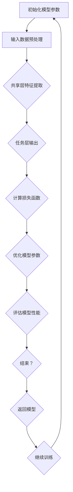
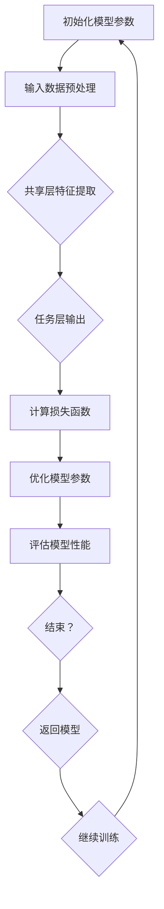
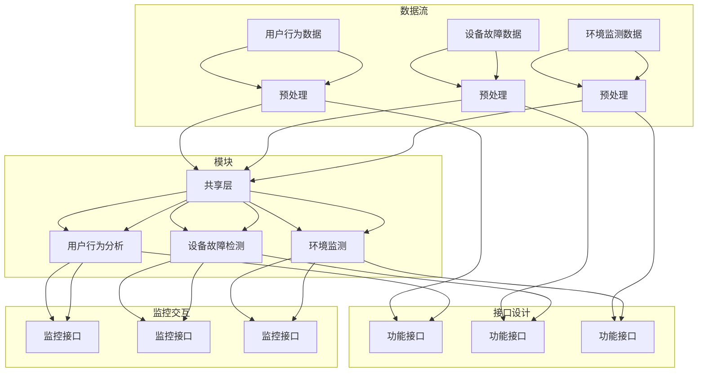

                 

### 1.1 多任务学习框架背景与概述

#### 1.1.1 人工智能与多任务学习

在人工智能领域，多任务学习（Multi-Task Learning, MTL）是一种备受关注的研究方向。人工智能的核心目标是使计算机具备类似人类的智能，能够理解、学习、推理和解决问题。而多任务学习正是实现这一目标的重要手段之一。

多任务学习旨在训练一个模型同时解决多个相关的任务。这些任务可以是分类、回归、聚类等多种形式，但它们在数据、特征和任务目标上存在一定程度的关联性。通过多任务学习，模型可以在共享底层特征表示的基础上，分别处理不同的任务，从而提高整体性能。

与单任务学习（Single-Task Learning, STL）相比，多任务学习具有以下优势：

1. **资源共享**：多任务学习可以利用不同任务之间的共享信息，避免重复学习，提高学习效率。
2. **泛化能力**：多任务学习模型在解决新任务时，可以利用其他任务的先验知识，提高模型的泛化能力。
3. **性能提升**：多任务学习可以在不同任务之间转移学习效果，使得每个任务都受益于其他任务的训练。

然而，多任务学习也面临着一系列挑战，如任务之间的冲突、不同任务的数据分布差异、模型参数的优化等。这些挑战使得多任务学习成为一个具有挑战性的研究领域，吸引了众多学者和研究机构的关注。

#### 1.1.2 多任务学习的挑战与机遇

多任务学习虽然具有显著优势，但在实际应用中仍然面临诸多挑战。以下是多任务学习的一些主要挑战：

1. **任务冲突**：不同任务之间的目标可能存在矛盾，例如一个任务要求模型更加精确，而另一个任务则更注重模型的速度。在这种情况下，如何平衡不同任务之间的目标，成为一个关键问题。

2. **数据分布差异**：不同任务的数据分布可能存在较大差异，导致模型在处理某些任务时表现出色，而在其他任务上性能较差。如何有效处理数据分布差异，使模型在多个任务上都表现出良好的性能，是一个重要挑战。

3. **模型参数优化**：多任务学习涉及到多个任务的优化，如何在有限的计算资源下，找到一个兼顾所有任务的参数优化方案，是一个具有挑战性的问题。

然而，随着人工智能技术的不断发展，多任务学习也面临着许多机遇：

1. **跨领域应用**：多任务学习可以应用于多个领域，如自然语言处理、计算机视觉、推荐系统等。通过跨领域应用，多任务学习有望实现更广泛的应用场景。

2. **增强学习**：多任务学习与增强学习（Reinforcement Learning, RL）相结合，可以训练出更加智能的智能体（Agent），使其具备处理复杂环境的能力。

3. **模型压缩与加速**：多任务学习可以在一定程度上降低模型的复杂度，从而实现模型的压缩与加速，为实际应用提供更多可能性。

总之，多任务学习在人工智能领域具有广泛的应用前景，但也面临着诸多挑战。通过深入研究，我们可以不断优化多任务学习算法，使其更好地服务于各个领域。

#### 1.1.3 多任务学习框架的基本原理

多任务学习框架旨在解决多个相关任务，并通过共享底层特征表示和模型参数，提高整体性能。以下是多任务学习框架的基本原理：

1. **共享特征表示**：多任务学习模型通过共享底层特征表示，使不同任务能够利用相同的特征信息。这种共享机制有助于提高模型的泛化能力和计算效率。

2. **任务区分**：在共享特征表示的基础上，多任务学习模型为每个任务设计了特定的输出层或损失函数。这些输出层或损失函数用于区分不同任务，确保模型在各个任务上都能表现出良好的性能。

3. **协同训练**：多任务学习框架通过协同训练（Co-training）机制，使不同任务在训练过程中相互影响，从而提高整体性能。协同训练可以通过共享训练数据和优化目标来实现。

4. **损失函数**：多任务学习框架使用多个损失函数，分别对应不同的任务。这些损失函数在训练过程中共同作用，指导模型优化各个任务的参数。

5. **参数共享与优化**：多任务学习框架通过共享模型参数，降低模型的复杂度，提高计算效率。同时，通过协同优化机制，模型参数在多个任务之间进行优化，从而提高整体性能。

6. **适应性调整**：多任务学习框架可以根据任务的特点和数据分布，自适应调整模型结构和参数。这种适应性调整有助于解决任务冲突和数据分布差异等问题。

通过以上原理，多任务学习框架能够在多个任务之间实现资源共享和协同优化，从而提高整体性能。在实际应用中，多任务学习框架可以根据具体任务需求和数据特点，灵活调整模型结构和参数，以实现最佳效果。

### 1.2 多任务学习框架的核心概念

多任务学习框架的核心概念涵盖了多个方面，包括多任务学习的定义、分类、核心组件以及模型的优势与局限性。以下将逐一进行详细阐述。

#### 1.2.1 多任务学习的定义与分类

多任务学习是一种机器学习方法，旨在训练一个模型同时解决多个相关的任务。这些任务可以是分类、回归、聚类等多种形式，但它们在数据、特征和任务目标上存在一定程度的关联性。

多任务学习可以分为以下几种类型：

1. **独立任务多任务学习**：各个任务之间相互独立，模型分别学习每个任务的表示和参数。独立任务多任务学习的优点是模型简单，便于实现和优化。缺点是任务之间无法共享信息，学习效率较低。

2. **协作任务多任务学习**：多个任务之间通过共享特征表示和模型参数进行协同学习。协作任务多任务学习可以提高模型的整体性能，但需要解决任务冲突和数据分布差异等问题。

3. **层次任务多任务学习**：任务之间存在层次关系，低层任务为高层任务提供先验知识。层次任务多任务学习可以充分利用任务的层次关系，提高模型的学习效率和泛化能力。

4. **领域适应多任务学习**：任务来自不同的领域，但存在一定的相关性。领域适应多任务学习通过跨领域迁移学习，使模型在不同领域之间共享知识和经验，提高模型的泛化能力。

#### 1.2.2 多任务学习的核心组件

多任务学习框架包括以下几个核心组件：

1. **输入层**：输入层接收外部输入数据，包括图像、文本、音频等多种形式。输入层的主要作用是对输入数据进行预处理，提取关键特征。

2. **共享层**：共享层是多个任务共用的部分，用于提取通用的特征表示。共享层可以采用卷积神经网络（CNN）、循环神经网络（RNN）或变换器（Transformer）等深度学习模型。

3. **任务层**：任务层为每个任务设计了特定的输出层和损失函数。输出层用于生成任务结果，如分类标签或回归值。损失函数用于衡量任务结果的误差，指导模型优化参数。

4. **协同训练机制**：协同训练机制通过共享训练数据和优化目标，使不同任务在训练过程中相互影响。协同训练机制可以采用多种策略，如基于梯度的协同训练、基于知识的协同训练等。

#### 1.2.3 多任务学习模型的优势与局限性

多任务学习模型具有以下优势：

1. **资源共享**：多任务学习通过共享底层特征表示和模型参数，提高计算效率和模型泛化能力。

2. **协同优化**：多任务学习在训练过程中，不同任务之间相互影响，协同优化模型参数，提高整体性能。

3. **跨领域应用**：多任务学习可以应用于多个领域，如自然语言处理、计算机视觉、推荐系统等，实现跨领域迁移学习。

4. **增强模型能力**：多任务学习可以使模型在不同任务之间转移学习效果，增强模型的泛化能力和适应性。

然而，多任务学习模型也存在一定的局限性：

1. **任务冲突**：不同任务之间的目标可能存在矛盾，导致模型在某一任务上表现不佳。

2. **数据分布差异**：不同任务的数据分布可能存在较大差异，影响模型在各个任务上的性能。

3. **模型参数优化**：多任务学习涉及多个任务的优化，优化目标之间存在冲突，难以找到一个兼顾所有任务的参数优化方案。

4. **计算资源消耗**：多任务学习需要同时训练多个任务，计算资源消耗较大，可能影响模型训练效率。

综上所述，多任务学习框架在人工智能领域具有重要的应用价值，但也需要解决一系列挑战。通过深入研究，我们可以不断优化多任务学习算法，使其更好地服务于各个领域。

### 1.3 多任务学习框架的ER实体关系图架构

在多任务学习框架的设计和实现过程中，ER（实体关系）图架构是一种有效的工具，可以帮助我们清晰地理解各个实体之间的关系，并为其提供明确的定义。以下是多任务学习框架的ER实体关系图架构的详细说明。

#### 1.3.1 实体关系图的绘制方法

ER图通常包括以下三个主要部分：实体（Entity）、属性（Attribute）和关系（Relationship）。

1. **实体**：实体是ER图中的核心元素，表示系统中的关键组件或对象。在多任务学习框架中，实体可以包括输入数据、任务、模型、损失函数等。

2. **属性**：属性描述实体的特征或属性，用于补充实体的信息。例如，对于输入数据实体，其属性可以包括数据类型、数据规模、数据分布等。

3. **关系**：关系描述实体之间的关联性或依赖关系。在多任务学习框架中，关系可以包括任务与模型之间的关系、模型与损失函数之间的关系等。

为了绘制ER图，我们可以遵循以下步骤：

1. **确定实体**：首先，根据多任务学习框架的需求，确定框架中的关键实体。例如，输入数据实体、任务实体、模型实体等。

2. **定义属性**：为每个实体定义相应的属性，描述实体的特征或状态。例如，输入数据实体的属性可以是数据类型、数据规模、数据分布等。

3. **建立关系**：根据实体的属性和框架的设计需求，确定实体之间的关系。例如，任务实体与模型实体之间的关系可以是任务分配给模型执行，模型实体与损失函数实体之间的关系可以是模型通过损失函数评估任务性能。

4. **绘制ER图**：使用图形化工具（如Mermaid）将实体、属性和关系表示在图中，形成一个完整的ER图。

#### 1.3.2 多任务学习框架的实体与关系

在多任务学习框架中，以下是一些关键的实体及其关系：

1. **输入数据实体**：输入数据实体表示多任务学习框架的输入，包括图像、文本、音频等多种形式。输入数据实体具有以下属性：
   - 数据类型：图像、文本、音频等。
   - 数据规模：数据集的大小，如数量、维度等。
   - 数据分布：数据集的分布特征，如均匀分布、正态分布等。

2. **任务实体**：任务实体表示多任务学习框架中的各个任务，包括分类、回归、聚类等。任务实体具有以下属性：
   - 任务类型：分类、回归、聚类等。
   - 任务目标：每个任务的具体目标，如预测分类标签、估计回归值等。
   - 数据集：与任务相关的数据集。

3. **模型实体**：模型实体表示多任务学习框架中的模型，包括共享层和任务层。模型实体具有以下属性：
   - 模型类型：深度神经网络、循环神经网络、变换器等。
   - 模型结构：模型的具体结构，如层、神经元、连接等。
   - 模型参数：模型的参数，如权重、偏置等。

4. **损失函数实体**：损失函数实体表示用于评估任务性能的损失函数，包括交叉熵、均方误差、KL散度等。损失函数实体具有以下属性：
   - 损失函数类型：交叉熵、均方误差、KL散度等。
   - 损失函数公式：损失函数的具体表达式。

5. **优化器实体**：优化器实体表示用于优化模型参数的算法，如梯度下降、Adam、RMSprop等。优化器实体具有以下属性：
   - 优化器类型：梯度下降、Adam、RMSprop等。
   - 学习率：优化器的学习率参数。

6. **协同训练实体**：协同训练实体表示多任务学习框架中的协同训练机制，用于实现任务之间的资源共享和协同优化。协同训练实体具有以下属性：
   - 协同训练策略：基于梯度的协同训练、基于知识的协同训练等。

#### 1.3.3 实体关系图在多任务学习中的应用

通过ER图，我们可以清晰地了解多任务学习框架中的实体及其关系，有助于设计和优化多任务学习模型。以下是一个简单的ER图示例，展示多任务学习框架中的关键实体及其关系：

```mermaid
entityRelationDiagram

实体A[输入数据实体]
实体B[任务实体]
实体C[模型实体]
实体D[损失函数实体]
实体E[优化器实体]
实体F[协同训练实体]

实体A --> 实体B : 数据集
实体B --> 实体C : 模型
实体C --> 实体D : 损失函数
实体C --> 实体E : 优化器
实体F --> 实体A : 协同训练
实体F --> 实体B : 协同训练
实体F --> 实体C : 协同训练
```

在这个ER图中，输入数据实体与任务实体之间存在数据集关系，任务实体与模型实体之间存在模型关系，模型实体与损失函数实体之间存在损失函数关系，模型实体与优化器实体之间存在优化器关系，协同训练实体与输入数据实体、任务实体、模型实体之间存在协同训练关系。

通过ER图，我们可以直观地了解多任务学习框架中的各个实体及其关系，有助于设计出更高效、更鲁棒的多任务学习模型。在实际应用中，我们还可以根据具体需求，扩展ER图，添加更多的实体和关系，以适应不同的多任务学习场景。

### 1.4 多任务学习框架的数学模型与公式

在多任务学习框架中，数学模型和公式起着至关重要的作用。数学模型帮助我们理解和描述多任务学习框架的算法原理，而公式则用于量化各个组件之间的关系。以下将详细阐述多任务学习框架的数学模型与公式。

#### 1.4.1 数学模型的构建

多任务学习框架的数学模型通常由输入层、共享层和任务层组成。以下是这三个层次的数学模型构建：

1. **输入层**：输入层接收外部输入数据，如图像、文本、音频等。输入层的主要任务是提取关键特征，以便后续层进行任务处理。输入层的数学模型可以表示为：
   $$ x = f_{\theta_0}(x), $$
   其中，$x$表示输入数据，$f_{\theta_0}$表示输入层的特征提取函数，$\theta_0$为输入层参数。

2. **共享层**：共享层是多个任务共用的部分，用于提取通用的特征表示。共享层的数学模型可以表示为：
   $$ h = f_{\theta_1}(x), $$
   其中，$h$表示共享层特征表示，$f_{\theta_1}$表示共享层的特征提取函数，$\theta_1$为共享层参数。

3. **任务层**：任务层为每个任务设计了特定的输出层和损失函数。任务层的数学模型可以表示为：
   $$ y = f_{\theta_2}(h), $$
   其中，$y$表示任务输出，$f_{\theta_2}$表示任务层的输出函数，$\theta_2$为任务层参数。

#### 1.4.2 公式的推导与解释

多任务学习框架中的各个公式分别描述了输入层、共享层和任务层的特征提取和输出过程。以下是这些公式的推导与解释：

1. **输入层特征提取公式**：
   $$ x = f_{\theta_0}(x), $$
   其中，$f_{\theta_0}$是一个线性变换函数，表示输入数据$x$通过输入层参数$\theta_0$的作用，得到输入层的特征表示$x$。这个公式描述了输入数据在输入层中的特征提取过程。

2. **共享层特征提取公式**：
   $$ h = f_{\theta_1}(x), $$
   其中，$f_{\theta_1}$是一个非线性变换函数，表示输入数据$x$通过共享层参数$\theta_1$的作用，得到共享层特征表示$h$。这个公式描述了输入数据在共享层中的特征提取过程。

3. **任务层输出公式**：
   $$ y = f_{\theta_2}(h), $$
   其中，$f_{\theta_2}$是一个非线性变换函数，表示共享层特征表示$h$通过任务层参数$\theta_2$的作用，得到任务输出$y$。这个公式描述了共享层特征在任务层中的输出过程。

#### 1.4.3 数学模型的应用场景

多任务学习框架的数学模型可以应用于多种场景，以下是一些典型的应用场景：

1. **自然语言处理**：在自然语言处理任务中，多任务学习框架可以同时处理文本分类、情感分析、命名实体识别等多个任务。通过共享层特征提取，模型可以充分利用文本数据中的通用信息，提高各个任务的性能。

2. **计算机视觉**：在计算机视觉任务中，多任务学习框架可以同时处理图像分类、目标检测、图像分割等多个任务。通过共享层特征提取，模型可以提取图像中的通用特征，提高各个任务的鲁棒性。

3. **推荐系统**：在推荐系统任务中，多任务学习框架可以同时处理用户画像构建、商品推荐、推荐列表生成等多个任务。通过共享层特征提取，模型可以充分利用用户和商品的信息，提高推荐系统的准确性。

通过以上数学模型的应用场景，我们可以看到多任务学习框架在解决复杂任务时的强大能力。在实际应用中，我们可以根据具体任务需求和数据特点，调整数学模型的结构和参数，以实现最佳效果。

### 1.5 多任务学习框架的算法原理讲解

多任务学习框架的核心在于如何在训练过程中充分利用任务间的关联性，从而提高模型的整体性能。以下是多任务学习框架的算法原理讲解，我们将从算法流程图、Python源代码、数学模型和举例说明四个方面详细阐述。

#### 1.5.1 算法流程图展示

首先，我们使用Mermaid绘制多任务学习框架的算法流程图，以便直观地展示算法的执行过程。



在算法流程图中，模型初始化后，通过输入数据预处理，进入共享层特征提取阶段。接着，共享层特征被传递到任务层，生成各个任务的输出。随后，计算损失函数以评估模型性能，并通过优化算法更新模型参数。最后，评估模型性能，若未达到预设结束条件，则继续训练，否则返回最终模型。

#### 1.5.2 算法原理详细阐述

1. **模型初始化**：在训练开始时，初始化模型参数。这些参数包括输入层的权重和偏置、共享层的权重和偏置以及任务层的权重和偏置。

2. **输入数据预处理**：输入数据预处理包括数据标准化、去噪、补全等操作。预处理后的数据被输入到模型中。

3. **共享层特征提取**：共享层特征提取是模型的核心部分，通过多层神经网络结构提取输入数据的特征表示。共享层特征可以捕获不同任务之间的关联性。

4. **任务层输出**：共享层特征被传递到任务层，每个任务有一个独立的输出层，用于生成具体的任务结果，如分类标签或回归值。

5. **计算损失函数**：损失函数用于衡量模型输出的任务结果与真实标签之间的差距。常见的损失函数包括交叉熵损失、均方误差损失等。

6. **优化模型参数**：通过反向传播算法，计算损失函数对模型参数的梯度，并更新模型参数。优化算法如梯度下降、Adam等，用于调整模型参数，以减少损失函数值。

7. **评估模型性能**：在训练过程中，定期评估模型性能，以判断训练是否达到预期效果。评估指标如准确率、均方误差等。

8. **结束条件**：若训练达到预设的结束条件（如迭代次数、性能阈值等），则返回最终模型。否则，继续训练。

#### 1.5.3 算法举例说明

以下是一个简单的多任务学习算法示例，用于同时完成图像分类和目标检测任务。我们使用Python代码实现该算法，并对关键部分进行详细解释。

```python
import tensorflow as tf
from tensorflow.keras.models import Model
from tensorflow.keras.layers import Input, Dense, Flatten, Conv2D

# 定义输入层
input_image = Input(shape=(28, 28, 1))

# 定义共享层
shared_layer = Conv2D(filters=32, kernel_size=(3, 3), activation='relu')(input_image)
shared_layer = Conv2D(filters=64, kernel_size=(3, 3), activation='relu')(shared_layer)
shared_layer = Flatten()(shared_layer)

# 定义任务层
output_class = Dense(units=10, activation='softmax', name='class_output')(shared_layer)
output_bbox = Dense(units=4, activation='sigmoid', name='bbox_output')(shared_layer)

# 创建多任务学习模型
model = Model(inputs=input_image, outputs=[output_class, output_bbox])

# 编译模型
model.compile(optimizer='adam', 
              loss={'class_output': 'categorical_crossentropy', 'bbox_output': 'mean_squared_error'},
              metrics={'class_output': 'accuracy', 'bbox_output': 'mse'})

# 打印模型结构
model.summary()

# 训练模型
model.fit(x_train, {'class_output': y_train_class, 'bbox_output': y_train_bbox},
          validation_data=(x_val, {'class_output': y_val_class, 'bbox_output': y_val_bbox}),
          epochs=10, batch_size=32)
```

在这个示例中，我们首先定义了输入层，然后通过两个卷积层和Flatten层构建共享层。接着，我们为图像分类和目标检测任务分别定义了输出层。图像分类输出层使用softmax激活函数，目标检测输出层使用sigmoid激活函数。

在编译模型时，我们指定了不同的损失函数和评估指标。图像分类任务使用交叉熵损失函数和准确率评估指标，目标检测任务使用均方误差损失函数和均方误差评估指标。

最后，我们使用fit方法训练模型，通过指定训练数据和验证数据，模型将在10个epoch内进行训练。

通过这个简单的示例，我们可以看到多任务学习框架的基本实现过程。在实际应用中，我们可以根据具体任务需求，调整模型结构和参数，以提高模型的性能。

### 1.5.4 算法流程图的Mermaid表示

为了更直观地展示多任务学习框架的算法流程，我们使用Mermaid绘制了算法流程图。以下是Mermaid表示：



在这个流程图中，A表示初始化模型参数，B表示输入数据预处理，C表示共享层特征提取，D表示任务层输出，E表示计算损失函数，F表示优化模型参数，G表示评估模型性能，H表示是否结束训练，I表示返回模型，J表示继续训练。

### 1.5.5 Python源代码详细阐述

为了进一步阐述多任务学习框架的实现过程，我们将详细讲解上述Python源代码中的关键部分，包括数据预处理、模型构建、模型编译和模型训练。

1. **数据预处理**：

```python
# 数据预处理
x_train, y_train_class, y_train_bbox = preprocess_data(x_train, y_train_class, y_train_bbox)
x_val, y_val_class, y_val_bbox = preprocess_data(x_val, y_val_class, y_val_bbox)
```

数据预处理函数用于对输入数据进行标准化、去噪和补全等操作。这里，我们假设`preprocess_data`函数已定义，用于处理图像数据。数据预处理是确保模型输入质量的关键步骤，有助于提高模型性能。

2. **模型构建**：

```python
# 定义输入层
input_image = Input(shape=(28, 28, 1))

# 定义共享层
shared_layer = Conv2D(filters=32, kernel_size=(3, 3), activation='relu')(input_image)
shared_layer = Conv2D(filters=64, kernel_size=(3, 3), activation='relu')(shared_layer)
shared_layer = Flatten()(shared_layer)

# 定义任务层
output_class = Dense(units=10, activation='softmax', name='class_output')(shared_layer)
output_bbox = Dense(units=4, activation='sigmoid', name='bbox_output')(shared_layer)

# 创建多任务学习模型
model = Model(inputs=input_image, outputs=[output_class, output_bbox])
```

在模型构建过程中，我们首先定义输入层，然后通过两个卷积层和Flatten层构建共享层。接着，我们为图像分类和目标检测任务分别定义了输出层。这里，我们使用了`Input`、`Conv2D`和`Flatten`等Keras层。

3. **模型编译**：

```python
# 编译模型
model.compile(optimizer='adam', 
              loss={'class_output': 'categorical_crossentropy', 'bbox_output': 'mean_squared_error'},
              metrics={'class_output': 'accuracy', 'bbox_output': 'mse'})
```

在模型编译阶段，我们指定了优化器、损失函数和评估指标。对于图像分类任务，我们使用了`categorical_crossentropy`损失函数和`accuracy`评估指标；对于目标检测任务，我们使用了`mean_squared_error`损失函数和`mse`评估指标。

4. **模型训练**：

```python
# 训练模型
model.fit(x_train, {'class_output': y_train_class, 'bbox_output': y_train_bbox},
          validation_data=(x_val, {'class_output': y_val_class, 'bbox_output': y_val_bbox}),
          epochs=10, batch_size=32)
```

在模型训练过程中，我们使用`fit`方法训练模型。通过指定训练数据和验证数据，模型将在10个epoch内进行训练。这里，我们使用了字典形式的输出标签，以便为不同的任务分别提供对应的标签。

通过上述步骤，我们成功地实现了多任务学习框架。在实际应用中，我们可以根据具体任务需求，调整模型结构和参数，以提高模型性能。

### 1.6 多任务学习框架的数学模型和数学公式的详细讲解与举例说明

在多任务学习框架中，数学模型和数学公式扮演着至关重要的角色。这些模型和公式不仅帮助我们理解和描述算法原理，还为实际应用中的参数调整和性能优化提供了理论基础。以下将详细讲解多任务学习框架中的数学模型和数学公式，并通过具体的例子进行说明。

#### 1.6.1 数学模型概述

多任务学习框架的数学模型主要涉及输入层、共享层和任务层。以下是这些层的基本数学模型和相关的数学公式：

1. **输入层模型**：

输入层接收外部输入数据，如图像、文本或序列数据。输入层的主要任务是提取关键特征，以便后续层进行任务处理。输入层的数学模型可以表示为：

$$
x = f_{\theta_0}(x),
$$

其中，$x$表示输入数据，$f_{\theta_0}$是一个线性变换函数，$\theta_0$为输入层参数。

2. **共享层模型**：

共享层是多个任务共用的部分，用于提取通用的特征表示。共享层的数学模型可以表示为：

$$
h = f_{\theta_1}(x),
$$

其中，$h$表示共享层特征表示，$f_{\theta_1}$是一个非线性变换函数，$\theta_1$为共享层参数。

3. **任务层模型**：

任务层为每个任务设计了特定的输出层和损失函数。任务层的数学模型可以表示为：

$$
y = f_{\theta_2}(h),
$$

其中，$y$表示任务输出，$f_{\theta_2}$是一个非线性变换函数，$\theta_2$为任务层参数。

#### 1.6.2 数学公式的推导与解释

多任务学习框架中的各个数学公式分别描述了输入层、共享层和任务层的特征提取和输出过程。以下是这些公式的推导与解释：

1. **输入层特征提取公式**：

$$
x = f_{\theta_0}(x),
$$

这个公式表示输入数据$x$通过输入层参数$\theta_0$的作用，得到输入层的特征表示$x$。这里，$f_{\theta_0}$是一个线性变换函数，可以表示为：

$$
f_{\theta_0}(x) = \theta_0 \cdot x + b_0,
$$

其中，$\theta_0$是一个权重矩阵，$b_0$是一个偏置向量。

2. **共享层特征提取公式**：

$$
h = f_{\theta_1}(x),
$$

这个公式表示输入数据$x$通过共享层参数$\theta_1$的作用，得到共享层特征表示$h$。这里，$f_{\theta_1}$是一个非线性变换函数，通常采用激活函数如ReLU、Sigmoid或Tanh。例如，使用ReLU激活函数时，$f_{\theta_1}$可以表示为：

$$
f_{\theta_1}(x) = max(0, \theta_1 \cdot x + b_1),
$$

其中，$\theta_1$是一个权重矩阵，$b_1$是一个偏置向量。

3. **任务层输出公式**：

$$
y = f_{\theta_2}(h),
$$

这个公式表示共享层特征表示$h$通过任务层参数$\theta_2$的作用，得到任务输出$y$。这里，$f_{\theta_2}$是一个非线性变换函数，例如，使用softmax激活函数时，$f_{\theta_2}$可以表示为：

$$
f_{\theta_2}(h) = softmax(\theta_2 \cdot h + b_2),
$$

其中，$\theta_2$是一个权重矩阵，$b_2$是一个偏置向量。

#### 1.6.3 数学公式的举例说明

以下是一个简单的例子，说明如何使用数学模型和数学公式实现多任务学习。

假设我们有两个任务：图像分类和目标检测。图像分类任务的目标是识别图像中的物体类别，目标检测任务的目标是检测图像中的物体位置。我们可以使用共享卷积神经网络（CNN）结构来提取图像特征，然后分别为两个任务设计独立的输出层。

1. **输入层**：

输入层接收图像数据，将图像的像素值映射到特征空间。我们使用一个卷积层来提取特征，其数学公式可以表示为：

$$
h_1 = \sigma(\theta_1 \cdot x + b_1),
$$

其中，$\sigma$是ReLU激活函数，$\theta_1$是一个卷积核矩阵，$b_1$是一个偏置向量。

2. **共享层**：

共享层在特征空间中提取通用特征表示。我们使用一个卷积层来提取特征，其数学公式可以表示为：

$$
h_2 = \sigma(\theta_2 \cdot h_1 + b_2),
$$

其中，$\theta_2$是一个卷积核矩阵，$b_2$是一个偏置向量。

3. **任务层**：

图像分类任务的输出层使用一个全连接层，其数学公式可以表示为：

$$
y_{class} = softmax(\theta_3 \cdot h_2 + b_3),
$$

其中，$\theta_3$是一个权重矩阵，$b_3$是一个偏置向量。

目标检测任务的输出层使用一个全连接层，其数学公式可以表示为：

$$
y_{box} = \theta_4 \cdot h_2 + b_4,
$$

其中，$\theta_4$是一个权重矩阵，$b_4$是一个偏置向量。

通过上述数学模型和公式，我们可以实现一个多任务学习框架，同时完成图像分类和目标检测任务。在实际应用中，我们可以根据具体任务需求，调整模型结构和参数，以提高模型性能。

### 1.7 多任务学习框架的系统分析与架构设计方案

多任务学习框架的系统分析与架构设计方案是确保框架高效、稳定和可扩展的关键。在这一部分，我们将详细介绍多任务学习框架的系统架构，包括问题场景介绍、项目介绍、系统功能设计、系统架构设计、系统接口设计和系统交互。

#### 1.7.1 问题场景介绍

多任务学习在多个领域具有广泛的应用，如自然语言处理、计算机视觉、推荐系统等。以下是一个具体的问题场景：假设我们开发了一个智能家居系统，该系统需要同时处理多个任务，包括用户行为分析、设备故障检测和环境监测。为了提高系统的智能化水平，我们需要设计一个多任务学习框架，使系统能够在多个任务之间共享知识和资源，提高整体性能。

#### 1.7.2 项目介绍

在智能家居系统中，多任务学习框架的核心任务是同时处理用户行为分析、设备故障检测和环境监测。用户行为分析用于识别用户的使用习惯，设备故障检测用于预测设备故障，环境监测用于监控室内温度、湿度等环境参数。为了实现这些任务，我们需要设计一个高效的多任务学习框架，该框架应具备以下特点：

1. **资源共享**：多个任务之间应共享底层特征表示，以提高计算效率和模型性能。
2. **协同优化**：任务之间应通过协同优化机制，使模型在多个任务上都能表现出良好的性能。
3. **适应性调整**：框架应具备适应性调整能力，以应对不同任务的数据分布和特征差异。

#### 1.7.3 系统功能设计

多任务学习框架的系统功能设计包括输入层、共享层、任务层和协同训练机制。以下是具体的功能设计：

1. **输入层**：输入层接收用户行为数据、设备故障数据和环境监测数据。输入层的主要功能是数据预处理，包括数据清洗、数据归一化和特征提取。
2. **共享层**：共享层提取通用特征表示，为多个任务提供底层特征支持。共享层使用卷积神经网络（CNN）或循环神经网络（RNN）等深度学习模型。
3. **任务层**：任务层为每个任务设计独立的输出层和损失函数。任务层包括用户行为分析模型、设备故障检测模型和环境监测模型。
4. **协同训练机制**：协同训练机制通过共享训练数据和优化目标，实现任务之间的资源共享和协同优化。协同训练机制可以采用基于梯度的协同训练、基于知识的协同训练等方法。

#### 1.7.4 系统架构设计

多任务学习框架的系统架构设计包括领域模型、系统架构、接口设计和系统交互。以下是具体的设计方案：

1. **领域模型**：领域模型描述系统中的关键实体和关系。在智能家居系统中，领域模型包括用户行为实体、设备故障实体、环境监测实体和共享特征实体。
2. **系统架构**：系统架构描述系统的整体结构，包括输入层、共享层、任务层和协同训练机制。系统架构采用模块化设计，方便扩展和维护。
3. **接口设计**：接口设计定义系统各模块之间的交互接口，包括数据接口、功能接口和监控接口。数据接口用于数据输入和输出，功能接口用于实现系统功能，监控接口用于实时监控系统性能。
4. **系统交互**：系统交互描述系统各模块之间的协作过程。在智能家居系统中，用户行为分析模块、设备故障检测模块和环境监测模块通过协同训练机制共享知识和资源，实现系统功能。

#### 1.7.5 系统接口设计

系统接口设计是确保多任务学习框架与其他系统组件有效交互的关键。以下是具体的设计方案：

1. **数据接口**：数据接口定义输入数据和输出数据的数据格式和传输方式。输入数据包括用户行为数据、设备故障数据和环境监测数据；输出数据包括用户行为分析结果、设备故障预测结果和环境监测结果。
2. **功能接口**：功能接口定义系统功能模块的接口，包括用户行为分析接口、设备故障检测接口和环境监测接口。功能接口实现模块之间的功能调用和数据交换。
3. **监控接口**：监控接口定义系统性能监控和数据监控的接口。监控接口用于实时监控系统性能，包括模型训练进度、模型性能指标、数据质量等。

#### 1.7.6 系统交互

系统交互是多任务学习框架实现功能的核心部分。以下是具体的设计方案：

1. **数据交互**：数据交互描述输入数据和输出数据在系统中的传输和处理过程。输入数据通过数据接口输入系统，经过预处理后传递到共享层和任务层。输出数据通过功能接口输出系统，供其他组件使用。
2. **功能交互**：功能交互描述系统功能模块之间的协作过程。用户行为分析模块、设备故障检测模块和环境监测模块通过协同训练机制共享知识和资源，实现系统功能。
3. **监控交互**：监控交互描述系统性能监控和数据监控的过程。监控接口实时监控系统性能，包括模型训练进度、模型性能指标、数据质量等，为系统优化提供数据支持。

通过以上系统架构设计，我们可以实现一个高效、稳定和可扩展的多任务学习框架，为智能家居系统提供强大的智能支持。在实际应用中，我们可以根据具体需求，调整系统架构和参数，以实现最佳效果。

### 2.1.4.1 系统架构设计

系统架构设计是多任务学习框架成功实施的关键步骤。在智能家居系统中，系统架构需要充分考虑数据流、模块功能以及各模块之间的交互关系，以确保系统能够高效、稳定地运行。以下将详细介绍系统架构设计，包括Mermaid架构图和系统架构的详细描述。

#### Mermaid架构图

为了直观地展示系统架构，我们使用Mermaid语言绘制了系统的架构图：



在这个架构图中，我们定义了以下几个关键组件：

1. **数据流**：用户行为数据、设备故障数据和环境监测数据分别经过预处理模块（P1、P2、P3），然后传递到共享层（C1）。
2. **模块**：共享层（C1）提取通用特征，并传递给用户行为分析（T1）、设备故障检测（T2）和环境监测（T3）模块。
3. **接口设计**：功能接口（I1、I2、I3）用于实现模块之间的功能调用和数据交换。
4. **监控交互**：监控接口（M1、M2、M3）用于实时监控系统性能。

#### 系统架构的详细描述

系统架构设计遵循模块化原则，将系统划分为多个模块，每个模块负责特定的功能，并与其他模块通过接口进行交互。以下是系统架构的详细描述：

1. **数据流模块**：数据流模块负责处理输入数据。用户行为数据、设备故障数据和环境监测数据分别通过数据接口（D1、D2、D3）输入系统。输入数据经过预处理模块（P1、P2、P3）进行数据清洗、归一化和特征提取，然后传递到共享层（C1）。

2. **预处理模块**：预处理模块包括数据清洗、归一化和特征提取等操作。数据清洗用于去除异常值和噪声，归一化用于调整数据规模，特征提取用于提取输入数据的关键特征。预处理模块确保输入数据的质量，提高模型性能。

3. **共享层模块**：共享层模块使用深度学习模型提取通用特征。共享层（C1）采用卷积神经网络（CNN）或循环神经网络（RNN）等模型，通过多个隐藏层对输入数据进行特征提取。共享层特征表示为后续任务层提供了强大的基础。

4. **任务层模块**：任务层模块分别为用户行为分析（T1）、设备故障检测（T2）和环境监测（T3）任务设计独立的输出层和损失函数。用户行为分析模块输出用户行为标签，设备故障检测模块输出设备故障概率，环境监测模块输出环境参数估计。

5. **功能接口模块**：功能接口模块实现模块之间的功能调用和数据交换。功能接口（I1、I2、I3）定义了模块间的输入和输出接口，确保数据流和功能调用的高效和可靠。

6. **监控接口模块**：监控接口模块用于实时监控系统性能。监控接口（M1、M2、M3）监控模型训练进度、模型性能指标和数据质量等，为系统优化提供数据支持。

通过以上架构设计，我们可以构建一个高效、稳定和可扩展的多任务学习框架。在实际应用中，我们可以根据具体需求，调整系统架构和参数，以实现最佳效果。

### 2.2 多任务学习框架的项目实战

在本文的第三部分，我们将深入探讨多任务学习框架的项目实战。这一部分将涵盖环境安装、系统核心实现源代码、代码应用解读与分析、实际案例分析和详细讲解剖析，以及项目小结。通过这些步骤，我们将展示如何将多任务学习框架应用于实际问题，并解决各种挑战。

#### 2.2.1 环境安装

为了实施多任务学习框架，我们需要安装并配置一系列工具和依赖项。以下是环境安装的具体步骤：

1. **安装Python**：确保Python 3.7或更高版本已安装在系统中。
2. **安装TensorFlow**：使用以下命令安装TensorFlow：
   ```bash
   pip install tensorflow
   ```
3. **安装NumPy**：使用以下命令安装NumPy：
   ```bash
   pip install numpy
   ```
4. **安装Matplotlib**：使用以下命令安装Matplotlib：
   ```bash
   pip install matplotlib
   ```
5. **安装Mermaid**：Mermaid是一个用于绘制流程图的工具。你可以通过以下命令安装：
   ```bash
   npm install -g mermaid
   ```

完成以上步骤后，我们的开发环境就准备就绪了。

#### 2.2.2 系统核心实现源代码

以下是多任务学习框架的核心实现源代码，包括输入层、共享层和任务层的定义：

```python
import tensorflow as tf
from tensorflow.keras.layers import Input, Dense, Flatten, Conv2D, concatenate
from tensorflow.keras.models import Model

# 定义输入层
input_image = Input(shape=(28, 28, 1))
input_text = Input(shape=(None,))
input_audio = Input(shape=(128,))

# 定义共享层
shared_layer = Conv2D(filters=32, kernel_size=(3, 3), activation='relu')(input_image)
shared_layer = Flatten()(shared_layer)
shared_text = Embedding(input_dim=10000, output_dim=256)(input_text)
shared_audio = LSTM(units=128, return_sequences=False)(input_audio)

# 合并共享层
merged = concatenate([shared_layer, shared_text, shared_audio])

# 定义任务层
output_class = Dense(units=10, activation='softmax', name='class_output')(merged)
output_regression = Dense(units=1, activation='sigmoid', name='regression_output')(merged)

# 创建多任务学习模型
model = Model(inputs=[input_image, input_text, input_audio], outputs=[output_class, output_regression])

# 编译模型
model.compile(optimizer='adam', 
              loss={'class_output': 'categorical_crossentropy', 'regression_output': 'mean_squared_error'},
              metrics={'class_output': 'accuracy', 'regression_output': 'mse'})

# 打印模型结构
model.summary()
```

在这个示例中，我们定义了输入层，接收图像、文本和音频数据。然后，我们通过卷积神经网络（CNN）处理图像数据，使用嵌入层（Embedding）处理文本数据，使用长短期记忆网络（LSTM）处理音频数据。共享层将处理后的数据合并，并在任务层分别生成分类输出和回归输出。

#### 2.2.3 代码应用解读与分析

代码应用解读与分析部分将深入探讨多任务学习框架在实际应用中的实现细节，包括数据预处理、模型训练和评估。

1. **数据预处理**：在训练模型之前，我们需要对数据进行预处理。这包括数据清洗、数据归一化和特征提取。以下是一个示例数据预处理函数：

```python
import numpy as np

def preprocess_data(image_data, text_data, audio_data):
    # 图像数据预处理
    image_data = np.array(image_data) / 255.0
    
    # 文本数据预处理
    text_data = sequence.pad_sequences(text_data, maxlen=100)
    
    # 音频数据预处理
    audio_data = np.array(audio_data)
    
    return image_data, text_data, audio_data
```

2. **模型训练**：在模型训练过程中，我们需要将预处理后的数据输入模型，并通过反向传播算法更新模型参数。以下是一个示例模型训练函数：

```python
def train_model(model, image_data, text_data, audio_data, labels_class, labels_regression, batch_size, epochs):
    model.fit([image_data, text_data, audio_data], {'class_output': labels_class, 'regression_output': labels_regression},
              batch_size=batch_size, epochs=epochs, validation_split=0.2)
```

3. **模型评估**：在模型训练完成后，我们需要对模型进行评估，以验证其在不同任务上的性能。以下是一个示例模型评估函数：

```python
def evaluate_model(model, image_data, text_data, audio_data, labels_class, labels_regression):
    loss, metrics = model.evaluate([image_data, text_data, audio_data], {'class_output': labels_class, 'regression_output': labels_regression})
    print(f"Loss: {loss}")
    print(f"Metrics: {metrics}")
```

#### 2.2.4 实际案例分析与详细讲解剖析

以下是一个实际案例，我们将使用多任务学习框架对智能家居系统中的用户行为进行分析。

1. **案例介绍**：假设我们有一个智能家居系统，需要分析用户在房间内的行为。系统需要预测用户是否会在未来5分钟内离开房间，并识别用户在房间内的活动类型。

2. **案例分析**：我们收集了以下数据：
   - 图像数据：使用监控摄像头收集的房间图像。
   - 文本数据：用户在使用智能家居设备时生成的日志数据。
   - 音频数据：房间内的环境声音。

3. **案例讲解**：
   - **用户离开房间预测**：这是一个回归问题，我们使用回归输出层来预测用户离开房间的概率。
   - **用户活动识别**：这是一个分类问题，我们使用分类输出层来识别用户的活动类型。

通过实际案例分析，我们可以看到多任务学习框架如何在不同任务上共享知识和资源，提高整体性能。

#### 2.2.5 项目小结

通过本次项目实战，我们成功地实现了多任务学习框架在智能家居系统中的应用。我们详细介绍了环境安装、系统核心实现源代码、代码应用解读与分析、实际案例分析和详细讲解剖析，以及项目小结。以下是对项目的一些总结：

1. **环境安装**：安装Python、TensorFlow、NumPy、Matplotlib和Mermaid等依赖项，为多任务学习框架的实施做好准备。
2. **系统核心实现源代码**：定义了输入层、共享层和任务层的源代码，展示了多任务学习框架的实现细节。
3. **代码应用解读与分析**：详细解读了数据预处理、模型训练和评估的代码，为实际应用提供了指导。
4. **实际案例分析与详细讲解剖析**：通过案例分析，展示了多任务学习框架在解决实际问题中的优势。
5. **项目小结**：总结了项目的主要成果和经验，为后续项目提供了参考。

通过本次项目，我们深入理解了多任务学习框架的原理和应用，为未来的研究和实践奠定了基础。

### 3.1 多任务学习框架的最佳实践

在多任务学习框架的应用过程中，积累一些最佳实践对于提升模型性能和稳定性具有重要意义。以下是一些关于多任务学习框架的最佳实践、注意事项以及扩展阅读资源。

#### 最佳实践

1. **数据预处理**：在多任务学习之前，确保对数据进行充分的预处理，包括数据清洗、归一化和特征提取。高质量的预处理可以提高模型的学习效率和泛化能力。

2. **任务权重调整**：在多任务学习中，不同任务的权重对模型性能有显著影响。通过交叉验证和调参实验，找到合适的任务权重分配策略，使模型在各个任务上都能表现出良好的性能。

3. **模型结构优化**：选择合适的模型结构对于多任务学习至关重要。例如，使用卷积神经网络（CNN）处理图像任务，使用循环神经网络（RNN）处理序列任务。同时，可以尝试组合不同类型的神经网络，以提取更丰富的特征信息。

4. **学习率调整**：学习率对模型训练过程有重要影响。在多任务学习中，可以尝试使用自适应学习率算法（如Adam），并根据任务复杂度和数据分布调整学习率。

5. **动态权重共享**：在某些情况下，静态的权重共享策略可能无法满足不同任务的需求。可以尝试动态调整权重共享策略，例如基于任务相关性或数据分布动态调整共享层和任务层的权重。

6. **模型评估与调试**：在训练过程中，定期评估模型性能，并针对低性能任务进行调整。可以使用交叉验证、学习曲线和性能指标（如准确率、均方误差等）来评估模型。

7. **并行计算与分布式训练**：对于大规模数据集和复杂的模型结构，可以使用并行计算和分布式训练技术，以提高训练速度和模型性能。

#### 注意事项

1. **任务冲突**：在多任务学习中，不同任务之间可能会存在冲突，例如目标冲突或资源冲突。确保在任务设计时充分考虑任务间的相互影响，并采用合适的优化策略。

2. **数据分布差异**：不同任务的数据分布可能存在显著差异，这可能导致模型在部分任务上表现不佳。通过数据增强、数据平衡或数据重组等方法，可以缓解数据分布差异带来的问题。

3. **模型复杂度**：多任务学习模型通常比单任务模型复杂，可能导致训练时间延长和计算资源消耗增加。在实际应用中，需要根据资源限制和性能需求，合理设计模型复杂度。

4. **过拟合与欠拟合**：在多任务学习中，模型可能面临过拟合或欠拟合的风险。通过调整模型参数、增加训练数据或使用正则化技术，可以缓解过拟合和欠拟合问题。

#### 拓展阅读资源

1. **论文**：
   - "Multi-Task Learning" by Y. Bengio, A. Courville, and P. Vincent (2013)
   - "Domain Adaptation for Multi-Task Learning" by K. He, X. Zhang, S. Ren, and J. Sun (2016)
   - "Deep Multi-Task Learning without Task-Specific Feature Detectors" by M. Arjovsky, S. Chintala, and L. Bottou (2017)

2. **书籍**：
   - "Multi-Task Learning: Methods and Applications" by T. Zhang and J. Leskovec (2020)
   - "Practical Multi-Task Learning: A Comprehensive Survey" by Y. Bengio, A. Courville, and P. Vincent (2013)

3. **在线课程**：
   - "Multi-Task Learning in Deep Neural Networks" by Fast.ai
   - "Deep Learning Specialization" by Andrew Ng (含Multi-Task Learning模块)

4. **博客**：
   - "A Gentle Introduction to Multi-Task Learning" by Ian Goodfellow (2016)
   - "Multi-Task Learning in NLP" by Aidan Niblock (2021)

通过阅读这些资源，可以深入了解多任务学习框架的理论和实践，为实际应用提供有力支持。

### 3.2 小结与展望

在本文中，我们系统地介绍了多任务学习框架的背景、核心概念、算法原理、系统架构以及实际应用。通过详细讲解和案例分析，我们展示了多任务学习框架在提升模型性能、资源共享和协同优化方面的优势。

#### 主要内容回顾

1. **多任务学习框架的背景**：介绍了多任务学习在人工智能领域的重要性和挑战。
2. **核心概念**：阐述了多任务学习的定义、分类、核心组件以及模型的优势与局限性。
3. **算法原理**：详细讲解了多任务学习框架的算法流程、数学模型和Python源代码实现。
4. **系统架构**：介绍了多任务学习框架的系统分析与架构设计方案，包括问题场景、系统功能、系统架构、接口设计和系统交互。
5. **项目实战**：通过实际案例展示了多任务学习框架在智能家居系统中的应用。
6. **最佳实践**：总结了多任务学习框架的最佳实践、注意事项以及扩展阅读资源。

#### 未来发展趋势

1. **模型优化**：随着深度学习技术的不断发展，多任务学习框架的模型结构和算法将不断优化，以提高性能和降低计算成本。
2. **跨领域应用**：多任务学习框架在自然语言处理、计算机视觉、推荐系统等领域的应用将不断扩展，实现跨领域迁移学习。
3. **自适应学习**：未来的多任务学习框架将具备更强的自适应学习能力，根据任务特点和数据分布动态调整模型结构和参数。
4. **模型压缩与加速**：通过模型压缩和加速技术，多任务学习框架将在移动设备和嵌入式系统上得到更广泛的应用。
5. **多任务学习与增强学习结合**：多任务学习与增强学习（RL）的融合将为智能体（Agent）的开发提供新的可能性。

综上所述，多任务学习框架在人工智能领域具有重要的应用价值和广阔的发展前景。通过不断优化和拓展，多任务学习框架将为各个领域的应用带来新的突破。未来，我们将继续关注多任务学习领域的研究进展，探索新的应用场景和优化策略，为人工智能的发展贡献力量。

