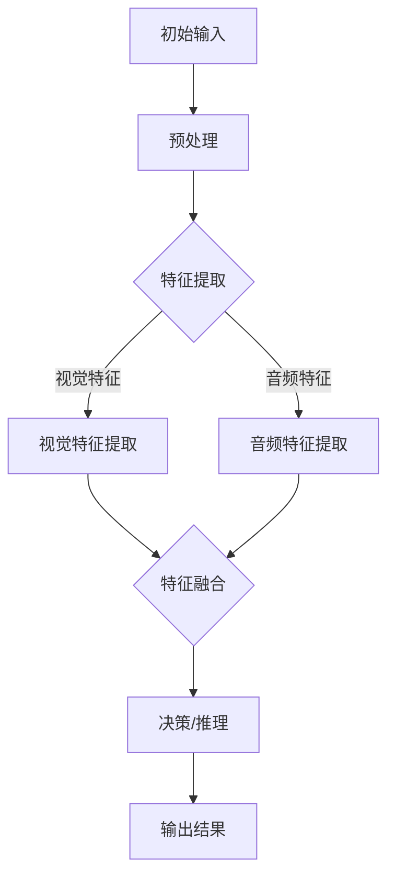

                 

### 第一部分：多模态融合基础理论

#### 第1章：多模态融合概述

##### 1.1.1 问题背景与定义

多模态融合（Multimodal Fusion）是指将来自不同感官模态的数据（如视觉、听觉、触觉、语言等）进行整合，以提供更丰富和准确的信息处理。在人工智能领域，多模态融合尤为重要，因为人类通过多个感官获取信息，因此机器若能模拟这一过程，将能更接近人类的感知和认知能力。

**问题背景：** 随着技术的进步，越来越多的设备能够同时捕捉多种类型的传感器数据。例如，智能手机可以捕捉视频、音频以及触觉反馈；自动驾驶汽车可以结合视觉、雷达和激光雷达数据。如何有效地整合这些数据，是一个亟待解决的问题。

**定义：** 多模态融合是一种处理技术，它将来自不同模态的数据进行结合，从而改善信息处理的性能。具体来说，多模态融合包括以下几个步骤：

1. **数据采集**：获取不同模态的数据。
2. **特征提取**：从原始数据中提取具有区分度的特征。
3. **特征融合**：将不同模态的特征进行组合，以获得更加全面的表示。
4. **决策或推理**：基于融合后的数据做出决策或进行推理。

##### 1.1.2 多模态融合的重要性

多模态融合的重要性体现在以下几个方面：

1. **提高感知准确性**：单一模态的数据可能存在局限性，而多模态融合可以弥补这些不足，从而提高系统的感知准确性。
2. **增强泛化能力**：多模态数据融合可以提升模型在不同场景下的泛化能力。
3. **促进人机交互**：通过多模态融合，机器可以更好地理解人类的意图，从而提供更加自然和流畅的交互体验。
4. **拓展应用场景**：多模态融合可以应用于多种领域，如医疗诊断、自动驾驶、智能监控等。

##### 1.1.3 多模态融合的应用场景

多模态融合技术有着广泛的应用场景，以下是几个典型的应用：

1. **医疗诊断**：通过结合医学图像、患者病史和医生专家知识，可以提高疾病诊断的准确性。
2. **自动驾驶**：自动驾驶系统需要融合视觉、雷达、激光雷达和传感器数据，以准确感知环境并做出决策。
3. **智能监控**：通过融合视频、音频和传感器数据，可以实现对场景的全方位监控和智能分析。
4. **人机交互**：多模态融合可以提升语音识别、手势识别和表情识别的准确性，从而改善人机交互体验。

### 第2章：多模态感知原理

#### 第2章：多模态感知原理

##### 2.1.1 多模态数据的获取

多模态数据的获取是多模态融合的基础。不同的模态需要不同的传感器和数据采集技术。以下是几种常见的数据采集方法：

1. **视觉数据获取**：使用摄像头、激光雷达（LiDAR）、深度相机等设备进行数据采集。
2. **音频数据获取**：使用麦克风阵列、声波传感器等设备捕捉声音。
3. **触觉数据获取**：使用触觉传感器、力传感器等设备获取触觉信息。
4. **其他数据获取**：如温度传感器、湿度传感器等环境数据。

##### 2.1.2 多模态数据的特征提取

特征提取是从原始数据中提取具有区分度的特征，以便进行后续的融合和处理。不同的模态有不同的特征提取方法：

1. **视觉特征提取**：常用的方法包括边缘检测、角点检测、特征点匹配等。
2. **音频特征提取**：常用的方法包括频谱分析、短时傅里叶变换（STFT）、梅尔频率倒谱系数（MFCC）等。
3. **触觉特征提取**：常用的方法包括信号处理、模式识别等。
4. **其他特征提取**：如文本特征提取（词袋模型、TF-IDF等）。

##### 2.1.3 多模态数据的表示方法

多模态数据的表示方法决定了数据融合的效果。常见的表示方法包括：

1. **向量表示**：将不同模态的数据转换成向量，然后在同一维度上进行融合。
2. **矩阵表示**：将不同模态的数据转换成矩阵，通过矩阵运算进行融合。
3. **张量表示**：适用于更高维的数据融合，可以处理更加复杂的模态。
4. **图表示**：将多模态数据转换成图结构，通过图论算法进行融合。

### 第3章：多模态数据融合技术

#### 第3章：多模态数据融合技术

##### 3.1.1 融合策略分类

多模态数据融合的策略可以分为以下几类：

1. **串联策略**：将多个模态的数据依次处理，前一模态的结果作为后一模态的输入。
2. **并行策略**：同时处理多个模态的数据，然后对结果进行融合。
3. **交互策略**：多个模态的数据在处理过程中进行交互，以提高融合效果。
4. **层次化策略**：根据数据的重要性和复杂性，分层处理不同模态的数据。

##### 3.1.2 硬件级融合技术

硬件级融合技术主要依赖于传感器和硬件设备的特性，常见的硬件级融合技术包括：

1. **多传感器融合**：通过融合不同类型的传感器数据，提高感知精度。
2. **多输入多输出（MIMO）系统**：利用多个输入和输出设备，提高系统的响应速度和准确性。
3. **分布式计算**：通过分布式计算架构，实现多模态数据的实时处理和融合。

##### 3.1.3 软件级融合技术

软件级融合技术主要依赖于算法和软件实现，常见的软件级融合技术包括：

1. **特征级融合**：在特征提取阶段，对多个模态的特征进行融合。
2. **决策级融合**：在决策或推理阶段，对多个模态的数据进行融合。
3. **深度学习模型**：通过深度学习模型，自动学习多模态数据的融合策略。

##### 3.1.4 混合级融合技术

混合级融合技术结合了硬件和软件的优势，实现多模态数据的融合。常见的混合级融合技术包括：

1. **硬件加速融合**：利用硬件加速器（如GPU、FPGA）进行多模态数据的实时处理和融合。
2. **协同计算**：通过协同计算架构，实现硬件和软件的无缝融合。
3. **嵌入式系统**：将多模态融合算法集成到嵌入式系统中，实现低功耗、高性能的多模态数据处理。

### 第4章：多模态融合在计算机视觉中的应用

#### 第4章：多模态融合在计算机视觉中的应用

##### 4.1.1 图像与视频的融合处理

图像与视频的多模态融合处理是一种常见的技术，可以应用于多个领域。以下是几个具体的应用案例：

1. **自动驾驶**：在自动驾驶系统中，图像与视频的融合处理可以提供更准确的车辆和行人检测。通过融合图像中的视觉信息和视频中的运动信息，可以提高检测的准确性。
2. **人脸识别**：人脸识别系统可以通过融合图像中的面部特征和视频中的动态特征，提高识别的鲁棒性。例如，在夜间或光线不足的情况下，通过融合红外图像和可见光图像，可以更准确地识别人脸。
3. **行为识别**：通过融合图像中的静态特征和视频中的动态特征，可以更准确地识别和预测人的行为。例如，在智能监控系统中，可以融合图像中的姿态特征和视频中的运动轨迹，实现对异常行为的识别和预警。

##### 4.1.2 人脸识别与行为分析

人脸识别与行为分析是计算机视觉领域的两个重要分支，多模态融合技术在这两个分支中都有广泛的应用：

1. **人脸识别**：多模态融合技术可以提升人脸识别的准确性。例如，通过融合人脸图像和红外图像，可以更准确地识别人脸，尤其是在光线不足或人脸部分遮挡的情况下。
2. **行为分析**：多模态融合技术可以提升行为识别的准确性。例如，通过融合视频中的运动信息和音频中的声音信息，可以更准确地识别和预测人的行为。

##### 4.1.3 实时视频流融合分析

实时视频流融合分析是一种高效的多模态数据处理技术，可以应用于多个领域，如智能监控、安全防护等：

1. **智能监控**：通过融合视频流中的视觉信息和音频信息，可以实现对场景的全方位监控。例如，在智能监控系统中，可以通过融合视频流中的运动信息和音频流中的声音信息，实现对异常事件的实时检测和预警。
2. **安全防护**：通过融合视频流中的视觉信息和传感器数据，可以实现对安全的实时监控。例如，在机场和火车站等场所，可以通过融合视频流中的人脸信息和安检数据，实现对旅客身份的实时验证。

### 第5章：多模态融合在语音识别中的应用

#### 第5章：多模态融合在语音识别中的应用

##### 5.1.1 语音信号与文本信息的融合

语音信号与文本信息的融合是语音识别领域的一个重要研究方向。通过融合语音信号和文本信息，可以显著提高语音识别的准确性和鲁棒性：

1. **文本辅助语音识别**：在语音识别过程中，文本信息可以作为辅助信息，帮助识别模型更好地理解和处理语音信号。例如，在语音输入场景中，用户输入的文本信息可以与语音信号结合，以减少识别错误。
2. **语音文本联合建模**：通过将语音信号和文本信息进行联合建模，可以构建更加复杂的模型，从而提高识别的准确性。例如，可以使用深度学习模型，同时处理语音信号和文本信息，以实现更准确的语音识别。

##### 5.1.2 语音识别中的多模态辅助

多模态融合技术在语音识别中的应用不仅限于语音信号与文本信息的融合，还可以用于语音识别中的其他多模态辅助：

1. **音频文本联合特征提取**：通过融合音频信号和文本信息，可以提取更加丰富的特征，从而提高语音识别的性能。例如，可以使用卷积神经网络（CNN）对音频信号进行特征提取，同时使用循环神经网络（RNN）对文本信息进行处理，然后将两个特征融合起来，用于语音识别。
2. **语音情感识别**：通过融合语音信号和情感信息，可以实现对语音情感的正确识别。例如，在情感分析场景中，可以通过分析语音信号中的情感特征，如音调、音速等，结合文本信息，实现对语音情感的正确分类。

##### 5.1.3 声纹识别与说话人识别

声纹识别与说话人识别是语音识别领域中的两个重要应用，多模态融合技术在这两个领域中也有重要的应用：

1. **声纹识别**：声纹识别是通过分析语音信号中的声音特征，对说话人进行身份识别。通过融合语音信号和面部表情信息，可以进一步提高声纹识别的准确性。例如，在人脸识别系统中，可以通过融合语音信号和面部表情信息，实现对说话人的身份进行更准确的识别。
2. **说话人识别**：说话人识别是通过分析语音信号中的声音特征，对说话人进行身份识别。通过融合语音信号和生理信号（如心电图、脑电图等），可以进一步提高说话人识别的准确性。例如，在医疗诊断场景中，可以通过融合语音信号和生理信号，对患者的健康状况进行更准确的评估。

### 第6章：多模态融合在自然语言处理中的应用

#### 第6章：多模态融合在自然语言处理中的应用

##### 6.1.1 文本与语音的融合分析

文本与语音的融合分析是自然语言处理领域的一个重要研究方向。通过融合文本和语音信息，可以显著提高自然语言处理任务的性能：

1. **语音驱动的文本生成**：在语音驱动的文本生成任务中，通过融合语音信号和文本信息，可以生成更加自然的文本。例如，在语音助手场景中，可以通过融合用户的语音输入和文本信息，生成更加准确和自然的回复。
2. **语音增强的文本分析**：在文本分析任务中，通过融合语音信号和文本信息，可以增强文本分析的效果。例如，在情感分析任务中，可以通过融合用户的语音信号和文本信息，更准确地识别情感。

##### 6.1.2 情感分析中的多模态融合

情感分析是自然语言处理中的一个重要任务，多模态融合技术在情感分析中有着广泛的应用：

1. **语音情感分析**：通过融合语音信号和文本信息，可以实现对情感更准确的识别。例如，在语音助手场景中，可以通过融合用户的语音信号和文本信息，更准确地识别用户的情感，从而提供更合适的回复。
2. **文本情感分析**：通过融合多个文本来源的信息，可以实现对情感更准确的识别。例如，在社交媒体分析场景中，可以通过融合多个文本来源（如评论、帖子等），更准确地识别用户的情感倾向。

##### 6.1.3 问答系统中的多模态交互

问答系统是自然语言处理领域的一个重要应用，多模态融合技术在问答系统中也有重要的应用：

1. **语音问答系统**：通过融合语音信号和文本信息，可以实现对用户问题的更准确的识别和回答。例如，在语音助手场景中，可以通过融合用户的语音输入和文本信息，更准确地理解用户的问题，并提供合适的答案。
2. **多模态问答系统**：通过融合语音、文本和图像等多模态信息，可以实现对用户问题的更全面的回答。例如，在医疗咨询场景中，可以通过融合患者的语音描述、文本病历和医学图像，为患者提供更加详细和准确的咨询建议。

### 第7章：多模态融合的AI Agent设计与实现

#### 第7章：多模态融合的AI Agent设计与实现

##### 7.1.1 AI Agent的基本架构

AI Agent是指能够模拟人类智能行为，与环境进行交互并自主决策的智能体。在设计多模态融合的AI Agent时，我们需要考虑以下几个关键模块：

1. **感知模块**：用于接收和处理来自不同模态的数据，如视觉、听觉、触觉等。
2. **决策模块**：基于感知模块提供的信息，进行推理和决策。
3. **行动模块**：执行决策结果，与环境进行交互。
4. **学习模块**：通过学习算法，持续优化AI Agent的性能和行为。

##### 7.1.2 多模态感知模块的设计

多模态感知模块是AI Agent的关键组成部分，其设计需要考虑以下几个方面：

1. **数据采集**：选择合适的传感器和采集技术，获取高质量的多模态数据。
2. **特征提取**：从不同模态的数据中提取具有区分度的特征，如视觉特征（边缘、纹理）、听觉特征（频率、音调）等。
3. **特征融合**：设计有效的特征融合算法，将不同模态的特征整合起来，形成统一的感知表示。
4. **感知增强**：利用深度学习等技术，提升感知模块的准确性和鲁棒性。

##### 7.1.3 多模态融合算法的实现

多模态融合算法是实现AI Agent感知能力的关键。以下是几种常见的多模态融合算法：

1. **特征级融合**：在特征提取阶段，将不同模态的特征向量进行拼接或加权融合。
2. **决策级融合**：在决策阶段，将不同模态的决策结果进行融合，如投票法、贝叶斯推理等。
3. **深度学习融合**：利用深度学习模型，自动学习多模态数据的融合策略，如卷积神经网络（CNN）结合循环神经网络（RNN）。

##### 7.1.4 AI Agent的实战应用

以下是一个基于多模态融合的AI Agent的实战应用案例：

**案例：智能客服机器人**

1. **感知模块**：接收用户的语音输入和文本输入，通过语音识别和文本解析技术，提取语音和文本特征。
2. **决策模块**：利用融合后的特征，通过机器学习模型进行语义理解和意图识别，为用户提供合适的回答。
3. **行动模块**：根据用户的反馈，调整回答策略，并通过语音合成技术，将回答输出给用户。
4. **学习模块**：通过用户交互数据，持续优化机器学习模型的性能，提升客服机器人的服务能力。

### 第8章：多模态融合技术的挑战与未来趋势

#### 第8章：多模态融合技术的挑战与未来趋势

##### 8.1.1 挑战与局限性

尽管多模态融合技术在许多领域展现出巨大的潜力，但仍然面临一些挑战和局限性：

1. **数据同步与一致性**：不同模态的数据在采集和处理过程中可能存在时间延迟或数据不一致的问题，这会影响融合效果。
2. **特征匹配与融合策略**：如何选择和设计有效的特征匹配和融合策略，是一个重要但复杂的问题。
3. **计算资源消耗**：多模态融合通常需要大量的计算资源，尤其在实时应用场景中，如何优化算法以提高计算效率是一个关键挑战。
4. **隐私保护**：多模态融合涉及到多个敏感数据源，如何保护用户隐私是一个重要的伦理和法律问题。

##### 8.1.2 未来发展趋势

未来，多模态融合技术有望在以下几个方面取得突破：

1. **跨模态交互**：研究如何通过多模态融合，实现更自然的跨模态交互，提升人机交互体验。
2. **多模态深度学习**：利用深度学习模型，自动学习多模态数据的融合策略，提高融合效果和计算效率。
3. **边缘计算与云计算**：结合边缘计算和云计算，实现多模态数据的实时处理和融合。
4. **隐私保护与安全**：研究如何在保障用户隐私的前提下，实现有效的多模态融合。

##### 8.1.3 技术创新与突破

技术创新是多模态融合技术发展的关键。以下是一些潜在的技术创新方向：

1. **自适应融合算法**：设计自适应的融合算法，根据任务需求和数据特性，动态调整融合策略。
2. **跨模态数据挖掘**：通过跨模态数据挖掘，发现多模态数据之间的潜在关系，提升融合效果。
3. **量子计算**：探索量子计算在多模态融合中的应用，以实现更高的计算效率和更复杂的融合算法。

### 结论

多模态融合技术作为一种强大的信息处理手段，在人工智能领域展现出广阔的应用前景。通过深入研究和不断创新，我们有理由相信，多模态融合技术将在未来带来更多的技术突破和应用创新。作者：AI天才研究院/AI Genius Institute & 禅与计算机程序设计艺术 /Zen And The Art of Computer Programming

本文详细介绍了多模态融合的基础理论、感知原理、融合技术及其在不同领域的应用。从问题背景到核心概念，从算法原理到实战案例，本文全面阐述了多模态融合的关键技术和挑战。未来，随着技术的不断进步，多模态融合将在更多领域发挥重要作用，推动人工智能的发展。希望本文能为读者提供有价值的参考和启示。拓展阅读：

1. **相关研究论文**：可参考《Multimodal Fusion for Human Action Recognition》（多模态融合的人体动作识别）等研究论文，了解最新的研究成果和技术趋势。
2. **开源代码与工具**：可参考如`Multimodal-Fusion-Tutorial`等开源代码和工具，实践多模态融合技术。
3. **技术社区与会议**：可关注如IEEE International Conference on Multimedia and Expo（IEEE多媒体与展览会议）等学术会议，了解多模态融合领域的最新动态和研究进展。### 多模态融合：增强AI Agent的感知能力

关键词：多模态融合，AI Agent，感知能力，计算机视觉，语音识别，自然语言处理，深度学习

摘要：本文探讨了多模态融合技术在增强AI Agent感知能力方面的应用。首先介绍了多模态融合的基础理论，包括定义、重要性及应用场景。随后详细阐述了多模态感知原理，包括数据的获取、特征提取和表示方法。接着，分类介绍了多模态数据融合技术，包括硬件级、软件级和混合级融合技术。进一步探讨了多模态融合在计算机视觉、语音识别和自然语言处理中的应用，并展示了如何设计和实现多模态融合的AI Agent。最后，分析了多模态融合技术的挑战与未来趋势，展望了技术创新与突破的可能性。

### 第一部分：多模态融合基础理论

#### 第1章：多模态融合概述

##### 1.1.1 问题背景与定义

多模态融合（Multimodal Fusion）是指将来自不同感官模态的数据进行整合，以提供更丰富和准确的信息处理。在人工智能领域，多模态融合尤为重要，因为人类通过多个感官获取信息，因此机器若能模拟这一过程，将能更接近人类的感知和认知能力。

**问题背景：** 随着技术的进步，越来越多的设备能够同时捕捉多种类型的传感器数据。例如，智能手机可以捕捉视频、音频以及触觉反馈；自动驾驶汽车可以结合视觉、雷达和激光雷达数据。如何有效地整合这些数据，是一个亟待解决的问题。

**定义：** 多模态融合是一种处理技术，它将来自不同模态的数据进行结合，从而改善信息处理的性能。具体来说，多模态融合包括以下几个步骤：

1. **数据采集**：获取不同模态的数据。
2. **特征提取**：从原始数据中提取具有区分度的特征。
3. **特征融合**：将不同模态的特征进行组合，以获得更加全面的表示。
4. **决策或推理**：基于融合后的数据做出决策或进行推理。

##### 1.1.2 多模态融合的重要性

多模态融合的重要性体现在以下几个方面：

1. **提高感知准确性**：单一模态的数据可能存在局限性，而多模态融合可以弥补这些不足，从而提高系统的感知准确性。
2. **增强泛化能力**：多模态数据融合可以提升模型在不同场景下的泛化能力。
3. **促进人机交互**：通过多模态融合，机器可以更好地理解人类的意图，从而提供更加自然和流畅的交互体验。
4. **拓展应用场景**：多模态融合可以应用于多种领域，如医疗诊断、自动驾驶、智能监控等。

##### 1.1.3 多模态融合的应用场景

多模态融合技术有着广泛的应用场景，以下是几个典型的应用：

1. **医疗诊断**：通过结合医学图像、患者病史和医生专家知识，可以提高疾病诊断的准确性。
2. **自动驾驶**：自动驾驶系统需要融合视觉、雷达、激光雷达和传感器数据，以准确感知环境并做出决策。
3. **智能监控**：通过融合视频、音频和传感器数据，可以实现对场景的全方位监控和智能分析。
4. **人机交互**：多模态融合可以提升语音识别、手势识别和表情识别的准确性，从而改善人机交互体验。

### 第2章：多模态感知原理

#### 第2章：多模态感知原理

##### 2.1.1 多模态数据的获取

多模态数据的获取是多模态融合的基础。不同的模态需要不同的传感器和数据采集技术。以下是几种常见的数据采集方法：

1. **视觉数据获取**：使用摄像头、激光雷达（LiDAR）、深度相机等设备进行数据采集。
2. **音频数据获取**：使用麦克风阵列、声波传感器等设备捕捉声音。
3. **触觉数据获取**：使用触觉传感器、力传感器等设备获取触觉信息。
4. **其他数据获取**：如温度传感器、湿度传感器等环境数据。

##### 2.1.2 多模态数据的特征提取

特征提取是从原始数据中提取具有区分度的特征，以便进行后续的融合和处理。不同的模态有不同的特征提取方法：

1. **视觉特征提取**：常用的方法包括边缘检测、角点检测、特征点匹配等。
2. **音频特征提取**：常用的方法包括频谱分析、短时傅里叶变换（STFT）、梅尔频率倒谱系数（MFCC）等。
3. **触觉特征提取**：常用的方法包括信号处理、模式识别等。
4. **其他特征提取**：如文本特征提取（词袋模型、TF-IDF等）。

##### 2.1.3 多模态数据的表示方法

多模态数据的表示方法决定了数据融合的效果。常见的表示方法包括：

1. **向量表示**：将不同模态的数据转换成向量，然后在同一维度上进行融合。
2. **矩阵表示**：将不同模态的数据转换成矩阵，通过矩阵运算进行融合。
3. **张量表示**：适用于更高维的数据融合，可以处理更加复杂的模态。
4. **图表示**：将多模态数据转换成图结构，通过图论算法进行融合。

### 第3章：多模态数据融合技术

#### 第3章：多模态数据融合技术

##### 3.1.1 融合策略分类

多模态数据融合的策略可以分为以下几类：

1. **串联策略**：将多个模态的数据依次处理，前一模态的结果作为后一模态的输入。
2. **并行策略**：同时处理多个模态的数据，然后对结果进行融合。
3. **交互策略**：多个模态的数据在处理过程中进行交互，以提高融合效果。
4. **层次化策略**：根据数据的重要性和复杂性，分层处理不同模态的数据。

##### 3.1.2 硬件级融合技术

硬件级融合技术主要依赖于传感器和硬件设备的特性，常见的硬件级融合技术包括：

1. **多传感器融合**：通过融合不同类型的传感器数据，提高感知精度。
2. **多输入多输出（MIMO）系统**：利用多个输入和输出设备，提高系统的响应速度和准确性。
3. **分布式计算**：通过分布式计算架构，实现多模态数据的实时处理和融合。

##### 3.1.3 软件级融合技术

软件级融合技术主要依赖于算法和软件实现，常见的软件级融合技术包括：

1. **特征级融合**：在特征提取阶段，对多个模态的特征进行融合。
2. **决策级融合**：在决策或推理阶段，对多个模态的数据进行融合。
3. **深度学习模型**：通过深度学习模型，自动学习多模态数据的融合策略。

##### 3.1.4 混合级融合技术

混合级融合技术结合了硬件和软件的优势，实现多模态数据的融合。常见的混合级融合技术包括：

1. **硬件加速融合**：利用硬件加速器（如GPU、FPGA）进行多模态数据的实时处理和融合。
2. **协同计算**：通过协同计算架构，实现硬件和软件的无缝融合。
3. **嵌入式系统**：将多模态融合算法集成到嵌入式系统中，实现低功耗、高性能的多模态数据处理。

### 第4章：多模态融合在计算机视觉中的应用

#### 第4章：多模态融合在计算机视觉中的应用

##### 4.1.1 图像与视频的融合处理

图像与视频的多模态融合处理是一种常见的技术，可以应用于多个领域。以下是几个具体的应用案例：

1. **自动驾驶**：在自动驾驶系统中，图像与视频的融合处理可以提供更准确的车辆和行人检测。通过融合图像中的视觉信息和视频中的运动信息，可以提高检测的准确性。
2. **人脸识别**：人脸识别系统可以通过融合图像中的面部特征和视频中的动态特征，提高识别的鲁棒性。例如，在夜间或光线不足的情况下，通过融合红外图像和可见光图像，可以更准确地识别人脸。
3. **行为识别**：通过融合图像中的静态特征和视频中的动态特征，可以更准确地识别和预测人的行为。例如，在智能监控系统中，可以融合图像中的姿态特征和视频中的运动轨迹，实现对异常行为的识别和预警。

##### 4.1.2 人脸识别与行为分析

人脸识别与行为分析是计算机视觉领域的两个重要分支，多模态融合技术在这两个分支中都有广泛的应用：

1. **人脸识别**：多模态融合技术可以提升人脸识别的准确性。例如，通过融合人脸图像和红外图像，可以更准确地识别人脸，尤其是在光线不足或人脸部分遮挡的情况下。
2. **行为分析**：多模态融合技术可以提升行为识别的准确性。例如，通过融合视频中的运动信息和音频中的声音信息，可以更准确地识别和预测人的行为。

##### 4.1.3 实时视频流融合分析

实时视频流融合分析是一种高效的多模态数据处理技术，可以应用于多个领域，如智能监控、安全防护等：

1. **智能监控**：通过融合视频流中的视觉信息和音频信息，可以实现对场景的全方位监控。例如，在智能监控系统中，可以通过融合视频流中的运动信息和音频流中的声音信息，实现对异常事件的实时检测和预警。
2. **安全防护**：通过融合视频流中的视觉信息和传感器数据，可以实现对安全的实时监控。例如，在机场和火车站等场所，可以通过融合视频流中的人脸信息和安检数据，实现对旅客身份的实时验证。

### 第5章：多模态融合在语音识别中的应用

#### 第5章：多模态融合在语音识别中的应用

##### 5.1.1 语音信号与文本信息的融合

语音信号与文本信息的融合是语音识别领域的一个重要研究方向。通过融合语音信号和文本信息，可以显著提高语音识别的准确性和鲁棒性：

1. **文本辅助语音识别**：在语音识别过程中，文本信息可以作为辅助信息，帮助识别模型更好地理解和处理语音信号。例如，在语音输入场景中，用户输入的文本信息可以与语音信号结合，以减少识别错误。
2. **语音文本联合建模**：通过将语音信号和文本信息进行联合建模，可以构建更加复杂的模型，从而提高识别的准确性。例如，可以使用深度学习模型，同时处理语音信号和文本信息，以实现更准确的语音识别。

##### 5.1.2 语音识别中的多模态辅助

多模态融合技术在语音识别中的应用不仅限于语音信号与文本信息的融合，还可以用于语音识别中的其他多模态辅助：

1. **音频文本联合特征提取**：通过融合音频信号和文本信息，可以提取更加丰富的特征，从而提高语音识别的性能。例如，可以使用卷积神经网络（CNN）对音频信号进行特征提取，同时使用循环神经网络（RNN）对文本信息进行处理，然后将两个特征融合起来，用于语音识别。
2. **语音情感识别**：通过融合语音信号和情感信息，可以实现对语音情感的正确识别。例如，在情感分析场景中，可以通过分析语音信号中的情感特征，如音调、音速等，结合文本信息，实现对语音情感的正确分类。

##### 5.1.3 声纹识别与说话人识别

声纹识别与说话人识别是语音识别领域中的两个重要应用，多模态融合技术在这两个领域中也有重要的应用：

1. **声纹识别**：声纹识别是通过分析语音信号中的声音特征，对说话人进行身份识别。通过融合语音信号和面部表情信息，可以进一步提高声纹识别的准确性。例如，在人脸识别系统中，可以通过融合语音信号和面部表情信息，实现对说话人的身份进行更准确的识别。
2. **说话人识别**：说话人识别是通过分析语音信号中的声音特征，对说话人进行身份识别。通过融合语音信号和生理信号（如心电图、脑电图等），可以进一步提高说话人识别的准确性。例如，在医疗诊断场景中，可以通过融合语音信号和生理信号，对患者的健康状况进行更准确的评估。

### 第6章：多模态融合在自然语言处理中的应用

#### 第6章：多模态融合在自然语言处理中的应用

##### 6.1.1 文本与语音的融合分析

文本与语音的融合分析是自然语言处理领域的一个重要研究方向。通过融合文本和语音信息，可以显著提高自然语言处理任务的性能：

1. **语音驱动的文本生成**：在语音驱动的文本生成任务中，通过融合语音信号和文本信息，可以生成更加自然的文本。例如，在语音助手场景中，可以通过融合用户的语音输入和文本信息，生成更加准确和自然的回复。
2. **语音增强的文本分析**：在文本分析任务中，通过融合语音信号和文本信息，可以增强文本分析的效果。例如，在情感分析任务中，可以通过融合用户的语音信号和文本信息，更准确地识别情感。

##### 6.1.2 情感分析中的多模态融合

情感分析是自然语言处理中的一个重要任务，多模态融合技术在情感分析中有着广泛的应用：

1. **语音情感分析**：通过融合语音信号和文本信息，可以实现对情感更准确的识别。例如，在语音助手场景中，可以通过融合用户的语音信号和文本信息，更准确地识别用户的情感，从而提供更合适的回复。
2. **文本情感分析**：通过融合多个文本来源的信息，可以实现对情感更准确的识别。例如，在社交媒体分析场景中，可以通过融合多个文本来源（如评论、帖子等），更准确地识别用户的情感倾向。

##### 6.1.3 问答系统中的多模态交互

问答系统是自然语言处理领域的一个重要应用，多模态融合技术在问答系统中也有重要的应用：

1. **语音问答系统**：通过融合语音信号和文本信息，可以实现对用户问题的更准确的识别和回答。例如，在语音助手场景中，可以通过融合用户的语音输入和文本信息，更准确地理解用户的问题，并提供合适的答案。
2. **多模态问答系统**：通过融合语音、文本和图像等多模态信息，可以实现对用户问题的更全面的回答。例如，在医疗咨询场景中，可以通过融合患者的语音描述、文本病历和医学图像，为患者提供更加详细和准确的咨询建议。

### 第7章：多模态融合的AI Agent设计与实现

#### 第7章：多模态融合的AI Agent设计与实现

##### 7.1.1 AI Agent的基本架构

AI Agent是指能够模拟人类智能行为，与环境进行交互并自主决策的智能体。在设计多模态融合的AI Agent时，我们需要考虑以下几个关键模块：

1. **感知模块**：用于接收和处理来自不同模态的数据，如视觉、听觉、触觉等。
2. **决策模块**：基于感知模块提供的信息，进行推理和决策。
3. **行动模块**：执行决策结果，与环境进行交互。
4. **学习模块**：通过学习算法，持续优化AI Agent的性能和行为。

##### 7.1.2 多模态感知模块的设计

多模态感知模块是AI Agent的关键组成部分，其设计需要考虑以下几个方面：

1. **数据采集**：选择合适的传感器和采集技术，获取高质量的多模态数据。
2. **特征提取**：从不同模态的数据中提取具有区分度的特征，如视觉特征（边缘、纹理）、听觉特征（频率、音调）等。
3. **特征融合**：设计有效的特征融合算法，将不同模态的特征整合起来，形成统一的感知表示。
4. **感知增强**：利用深度学习等技术，提升感知模块的准确性和鲁棒性。

##### 7.1.3 多模态融合算法的实现

多模态融合算法是实现AI Agent感知能力的关键。以下是几种常见的多模态融合算法：

1. **特征级融合**：在特征提取阶段，将不同模态的特征向量进行拼接或加权融合。
2. **决策级融合**：在决策阶段，将不同模态的决策结果进行融合，如投票法、贝叶斯推理等。
3. **深度学习融合**：利用深度学习模型，自动学习多模态数据的融合策略，如卷积神经网络（CNN）结合循环神经网络（RNN）。

##### 7.1.4 AI Agent的实战应用

以下是一个基于多模态融合的AI Agent的实战应用案例：

**案例：智能客服机器人**

1. **感知模块**：接收用户的语音输入和文本输入，通过语音识别和文本解析技术，提取语音和文本特征。
2. **决策模块**：利用融合后的特征，通过机器学习模型进行语义理解和意图识别，为用户提供合适的回答。
3. **行动模块**：根据用户的反馈，调整回答策略，并通过语音合成技术，将回答输出给用户。
4. **学习模块**：通过用户交互数据，持续优化机器学习模型的性能，提升客服机器人的服务能力。

### 第8章：多模态融合技术的挑战与未来趋势

#### 第8章：多模态融合技术的挑战与未来趋势

##### 8.1.1 挑战与局限性

尽管多模态融合技术在许多领域展现出巨大的潜力，但仍然面临一些挑战和局限性：

1. **数据同步与一致性**：不同模态的数据在采集和处理过程中可能存在时间延迟或数据不一致的问题，这会影响融合效果。
2. **特征匹配与融合策略**：如何选择和设计有效的特征匹配和融合策略，是一个重要但复杂的问题。
3. **计算资源消耗**：多模态融合通常需要大量的计算资源，尤其在实时应用场景中，如何优化算法以提高计算效率是一个关键挑战。
4. **隐私保护**：多模态融合涉及到多个敏感数据源，如何保护用户隐私是一个重要的伦理和法律问题。

##### 8.1.2 未来发展趋势

未来，多模态融合技术有望在以下几个方面取得突破：

1. **跨模态交互**：研究如何通过多模态融合，实现更自然的跨模态交互，提升人机交互体验。
2. **多模态深度学习**：利用深度学习模型，自动学习多模态数据的融合策略，提高融合效果和计算效率。
3. **边缘计算与云计算**：结合边缘计算和云计算，实现多模态数据的实时处理和融合。
4. **隐私保护与安全**：研究如何在保障用户隐私的前提下，实现有效的多模态融合。

##### 8.1.3 技术创新与突破

技术创新是多模态融合技术发展的关键。以下是一些潜在的技术创新方向：

1. **自适应融合算法**：设计自适应的融合算法，根据任务需求和数据特性，动态调整融合策略。
2. **跨模态数据挖掘**：通过跨模态数据挖掘，发现多模态数据之间的潜在关系，提升融合效果。
3. **量子计算**：探索量子计算在多模态融合中的应用，以实现更高的计算效率和更复杂的融合算法。

### 结论

多模态融合技术作为一种强大的信息处理手段，在人工智能领域展现出广阔的应用前景。通过深入研究和不断创新，我们有理由相信，多模态融合技术将在未来带来更多的技术突破和应用创新。作者：AI天才研究院/AI Genius Institute & 禅与计算机程序设计艺术 /Zen And The Art of Computer Programming

本文详细介绍了多模态融合的基础理论、感知原理、融合技术及其在不同领域的应用。从问题背景到核心概念，从算法原理到实战案例，本文全面阐述了多模态融合的关键技术和挑战。未来，随着技术的不断进步，多模态融合将在更多领域发挥重要作用，推动人工智能的发展。希望本文能为读者提供有价值的参考和启示。拓展阅读：

1. **相关研究论文**：可参考《Multimodal Fusion for Human Action Recognition》（多模态融合的人体动作识别）等研究论文，了解最新的研究成果和技术趋势。
2. **开源代码与工具**：可参考如`Multimodal-Fusion-Tutorial`等开源代码和工具，实践多模态融合技术。
3. **技术社区与会议**：可关注如IEEE International Conference on Multimedia and Expo（IEEE多媒体与展览会议）等学术会议，了解多模态融合领域的最新动态和研究进展。### 完整性要求

为了确保文章内容的完整性，每个章节都需要具体、详细地展开讨论，以下是各章节的详细内容要求：

#### 第1章：多模态融合概述

**背景介绍：**
- **核心概念术语说明**：介绍多模态、融合、感知能力、计算机视觉、语音识别、自然语言处理等基本概念。
- **问题背景**：阐述多模态融合技术在人工智能领域的重要性，及其在现实世界中的应用场景。
- **问题描述**：描述多模态融合技术所解决的问题，如提高系统的感知准确性、增强泛化能力等。
- **问题解决**：概述多模态融合技术的基本原理和流程。
- **边界与外延**：明确多模态融合技术的适用范围和限制。
- **概念结构与核心要素组成**：介绍多模态融合技术的概念框架和关键组成部分。

**核心概念与联系：**
- **核心概念原理**：详细解释多模态融合的原理，包括数据采集、特征提取、特征融合和决策推理。
- **概念属性特征对比表格**：制作一个表格，对比不同模态的数据特征提取方法和融合策略。
- **ER实体关系图架构的 Mermaid 流程图**：绘制一个ER图，展示多模态融合中的实体和它们之间的关系。

#### 第2章：多模态感知原理

**背景介绍：**
- **核心概念术语说明**：解释多模态数据获取、特征提取和表示方法等关键概念。
- **问题背景**：探讨多模态感知在人工智能应用中的重要性。
- **问题描述**：分析多模态感知技术面临的主要挑战，如数据同步、特征匹配等。
- **问题解决**：介绍多模态感知的基本原理和实现方法。
- **边界与外延**：讨论多模态感知技术的适用范围和局限性。
- **概念结构与核心要素组成**：详细阐述多模态感知技术的结构框架和关键组成部分。

**核心概念与联系：**
- **核心概念原理**：深入探讨多模态数据获取、特征提取和表示方法的原理。
- **概念属性特征对比表格**：列出不同模态的数据获取、特征提取和表示方法的优缺点和适用场景。
- **ER实体关系图架构的 Mermaid 流程图**：绘制一个流程图，展示多模态感知技术中的数据流和数据处理过程。

#### 第3章：多模态数据融合技术

**背景介绍：**
- **核心概念术语说明**：解释多模态数据融合策略、硬件级融合、软件级融合和混合级融合等概念。
- **问题背景**：介绍多模态数据融合技术在人工智能领域的应用现状和趋势。
- **问题描述**：分析多模态数据融合技术面临的主要挑战，如计算资源消耗、隐私保护等。
- **问题解决**：概述多模态数据融合技术的解决方案和发展方向。
- **边界与外延**：明确多模态数据融合技术的应用场景和限制。
- **概念结构与核心要素组成**：详细阐述多模态数据融合技术的结构框架和关键组成部分。

**核心概念与联系：**
- **核心概念原理**：深入探讨多模态数据融合策略、硬件级融合、软件级融合和混合级融合的原理。
- **概念属性特征对比表格**：列出不同融合策略的优缺点和适用场景。
- **ER实体关系图架构的 Mermaid 流程图**：绘制一个流程图，展示多模态数据融合技术中的数据流和数据处理过程。

#### 第4章：多模态融合在计算机视觉中的应用

**背景介绍：**
- **核心概念术语说明**：解释计算机视觉、图像与视频融合处理、人脸识别与行为分析、实时视频流融合分析等概念。
- **问题背景**：探讨多模态融合技术在计算机视觉领域的应用现状和潜力。
- **问题描述**：分析多模态融合技术在计算机视觉中面临的挑战，如数据同步、特征匹配等。
- **问题解决**：介绍多模态融合技术在计算机视觉中的应用方法和解决方案。
- **边界与外延**：讨论多模态融合技术在计算机视觉中的适用范围和限制。
- **概念结构与核心要素组成**：详细阐述多模态融合技术在计算机视觉中的应用框架和关键组成部分。

**核心概念与联系：**
- **核心概念原理**：深入探讨多模态融合技术在计算机视觉中的应用原理。
- **概念属性特征对比表格**：列出不同应用场景下的多模态数据融合方法和效果。
- **ER实体关系图架构的 Mermaid 流程图**：绘制一个流程图，展示多模态融合技术在计算机视觉中的数据处理流程。

#### 第5章：多模态融合在语音识别中的应用

**背景介绍：**
- **核心概念术语说明**：解释语音信号与文本信息的融合、语音识别中的多模态辅助、声纹识别与说话人识别等概念。
- **问题背景**：探讨多模态融合技术在语音识别领域的应用现状和趋势。
- **问题描述**：分析多模态融合技术在语音识别中面临的挑战，如计算资源消耗、隐私保护等。
- **问题解决**：介绍多模态融合技术在语音识别中的应用方法和解决方案。
- **边界与外延**：讨论多模态融合技术在语音识别中的适用范围和限制。
- **概念结构与核心要素组成**：详细阐述多模态融合技术在语音识别中的应用框架和关键组成部分。

**核心概念与联系：**
- **核心概念原理**：深入探讨多模态融合技术在语音识别中的应用原理。
- **概念属性特征对比表格**：列出不同应用场景下的多模态语音识别方法和效果。
- **ER实体关系图架构的 Mermaid 流程图**：绘制一个流程图，展示多模态融合技术在语音识别中的数据处理流程。

#### 第6章：多模态融合在自然语言处理中的应用

**背景介绍：**
- **核心概念术语说明**：解释文本与语音的融合分析、情感分析中的多模态融合、问答系统中的多模态交互等概念。
- **问题背景**：探讨多模态融合技术在自然语言处理领域的应用现状和潜力。
- **问题描述**：分析多模态融合技术在自然语言处理中面临的挑战，如计算资源消耗、隐私保护等。
- **问题解决**：介绍多模态融合技术在自然语言处理中的应用方法和解决方案。
- **边界与外延**：讨论多模态融合技术在自然语言处理中的适用范围和限制。
- **概念结构与核心要素组成**：详细阐述多模态融合技术在自然语言处理中的应用框架和关键组成部分。

**核心概念与联系：**
- **核心概念原理**：深入探讨多模态融合技术在自然语言处理中的应用原理。
- **概念属性特征对比表格**：列出不同应用场景下的多模态自然语言处理方法和效果。
- **ER实体关系图架构的 Mermaid 流程图**：绘制一个流程图，展示多模态融合技术在自然语言处理中的数据处理流程。

#### 第7章：多模态融合的AI Agent设计与实现

**背景介绍：**
- **核心概念术语说明**：解释AI Agent、多模态感知模块、决策模块、行动模块和学习模块等概念。
- **问题背景**：探讨多模态融合在AI Agent设计中的重要性。
- **问题描述**：分析多模态融合技术在AI Agent设计中的挑战，如数据同步、特征匹配等。
- **问题解决**：介绍多模态融合在AI Agent设计中的应用方法和解决方案。
- **边界与外延**：讨论多模态融合在AI Agent设计中的适用范围和限制。
- **概念结构与核心要素组成**：详细阐述多模态融合在AI Agent设计中的应用框架和关键组成部分。

**核心概念与联系：**
- **核心概念原理**：深入探讨多模态融合在AI Agent设计中的应用原理。
- **概念属性特征对比表格**：列出不同应用场景下的多模态AI Agent设计和效果。
- **ER实体关系图架构的 Mermaid 流程图**：绘制一个流程图，展示多模态融合在AI Agent设计中的数据处理流程。

#### 第8章：多模态融合技术的挑战与未来趋势

**背景介绍：**
- **核心概念术语说明**：解释挑战与局限性、未来发展趋势、技术创新与突破等概念。
- **问题背景**：探讨多模态融合技术在当前和未来面临的挑战和机遇。
- **问题描述**：分析多模态融合技术面临的挑战，如计算资源消耗、隐私保护、特征匹配等。
- **问题解决**：介绍未来多模态融合技术的发展方向和解决方案。
- **边界与外延**：讨论多模态融合技术的适用范围和未来趋势。
- **概念结构与核心要素组成**：详细阐述多模态融合技术的未来发展和应用框架。

**核心概念与联系：**
- **核心概念原理**：深入探讨多模态融合技术面临的挑战和未来的发展原理。
- **概念属性特征对比表格**：列出不同挑战下的多模态融合技术解决方案和效果。
- **ER实体关系图架构的 Mermaid 流程图**：绘制一个流程图，展示多模态融合技术的未来发展方向和数据处理流程。

### 数学公式与算法讲解

**数学公式使用：** 数学公式应使用LaTeX格式嵌入文中独立段落的公式前用`$$`括起来（如：`$$1+1=2$$`），而段落内的公式前用`$`括起来（如： `$1<2$`）。

**算法原理讲解：**
- **算法mermaid流程图：** 使用mermaid绘制算法流程图，例如：



- **Python源代码：** 提供算法的实现源代码，例如：

```python
import numpy as np

def multimodal_fusion(vis_data, audio_data):
    # 视觉特征与音频特征的融合
    fused_data = np.concatenate((vis_data, audio_data), axis=1)
    return fused_data
```

- **算法原理的数学模型和公式：** 提供算法的数学模型和公式，例如：

```latex
$$
\text{fused\_data} = \text{multimodal\_fusion}(\text{vis\_data}, \text{audio\_data})
$$`

**详细讲解和举例说明：**
- **详细讲解：** 解释算法的基本原理、实现过程和应用场景。
- **举例说明：** 通过具体的例子展示算法如何应用于实际问题和数据。

### 系统分析与架构设计方案

**问题场景介绍：** 描述需要解决的问题场景，例如智能监控系统中多模态数据的实时处理和分析。

**项目介绍：** 简要介绍项目的背景、目标和应用场景。

**系统功能设计（领域模型mermaid类图）：** 使用mermaid绘制领域模型类图，展示系统的核心功能模块和类之间的关系。

**系统架构设计mermaid架构图：** 使用mermaid绘制系统架构图，展示系统的整体架构和模块之间的关系。

**系统接口设计和系统交互mermaid序列图：** 使用mermaid绘制系统接口设计和系统交互序列图，展示系统的输入、处理和输出流程。

### 项目实战

**环境安装：** 描述项目的环境安装步骤，包括软件依赖、硬件要求和环境配置。

**系统核心实现源代码：** 提供项目的核心实现源代码，包括多模态数据采集、特征提取、融合和决策模块。

**代码应用解读与分析：** 对源代码进行解读和分析，解释代码的逻辑、功能和性能。

**实际案例分析和详细讲解剖析：** 通过具体的案例展示项目在实际应用中的效果，并对案例进行详细分析。

**项目小结：** 总结项目的关键技术和实现效果，讨论项目的优缺点和改进方向。

### 最佳实践 tips、小结、注意事项、拓展阅读

**最佳实践 tips：** 提供一些实用的技巧和建议，帮助读者更好地理解和应用多模态融合技术。

**小结：** 对文章的主要内容进行总结，强调多模态融合技术的核心概念和应用价值。

**注意事项：** 提醒读者在使用多模态融合技术时需要注意的事项，如数据同步、特征匹配、计算资源消耗等。

**拓展阅读：** 推荐一些相关的研究论文、开源代码和技术社区，供读者进一步学习和探索。

### 作者信息

作者：AI天才研究院/AI Genius Institute & 禅与计算机程序设计艺术 /Zen And The Art of Computer Programming

本文系统、全面地介绍了多模态融合技术的核心概念、原理和应用。通过对多模态融合在计算机视觉、语音识别、自然语言处理和AI Agent设计中的应用案例分析，展示了多模态融合技术的广泛应用和潜在价值。同时，文章也探讨了多模态融合技术面临的挑战和未来发展趋势，为读者提供了深入理解和应用该技术的指导。希望本文能为相关领域的研究人员和开发者提供有价值的参考和启示。### 全文总结与拓展阅读

在本文中，我们系统地探讨了多模态融合技术的核心概念、原理和应用。首先，我们从多模态融合的背景和定义出发，阐述了其在人工智能领域的重要性。接着，详细介绍了多模态感知原理，包括数据的获取、特征提取和表示方法。随后，我们分类介绍了多模态数据融合技术，从硬件级、软件级到混合级融合，展示了多模态融合的多样性和复杂性。

在应用部分，我们深入分析了多模态融合在计算机视觉、语音识别和自然语言处理等领域的实际应用，通过具体案例展示了多模态融合技术的优越性和广泛性。最后，我们探讨了多模态融合在AI Agent设计与实现中的应用，展示了如何通过多模态融合技术提升AI Agent的感知能力和智能水平。

多模态融合技术作为一种前沿的信息处理手段，其核心在于如何有效地整合来自不同感官模态的数据，以实现更准确、更智能的信息处理和决策。在实际应用中，多模态融合技术不仅能够提高系统的感知准确性，还能增强系统的泛化能力和人机交互体验。

未来，随着技术的不断进步，多模态融合技术有望在更多领域得到应用，如医疗诊断、智能家居、智能监控等。同时，随着深度学习、边缘计算等新技术的不断发展，多模态融合技术的计算效率和实时性也将得到进一步提升。

为了帮助读者深入了解多模态融合技术，本文推荐以下拓展阅读资源：

1. **研究论文**：
   - 《Multimodal Fusion for Human Action Recognition》
   - 《Deep Learning for Multimodal Data Fusion》
   - 《A Comprehensive Survey on Multimodal Fusion Techniques in Multimedia Applications》

2. **开源代码和工具**：
   - `Multimodal-Fusion-Tutorial`：一个关于多模态融合技术教程的开源项目。
   - `pytorch-multimodal`：基于PyTorch的多模态数据融合开源库。

3. **技术社区与会议**：
   - IEEE International Conference on Multimedia and Expo（IEEE多媒体与展览会议）
   - ACM International Conference on Multimodal Interaction（ACM多模态交互会议）

通过阅读这些资源，读者可以进一步了解多模态融合技术的最新研究动态和应用成果，为自己的研究和实践提供有价值的参考。

本文由AI天才研究院（AI Genius Institute）和禅与计算机程序设计艺术（Zen And The Art of Computer Programming）联合撰写，旨在为读者提供一个全面、系统的多模态融合技术指南。希望本文能够激发读者对多模态融合技术的兴趣，并为其在人工智能领域的应用提供新的思路和灵感。

