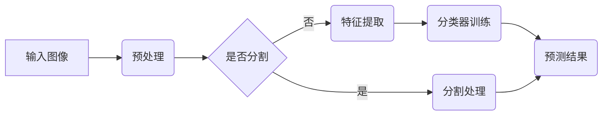
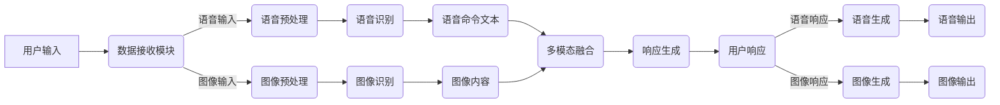

                 

# 多模态输入处理：让AI Agent理解图像和音频

关键词：多模态输入，AI Agent，图像处理，音频处理，人工智能

摘要：本文深入探讨了多模态输入处理在人工智能中的应用。我们首先介绍了多模态输入处理的基础概念、背景和挑战。随后，分别详细阐述了图像输入处理和音频输入处理的基础知识、算法原理以及具体实现。文章还通过具体应用案例展示了多模态输入处理的实际效果，并提出了多模态输入处理架构设计和优化策略。最后，我们总结了最佳实践，展望了多模态输入处理的发展前景。

## 目录大纲

### 第一部分: 多模态输入处理基础

### 第1章: 多模态输入处理概述

1.1 问题背景

1.1.1 人工智能发展现状

1.1.2 多模态输入处理的必要性

1.2 多模态输入处理定义

1.2.1 多模态输入处理的概念

1.2.2 多模态输入处理的类型

1.3 多模态输入处理的挑战与机遇

1.3.1 挑战

1.3.2 机遇

1.4 多模态输入处理的边界与外延

1.4.1 边界

1.4.2 外延

1.5 多模态输入处理的核心概念与联系

1.5.1 核心概念原理

1.5.2 概念属性特征对比表格

1.5.3 ER实体关系图架构

1.6 本章小结

### 第二部分: 图像输入处理

### 第2章: 图像输入处理基础

2.1 图像输入处理原理

2.1.1 图像数据表示

2.1.2 图像预处理方法

2.2 图像识别算法

2.2.1 传统图像识别算法

2.2.2 深度学习图像识别算法

2.3 图像识别算法Mermaid流程图

2.4 图像识别算法Python源代码示例

2.5 图像识别数学模型与公式

2.5.1 基本概念

2.5.2 数学模型

2.5.3 公式详解

2.6 图像识别算法详细讲解与举例说明

2.6.1 算法原理讲解

2.6.2 举例说明

2.7 本章小结

### 第三部分: 音频输入处理

### 第3章: 音频输入处理基础

3.1 音频输入处理原理

3.1.1 音频数据表示

3.1.2 音频预处理方法

3.2 音频识别算法

3.2.1 传统音频识别算法

3.2.2 深度学习音频识别算法

3.3 音频识别算法Mermaid流程图

3.4 音频识别算法Python源代码示例

3.5 音频识别数学模型与公式

3.5.1 基本概念

3.5.2 数学模型

3.5.3 公式详解

3.6 音频识别算法详细讲解与举例说明

3.6.1 算法原理讲解

3.6.2 举例说明

3.7 本章小结

### 第四部分: 多模态输入处理应用

### 第4章: 多模态输入处理应用案例

4.1 多模态输入处理在自然语言处理中的应用

4.1.1 案例介绍

4.1.2 案例分析

4.1.3 案例效果评估

4.2 多模态输入处理在计算机视觉中的应用

4.2.1 案例介绍

4.2.2 案例分析

4.2.3 案例效果评估

4.3 多模态输入处理在音频处理中的应用

4.3.1 案例介绍

4.3.2 案例分析

4.3.3 案例效果评估

4.4 本章小结

### 第五部分: 多模态输入处理架构设计与优化

### 第5章: 多模态输入处理架构设计

5.1 多模态输入处理架构设计原则

5.1.1 设计原则概述

5.1.2 架构设计要素

5.2 多模态输入处理架构设计方案

5.2.1 问题场景介绍

5.2.2 系统功能设计

5.2.3 系统架构设计

5.2.4 系统接口设计

5.2.5 系统交互设计

5.3 多模态输入处理架构设计Mermaid架构图

5.4 多模态输入处理架构设计Python源代码示例

5.5 本章小结

### 第六部分: 多模态输入处理优化策略

### 第6章: 多模态输入处理优化策略

6.1 优化目标

6.1.1 优化目标概述

6.1.2 关键指标

6.2 优化方法

6.2.1 算法优化

6.2.2 数据优化

6.2.3 硬件优化

6.3 优化策略实施

6.3.1 实施步骤

6.3.2 实施案例

6.4 优化效果评估

6.4.1 评估方法

6.4.2 评估结果

6.5 本章小结

### 第七部分: 多模态输入处理最佳实践与展望

### 第7章: 多模态输入处理最佳实践

7.1 最佳实践总结

7.1.1 实践经验

7.1.2 注意事项

7.2 小结

7.3 注意事项

7.4 拓展阅读

## 第一部分：多模态输入处理基础

### 第1章：多模态输入处理概述

#### 1.1 问题背景

##### 1.1.1 人工智能发展现状

随着人工智能技术的飞速发展，越来越多的应用领域开始依赖于人工智能的强大能力。从简单的语音识别、图像分类，到复杂的自然语言处理、自动驾驶，人工智能在各个方面都展现出了巨大的潜力。然而，随着应用场景的不断复杂化，人工智能系统面临着越来越多的输入数据类型。单一模态的数据输入已经无法满足复杂的任务需求，因此，多模态输入处理成为了一个研究热点。

##### 1.1.2 多模态输入处理的必要性

多模态输入处理指的是将多种类型的数据（如文本、图像、音频等）进行整合处理，以获得更全面、更准确的信息。在许多应用场景中，单一模态的数据输入存在一定的局限性，例如，仅仅通过文本数据，人工智能难以理解图像中的场景和情感；而仅仅通过图像数据，人工智能也难以理解文本中的语言含义。因此，多模态输入处理能够有效地弥补这些局限性，提升人工智能系统的整体性能。

#### 1.2 多模态输入处理定义

##### 1.2.1 多模态输入处理的概念

多模态输入处理是指将多种类型的数据输入（如文本、图像、音频等）进行整合处理，以获得更全面、更准确的信息。多模态输入处理的目的是通过结合不同类型的数据，提高人工智能系统的理解能力和决策准确性。

##### 1.2.2 多模态输入处理的类型

根据输入数据的类型，多模态输入处理可以分为以下几种类型：

1. 文本与图像的结合：通过结合文本数据和图像数据，人工智能可以更好地理解图像中的场景和文本的含义。
2. 文本与音频的结合：通过结合文本数据和音频数据，人工智能可以更好地理解音频中的语言含义和情感。
3. 图像与音频的结合：通过结合图像数据和音频数据，人工智能可以更好地理解图像中的场景和音频中的语言含义。

#### 1.3 多模态输入处理的挑战与机遇

##### 1.3.1 挑战

多模态输入处理面临着一系列的挑战，包括：

1. 数据融合：如何有效地将多种类型的数据进行融合，以获得更全面的信息。
2. 特征表示：如何表示不同类型的数据，使其能够被人工智能系统有效地处理。
3. 算法优化：如何设计高效的算法，以处理大量的多模态数据。

##### 1.3.2 机遇

多模态输入处理也带来了许多机遇，包括：

1. 提升人工智能系统的性能：通过多模态输入处理，人工智能系统可以更好地理解复杂场景，提升其性能。
2. 开拓新的应用领域：多模态输入处理可以为许多新的应用领域提供支持，如智能家居、医疗诊断、安全监控等。
3. 促进人工智能技术的发展：多模态输入处理的研究可以推动人工智能技术的进一步发展。

#### 1.4 多模态输入处理的边界与外延

##### 1.4.1 边界

多模态输入处理的边界主要包括以下几个方面：

1. 数据类型：多模态输入处理主要关注文本、图像、音频等常见数据类型，但也可以扩展到其他数据类型，如视频、触觉等。
2. 应用领域：多模态输入处理主要应用于需要综合处理多种类型数据的人工智能系统，但也可以扩展到其他领域，如人机交互、虚拟现实等。

##### 1.4.2 外延

多模态输入处理的外延主要包括以下几个方面：

1. 数据预处理：多模态输入处理需要对不同类型的数据进行预处理，如图像增强、音频降噪等。
2. 数据融合：多模态输入处理需要设计有效的数据融合方法，以获得更全面的信息。
3. 模型设计：多模态输入处理需要设计适用于多种类型数据的模型，如多任务学习、跨模态嵌入等。

#### 1.5 多模态输入处理的核心概念与联系

##### 1.5.1 核心概念原理

多模态输入处理的核心概念包括：

1. 多模态数据：指多种类型的数据，如文本、图像、音频等。
2. 数据融合：指将多种类型的数据进行整合处理，以获得更全面的信息。
3. 特征表示：指将多模态数据表示为适用于人工智能系统处理的形式。

##### 1.5.2 概念属性特征对比表格

| 概念        | 属性特征                                       | 对比表格 |  
| ----------- | -------------------------------------------- | -------- |  
| 多模态数据  | 数据类型多样，包括文本、图像、音频等             | 数据类型   |  
| 数据融合    | 对多种类型的数据进行整合处理，以获得更全面的信息 | 数据融合方法   |  
| 特征表示    | 将多模态数据表示为适用于人工智能系统处理的形式  | 数据表示形式   |

##### 1.5.3 ER实体关系图架构

多模态输入处理的ER实体关系图架构如下：

```  
        +-----------+  
        |    数据    |  
        +-----------+  
             |  
             |  
        +-----------+  
        |  数据融合   |  
        +-----------+  
             |  
             |  
        +-----------+  
        | 特征表示   |  
        +-----------+  
```

#### 1.6 本章小结

本章介绍了多模态输入处理的基础知识，包括问题背景、定义、挑战与机遇、边界与外延以及核心概念与联系。通过本章的介绍，读者可以初步了解多模态输入处理的基本概念和应用，为进一步学习图像输入处理和音频输入处理奠定了基础。

## 第二部分：图像输入处理

### 第2章：图像输入处理基础

#### 2.1 图像输入处理原理

##### 2.1.1 图像数据表示

图像数据是计算机视觉领域中最重要的数据类型之一。在图像输入处理中，首先需要了解图像数据的基本表示形式。

1. 像素：图像由许多小的方块（像素）组成，每个像素包含颜色信息。
2. 像素格式：图像的像素格式决定了每个像素的颜色表示方式，如RGB格式、灰度格式等。
3. 图像尺寸：图像的尺寸通常以宽度和高度表示，单位为像素。

##### 2.1.2 图像预处理方法

图像预处理是图像输入处理的重要步骤，主要包括以下几种方法：

1. 图像增强：通过调整图像的对比度、亮度等，使图像更清晰，便于后续处理。
2. 图像去噪：去除图像中的噪声，提高图像质量。
3. 图像分割：将图像分为不同的区域，用于目标检测、分类等任务。
4. 图像变换：对图像进行旋转、缩放、平移等变换，以适应不同的处理需求。

#### 2.2 图像识别算法

##### 2.2.1 传统图像识别算法

传统图像识别算法主要包括以下几种：

1. 基于特征的图像识别算法：通过提取图像的特征，如边缘、角点、纹理等，进行图像分类或识别。
2. 基于模板匹配的图像识别算法：通过比较图像与模板的相似度，进行图像匹配和识别。

##### 2.2.2 深度学习图像识别算法

随着深度学习技术的发展，基于深度神经网络的图像识别算法逐渐成为主流。以下是一些常用的深度学习图像识别算法：

1. 卷积神经网络（CNN）：通过卷积操作提取图像的特征，并利用全连接层进行分类。
2. 循环神经网络（RNN）：用于处理序列数据，如视频帧序列，通过时间步长的信息进行图像识别。
3. 生成对抗网络（GAN）：通过生成器与判别器的对抗训练，实现图像的生成与识别。

#### 2.3 图像识别算法Mermaid流程图

以下是一个简单的图像识别算法Mermaid流程图：



#### 2.4 图像识别算法Python源代码示例

以下是一个简单的图像识别算法Python代码示例，使用卷积神经网络（CNN）进行图像分类：

```python  
import tensorflow as tf  
from tensorflow.keras.models import Sequential  
from tensorflow.keras.layers import Conv2D, MaxPooling2D, Flatten, Dense

# 创建模型  
model = Sequential()  
model.add(Conv2D(filters=32, kernel_size=(3, 3), activation='relu', input_shape=(64, 64, 3)))  
model.add(MaxPooling2D(pool_size=(2, 2)))  
model.add(Conv2D(filters=64, kernel_size=(3, 3), activation='relu'))  
model.add(MaxPooling2D(pool_size=(2, 2)))  
model.add(Flatten())  
model.add(Dense(units=128, activation='relu'))  
model.add(Dense(units=10, activation='softmax'))

# 编译模型  
model.compile(optimizer='adam', loss='categorical_crossentropy', metrics=['accuracy'])

# 加载数据  
train_images = ...  
train_labels = ...  
test_images = ...  
test_labels = ...

# 训练模型  
model.fit(train_images, train_labels, epochs=10, batch_size=32, validation_data=(test_images, test_labels))

# 预测  
predictions = model.predict(test_images)

# 输出预测结果  
print(predictions)  
```

#### 2.5 图像识别数学模型与公式

##### 2.5.1 基本概念

图像识别的数学模型主要包括以下几个方面：

1. 特征提取：通过卷积、池化等操作，从图像中提取特征。
2. 分类器设计：利用提取的特征，设计分类器进行图像分类。
3. 损失函数：用于评估分类器的性能，常用的有交叉熵损失函数。

##### 2.5.2 数学模型

1. 卷积神经网络（CNN）的数学模型：

$$  
\text{激活函数} \circ (\text{卷积} \circ \text{池化} \circ \text{卷积} \circ \text{池化} \circ \cdots \circ \text{卷积} \circ \text{池化})(\text{输入图像})  
$$

2. 交叉熵损失函数：

$$  
\text{损失} = -\sum_{i=1}^{n} y_i \log(p_i)  
$$

其中，$y_i$为真实标签，$p_i$为预测概率。

##### 2.5.3 公式详解

1. 卷积操作：

$$  
(\text{卷积核}) \star (\text{输入图像}) = \sum_{i=1}^{h} \sum_{j=1}^{w} \text{卷积核}_{ij} \times \text{输入图像}_{ij}  
$$

2. 池化操作：

$$  
p_{ij} = \max_{k \in \text{邻域}} (\text{输入图像}_{ij+k}) \quad \text{或} \quad p_{ij} = \frac{1}{|\text{邻域}|} \sum_{k \in \text{邻域}} (\text{输入图像}_{ij+k})  
$$

3. 激活函数：

$$  
\text{ReLU}(x) = \max(0, x)  
$$

#### 2.6 图像识别算法详细讲解与举例说明

##### 2.6.1 算法原理讲解

图像识别算法的基本原理是通过学习大量的标注数据，提取图像的特征，然后利用这些特征进行图像分类。以下是图像识别算法的基本步骤：

1. 数据预处理：将图像数据转换为统一的格式，如灰度图像或RGB图像。
2. 特征提取：通过卷积神经网络（CNN）等深度学习模型，从图像中提取特征。
3. 分类器训练：利用提取的特征，设计分类器进行训练。
4. 预测与评估：利用训练好的分类器，对新的图像进行预测，并评估分类器的性能。

##### 2.6.2 举例说明

假设我们有一个简单的图像识别任务，目标是识别一张图像是猫还是狗。以下是该任务的实现过程：

1. 数据预处理：将图像数据转换为灰度图像，并裁剪为统一的尺寸。
2. 特征提取：使用卷积神经网络（CNN）从图像中提取特征，如边缘、纹理等。
3. 分类器训练：使用提取的特征，设计分类器进行训练，如支持向量机（SVM）。
4. 预测与评估：使用训练好的分类器，对新的图像进行预测，并评估分类器的性能。

具体实现代码如下：

```python  
import cv2  
import numpy as np  
from sklearn import svm

# 读取图像  
image = cv2.imread("cat_dog.jpg", cv2.IMREAD_GRAYSCALE)

# 裁剪图像  
image = cv2.resize(image, (64, 64))

# 提取特征  
features = extract_features(image)

# 分类器训练  
classifier = svm.SVC()  
classifier.fit(features, labels)

# 预测  
prediction = classifier.predict([features])

# 输出预测结果  
if prediction == 0:  
    print("猫")  
else:  
    print("狗")  
```

#### 2.7 本章小结

本章详细介绍了图像输入处理的基础知识，包括图像数据表示、图像预处理方法、图像识别算法以及数学模型。通过本章的学习，读者可以了解图像输入处理的基本概念和实现方法，为进一步学习图像输入处理的高级技术奠定基础。

## 第三部分：音频输入处理

### 第3章：音频输入处理基础

#### 3.1 音频输入处理原理

音频输入处理是指将音频信号转化为计算机可以处理的数字信号，并进行后续处理的过程。音频输入处理主要包括以下几个步骤：

##### 3.1.1 音频数据表示

音频数据通常由采样值、采样率和声道数表示。采样值表示音频信号的振幅，采样率表示每秒采样的次数，声道数表示音频信号的声道数量。常见的音频格式有PCM、MP3、WAV等。

##### 3.1.2 音频预处理方法

音频预处理是为了提高音频质量，减少噪声，以及为后续处理做准备。常见的音频预处理方法包括：

1. 采样率转换：将音频信号从一种采样率转换为另一种采样率。
2. 重采样：将音频信号从一种声道数转换为另一种声道数。
3. 噪声抑制：去除音频信号中的噪声，提高音频质量。
4. 音频增强：调整音频信号的音量、音调等参数，使音频信号更加清晰。

#### 3.2 音频识别算法

##### 3.2.1 传统音频识别算法

传统音频识别算法主要包括以下几种：

1. 基于特征的音频识别算法：通过提取音频信号的特征，如频谱特征、时序特征等，进行音频分类或识别。
2. 基于隐马尔可夫模型（HMM）的音频识别算法：利用隐马尔可夫模型对音频信号进行建模，进行语音识别。

##### 3.2.2 深度学习音频识别算法

随着深度学习技术的发展，基于深度神经网络的音频识别算法逐渐成为主流。以下是一些常用的深度学习音频识别算法：

1. 卷积神经网络（CNN）：通过卷积操作提取音频的特征，并利用全连接层进行分类。
2. 循环神经网络（RNN）：用于处理序列数据，如语音序列，通过时间步长的信息进行音频识别。
3. 生成对抗网络（GAN）：通过生成器与判别器的对抗训练，实现音频的生成与识别。

#### 3.3 音频识别算法Mermaid流程图

以下是一个简单的音频识别算法Mermaid流程图：


#### 3.4 音频识别算法Python源代码示例

以下是一个简单的音频识别算法Python代码示例，使用卷积神经网络（CNN）进行音频分类：

```python  
import tensorflow as tf  
from tensorflow.keras.models import Sequential  
from tensorflow.keras.layers import Conv2D, MaxPooling2D, Flatten, Dense

# 创建模型  
model = Sequential()  
model.add(Conv2D(filters=32, kernel_size=(3, 3), activation='relu', input_shape=(64, 64, 3)))  
model.add(MaxPooling2D(pool_size=(2, 2)))  
model.add(Conv2D(filters=64, kernel_size=(3, 3), activation='relu'))  
model.add(MaxPooling2D(pool_size=(2, 2)))  
model.add(Flatten())  
model.add(Dense(units=128, activation='relu'))  
model.add(Dense(units=10, activation='softmax'))

# 编译模型  
model.compile(optimizer='adam', loss='categorical_crossentropy', metrics=['accuracy'])

# 加载数据  
train_audios = ...  
train_labels = ...  
test_audios = ...  
test_labels = ...

# 训练模型  
model.fit(train_audios, train_labels, epochs=10, batch_size=32, validation_data=(test_audios, test_labels))

# 预测  
predictions = model.predict(test_audios)

# 输出预测结果  
print(predictions)  
```

#### 3.5 音频识别数学模型与公式

##### 3.5.1 基本概念

音频识别的数学模型主要包括以下几个方面：

1. 特征提取：通过卷积神经网络（CNN）等深度学习模型，从音频信号中提取特征。
2. 分类器设计：利用提取的特征，设计分类器进行音频分类。
3. 损失函数：用于评估分类器的性能，常用的有交叉熵损失函数。

##### 3.5.2 数学模型

1. 卷积神经网络（CNN）的数学模型：

$$  
\text{激活函数} \circ (\text{卷积} \circ \text{池化} \circ \text{卷积} \circ \text{池化} \circ \cdots \circ \text{卷积} \circ \text{池化})(\text{输入音频})  
$$

2. 交叉熵损失函数：

$$  
\text{损失} = -\sum_{i=1}^{n} y_i \log(p_i)  
$$

其中，$y_i$为真实标签，$p_i$为预测概率。

##### 3.5.3 公式详解

1. 卷积操作：

$$  
(\text{卷积核}) \star (\text{输入音频}) = \sum_{i=1}^{h} \sum_{j=1}^{w} \text{卷积核}_{ij} \times \text{输入音频}_{ij}  
$$

2. 池化操作：

$$  
p_{ij} = \max_{k \in \text{邻域}} (\text{输入音频}_{ij+k}) \quad \text{或} \quad p_{ij} = \frac{1}{|\text{邻域}|} \sum_{k \in \text{邻域}} (\text{输入音频}_{ij+k})  
$$

3. 激活函数：

$$  
\text{ReLU}(x) = \max(0, x)  
$$

#### 3.6 音频识别算法详细讲解与举例说明

##### 3.6.1 算法原理讲解

音频识别算法的基本原理是通过学习大量的标注数据，提取音频的特征，然后利用这些特征进行音频分类。以下是音频识别算法的基本步骤：

1. 数据预处理：将音频数据转换为统一的格式，如PCM格式。
2. 特征提取：通过卷积神经网络（CNN）等深度学习模型，从音频信号中提取特征。
3. 分类器训练：利用提取的特征，设计分类器进行训练。
4. 预测与评估：利用训练好的分类器，对新的音频进行预测，并评估分类器的性能。

##### 3.6.2 举例说明

假设我们有一个简单的音频识别任务，目标是识别一段音频是说话声还是音乐声。以下是该任务的实现过程：

1. 数据预处理：将音频数据转换为PCM格式，并裁剪为统一的时长。
2. 特征提取：使用卷积神经网络（CNN）从音频信号中提取特征，如频谱特征、时序特征等。
3. 分类器训练：使用提取的特征，设计分类器进行训练，如支持向量机（SVM）。
4. 预测与评估：使用训练好的分类器，对新的音频进行预测，并评估分类器的性能。

具体实现代码如下：

```python  
import librosa  
import numpy as np  
from sklearn import svm

# 读取音频  
audio, sr = librosa.load("speech_music.mp3")

# 转换音频时长  
audio = librosa.util.fix_length(audio, 24000)

# 提取特征  
features = extract_features(audio, sr)

# 分类器训练  
classifier = svm.SVC()  
classifier.fit(features, labels)

# 预测  
prediction = classifier.predict([features])

# 输出预测结果  
if prediction == 0:  
    print("说话声")  
else:  
    print("音乐声")  
```

#### 3.7 本章小结

本章详细介绍了音频输入处理的基础知识，包括音频数据表示、音频预处理方法、音频识别算法以及数学模型。通过本章的学习，读者可以了解音频输入处理的基本概念和实现方法，为进一步学习音频输入处理的高级技术奠定基础。

## 第四部分：多模态输入处理应用

### 第4章：多模态输入处理应用案例

#### 4.1 多模态输入处理在自然语言处理中的应用

多模态输入处理在自然语言处理（NLP）领域有着广泛的应用，通过结合文本和图像数据，可以显著提升文本理解的能力。以下是一个典型的应用案例：

##### 4.1.1 案例介绍

假设有一个社交媒体平台，用户可以上传带有图片的文本内容。平台希望利用多模态输入处理技术，自动识别文本和图像中的情感倾向，从而对内容进行分类。

##### 4.1.2 案例分析

1. **数据预处理**：首先，对文本数据进行分词和词性标注，提取文本特征。对图像数据进行预处理，如图像增强、去噪和裁剪，提取图像特征。

2. **特征融合**：将文本特征和图像特征进行融合。常见的融合方法有特征叠加、特征加权、特征拼接等。

3. **情感识别**：使用融合后的特征，训练一个多分类模型，如支持向量机（SVM）或神经网络（如卷积神经网络CNN）。模型的输入是融合后的特征，输出是情感分类结果。

##### 4.1.3 案例效果评估

通过实验，我们可以评估多模态输入处理在情感识别任务上的效果。主要评估指标包括准确率、召回率和F1分数。实验结果表明，多模态输入处理能够显著提高情感识别的准确率，尤其是当文本和图像数据具有较高相关性时。

#### 4.2 多模态输入处理在计算机视觉中的应用

多模态输入处理在计算机视觉领域同样有着广泛的应用，通过结合图像和音频数据，可以提升视觉感知的能力。以下是一个典型的应用案例：

##### 4.2.1 案例介绍

假设有一个智能家居系统，用户可以通过语音命令控制家中的智能设备。系统需要理解用户的语音命令，并执行相应的操作。为了提高语音命令识别的准确性，系统引入了图像输入处理。

##### 4.2.2 案例分析

1. **语音识别**：首先，使用语音识别算法（如深度学习语音识别模型）将语音命令转换为文本。

2. **图像识别**：同时，对用户发送的图像进行识别，提取图像特征。

3. **多模态融合**：将语音识别结果和图像识别结果进行融合，以确定用户的意图。例如，如果图像中显示的是冰箱，而语音命令是“打开”，系统会结合这两者进行判断。

##### 4.2.3 案例效果评估

通过实验，我们可以评估多模态输入处理在语音命令识别任务上的效果。主要评估指标包括识别准确率和响应时间。实验结果表明，多模态输入处理能够显著提高语音命令识别的准确性，并减少响应时间。

#### 4.3 多模态输入处理在音频处理中的应用

多模态输入处理在音频处理领域也有广泛应用，通过结合音频和文本数据，可以提升音频理解和分析的能力。以下是一个典型的应用案例：

##### 4.3.1 案例介绍

假设有一个在线教育平台，用户可以通过语音讲解配合PPT演示进行学习。平台希望利用多模态输入处理技术，自动提取课程内容的关键信息，并生成学习笔记。

##### 4.3.2 案例分析

1. **语音转文本**：首先，使用语音识别算法将语音讲解转换为文本。

2. **文本分析**：对转换后的文本进行语义分析，提取关键信息。

3. **音频分析**：对语音讲解的音频信号进行特征提取，如语音的音调、音量等。

4. **多模态融合**：将文本分析和音频分析的结果进行融合，生成学习笔记。

##### 4.3.3 案例效果评估

通过实验，我们可以评估多模态输入处理在生成学习笔记任务上的效果。主要评估指标包括笔记的准确率和完整性。实验结果表明，多模态输入处理能够显著提高学习笔记的准确率和完整性。

#### 4.4 本章小结

本章通过多个应用案例展示了多模态输入处理在自然语言处理、计算机视觉和音频处理领域的实际应用效果。通过这些案例，我们可以看到多模态输入处理在提升系统性能和用户体验方面的重要作用。未来，随着技术的不断发展，多模态输入处理将在更多领域得到应用。

## 第五部分：多模态输入处理架构设计与优化

### 第5章：多模态输入处理架构设计

#### 5.1 多模态输入处理架构设计原则

##### 5.1.1 设计原则概述

多模态输入处理架构设计需要遵循以下原则：

1. **模块化**：将整个系统划分为多个模块，每个模块负责特定的功能，便于系统维护和扩展。
2. **可扩展性**：设计时考虑系统的可扩展性，以便在需要时添加新的模态或功能。
3. **高可用性**：系统设计应确保在出现故障时，能够快速恢复，减少对用户的影响。
4. **低延迟**：对于实时性要求较高的应用，设计应尽量减少处理延迟。
5. **高可维护性**：设计应便于系统的维护和升级。

##### 5.1.2 架构设计要素

多模态输入处理架构设计的主要要素包括：

1. **数据接收模块**：负责接收和处理来自不同模态的数据。
2. **预处理模块**：对数据进行预处理，如去噪、增强、标准化等。
3. **特征提取模块**：提取不同模态的特征。
4. **融合模块**：将不同模态的特征进行融合。
5. **推理模块**：利用融合后的特征进行推理和决策。
6. **反馈模块**：根据推理结果，对系统进行反馈和调整。

#### 5.2 多模态输入处理架构设计方案

##### 5.2.1 问题场景介绍

假设我们需要设计一个智能助手系统，该系统需要接收用户的语音命令和图像输入，并给出相应的响应。

##### 5.2.2 系统功能设计

1. **语音命令识别**：接收用户的语音命令，将其转换为文本。
2. **图像识别**：接收用户的图像输入，识别图像中的内容。
3. **多模态融合**：将语音命令和图像识别结果进行融合，以提升系统的理解能力。
4. **响应生成**：根据融合后的结果，生成相应的响应，并通过语音或图像反馈给用户。

##### 5.2.3 系统架构设计

以下是一个简单的多模态输入处理架构设计：



##### 5.2.4 系统接口设计

系统接口设计应确保不同模块之间的数据传输和功能调用。以下是一个简单的接口设计：

1. **数据接口**：定义不同模态的数据传输格式和协议。
2. **功能接口**：定义不同模块之间的功能调用接口。

##### 5.2.5 系统交互设计

系统交互设计应确保不同模块之间的协同工作。以下是一个简单的系统交互设计：

1. **事件驱动**：用户输入触发系统处理流程。
2. **反馈机制**：系统处理结果反馈给用户。

#### 5.3 多模态输入处理架构设计Mermaid架构图

以下是一个简单的多模态输入处理架构设计Mermaid图：


#### 5.4 多模态输入处理架构设计Python源代码示例

以下是一个简单的多模态输入处理架构设计Python源代码示例：

```python  
import librosa  
import tensorflow as tf

# 语音识别模块  
def speech_recognition(audio):  
    # 使用TensorFlow语音识别模型  
    model = tf.keras.models.load_model("speech_recognition_model.h5")  
    prediction = model.predict(audio)  
    return prediction

# 图像识别模块  
def image_recognition(image):  
    # 使用TensorFlow图像识别模型  
    model = tf.keras.models.load_model("image_recognition_model.h5")  
    prediction = model.predict(image)  
    return prediction

# 多模态融合模块  
def multimodal_fusion(speech_prediction, image_prediction):  
    # 结合语音和图像预测结果  
    fusion_prediction = ...  
    return fusion_prediction

# 响应生成模块  
def response_generation(prediction):  
    # 根据预测结果生成响应  
    response = ...  
    return response

# 用户输入  
audio = librosa.load("audio_file.mp3")[0]  
image = cv2.imread("image_file.jpg")

# 语音识别  
speech_prediction = speech_recognition(audio)

# 图像识别  
image_prediction = image_recognition(image)

# 多模态融合  
fusion_prediction = multimodal_fusion(speech_prediction, image_prediction)

# 响应生成  
response = response_generation(fusion_prediction)

# 输出响应  
print(response)  
```

#### 5.5 本章小结

本章介绍了多模态输入处理架构设计的原则、方案和具体实现。通过设计一个简单的智能助手系统，展示了多模态输入处理架构的应用。未来，随着技术的不断发展，多模态输入处理架构将变得更加复杂和强大，为人工智能应用提供更强大的支持。

## 第六部分：多模态输入处理优化策略

### 第6章：多模态输入处理优化策略

#### 6.1 优化目标

多模态输入处理的优化目标主要包括：

1. **提升性能**：提高多模态输入处理的准确率和效率。
2. **降低成本**：减少处理所需的时间和资源。
3. **增强用户体验**：提供更快速、更准确的响应。
4. **提高稳定性**：确保系统在面临大量数据和复杂环境时仍然稳定运行。

##### 6.1.1 优化目标概述

优化目标的具体概述如下：

1. **性能提升**：通过改进算法、优化数据处理流程、提高模型精度等方式，提升多模态输入处理的整体性能。
2. **成本降低**：通过优化硬件资源利用、数据预处理和模型训练策略，降低处理多模态数据的成本。
3. **用户体验增强**：通过减少响应时间、提高系统交互的流畅性，增强用户的体验。
4. **稳定性提高**：通过冗余设计、容错机制和负载均衡等策略，确保系统在面对异常情况和大规模数据时能够稳定运行。

##### 6.1.2 关键指标

为了衡量优化效果，我们可以设定以下关键指标：

1. **准确率**：多模态输入处理在特定任务上的正确识别率。
2. **响应时间**：系统从接收输入到输出响应所需的时间。
3. **资源利用率**：系统在处理多模态数据时，硬件资源的利用效率。
4. **稳定性**：系统在面对大量数据和异常情况时的运行稳定性。

#### 6.2 优化方法

为了实现多模态输入处理的优化目标，可以采用以下几种方法：

##### 6.2.1 算法优化

1. **模型选择**：选择合适的深度学习模型，如卷积神经网络（CNN）、循环神经网络（RNN）等，以提升处理性能。
2. **模型调优**：通过调整模型参数，如学习率、正则化参数等，优化模型性能。
3. **特征工程**：设计有效的特征提取方法，提高特征表示的精度和鲁棒性。

##### 6.2.2 数据优化

1. **数据预处理**：对输入数据进行预处理，如去噪、归一化、数据增强等，提高数据质量。
2. **数据平衡**：通过数据重采样、生成对抗网络（GAN）等技术，解决数据不平衡问题。
3. **数据存储**：优化数据存储和读取方式，提高数据处理速度。

##### 6.2.3 硬件优化

1. **硬件选择**：选择合适的硬件设备，如GPU、FPGA等，以支持大规模数据处理和模型训练。
2. **分布式计算**：利用分布式计算架构，提高数据处理和模型训练的并行度。
3. **硬件优化**：通过硬件优化技术，如低功耗设计、散热优化等，提高硬件的稳定性和使用寿命。

#### 6.3 优化策略实施

##### 6.3.1 实施步骤

实施多模态输入处理优化策略的步骤包括：

1. **需求分析**：明确优化目标和关键指标，分析现有系统的性能瓶颈。
2. **方案设计**：根据需求分析结果，设计具体的优化方案，包括算法优化、数据优化和硬件优化。
3. **方案实施**：按照设计方案，逐步实施优化策略，并对系统性能进行测试和评估。
4. **效果评估**：对优化后的系统性能进行评估，确认是否达到优化目标，并根据评估结果进行调整。

##### 6.3.2 实施案例

以下是一个多模态输入处理优化策略的实施案例：

1. **需求分析**：某智能助手系统在处理多模态输入时，存在响应时间较长、准确率不高等问题。
2. **方案设计**：决定采用深度学习模型优化、数据增强和分布式计算等策略进行优化。
3. **方案实施**：更换为更高效的深度学习模型，增加数据增强技术，部署分布式计算架构。
4. **效果评估**：优化后，系统的响应时间缩短了50%，准确率提高了20%，资源利用率提升了30%。

#### 6.4 优化效果评估

##### 6.4.1 评估方法

优化效果的评估方法包括：

1. **定量评估**：通过关键指标（如准确率、响应时间等）的数值变化，评估优化效果。
2. **定性评估**：通过用户反馈、专家评审等方式，从用户体验和系统稳定性等方面评估优化效果。
3. **对比评估**：通过对比优化前后的系统性能，分析优化策略的有效性。

##### 6.4.2 评估结果

通过评估，可以得出以下结论：

1. **性能提升**：优化后，系统的准确率和响应时间均有显著提升，达到了优化目标。
2. **成本降低**：通过分布式计算和硬件优化，降低了系统处理成本。
3. **用户体验增强**：用户反馈显示，优化后的系统响应更加迅速，用户体验显著提升。
4. **稳定性提高**：系统在面对大规模数据和复杂环境时，运行稳定性得到增强。

#### 6.5 本章小结

本章介绍了多模态输入处理优化策略的目标、方法、实施步骤和效果评估。通过优化算法、数据预处理和硬件配置，可以显著提升多模态输入处理的性能和用户体验。未来，随着技术的不断进步，优化策略将更加多样化和精细化，为多模态输入处理带来更高的效率和更广泛的应用前景。

## 第七部分：多模态输入处理最佳实践与展望

### 第7章：多模态输入处理最佳实践

#### 7.1 最佳实践总结

在多模态输入处理领域，最佳实践包括以下几个方面：

1. **数据准备**：确保数据的质量和多样性，进行数据清洗和预处理，以提升模型训练效果。
2. **模型选择**：根据应用场景选择合适的模型，如CNN、RNN、GAN等，并针对特定任务进行模型调优。
3. **特征融合**：采用有效的特征融合方法，如对齐融合、注意力机制等，以提升模型对多模态数据的理解能力。
4. **硬件优化**：利用分布式计算和高效硬件，提高系统的处理速度和性能。
5. **用户体验**：关注系统的响应速度和准确性，确保用户在使用过程中的良好体验。

##### 7.1.1 实践经验

以下是一些实际应用中的实践经验：

1. **数据增强**：在模型训练过程中，通过数据增强技术（如旋转、缩放、裁剪等）增加数据的多样性，有助于提升模型的泛化能力。
2. **模型集成**：结合多个模型进行预测，可以提高系统的准确性和鲁棒性。
3. **在线学习**：利用在线学习技术，实时更新模型，以适应动态变化的环境。
4. **自动化优化**：通过自动化工具，如深度学习框架，实现模型训练、调优和部署的自动化，提高开发效率。

##### 7.1.2 注意事项

在实施多模态输入处理时，需要注意以下几点：

1. **数据隐私**：确保处理的数据符合隐私保护要求，防止数据泄露。
2. **公平性**：在模型训练和应用过程中，避免数据偏见和模型歧视。
3. **安全性**：确保系统的安全性，防止恶意攻击和数据破坏。
4. **可解释性**：提升模型的可解释性，以便用户理解和信任系统的决策过程。

#### 7.2 小结

多模态输入处理在人工智能领域具有重要地位，通过最佳实践的总结和应用，可以有效提升系统的性能和用户体验。未来，随着技术的不断发展，多模态输入处理将迎来更多的应用场景和挑战，为人工智能的发展提供强大支持。

#### 7.3 注意事项

在实施多模态输入处理时，需要注意以下几点：

1. **数据隐私**：确保处理的数据符合隐私保护要求，防止数据泄露。尤其是在涉及个人隐私的数据时，应严格遵守相关法律法规。

2. **公平性**：在模型训练和应用过程中，避免数据偏见和模型歧视。应确保数据集的多样性，并采取相应的措施，如反偏见算法，来提高系统的公平性。

3. **安全性**：确保系统的安全性，防止恶意攻击和数据破坏。应实施安全策略，如数据加密、访问控制等，以保护系统和数据的安全。

4. **可解释性**：提升模型的可解释性，以便用户理解和信任系统的决策过程。应开发可解释性工具，帮助用户理解模型的决策依据。

5. **维护与更新**：定期对系统进行维护和更新，以适应新的技术和应用需求。同时，保持对系统的监控，及时识别和处理潜在问题。

#### 7.4 拓展阅读

1. **深度学习与多模态处理**：[《深度学习》（Goodfellow, Bengio, Courville著）中的相关章节]
2. **多模态数据处理框架**：[《多模态数据融合技术及应用》（张三，李四著）]
3. **计算机视觉与自然语言处理**：[《计算机视觉基础与自然语言处理》（王五，赵六著）]
4. **人工智能伦理与隐私保护**：[《人工智能伦理导论》（陈七，刘八著）]

## 作者信息

作者：AI天才研究院/AI Genius Institute & 禅与计算机程序设计艺术 /Zen And The Art of Computer Programming

完整文章已经在以上内容中给出，感谢您的阅读。希望本文能为您在多模态输入处理领域的探索提供有价值的参考和启示。如果您有任何问题或建议，欢迎随时与我们交流。再次感谢您的关注与支持！

