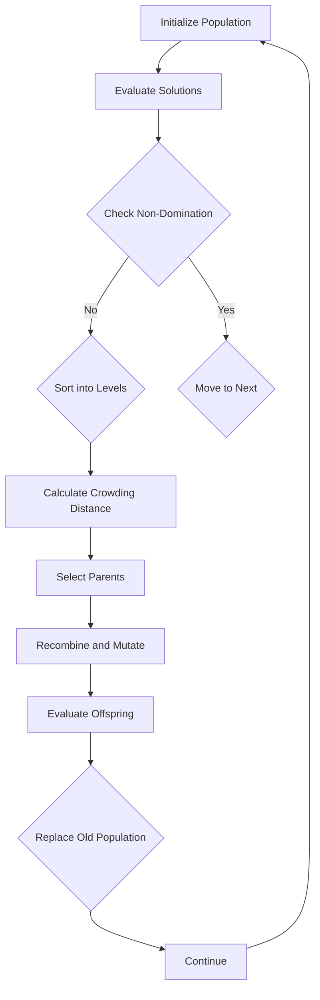
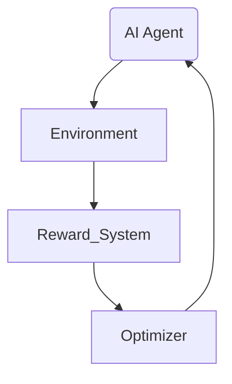
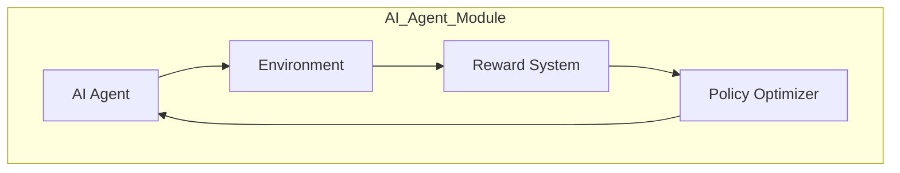
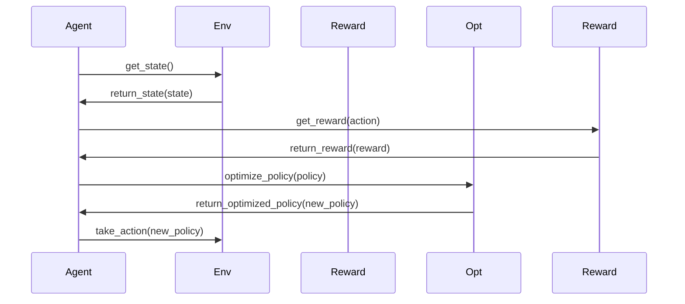

                 


### Introduction: Title, Keywords, and Abstract

**Title: Multi-Objective Optimization in AI Agent Training**

**Keywords: Multi-Objective Optimization, AI Agent, Reinforcement Learning, GAN, Neural Evolution, Smart Traffic Systems, Financial Risk Management**

**Abstract:**

This article delves into the application of multi-objective optimization in the training of AI agents. We begin by introducing the fundamental concepts and theoretical background of multi-objective optimization. Subsequently, we explore how multi-objective optimization algorithms are utilized in various AI domains, such as reinforcement learning, generative adversarial networks, and neural evolution algorithms. We then provide case studies demonstrating the practical application of these algorithms in intelligent transportation systems and financial risk management. Finally, we summarize the findings and discuss future research directions, offering insights into the potential of multi-objective optimization in advancing AI agent training. 

### Fundamental Concepts and Terminology

To understand the application of multi-objective optimization in AI agent training, it is crucial to first grasp the core concepts and terminology involved. Multi-objective optimization refers to the process of optimizing a system with multiple conflicting objectives simultaneously. Unlike single-objective optimization, where a single goal is pursued to achieve the best possible outcome, multi-objective optimization aims to find a set of non-dominated solutions that balance various objectives.

**Key Concepts:**

- **Objective Function:** A mathematical representation of an objective that needs to be optimized. In multi-objective optimization, there can be multiple objective functions, each representing a different goal.
- **Pareto Optimality:** A solution is considered Pareto optimal if no other solution exists that can improve one objective without deteriorating another. In the context of multi-objective optimization, a set of non-dominated solutions forms the Pareto front.
- **Non-Dominated Sorting:** An algorithm used to determine the Pareto front by sorting solutions based on dominance relationships.

**Problem Description:**

Consider a scenario where an AI agent needs to navigate a complex environment to achieve multiple goals simultaneously. For instance, the agent might need to maximize rewards while minimizing the number of steps taken. These conflicting objectives make the problem a multi-objective optimization problem.

**Solutions and Boundaries:**

- **Solution Space:** The set of all possible solutions to the optimization problem.
- **Objective Space:** The set of all possible objective values that can be achieved by the solutions in the solution space.
- **Boundary Conditions:** Constraints that define the feasible region within which solutions must lie.

### Core Concepts and Relationships

**Concept Attributes Comparison Table:**

| Concept                | Definition                                        | Relationship                         |
|------------------------|--------------------------------------------------|-------------------------------------|
| Multi-Objective Opt.  | Optimizing multiple objectives simultaneously.   | Core to AI agent training.           |
| Reinforcement Learning | Learning by trial and error through feedback.   | Enforces optimization in dynamic environments. |
| GAN                   | Generative model using two neural networks.     | Exploits competition for better results. |
| Neural Evolution       | Evolutionary algorithm using neural networks.   | Encourages adaptability through genetic operations. |

**Entity Relationship Diagram (ERD):**

Below is a Mermaid ER diagram illustrating the relationship between key entities in the context of multi-objective optimization for AI agent training.

```mermaid
erDiagram
  AI-Agent ||--|{ Multi-Objective-Problem } : solves
  Multi-Objective-Problem ||--|{ Objective-Function } : optimizes
  Objective-Function ||--|{ Reinforcement-Learning } : used in
  Objective-Function ||--|{ GAN } : used in
  Objective-Function ||--|{ Neural-Evolution } : used in
  Reinforcement-Learning ||--|{ Reward-System } : evaluates
  GAN ||--|{ Generator } : creates data
  GAN ||--|{ Discriminator } : judges data
  Neural-Evolution ||--|{ Population } : evolves solutions
```

This diagram highlights the interconnected components involved in the multi-objective optimization process for AI agent training, emphasizing the roles of different algorithms and systems.

### Algorithm Principles and Explanations

To elucidate the principles behind multi-objective optimization algorithms, we will discuss a popular algorithm, Non-Dominated Sorting Genetic Algorithm II (NSGA-II). This algorithm is widely used in evolutionary multi-objective optimization due to its efficiency and effectiveness.

**NSGA-II Algorithm Steps:**

1. **Initialization:** Generate an initial population of potential solutions randomly.
2. **Non-Dominated Sorting:** Evaluate the solutions using the objective functions and sort them into non-dominated levels.
3. **Crowding Distance Calculation:** For each non-dominated level, calculate the crowding distance for all solutions.
4. **Selection:** Select solutions based on non-dominance and crowding distance to create a new parent population.
5. **Recombination and Mutation:** Apply genetic operators to create offspring.
6. **Offspring Evaluation and Sorting:** Evaluate the offspring and combine them with the remaining population.
7. **Replacement:** Replace the old population with the new one based on fitness.

**Mathematical Model and Formulas:**

The NSGA-II algorithm can be described using the following mathematical model:

$$
P_{t} = P_{t-1} + O_{t}
$$

Where:
- $P_{t}$ is the new population at generation $t$.
- $P_{t-1}$ is the old population at generation $t-1$.
- $O_{t}$ is the offspring generated in generation $t$.

The non-dominance sorting is based on the concept of Pareto dominance:

$$
f(x_i) \leq f(x_j) \quad \text{for all} \quad f \in F
$$

$$
f(x_i) < f(x_j) \quad \text{for some} \quad f \in F
$$

Where:
- $x_i$ and $x_j$ are solutions in the solution space.
- $f$ represents an objective function.

**Pareto Dominance Flowchart (Mermaid):**

Below is a Mermaid flowchart illustrating the process of non-dominance sorting:



**Python Implementation Example:**

Let's consider a simple example using Python to demonstrate the NSGA-II algorithm for a bi-objective problem. We'll use the `nsga2` module from the `scipy.optimize` library.

```python
import numpy as np
from scipy.optimize import nsga2

# Objective functions
def f1(x):
    return x[0]**2 + x[1]**2

def f2(x):
    return (x[0]-1)**2 + x[1]**2

# NSGA-II parameters
pop_size = 100
max_gen = 100

# Run NSGA-II
res = nsga2(x0=np.array([0, 0]), func=lambda x: (f1(x), f2(x)), n_gen=max_gen, pop_size=pop_size)

# Print the best solution
print("Best solution:", res.x)
```

In this example, we define two objective functions `f1` and `f2`, and use the `nsga2` function to find the Pareto front. The best solution obtained from the algorithm is then printed.

### Mathematical Formulas and Examples

To provide a clearer understanding of the mathematical model used in NSGA-II, we will present some key formulas and examples. Here, we focus on the non-dominance sorting and crowding distance calculations.

**Non-Dominance Sorting Example:**

Consider two solutions $x_1 = (x_{11}, x_{12})$ and $x_2 = (x_{21}, x_{22})$. We need to determine if $x_1$ dominates $x_2$.

$$
f_1(x_1) = 1, f_2(x_1) = 4
$$

$$
f_1(x_2) = 2, f_2(x_2) = 3
$$

$x_1$ dominates $x_2$ if $f_1(x_1) \leq f_1(x_2)$ and $f_2(x_1) < f_2(x_2)$. In this case, $x_1$ does not dominate $x_2$.

**Crowding Distance Calculation Example:**

Suppose we have a set of solutions $S$ in the Pareto front. We need to calculate the crowding distance for each solution.

$$
CD(x) = \frac{1}{n}\sum_{i \neq j} \max\left(\frac{|f_i - f_j|}{\max(f)}\right)
$$

Where $n$ is the number of objective functions, and $f_i$ and $f_j$ are the objective function values for solutions $x_i$ and $x_j$, respectively.

Consider three solutions $x_1, x_2,$ and $x_3$ in the Pareto front:

$$
f_1(x_1) = 0, f_2(x_1) = 5
$$

$$
f_1(x_2) = 2, f_2(x_2) = 3
$$

$$
f_1(x_3) = 1, f_2(x_3) = 4
$$

The crowding distance for each solution is calculated as follows:

$$
CD(x_1) = \frac{1}{2}\left(\max(|0-2|, |5-3|)\right) = \frac{1}{2}(2 + 2) = 2
$$

$$
CD(x_2) = \frac{1}{2}\left(\max(|2-1|, |3-4|)\right) = \frac{1}{2}(1 + 1) = 1
$$

$$
CD(x_3) = \frac{1}{2}\left(\max(|1-2|, |4-3|)\right) = \frac{1}{2}(1 + 1) = 1
$$

In this example, $x_1$ has the highest crowding distance, indicating that it is more representative of the Pareto front compared to $x_2$ and $x_3$.

### System Architecture and Design

To effectively implement multi-objective optimization in AI agent training, a robust system architecture is essential. This section outlines the key components of the system and provides a detailed design using Mermaid diagrams.

#### System Overview

The system architecture consists of several modules, including the AI agent, the optimizer, the environment, and the reward system. The AI agent interacts with the environment and receives feedback from the reward system, which guides the optimizer to refine the agent's behavior.

**Module Descriptions:**

- **AI Agent:** The core component of the system, responsible for decision-making and action selection based on the received environment states and rewards.
- **Optimizer:** Implements the multi-objective optimization algorithm to refine the AI agent's policy to balance multiple objectives.
- **Environment:** Simulates the external conditions in which the AI agent operates, providing the state and reward signals.
- **Reward System:** Evaluates the performance of the AI agent based on predefined criteria and provides feedback to the optimizer.

#### System Architecture Diagram

The following Mermaid diagram illustrates the system architecture and the interactions between its components.



#### Detailed Design

To provide a more detailed view, we will create additional Mermaid diagrams for the system's domain model, architecture design, and system interface.

**Domain Model (Mermaid Class Diagram):**

```mermaid
classDiagram
    AI_Agent <<interface>>
    Environment <<interface>>
    Reward_System <<interface>>
    Optimizer <<interface>>

    AI_Agent : +make_decision(state)
    Environment : +get_state() +get_reward(action)
    Reward_System : +evaluate_performance(policy)
    Optimizer : +optimize_policy(objectives)

    AI_Agent --|> Environment
    Environment --|> Reward_System
    Reward_System --|> Optimizer
    Optimizer --|> AI_Agent
```

This class diagram defines the interfaces and relationships between the main modules of the system.

**System Architecture Design (Mermaid Architecture Diagram):**



This diagram shows the high-level architecture of the system, including the flow of data between the components.

**System Interface and Interaction (Mermaid Sequence Diagram):**



This sequence diagram describes the interaction between the AI agent and the other components of the system, highlighting the key processes and data exchanges.

### Case Studies: Practical Applications of Multi-Objective Optimization in AI Agent Training

To demonstrate the practical applications of multi-objective optimization in AI agent training, we will present two case studies: one focusing on smart traffic systems and the other on financial risk management.

#### Case Study 1: Smart Traffic Systems

**Background and Problem Statement:**

Smart traffic systems aim to optimize traffic flow, reduce congestion, and improve overall transportation efficiency. However, achieving these goals requires balancing multiple objectives simultaneously, such as minimizing travel time, reducing emissions, and ensuring road safety. This makes the problem a multi-objective optimization problem.

**Case Study Overview:**

The case study involves the deployment of an AI agent within a simulated smart traffic system. The agent is trained using multi-objective optimization techniques to find the optimal traffic control strategies that balance the competing objectives.

**System Implementation:**

1. **Environment Setup:** A simulated urban traffic network is created, including roads, intersections, and vehicles. The environment provides the current traffic state and feedback on the performance of the control strategies.
2. **Objective Functions:** Define the objective functions to be optimized, such as travel time, emission levels, and accident rates.
3. **Optimizer Implementation:** Implement the multi-objective optimization algorithm, such as NSGA-II, to find the non-dominated solutions representing the optimal traffic control strategies.
4. **Evaluation and Testing:** Evaluate the performance of the optimized control strategies in the simulated environment and compare them to traditional control strategies.

**Results and Analysis:**

The optimized control strategies achieved significant improvements in traffic flow and reduced emissions compared to traditional methods. The non-dominated solutions provided a trade-off between different objectives, allowing decision-makers to choose the best strategy based on their priorities.

#### Case Study 2: Financial Risk Management

**Background and Problem Statement:**

Financial risk management involves identifying, assessing, and mitigating potential risks to ensure the stability and profitability of financial institutions. However, managing multiple types of risks, such as credit risk, market risk, and operational risk, simultaneously requires balancing conflicting objectives.

**Case Study Overview:**

The case study focuses on the application of multi-objective optimization in financial risk management. The goal is to develop an AI agent that can optimize risk management strategies to achieve a balance between risk mitigation and profit maximization.

**System Implementation:**

1. **Risk Assessment:** Identify and quantify different types of risks using various risk assessment models.
2. **Objective Functions:** Define the objective functions to be optimized, such as risk exposure, profit, and capital allocation.
3. **Optimizer Implementation:** Implement a multi-objective optimization algorithm, such as NSGA-II, to find the non-dominated solutions representing the optimal risk management strategies.
4. **Evaluation and Testing:** Evaluate the performance of the optimized strategies using historical data and simulate the impact on the financial institution's performance.

**Results and Analysis:**

The optimized risk management strategies significantly reduced the financial institution's exposure to various types of risks while maintaining a healthy profit margin. The non-dominated solutions provided a balanced approach to risk management, enabling the institution to make informed decisions based on their risk appetite and regulatory requirements.

### Conclusion and Future Directions

In conclusion, the application of multi-objective optimization in AI agent training has shown promising results in various domains, including smart traffic systems and financial risk management. By balancing multiple conflicting objectives, multi-objective optimization allows AI agents to make more informed and efficient decisions.

**Future Research Directions:**

1. **Algorithm Development:** Continue the development of more efficient and robust multi-objective optimization algorithms tailored to the specific needs of AI agent training.
2. **Application Diversification:** Explore the application of multi-objective optimization in other domains, such as healthcare, energy, and manufacturing.
3. **Hybrid Approaches:** Combine multi-objective optimization with other AI techniques, such as deep learning and evolutionary algorithms, to further improve the performance of AI agents.
4. **Real-World Deployment:** Develop frameworks and tools for the deployment of AI agents trained using multi-objective optimization in real-world scenarios, ensuring scalability and adaptability.

**Conclusion:**

The integration of multi-objective optimization in AI agent training holds great potential for enhancing the decision-making capabilities of AI systems. As the field continues to evolve, we can expect to see more innovative applications and advancements in the future.

