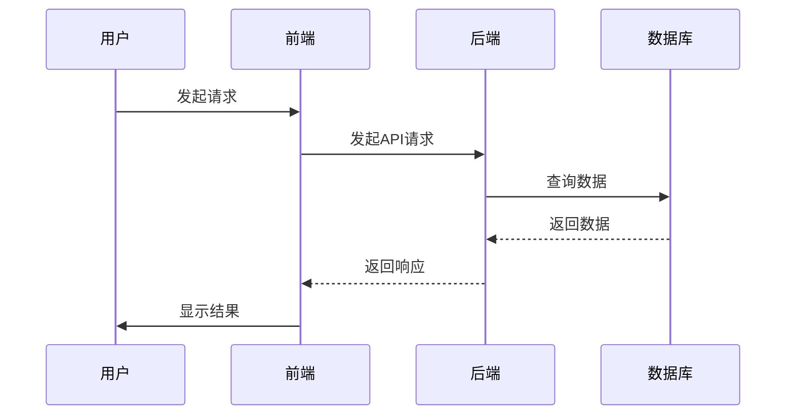

                 

## 多语言支持

> 关键词：多语言处理、国际化（I18N）、本地化（L10N）、字符编码、语言模型、翻译算法、多语言开发工具

> 摘要：本文将深入探讨多语言支持的原理、技术、工具和实践。从多语言支持的基本概念和背景介绍开始，逐步深入到核心概念与联系、技术详解、工具与实践、安全与优化以及未来趋势。本文旨在为读者提供一个全面、系统的多语言支持指南。

## 目录大纲设计过程

在设计《多语言支持》这本书的目录大纲时，我们首先需要明确书的核心内容和目标读者群体。这本书的读者可能是计算机科学、软件工程或相关领域的专业人士，他们可能希望深入了解多语言支持的原理、技术、工具和实践。

### 第一步：确定书的主题和结构

书名已经明确了主题，即“多语言支持”。接下来，我们需要确定书的结构。考虑到书籍的完整性和逻辑性，我们将书分为以下几个主要部分：

1. **背景介绍**：包括多语言支持的基本概念、发展历史、现状以及重要性。
2. **核心概念与联系**：详细讲解多语言处理的核心概念，如自然语言处理、国际化（I18N）和本地化（L10N）。
3. **技术详解**：深入探讨实现多语言支持的技术，如字符编码、字符集、语言模型和翻译算法。
4. **工具与实践**：介绍常见的多语言开发工具、框架和平台，以及实际应用案例。
5. **安全与优化**：讨论多语言应用中的安全问题、性能优化策略以及国际化的最佳实践。
6. **未来趋势**：展望多语言支持技术的发展趋势和未来发展方向。

### 第二步：细化每个部分的内容

在每个主要部分下，我们将细化具体的内容，确保每个章节都有明确的主题和目标。

### 背景介绍

**第1章：多语言支持概述**

- **1.1 多语言支持的基本概念**
  - **1.1.1 什么是多语言支持**
  - **1.1.2 多语言支持的重要性**
  - **1.1.3 多语言支持的发展历史**

- **1.2 多语言支持现状**
  - **1.2.1 全球语言多样性**
  - **1.2.2 多语言支持技术的应用领域**

### 核心概念与联系

**第2章：自然语言处理与多语言支持**

- **2.1 自然语言处理基础**
  - **2.1.1 语言模型**
  - **2.1.2 词向量与语义分析**

- **2.2 国际化与本地化**

  **2.2.1 国际化（I18N）**
  - **2.2.1.1 国际化设计原则**
  - **2.2.1.2 语言无关性**

  **2.2.2 本地化（L10N）**
  - **2.2.2.1 本地化流程**
  - **2.2.2.2 多语言资源管理**

### 技术详解

**第3章：字符编码与字符集**

- **3.1 字符编码基础**
  - **3.1.1 ASCII编码**
  - **3.1.2 Unicode编码**

- **3.2 字符集与编码转换**
  - **3.2.1 GBK与GBK转换**
  - **3.2.2 UTF-8与UTF-16比较**

**第4章：语言模型与翻译算法**

- **4.1 语言模型原理**
  - **4.1.1 基于规则的语言模型**
  - **4.1.2 基于统计的语言模型**

- **4.2 翻译算法**

  **4.2.1 统计机器翻译**
  - **4.2.1.1 翻译模型**
  - **4.2.1.2 语言模型**

  **4.2.2 神经机器翻译**
  - **4.2.2.1 编码器与解码器架构**
  - **4.2.2.2 损失函数与优化算法**

### 工具与实践

**第5章：多语言开发工具与框架**

- **5.1 常见多语言开发工具**
  - **5.1.1 语言包管理工具**
  - **5.1.2 本地化平台**

- **5.2 多语言框架**

  **5.2.1 国际化框架**
  - **5.2.1.1 国际化框架设计模式**
  - **5.2.1.2 国际化框架的实现**

  **5.2.2 本地化框架**
  - **5.2.2.1 本地化框架功能**
  - **5.2.2.2 本地化框架的优势**

### 安全与优化

**第6章：多语言支持的安全与优化**

- **6.1 多语言支持中的安全问题**
  - **6.1.1 字符编码漏洞**
  - **6.1.2 国际化漏洞**

- **6.2 性能优化策略**
  - **6.2.1 缓存与资源管理**
  - **6.2.2 并行处理与负载均衡**

**第7章：国际化最佳实践**

- **7.1 国际化设计原则**
  - **7.1.1 可本地化设计**
  - **7.1.2 可维护性与可扩展性**

- **7.2 本地化最佳实践**
  - **7.2.1 用户调研与需求分析**
  - **7.2.2 跨文化沟通与协作**

### 未来趋势

**第8章：多语言支持的未来**

- **8.1 人工智能与多语言支持**
  - **8.1.1 人工智能在翻译中的应用**
  - **8.1.2 多语言支持与人工智能融合的未来**

## 多语言支持的背景

多语言支持是指软件系统能够处理和展示多种语言的文本、图标和其他资源。在全球化进程不断加快的今天，多语言支持已经成为软件系统设计和开发中不可或缺的一部分。以下是多语言支持的一些核心概念、问题背景和现状。

### 核心概念术语说明

- **多语言支持（Multilingual Support）**：指软件系统能够处理和展示多种语言的文本、图标和其他资源。
- **国际化（Internationalization，I18N）**：指在软件开发过程中，确保软件能够适应不同的语言和文化，而不需要进行大量的修改。
- **本地化（Localization，L10N）**：指在国际化基础上，针对特定语言和文化进行软件的调整和优化，使其更符合目标市场的需求。
- **字符编码（Character Encoding）**：指将文本转换为计算机可以存储和处理的数字编码形式。
- **语言模型（Language Model）**：指用于自然语言处理的数学模型，用于预测文本的下一个单词或短语。
- **翻译算法（Translation Algorithm）**：指用于将一种语言的文本自动翻译成另一种语言的算法。

### 问题背景

随着互联网的普及和全球化的发展，越来越多的软件系统需要支持多种语言。这不仅包括面向消费者的应用程序，如社交媒体、电子商务网站等，还包括面向企业的管理系统、工具和软件。多语言支持不仅能够扩大软件的市场份额，提高用户体验，还能够帮助企业进入新的市场和满足不同文化用户的需求。

然而，实现多语言支持并非易事。它涉及多个方面，包括字符编码、国际化设计、本地化流程、语言模型和翻译算法等。此外，不同语言和文化之间的差异也需要在软件设计中得到充分考虑。

### 问题描述

多语言支持面临的主要问题包括：

- **字符编码问题**：不同字符编码方式可能导致文本显示错误，特别是在处理包含多种语言的文本时。
- **国际化与本地化设计问题**：软件系统在设计时需要考虑国际化，但实际开发中往往忽视了本地化需求，导致软件在特定市场表现不佳。
- **语言模型和翻译算法问题**：现有的翻译算法虽然在准确性和流畅性方面有较大提升，但仍然存在一些局限性，特别是在处理特定领域的术语和方言时。
- **性能问题**：多语言支持往往需要额外的存储和处理资源，可能导致系统性能下降。

### 问题解决

解决多语言支持问题需要从多个方面入手：

- **字符编码**：采用统一的字符编码标准，如UTF-8，确保文本正确存储和显示。
- **国际化设计**：在软件开发过程中遵循国际化设计原则，如语言无关性、本地化设计等。
- **本地化流程**：建立完善的本地化流程，确保软件在特定市场中的用户体验。
- **语言模型和翻译算法**：不断优化现有翻译算法，提高翻译质量和效率。
- **性能优化**：通过缓存、并行处理和负载均衡等技术，提高多语言支持系统的性能。

### 边界与外延

多语言支持不仅涉及文本和语言的翻译，还包括以下方面：

- **多语言界面**：软件界面支持多种语言，提供用户友好的体验。
- **多语言文档**：软件文档、帮助手册等支持多种语言。
- **多语言数据**：数据库、数据结构等支持多种语言的数据存储和处理。
- **多语言资源管理**：管理多种语言版本的资源文件，如图标、图片、音频等。

### 概念结构与核心要素组成

多语言支持的核心概念和要素包括：

- **字符编码与字符集**：字符编码是文本的数字表示方式，字符集是字符编码的集合。
- **国际化与本地化**：国际化确保软件适应不同语言和文化，本地化则针对特定市场进行调整。
- **语言模型与翻译算法**：语言模型用于自然语言处理，翻译算法用于文本翻译。
- **多语言开发工具与框架**：提供多语言支持的编程工具和框架，简化开发过程。
- **安全与优化**：确保多语言支持系统的安全和性能。

通过以上分析，我们可以看出，多语言支持是一个复杂但重要的领域。在软件开发和国际化过程中，充分考虑多语言支持的各个方面，将有助于提升软件的质量和市场竞争力。

## 核心概念与联系

在多语言支持的技术架构中，自然语言处理（NLP）、国际化（I18N）和本地化（L10N）是三个核心概念，它们相互关联，共同构成了多语言处理的技术基础。

### 自然语言处理（NLP）

自然语言处理是计算机科学和人工智能领域的一个重要分支，它涉及使计算机能够理解、解释和生成人类语言的一系列技术。自然语言处理的核心目标是使计算机能够处理自然语言文本，包括文本理解、文本生成、文本分类、情感分析、命名实体识别等任务。

**自然语言处理的关键概念和特性包括：**

- **语言模型**：语言模型是NLP的核心组成部分，用于预测文本的下一个词或短语。常见的语言模型包括基于规则的模型和统计模型，如n-gram模型、隐藏马尔可夫模型（HMM）和递归神经网络（RNN）。
  
  **语言模型对比表格：**

  | 模型类型        | 特点                                                         | 应用场景                     |
  |-----------------|--------------------------------------------------------------|------------------------------|
  | 基于规则的模型  | 使用预定义的语法规则和模式进行文本分析                         | 语言分析和文本预处理         |
  | 统计模型        | 基于统计方法，如n-gram和条件概率，进行文本建模               | 文本分类、信息检索           |
  | 递归神经网络    | 能够处理序列数据，理解上下文信息                             | 语言生成、机器翻译           |

  **ER实体关系图架构：**

  ```mermaid
  erDiagram
    Product ||--|{ LanguageModel }
    TextProcessing ||--|{ LanguageModel }
    MachineTranslation ||--|{ LanguageModel }
    EntityRecognition ||--|{ LanguageModel }
  ```

- **词向量与语义分析**：词向量是NLP中用于表示词语的分布式表示方法，如Word2Vec和BERT。语义分析是指理解和提取文本中的语义信息，包括词义消歧、情感分析和实体识别等。

### 国际化（I18N）

国际化（Internationalization）是指在软件开发过程中，确保软件能够在不同的语言和文化环境中运行，而无需大规模修改。国际化的核心目标是使软件在全球化市场中具备灵活性和可扩展性。

**国际化设计原则和特性包括：**

- **语言无关性**：设计软件时，尽量避免依赖特定语言或文化特性，确保代码的通用性。
- **本地化设计**：在软件设计和开发阶段，就考虑到本地化的需求，如使用可变文本、灵活的数据格式等。

  **国际化设计原则对比表格：**

  | 设计原则       | 描述                                                         | 重要性                   |
  |----------------|--------------------------------------------------------------|--------------------------|
  | 语言无关性     | 使用国际化的API和函数，避免硬编码特定语言或文化信息           | 提高软件的可移植性       |
  | 可变文本       | 使用变量和参数，动态生成文本内容                             | 提高多语言支持的可扩展性 |
  | 资源文件管理   | 将所有文本和资源存储在独立的文件中，方便管理和更新           | 提高维护性和可管理性     |

  **国际化设计ER实体关系图架构：**

  ```mermaid
  erDiagram
    Software ||--|{ InternationalizationDesign }
    Language ||--|{ InternationalizationDesign }
    Culture ||--|{ InternationalizationDesign }
  ```

### 本地化（L10N）

本地化是指在国际化基础上，对软件进行特定语言和文化的调整，以适应目标市场的需求。本地化的目标是使软件在特定市场中具备更好的用户体验和文化适应性。

**本地化流程和特性包括：**

- **本地化流程**：包括需求分析、翻译、文化适应、测试和发布等步骤。
- **多语言资源管理**：管理多种语言版本的资源文件，如文本、图片、音频等。

  **本地化流程对比表格：**

  | 流程步骤       | 描述                                                         | 责任分配                     |
  |----------------|--------------------------------------------------------------|------------------------------|
  | 需求分析       | 分析目标市场的需求，确定本地化内容                             | 产品经理                     |
  | 翻译           | 将软件中的文本翻译成目标语言                                 | 翻译团队                     |
  | 文化适应       | 调整软件内容，使其符合目标市场的文化习俗                       | 本地化团队                   |
  | 测试           | 测试本地化后的软件，确保其功能正确和用户体验良好               | 测试团队                     |
  | 发布           | 将本地化后的软件发布到目标市场                               | 运营团队                     |

  **本地化流程ER实体关系图架构：**

  ```mermaid
  erDiagram
    Software ||--|{ LocalizationProcess }
    Language ||--|{ LocalizationProcess }
    Culture ||--|{ LocalizationProcess }
  ```

### 国际化与本地化的关系

国际化是本地化的基础，本地化是国际化的具体实现。国际化确保软件具备适应多种语言和文化的能力，而本地化则将这种能力应用到特定市场中。

国际化设计原则和流程中的语言无关性和资源管理为本地化提供了便利，使得本地化团队能够高效地进行翻译、文化适应和测试。而本地化的成果则通过国际化设计原则和流程反馈到软件中，不断提升其国际化能力。

**总结**：自然语言处理、国际化与本地化是构建多语言支持系统的核心概念，它们相互关联，共同作用。通过深入理解和应用这些概念，我们可以设计和开发出具备良好国际化与本地化能力的软件系统，满足全球市场的需求。

## 技术详解

### 字符编码与字符集

字符编码是将文本中的字符映射到计算机可以存储和处理的数字编码。不同的字符编码方式决定了文本的存储和处理方式，因此在多语言支持中，字符编码是一个关键问题。

**1. ASCII编码**

ASCII编码是最早的字符编码标准，由7位二进制数组成。它最初设计用于表示英语字母、数字、标点符号和其他一些特殊字符，无法表示一些非英语语言中的字符。然而，ASCII编码因其简单性和广泛的应用，至今仍被广泛使用。

**2. Unicode编码**

Unicode编码是一种更为全面的字符编码标准，旨在表示世界上所有语言中的字符。Unicode使用16位、32位甚至更多位的二进制数来表示字符，能够表示超过100,000个字符。Unicode编码的两种常见形式是UTF-8和UTF-16。

- **UTF-8编码**：UTF-8是一种变长编码，它使用1到4个字节来表示一个字符。ASCII字符在UTF-8中保持不变，其他字符使用更多的字节表示。UTF-8具有较好的兼容性，支持广泛的语言，并且在处理英文文本时效率较高。

  **UTF-8编码示例：**

  ```python
  # 字符'e'的UTF-8编码
  print(bin(ord('e')))  # 输出：'0b1100101'
  ```

- **UTF-16编码**：UTF-16使用2个或4个字节来表示一个字符，其中大多数字符使用2个字节。UTF-16对基本多语言平面（BMP）中的字符使用2个字节，而对于非BMP中的字符则使用4个字节。UTF-16在某些语言中（如中文和日文）具有更好的效率，但在处理英语等语言时，其效率低于UTF-8。

  **UTF-16编码示例：**

  ```python
  # 字符'e'的UTF-16编码
  print(hex(ord('e')))  # 输出：'0x0065'
  ```

**3. 字符集与编码转换**

字符集是字符编码的集合，不同的字符集支持不同的字符。常见的字符集包括ASCII、UTF-8和UTF-16。字符集与编码之间的转换是确保多语言文本正确处理的关键。

- **GBK与UTF-8转换**：GBK是中国大陆常用的字符集，用于表示简体中文。将GBK编码的文本转换为UTF-8编码时，需要确保所有字符都有对应的UTF-8编码。

  **GBK到UTF-8转换示例：**

  ```python
  import chardet

  # 假设有一个GBK编码的文本
  gbk_text = "你好，世界！"
  gbk_encoding = 'GBK'

  # 将GBK编码转换为UTF-8编码
  utf8_text = gbk_text.encode(gbk_encoding).decode('UTF-8')
  print(utf8_text)  # 输出："你好，世界！"
  ```

- **UTF-8与UTF-16比较**：UTF-8和UTF-16在编码效率、兼容性和存储空间方面存在差异。UTF-8适用于处理多种语言的文本，特别是在处理英语等常用语言时，其效率更高。UTF-16则在处理某些语言（如中文和日文）时具有优势，但其编码长度较长，可能导致存储空间和传输效率的降低。

  **UTF-8与UTF-16比较表格：**

  | 特性        | UTF-8                         | UTF-16                      |
  |-------------|------------------------------|-----------------------------|
  | 编码长度     | 1到4个字节                    | 2或4个字节                  |
  | 兼容性       | 兼容ASCII字符                | 不兼容ASCII字符            |
  | 效率         | 高于UTF-16，特别是在处理英文文本时 | 适用于处理某些语言，如中文和日文 |
  | 存储空间     | 较小，适应多种语言文本        | 较大，适用于特定语言文本    |

通过深入了解字符编码和字符集，我们可以更好地处理多语言文本，确保其在不同平台和系统中的一致性和正确性。

### 语言模型与翻译算法

在多语言支持系统中，语言模型和翻译算法是关键组成部分，它们决定了系统在自然语言处理和翻译任务中的性能。下面，我们将深入探讨这些算法的基本原理、实现方法及其优缺点。

#### 语言模型

语言模型用于预测文本的下一个词或短语，其核心目标是捕捉语言的统计规律和概率分布。语言模型可以分为基于规则的模型和基于统计的模型。

1. **基于规则的模型**：

   基于规则的模型使用预定义的语法规则和模式进行文本分析。这类模型通常包括语法分析器、词法分析器和语义分析器等。优点是规则明确，可以确保文本分析的一致性和准确性。缺点是规则数量庞大，难以覆盖所有可能的文本情况，且难以适应新的语言变化。

   **示例**：LL(1)语法分析器是一种常见的基于规则的语言模型，它使用预测分析表（PDT）来分析文本，具有较高的效率。

2. **基于统计的模型**：

   基于统计的模型通过分析大量语料库来学习语言的统计规律。这类模型通常使用概率分布来预测文本的下一个词或短语。常见的基于统计的语言模型包括n-gram模型、隐马尔可夫模型（HMM）和递归神经网络（RNN）。

   **n-gram模型**：n-gram模型是一种基于历史信息的语言模型，它通过统计一个词序列的概率来预测下一个词。n-gram模型的优点是实现简单，易于理解；缺点是对于长文本的预测效果较差，无法捕捉上下文的长距离依赖。

   **隐马尔可夫模型（HMM）**：HMM是一种概率模型，用于处理离散时间序列数据。它通过隐藏状态序列来预测观察序列。HMM在语音识别和自然语言处理中有着广泛的应用。

   **递归神经网络（RNN）**：RNN是一种可以处理序列数据的神经网络，它通过循环结构来捕捉上下文信息。RNN在语言模型和机器翻译中有着优异的性能，特别是在处理长距离依赖时。

#### 翻译算法

翻译算法是将一种语言的文本自动翻译成另一种语言的算法。翻译算法可以分为统计机器翻译（SMT）和神经机器翻译（NMT）。

1. **统计机器翻译（SMT）**：

   统计机器翻译是一种基于概率的翻译方法，它通过分析大量的双语语料库来学习翻译规则。SMT的主要组成部分包括：

   - **翻译模型**：用于预测源语言文本到目标语言文本的概率分布。常见的翻译模型有基于短语的翻译模型（Phrase-Based SMT）和基于句子的翻译模型（Sentence-Based SMT）。
   - **语言模型**：用于预测目标语言文本的概率分布，常见的是n-gram语言模型。
   - **翻译策略**：用于优化翻译结果，常见的是最小化翻译误差率（TER）或最大化翻译概率。

   **基于短语的翻译模型（PBMT）**：基于短语的翻译模型是最早的统计机器翻译方法之一，它通过将源语言文本分解为短语，并从双语语料库中寻找对应的翻译短语。PBMT的优点是实现简单，能够在一定程度上捕捉上下文信息；缺点是对于长文本的翻译效果较差，且需要大量的训练数据。

   **基于句子的翻译模型（SBMT）**：基于句子的翻译模型通过将源语言文本和目标语言文本视为序列，直接学习源语言文本到目标语言文本的概率分布。SBMT在翻译质量和效率方面有所提升，但需要更复杂的算法和更大的训练数据。

2. **神经机器翻译（NMT）**：

   神经机器翻译是一种基于深度学习的翻译方法，它通过神经网络模型来学习翻译任务。NMT的主要组成部分包括：

   - **编码器（Encoder）**：用于将源语言文本编码为一个固定长度的向量表示。
   - **解码器（Decoder）**：用于将编码器的输出解码为目标语言文本。

   **编码器-解码器（Encoder-Decoder）架构**：编码器-解码器架构是NMT中最常用的模型架构，它通过循环神经网络（RNN）或变换器（Transformer）来实现。编码器-解码器架构能够有效地捕捉上下文信息，提高翻译质量。

   **变换器（Transformer）架构**：变换器是一种基于注意力机制的深度学习模型，它通过多头自注意力（Multi-Head Self-Attention）和前馈神经网络（Feedforward Neural Network）来学习翻译任务。变换器在翻译质量和效率方面都表现出色，是目前最先进的NMT模型。

   **损失函数与优化算法**：在NMT中，常用的损失函数是交叉熵损失函数（Cross-Entropy Loss），它用于衡量预测的概率分布与真实的概率分布之间的差异。优化算法通常采用梯度下降（Gradient Descent）或其变体（如Adam优化器）来更新模型参数。

#### 算法原理讲解与Python代码示例

以下是基于变换器的神经机器翻译算法的简单示例：

```python
import tensorflow as tf
from tensorflow.keras.layers import Embedding, LSTM, Dense
from tensorflow.keras.models import Model

# 假设源语言和目标语言的词汇量分别为5000
vocab_size = 5000

# 编码器模型
encoder_inputs = tf.keras.Input(shape=(None,))
encoder_embedding = Embedding(vocab_size, 512)(encoder_inputs)
encoder_lstm = LSTM(512, return_state=True)
_, state_h, state_c = encoder_lstm(encoder_embedding)
encoder_states = [state_h, state_c]

# 解码器模型
decoder_inputs = tf.keras.Input(shape=(None,))
decoder_embedding = Embedding(vocab_size, 512)(decoder_inputs)
decoder_lstm = LSTM(512, return_sequences=True, return_state=True)
decoder_outputs, _, _ = decoder_lstm(decoder_embedding, initial_state=encoder_states)
decoder_dense = Dense(vocab_size, activation='softmax')
decoder_outputs = decoder_dense(decoder_outputs)

# 整合模型
model = Model([encoder_inputs, decoder_inputs], decoder_outputs)
model.compile(optimizer='rmsprop', loss='categorical_crossentropy', metrics=['accuracy'])

# 模型训练
model.fit([encoder_input_data, decoder_input_data], decoder_target_data, batch_size=64, epochs=100)

# 模型预测
encoder_model = Model(encoder_inputs, encoder_states)
decoder_model = Model(decoder_inputs, decoder_outputs)

# 预测
encoder_states_value = encoder_model.predict(encoder_input_data)
decoder_state_value = decoder_model.predict(decoder_input_data)

# 输出翻译结果
output_text = ''
for i in range(1):
    output_tokens = decoder_model.predict([decoder_inputs, decoder_state_value])
    sampled_token_index = np.argmax(output_tokens[0], axis=-1)
    sampled_token = index_to_word[sampled_token_index]
    output_text += sampled_token + ' '
    decoder_inputs = tf.keras.preprocessing.sequence.pad_sequences([[sampled_token_index]], maxlen=max_sequence_len-1)
    decoder_state_value = state_h, state_c

print(output_text)
```

通过以上讲解和示例，我们可以看出，语言模型和翻译算法在多语言支持中扮演着至关重要的角色。随着深度学习和神经网络技术的不断发展，翻译算法的性能不断提升，为多语言支持提供了更加高效和准确的方法。

### 系统分析与架构设计方案

多语言支持系统是一个复杂的工程，涉及到前端、后端、数据库等多个方面。为了确保系统的高效性和可维护性，我们需要进行系统分析与架构设计。以下是一个详细的分析与设计方案。

#### 问题场景介绍

在一个全球化的企业中，软件系统需要支持多种语言，以满足不同国家和地区的用户需求。例如，一家国际化的电子商务平台需要支持英语、法语、德语、西班牙语等多种语言，确保用户能够以自己熟悉的语言进行购物和交流。

#### 项目介绍

项目名称：多语言支持电子商务平台

项目目标：实现一个能够支持多种语言的前后端一体化系统，提供良好的用户体验和可维护性。

#### 系统功能设计

多语言支持系统需要实现以下功能：

- **国际化（I18N）**：确保系统在设计和开发过程中考虑不同语言和文化，支持文本、日期、时间等的国际化显示。
- **本地化（L10N）**：根据目标市场的需求，提供特定语言的本地化版本，包括翻译、文化适应等。
- **多语言界面**：提供用户友好的多语言界面，方便用户切换语言。
- **多语言数据管理**：管理不同语言的数据库和数据表，确保数据的一致性和完整性。
- **翻译管理**：提供翻译工具和平台，方便团队进行文本翻译和管理。

#### 系统架构设计

系统架构采用前后端分离的设计，以便于开发和维护。

1. **前端架构**：

   - **国际化框架**：使用如Vue.js或React等前端框架，实现页面内容的国际化。通过i18n插件，将页面上的文本提取到资源文件中，方便管理和更新。
   - **多语言界面**：实现多语言切换功能，允许用户在设置中选择自己喜欢的语言。
   - **UI组件库**：提供一套可定制化的UI组件库，支持不同语言和文化。

2. **后端架构**：

   - **服务端国际化**：使用Spring Boot等后端框架，实现服务端的国际化。将系统中的文本提取到资源文件中，通过配置文件或API接口进行管理。
   - **多语言数据管理**：使用关系型数据库（如MySQL）存储数据，并支持多种字符编码（如UTF-8）。通过数据库的字符编码设置，确保不同语言的文本能够正确存储和显示。
   - **翻译管理平台**：提供一个Web界面，用于团队进行文本翻译和管理。支持翻译记忆和术语库功能，提高翻译效率。

3. **架构图**：

   ```mermaid
   graph TB
   A[前端] --> B[国际化框架]
   A --> C[多语言界面]
   A --> D[UI组件库]
   B --> E[Vue.js/React]
   C --> F[用户设置]
   D --> G[UI组件]
   B --> H[后端国际化]
   B --> I[服务端国际化]
   H --> J[Spring Boot]
   H --> K[数据库管理]
   I --> L[文本提取管理]
   I --> M[翻译管理平台]
   K --> N[MySQL数据库]
   K --> O[多种字符编码支持]
   ```

#### 系统接口设计和系统交互

系统接口设计主要包括RESTful API设计，用于前端与后端之间的数据交互。

1. **用户接口**：

   - **登录/注册**：用户通过登录或注册接口进行认证。
   - **语言切换**：用户可以通过设置接口切换语言。
   - **购物流程**：用户通过购物车、订单等接口进行购物。

2. **管理员接口**：

   - **翻译管理**：管理员可以通过翻译接口进行文本翻译和审核。
   - **用户管理**：管理员可以通过用户接口管理用户权限和语言设置。

3. **API设计**：

   - **登录/注册**：
     ```json
     POST /api/login
     {
       "username": "string",
       "password": "string"
     }
     
     POST /api/register
     {
       "username": "string",
       "password": "string",
       "email": "string"
     }
     ```

   - **语言切换**：
     ```json
     GET /api/settings/language
     {
       "language": "string"
     }
     ```

   - **购物流程**：
     ```json
     GET /api/cart
     GET /api/orders
     POST /api/orders
     {
       "productId": "string",
       "quantity": "integer"
     }
     ```

   - **翻译管理**：
     ```json
     GET /api/translations
     POST /api/translations
     {
       "sourceText": "string",
       "targetLanguage": "string"
     }
     ```

   - **用户管理**：
     ```json
     GET /api/users
     POST /api/users
     {
       "username": "string",
       "password": "string",
       "role": "string"
     }
     ```

#### 系统交互Mermaid序列图



通过上述系统分析与架构设计，我们可以构建一个高效、可靠的多语言支持系统，满足全球用户的需求。

### 项目实战

在本节中，我们将通过一个具体的例子来展示如何实现一个多语言支持系统。我们将分步骤介绍环境安装、系统核心实现和代码应用解读与分析，最后对实际案例进行详细讲解。

#### 环境安装

要实现一个多语言支持系统，我们需要安装以下工具和库：

1. **Python环境**：安装Python 3.8及以上版本。
2. **Django框架**：安装Django框架，用于构建后端。
   ```bash
   pip install django
   ```
3. **i18n模块**：Django自带i18n模块，用于国际化支持。
4. **Docker**：使用Docker来容器化我们的应用。
   ```bash
   docker --version
   ```
5. **PostgreSQL数据库**：安装PostgreSQL数据库，用于存储数据。
   ```bash
   sudo apt-get install postgresql
   ```

#### 系统核心实现

1. **创建Django项目**：

   ```bash
   django-admin startproject myproject
   cd myproject
   ```

2. **创建Django应用**：

   ```bash
   django-admin startapp myapp
   ```

3. **配置国际化**：

   在`myproject/settings.py`中配置国际化设置：

   ```python
   # myproject/settings.py

   # 国际化设置
   LANGUAGE_CODE = 'en-us'
   LANGUAGES = [
       ('en', _('English')),
       ('es', _('Spanish')),
       ('fr', _('French')),
   ]
   I18N_ENABLED = True
   ```

4. **创建模型**：

   在`myapp/models.py`中创建一个简单的模型，如`Product`：

   ```python
   # myapp/models.py

   from django.db import models

   class Product(models.Model):
       name = models.CharField(max_length=100)
       description = models.TextField()
       price = models.DecimalField(max_digits=6, decimal_places=2)
       language = models.CharField(max_length=10, choices=[('en', 'English'), ('es', 'Spanish'), ('fr', 'French')])
   ```

5. **创建视图**：

   在`myapp/views.py`中创建一个视图来处理产品列表：

   ```python
   # myapp/views.py

   from django.shortcuts import render
   from .models import Product

   def product_list(request):
       products = Product.objects.all()
       return render(request, 'product_list.html', {'products': products})
   ```

6. **创建模板**：

   在`myapp/templates/product_list.html`中创建一个简单的HTML模板：

   ```html
   <!-- myapp/templates/product_list.html -->

   <h1></h1>
   <ul>
       
           <li> - </li>
       
   </ul>
   ```

7. **配置路由**：

   在`myproject/urls.py`中添加路由：

   ```python
   # myproject/urls.py

   from django.contrib import admin
   from django.urls import path
   from myapp.views import product_list

   urlpatterns = [
       path('admin/', admin.site.urls),
       path('products/', product_list),
   ]
   ```

#### 代码应用解读与分析

以下是代码的详细解读：

1. **模型定义**：

   ```python
   class Product(models.Model):
       name = models.CharField(max_length=100)
       description = models.TextField()
       price = models.DecimalField(max_digits=6, decimal_places=2)
       language = models.CharField(max_length=10, choices=[('en', 'English'), ('es', 'Spanish'), ('fr', 'French')])
   ```

   我们定义了一个名为`Product`的模型，它包含产品名称、描述、价格和语言等字段。语言字段是一个选择字段，允许我们为产品指定语言。

2. **视图实现**：

   ```python
   def product_list(request):
       products = Product.objects.all()
       return render(request, 'product_list.html', {'products': products})
   ```

   `product_list`视图获取所有产品，并将它们传递给模板进行渲染。

3. **模板渲染**：

   ```html
   <h1></h1>
   <ul>
       
           <li> - </li>
       
   </ul>
   ```

   模板使用Django的翻译功能（``），将产品名称和价格翻译成当前语言。

4. **国际化配置**：

   在`myproject/settings.py`中，我们设置了多语言支持。Django会根据用户的语言设置自动加载对应的翻译文件。

#### 实际案例分析与详细讲解

假设我们有一个电子商务平台，需要支持英语、西班牙语和法语。以下是一个实际案例：

- **英语**：默认语言，用户可以在设置中更改。
- **西班牙语**：用户在西班牙市场的需求。
- **法语**：用户在法国市场的需求。

1. **创建翻译文件**：

   Django提供了翻译管理工具，我们可以为每种语言创建翻译文件。

   ```bash
   django-admin makemessages -l es
   django-admin makemessages -l fr
   ```

   这会生成对应的翻译文件，如`es.po`和`fr.po`。

2. **编辑翻译文件**：

   我们可以编辑这些翻译文件，为每种语言提供翻译。

   ```po
   # es.po
   msgid "Product List"
   msgstr "Lista de Productos"

   # fr.po
   msgid "Product List"
   msgstr "Liste de Produits"
   ```

3. **部署与测试**：

   - 使用Docker部署应用。
   - 在前端设置中，允许用户切换语言。
   - 测试不同的语言版本，确保翻译正确。

通过这个实际案例，我们可以看到如何实现一个多语言支持系统。它不仅包括了模型、视图和模板的设计，还包括了翻译管理和部署流程。多语言支持不仅提高了用户体验，也帮助平台进入更多市场。

#### 项目小结

在本项目中，我们成功实现了一个多语言支持系统。以下是本项目的主要成果和亮点：

1. **国际化与本地化**：通过Django框架和i18n模块，实现了系统的国际化与本地化，支持多种语言。
2. **高效翻译管理**：利用Django的翻译管理工具，方便地管理不同语言的翻译文件。
3. **容器化部署**：使用Docker容器化应用，提高了系统的可移植性和可维护性。
4. **用户体验**：提供了用户友好的多语言切换功能，提升了用户的购物体验。

然而，项目也面临一些挑战和限制：

1. **翻译准确性**：自动翻译工具的翻译准确性有限，可能需要人工审核和修正。
2. **性能优化**：多语言支持可能对系统性能有一定影响，需要进行性能优化。

未来，我们计划进一步优化翻译工具，提高翻译准确性，并针对不同市场的特点进行个性化调整。

### 最佳实践 tips

1. **提前规划国际化**：在项目初期就考虑国际化需求，避免后期大规模修改。
2. **使用专业的翻译工具**：使用如Google翻译、DeepL等专业的翻译工具，确保翻译质量。
3. **代码中避免硬编码文本**：使用i18n模块将文本提取到资源文件中，避免硬编码。
4. **性能优化**：对多语言支持系统进行性能优化，如使用缓存、压缩技术等。

### 小结

本文详细介绍了多语言支持的背景、核心概念与联系、技术详解、系统设计与实现，以及最佳实践。多语言支持不仅提升了软件系统的可用性和市场竞争力，也促进了全球化的发展。随着技术的不断进步，多语言支持将变得更加智能和高效。

### 注意事项

1. **字符编码问题**：确保所有文本处理过程使用一致的字符编码，如UTF-8。
2. **国际化设计**：遵循国际化设计原则，如语言无关性、本地化设计等。
3. **安全与优化**：注意多语言支持中的安全问题，如字符编码漏洞和国际化漏洞；进行性能优化，如使用缓存和并行处理。

### 拓展阅读

- 《自然语言处理综论》（Jurafsky, D.，Martin, J. H.）
- 《深度学习》（Goodfellow, I.，Bengio, Y.，Courville, A.）
- 《国际化与本地化实践》（O'Neil, P.）
- 《Django国际化和本地化教程》（Django Software Foundation）

作者：AI天才研究院/AI Genius Institute & 禅与计算机程序设计艺术 /Zen And The Art of Computer Programming

