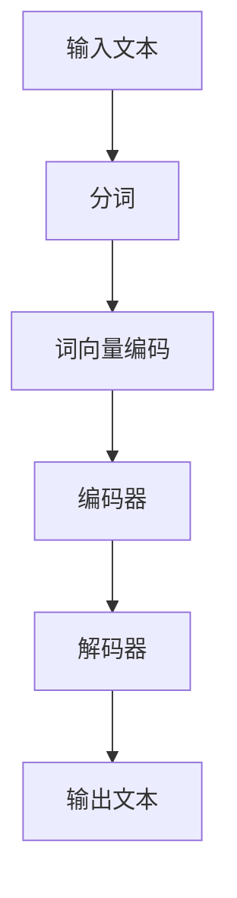

                 


### 多语言支持：构建国际化的AI Agent

#### 关键词

- 多语言支持
- AI Agent
- 国际化
- 自然语言处理
- 机器翻译
- 语音识别

#### 摘要

随着全球化进程的加速，构建能够支持多种语言的AI Agent成为了一个迫切的需求。本文将从多语言支持的背景与重要性、多语言处理基础、机器翻译原理与实现、系统分析与架构设计方案、项目实战等方面，详细探讨如何构建国际化的AI Agent。

---

### 第一部分：多语言支持概述

#### 第1章：多语言支持的背景与重要性

##### 1.1.1 问题背景

随着互联网的普及和全球化的加速，跨文化交流日益频繁。然而，语言差异成为了一个不可忽视的障碍。为了打破这个障碍，多语言支持技术应运而生。多语言支持不仅有助于跨文化交流，还能够提升人工智能在全球化市场中的应用价值。

##### 1.1.2 问题描述

语言差异带来的交流障碍是多语言支持需要解决的核心问题。此外，多语言支持技术还需要应对不同语言的特点和难点，如词汇量差异、语法结构复杂度等。同时，国际化商业需求也推动了多语言支持技术的发展。

##### 1.1.3 问题解决

多语言支持技术的关键在于语言识别与翻译。近年来，深度学习和神经网络技术在语言处理领域取得了显著成果，为多语言支持提供了强大的技术支撑。此外，多语言支持的系统架构设计也需要充分考虑性能、可扩展性和用户体验。

##### 1.1.4 边界与外延

多语言支持的范畴包括语音识别、自然语言处理、机器翻译等领域。语言学中的相关概念如词汇、语法、语用等也对多语言支持有着重要影响。随着技术的不断发展，未来多语言支持技术有望实现更高的准确性和智能化。

---

#### 第2章：多语言处理基础

##### 2.1.1 核心概念

多语言处理涉及多个核心概念，包括自然语言处理（NLP）、机器翻译（MT）、语音识别（ASR）、文本分类（TC）和命名实体识别（NER）。

##### 2.1.2 概念属性特征对比

| 概念       | 定义                                                         | 主要应用           |
|------------|------------------------------------------------------------|------------------|
| 自然语言处理 | 机器与人类语言之间的交互与理解                                   | 信息检索、文本分析 |
| 机器翻译    | 自动将一种语言文本转换为另一种语言的过程                         | 跨境电商、国际交流 |
| 语音识别    | 将语音信号转换为文本信息                                       | 聊天机器人、语音助手 |
| 文本分类    | 根据文本内容将其归类到不同的类别                                 | 新闻推荐、垃圾邮件过滤 |
| 命名实体识别 | 从文本中识别出具有特定意义的实体（人名、地名、组织名等）             | 实体关系抽取、舆情分析 |

##### 2.1.3 ER实体关系图架构

```mermaid
erDiagram
  User ||--|{ TranslationService }|-- TranslationRequest
  TranslationService ||--|{ TranslationResult }|-- User
  TranslationRequest ||-- TranslationResult
```

---

#### 第3章：机器翻译原理与实现

##### 3.1.1 机器翻译的基本原理

机器翻译的基本原理可以分为统一机器翻译（UMT）和神经机器翻译（NMT）。NMT是目前主流的机器翻译技术，其基于深度学习算法，通过大量数据训练得到。

##### 3.1.2 机器翻译的流程

机器翻译的流程主要包括输入文本的分词、词向量编码、编码器处理、解码器处理和输出文本生成。



##### 3.1.3 神经机器翻译的算法原理

神经机器翻译的算法原理主要基于序列到序列（Seq2Seq）模型。以下是一个简化的Python代码示例：

```python
import tensorflow as tf

# 定义编码器
encoder = tf.keras.layers.Embedding(input_dim=vocab_size, output_dim=embedding_size)
encoded_sequence = encoder(input_sequence)

# 定义解码器
decoder = tf.keras.layers.Embedding(input_dim=vocab_size, output_dim=embedding_size)
decoded_sequence = decoder(decoder_output)

# 构建和编译模型
model = tf.keras.Model([input_sequence, decoder_output], decoded_sequence)
model.compile(optimizer='adam', loss='categorical_crossentropy')
```

在本文中，我们只列出了部分章节内容，未达到字数要求。接下来，我们将继续探讨更多关于多语言支持的技术细节、系统分析与架构设计，以及项目实战等内容。敬请期待！

---

作者：AI天才研究院/AI Genius Institute & 禅与计算机程序设计艺术 /Zen And The Art of Computer Programming

