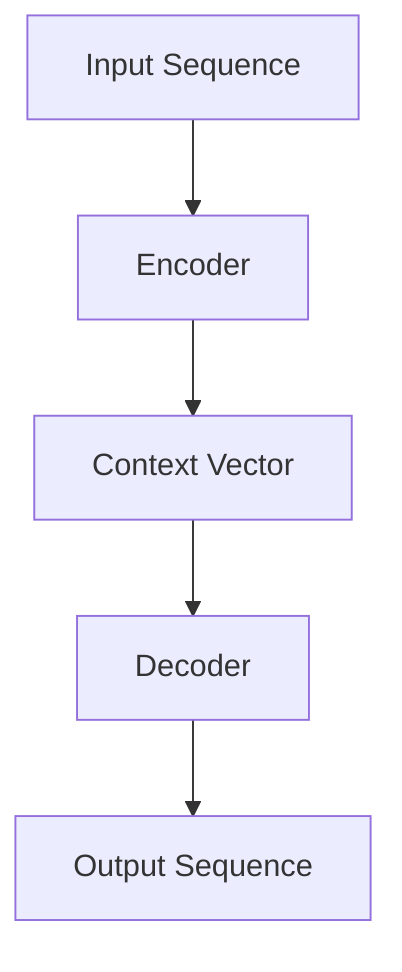
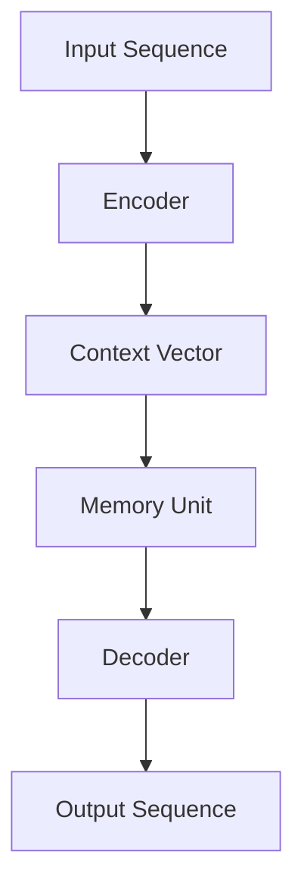
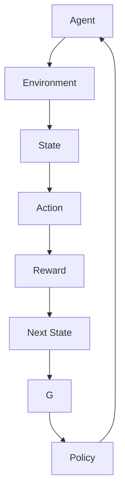
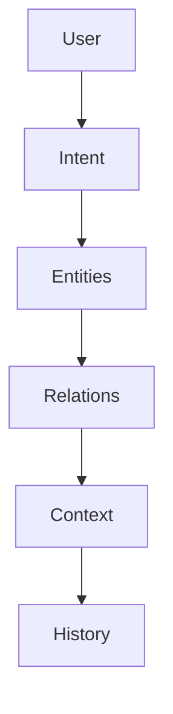
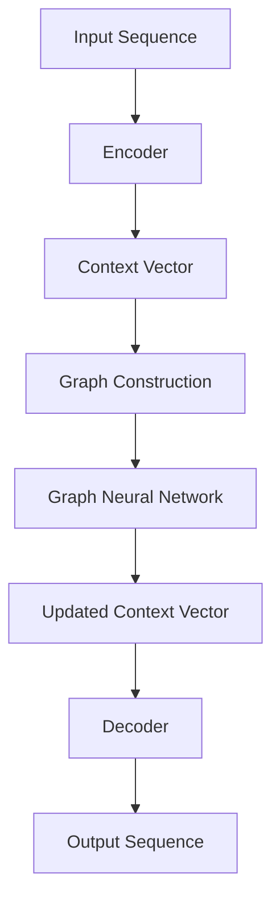
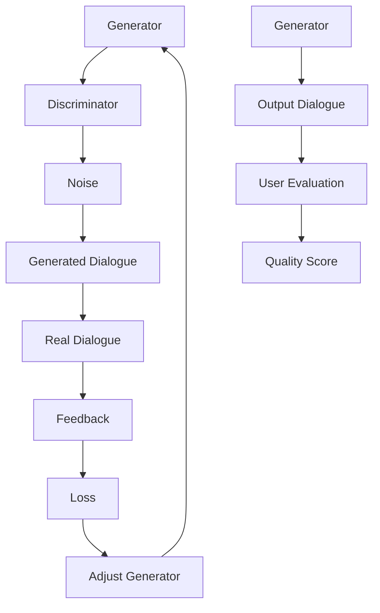

                 


## 1. 引言

### 1.1 研究背景

在当今数字化时代，人工智能（AI）技术以其强大的数据处理和分析能力，正在逐渐改变各行各业。其中，AI Agent——即具备智能交互能力的人工智能系统，已经成为现代对话系统研究与应用的热点。然而，随着对话交互场景的日益复杂，如何提高AI Agent的交互质量成为一个亟待解决的问题。

多轮对话处理作为对话系统研究的一个重要分支，旨在模拟人类对话过程中的交流方式，实现更自然、流畅的交互体验。相比于单轮对话，多轮对话能够更好地捕捉用户的意图和上下文信息，提高AI Agent对用户需求的响应能力。

### 1.2 问题定义

在多轮对话处理中，主要面临以下几个问题：

1. **对话状态追踪**：如何有效地追踪对话状态，以便在多轮对话中保持上下文的连贯性。
2. **对话上下文管理**：如何管理对话过程中的上下文信息，使其既能反映用户的意图，又能避免信息的冗余。
3. **对话生成与评估**：如何生成自然、合理的对话内容，并对其进行有效的评估。

### 1.3 核心概念与联系

为了解决上述问题，我们需要了解以下几个核心概念：

1. **对话系统架构**：对话系统的基本组成及其相互关系。
2. **对话管理**：对话过程中的决策机制和策略。
3. **自然语言处理（NLP）技术**：用于处理和理解自然语言的技术。

这些概念相互关联，构成了多轮对话处理的理论基础。

### 1.4 本书结构与内容安排

本书将分为以下六个部分：

1. **引言与背景**：介绍多轮对话处理的重要性、问题定义和核心概念。
2. **多轮对话处理基础**：探讨多轮对话模型的构建、对话状态追踪和对话上下文管理。
3. **自然语言处理与多轮对话**：分析词嵌入、命名实体识别、情感分析等技术及其在多轮对话中的应用。
4. **强化学习在多轮对话中的应用**：探讨强化学习在对话策略学习中的应用和挑战。
5. **多轮对话中的用户建模与个性化交互**：介绍用户建模、个性化对话系统设计和多模态交互。
6. **多轮对话系统评估与优化**：讨论对话系统的评估指标、优化策略和实践。

通过本书的阅读，读者将能够全面了解多轮对话处理的理论和实践，为构建高质量的AI对话系统提供指导。

----------------------------------------------------------------

## 2. 多轮对话处理基础

### 2.1 多轮对话模型

多轮对话模型是构建AI对话系统的核心。这些模型旨在模拟人类对话的过程，理解用户的意图，并生成合适的响应。以下是几种常用的多轮对话模型：

#### 2.1.1 序列到序列模型

序列到序列（Seq2Seq）模型是一种经典的对话生成模型。它通过编码器和解码器两个神经网络，将输入的对话序列映射为输出的对话序列。Seq2Seq模型的基本架构如下：



其中，编码器（Encoder）负责将输入序列编码为一个固定长度的上下文向量（Context Vector），解码器（Decoder）则根据上下文向量生成对话响应。

#### 2.1.2 基于记忆的网络

基于记忆的网络（Memory-augmented Neural Networks, Memory-aNN）在Seq2Seq模型的基础上引入了记忆机制。这种模型通过额外的记忆单元来存储对话过程中的重要信息，从而提高对话系统的理解和生成能力。

Memory-aNN的基本架构如下：



其中，记忆单元（Memory Unit）用于存储和检索对话过程中的关键信息，解码器（Decoder）则在生成对话响应时利用这些信息。

#### 2.1.3 深度强化学习模型

深度强化学习（Deep Reinforcement Learning, DRL）模型通过模仿人类决策过程，使对话系统能够在学习过程中不断优化自身策略。DRL模型的基本架构如下：



其中，智能体（Agent）通过与环境（Environment）的交互来学习最佳策略（Policy）。在多轮对话中，状态（State）包括对话历史、用户意图和上下文信息，动作（Action）是对话系统的输出，奖励（Reward）是用户对系统输出的反馈。

### 2.2 对话状态追踪

对话状态追踪是确保多轮对话连贯性的关键。它涉及到如何有效地存储和更新对话状态，以便在后续对话中能够继续理解用户意图。

#### 2.2.1 基于知识图谱的方法

基于知识图谱的方法通过构建知识图谱来表示对话状态。这种方法能够将对话中的实体、关系和属性组织成一个结构化的数据模型，从而提高对话系统的理解能力。

以下是基于知识图谱的对话状态追踪的一个ER实体关系图架构：



其中，用户（User）表示参与对话的人，意图（Intent）表示用户的请求或问题，实体（Entities）和关系（Relations）用于表示对话中的关键信息，上下文（Context）用于记录对话历史，历史（History）用于追踪对话过程。

#### 2.2.2 基于图神经网络的方法

基于图神经网络（Graph Neural Networks, GNN）的方法通过图结构来表示对话状态，并利用图神经网络来学习状态之间的关联性。这种方法能够更好地捕捉对话中的复杂关系。

以下是基于图神经网络的对话状态追踪的一个Mermaid流程图：



其中，输入序列（Input Sequence）表示对话过程中的输入信息，编码器（Encoder）负责将输入序列编码为上下文向量，图构造（Graph Construction）用于构建图结构，图神经网络（Graph Neural Network）用于更新上下文向量，解码器（Decoder）则根据更新的上下文向量生成输出序列。

### 2.3 对话上下文管理

对话上下文管理是确保对话连贯性和准确性的重要环节。它涉及到如何有效地编码、更新和利用对话上下文信息。

#### 2.3.1 上下文编码

上下文编码是将对话中的信息转换为机器可以理解的形式。常用的方法包括词嵌入、句子嵌入和对话嵌入。

以下是上下文编码的一个Python代码示例：

```python
import tensorflow as tf
from tensorflow.keras.layers import Embedding, LSTM, Dense
from tensorflow.keras.models import Model

# 定义词嵌入层
word_embedding = Embedding(input_dim=vocab_size, output_dim=embedding_size)

# 定义LSTM层
lstm = LSTM(units=lstm_units)

# 定义全连接层
dense = Dense(units=dense_units, activation='relu')

# 构建模型
inputs = tf.keras.Input(shape=(max_sequence_length,))
encoded_sequence = word_embedding(inputs)
encoded_context = lstm(encoded_sequence)
context_vector = dense(encoded_context)

# 编译模型
model = Model(inputs=inputs, outputs=context_vector)
model.compile(optimizer='adam', loss='mean_squared_error')

# 训练模型
model.fit(x_train, y_train, epochs=10, batch_size=32)
```

在这个示例中，我们使用词嵌入层将输入序列转换为嵌入向量，然后通过LSTM层和全连接层来编码上下文信息。

#### 2.3.2 上下文更新策略

上下文更新策略用于在对话过程中动态调整上下文信息。一种常用的方法是基于时间衰减的上下文加权。

以下是上下文更新策略的一个Python代码示例：

```python
import numpy as np

def update_context(context, new_context, alpha=0.5):
    """
    更新上下文信息。

    :param context: 当前上下文信息。
    :param new_context: 新的上下文信息。
    :param alpha: 时间衰减系数。
    :return: 更新后的上下文信息。
    """
    return (1 - alpha) * context + alpha * new_context

# 示例
current_context = np.array([0.1, 0.2, 0.3])
new_context = np.array([0.4, 0.5, 0.6])
alpha = 0.5

updated_context = update_context(current_context, new_context, alpha)
print("Updated Context:", updated_context)
```

在这个示例中，我们使用时间衰减系数`alpha`来平衡当前上下文和新上下文的重要性，从而更新上下文信息。

### 2.4 对话生成与评估

对话生成与评估是多轮对话处理的重要环节。对话生成旨在生成自然、合理的对话内容，而对话评估则用于衡量对话系统的性能和用户满意度。

#### 2.4.1 生成对抗网络

生成对抗网络（Generative Adversarial Networks, GAN）是一种强大的对话生成模型。它通过对抗训练来生成高质量的对话内容。

以下是生成对抗网络的一个Mermaid流程图：



其中，生成器（Generator）生成对话内容，判别器（Discriminator）判断对话内容是否真实，噪声（Noise）用于生成对抗样本，真实对话（Real Dialogue）和生成对话（Generated Dialogue）用于计算损失函数，并根据反馈调整生成器。

#### 2.4.2 评价指标与评估方法

常用的对话评价指标包括交互质量、响应时间、用户满意度等。以下是一个评价方法的Python代码示例：

```python
from sklearn.metrics import accuracy_score, precision_score, recall_score, f1_score

def evaluate_dialogue的真实对话，生成对话：
    """
    评估对话系统的性能。

    :param real_dialogue: 真实对话。
    :param generated_dialogue: 生成对话。
    :return: 评估结果。
    """
    # 计算准确率
    accuracy = accuracy_score(real_dialogue, generated_dialogue)
    
    # 计算精确率
    precision = precision_score(real_dialogue, generated_dialogue, average='weighted')
    
    # 计算召回率
    recall = recall_score(real_dialogue, generated_dialogue, average='weighted')
    
    # 计算F1分数
    f1 = f1_score(real_dialogue, generated_dialogue, average='weighted')
    
    return accuracy, precision, recall, f1

# 示例
real_dialogue = ['你好', '我想了解关于人工智能的信息']
generated_dialogue = ['你好', '人工智能是一种模拟人类智能的技术']

accuracy, precision, recall, f1 = evaluate_dialogue(real_dialogue, generated_dialogue)
print("Accuracy:", accuracy)
print("Precision:", precision)
print("Recall:", recall)
print("F1 Score:", f1)
```

在这个示例中，我们使用准确率、精确率、召回率和F1分数来评估对话系统的性能。

通过上述基础部分的介绍，我们对多轮对话处理有了初步的认识。在接下来的章节中，我们将进一步探讨自然语言处理、强化学习、用户建模与个性化交互等方面的应用，以实现高质量的AI对话系统。

