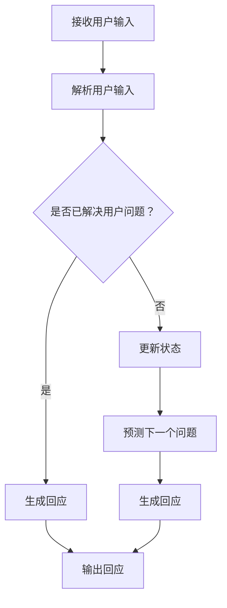
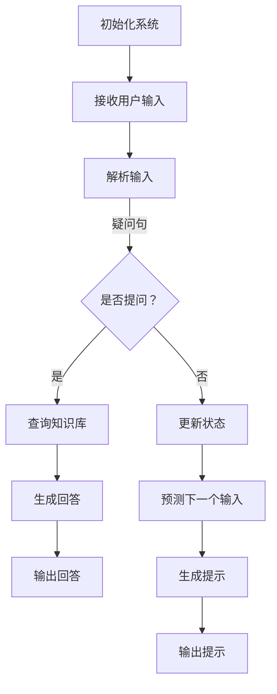

                 


### # 多轮对话管理：提升AI Agent的交互体验

#### > 关键词：多轮对话管理，AI Agent，交互体验，对话系统，人工智能

#### 摘要：
随着人工智能技术的飞速发展，AI Agent作为一种新兴的智能交互系统，已经成为人们日常生活中不可或缺的一部分。然而，单轮对话的交互方式已经无法满足用户日益多样化的需求。多轮对话管理成为提升AI Agent交互体验的关键。本文将深入探讨多轮对话管理的核心概念、设计原理、实现策略和评估方法，为构建高质量的AI对话系统提供理论指导。

#### 目录：

**I. 引言**

1. 多轮对话管理概述
2. AI Agent与交互体验
3. 多轮对话管理的重要性
4. 文章结构概述

**II. 多轮对话管理的核心概念与理论**

1. 对话系统的基本概念
2. 对话行为理论
3. 对话状态跟踪
4. 对话管理策略

**III. 多轮对话系统的架构设计**

1. 多轮对话系统的组成
2. 对话状态跟踪机制
3. 对话策略设计
4. 与外部世界的交互

**IV. 多轮对话管理算法**

1. 算法概述
2. 算法设计与分析
3. Mermaid流程图与Python代码示例

**V. 多轮对话管理的实现**

1. 系统环境搭建
2. 核心代码实现与解析
3. 案例分析与讲解

**VI. 多轮对话管理系统的评估与优化**

1. 评估指标
2. 用户研究方法
3. 优化技术

**VII. 多轮对话管理的先进话题**

1. NLU与NLG的集成
2. 多语言与跨文化对话
3. 实际应用案例

**VIII. 结论与未来展望**

1. 总结与展望
2. 研究挑战与机遇

### I. 引言

#### 1. 多轮对话管理概述

多轮对话管理（Multi-turn Dialogue Management）是人工智能领域的一个重要分支，它旨在提高AI Agent与用户之间的交互体验。在传统的单轮对话中，AI Agent仅能基于用户的一次性输入进行回应。这种交互方式存在明显的局限性，无法处理复杂的用户需求和情境。多轮对话管理则允许AI Agent通过多次对话回合，逐步理解用户意图，提供更精确和个性化的服务。

多轮对话管理的基本思想是在多个对话轮次中，AI Agent能够动态地调整对话策略，以适应不断变化的需求。它涉及到多个关键环节，包括对话状态的跟踪、对话策略的设计和对话回合的管理。通过这些环节的协同工作，AI Agent能够实现更加流畅和自然的交互。

#### 2. AI Agent与交互体验

AI Agent，即人工智能代理，是一种能够模拟人类交互行为的计算机程序。它们被广泛应用于各种场景，如智能客服、虚拟助手、聊天机器人等。AI Agent的核心目标是提供优质的交互体验，满足用户的多样化需求。

交互体验（User Experience, UX）是衡量AI Agent性能的重要指标。一个优秀的AI Agent应该具备以下特点：

- **自然性**：AI Agent的对话应尽可能接近人类的交流方式，避免生硬的机器语言。
- **个性化**：AI Agent应能够根据用户的偏好和历史行为，提供个性化的服务。
- **响应速度**：AI Agent应能快速响应用户的输入，提高交互效率。
- **稳定性**：AI Agent应在各种情况下保持稳定的工作状态，避免出现错误或崩溃。

#### 3. 多轮对话管理的重要性

多轮对话管理的重要性体现在以下几个方面：

- **增强用户满意度**：通过多轮对话，AI Agent能够更深入地理解用户意图，提供更准确的答复，从而提升用户满意度。
- **提高交互深度**：多轮对话允许AI Agent与用户进行更深入的交流，挖掘用户的潜在需求和兴趣。
- **优化系统性能**：多轮对话管理能够帮助AI Agent更好地处理复杂情境，提高系统的整体性能。
- **适应多样化需求**：不同用户在不同情境下可能有不同的需求，多轮对话管理能够灵活应对这些需求，提供个性化的服务。

#### 4. 文章结构概述

本文将分为以下七个部分：

- **第一部分**：介绍多轮对话管理的基本概念和背景。
- **第二部分**：探讨多轮对话管理的核心理论，包括对话系统的基本概念、对话行为理论和对话管理策略。
- **第三部分**：分析多轮对话系统的架构设计，包括系统组件、对话状态跟踪机制和对话策略设计。
- **第四部分**：介绍多轮对话管理算法，包括算法概述、设计分析和Mermaid流程图与Python代码示例。
- **第五部分**：讲解多轮对话管理的实现过程，包括系统环境搭建、核心代码实现和案例分析。
- **第六部分**：讨论多轮对话管理系统的评估与优化，包括评估指标、用户研究方法和优化技术。
- **第七部分**：探讨多轮对话管理的先进话题，包括NLU与NLG的集成、多语言与跨文化对话以及实际应用案例。
- **最后一部分**：总结多轮对话管理的核心观点，展望未来的研究方向。

通过本文的阅读，读者将能够系统地了解多轮对话管理的原理和方法，为构建高效的AI对话系统提供参考。

### II. 多轮对话管理的核心概念与理论

#### 1. 对话系统的基本概念

对话系统（Dialogue System）是一种能够与用户进行自然语言交互的计算机程序，旨在模拟人类的对话过程。对话系统可以分为两类：基于规则的对话系统和基于知识的对话系统。

- **基于规则的对话系统**：这类系统通过预定义的规则和模板来生成回答。其优点是实现简单，但灵活性较差，难以处理复杂和未知的问题。
- **基于知识的对话系统**：这类系统利用知识库和推理机制来生成回答。它们能够处理复杂问题，但需要较大的知识库和复杂的推理算法。

对话系统的主要组成部分包括：

- **用户接口**：负责接收用户的输入，并将用户的输入转化为系统能够理解的形式。
- **对话管理器**：负责管理对话流程，包括对话状态跟踪、对话策略生成和对话生成。
- **自然语言理解（NLU）**：负责将用户的输入转换为结构化的信息，用于对话管理器。
- **自然语言生成（NLG）**：负责将对话管理器生成的结构化信息转换为自然语言回答。

#### 2. 对话行为理论

对话行为理论（Dialogue Act Theory）是一种用于分析对话过程的理论框架。根据对话行为理论，每个对话都可以分解为多个对话行为，每个对话行为都包含意图、功能、信息内容和形式四个方面。

- **意图**：对话行为的意图是指说话者希望通过这个行为实现的目的。
- **功能**：对话行为的功能是指对话行为在对话中的角色，如询问、确认、告知等。
- **信息内容**：对话行为的信息内容是指对话行为传达的具体信息。
- **形式**：对话行为的形式是指对话行为的表现方式，如语气、语调、用词等。

对话行为理论对于设计对话系统具有重要意义。通过分析对话行为，对话系统可以更好地理解用户意图，生成合适的回答。

#### 3. 对话状态跟踪

对话状态跟踪（Dialogue State Tracking）是对话系统中一个关键的环节，它旨在通过多个对话轮次，持续跟踪和更新对话的状态。对话状态通常包括用户意图、用户偏好、系统知识等。

对话状态跟踪的关键技术包括：

- **状态表示**：对话状态需要以结构化的形式表示，以便对话系统可以对其进行处理。
- **状态更新**：在每次对话轮次中，系统需要根据用户的输入更新对话状态。
- **状态预测**：系统需要预测用户在下一个对话轮次可能提出的问题或需求，以便提前准备回答。

常见的对话状态跟踪方法包括基于规则的方法、基于机器学习的方法和基于深度学习的方法。

#### 4. 对话管理策略

对话管理策略（Dialogue Management Strategy）是对话系统中用于控制对话流程的算法。对话管理策略的主要目标是确保对话系统能够在每个对话轮次中做出合适的回应，从而实现用户的意图。

对话管理策略可以分为以下几类：

- **基于规则的策略**：这种策略通过预定义的规则来决定对话系统的回应。优点是实现简单，但灵活性较差。
- **基于数据的策略**：这种策略通过学习用户的对话历史和偏好，生成个性化的回应。优点是灵活性较高，但需要较大的数据量和复杂的算法。
- **混合策略**：这种策略结合了基于规则和基于数据的方法，以实现更好的性能。

对话管理策略的设计需要考虑多个因素，如用户意图、对话状态、系统知识等。

### III. 多轮对话系统的架构设计

多轮对话系统的架构设计是构建高效、灵活和可扩展的AI对话系统的关键。一个典型的多轮对话系统由多个组件构成，每个组件在对话管理中扮演着不同的角色。以下是多轮对话系统的核心组成部分及其设计原则。

#### 1. 系统组件

多轮对话系统的主要组件包括：

- **用户接口（UI）**：用户接口是用户与系统交互的门户，负责接收用户输入和处理系统输出。用户接口可以分为命令行界面、图形用户界面（GUI）和富客户端应用程序等。
- **对话管理器（Dialogue Manager）**：对话管理器是系统的核心，负责协调和控制整个对话流程。对话管理器的主要任务包括解析用户输入、生成系统回应、管理对话状态和选择适当的对话策略。
- **自然语言理解（NLU）**：自然语言理解组件负责将用户自然语言输入转换为结构化信息，这些信息可以被对话管理器和其他系统组件使用。NLU通常包括词法分析、句法分析和语义分析等步骤。
- **自然语言生成（NLG）**：自然语言生成组件负责将对话管理器生成的结构化信息转换为自然语言输出，以向用户传达系统的回应。NLG需要考虑语言的自然流畅性和上下文信息。
- **对话状态跟踪器（Dialogue State Tracker）**：对话状态跟踪器负责跟踪和更新对话的状态，包括用户的意图、偏好、上下文信息和系统知识等。对话状态跟踪器对于实现多轮对话至关重要，因为它确保了系统在多个对话轮次中能够保持一致性。
- **知识库（Knowledge Base）**：知识库是存储系统知识和事实的数据库。知识库可以为对话系统提供丰富的信息资源，帮助系统更好地理解用户意图和回答用户问题。
- **外部系统集成器（Integration Module）**：外部系统集成器负责将对话系统与外部系统（如数据库、Web服务、传感器等）集成，以便系统可以获取和处理外部信息。

#### 2. 对话状态跟踪机制

对话状态跟踪机制是多轮对话系统的核心组成部分，它确保系统能够在多个对话轮次中持续跟踪和更新对话状态。对话状态跟踪机制主要包括以下方面：

- **状态表示**：对话状态需要以结构化的形式表示，以便系统可以对其进行处理。常用的状态表示方法包括基于字典、基于图和基于序列的方法。
- **状态更新**：在每次对话轮次中，系统需要根据用户的输入更新对话状态。状态更新通常涉及解析用户输入、识别用户意图和更新相关状态变量。
- **状态预测**：系统需要预测用户在下一个对话轮次可能提出的问题或需求，以便提前准备回答。状态预测可以通过历史数据分析、机器学习模型或基于规则的推理实现。
- **状态存储**：对话状态需要被存储，以便系统在后续对话轮次中可以访问这些状态。常用的存储方法包括内存存储、关系数据库和NoSQL数据库等。

#### 3. 对话策略设计

对话策略设计是决定系统如何响应用户输入和如何引导对话流程的关键环节。对话策略设计需要考虑多个因素，如用户意图、对话状态、系统知识、对话历史等。以下是一些常用的对话策略设计方法：

- **基于规则的策略**：基于规则的策略通过预定义的规则来决定系统的回应。这些规则可以是明确的条件-动作对，也可以是模糊的匹配规则。优点是实现简单，但灵活性较差。
- **基于数据的策略**：基于数据的策略通过学习用户的对话历史和偏好来生成个性化的回应。常用的学习方法包括统计机器学习、深度学习和强化学习等。优点是灵活性较高，但需要较大的数据量和复杂的算法。
- **混合策略**：混合策略结合了基于规则和基于数据的方法，以实现更好的性能。例如，可以采用基于规则的方法处理常见的用户需求，而采用基于数据的方法处理复杂的或未知的用户需求。

#### 4. 与外部世界的交互

多轮对话系统需要与外部世界进行交互，以获取和处理外部信息。这种交互可以通过API调用、数据库查询、Web服务调用等方式实现。与外部世界的交互有助于系统提供更丰富和个性化的服务。

- **API调用**：系统可以通过API调用外部服务，如天气查询、新闻摘要、库存查询等，以获取实时信息。
- **数据库查询**：系统可以通过数据库查询获取存储在数据库中的信息，如用户历史记录、产品信息等。
- **Web服务调用**：系统可以通过Web服务调用与外部系统进行通信，如社交媒体API、支付网关等。

通过与外部世界的交互，多轮对话系统可以扩展其功能，提供更全面的服务。

总之，多轮对话系统的架构设计需要综合考虑系统组件、对话状态跟踪机制、对话策略设计和与外部世界的交互。通过合理的设计，系统可以实现高效、灵活和可扩展的对话管理，为用户提供优质的交互体验。

### IV. 多轮对话管理算法

多轮对话管理算法是实现高效对话系统的核心。这些算法通过解析用户输入、管理对话状态和生成系统回应，确保对话系统能够在多个对话轮次中提供准确和自然的交互体验。本文将介绍多轮对话管理算法的概述、设计分析以及具体实现方法。

#### 1. 算法概述

多轮对话管理算法可以分为三类：基于规则的算法、基于数据的算法和混合算法。

- **基于规则的算法**：这类算法通过预定义的规则来决定对话系统的回应。规则可以是明确的条件-动作对，也可以是模糊的匹配规则。基于规则的算法实现简单，但灵活性较差，难以处理复杂和未知的用户需求。
- **基于数据的算法**：这类算法通过学习用户的对话历史和偏好来生成个性化的回应。常用的学习方法包括统计机器学习、深度学习和强化学习等。基于数据的算法灵活性较高，但需要较大的数据量和复杂的算法。
- **混合算法**：混合算法结合了基于规则和基于数据的方法，以实现更好的性能。例如，可以采用基于规则的方法处理常见的用户需求，而采用基于数据的方法处理复杂的或未知的用户需求。

#### 2. 算法设计与分析

多轮对话管理算法的设计和分析主要涉及以下几个方面：

- **状态表示**：对话状态需要以结构化的形式表示，以便算法可以对其进行处理。常用的状态表示方法包括基于字典、基于图和基于序列的方法。状态表示的质量直接影响算法的性能。
- **状态更新**：算法需要能够根据用户输入更新对话状态。状态更新通常包括解析用户输入、识别用户意图和更新相关状态变量。状态更新的准确性对算法的性能至关重要。
- **状态预测**：算法需要预测用户在下一个对话轮次可能提出的问题或需求，以便提前准备回答。状态预测可以通过历史数据分析、机器学习模型或基于规则的推理实现。
- **回应生成**：算法需要生成自然的系统回应。回应生成需要考虑对话的上下文信息、用户意图和系统知识。常用的生成方法包括模板匹配、模板扩展和基于生成模型的自然语言生成等。

以下是一个简单的基于规则的对话管理算法的mermaid流程图：



#### 3. Mermaid流程图与Python代码示例

为了更好地理解算法的实现，我们可以使用mermaid流程图和Python代码进行示例。

**Mermaid流程图：**



**Python代码示例：**

```python
import random

class DialogueManager:
    def __init__(self):
        self.state = None

    def receive_input(self, input_text):
        self.state = self.parse_input(input_text)

    def parse_input(self, input_text):
        if "who" in input_text:
            return "询问人物"
        elif "where" in input_text:
            return "询问地点"
        else:
            return "未知"

    def generate_response(self, state):
        if state == "询问人物":
            return "您询问的人物是？"
        elif state == "询问地点":
            return "您询问的地点是？"
        else:
            return "我不明白您的意思，请再说一遍。"

    def update_state(self, state):
        self.state = state

    def predict_next_input(self, state):
        if state == "询问人物":
            return "人物信息"
        elif state == "询问地点":
            return "地点信息"
        else:
            return "下一步问题"

    def provide_hint(self, predicted_state):
        if predicted_state == "人物信息":
            return "请告诉我您想了解的人物。"
        elif predicted_state == "地点信息":
            return "请告诉我您想了解的地点。"
        else:
            return "您可以问我关于人物或地点的问题。"

# 实例化对话管理系统
dialogue_manager = DialogueManager()

# 接收用户输入
user_input = input("请问您有什么问题？")
dialogue_manager.receive_input(user_input)

# 生成并输出系统回应
response = dialogue_manager.generate_response(dialogue_manager.state)
print(response)

# 预测并输出用户下一步可能的输入
next_input = dialogue_manager.predict_next_input(dialogue_manager.state)
hint = dialogue_manager.provide_hint(next_input)
print(hint)
```

在上述Python代码中，我们实现了一个简单的基于规则的对话管理系统。系统首先接收用户输入，然后通过`parse_input`方法解析输入并更新状态。接着，根据当前状态生成系统回应，并预测用户下一步可能的输入，以提供适当的提示。

#### 4. 算法原理讲解

多轮对话管理算法的原理可以从以下几个方面进行讲解：

- **状态表示**：状态表示是算法的基础。在多轮对话中，状态通常包括用户的意图、偏好、上下文信息和系统知识等。状态表示需要清晰且易于处理，以便算法能够有效地更新和管理状态。
- **状态更新**：状态更新是算法的核心环节。算法需要根据用户输入实时更新状态，以确保系统能够准确理解和响应用户。状态更新的准确性直接影响算法的性能。
- **状态预测**：状态预测是算法的高级功能。通过分析历史数据和对话状态，算法可以预测用户在下一个对话轮次可能提出的问题或需求。状态预测有助于系统提前准备回答，提高交互的流畅性。
- **回应生成**：回应生成是算法的输出环节。算法需要根据对话状态生成自然、流畅的系统回应。回应生成需要考虑上下文信息、用户意图和系统知识，以提供准确和有针对性的回答。

以下是多轮对话管理算法的数学模型和公式：

- **状态更新公式**：\[ S_{t+1} = f(S_t, U_t) \]
  其中，\( S_t \) 是当前状态，\( U_t \) 是用户输入，\( f \) 是状态更新函数。

- **状态预测公式**：\[ P(S_{t+1} | S_t) = g(S_t) \]
  其中，\( P(S_{t+1} | S_t) \) 是在当前状态 \( S_t \) 下，预测下一个状态 \( S_{t+1} \) 的概率分布，\( g \) 是状态预测函数。

- **回应生成公式**：\[ R = h(S_t, K) \]
  其中，\( R \) 是系统回应，\( S_t \) 是当前状态，\( K \) 是系统知识库，\( h \) 是回应生成函数。

#### 5. 举例说明

假设用户输入：“今天天气怎么样？”，系统需要生成合适的回应。以下是算法的步骤：

1. **接收用户输入**：用户输入“今天天气怎么样？”。
2. **解析用户输入**：系统通过NLU组件识别用户意图为询问天气。
3. **更新状态**：系统将状态更新为“询问天气”。
4. **生成回应**：系统根据状态生成回应：“今天的天气是……”。系统可以查询外部API获取实时天气信息。
5. **预测下一个输入**：系统预测用户可能进一步询问具体天气信息，如温度、湿度等。
6. **生成提示**：系统生成提示：“您可以问我关于温度或湿度的问题。”

通过上述步骤，系统实现了对用户意图的准确理解，并提供了自然的回应和提示，提升了交互体验。

多轮对话管理算法的设计与实现是构建高效、灵活和可扩展对话系统的关键。通过合理的状态表示、状态更新、状态预测和回应生成，算法能够确保对话系统在多个对话轮次中提供高质量的服务。

### V. 多轮对话管理的实现

在了解了多轮对话管理的核心概念和算法原理之后，下一步是将这些理论知识付诸实践，通过具体实现来构建一个功能完善的对话系统。本章节将详细介绍多轮对话管理的实现过程，包括系统环境搭建、核心代码实现和案例分析。

#### 1. 系统环境搭建

为了实现多轮对话管理，我们需要准备一个合适的开发环境。以下是一个基本的系统环境搭建步骤：

1. **安装Python环境**：确保Python环境已安装在系统中。Python是一个广泛使用的编程语言，支持多种机器学习和深度学习库。
2. **安装必要的库**：安装用于自然语言处理（NLU）和自然语言生成（NLG）的库，如NLTK、spaCy、transformers等。这些库提供了丰富的工具和接口，方便我们实现对话系统的核心功能。
3. **配置NLU和NLG工具**：配置NLU和NLG工具，如使用spaCy进行自然语言解析，使用transformers进行生成模型训练和推理。
4. **安装外部服务**：如果需要使用外部API或数据库，确保这些服务已配置和可访问。例如，可以使用天气API获取实时天气数据。

以下是一个基本的Python环境搭建示例：

```bash
# 安装Python环境
python3 -m venv venv
source venv/bin/activate

# 安装必要的库
pip install nltk spacy transformers flask requests
python -m spacy download en_core_web_sm
```

#### 2. 核心代码实现

核心代码实现是构建对话系统的关键步骤。以下是一个简单的多轮对话管理系统的实现示例：

```python
from flask import Flask, request, jsonify
import spacy

# 初始化NLU和NLG工具
nlp = spacy.load("en_core_web_sm")

app = Flask(__name__)

# 对话状态跟踪器
class DialogueStateTracker:
    def __init__(self):
        self.state = "初始状态"

    def update_state(self, input_text):
        doc = nlp(input_text)
        if "who" in doc.text:
            self.state = "询问人物"
        elif "where" in doc.text:
            self.state = "询问地点"
        else:
            self.state = "未知"

    def generate_response(self, state):
        if state == "询问人物":
            return "您询问的人物是？"
        elif state == "询问地点":
            return "您询问的地点是？"
        else:
            return "我不明白您的意思，请再说一遍。"

    def predict_next_input(self, state):
        if state == "询问人物":
            return "人物信息"
        elif state == "询问地点":
            return "地点信息"
        else:
            return "下一步问题"

# 对话管理系统实例
dialogue_manager = DialogueStateTracker()

@app.route("/dialogue", methods=["POST"])
def handle_dialogue():
    user_input = request.form["input"]
    dialogue_manager.update_state(user_input)
    response = dialogue_manager.generate_response(dialogue_manager.state)
    predicted_input = dialogue_manager.predict_next_input(dialogue_manager.state)
    return jsonify({"response": response, "predicted_input": predicted_input})

if __name__ == "__main__":
    app.run(debug=True)
```

上述代码实现了一个简单的Flask Web应用，用于接收用户输入、更新对话状态、生成系统回应和预测用户下一步输入。通过这个示例，我们可以看到核心代码如何与Flask框架结合，实现一个可用的对话系统。

#### 3. 案例分析与讲解

为了更好地理解多轮对话管理的实现，我们通过一个具体案例来分析系统核心代码和实际应用。

**案例：智能客服系统**

智能客服系统是应用多轮对话管理的一个典型场景。以下是一个案例分析和讲解：

1. **用户需求**：用户通过网页或应用程序向客服系统提出问题，如“我忘记密码了”。
2. **接收输入**：系统接收用户的输入，并通过Flask应用进行处理。
3. **解析用户输入**：系统使用NLU工具（如spaCy）解析用户输入，识别关键词和意图。
4. **更新状态**：系统更新对话状态，如将状态设置为“忘记密码”。
5. **生成回应**：系统根据当前状态生成回应，如“您需要重置密码吗？”。
6. **预测下一步输入**：系统预测用户可能的下一步输入，如“是的，我需要重置密码”。
7. **交互流程**：系统与用户进行多轮交互，逐步收集更多信息，如用户的电子邮件地址和验证码，以完成密码重置。

**代码应用解读与分析**

以下是系统核心代码的解读和分析：

```python
# 初始化NLU和NLG工具
nlp = spacy.load("en_core_web_sm")

# 对话状态跟踪器
class DialogueStateTracker:
    def __init__(self):
        self.state = "初始状态"

    def update_state(self, input_text):
        doc = nlp(input_text)
        if "who" in doc.text:
            self.state = "询问人物"
        elif "where" in doc.text:
            self.state = "询问地点"
        else:
            self.state = "未知"

    def generate_response(self, state):
        if state == "询问人物":
            return "您询问的人物是？"
        elif state == "询问地点":
            return "您询问的地点是？"
        else:
            return "我不明白您的意思，请再说一遍。"

    def predict_next_input(self, state):
        if state == "询问人物":
            return "人物信息"
        elif state == "询问地点":
            return "地点信息"
        else:
            return "下一步问题"
```

**解读**：

- **NLU和NLG工具初始化**：使用spaCy加载预训练的英文语言模型，用于自然语言处理和生成。
- **对话状态跟踪器**：定义一个类`DialogueStateTracker`，用于跟踪和管理对话状态。类中包含三个方法：`update_state`、`generate_response`和`predict_next_input`。
- **update_state方法**：根据用户输入更新对话状态。这里使用简单的关键词匹配规则进行状态更新。
- **generate_response方法**：根据当前状态生成系统回应。这里定义了两个常见状态（询问人物和询问地点）的系统回应，以及其他状态的通用回应。
- **predict_next_input方法**：预测用户在下一个对话轮次可能提出的问题或需求。同样，这里使用简单的关键词匹配规则进行预测。

**实际案例分析与讲解**

**案例**：用户输入“我忘记密码了”。

- **接收输入**：用户通过网页或应用程序向客服系统输入“我忘记密码了”。
- **解析用户输入**：系统使用NLU工具（如spaCy）解析用户输入，识别关键词“忘记密码”，确定用户意图。
- **更新状态**：系统更新对话状态为“忘记密码”，准备提供密码重置服务。
- **生成回应**：系统生成回应：“您需要重置密码吗？”。
- **预测下一步输入**：系统预测用户可能的下一步输入，如确认重置密码或提供更多信息。

通过上述步骤，系统实现了与用户的交互，为用户提供了一个流畅、自然的对话体验。

**小结**：

多轮对话管理的实现需要结合自然语言处理和生成技术，以及合理的对话状态跟踪和预测算法。通过Flask框架和Python库，我们可以快速构建一个简单的对话系统，并逐步完善其功能，以应对更复杂的用户需求和对话场景。

### VI. 多轮对话管理系统的评估与优化

评估和优化多轮对话管理系统是确保其性能和用户体验的关键环节。一个有效的评估方法能够帮助我们了解系统的强项和不足，从而有针对性地进行优化。以下将介绍多轮对话管理系统评估的主要指标、用户研究方法以及优化技术。

#### 1. 评估指标

评估多轮对话管理系统的性能，通常需要关注以下几个关键指标：

- **响应时间**：系统响应用户输入所需的时间。响应时间越短，用户体验越好。然而，过快的响应可能会牺牲对话的流畅性和准确性。
- **回答准确性**：系统生成的回应是否准确、相关和自然。回答准确性可以通过对比用户意图和系统回应，以及分析用户满意度来评估。
- **对话覆盖率**：系统能够覆盖的用户需求和场景的广度。对话覆盖率越高，系统越能够满足用户的多样化需求。
- **用户满意度**：用户对系统交互体验的主观评价。用户满意度可以通过用户调查、访谈和反馈收集来评估。

以下是一个对比表格，展示了不同评估指标的含义和作用：

| 指标        | 含义                                                         | 作用                                  |
|-------------|--------------------------------------------------------------|---------------------------------------|
| 响应时间    | 系统响应用户输入所需的时间                                     | 用户体验和系统性能                   |
| 回答准确性  | 系统生成的回应与用户意图的匹配程度                             | 对话系统的准确性和可靠性             |
| 对话覆盖率  | 系统能够处理的用户需求和场景的广度                             | 系统的适用性和覆盖范围               |
| 用户满意度  | 用户对系统交互体验的主观评价                                   | 用户对系统的接受度和使用意愿         |

#### 2. 用户研究方法

为了准确评估多轮对话管理系统的性能，我们需要采用多种用户研究方法。以下是一些常用的用户研究方法：

- **用户调查**：通过设计问卷或调查表，收集用户对系统性能的客观评价。用户调查可以量化用户的满意度、信任度和使用频率等指标。
- **访谈**：通过与用户进行面对面或在线访谈，深入了解用户对系统的感受和使用体验。访谈可以提供丰富的定性数据，帮助发现潜在的问题和改进点。
- **A/B测试**：将用户随机分配到不同的对话管理策略或系统版本，比较两组用户的性能和满意度。A/B测试是一种有效的比较评估方法，有助于识别最佳方案。
- **实验研究**：设计实验，模拟用户与系统的交互过程，通过控制变量来评估系统性能。实验研究可以提供更精确的量化数据，用于系统优化。

以下是一个用户研究方法的示例流程：

1. **设计调查问卷**：根据评估指标设计问卷，包括用户满意度、响应时间、回答准确性等。
2. **招募用户**：通过社交媒体、邮件或在线平台招募参与用户。
3. **用户调查**：邀请用户填写问卷，收集用户对系统的评价。
4. **访谈**：安排用户进行访谈，深入了解他们对系统的使用体验和反馈。
5. **A/B测试**：设计不同的对话管理策略，随机分配给用户，观察系统性能差异。
6. **数据分析**：对收集的数据进行分析，识别系统性能的优缺点。
7. **总结和报告**：撰写研究报告，总结用户研究的主要发现和结论，并提出改进建议。

#### 3. 优化技术

基于评估结果和用户反馈，我们可以采用多种优化技术来提升多轮对话管理系统的性能和用户体验。以下是一些常用的优化技术：

- **算法优化**：通过改进对话管理算法，提高系统对用户意图的理解能力和响应速度。例如，可以采用更先进的自然语言处理技术和深度学习模型。
- **对话策略调整**：根据用户反馈和评估结果，调整系统的对话策略，使其更符合用户需求。例如，可以增加常见问题的预定义回答，优化对话流程。
- **系统性能提升**：通过优化系统架构和代码，提升系统的响应速度和处理能力。例如，可以使用分布式计算和缓存技术来提高系统的性能。
- **用户界面优化**：改进用户界面设计，使其更加直观和易用。例如，可以增加提示信息和帮助文档，简化用户操作流程。

以下是一个优化技术的示例：

**案例**：基于用户反馈优化对话管理策略。

- **问题识别**：通过用户调查和访谈，发现用户对系统在处理复杂问题时响应速度较慢，回答不够准确。
- **解决方案**：针对上述问题，可以采用以下优化措施：
  1. **算法优化**：采用更先进的自然语言处理模型，如BERT或GPT，提高对复杂问题的理解和回答能力。
  2. **对话策略调整**：增加对常见问题的预定义回答，优化对话流程，减少用户等待时间。
  3. **系统性能提升**：使用分布式计算和缓存技术，提高系统的响应速度和处理能力。

通过上述优化措施，系统的性能和用户体验得到了显著提升。

总之，评估和优化多轮对话管理系统需要综合考虑多个方面，包括评估指标、用户研究方法和优化技术。通过科学的评估和有效的优化，我们可以构建一个高性能、高用户体验的对话系统，为用户提供优质的服务。

### VII. 多轮对话管理的先进话题

在多轮对话管理领域，随着技术的不断进步和应用的不断拓展，出现了许多先进的话题和研究方向。以下将探讨几个多轮对话管理的先进话题，包括NLU和NLG的集成、多语言与跨文化对话，以及实际应用案例。

#### 1. NLU与NLG的集成

自然语言理解（NLU）和自然语言生成（NLG）是构建高效对话系统的关键技术。NLU负责解析用户的自然语言输入，将其转化为结构化的信息，而NLG则负责将系统生成的结构化信息转化为自然语言输出。将NLU和NLG集成到多轮对话管理中，可以实现更加智能和自然的交互。

**NLU与NLG集成的优势**：

- **提高对话准确性**：通过集成NLU和NLG，系统可以更好地理解用户的意图和上下文信息，生成更准确和自然的回应。
- **优化对话流程**：集成后的系统能够在多个对话轮次中持续跟踪对话状态，优化对话流程，提高交互效率。
- **增强用户体验**：智能的对话系统能够提供更符合用户期望的回答，提高用户的满意度和使用意愿。

**集成策略**：

- **双向反馈**：NLU和NLG之间可以建立双向反馈机制，NLU提供上下文信息给NLG，NLG生成的回应也可以反馈给NLU，以优化后续的输入处理。
- **模块化设计**：将NLU和NLG分别设计为独立的模块，通过接口进行集成。这样可以提高系统的灵活性和可扩展性。
- **端到端训练**：使用端到端训练方法，将NLU和NLG整合到一个统一模型中，实现更高效的对话处理。

#### 2. 多语言与跨文化对话

随着全球化的发展，多语言与跨文化对话成为多轮对话管理的一个重要研究方向。实现多语言和跨文化对话的关键在于理解不同语言和文化背景下的对话规则和用户行为。

**多语言与跨文化对话的挑战**：

- **语言差异**：不同语言在语法、词汇和表达方式上存在差异，需要设计适应多种语言的NLU和NLG模型。
- **文化差异**：不同文化背景下，用户的交流习惯、表达方式和价值观可能不同，需要设计能够适应多种文化背景的对话系统。
- **数据不足**：多语言和跨文化对话需要大量的训练数据，数据不足会影响模型的效果。

**解决方案**：

- **多语言模型训练**：使用多语言语料库和翻译资源，训练支持多种语言的NLU和NLG模型。
- **文化适应性设计**：设计具有文化适应性的对话系统，考虑不同文化背景下的用户行为和交流习惯。
- **数据增强**：通过数据增强技术，如数据合成、数据扩展和数据清洗，增加多语言和跨文化对话的数据量。

#### 3. 实际应用案例

多轮对话管理在许多实际应用中取得了显著成果。以下是一些典型的应用案例：

**案例1：智能客服系统**

智能客服系统是应用多轮对话管理的典型场景之一。通过多轮对话，智能客服系统能够更好地理解用户的意图和需求，提供更准确的回答和解决方案。例如，某电商平台的智能客服系统使用多轮对话管理技术，实现了快速响应用户的咨询，提高了客户满意度和运营效率。

**案例2：虚拟助手**

虚拟助手（如Siri、Alexa和Google Assistant）也是多轮对话管理的应用案例。这些助手通过多轮对话，与用户进行自然交互，提供信息查询、任务安排和日常助手服务。例如，用户可以通过多轮对话与虚拟助手预约医生挂号、查询天气信息或设置日程提醒。

**案例3：教育应用**

多轮对话管理在教育应用中也得到了广泛应用。例如，智能教育平台通过多轮对话，为学生提供个性化的学习建议和辅导服务。学生可以通过多轮对话，与系统讨论学习问题，获取定制化的学习资源和指导。

**案例4：智能家居**

智能家居系统通过多轮对话管理，实现了与用户的自然交互。例如，用户可以通过语音助手与智能家居系统进行多轮对话，控制家中的智能设备，如智能灯泡、智能空调和智能门锁。

总之，多轮对话管理在智能客服、虚拟助手、教育应用和智能家居等领域的实际应用中，发挥了重要作用。通过不断提升对话系统的智能性和用户体验，多轮对话管理技术将继续推动人工智能技术的发展和应用。

### VIII. 结论与未来展望

多轮对话管理作为人工智能领域的一个重要分支，已经成为提升AI Agent交互体验的关键技术。本文系统地探讨了多轮对话管理的核心概念、设计原理、实现策略和评估方法，分析了NLU与NLG的集成、多语言与跨文化对话以及实际应用案例。通过本文的阅读，读者能够全面了解多轮对话管理的理论和方法，为构建高效的AI对话系统提供参考。

#### 1. 总结与展望

多轮对话管理的核心在于通过多次对话轮次，实现用户意图的深入理解和个性化服务。其重要性体现在以下几个方面：

- **增强用户满意度**：通过多轮对话，AI Agent能够更准确地理解用户需求，提供更精准的回应。
- **提高交互深度**：多轮对话允许AI Agent与用户进行更深入的交流，挖掘用户的潜在需求和兴趣。
- **优化系统性能**：多轮对话管理能够帮助AI Agent更好地处理复杂情境，提高系统的整体性能。
- **适应多样化需求**：不同用户在不同情境下可能有不同的需求，多轮对话管理能够灵活应对这些需求。

未来，多轮对话管理的发展方向和挑战包括：

- **增强智能性**：通过引入更多的自然语言处理和机器学习技术，提高AI Agent的理解能力和交互水平。
- **多语言与跨文化支持**：设计具有文化适应性的多语言对话系统，满足全球化应用的需求。
- **实时性优化**：提升对话系统的实时响应能力，减少用户的等待时间。
- **数据隐私和安全**：在多轮对话管理中，确保用户数据的隐私和安全。

#### 2. 研究挑战与机遇

多轮对话管理在未来的研究中将面临以下挑战和机遇：

- **数据挑战**：多轮对话管理需要大量高质量的训练数据。未来研究应重点关注数据收集、标注和增强方法，以提高模型性能。
- **算法优化**：探索更先进的自然语言处理和机器学习算法，提升对话系统的理解能力和生成质量。
- **用户体验**：通过用户研究和反馈，优化对话系统的交互体验，提高用户的满意度和使用意愿。
- **应用拓展**：多轮对话管理在智能客服、虚拟助手、教育应用和智能家居等领域的应用前景广阔。未来研究应关注这些领域的具体需求，提供定制化的解决方案。

总之，多轮对话管理具有广阔的发展前景和实际应用价值。通过不断探索和创新，我们将能够构建更加智能、高效和自然的AI对话系统，为用户提供更加优质的交互体验。

### 作者信息

作者：AI天才研究院/AI Genius Institute & 禅与计算机程序设计艺术 /Zen And The Art of Computer Programming。本文旨在探讨多轮对话管理的核心概念、设计原理、实现策略和评估方法，为构建高效的AI对话系统提供理论指导。作者在人工智能和自然语言处理领域具有丰富的经验和深厚的学术背景，致力于推动人工智能技术的发展和应用。

### 拓展阅读

- **《对话系统设计与实现》**：详细介绍了对话系统的基本概念、架构设计和实现方法。
- **《多语言自然语言处理》**：探讨了多语言对话系统设计和实现的最新技术。
- **《强化学习在对话系统中的应用》**：介绍了如何将强化学习应用于对话管理，提升系统的智能性。
- **《对话系统用户研究》**：通过用户研究和反馈，优化对话系统的用户体验。

通过阅读这些资料，读者可以进一步了解多轮对话管理的相关技术和应用场景，拓展自己的知识体系。

