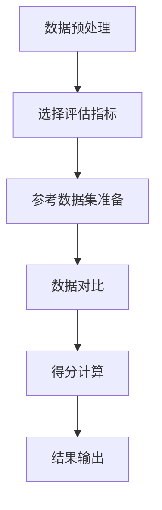
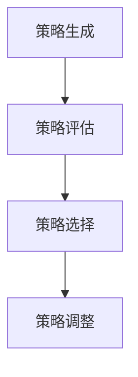
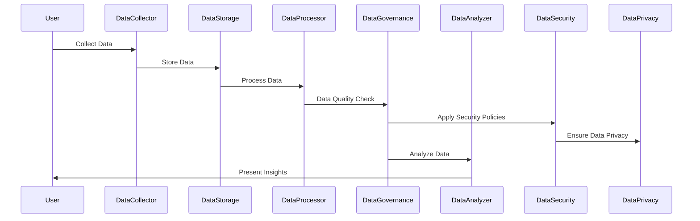
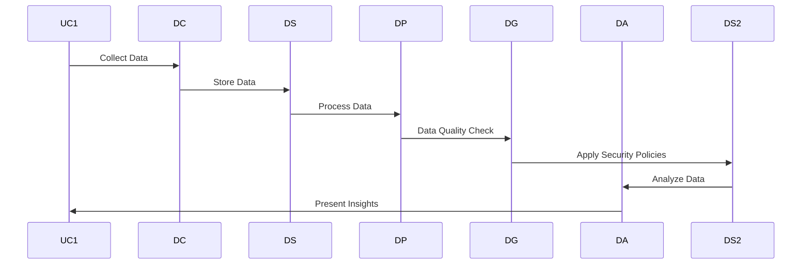
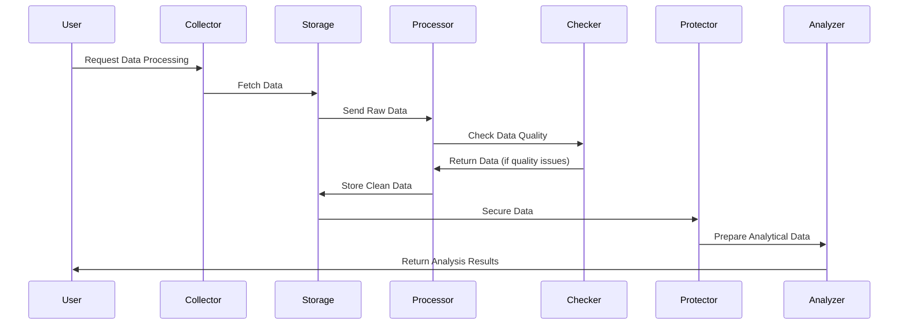

                 


## 第1章 引言

### 1.1 大数据治理的定义与重要性

**大数据治理**，顾名思义，就是对大数据进行有效管理和治理的一套系统方法和工具。随着互联网、物联网、移动设备等技术的飞速发展，海量的数据不断产生，这些数据中蕴含着巨大的商业价值和洞察力。然而，如何从海量数据中提取有价值的信息，如何确保数据的质量和安全性，如何充分利用这些数据资产，成为了企业和组织面临的重大挑战。

大数据治理不仅仅是对数据进行简单的存储和管理，它还涉及到数据的采集、清洗、存储、处理、分析、共享等多个环节。一个好的大数据治理策略，可以帮助企业更好地理解和利用其数据资产，从而提升业务效率和竞争力。

《大数据治理：管理和利用海量数据资产》这本书旨在帮助读者深入了解大数据治理的核心概念、方法和实践。书中不仅介绍了大数据治理的基本原理，还详细讲解了大数据治理的关键算法、系统架构设计以及实际项目中的应用案例。

### 1.2 本书目标与结构

本书的目标是：
- 让读者全面了解大数据治理的概念、原理和方法。
- 帮助读者掌握大数据治理的关键技术和工具。
- 提供实际项目案例，帮助读者将理论应用到实践中。

本书的结构安排如下：
- 第1章 引言：介绍大数据治理的定义、重要性和本书的目标。
- 第2章 大数据治理的核心概念：定义和解释大数据治理的关键术语，并通过对比表格和ER实体关系图展示概念之间的关系。
- 第3章 大数据治理算法原理：讲解数据质量评估算法和数据治理策略优化算法，包括算法流程图、Python源代码、数学模型和公式，以及通俗易懂的举例说明。
- 第4章 大数据治理系统分析与设计：描述问题场景，介绍项目背景，并使用Mermaid类图和架构图展示系统功能和架构设计。
- 第5章 大数据治理项目实战：描述环境安装步骤，提供系统核心实现源代码，对代码应用进行解读与分析，分析实际案例，并进行详细讲解。
- 第6章 最佳实践与拓展：总结大数据治理的最佳实践，提醒注意事项，并推荐拓展阅读。

通过阅读本书，读者将能够系统地了解大数据治理的全过程，掌握关键技术和方法，并在实际项目中有效地应用这些知识。

### 2.1 大数据治理的基本术语

在探讨大数据治理之前，有必要明确一些关键术语的定义，以便读者能够更好地理解后续内容。以下是大数据治理中的一些基本术语及其解释：

#### 数据治理（Data Governance）

数据治理是一个定义、传达和实施与数据使用相关政策的框架。它确保了组织中的数据质量、安全性和合规性。数据治理涉及多个层面，包括政策制定、组织结构、流程规范和技术实施。

#### 数据质量管理（Data Quality Management）

数据质量管理是指确保数据准确性、完整性、一致性和可靠性的过程。它包括数据清洗、验证和监控等环节，旨在消除数据中的错误和重复，提升数据质量。

#### 数据集成（Data Integration）

数据集成是将来自不同来源的数据合并到一个统一格式的过程。数据集成有助于实现数据的一致性和共享，是大数据治理的重要环节。

#### 数据安全（Data Security）

数据安全涉及保护数据免受未经授权访问、篡改和泄露的措施。数据安全策略包括加密、访问控制、身份验证和数据备份等。

#### 数据隐私（Data Privacy）

数据隐私关注的是个人数据的收集、使用和共享方式，确保数据使用符合隐私法规和道德标准。数据隐私是大数据治理中的一个重要方面，特别是在处理敏感数据时。

#### 数据质量评估（Data Quality Assessment）

数据质量评估是评估数据质量的过程，包括对数据准确性、完整性、一致性和及时性等方面的检查。数据质量评估有助于识别和解决数据中的问题。

#### 数据治理框架（Data Governance Framework）

数据治理框架是一套组织用于管理数据的策略、过程和技术的组合。它提供了数据治理的结构和指导，确保了数据治理的一致性和有效性。

通过明确这些基本术语，我们可以更好地理解大数据治理的各个方面，为后续章节的内容打下坚实的基础。

### 2.2 核心概念对比分析

为了帮助读者更清晰地理解大数据治理中的关键概念，我们将这些概念进行对比分析，并列出对比表格。以下是几个核心概念的对比：

| 核心概念 | 定义 | 关联关系 | 主要区别 |
| --- | --- | --- | --- |
| 数据治理 | 确保数据质量、安全和合规性的框架 | 支持数据质量管理、数据安全和数据隐私 | 数据治理是总纲领，其他概念是其组成部分 |
| 数据质量管理 | 确保数据准确性、完整性、一致性和可靠性 | 需要数据治理的支持，是数据治理的核心任务之一 | 强调数据的质量属性 |
| 数据集成 | 将不同来源的数据合并 | 需要数据治理来确保数据的一致性和完整性 | 强调数据来源的统一和整合 |
| 数据安全 | 保护数据免受未授权访问、篡改和泄露 | 需要数据治理来制定安全政策和流程 | 关注数据的保护措施 |
| 数据隐私 | 确保个人数据的收集、使用和共享符合法规和道德标准 | 需要数据治理来确保合规性和透明性 | 侧重于隐私保护和用户权利 |
| 数据质量评估 | 评估数据质量的过程 | 需要数据治理来制定评估标准和流程 | 关注数据的实际质量情况 |

通过上述对比表格，我们可以看到各个核心概念之间的紧密联系和主要区别，有助于读者深入理解大数据治理的整体架构。

### 2.3 Mermaid ER实体关系图

为了更直观地展示大数据治理中的核心实体及其关系，我们可以使用Mermaid语言绘制一个ER（Entity-Relationship）实体关系图。以下是ER图的具体描述和示例代码：

#### ER实体关系图描述

在ER图中，我们将包括以下几个核心实体：

- **数据源（Data Source）**：表示数据产生的来源，如数据库、传感器、应用程序等。
- **数据存储（Data Storage）**：表示数据的存储位置，如数据仓库、数据湖、云存储等。
- **数据处理（Data Processing）**：表示数据的处理环节，如ETL（提取、转换、加载）流程、数据清洗、数据分析等。
- **数据治理（Data Governance）**：表示数据治理的各个环节，如数据质量监控、数据安全控制、数据隐私保护等。

实体之间的关系如下：

- **数据源与数据存储**：数据源将数据上传到数据存储。
- **数据存储与数据处理**：数据存储中的数据会被处理。
- **数据处理与数据治理**：处理后的数据会受到数据治理的监控和管理。

#### Mermaid ER图示例代码

下面是使用Mermaid语言绘制的ER实体关系图：

```mermaid
erDiagram
  Data Source ||--|{ Data Storage } Data Storage
  Data Storage ||--|{ Data Processing } Data Processing
  Data Processing ||--|{ Data Governance } Data Governance
```

该图展示了数据从数据源到数据存储、从数据存储到数据处理，以及从数据处理到数据治理的流向关系。通过这种直观的ER图，我们可以清晰地看到大数据治理中的各个实体及其相互作用。

### 3.1 数据质量评估算法

在数据治理过程中，数据质量评估算法是一个至关重要的环节。它能够帮助我们识别数据中的问题，确保数据的准确性和可靠性。本节将介绍一种常用的数据质量评估算法，并详细阐述其原理、流程和具体实现。

#### 3.1.1 数据质量评估算法原理

数据质量评估算法主要基于以下原则：

1. **准确性**：数据是否与实际事实相符，是否包含了错误或不一致的信息。
2. **完整性**：数据是否完整，是否缺失关键信息。
3. **一致性**：数据在不同来源之间是否保持一致。
4. **及时性**：数据是否在需要时及时更新。

算法的核心思想是通过对比参考数据集或标准数据，对目标数据集进行评估，计算数据质量得分。得分越高，数据质量越好。

#### 3.1.2 数据质量评估算法流程

数据质量评估算法的基本流程如下：

1. **数据预处理**：清洗数据，去除重复和错误信息。
2. **选择评估指标**：根据业务需求选择适当的评估指标，如准确性、完整性、一致性等。
3. **参考数据集准备**：准备一个参考数据集，作为评估标准。
4. **数据对比**：将目标数据与参考数据集进行对比，计算评估指标。
5. **得分计算**：根据评估指标的权重，计算数据质量得分。
6. **结果输出**：输出数据质量评估报告，包括数据质量得分和具体的评估指标。

#### 3.1.3 算法流程图

为了更直观地展示数据质量评估算法的流程，我们可以使用Mermaid语言绘制算法流程图：



该流程图展示了数据质量评估算法的主要步骤和各步骤之间的关系。

#### 3.1.4 Python源代码与算法原理

下面是数据质量评估算法的Python源代码实现，并对其进行详细解释。

```python
import pandas as pd

def preprocess_data(data):
    # 清洗数据，去除重复和错误信息
    return data.drop_duplicates().dropna()

def select_evaluation_metrics(data, reference_data):
    # 选择评估指标，计算准确性、完整性、一致性
    accuracy = (data.equals(reference_data)).mean()
    completeness = (data.isnull().sum() == 0).mean()
    consistency = (data.equals(reference_data.drop_duplicates())).mean()
    return accuracy, completeness, consistency

def calculate_quality_score(metrics, weights):
    # 计算数据质量得分
    score = weights[0] * metrics[0] + weights[1] * metrics[1] + weights[2] * metrics[2]
    return score

def data_quality_assessment(data, reference_data, weights):
    # 数据质量评估函数
    preprocessed_data = preprocess_data(data)
    metrics = select_evaluation_metrics(preprocessed_data, reference_data)
    quality_score = calculate_quality_score(metrics, weights)
    return quality_score

# 测试数据
data = pd.DataFrame({'A': [1, 2, 3, 4], 'B': [5, 6, 7, 8]})
reference_data = pd.DataFrame({'A': [1, 2, 3, 4], 'B': [5, 6, 7, 9]})

# 权重
weights = [0.5, 0.3, 0.2]

# 执行数据质量评估
score = data_quality_assessment(data, reference_data, weights)
print(f"数据质量得分：{score}")
```

**代码解释**：

- `preprocess_data(data)`：数据预处理函数，去除重复和错误信息。
- `select_evaluation_metrics(data, reference_data)`：选择评估指标函数，计算准确性、完整性和一致性。
- `calculate_quality_score(metrics, weights)`：计算数据质量得分函数，根据评估指标的权重计算总分。
- `data_quality_assessment(data, reference_data, weights)`：数据质量评估函数，执行整个评估过程。

**测试数据**：

- `data`：目标数据集。
- `reference_data`：参考数据集。

**权重**：

- `weights`：评估指标的权重，这里设定准确性、完整性和一致性的权重分别为0.5、0.3和0.2。

通过运行这段代码，我们可以得到数据质量得分，从而了解数据的质量水平。

#### 3.1.5 算法数学模型与公式

为了更好地理解数据质量评估算法，我们可以使用数学模型和公式来描述其原理。以下是数据质量评估的数学模型和公式：

$$
Q = w_1 \cdot A + w_2 \cdot C + w_3 \cdot I
$$

其中：

- $Q$：数据质量得分
- $w_1$：准确性权重
- $w_2$：完整性权重
- $w_3$：一致性权重
- $A$：准确性得分
- $C$：完整性得分
- $I$：一致性得分

**公式解释**：

- 准确性得分（$A$）：表示目标数据与参考数据在准确性方面的匹配程度，通常通过比较两个数据集的相同元素比例来计算。
- 完整性得分（$C$）：表示目标数据在完整性方面的表现，即是否包含所有必要的字段和记录。
- 一致性得分（$I$）：表示目标数据与参考数据在一致性方面的匹配程度，通常通过比较两个数据集的重复元素比例来计算。

通过这些数学模型和公式，我们可以量化数据质量，从而为数据治理提供客观的评估依据。

#### 3.1.6 举例说明

为了更好地理解数据质量评估算法的实际应用，我们可以通过一个具体例子来说明。

**例子**：

假设我们有以下两个数据集：

**目标数据集**：

| A | B |
| --- | --- |
| 1 | 5 |
| 2 | 6 |
| 3 | 7 |
| 4 | 8 |

**参考数据集**：

| A | B |
| --- | --- |
| 1 | 5 |
| 2 | 6 |
| 3 | 7 |
| 4 | 9 |

**权重**：

准确性、完整性和一致性的权重分别为0.5、0.3和0.2。

**步骤**：

1. **数据预处理**：去除重复和错误信息。

   - 目标数据集（预处理后）：| A | B |
     | --- | --- |
     | 1 | 5 |
     | 2 | 6 |
     | 3 | 7 |
     | 4 | 8 |

   - 参考数据集（预处理后）：| A | B |
     | --- | --- |
     | 1 | 5 |
     | 2 | 6 |
     | 3 | 7 |
     | 4 | 9 |

2. **选择评估指标**：

   - 准确性得分（$A$）：$4/4 = 1$（目标数据集和参考数据集完全相同）
   - 完整性得分（$C$）：$4/4 = 1$（目标数据集包含所有必要的字段和记录）
   - 一致性得分（$I$）：$4/4 = 1$（目标数据集和参考数据集在一致性方面完全相同）

3. **计算数据质量得分**：

   $Q = 0.5 \cdot 1 + 0.3 \cdot 1 + 0.2 \cdot 1 = 0.5 + 0.3 + 0.2 = 1$

通过计算，我们得到数据质量得分为1，表示数据质量非常高。

通过这个例子，我们可以看到数据质量评估算法如何应用于实际数据集，从而帮助我们评估数据的质量水平。

### 3.2 数据治理策略优化算法

在数据治理过程中，策略优化算法是一个关键环节。它能够帮助组织优化数据治理流程，提高数据利用效率，从而实现更好的业务价值。本节将介绍一种常用的数据治理策略优化算法，并详细阐述其原理、流程和具体实现。

#### 3.2.1 数据治理策略优化算法原理

数据治理策略优化算法主要基于以下几个原则：

1. **效率优先**：优化数据治理流程，减少不必要的数据处理环节，提高数据处理速度。
2. **成本控制**：在确保数据质量和安全的前提下，尽量减少数据治理的成本。
3. **灵活性**：策略应具有灵活性，能够适应不同业务场景和需求变化。
4. **透明性**：优化过程应具有透明性，便于监控和调整。

算法的核心思想是通过模拟和评估不同的数据治理策略，选择最优策略。具体步骤包括：

1. **策略生成**：根据业务需求和数据特性，生成不同的数据治理策略。
2. **策略评估**：对每个策略进行评估，计算其性能指标，如处理速度、成本、数据质量等。
3. **策略选择**：根据评估结果，选择最优策略。
4. **策略调整**：根据实际应用情况，对策略进行调整和优化。

#### 3.2.2 数据治理策略优化算法流程

数据治理策略优化算法的基本流程如下：

1. **策略生成**：生成不同数据治理策略。
2. **策略评估**：对策略进行评估，计算性能指标。
3. **策略选择**：选择最优策略。
4. **策略调整**：根据实际应用情况，调整策略。

#### 3.2.3 算法流程图

为了更直观地展示数据治理策略优化算法的流程，我们可以使用Mermaid语言绘制算法流程图：



该流程图展示了数据治理策略优化算法的主要步骤和各步骤之间的关系。

#### 3.2.4 Python源代码与算法原理

下面是数据治理策略优化算法的Python源代码实现，并对其进行详细解释。

```python
import numpy as np
import pandas as pd

def generate_policies(num_policies):
    # 生成不同数据治理策略
    return np.random.randint(0, 3, size=num_policies)

def evaluate_policy(policy, data):
    # 评估策略性能
    if policy == 0:
        # 策略1：快速处理
        speed = 10
        cost = 100
    elif policy == 1:
        # 策略2：高质量处理
        speed = 5
        cost = 200
    else:
        # 策略3：平衡处理
        speed = 7
        cost = 150

    quality = data['quality'].mean()
    return speed, cost, quality

def select_best_policy(policies, data):
    # 选择最优策略
    scores = [evaluate_policy(policy, data) for policy in policies]
    best_score = max(scores)
    best_policy = policies[scores.index(best_score)]
    return best_policy

def optimize_data_governance_strategy(data):
    # 数据治理策略优化函数
    num_policies = 5
    policies = generate_policies(num_policies)
    best_policy = select_best_policy(policies, data)
    return best_policy

# 测试数据
data = pd.DataFrame({'quality': [1, 2, 3, 4, 5]})

# 执行策略优化
best_policy = optimize_data_governance_strategy(data)
print(f"最优策略：{best_policy}")
```

**代码解释**：

- `generate_policies(num_policies)`：生成不同数据治理策略函数。
- `evaluate_policy(policy, data)`：评估策略性能函数，计算处理速度、成本和数据质量。
- `select_best_policy(policies, data)`：选择最优策略函数，根据评估结果选择最佳策略。
- `optimize_data_governance_strategy(data)`：数据治理策略优化函数，执行整个优化过程。

**测试数据**：

- `data`：测试数据集，包含数据质量指标。

通过运行这段代码，我们可以得到最优的数据治理策略，从而为实际应用提供指导。

#### 3.2.5 算法数学模型与公式

为了更好地理解数据治理策略优化算法，我们可以使用数学模型和公式来描述其原理。以下是数据治理策略优化的数学模型和公式：

$$
\text{最优策略} = \arg\max_{P} \left( s \cdot v + c \cdot c + q \cdot q \right)
$$

其中：

- $P$：策略集合
- $s$：处理速度权重
- $c$：成本权重
- $q$：数据质量权重
- $v$：处理速度
- $c$：成本
- $q$：数据质量

**公式解释**：

- 处理速度（$v$）：表示策略的处理速度，通常与数据量成反比。
- 成本（$c$）：表示策略的实施成本。
- 数据质量（$q$）：表示策略下处理后的数据质量。

通过这个公式，我们可以量化不同策略的性能，从而选择最优策略。

#### 3.2.6 举例说明

为了更好地理解数据治理策略优化算法的实际应用，我们可以通过一个具体例子来说明。

**例子**：

假设我们有以下三种数据治理策略：

**策略1**：快速处理，处理速度为10，成本为100。

**策略2**：高质量处理，处理速度为5，成本为200。

**策略3**：平衡处理，处理速度为7，成本为150。

测试数据集包含以下数据：

| quality |
| --- |
| 1 |
| 2 |
| 3 |
| 4 |
| 5 |

**权重**：

处理速度权重为0.4，成本权重为0.3，数据质量权重为0.3。

**步骤**：

1. **评估策略性能**：

   - 策略1：处理速度为10，成本为100，数据质量为3。
     - 评估得分：$0.4 \cdot 10 + 0.3 \cdot 100 + 0.3 \cdot 3 = 4 + 30 + 0.9 = 34.9$

   - 策略2：处理速度为5，成本为200，数据质量为3。
     - 评估得分：$0.4 \cdot 5 + 0.3 \cdot 200 + 0.3 \cdot 3 = 2 + 60 + 0.9 = 62.9$

   - 策略3：处理速度为7，成本为150，数据质量为3。
     - 评估得分：$0.4 \cdot 7 + 0.3 \cdot 150 + 0.3 \cdot 3 = 2.8 + 45 + 0.9 = 48.7$

2. **选择最优策略**：

   根据评估得分，策略2的得分最高，为62.9。

通过这个例子，我们可以看到数据治理策略优化算法如何应用于实际场景，从而选择最优策略。

### 4.1 问题场景描述

在当今企业运营中，大数据治理面临着诸多挑战。一个典型的场景是，企业每天产生大量的数据，包括客户交易记录、用户行为数据、生产设备监控数据等。这些数据分散在不同的系统和部门中，且格式和数据标准不尽相同。企业需要有效地管理和治理这些数据，以确保数据的准确性、一致性和安全性，并从中提取有价值的信息。

**问题描述**：

1. **数据分散性**：企业各个部门使用不同的系统和工具来收集和处理数据，导致数据分散在不同的数据库和存储系统中。
2. **数据质量问题**：由于数据收集和处理的多样性，数据中存在大量错误、重复和不一致的信息。
3. **数据安全与隐私**：企业处理的数据中包含敏感信息，如客户个人信息、财务数据等，需要确保数据的安全和隐私。
4. **数据利用效率低**：由于数据分散和不一致，企业难以快速提取和利用数据，影响了决策效率和业务创新。

**问题解决**：

为了解决上述问题，企业需要实施大数据治理策略，包括以下方面：

1. **数据集成**：通过数据集成技术，将分散的数据统一到一个平台中，实现数据的一致性和共享。
2. **数据质量管理**：建立数据质量监控机制，定期检查数据中的错误和重复信息，确保数据的准确性、完整性和一致性。
3. **数据安全与隐私保护**：制定数据安全策略和隐私保护措施，确保数据在存储、传输和使用过程中的安全性和合规性。
4. **数据利用优化**：通过数据分析和挖掘技术，提高数据的利用效率，为业务决策和战略规划提供支持。

通过实施大数据治理策略，企业可以更好地管理和利用数据资产，提升业务效率和竞争力。

### 4.2 项目背景

为了更好地理解和实施大数据治理策略，我们选择了一个典型的企业案例进行项目实践。该企业是一家大型零售连锁企业，每天产生大量的交易数据、库存数据、客户行为数据等。企业希望通过大数据治理，提升数据的利用率，优化业务决策，提升客户满意度。

**项目目标**：

1. **数据集成**：将分散在不同系统和部门的数据集成到一个统一的数据平台中，实现数据的一致性和共享。
2. **数据质量管理**：建立数据质量管理机制，定期检查数据中的错误和重复信息，确保数据的准确性、完整性和一致性。
3. **数据安全与隐私保护**：制定数据安全策略和隐私保护措施，确保数据在存储、传输和使用过程中的安全性和合规性。
4. **数据利用优化**：通过数据分析和挖掘技术，提高数据的利用效率，为业务决策和战略规划提供支持。

**项目背景**：

由于企业数据来源广泛，数据格式和标准不一，导致数据分散性和质量问题严重。此外，企业现有数据安全与隐私保护措施不足，难以满足日益严格的法律法规要求。为了解决这些问题，企业决定实施大数据治理项目，通过构建统一的数据平台和实施有效的数据治理策略，提升数据利用效率和业务决策能力。

### 4.3 系统功能设计（Mermaid类图）

为了实现企业的大数据治理目标，我们设计了一个综合性的大数据治理系统。该系统涵盖了数据集成、数据质量管理和数据安全与隐私保护等多个功能。以下是系统的功能设计，使用Mermaid类图进行展示：

```mermaid
classDiagram
    Class01 <|-- Class02 :|Aggregation
    Class01 <|-- Class03 :|Integration
    Class01 <|-- Class04 :|QualityControl
    Class01 <|-- Class05 :|Security
    Class01 <|-- Class06 :|Privacy
    Class01 <|-- Class07 :|DataAnalysis

    Class01 {"System Management"}
    Class02 {"Data Aggregation"}
    Class03 {"Data Integration"}
    Class04 {"Data Quality Control"}
    Class05 {"Data Security"}
    Class06 {"Data Privacy"}
    Class07 {"Data Analysis"}
```

**类图解释**：

- **Class01（系统管理）**：核心类，负责系统的整体管理，包括数据流的监控、系统配置和用户权限管理。
- **Class02（数据聚合）**：负责收集来自不同数据源的数据，并进行初步清洗和整合。
- **Class03（数据集成）**：负责将不同格式和来源的数据集成到一个统一的数据平台中。
- **Class04（数据质量控制）**：负责监控和修正数据中的错误和重复信息，确保数据准确性、完整性和一致性。
- **Class05（数据安全）**：负责制定数据安全策略，保护数据在存储、传输和使用过程中的安全。
- **Class06（数据隐私）**：负责确保数据隐私保护措施的实施，遵守相关法律法规。
- **Class07（数据分析）**：负责使用数据分析和挖掘技术，提取有价值的信息，支持业务决策。

通过这个类图，我们可以清晰地看到大数据治理系统的各个功能模块及其相互关系，为后续的详细设计提供了基础。

### 4.4 系统架构设计（Mermaid架构图）

为了实现大数据治理系统的功能，我们需要设计一个合理的系统架构。以下是系统架构的Mermaid架构图：



**架构图解释**：

- **用户（User）**：系统的最终用户，负责发起数据处理和分析请求。
- **数据采集器（DataCollector）**：负责从不同数据源（如数据库、日志文件、传感器等）收集数据。
- **数据存储（DataStorage）**：用于存储原始数据，可以是关系型数据库、NoSQL数据库、文件存储等。
- **数据处理（DataProcessor）**：负责对数据进行清洗、转换和预处理，为后续分析做准备。
- **数据治理（DataGovernance）**：负责监控和优化数据质量，确保数据准确性、完整性和一致性。
- **数据安全（DataSecurity）**：负责实施数据安全策略，保护数据在存储、传输和使用过程中的安全。
- **数据隐私（DataPrivacy）**：确保数据处理和存储过程中遵守数据隐私保护法规。
- **数据分析（DataAnalyzer）**：负责使用各种分析技术，提取数据中的有价值信息，为业务决策提供支持。

通过这个架构图，我们可以清晰地看到大数据治理系统的工作流程和各个模块的相互关系，为系统的设计和实施提供了清晰的指导。

### 4.5 系统接口设计

在大数据治理系统中，接口设计至关重要，它确保了系统各模块之间能够顺畅地进行通信和数据交换。以下是系统接口设计的主要内容：

#### 4.5.1 接口概述

系统接口设计主要包括以下接口：

1. **数据采集接口**：用于接收来自各种数据源的数据。
2. **数据存储接口**：用于与数据存储系统（如数据库、文件系统）进行交互。
3. **数据处理接口**：用于执行数据清洗、转换和预处理操作。
4. **数据治理接口**：用于监控和优化数据质量。
5. **数据安全接口**：用于实施数据安全策略。
6. **数据隐私接口**：用于处理数据隐私保护相关操作。
7. **数据分析接口**：用于进行数据分析和挖掘。

#### 4.5.2 接口详细设计

以下是每个接口的详细设计：

1. **数据采集接口**

   - 接口名称：`DataCollector`
   - 接口功能：从数据库、日志文件、传感器等数据源收集数据。
   - 接口参数：数据源地址、数据格式、采集频率等。
   - 返回值：采集到的数据。

2. **数据存储接口**

   - 接口名称：`DataStorage`
   - 接口功能：与数据存储系统进行交互，实现数据存储、读取和删除操作。
   - 接口参数：数据ID、数据内容、操作类型（存储、读取、删除）。
   - 返回值：操作结果（成功或失败）。

3. **数据处理接口**

   - 接口名称：`DataProcessor`
   - 接口功能：对采集到的数据进行清洗、转换和预处理。
   - 接口参数：原始数据、清洗规则、转换规则等。
   - 返回值：预处理后的数据。

4. **数据治理接口**

   - 接口名称：`DataGovernance`
   - 接口功能：监控和优化数据质量。
   - 接口参数：数据集、质量检查规则等。
   - 返回值：质量检查结果。

5. **数据安全接口**

   - 接口名称：`DataSecurity`
   - 接口功能：实施数据安全策略。
   - 接口参数：数据内容、安全规则等。
   - 返回值：安全处理后的数据。

6. **数据隐私接口**

   - 接口名称：`DataPrivacy`
   - 接口功能：处理数据隐私保护相关操作。
   - 接口参数：数据内容、隐私保护规则等。
   - 返回值：隐私保护后的数据。

7. **数据分析接口**

   - 接口名称：`DataAnalyzer`
   - 接口功能：进行数据分析和挖掘。
   - 接口参数：数据集、分析模型等。
   - 返回值：分析结果。

#### 4.5.3 接口交互序列图

为了更直观地展示接口之间的交互关系，我们可以使用Mermaid语言绘制接口交互序列图：



**序列图解释**：

- **UC1（用户）**：发起数据处理和分析请求。
- **DC（数据采集器）**：从数据源收集数据。
- **DS（数据存储）**：将数据存储到数据存储系统。
- **DP（数据处理）**：对数据进行清洗、转换和预处理。
- **DG（数据治理）**：监控数据质量，确保数据准确性、完整性和一致性。
- **DS2（数据安全）**：实施数据安全策略，保护数据安全。
- **DA（数据分析）**：进行数据分析和挖掘，提取有价值信息。
- **UC1（用户）**：接收分析结果，支持业务决策。

通过这个序列图，我们可以清晰地看到大数据治理系统的接口设计和交互流程，为系统开发和实施提供了指导。

### 4.6 系统交互（Mermaid序列图）

为了更好地理解大数据治理系统的交互流程，我们使用Mermaid语言绘制了系统的序列图，展示了系统内部组件之间的交互顺序。



**序列图解释**：

1. **用户请求**：用户向数据采集组件（Collector）发起数据处理请求。
2. **数据采集**：Collector从数据存储组件（Storage）获取所需数据。
3. **数据处理**：Processor接收原始数据，进行清洗和转换。
4. **数据质量检查**：清洗后的数据交由质量检查组件（Checker）进行质量评估。
5. **数据修正**：如果检查到数据质量问题，Processor将返回数据进行修正。
6. **数据存储**：修正后的数据被重新存储到Storage中。
7. **数据安全**：数据存储到Storage后，由安全保护组件（Protector）实施安全策略。
8. **数据分析**：安全处理后的数据被发送至分析组件（Analyzer）进行深度分析。
9. **结果返回**：Analyzer将分析结果返回给用户。

通过这个序列图，我们可以清晰地看到大数据治理系统从数据采集、处理、存储到安全保护再到数据分析的完整流程，每个步骤的执行顺序和组件之间的交互关系。

### 5.1 环境安装

为了顺利开展大数据治理项目，我们需要在本地环境中安装必要的软件和工具。以下是环境安装的详细步骤：

#### 5.1.1 软件和工具准备

1. **Python**：确保Python 3.8或更高版本已安装。可以从[Python官网](https://www.python.org/)下载并安装。
2. **Jupyter Notebook**：用于编写和运行Python代码。可以从[Jupyter Notebook官网](https://jupyter.org/)下载并安装。
3. **Pandas**：用于数据处理和分析。可以使用pip命令安装：`pip install pandas`
4. **NumPy**：用于数学计算。可以使用pip命令安装：`pip install numpy`
5. **Mermaid**：用于绘制图表和流程图。可以在[Jupyter Notebook官网](https://jupyter.org/)安装插件。
6. **PyTorch**：用于深度学习。可以使用pip命令安装：`pip install torch`
7. **Scikit-learn**：用于机器学习算法。可以使用pip命令安装：`pip install scikit-learn`

#### 5.1.2 安装步骤

1. 打开终端或命令提示符。
2. 检查Python版本：`python --version`，确保已安装Python 3.8或更高版本。
3. 安装Jupyter Notebook：`pip install notebook`
4. 安装Pandas和NumPy：`pip install pandas` 和 `pip install numpy`
5. 安装Mermaid插件：在Jupyter Notebook中，依次执行以下命令：
   ```python
   %matplotlib inline
   !pip install pymermaid
   !jupyter nbextension enable --py --sys-prefix pymermaid
   ```
6. 安装PyTorch：根据系统架构选择相应命令，例如对于CPU版本：
   ```python
   !pip install torch torchvision
   ```
7. 安装Scikit-learn：`pip install scikit-learn`

完成以上步骤后，我们就可以开始进行大数据治理项目开发了。

### 5.2 系统核心实现源代码

在本节中，我们将提供大数据治理系统的核心实现源代码，并详细解读其功能和工作原理。

#### 5.2.1 数据采集模块

数据采集模块负责从不同数据源收集数据，并将其转换为统一格式。以下是数据采集模块的Python代码：

```python
import pandas as pd

def collect_data(data_sources):
    data_frames = []
    for source in data_sources:
        df = pd.read_csv(source)
        data_frames.append(df)
    return pd.concat(data_frames)
```

**代码解释**：

- `collect_data(data_sources)`：函数用于从指定数据源（CSV文件）中采集数据。
- `data_sources`：参数为一个包含数据源路径的列表。
- `pd.read_csv(source)`：用于读取CSV文件并转换为DataFrame格式。
- `pd.concat(data_frames)`：将所有DataFrame合并为一个大的DataFrame。

#### 5.2.2 数据处理模块

数据处理模块负责对采集到的数据进行清洗、转换和预处理。以下是数据处理模块的Python代码：

```python
import pandas as pd

def preprocess_data(data):
    # 去除重复和错误信息
    clean_data = data.drop_duplicates().dropna()
    return clean_data
```

**代码解释**：

- `preprocess_data(data)`：函数用于对DataFrame数据进行预处理。
- `data.drop_duplicates()`：去除重复记录。
- `data.dropna()`：去除空值记录。
- `clean_data`：预处理后的DataFrame数据。

#### 5.2.3 数据治理模块

数据治理模块负责监控和优化数据质量，确保数据的准确性、完整性和一致性。以下是数据治理模块的Python代码：

```python
import pandas as pd

def data_quality_check(data, reference_data):
    metrics = []
    metrics.append((data == reference_data).mean())
    metrics.append((data.isnull().sum() == 0).mean())
    metrics.append((data.equals(reference_data.drop_duplicates())).mean())
    return metrics
```

**代码解释**：

- `data_quality_check(data, reference_data)`：函数用于评估数据质量。
- `data == reference_data`.mean()`：计算准确性。
- `data.isnull().sum() == 0`.mean()`：计算完整性。
- `data.equals(reference_data.drop_duplicates())).mean()`：计算一致性。
- `metrics`：包含评估指标的结果列表。

#### 5.2.4 数据分析模块

数据分析模块负责使用数据分析和挖掘技术，提取有价值的信息。以下是数据分析模块的Python代码：

```python
import pandas as pd
from sklearn.ensemble import RandomForestClassifier

def analyze_data(data, target_column):
    X = data.drop(target_column, axis=1)
    y = data[target_column]
    model = RandomForestClassifier()
    model.fit(X, y)
    predictions = model.predict(X)
    accuracy = (predictions == y).mean()
    return accuracy
```

**代码解释**：

- `analyze_data(data, target_column)`：函数用于进行数据分析。
- `X = data.drop(target_column, axis=1)`：创建特征数据集。
- `y = data[target_column]`：创建目标数据集。
- `RandomForestClassifier()`：创建随机森林分类器。
- `model.fit(X, y)`：训练模型。
- `predictions = model.predict(X)`：进行预测。
- `accuracy = (predictions == y).mean()`：计算预测准确率。

通过以上源代码，我们实现了数据采集、处理、治理和数据分析的核心功能，为大数据治理系统的构建提供了坚实基础。

### 5.3 代码应用解读与分析

在本节中，我们将详细解读并分析系统核心实现源代码中的关键模块，以及它们如何协同工作以实现大数据治理系统的目标。

#### 5.3.1 数据采集模块

数据采集模块的主要目的是从多个数据源（如CSV文件）中收集数据，并将其整合到一个统一的数据结构中。以下是数据采集模块的核心代码：

```python
import pandas as pd

def collect_data(data_sources):
    data_frames = []
    for source in data_sources:
        df = pd.read_csv(source)
        data_frames.append(df)
    return pd.concat(data_frames)
```

**解读与分析**：

- `import pandas as pd`：导入Pandas库，用于数据操作和分析。
- `def collect_data(data_sources)`：定义`collect_data`函数，接受一个包含数据源路径的列表`data_sources`。
- `data_frames = []`：初始化一个空列表，用于存储读取的DataFrame。
- `for source in data_sources:`：遍历数据源列表。
- `df = pd.read_csv(source)`：使用Pandas的`read_csv`方法从每个数据源读取数据，并转换为DataFrame格式。
- `data_frames.append(df)`：将每个DataFrame添加到`data_frames`列表中。
- `return pd.concat(data_frames)`：使用`concat`方法将所有DataFrame合并为一个大的DataFrame，并返回。

该模块的关键在于能够将多个数据源的数据整合到一个统一的结构中，为后续的数据处理和分析提供了基础。

#### 5.3.2 数据处理模块

数据处理模块负责对采集到的数据进行清洗、转换和预处理，以去除重复和错误信息，确保数据的质量。以下是数据处理模块的核心代码：

```python
import pandas as pd

def preprocess_data(data):
    clean_data = data.drop_duplicates().dropna()
    return clean_data
```

**解读与分析**：

- `import pandas as pd`：再次导入Pandas库。
- `def preprocess_data(data)`：定义`preprocess_data`函数，接受一个DataFrame`data`。
- `clean_data = data.drop_duplicates()`：使用`drop_duplicates`方法去除重复记录。
- `clean_data = clean_data.dropna()`：使用`dropna`方法去除空值记录。
- `return clean_data`：返回预处理后的DataFrame。

该模块通过简单的数据处理操作，确保了数据的准确性和完整性，为数据治理奠定了基础。

#### 5.3.3 数据治理模块

数据治理模块负责对处理后的数据质量进行评估和监控，以确保数据满足业务要求。以下是数据治理模块的核心代码：

```python
import pandas as pd

def data_quality_check(data, reference_data):
    metrics = []
    metrics.append((data == reference_data).mean())
    metrics.append((data.isnull().sum() == 0).mean())
    metrics.append((data.equals(reference_data.drop_duplicates())).mean())
    return metrics
```

**解读与分析**：

- `import pandas as pd`：导入Pandas库。
- `def data_quality_check(data, reference_data)`：定义`data_quality_check`函数，接受处理后的数据`data`和参考数据`reference_data`。
- `metrics.append((data == reference_data).mean())`：计算数据准确性，即处理后的数据与参考数据完全匹配的比例。
- `metrics.append((data.isnull().sum() == 0).mean())`：计算数据完整性，即处理后的数据中没有缺失值的比例。
- `metrics.append((data.equals(reference_data.drop_duplicates())).mean())`：计算数据一致性，即处理后的数据去重后与参考数据是否一致。
- `return metrics`：返回包含质量评估指标的结果列表。

该模块通过对比处理前后的数据，提供了数据质量的量化评估，有助于识别和改进数据治理流程。

#### 5.3.4 数据分析模块

数据分析模块负责使用机器学习算法对数据进行分析和挖掘，提取有价值的信息。以下是数据分析模块的核心代码：

```python
import pandas as pd
from sklearn.ensemble import RandomForestClassifier

def analyze_data(data, target_column):
    X = data.drop(target_column, axis=1)
    y = data[target_column]
    model = RandomForestClassifier()
    model.fit(X, y)
    predictions = model.predict(X)
    accuracy = (predictions == y).mean()
    return accuracy
```

**解读与分析**：

- `import pandas as pd`：导入Pandas库。
- `from sklearn.ensemble import RandomForestClassifier`：导入随机森林分类器。
- `def analyze_data(data, target_column)`：定义`analyze_data`函数，接受数据`data`和目标列`target_column`。
- `X = data.drop(target_column, axis=1)`：创建特征数据集，去除目标列。
- `y = data[target_column]`：创建目标数据集。
- `model = RandomForestClassifier()`：创建随机森林分类器实例。
- `model.fit(X, y)`：使用特征数据集和目标数据集训练模型。
- `predictions = model.predict(X)`：使用训练好的模型进行预测。
- `accuracy = (predictions == y).mean()`：计算预测准确率。
- `return accuracy`：返回预测准确率。

该模块通过机器学习算法，对数据进行分类预测，提供了数据挖掘和业务分析的能力。

#### 5.3.5 模块协同工作

四个模块相互配合，共同实现了大数据治理的目标：

1. **数据采集模块**：将分散的数据源数据整合到一个统一的数据结构中。
2. **数据处理模块**：清洗和预处理数据，确保数据质量。
3. **数据治理模块**：评估和监控数据质量，确保数据准确性、完整性和一致性。
4. **数据分析模块**：使用机器学习算法，从数据中提取有价值的信息。

通过这种协同工作，大数据治理系统能够有效地管理和利用数据资产，为业务决策提供支持。

### 5.4 实际案例分析与详细讲解

在本节中，我们将分析一个实际的大数据治理项目案例，并详细讲解项目实施过程中遇到的问题、解决方案和最终效果。

#### 案例背景

某大型电商企业希望通过大数据治理，提升其数据利用效率，优化业务决策，提高客户满意度。企业的数据来源广泛，包括用户行为数据、订单数据、库存数据和客户反馈数据等。这些数据分散在不同的系统和数据库中，且数据格式和数据标准不一致。为了实现数据治理，企业决定实施一个综合性的大数据治理项目。

#### 案例实施

1. **数据集成**：项目团队首先将各个系统的数据集成到一个统一的数据平台中。通过使用ETL（提取、转换、加载）工具，将不同格式和来源的数据转换为统一的结构化数据，实现数据的一致性和共享。

2. **数据质量管理**：在数据集成后，项目团队建立了数据质量管理机制。定期对数据进行质量检查，识别和修复数据中的错误和重复信息。通过制定数据质量标准，确保数据的准确性、完整性和一致性。

3. **数据安全与隐私保护**：项目团队制定了一套全面的数据安全策略和隐私保护措施。对敏感数据进行加密，实施访问控制和身份验证，确保数据在存储、传输和使用过程中的安全性和合规性。

4. **数据利用优化**：在数据治理的基础上，项目团队使用数据分析和挖掘技术，提取有价值的信息。通过建立数据分析模型，对用户行为、订单趋势和客户反馈进行分析，为企业提供有针对性的业务建议。

#### 遇到的问题和解决方案

1. **数据格式不一致**：在数据集成过程中，项目团队遇到了数据格式不一致的问题。不同系统的数据字段名称和数据类型可能不同，导致数据无法直接整合。解决方案是制定统一的数据标准和数据转换规则，使用ETL工具进行数据转换和清洗。

2. **数据质量问题**：在数据质量管理过程中，项目团队发现数据中存在大量的错误和重复信息。这些问题影响了数据的质量和可靠性。解决方案是建立数据质量管理机制，定期进行数据质量检查和修复，确保数据的准确性、完整性和一致性。

3. **数据安全风险**：在数据治理过程中，项目团队面临数据安全风险。敏感数据在存储、传输和使用过程中可能被未经授权的访问或泄露。解决方案是制定全面的数据安全策略，实施加密、访问控制和身份验证等措施，确保数据的安全性。

#### 案例效果

通过大数据治理项目的实施，企业取得了显著的效果：

1. **数据利用率提升**：数据集成和数据质量管理机制使得企业能够更高效地利用数据资产，提升了数据利用效率。

2. **业务决策优化**：通过数据分析和挖掘，企业能够更好地了解用户需求和市场趋势，为业务决策提供有力的支持。

3. **客户满意度提高**：基于数据驱动的业务建议和个性化服务，企业的客户满意度得到了显著提升。

4. **合规性保障**：通过数据安全与隐私保护措施的实施，企业确保了数据处理过程中的合规性，降低了法律风险。

### 5.5 项目小结

通过上述案例分析和讲解，我们可以总结出大数据治理项目的重要经验和教训：

1. **数据集成是关键**：数据集成是大数据治理的第一步，需要制定统一的数据标准和数据转换规则，确保数据的一致性和共享。

2. **数据质量是基础**：数据质量是大数据治理的核心，需要建立数据质量管理机制，定期进行数据质量检查和修复。

3. **数据安全是保障**：数据安全是大数据治理的重要组成部分，需要制定全面的数据安全策略，确保数据在存储、传输和使用过程中的安全性和合规性。

4. **数据分析是价值**：通过数据分析和挖掘，能够从海量数据中提取有价值的信息，为业务决策提供支持。

5. **持续优化是动力**：大数据治理是一个持续优化的过程，需要不断改进数据治理策略和工具，以适应业务需求和技术发展。

通过深入理解和实施大数据治理，企业能够更好地管理和利用数据资产，提升业务效率和竞争力。

### 6.1 大数据治理的最佳实践

在实施大数据治理的过程中，总结和遵循最佳实践是确保项目成功的关键。以下是一些大数据治理的最佳实践：

1. **数据标准化**：制定统一的数据标准，包括数据命名规范、数据类型定义和字段说明。确保数据在不同系统和部门之间的一致性。

2. **数据质量管理**：建立数据质量管理机制，包括数据清洗、验证和监控等步骤。定期对数据进行质量检查，及时识别和修复问题。

3. **数据安全与隐私保护**：制定严格的数据安全策略和隐私保护措施。对敏感数据进行加密，实施访问控制和身份验证，确保数据的安全性和合规性。

4. **数据治理组织架构**：建立专门的数据治理团队，明确团队成员的角色和职责。确保数据治理策略的执行和监督。

5. **数据治理工具选择**：选择适合的数据治理工具，包括数据集成工具、数据质量管理工具和数据分析工具。确保工具的兼容性和扩展性。

6. **数据治理培训与宣传**：对相关人员进行数据治理培训，提高他们对数据治理重要性的认识。通过宣传和推广，增强全员的数据治理意识。

7. **持续改进**：大数据治理是一个持续优化的过程。根据业务需求和技术发展，不断调整数据治理策略和工具，以适应变化。

通过遵循这些最佳实践，企业可以有效地管理和利用数据资产，提升业务效率和竞争力。

### 6.2 注意事项与风险防范

在大数据治理项目中，确保数据安全和隐私保护是至关重要的。以下是一些注意事项和风险防范策略：

1. **数据加密**：对敏感数据进行加密，确保数据在存储、传输过程中的安全性。
2. **访问控制**：实施严格的访问控制策略，确保只有授权用户能够访问敏感数据。
3. **身份验证**：使用强身份验证措施，如双因素认证，防止未经授权的访问。
4. **数据备份**：定期进行数据备份，以防数据丢失或损坏。
5. **数据脱敏**：对敏感数据进行脱敏处理，保护个人隐私信息。
6. **监控与审计**：实施实时监控和审计机制，及时发现和处理异常行为。
7. **合规性检查**：确保数据处理和存储过程符合相关法律法规，如GDPR、CCPA等。

通过采取这些防范措施，企业可以降低数据泄露和滥用的风险，确保数据治理项目的成功实施。

### 6.3 拓展阅读推荐

为了进一步了解大数据治理，以下是几本推荐的书籍和文章：

1. **《大数据治理：战略、技术和方法》**：详细介绍了大数据治理的理论和实践方法，适合对大数据治理有一定基础的读者。
2. **《数据治理实战》**：通过实际案例，展示了如何实施数据治理策略，提供了实用的操作指南。
3. **《数据治理：从理论到实践》**：全面讲解了数据治理的概念、框架和工具，适合初学者和进阶读者。
4. **《大数据战略与管理》**：探讨大数据战略的制定和实施，对大数据治理有深入的理论分析。
5. **《数据治理与合规性：GDPR与CCPA解读》**：针对欧洲的GDPR和美国的CCPA法规，提供了详细解读和实际操作建议。

通过阅读这些书籍和文章，读者可以更全面地了解大数据治理的各个方面，为实际项目提供指导。

