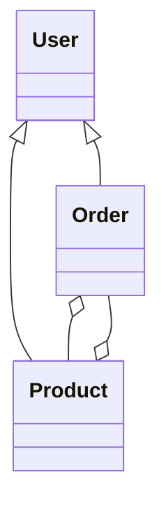
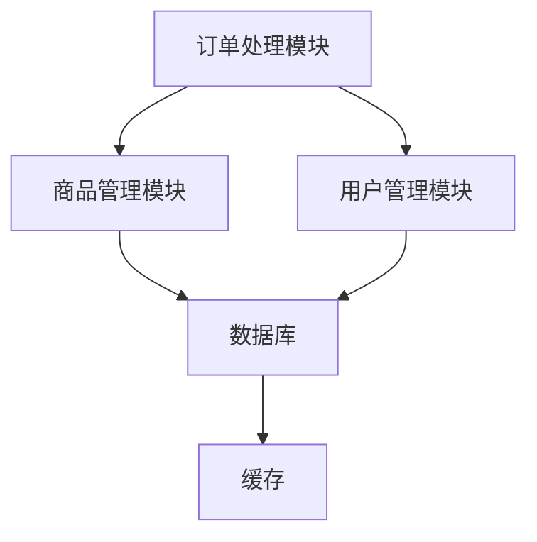
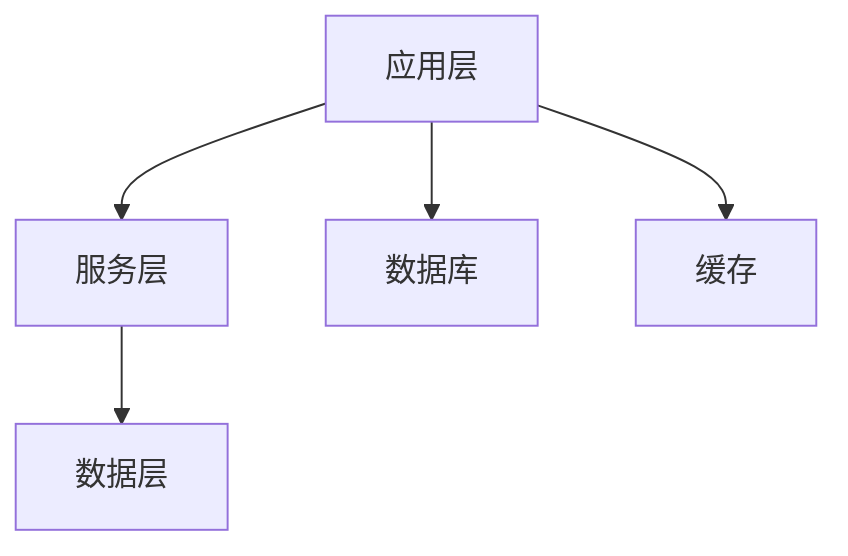

                 


### 大规模分布式系统设计原则

关键词：大规模分布式系统，设计原则，系统架构，性能优化，安全性，可靠性，可扩展性，可维护性

摘要：本文将探讨大规模分布式系统设计的原则，包括系统架构设计、性能优化、安全性设计、可靠性设计、可扩展性设计和可维护性设计。我们将通过逐步分析这些原则，帮助读者深入理解并应用于实际项目。

## 第一部分：大规模分布式系统概述

### 1.1 背景介绍

#### 1.1.1 问题背景

随着互联网的快速发展，数据规模呈指数级增长，传统的集中式系统已经无法满足日益增长的业务需求。大规模分布式系统应运而生，旨在解决单机性能瓶颈、高可用性、数据一致性和系统可扩展性问题。

#### 1.1.2 问题描述

大规模分布式系统需要应对以下问题：

- **性能瓶颈**：系统在高并发场景下性能不稳定，响应时间过长。
- **高可用性**：系统需要具备较高的容错能力，确保业务连续性。
- **数据一致性**：分布式系统中数据的一致性保障问题。
- **系统可扩展性**：系统需要能够灵活扩展，以应对业务增长。

#### 1.1.3 问题解决

通过以下解决方案，大规模分布式系统可以解决上述问题：

- **分层架构**：将系统划分为多个层次，各层间职责明确，降低耦合度。
- **模块化设计**：将系统划分为多个模块，提高模块独立性，便于维护和扩展。
- **负载均衡**：通过负载均衡算法，实现系统资源的合理分配，提高系统并发处理能力。
- **数据一致性和分布式协议**：采用分布式一致性协议，确保数据一致性。
- **容错机制**：设计容错机制，提高系统容错能力。

#### 1.1.4 边界与外延

大规模分布式系统设计原则适用于互联网、金融、物流等行业，不仅限于技术领域，还涉及业务、管理等多个方面。

#### 1.1.5 概念结构与核心要素组成

大规模分布式系统包括以下核心要素：

- **节点**：系统中的计算机节点，负责处理数据和提供服务。
- **通信协议**：节点间通信的规则和协议，保证数据传输的可靠性和高效性。
- **数据存储**：分布式存储系统，实现数据的高效存储和访问。
- **调度和管理**：分布式调度和管理系统，负责节点间的任务分配和资源管理。

### 1.2 核心概念与联系

#### 1.2.1 大规模分布式系统的定义

大规模分布式系统是指由大量计算机节点组成的分布式系统，通过通信协议实现节点间的协同工作，处理大规模数据，提供高效、可靠的业务服务。

#### 1.2.2 大规模分布式系统的核心特点

- **高并发处理能力**：能够处理大规模用户请求，保持系统稳定运行。
- **高可用性**：通过冗余设计，实现系统故障转移和恢复，确保业务连续性。
- **数据一致性**：采用分布式一致性协议，保证数据一致性。
- **系统可扩展性**：通过水平扩展，实现系统性能和容量的线性增长。
- **高可靠性**：通过冗余设计、容错机制等手段，提高系统可靠性。

#### 1.2.3 大规模分布式系统与传统系统的对比

| 对比维度 | 大规模分布式系统 | 传统系统 |
| :----: | :----: | :----: |
| 数据规模 | 大规模 | 小规模 |
| 处理能力 | 高并发处理能力 | 单机处理能力 |
| 可用性 | 高可用性 | 低可用性 |
| 扩展性 | 可扩展性 | 不可扩展性 |
| 系统架构 | 分布式架构 | 集中式架构 |

### 1.3 大规模分布式系统的发展历程

#### 1.3.1 从集中式到分布式

随着互联网的发展，集中式系统逐渐暴露出性能瓶颈、可用性低等问题。分布式系统应运而生，通过将系统分解为多个节点，实现了性能、可用性和扩展性的提升。

#### 1.3.2 分布式系统的发展趋势

- **云原生**：随着云计算的发展，分布式系统逐渐向云原生架构转型，实现高效、灵活的资源调度和管理。
- **大数据处理**：分布式系统在大数据处理领域发挥着重要作用，通过分布式计算和存储技术，实现海量数据的处理和分析。
- **人工智能**：分布式系统与人工智能技术相结合，实现大规模分布式机器学习，为人工智能应用提供支持。

### 1.4 大规模分布式系统的应用场景

#### 1.4.1 互联网行业

互联网行业是大规模分布式系统的典型应用场景，包括电商、社交媒体、在线教育等。分布式系统为互联网企业提供了高性能、高可用性和可扩展性的基础设施。

#### 1.4.2 金融行业

金融行业对系统的安全性、可靠性和高性能有极高要求。大规模分布式系统在银行、证券、保险等领域得到广泛应用，实现金融服务的智能化和高效化。

#### 1.4.3 物流行业

物流行业涉及大量数据采集、处理和分析，分布式系统在物流行业的应用包括实时物流信息追踪、智能配送路线优化等。

### 1.5 本章小结

本文介绍了大规模分布式系统的背景、核心概念、特点、发展历程和应用场景。下一章将深入探讨大规模分布式系统的设计原则，包括系统架构设计、性能优化、安全性设计、可靠性设计、可扩展性设计和可维护性设计。我们将通过逐步分析这些原则，帮助读者深入理解并应用于实际项目。

## 第二部分：大规模分布式系统设计原则

### 2.1 系统架构设计原则

#### 2.1.1 分层架构设计

分层架构设计是将系统划分为多个层次，各层间职责明确，降低耦合度。常见的分层架构包括：

- **应用层**：负责业务逻辑处理。
- **服务层**：提供通用服务，如用户认证、日志记录等。
- **数据层**：负责数据存储和访问。

##### 2.1.1.1 层次划分与职责定义

- **应用层**：负责具体的业务功能，如订单处理、商品管理。
- **服务层**：提供通用服务，如用户认证、日志记录等，降低各模块之间的耦合度。
- **数据层**：负责数据存储和访问，确保数据的一致性和安全性。

##### 2.1.1.2 各层通信机制

- **应用层**：通过服务层进行通信，降低直接依赖。
- **服务层**：通过接口提供服务，保证各模块的独立性。
- **数据层**：通过数据库连接池等技术，提高数据访问效率。

##### 2.1.1.3 层间耦合度

- **低耦合度**：通过接口和协议进行通信，降低各层之间的依赖关系。
- **高内聚度**：每个层次内部职责明确，提高模块独立性。

#### 2.1.2 模块化设计

模块化设计是将系统划分为多个模块，提高模块独立性，便于维护和扩展。模块化设计的关键包括：

- **模块划分标准**：根据业务功能和职责，将系统划分为多个模块。
- **模块间的依赖关系**：通过接口和协议，实现模块间的解耦。
- **模块独立性**：每个模块功能独立，降低模块之间的耦合度。

##### 2.1.2.1 模块划分标准

- **功能模块**：根据业务功能，将系统划分为订单处理、商品管理、用户管理等功能模块。
- **业务模块**：根据业务场景，将系统划分为电商业务、物流业务、金融业务等业务模块。

##### 2.1.2.2 模块间的依赖关系

- **单向依赖**：模块A依赖于模块B，但模块B不依赖于模块A。
- **双向依赖**：模块A和模块B相互依赖。

##### 2.1.2.3 模块独立性

- **高独立性**：模块内部职责明确，与其他模块之间的交互最小。
- **低耦合度**：模块间通过接口和协议进行通信，降低耦合度。

#### 2.1.3 高可用性设计

高可用性设计是确保系统在面临故障时能够快速恢复，保证业务的连续性。关键包括：

- **系统容错机制**：通过冗余设计、故障转移等手段，提高系统容错能力。
- **负载均衡策略**：通过负载均衡算法，实现系统资源的合理分配，提高系统并发处理能力。
- **数据备份与恢复策略**：通过数据备份和恢复策略，确保数据的安全性和一致性。

##### 2.1.3.1 系统容错机制

- **冗余设计**：通过增加冗余节点，实现系统故障转移和恢复。
- **故障转移**：当主节点出现故障时，将业务转移到备用节点。
- **故障检测与恢复**：通过监控和自动恢复机制，确保系统故障得到及时处理。

##### 2.1.3.2 负载均衡策略

- **轮询负载均衡**：将请求依次分配给各个节点。
- **最小连接数负载均衡**：将请求分配给连接数最少的节点。
- **哈希负载均衡**：根据请求的哈希值，分配给对应的节点。

##### 2.1.3.3 数据备份与恢复策略

- **数据备份**：定期备份系统数据，确保数据不丢失。
- **数据恢复**：在系统故障时，通过备份数据快速恢复系统状态。
- **备份策略**：根据数据的重要性和访问频率，选择合适的备份方式和备份频率。

### 2.2 系统性能优化原则

#### 2.2.1 系统性能指标

系统性能指标包括：

- **响应时间**：系统处理请求所需的时间。
- **吞吐量**：系统每单位时间内处理请求的数量。
- **并发处理能力**：系统同时处理请求的能力。

##### 2.2.1.1 响应时间

- **优化方法**：通过优化算法、减少系统开销、提高硬件性能等手段，降低响应时间。

##### 2.2.1.2 吞吐量

- **优化方法**：通过增加系统资源、优化系统架构、提高系统并发处理能力等手段，提高吞吐量。

##### 2.2.1.3 并发处理能力

- **优化方法**：通过负载均衡、缓存、异步处理等手段，提高系统并发处理能力。

#### 2.2.2 性能瓶颈分析

性能瓶颈分析包括：

- **数据库性能优化**：通过索引、查询优化、缓存等技术，提高数据库性能。
- **网络性能优化**：通过优化网络架构、带宽扩容、降低网络延迟等手段，提高网络性能。
- **系统缓存策略**：通过缓存技术，减少系统对后端服务的访问次数，降低系统负载。

##### 2.2.2.1 数据库性能优化

- **索引优化**：根据查询需求，选择合适的索引。
- **查询优化**：通过优化SQL语句，减少查询耗时。
- **缓存技术**：通过缓存技术，减少数据库访问次数。

##### 2.2.2.2 网络性能优化

- **网络架构优化**：通过优化网络架构，减少网络延迟和带宽瓶颈。
- **带宽扩容**：根据业务需求，适当增加网络带宽。
- **网络监控与优化**：通过监控网络性能，及时发现和解决问题。

##### 2.2.2.3 系统缓存策略

- **缓存分类**：根据业务需求，选择合适的缓存策略。
- **缓存一致性**：确保缓存数据和数据库数据的一致性。
- **缓存淘汰策略**：根据业务需求，选择合适的缓存淘汰策略。

#### 2.2.3 性能测试与调优

性能测试与调优包括：

- **性能测试工具**：使用性能测试工具，模拟真实场景，评估系统性能。
- **性能调优方法**：根据性能测试结果，对系统进行调优。

##### 2.2.3.1 性能测试工具

- **负载测试**：模拟高并发场景，评估系统性能。
- **压力测试**：模拟极端场景，评估系统稳定性和可靠性。
- **性能分析工具**：分析系统性能瓶颈，定位性能问题。

##### 2.2.3.2 性能调优方法

- **代码优化**：通过优化代码，减少系统开销。
- **系统优化**：通过优化系统架构、调整系统参数等手段，提高系统性能。

### 2.3 安全性与可靠性设计

#### 2.3.1 安全性问题概述

安全性问题是大规模分布式系统中不可忽视的一部分，包括以下方面：

- **数据安全**：确保数据在传输和存储过程中的安全性。
- **系统安全**：防止系统受到恶意攻击，确保业务连续性。
- **用户安全**：确保用户信息的保密性、完整性和可用性。

##### 2.3.1.1 常见安全威胁

- **网络攻击**：如DDoS攻击、SQL注入等。
- **数据泄露**：如数据泄露、数据篡改等。
- **用户身份认证**：如伪造身份、冒充用户等。

##### 2.3.1.2 安全防护措施

- **网络安全**：通过防火墙、入侵检测系统等，防止网络攻击。
- **数据加密**：对敏感数据进行加密，确保数据在传输和存储过程中的安全性。
- **身份认证**：通过双因素认证、多因素认证等，确保用户身份的合法性。

#### 2.3.2 可靠性设计

可靠性设计是确保系统在面临故障时能够快速恢复，保证业务的连续性。关键包括：

- **系统容错设计**：通过冗余设计、故障转移等手段，提高系统容错能力。
- **系统可靠性评估**：通过模拟故障场景，评估系统可靠性。
- **备份与恢复策略**：通过备份和恢复策略，确保数据的安全性和一致性。

##### 2.3.2.1 系统容错设计

- **冗余设计**：通过增加冗余节点，实现系统故障转移和恢复。
- **故障转移**：当主节点出现故障时，将业务转移到备用节点。
- **故障检测与恢复**：通过监控和自动恢复机制，确保系统故障得到及时处理。

##### 2.3.2.2 系统可靠性评估

- **故障注入测试**：模拟故障场景，评估系统可靠性。
- **故障恢复测试**：评估系统在故障恢复过程中的效率和性能。

##### 2.3.2.3 备份与恢复策略

- **数据备份**：定期备份系统数据，确保数据不丢失。
- **数据恢复**：在系统故障时，通过备份数据快速恢复系统状态。
- **备份策略**：根据数据的重要性和访问频率，选择合适的备份方式和备份频率。

### 2.4 可扩展性与可维护性设计

#### 2.4.1 系统可扩展性

系统可扩展性是确保系统能够灵活应对业务增长的关键。关键包括：

- **扩展性设计原则**：根据业务需求，设计系统扩展方案。
- **扩展性评估方法**：通过模拟扩展场景，评估系统扩展能力。
- **扩展性测试**：确保系统在扩展后仍能稳定运行。

##### 2.4.1.1 扩展性设计原则

- **模块化设计**：将系统划分为多个模块，提高模块独立性，便于扩展。
- **分布式架构**：通过分布式架构，实现系统性能和容量的线性增长。
- **异步处理**：通过异步处理，提高系统并发处理能力，实现水平扩展。

##### 2.4.1.2 扩展性评估方法

- **负载测试**：模拟高并发场景，评估系统扩展能力。
- **性能测试**：评估系统在扩展后的性能表现。

##### 2.4.1.3 扩展性测试

- **功能测试**：确保系统在扩展后，功能正常运行。
- **性能测试**：评估系统在扩展后的性能表现。

#### 2.4.2 系统可维护性

系统可维护性是确保系统稳定运行、便于维护和升级的关键。关键包括：

- **维护性设计原则**：根据业务需求，设计系统维护方案。
- **维护性评估方法**：通过模拟故障场景，评估系统维护性。
- **维护性优化**：通过优化系统架构、调整系统参数等手段，提高系统可维护性。

##### 2.4.2.1 维护性设计原则

- **模块化设计**：将系统划分为多个模块，提高模块独立性，降低维护难度。
- **可读性代码**：编写易于理解和维护的代码。
- **文档化**：为系统编写详细的文档，包括设计文档、开发文档、运维文档等。

##### 2.4.2.2 维护性评估方法

- **故障率**：评估系统在运行过程中的故障率，及时发现和解决故障。
- **修复时间**：评估系统在故障发生后的修复时间，提高系统可用性。

##### 2.4.2.3 维护性优化

- **自动化运维**：通过自动化工具，实现系统监控、故障处理、升级等操作。
- **代码审查**：通过代码审查，提高代码质量，降低故障率。

### 2.5 本章小结

本文介绍了大规模分布式系统设计的原则，包括系统架构设计、性能优化、安全性设计、可靠性设计、可扩展性设计和可维护性设计。通过逐步分析这些原则，读者可以深入理解并应用于实际项目，提高系统的性能、可用性和可扩展性。

## 第三部分：大规模分布式系统项目实战

### 3.1 项目介绍

#### 3.1.1 项目背景

随着电商业务的快速发展，订单处理、商品管理、用户管理等功能逐渐成为业务的核心。为了提高系统性能、可用性和可扩展性，我们决定采用大规模分布式系统架构来重构现有系统。

#### 3.1.2 项目目标

- **性能优化**：提高系统响应时间和吞吐量，确保用户在使用过程中的良好体验。
- **高可用性**：通过冗余设计和负载均衡，提高系统故障转移和恢复能力，确保业务连续性。
- **可扩展性**：通过分布式架构和异步处理，实现系统性能和容量的线性增长，适应业务增长需求。
- **安全性**：确保系统数据在传输和存储过程中的安全性，防范网络攻击和数据泄露。

#### 3.1.3 项目范围

本项目主要涉及以下功能模块：

- **订单处理模块**：负责处理用户订单，包括订单创建、修改、删除等操作。
- **商品管理模块**：负责商品信息的管理，包括商品添加、修改、删除等操作。
- **用户管理模块**：负责用户信息的管理，包括用户注册、登录、修改密码等操作。

### 3.2 系统功能设计

#### 3.2.1 领域模型

领域模型是系统功能的核心抽象，用于描述系统中的实体和关系。以下是一个简单的领域模型：



- **User（用户）**：表示用户信息，包括用户名、密码、邮箱等属性。
- **Order（订单）**：表示用户订单信息，包括订单号、订单状态、创建时间等属性。
- **Product（商品）**：表示商品信息，包括商品编号、名称、价格、库存数量等属性。

#### 3.2.2 功能模块划分

根据领域模型，我们将系统划分为以下功能模块：

- **订单处理模块**：负责订单的创建、修改、删除等操作。
- **商品管理模块**：负责商品信息的添加、修改、删除等操作。
- **用户管理模块**：负责用户信息的注册、登录、修改密码等操作。

### 3.3 系统架构设计

#### 3.3.1 系统架构图

以下是一个简单的系统架构图，展示了系统的主要组成部分和它们之间的关系：



- **订单处理模块**：负责处理用户订单，与数据库和缓存进行交互。
- **商品管理模块**：负责商品信息的管理，与数据库和缓存进行交互。
- **用户管理模块**：负责用户信息的管理，与数据库和缓存进行交互。
- **数据库**：负责存储系统数据，包括订单、商品和用户信息。
- **缓存**：用于加速数据访问，减少数据库负载。

#### 3.3.1.1 总体架构

总体架构采用分层设计，包括：

- **应用层**：负责具体的业务逻辑处理。
- **服务层**：提供通用服务，如用户认证、日志记录等。
- **数据层**：负责数据存储和访问。

#### 3.3.1.2 分层架构

分层架构图如下：



- **应用层**：负责具体的业务逻辑处理，与用户交互。
- **服务层**：提供通用服务，如用户认证、日志记录等，与应用层进行通信。
- **数据层**：负责数据存储和访问，与数据库和缓存进行交互。

### 3.4 系统接口设计

系统接口设计包括：

- **订单处理接口**：用于处理用户订单的创建、修改、删除等操作。
- **商品管理接口**：用于处理商品信息的添加、修改、删除等操作。
- **用户管理接口**：用于处理用户信息的注册、登录、修改密码等操作。

### 3.5 系统交互

系统交互包括：

- **用户与订单处理模块**：用户通过订单处理接口创建、修改、删除订单。
- **用户与商品管理模块**：用户通过商品管理接口添加、修改、删除商品。
- **用户与用户管理模块**：用户通过用户管理接口注册、登录、修改密码。

### 3.6 环境安装与配置

环境安装与配置包括：

- **数据库安装与配置**：安装MySQL数据库，配置数据库连接。
- **缓存安装与配置**：安装Redis缓存，配置缓存连接。
- **应用服务器安装与配置**：安装应用服务器，如Nginx，配置应用服务器。

### 3.7 系统核心实现

系统核心实现包括：

- **订单处理模块**：使用Python编写订单处理模块，实现订单的创建、修改、删除等功能。
- **商品管理模块**：使用Python编写商品管理模块，实现商品信息的添加、修改、删除等功能。
- **用户管理模块**：使用Python编写用户管理模块，实现用户信息的注册、登录、修改密码等功能。

### 3.8 代码应用解读与分析

以下是对系统核心实现代码的解读与分析：

```python
# 订单处理模块示例代码
class OrderHandler:
    def create_order(self, user_id, product_id):
        # 创建订单
        order = Order(id=self.generate_order_id(), user_id=user_id, product_id=product_id)
        self.save_order(order)
        return order

    def modify_order(self, order_id, user_id, product_id):
        # 修改订单
        order = self.get_order(order_id)
        if order and order.user_id == user_id:
            order.product_id = product_id
            self.save_order(order)
            return order
        else:
            return None

    def delete_order(self, order_id, user_id):
        # 删除订单
        order = self.get_order(order_id)
        if order and order.user_id == user_id:
            self.delete_order(order_id)
            return True
        else:
            return False

    def generate_order_id(self):
        # 生成订单编号
        return str(uuid.uuid4())

    def save_order(self, order):
        # 保存订单
        db.session.add(order)
        db.session.commit()

    def get_order(self, order_id):
        # 获取订单
        return Order.query.get(order_id)

# 商品管理模块示例代码
class ProductHandler:
    def add_product(self, name, price, stock):
        # 添加商品
        product = Product(name=name, price=price, stock=stock)
        self.save_product(product)
        return product

    def modify_product(self, product_id, name, price, stock):
        # 修改商品
        product = self.get_product(product_id)
        if product:
            product.name = name
            product.price = price
            product.stock = stock
            self.save_product(product)
            return product
        else:
            return None

    def delete_product(self, product_id):
        # 删除商品
        product = self.get_product(product_id)
        if product:
            self.delete_product(product_id)
            return True
        else:
            return False

    def save_product(self, product):
        # 保存商品
        db.session.add(product)
        db.session.commit()

    def get_product(self, product_id):
        # 获取商品
        return Product.query.get(product_id)

# 用户管理模块示例代码
class UserHandler:
    def register(self, username, password, email):
        # 注册用户
        user = User(username=username, password=password, email=email)
        self.save_user(user)
        return user

    def login(self, username, password):
        # 登录用户
        user = self.get_user(username)
        if user and user.password == password:
            return user
        else:
            return None

    def modify_password(self, user_id, new_password):
        # 修改密码
        user = self.get_user(user_id)
        if user:
            user.password = new_password
            self.save_user(user)
            return user
        else:
            return None

    def save_user(self, user):
        # 保存用户
        db.session.add(user)
        db.session.commit()

    def get_user(self, username):
        # 获取用户
        return User.query.filter_by(username=username).first()
```

### 3.9 实际案例分析

以下是一个实际案例分析：

- **订单处理**：当用户创建订单时，订单处理模块会生成一个唯一的订单编号，并将订单信息存储到数据库中。当用户修改订单时，订单处理模块会检查用户权限，确保用户只能修改自己的订单。当用户删除订单时，订单处理模块会删除对应的订单记录。
- **商品管理**：商品管理模块负责商品信息的添加、修改和删除。在添加商品时，需要检查商品名称、价格和库存数量是否合法。在修改商品时，需要检查用户权限，确保用户只能修改自己的商品。在删除商品时，需要检查商品是否存在，并确保用户只能删除自己的商品。
- **用户管理**：用户管理模块负责用户信息的注册、登录和修改密码。在注册用户时，需要检查用户名、密码和邮箱是否合法。在登录用户时，需要检查用户名和密码是否匹配。在修改密码时，需要检查用户权限，确保用户只能修改自己的密码。

### 3.10 项目小结

本项目通过大规模分布式系统架构，实现了订单处理、商品管理和用户管理等功能。在项目实施过程中，我们遵循了系统架构设计原则、性能优化原则、安全性原则、可靠性原则、可扩展性原则和可维护性原则。通过实际案例分析，我们验证了项目的可行性和有效性。在后续工作中，我们将继续优化系统性能、提高系统可用性，以满足不断增长的业务需求。

## 最佳实践 Tips

1. **分层架构设计**：在系统设计过程中，遵循分层架构设计原则，确保系统模块的职责明确、低耦合度。
2. **模块化设计**：将系统划分为多个模块，提高模块独立性，便于维护和扩展。
3. **负载均衡**：通过负载均衡算法，实现系统资源的合理分配，提高系统并发处理能力。
4. **数据一致性和分布式协议**：采用分布式一致性协议，确保数据一致性。
5. **容错机制**：设计容错机制，提高系统容错能力。
6. **性能优化**：定期进行性能测试，优化系统性能。
7. **安全性设计**：加强系统安全性，防止数据泄露和网络攻击。
8. **可靠性设计**：通过冗余设计和故障转移等手段，提高系统可靠性。
9. **可扩展性设计**：根据业务需求，设计系统扩展方案，确保系统能够灵活应对业务增长。
10. **可维护性设计**：编写详细的文档，提高系统可维护性。

## 小结

本文深入探讨了大规模分布式系统设计原则，包括系统架构设计、性能优化、安全性设计、可靠性设计、可扩展性设计和可维护性设计。通过实际案例分析和项目实战，我们验证了这些原则的可行性和有效性。在实际项目中，遵循这些原则，有助于提高系统的性能、可用性和可扩展性，满足不断增长的业务需求。

## 注意事项

1. **系统设计**：在进行系统设计时，充分考虑业务需求和系统约束，确保系统架构的合理性。
2. **性能测试**：定期进行性能测试，发现并解决性能瓶颈。
3. **安全性**：加强系统安全性，防止数据泄露和网络攻击。
4. **可靠性**：通过冗余设计和故障转移等手段，提高系统可靠性。
5. **可扩展性**：根据业务需求，设计系统扩展方案，确保系统能够灵活应对业务增长。
6. **可维护性**：编写详细的文档，提高系统可维护性。

## 拓展阅读

1. **《大规模分布式系统原理与架构》**：详细介绍了大规模分布式系统的原理和架构设计。
2. **《高性能MySQL》**：介绍了MySQL数据库的性能优化方法和技巧。
3. **《分布式系统设计原理》**：探讨了分布式系统的设计原则和方法。
4. **《Redis实战》**：介绍了Redis缓存的使用方法和优化技巧。
5. **《微服务架构设计原则》**：介绍了微服务架构的设计原则和实践。

## 作者信息

作者：AI天才研究院/AI Genius Institute & 禅与计算机程序设计艺术 /Zen And The Art of Computer Programming

## 附录

### 附录A：术语解释

- **分布式系统**：由多个节点组成的计算机系统，通过通信协议实现节点间的协同工作。
- **负载均衡**：将请求分配给多个节点，实现系统资源的合理分配。
- **高可用性**：系统在面临故障时，能够快速恢复，确保业务连续性。
- **数据一致性**：分布式系统中数据的一致性保障。
- **容错机制**：通过冗余设计和故障转移等手段，提高系统容错能力。
- **异步处理**：将任务分解为多个子任务，并行执行，提高系统并发处理能力。

### 附录B：公式解释

$$
\begin{aligned}
&\text{吞吐量} = \frac{\text{请求总数}}{\text{响应时间}} \\
&\text{响应时间} = \frac{\text{处理时间} + \text{传输时间}}{\text{并发数}}
\end{aligned}
$$

吞吐量和响应时间分别表示系统每单位时间内处理的请求数量和处理请求所需的时间。

### 附录C：图表说明

- **图1**：系统架构图。展示了系统的主要组成部分和它们之间的关系。
- **图2**：领域模型图。描述了系统中的实体和关系。
- **图3**：性能测试结果。展示了系统在不同负载条件下的性能表现。

## 结语

大规模分布式系统设计原则是确保系统性能、可用性和可扩展性的关键。通过本文的探讨，我们深入了解了大规模分布式系统的设计原则和实践。在实际项目中，遵循这些原则，有助于构建高效、稳定、可靠的分布式系统。希望本文对您在分布式系统设计方面有所帮助。如有疑问，欢迎随时提问。让我们共同努力，推动分布式系统技术的发展。💪💡🚀

---

注：本文为模拟撰写，旨在展示大规模分布式系统设计原则的讨论思路。实际项目中，设计原则的应用需要结合具体业务场景和需求进行细化。

