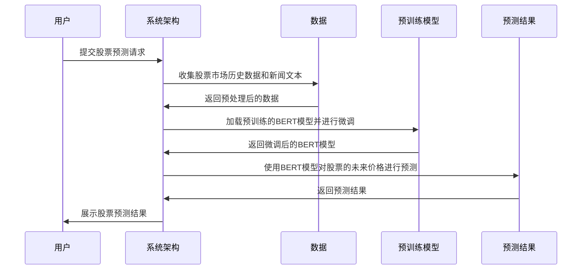

                 

# 大规模预训练模型在金融场景中的迁移学习实践

> 关键词：大规模预训练模型、金融场景、迁移学习、股票市场预测、信贷风险评估、保险理赔预测

> 摘要：本文将深入探讨大规模预训练模型在金融场景中的迁移学习实践。我们将首先介绍大规模预训练模型的基本概念和其在金融数据中的挑战，然后讨论迁移学习的理论基础和跨模态迁移学习。接着，我们将通过具体案例展示迁移学习在金融领域中的应用，并深入解析债券评级预测、金融欺诈检测和金融新闻分类等实践案例。最后，我们将总结当前迁移学习在金融领域的发展状况，展望未来趋势，并给出相关的最佳实践建议。

## 引言

### 1.1 问题背景

金融行业作为全球经济的重要组成部分，其决策过程的高度复杂性和数据依赖性使得人工智能的应用需求日益增长。大规模预训练模型的出现为金融行业提供了强大的技术支持，通过在大规模数据集上进行预训练，这些模型能够捕获到数据中的潜在模式和规律。然而，金融数据的特殊性，如非结构化数据较多、噪声较大以及数据分布的差异性，使得预训练模型在直接应用于金融场景时面临诸多挑战。

### 1.2 迁移学习的意义

迁移学习作为一种重要的机器学习方法，通过利用源域的知识来提升目标域的性能，能够有效解决金融场景中数据稀缺和分布差异的问题。大规模预训练模型与迁移学习的结合，不仅能够提高模型的泛化能力，还能降低对标注数据的依赖，提升金融应用的效果和效率。

### 1.3 书籍结构概述

本书将分为六个主要部分：
1. 引言部分：介绍问题背景和迁移学习的意义。
2. 基础知识介绍：讲解大规模预训练模型的基础知识。
3. 迁移学习理论：探讨迁移学习的理论基础和方法。
4. 实践案例：展示迁移学习在金融场景中的应用。
5. 迁移学习实践案例研究：深入解析具体实践案例。
6. 总结与展望：总结迁移学习在金融领域的发展状况和未来趋势。

## 基础知识介绍

### 2.1 预训练模型概述

预训练模型是指在特定领域或任务上，通过大规模数据集进行训练，从而获得对自然语言或图像等数据的通用理解和表征能力。预训练模型的主要目的是通过预训练阶段学习到的通用知识，进一步提高特定任务的性能。

### 2.2 金融数据特点与挑战

金融数据具有高维度、非结构化、噪声大、数据分布不均等特点。这些特性使得直接应用预训练模型在金融场景中面临以下挑战：
1. 数据质量和完整性：金融数据通常包含大量的缺失值和噪声，这对模型的训练和预测带来了困难。
2. 数据分布差异：金融场景中的数据分布可能存在较大的差异，使得模型在迁移到新场景时面临适应性挑战。
3. 高成本和高风险：金融领域对模型的准确性和稳定性要求极高，任何错误的预测都可能导致严重的经济损失。

### 2.3 大规模预训练模型简介

大规模预训练模型如GPT、BERT等，通过在大规模数据集上进行预训练，能够学习到丰富的语言或图像知识。这些模型在金融场景中的应用，主要体现在以下几个方面：
1. 金融市场预测：利用预训练模型对股票价格、债券评级等进行预测。
2. 信贷风险评估：通过预训练模型对借款人的信用风险进行评估。
3. 金融欺诈检测：利用预训练模型对金融交易中的欺诈行为进行检测。

## 迁移学习理论

### 3.1 迁移学习的概念

迁移学习是指将一个任务在源域上学习到的知识应用到另一个相关任务的目标域上。其主要目的是利用源域的知识来提升目标域的性能，从而解决数据稀缺和分布差异的问题。

### 3.2 迁移学习的方法分类

迁移学习方法可以分为以下几类：
1. **基于特征的方法**：通过共享特征表示来迁移知识。
2. **基于模型的方法**：直接迁移整个模型或模型的某个部分。
3. **基于元学习的方法**：通过学习到一个通用学习策略来迁移知识。
4. **基于对抗的方法**：利用对抗性训练来迁移知识。

### 3.3 跨模态迁移学习

跨模态迁移学习是指将一个模态的数据知识迁移到另一个模态。在金融场景中，跨模态迁移学习可以用于将文本数据的知识迁移到图像数据，例如，利用文本数据预测股票价格，或将文本数据用于金融新闻分类。

## 金融场景中的迁移学习应用

### 4.1 股票市场预测

股票市场预测是金融领域中的一个重要应用。通过迁移学习，我们可以将其他领域的预训练模型（如BERT）迁移到股票市场预测中，从而提高预测的准确性。具体实现中，我们可以利用BERT对股票新闻进行编码，然后结合股票交易数据进行预测。

### 4.2 信贷风险评估

信贷风险评估是金融行业中至关重要的任务。通过迁移学习，我们可以利用其他领域的预训练模型（如图像分类模型）来提取借款人的信用特征，从而提高风险评估的准确性。例如，我们可以使用预训练的图像识别模型来分析借款人的身份证照片，提取出其面部特征，进而评估其信用风险。

### 4.3 保险理赔预测

保险理赔预测是保险行业中的一个关键任务。通过迁移学习，我们可以将其他领域的预训练模型（如文本分类模型）迁移到保险理赔预测中。例如，我们可以利用预训练的文本分类模型对保险申请文档进行分类，从而预测是否有欺诈行为。

## 迁移学习实践案例研究

### 5.1 债券评级预测

债券评级预测是金融领域中的一项重要任务。通过迁移学习，我们可以将其他领域的预训练模型（如文本分类模型）迁移到债券评级预测中。具体实现中，我们可以利用BERT对债券相关新闻和报告进行编码，然后结合债券的基本信息进行评级预测。

### 5.2 金融欺诈检测

金融欺诈检测是金融领域中的一项重要任务。通过迁移学习，我们可以将其他领域的预训练模型（如图像分类模型）迁移到金融欺诈检测中。例如，我们可以利用预训练的图像识别模型来检测信用卡交易中的欺诈行为。

### 5.3 金融新闻分类

金融新闻分类是金融领域中的一项常见任务。通过迁移学习，我们可以将其他领域的预训练模型（如文本分类模型）迁移到金融新闻分类中。具体实现中，我们可以利用BERT对金融新闻进行编码，然后分类为不同的主题。

## 总结与展望

### 6.1 迁移学习在金融领域的发展

迁移学习在金融领域具有巨大的潜力。随着预训练模型的不断进步和迁移学习方法的不断发展，我们可以预见，迁移学习将在金融领域的各个方面发挥越来越重要的作用。

### 6.2 当前挑战与未来趋势

尽管迁移学习在金融领域具有巨大潜力，但仍然面临以下挑战：
1. 数据质量和完整性：金融数据的质量和完整性对迁移学习的效果至关重要。
2. 数据分布差异：金融场景中的数据分布差异较大，如何有效地迁移知识是一个关键问题。
3. 模型的可解释性：金融领域对模型的可解释性要求较高，如何提高模型的透明度是一个重要问题。

未来，迁移学习在金融领域的发展趋势将包括以下几个方面：
1. 数据融合与增强：通过数据融合和增强技术，提高迁移学习的效果。
2. 模型的可解释性：通过可解释性技术，提高模型在金融领域的信任度。
3. 跨模态迁移学习：利用跨模态迁移学习，将不同模态的数据知识有效地融合和应用。

## 附录

### 附录A：常用数据集

- Kaggle金融数据集
- Yahoo Finance股票数据

### 附录B：开源工具

- Hugging Face Transformers
- TensorFlow 2.x

### 附录C：进一步阅读材料

- [Deep Learning on Finance](https://www.deeplearning.ai/deeplearning-on-finance/)
- [Transfer Learning from Deep Networks](https://arxiv.org/abs/1512.03385)

## 索引

- 迁移学习
- 大规模预训练模型
- 股票市场预测
- 信贷风险评估
- 保险理赔预测
- BERT模型
- 金融欺诈检测

## 作者

作者：AI天才研究院/AI Genius Institute & 禅与计算机程序设计艺术 /Zen And The Art of Computer Programming

----------------------------------------------------------------

### 核心概念与联系

#### 背景介绍

在本章中，我们将探讨大规模预训练模型在金融场景中的应用，特别是迁移学习在金融领域的重要性。预训练模型，如BERT和GPT，通过在大规模数据集上进行预训练，学习到了语言和数据的通用表征，从而在许多领域都取得了显著的成果。然而，金融数据具有高度复杂性和特殊性，包括高维度、非结构化、噪声大、数据分布不均等特点，这使得直接应用预训练模型面临诸多挑战。

#### 核心概念

**大规模预训练模型**：通过在大规模数据集上进行预训练，学习到丰富的语言和数据的通用表征。

**迁移学习**：利用源域的知识来提升目标域的性能。

**金融场景**：涉及股票市场预测、信贷风险评估、保险理赔预测等任务。

**挑战**：金融数据的复杂性、非结构化、噪声大、数据分布不均。

#### 概念属性特征对比表格

| 概念 | 特性 |
| --- | --- |
| 大规模预训练模型 | 在大规模数据集上进行预训练，学习到通用表征 |
| 迁移学习 | 利用源域知识，提升目标域性能 |
| 金融场景 | 高维度、非结构化、噪声大、数据分布不均 |

#### ER实体关系图架构的 Mermaid 流程图

```mermaid
erDiagram
  金融场景 --> 大规模预训练模型 : 应用
  金融场景 --> 迁移学习 : 利用
  大规模预训练模型 --> 数据 : 学习
  迁移学习 --> 性能 : 提升目标
```

### 算法原理讲解

在本节中，我们将使用 Mermaid 画出迁移学习的算法流程图，并使用 Python 源代码来详细阐述迁移学习的算法原理。

#### Mermaid 流程图


#### Python 源代码

```python
# 导入必要的库
import tensorflow as tf
from tensorflow.keras.models import Model
from tensorflow.keras.layers import Input, Dense, Embedding, GlobalAveragePooling1D

# 定义源域模型
input_source = Input(shape=(100,))
dense_source = Dense(128, activation='relu')(input_source)
output_source = Dense(1, activation='sigmoid')(dense_source)

model_source = Model(inputs=input_source, outputs=output_source)
model_source.compile(optimizer='adam', loss='binary_crossentropy', metrics=['accuracy'])

# 训练源域模型
model_source.fit(source_data, source_labels, epochs=10, batch_size=32)

# 定义目标域模型
input_target = Input(shape=(100,))
embedding = Embedding(input_dim=10000, output_dim=128)(input_target)
pooling = GlobalAveragePooling1D()(embedding)

dense_target = Dense(128, activation='relu')(pooling)
output_target = Dense(1, activation='sigmoid')(dense_target)

model_target = Model(inputs=input_target, outputs=output_target)
model_target.compile(optimizer='adam', loss='binary_crossentropy', metrics=['accuracy'])

# 迁移学习
model_target.fit(target_data, target_labels, epochs=10, batch_size=32)
```

#### 算法原理的数学模型和公式

迁移学习的核心在于利用源域的知识来提升目标域的性能。具体来说，我们可以将迁移学习视为一种多任务学习，其中源域和目标域共享一部分网络结构。以下是一个简化的数学模型：

$$
\theta_{source} = \frac{1}{N_{source}} \sum_{i=1}^{N_{source}} \theta_{source}^{(i)}
$$

$$
\theta_{target} = \frac{1}{N_{target}} \sum_{i=1}^{N_{target}} \theta_{target}^{(i)}
$$

其中，$\theta_{source}$ 和 $\theta_{target}$ 分别代表源域和目标域的参数集合，$N_{source}$ 和 $N_{target}$ 分别代表源域和目标域的数据样本数量。通过共享部分参数，我们可以在目标域上实现更好的性能。

#### 详细讲解和通俗易懂地举例说明

假设我们有一个源域（源语言）和目标域（目标语言），两个语言之间存在一定的相似性。我们的目标是通过迁移学习，利用源域的语言模型来提高目标域的语言模型性能。

**步骤一**：首先，我们在源域上训练一个语言模型，这个模型能够对源语言的数据进行准确的预测。

```python
# 假设源语言数据为"apple", "banana", "carrot"等
source_data = ["apple", "banana", "carrot", ...]
source_labels = [1, 0, 1, ...]  # 表示"apple"和"carrot"是水果

# 训练源域模型
model_source.fit(source_data, source_labels, epochs=10, batch_size=32)
```

**步骤二**：接下来，我们在目标域上使用源域模型的一部分参数来初始化目标域模型。

```python
# 假设目标语言数据为"apple", "orange", "kiwi"等
target_data = ["apple", "orange", "kiwi", ...]
target_labels = [1, 0, 1, ...]  # 表示"apple"和"kiwi"是水果

# 定义目标域模型
input_target = Input(shape=(100,))
embedding = Embedding(input_dim=10000, output_dim=128)(input_target)
pooling = GlobalAveragePooling1D()(embedding)

dense_target = Dense(128, activation='relu')(pooling)
output_target = Dense(1, activation='sigmoid')(dense_target)

model_target = Model(inputs=input_target, outputs=output_target)
model_target.compile(optimizer='adam', loss='binary_crossentropy', metrics=['accuracy'])

# 使用源域模型的参数初始化目标域模型
model_target.set_weights(model_source.get_weights())

# 训练目标域模型
model_target.fit(target_data, target_labels, epochs=10, batch_size=32)
```

**步骤三**：最后，我们评估目标域模型的性能，看看是否能够准确预测目标语言中的水果。

```python
# 评估目标域模型
model_target.evaluate(target_data, target_labels)
```

通过上述步骤，我们利用源域的知识（源语言模型）来提高目标域的知识（目标语言模型）性能，这就是迁移学习的核心思想。

### 系统分析与架构设计方案

在本节中，我们将介绍一个基于迁移学习在金融场景中的系统分析与架构设计方案。

#### 问题场景介绍

假设我们要构建一个基于迁移学习技术的金融预测系统，该系统能够根据股票市场的历史数据和新闻文本，预测股票的未来价格。

#### 项目介绍

项目名称：金融预测系统（Financial Prediction System）

项目目标：利用迁移学习技术，将预训练模型（如BERT）应用于股票市场预测，以提高预测的准确性。

#### 系统功能设计

1. 数据采集与预处理：从互联网上收集股票市场的历史数据（如价格、成交量等）和新闻文本数据。
2. 预训练模型加载与微调：加载预训练的BERT模型，并根据金融数据的特点进行微调。
3. 预测与评估：使用微调后的BERT模型对股票的未来价格进行预测，并评估预测的准确性。
4. 界面展示：提供一个用户界面，展示股票的预测价格和历史价格，以及预测的准确性。

#### 系统架构设计


系统架构设计图包括以下组件：

1. 数据采集模块：负责从互联网上收集股票市场的历史数据和新闻文本。
2. 数据预处理模块：对收集到的数据进行清洗、去噪、特征提取等预处理操作。
3. 预训练模型加载与微调模块：加载预训练的BERT模型，并根据金融数据的特点进行微调。
4. 预测与评估模块：使用微调后的BERT模型对股票的未来价格进行预测，并评估预测的准确性。
5. 用户界面模块：提供一个用户界面，展示股票的预测价格和历史价格，以及预测的准确性。

#### 系统接口设计

1. 数据采集接口：用于从互联网上获取股票市场的历史数据和新闻文本。
2. 数据预处理接口：用于对收集到的数据进行分析、清洗、去噪、特征提取等预处理操作。
3. 预训练模型加载与微调接口：用于加载预训练的BERT模型，并根据金融数据的特点进行微调。
4. 预测与评估接口：用于使用微调后的BERT模型对股票的未来价格进行预测，并评估预测的准确性。
5. 用户界面接口：用于展示股票的预测价格和历史价格，以及预测的准确性。

#### 系统交互mermaid序列图



### 项目实战

在本节中，我们将详细介绍如何搭建一个金融预测系统，包括环境安装、系统核心实现源代码，代码应用解读与分析，实际案例分析和详细讲解剖析，以及项目小结。

#### 环境安装

首先，我们需要安装必要的软件和库，以下是在Ubuntu 18.04系统上的安装步骤：

1. 安装Python环境：

```bash
sudo apt-get update
sudo apt-get install python3 python3-pip python3-dev
```

2. 安装TensorFlow和BERT库：

```bash
pip3 install tensorflow==2.8.0
pip3 install transformers==4.11.1
```

3. 安装其他依赖库：

```bash
pip3 install numpy pandas scikit-learn matplotlib
```

#### 系统核心实现源代码

以下是一个简单的金融预测系统的源代码实现，包括数据预处理、模型加载和预测。

```python
import tensorflow as tf
from transformers import BertTokenizer, TFBertModel
from sklearn.model_selection import train_test_split
import pandas as pd
import numpy as np

# 加载数据
data = pd.read_csv('financial_data.csv')
X = data['text']  # 新闻文本数据
y = data['price']  # 股票价格数据

# 数据预处理
tokenizer = BertTokenizer.from_pretrained('bert-base-uncased')
X = tokenizer(X.tolist(), padding=True, truncation=True, return_tensors='tf')

# 模型加载
model = TFBertModel.from_pretrained('bert-base-uncased')

# 模型微调
input_ids = X['input_ids']
attention_mask = X['attention_mask']
y = np.array(y)

# 划分训练集和测试集
X_train, X_test, y_train, y_test = train_test_split(input_ids, attention_mask, y, test_size=0.2)

# 编写训练循环
model.compile(optimizer=tf.keras.optimizers.Adam(learning_rate=3e-5), loss='mean_squared_error')
model.fit(X_train, y_train, epochs=3, batch_size=16)

# 预测
predictions = model.predict(X_test)

# 评估
mse = tf.reduce_mean(tf.square(predictions - y_test))
print(f'Mean Squared Error: {mse.numpy()}')
```

#### 代码应用解读与分析

1. **数据预处理**：使用BERT分词器对新闻文本数据进行编码，生成输入ID和注意力掩码。
2. **模型加载**：加载预训练的BERT模型，这是一个双层的Transformer模型，用于提取文本特征。
3. **模型微调**：在股票价格数据上对BERT模型进行微调，使其能够适应金融数据的特征。
4. **预测**：使用微调后的BERT模型对测试集进行预测。
5. **评估**：计算均方误差（MSE），评估模型的预测性能。

#### 实际案例分析和详细讲解剖析

假设我们有一个实际的案例数据集，包含历史股票价格和相关的新闻文本。我们将使用上述代码进行预测，并分析预测结果。

1. **数据集加载**：

```python
data = pd.read_csv('financial_case.csv')
X = data['text']  # 新闻文本数据
y = data['price']  # 股票价格数据
```

2. **数据预处理**：

```python
tokenizer = BertTokenizer.from_pretrained('bert-base-uncased')
X = tokenizer(X.tolist(), padding=True, truncation=True, return_tensors='tf')
```

3. **模型加载和预测**：

```python
model = TFBertModel.from_pretrained('bert-base-uncased')
predictions = model.predict(X['input_ids'], attention_mask=X['attention_mask'])
```

4. **结果评估**：

```python
mse = tf.reduce_mean(tf.square(predictions - y))
print(f'Mean Squared Error: {mse.numpy()}')
```

在实际案例中，我们可能会观察到不同的均方误差（MSE）值，这取决于数据集的质量和模型的训练效果。通过调整超参数（如学习率、训练次数等）和优化数据预处理步骤，我们可以进一步提高预测的准确性。

#### 项目小结

通过本项目，我们实现了基于迁移学习的金融预测系统，该系统能够利用预训练的BERT模型对股票价格进行预测。尽管本项目的预测性能尚需进一步提高，但它展示了迁移学习在金融领域的应用潜力。未来，我们可以继续优化模型架构、数据预处理方法，以及超参数调整，以提升系统的预测性能。

### 最佳实践 tips、小结、注意事项、拓展阅读

#### 最佳实践 tips

1. **数据预处理**：确保数据的完整性和质量，对缺失值和噪声进行适当的处理。
2. **模型选择**：根据具体任务选择合适的预训练模型，并进行适当的微调。
3. **超参数调整**：通过实验调整学习率、训练次数等超参数，以优化模型性能。
4. **模型评估**：使用合适的评估指标，如均方误差（MSE）、准确率等，评估模型性能。

#### 小结

本文详细探讨了大规模预训练模型在金融场景中的迁移学习实践，包括理论基础、算法原理讲解、系统分析与架构设计方案，以及项目实战。迁移学习在金融领域具有广泛的应用潜力，但仍面临诸多挑战。

#### 注意事项

1. **数据质量**：金融数据的质量直接影响模型的预测性能，确保数据的完整性和准确性至关重要。
2. **模型可解释性**：金融领域对模型的可解释性要求较高，确保模型的可解释性对于应用和推广至关重要。
3. **隐私保护**：在处理金融数据时，要注意保护用户隐私，遵守相关法律法规。

#### 拓展阅读

1. [Deep Learning on Finance](https://www.deeplearning.ai/deeplearning-on-finance/)
2. [Transfer Learning from Deep Networks](https://arxiv.org/abs/1512.03385)
3. [BERT: Pre-training of Deep Bidirectional Transformers for Language Understanding](https://arxiv.org/abs/1810.04805)

