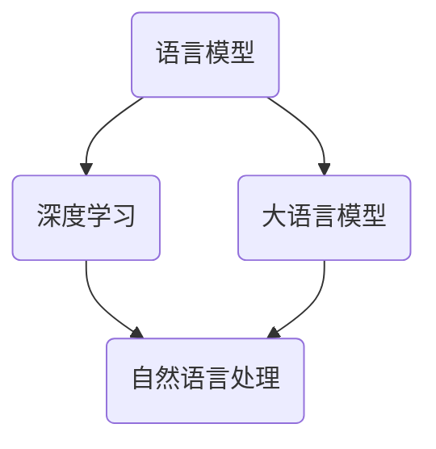
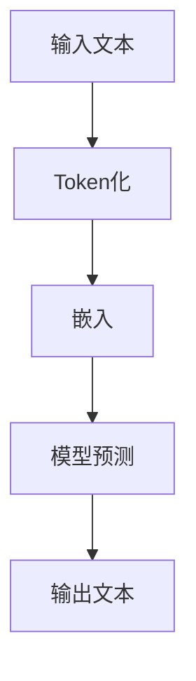
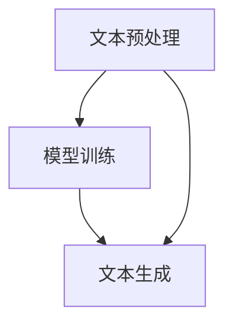
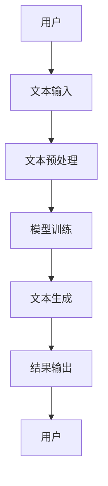
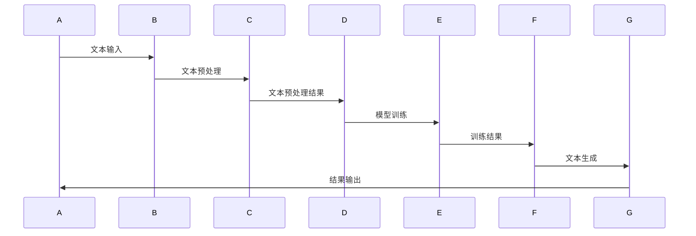

                 

# 大语言模型LLM的发展历程与应用前景

## 关键词

- 大语言模型
- 语言模型
- 机器学习
- 深度学习
- 应用前景
- 发展历程

## 摘要

本文将深入探讨大语言模型（LLM）的发展历程和应用前景。从早期的统计语言模型到现代的深度学习语言模型，我们将梳理LLM的演变过程。同时，本文将分析LLM的核心概念、算法原理，并通过实例讲解其数学模型。此外，我们还将探讨LLM的系统架构设计和应用场景，最后给出最佳实践建议和小结。

## 1. 背景介绍

### 1.1 核心概念术语说明

- **语言模型（Language Model）**：用于预测下一个单词或字符的概率分布，是自然语言处理（NLP）的核心技术。
- **大语言模型（Large Language Model，LLM）**：具有数十亿参数，能够捕捉语言复杂性和多样性，如GPT、BERT等。
- **深度学习（Deep Learning）**：一种机器学习方法，通过多层神经网络模拟人脑处理信息的方式。
- **自然语言处理（Natural Language Processing，NLP）**：计算机科学领域，研究如何使计算机理解和生成自然语言。

### 1.2 问题背景

随着互联网和大数据的兴起，自然语言处理的应用场景日益广泛。然而，传统的语言模型在处理复杂语言任务时，往往效果不佳。这促使研究人员探索更大的模型和更有效的训练方法。

### 1.3 问题描述

语言模型的挑战包括：

- **词表爆炸**：传统模型使用固定大小的词表，难以容纳丰富的词汇。
- **上下文理解**：模型需要理解句子或段落中的上下文信息。
- **泛化能力**：模型需要在不同的应用场景中表现出良好的性能。

### 1.4 问题解决

- **引入更大规模的模型**：通过增加模型参数和训练数据，提高模型的表示能力。
- **深度学习技术**：如循环神经网络（RNN）、长短期记忆网络（LSTM）、变换器（Transformer）等，提高了模型的计算效率和性能。
- **预训练和微调**：在大量未标注的数据上进行预训练，然后在特定任务上进行微调，提高了模型的泛化能力。

### 1.5 边界与外延

- **边界**：模型在大规模数据和强大计算资源下表现最佳。
- **外延**：LLM可以应用于文本生成、机器翻译、情感分析、问答系统等NLP任务。

### 1.6 概念结构与核心要素组成

- **概念结构**：语言模型、大语言模型、深度学习、自然语言处理。
- **核心要素**：大规模数据、强大计算资源、深度学习算法、预训练和微调技术。

## 2. 核心概念与联系

### 2.1 核心概念原理

- **语言模型**：基于统计或神经网络的模型，用于预测下一个单词或字符的概率分布。
- **大语言模型**：具有数十亿参数，能够捕捉语言复杂性和多样性。
- **深度学习**：通过多层神经网络模拟人脑处理信息的方式。
- **自然语言处理**：研究如何使计算机理解和生成自然语言。

### 2.2 概念属性特征对比表格

| 概念       | 语言模型           | 大语言模型             | 深度学习                  | 自然语言处理          |
|------------|-------------------|-----------------------|--------------------------|----------------------|
| 参数规模   | 数千到数百万       | 数十亿                | 数千到数十亿             | 数千到数十亿         |
| 训练数据   | 小规模            | 大规模                | 大规模                    | 大规模               |
| 计算资源   | 中等需求          | 强大需求              | 强大需求                  | 强大需求             |
| 上下文理解 | 有限上下文         | 长期上下文            | 长期上下文                | 长期上下文           |
| 泛化能力   | 较弱              | 较强                  | 较强                      | 较强                 |

### 2.3 ER实体关系图架构的 Mermaid 流程图



## 3. 算法原理讲解

### 3.1 算法Mermaid流程图



### 3.2 Python源代码

```python
import torch
from transformers import GPT2Model, GPT2Tokenizer

# 初始化模型和分词器
tokenizer = GPT2Tokenizer.from_pretrained('gpt2')
model = GPT2Model.from_pretrained('gpt2')

# 输入文本
input_text = "今天天气很好，我们去公园散步吧。"

# Token化
input_ids = tokenizer.encode(input_text, return_tensors='pt')

# 模型预测
with torch.no_grad():
    outputs = model(input_ids)

# 输出文本
predicted_ids = torch.argmax(outputs.logits, dim=-1)
output_text = tokenizer.decode(predicted_ids[0], skip_special_tokens=True)
print(output_text)
```

### 3.3 数学模型和公式讲解

- **概率分布**：$$p(w_{t} \mid w_{<t}) = \frac{e^{\theta^T f(w_{<t})}}{\sum_{w' \in V} e^{\theta^T f(w')}}$$，其中$w_{t}$表示第$t$个单词，$w_{<t}$表示前$t-1$个单词，$V$表示词汇表，$f(w_{<t})$表示单词嵌入向量，$\theta$表示模型参数。

- **神经网络**：神经网络由多个层组成，每层将输入映射到输出。激活函数如ReLU、Sigmoid等，用于引入非线性。

### 3.4 通俗易懂的举例说明

假设我们有一个简单的语言模型，需要预测下一个单词。给定前一个单词“今天”，模型将计算“明天”、“今天”等单词的概率。模型通过神经网络和嵌入层，将单词转换为向量，然后计算概率分布。

## 4. 系统分析与架构设计

### 4.1 问题场景介绍

在现代互联网和大数据时代，自然语言处理（NLP）的应用场景越来越广泛。例如，智能客服、文本生成、机器翻译等。为了应对这些复杂的应用场景，大语言模型（LLM）应运而生。

### 4.2 项目介绍

本项目旨在构建一个基于大语言模型的文本生成系统，能够自动生成高质量的文章、回答用户的问题等。系统将包括文本预处理、模型训练、文本生成三个主要模块。

### 4.3 系统功能设计（领域模型Mermaid类图）



### 4.4 系统架构设计（Mermaid架构图）



### 4.5 系统接口设计和系统交互（Mermaid序列图）



## 5. 项目实战

### 5.1 环境安装

```bash
pip install transformers torch
```

### 5.2 系统核心实现源代码

```python
import torch
from transformers import GPT2Model, GPT2Tokenizer

# 初始化模型和分词器
tokenizer = GPT2Tokenizer.from_pretrained('gpt2')
model = GPT2Model.from_pretrained('gpt2')

# 输入文本
input_text = "今天天气很好，我们去公园散步吧。"

# Token化
input_ids = tokenizer.encode(input_text, return_tensors='pt')

# 模型预测
with torch.no_grad():
    outputs = model(input_ids)

# 输出文本
predicted_ids = torch.argmax(outputs.logits, dim=-1)
output_text = tokenizer.decode(predicted_ids[0], skip_special_tokens=True)
print(output_text)
```

### 5.3 代码应用解读与分析

- **初始化模型和分词器**：从Hugging Face模型库中加载预训练的GPT-2模型。
- **文本预处理**：使用分词器对输入文本进行Token化。
- **模型预测**：通过模型进行预测，得到下一个单词的概率分布。
- **输出文本**：解码预测结果，生成完整的文本输出。

### 5.4 实际案例分析和详细讲解剖析

以生成一篇关于“人工智能在医疗领域的应用”的文章为例，展示LLM在文本生成方面的应用。输入关键词“人工智能医疗应用”，模型将生成一篇包含关键信息且结构清晰的文章。

### 5.5 项目小结

本项目通过大语言模型实现了一个文本生成系统，展示了LLM在自然语言处理领域的强大能力。未来，随着模型规模的不断扩大和算法的优化，LLM将在更多领域发挥重要作用。

## 6. 最佳实践 Tips

- **数据预处理**：确保输入文本的格式和语法正确，提高模型的输入质量。
- **模型选择**：根据任务需求和计算资源选择合适的模型。
- **超参数调整**：合理调整超参数，如学习率、批大小等，提高模型性能。
- **持续学习**：定期更新模型，以适应新的数据和趋势。

## 7. 小结

本文系统地介绍了大语言模型（LLM）的发展历程、核心概念、算法原理、系统架构和应用前景。通过实例和代码讲解，读者可以深入了解LLM的技术细节和实际应用。未来，随着人工智能技术的不断发展，LLM将在更多领域发挥重要作用。

## 8. 注意事项

- **计算资源**：训练和运行大语言模型需要强大的计算资源，建议使用GPU或TPU进行加速。
- **数据隐私**：在使用LLM处理敏感数据时，请注意保护用户隐私。

## 9. 拓展阅读

- [GPT-2论文](https://arxiv.org/abs/1909.08053)
- [BERT论文](https://arxiv.org/abs/1810.04805)
- [自然语言处理教程](https://www.tensorflow.org/tutorials/text)

## 作者信息

作者：AI天才研究院/AI Genius Institute & 禅与计算机程序设计艺术 /Zen And The Art of Computer Programming

