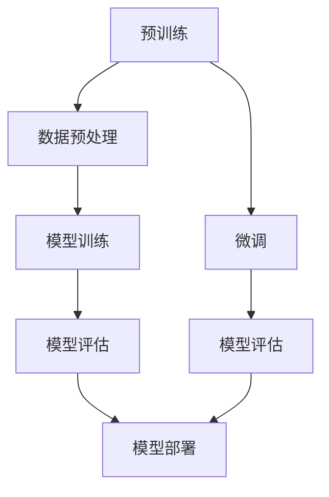

                 

# 大语言模型在金融领域的应用

## 关键词
- 大语言模型
- 金融领域
- 应用场景
- 风险管理
- 客户服务
- 量化交易

## 摘要
本文旨在探讨大语言模型在金融领域的广泛应用。随着金融科技的快速发展，人工智能技术逐渐成为金融行业的重要组成部分。大语言模型作为一种先进的人工智能技术，其在金融领域的应用具有显著的优势。本文首先介绍了金融行业的发展现状和面临的挑战，然后详细阐述了大语言模型的基本原理和特性。接着，本文从金融产品营销、金融风险管理、金融客户服务、金融量化交易四个方面，分析了大语言模型在金融领域的具体应用，并提供了典型案例。最后，本文总结了大语言模型在金融领域的最佳实践，以期为金融行业的发展提供有益的参考。

## 目录大纲

### 第1章 引言
#### 1.1 问题背景
- **金融行业的发展现状**
- **金融行业面临的挑战**
- **大语言模型的发展与应用趋势**

#### 1.2 问题解决
- **大语言模型的基本原理**
- **大语言模型在金融领域的应用场景**

#### 1.3 边界与外延
- **大语言模型在金融领域的适用范围**
- **大语言模型在金融领域的技术门槛**

#### 1.4 核心概念与联系
- **语言模型**
  - **语言模型的基本概念**
  - **语言模型的属性特征对比**
- **大语言模型**
  - **大语言模型的概念**
  - **大语言模型的特性**
- **金融领域相关概念**
  - **金融产品**
  - **金融风险**

#### 1.5 本章小结

### 第2章 大语言模型的基本原理
#### 2.1 大语言模型的定义
- **大语言模型的概念**
- **大语言模型的发展历程**

#### 2.2 大语言模型的工作原理
- **语言模型的基本原理**
- **大语言模型的工作机制**

#### 2.3 大语言模型的主要类型
- **GPT系列模型**
- **BERT及其变体**
- **其他大语言模型**

#### 2.4 大语言模型在金融领域的适用性
- **大语言模型在金融领域的应用现状**
- **大语言模型在金融领域的优势与挑战**

#### 2.5 本章小结

### 第3章 大语言模型在金融领域的应用
#### 3.1 大语言模型在金融产品营销中的应用
- **金融产品营销的挑战**
- **大语言模型在金融产品营销中的应用案例**

#### 3.2 大语言模型在金融风险管理中的应用
- **金融风险管理的挑战**
- **大语言模型在金融风险管理中的应用案例**

#### 3.3 大语言模型在金融客户服务中的应用
- **金融客户服务的挑战**
- **大语言模型在金融客户服务中的应用案例**

#### 3.4 大语言模型在金融量化交易中的应用
- **金融量化交易的挑战**
- **大语言模型在金融量化交易中的应用案例**

#### 3.5 本章小结

### 第4章 大语言模型在金融领域的最佳实践
#### 4.1 金融行业的大语言模型应用策略
- **技术应用建议**
- **实践案例分析**

#### 4.2 注意事项与未来展望
- **潜在风险与挑战**
- **发展趋势与前景**

#### 4.3 拓展阅读
- **相关研究论文和书籍推荐**

### 参考文献

## 第1章 引言

### 1.1 问题背景

金融行业作为现代经济体系的核心，其发展一直备受关注。随着全球化和数字化的加速推进，金融行业面临着前所未有的机遇和挑战。

#### 金融行业的发展现状

近年来，金融行业经历了巨大的变革。一方面，金融科技（FinTech）的快速发展推动了金融服务的创新和优化。移动支付、在线借贷、区块链等技术的应用，使得金融服务更加便捷和高效。另一方面，金融监管的加强和数据安全的要求，也对金融行业提出了更高的标准。

#### 金融行业面临的挑战

尽管金融行业取得了显著的进步，但依然面临着诸多挑战。首先，市场竞争日益激烈，传统金融机构需要不断创新以保持竞争力。其次，金融风险的管理和防控依然是金融行业的重要课题。最后，金融消费者的需求和期望不断提升，如何提供个性化、高效的服务成为金融机构面临的难题。

#### 大语言模型的发展与应用趋势

大语言模型作为一种先进的人工智能技术，其发展迅速，并在多个领域展现出巨大的应用潜力。在金融领域，大语言模型可以通过自然语言处理、文本分析等技术，为金融机构提供智能化解决方案，提升服务质量和风险防控能力。

### 1.2 问题解决

大语言模型在金融领域的应用，旨在解决以下几个关键问题：

#### 大语言模型的基本原理

大语言模型基于深度学习技术，通过大规模数据训练，能够自动学习语言的统计规律和语法结构。其基本原理包括：

- **神经网络**：大语言模型通常采用深度神经网络（DNN）或Transformer架构，能够对输入的文本进行高效处理。
- **注意力机制**：通过注意力机制，模型能够关注到文本中的关键信息，提高处理效果。
- **预训练与微调**：大语言模型通常采用预训练（pre-training）和微调（fine-tuning）的方法，先在大规模语料库上进行预训练，然后针对特定任务进行微调。

#### 大语言模型在金融领域的应用场景

大语言模型在金融领域有广泛的应用场景，主要包括：

- **金融产品营销**：通过文本分析和情感分析，提供个性化的产品推荐和营销策略。
- **金融风险管理**：利用文本分类和情感分析，识别和评估金融风险。
- **金融客户服务**：通过自然语言处理，提供智能客服和语音识别服务。
- **金融量化交易**：通过文本分析和模式识别，优化交易策略和风险控制。

### 1.3 边界与外延

#### 大语言模型在金融领域的适用范围

大语言模型在金融领域的适用范围广泛，涵盖了金融产品营销、风险管理、客户服务和量化交易等多个方面。然而，其应用也存在一定的限制，例如数据质量、算法效率和合规要求等。

#### 大语言模型在金融领域的技术门槛

大语言模型在金融领域的应用，需要具备一定的技术门槛。首先，需要具备深度学习和自然语言处理等相关知识。其次，需要具备大规模数据处理和模型训练的能力。最后，需要关注金融领域的特定需求和合规要求。

### 1.4 核心概念与联系

#### 语言模型

语言模型是自然语言处理（NLP）中的一种基础模型，用于预测文本的下一个单词或词组。其主要特点是：

- **基本概念**：语言模型通过对大量文本进行统计学习，生成一个概率分布，用于预测下一个词。
- **属性特征对比**：

| 特征         | 语言模型         | 大语言模型           |
| ------------ | ---------------- | -------------------- |
| 基础算法     | N-gram模型       | Transformer、GPT系列 |
| 训练数据     | 大规模文本语料库 | 更大规模的语料库       |
| 预测效果     | 较低的准确率     | 高准确率和效率       |
| 应用场景     | 较简单的文本处理 | 复杂的自然语言任务   |

#### 大语言模型

大语言模型是基于深度学习技术的一种先进模型，其特点如下：

- **基本概念**：大语言模型通过预训练和微调，自动学习语言的复杂结构和统计规律。
- **特性**：
  - **高准确率**：通过大规模数据和复杂算法，大语言模型能够达到很高的预测准确率。
  - **多任务处理**：大语言模型可以同时处理多种自然语言任务，如文本分类、情感分析和机器翻译。

#### 金融领域相关概念

金融领域涉及多个核心概念，包括金融产品、金融风险等。

- **金融产品**：金融产品是指金融市场上交易的各类金融工具，如股票、债券、基金等。
- **金融风险**：金融风险是指由于金融市场的不确定性，导致金融资产价值波动的风险。

### 1.5 本章小结

本章首先介绍了金融行业的发展现状和面临的挑战，然后探讨了大语言模型的基本原理和应用场景。通过分析大语言模型在金融领域的适用范围和技术门槛，以及核心概念和联系，为本章内容提供了全面的背景和理论基础。

## 第2章 大语言模型的基本原理

### 2.1 大语言模型的定义

大语言模型（Large Language Model，LLM）是基于深度学习技术的自然语言处理（NLP）模型，它通过对大规模文本数据进行训练，自动学习语言的统计规律和语法结构，从而实现对文本的生成、理解和预测。与传统语言模型相比，大语言模型具有以下几个显著特点：

- **大规模数据训练**：大语言模型通常训练在大规模、多领域的文本语料库上，如维基百科、新闻文章、社交媒体等，这使得模型能够学习到丰富的语言知识和上下文信息。
- **深度神经网络架构**：大语言模型通常采用深度神经网络（DNN）或Transformer架构，这些架构能够对输入的文本进行多层次、多维度的高效处理，从而提高模型的预测能力和泛化能力。
- **高准确率和效率**：通过大规模数据训练和复杂算法，大语言模型能够达到很高的预测准确率和处理效率，适用于多种复杂的自然语言任务。

### 2.2 大语言模型的发展历程

大语言模型的发展经历了多个阶段：

- **早期模型**：早期的大语言模型主要基于统计方法，如N-gram模型，通过计算单词序列的概率分布来生成文本。然而，这些模型的准确率和效率较低。
- **深度学习引入**：随着深度学习技术的发展，神经网络被引入到自然语言处理领域。2000年代初，深度神经网络（DNN）开始应用于语言模型，并取得了一定的成功。
- **Transformer架构**：2017年，谷歌提出了Transformer架构，这是一种基于自注意力机制的深度神经网络，极大提升了语言模型的性能。Transformer架构的引入标志着大语言模型进入了一个新的发展阶段。
- **预训练与微调**：预训练（Pre-training）和微调（Fine-tuning）方法的提出，使得大语言模型能够先在大规模数据上进行预训练，然后针对具体任务进行微调，从而提高模型的性能和应用效果。

### 2.2.1 语言模型的基本原理

语言模型的基本原理是通过计算输入文本序列的概率分布，预测下一个单词或词组。具体来说，语言模型的原理包括以下几个方面：

- **N-gram模型**：N-gram模型是最早的语言模型之一，它通过计算前N个单词出现的概率来生成文本。例如，在二元语法模型中，下一个单词的概率取决于前两个单词。

  $$ P(w_n | w_{n-1}, w_{n-2}, \ldots, w_1) = \frac{N(w_{n-1}, w_n)}{N(w_{n-1})} $$

  其中，$w_n$是下一个单词，$w_{n-1}, w_{n-2}, \ldots, w_1$是前N个单词，$N(w_{n-1}, w_n)$是前两个单词同时出现的次数，$N(w_{n-1})$是前一个单词出现的总次数。

- **深度神经网络（DNN）**：深度神经网络是一种多层神经网络，通过将输入文本向量通过多个隐藏层，最终生成概率分布。DNN能够捕捉到文本的复杂特征和模式。

  $$ \text{output} = \text{softmax}(\text{W}^T \text{h}) $$

  其中，$\text{W}$是权重矩阵，$\text{h}$是隐藏层输出，$\text{softmax}$函数用于生成概率分布。

- **Transformer架构**：Transformer架构是一种基于自注意力机制的深度神经网络，通过计算输入文本序列中每个单词之间的注意力权重，生成概率分布。自注意力机制能够捕捉到文本中的长距离依赖关系。

  $$ \text{Attention}(Q, K, V) = \text{softmax}\left(\frac{QK^T}{\sqrt{d_k}}\right)V $$

  其中，$Q, K, V$分别是查询向量、关键向量、值向量，$d_k$是关键向量的维度。

### 2.2.2 大语言模型的工作机制

大语言模型的工作机制主要包括预训练和微调两个阶段：

- **预训练**：预训练阶段，大语言模型在大规模、多领域的文本语料库上进行训练，学习到语言的通用知识和统计规律。预训练的方法通常包括以下几种：

  - **未标记数据预训练**：在大规模未标记数据上进行预训练，模型通过自动学习数据的统计规律和结构，提高模型的基础能力。
  - **标记数据微调**：在预训练的基础上，使用标记数据对模型进行微调，使其适应特定的任务和数据集。

- **微调**：微调阶段，大语言模型在特定任务和数据集上进行训练，通过调整模型的参数，使其能够更好地适应特定任务。微调的方法通常包括以下几种：

  - **全连接层微调**：在预训练模型的基础上，添加全连接层，用于对特定任务进行预测。
  - **迁移学习**：利用预训练模型在大规模数据上的知识，对特定任务的数据集进行训练，提高模型的性能。

### 2.2.3 大语言模型的mermaid流程图

下面是大型语言模型的工作流程的mermaid流程图：

### 2.2.4 大语言模型的数学模型和公式

大语言模型通常使用深度神经网络（DNN）或Transformer架构，其数学模型和公式如下：

#### 深度神经网络（DNN）

1. 输入向量表示：

   $$ \text{X} = [\text{x}_1, \text{x}_2, \ldots, \text{x}_n] $$

   其中，$\text{x}_i$是输入文本的第i个单词的嵌入向量。

2. 隐藏层输出：

   $$ \text{H} = \text{激活函数}(\text{W} \text{X} + \text{b}) $$

   其中，$\text{W}$是权重矩阵，$\text{b}$是偏置项，激活函数通常使用ReLU函数。

3. 预测输出：

   $$ \text{Y} = \text{softmax}(\text{W}^T \text{H} + \text{b}') $$

   其中，$\text{b}'$是偏置项。

#### Transformer架构

1. 自注意力机制：

   $$ \text{Attention}(Q, K, V) = \text{softmax}\left(\frac{QK^T}{\sqrt{d_k}}\right)V $$

   其中，$Q, K, V$分别是查询向量、关键向量、值向量，$d_k$是关键向量的维度。

2. Encoder输出：

   $$ \text{Encoder}(\text{X}) = \text{softmax}(\text{W}^T \text{H}) $$

   其中，$\text{H}$是隐藏层输出。

3. Decoder输出：

   $$ \text{Decoder}(\text{Y}) = \text{softmax}(\text{W}^T \text{H} + \text{b}') $$

   其中，$\text{b}'$是偏置项。

### 2.3 大语言模型的主要类型

大语言模型有多种类型，其中最具代表性的包括GPT系列模型、BERT及其变体等。

#### GPT系列模型

GPT（Generative Pre-trained Transformer）系列模型是开放AI（OpenAI）开发的一系列基于Transformer架构的大语言模型。GPT模型的主要特点如下：

- **预训练**：GPT模型通过在大规模文本语料库上进行预训练，学习到语言的统计规律和语法结构。
- **生成文本**：GPT模型具有强大的文本生成能力，可以生成高质量的文本。
- **自适应**：GPT模型可以针对不同的应用场景进行微调，提高模型的适应性。

#### BERT及其变体

BERT（Bidirectional Encoder Representations from Transformers）是一种双向Transformer架构的语言模型，由谷歌提出。BERT及其变体具有以下特点：

- **双向编码**：BERT模型采用双向编码器，能够同时考虑文本的左右信息，提高模型的理解能力。
- **预训练**：BERT模型通过在大规模文本语料库上进行预训练，学习到语言的统计规律和上下文信息。
- **应用广泛**：BERT及其变体在多种自然语言处理任务中表现出色，如文本分类、命名实体识别、机器翻译等。

#### 其他大语言模型

除了GPT系列模型和BERT及其变体外，还有许多其他大语言模型，如T5、RoBERTa、ALBERT等。这些模型在架构、训练方法和应用场景上各有特色，但都致力于提高大语言模型的性能和应用效果。

### 2.4 大语言模型在金融领域的适用性

大语言模型在金融领域的适用性主要体现在以下几个方面：

#### 应用现状

- **金融产品营销**：大语言模型可以用于金融产品的个性化推荐和情感分析，提升营销效果和客户体验。
- **金融风险管理**：大语言模型可以用于风险识别、风险评估和预警，提高风险管理的准确性和效率。
- **金融客户服务**：大语言模型可以用于智能客服和语音识别，提升客户服务效率和满意度。
- **金融量化交易**：大语言模型可以用于交易策略的优化和风险控制，提高量化交易的性能和收益。

#### 优势

- **文本分析和理解能力**：大语言模型具有强大的文本分析和理解能力，能够处理复杂的金融文本和数据。
- **个性化推荐和预测**：大语言模型可以通过学习用户的历史数据和偏好，实现个性化的金融产品推荐和预测。
- **自动化和效率**：大语言模型可以实现自动化和高效的处理，降低人工成本和操作风险。

#### 挑战

- **数据质量和多样性**：大语言模型的效果高度依赖于训练数据的质量和多样性，金融领域的数据质量和多样性是一个挑战。
- **算法效率和计算资源**：大语言模型的训练和推理需要大量的计算资源，特别是在处理大规模金融数据时，算法效率和计算资源管理是一个重要问题。
- **合规和法律要求**：金融行业对合规和法律要求较高，大语言模型在金融领域的应用需要遵守相关法规和规定，确保数据的隐私和安全。

### 2.5 本章小结

本章介绍了大语言模型的基本原理，包括定义、发展历程、工作原理、主要类型和适用性。通过深入探讨大语言模型在金融领域的适用性，为后续章节的分析和应用提供了理论基础。

## 第3章 大语言模型在金融领域的应用

### 3.1 大语言模型在金融产品营销中的应用

金融产品营销是金融机构提高市场占有率、吸引客户和增加利润的重要手段。随着人工智能技术的快速发展，大语言模型在金融产品营销中得到了广泛应用，其主要应用包括个性化推荐和情感分析。

#### 3.1.1 金融产品营销的挑战

金融产品营销面临以下几个挑战：

- **个性化推荐**：金融产品种类繁多，如何根据客户的需求和偏好提供个性化的产品推荐是一个难题。传统的方法主要依赖客户的历史交易数据和行为数据，但这种方式难以准确捕捉客户的真实需求和偏好。
- **情感分析**：在金融产品营销中，了解客户的情感状态和态度对于制定有效的营销策略至关重要。然而，客户的情感表达往往是复杂和含糊的，如何准确捕捉和解读客户的情感是一个挑战。

#### 3.1.2 大语言模型在金融产品营销中的应用案例

**案例一：银行个性化推荐系统**

某大型银行通过引入大语言模型，构建了一个个性化推荐系统。该系统首先通过客户的历史交易数据、行为数据和社交数据，利用大语言模型对客户进行深度分析，识别出客户的需求和偏好。然后，系统根据分析结果，为每位客户推荐最适合的金融产品。

具体步骤如下：

1. **数据预处理**：对客户的历史交易数据、行为数据和社交数据（如评论、社交媒体帖子）进行清洗和预处理，提取关键特征。
2. **大语言模型训练**：使用训练好的大语言模型，对预处理后的数据进行情感分析和文本分类，识别出客户的需求和偏好。
3. **个性化推荐**：根据分析结果，为每位客户生成个性化的金融产品推荐列表。

**案例二：保险产品情感分析系统**

某保险公司开发了一套保险产品情感分析系统，利用大语言模型对客户的反馈和评论进行情感分析，以便更好地了解客户的需求和满意度。

具体步骤如下：

1. **数据收集**：收集客户的反馈和评论数据，包括在线评论、社交媒体帖子等。
2. **情感分析**：使用大语言模型对客户反馈进行情感分析，判断客户的情感状态，如正面、负面或中立。
3. **营销策略调整**：根据情感分析结果，调整营销策略，提升客户满意度和转化率。

#### 3.1.3 大语言模型在金融产品营销中的应用效果

大语言模型在金融产品营销中的应用取得了显著的效果：

- **个性化推荐**：通过大语言模型，银行能够更准确地了解客户的需求和偏好，提供个性化的金融产品推荐，从而提高客户满意度和转化率。
- **情感分析**：通过大语言模型，保险公司能够更好地了解客户的情感状态和需求，制定更加有效的营销策略，提高客户满意度和忠诚度。

### 3.2 大语言模型在金融风险管理中的应用

金融风险管理是金融行业的核心任务之一，其目标是通过识别、评估和控制金融风险，确保金融机构的稳健运营。大语言模型在金融风险管理中具有广泛的应用，主要包括风险识别、风险评估和风险预警。

#### 3.2.1 金融风险管理的挑战

金融风险管理面临以下几个挑战：

- **风险识别**：金融风险具有复杂性和隐蔽性，如何及时发现和识别潜在的风险是一个难题。传统的方法主要依赖于历史数据和专家经验，但这种方式难以应对快速变化的金融市场。
- **风险评估**：风险评估需要准确评估风险的概率和影响，以制定有效的风险控制策略。然而，金融风险的影响往往具有不确定性，如何准确评估是一个挑战。
- **风险预警**：金融风险预警需要及时发现和预警潜在的风险，以便采取有效的应对措施。然而，风险预警的准确性对金融机构的运营至关重要。

#### 3.2.2 大语言模型在金融风险管理中的应用案例

**案例一：信贷风险评估系统**

某银行开发了一套基于大语言模型的信贷风险评估系统，通过分析客户的历史交易数据、信用记录和社交数据，对客户的信用风险进行评估。

具体步骤如下：

1. **数据收集**：收集客户的历史交易数据、信用记录和社交数据。
2. **特征提取**：使用大语言模型对数据进行情感分析和文本分类，提取关键特征，如客户的信用状况、还款意愿等。
3. **风险评估**：利用提取的特征，结合机器学习算法，对客户的信用风险进行评估。
4. **风险预警**：根据评估结果，对高风险客户进行预警，采取相应的风险控制措施。

**案例二：投资风险预警系统**

某投资机构开发了一套基于大语言模型的投资风险预警系统，通过分析市场数据、新闻资讯和社交媒体内容，对投资风险进行预警。

具体步骤如下：

1. **数据收集**：收集市场数据、新闻资讯和社交媒体内容。
2. **文本分析**：使用大语言模型对数据进行分析，提取关键信息，如市场情绪、政策变化等。
3. **风险预警**：根据分析结果，对潜在的风险进行预警，为投资者提供参考。
4. **风险控制**：根据预警结果，投资者可以采取相应的风险控制措施，如调整投资组合、暂停投资等。

#### 3.2.3 大语言模型在金融风险管理中的应用效果

大语言模型在金融风险管理中的应用取得了显著的效果：

- **风险识别**：通过大语言模型，金融机构能够更准确地识别潜在的风险，提高风险识别的准确性和及时性。
- **风险评估**：通过大语言模型，金融机构能够更准确地评估风险的概率和影响，为制定有效的风险控制策略提供依据。
- **风险预警**：通过大语言模型，金融机构能够及时发现和预警潜在的风险，提高风险预警的准确性和及时性，从而采取有效的风险控制措施。

### 3.3 大语言模型在金融客户服务中的应用

金融客户服务是金融机构与客户互动的重要渠道，其服务质量直接影响客户的满意度和忠诚度。大语言模型在金融客户服务中具有广泛的应用，主要包括智能客服和语音识别。

#### 3.3.1 金融客户服务的挑战

金融客户服务面临以下几个挑战：

- **客户需求理解**：金融产品和服务种类繁多，如何准确理解客户的提问和需求是一个难题。传统的方法主要依赖人工客服，但这种方式效率低、成本高。
- **服务效率提升**：金融客户服务涉及大量的重复性问题，如何提高服务效率是一个挑战。传统的方法主要依赖于人工客服，但这种方式效率低、成本高。

#### 3.3.2 大语言模型在金融客户服务中的应用案例

**案例一：智能客服系统**

某银行开发了一套基于大语言模型的智能客服系统，通过自然语言处理和文本分类技术，自动处理客户的咨询和投诉。

具体步骤如下：

1. **客户提问分析**：使用大语言模型对客户的提问进行分析，提取关键信息。
2. **文本分类**：使用大语言模型对提取的关键信息进行文本分类，判断客户的问题类型。
3. **知识库查询**：根据分类结果，查询知识库，提供相应的回答。
4. **智能回复**：根据知识库的查询结果，自动生成智能回复，发送给客户。

**案例二：语音识别与自然语言处理系统**

某保险公司开发了一套基于大语言模型的语音识别与自然语言处理系统，通过语音识别和自然语言处理技术，自动处理客户的语音咨询。

具体步骤如下：

1. **语音识别**：使用语音识别技术，将客户的语音转化为文本。
2. **自然语言处理**：使用大语言模型对文本进行分析，提取关键信息。
3. **知识库查询**：根据提取的关键信息，查询知识库，提供相应的回答。
4. **智能回复**：根据知识库的查询结果，自动生成智能回复，发送给客户。

#### 3.3.3 大语言模型在金融客户服务中的应用效果

大语言模型在金融客户服务中的应用取得了显著的效果：

- **客户需求理解**：通过大语言模型，金融机构能够更准确地理解客户的提问和需求，提供个性化的服务。
- **服务效率提升**：通过大语言模型，金融机构能够自动处理客户的咨询和投诉，提高服务效率，降低运营成本。

### 3.4 大语言模型在金融量化交易中的应用

金融量化交易是一种基于数据分析和算法交易的投资策略，其目标是通过分析历史数据和实时数据，预测市场的走势，进行买卖操作，实现投资收益。大语言模型在金融量化交易中具有广泛的应用，主要包括交易策略优化和风险控制。

#### 3.4.1 金融量化交易的挑战

金融量化交易面临以下几个挑战：

- **数据分析**：金融量化交易需要大量数据进行分析，如何从海量数据中提取有用的信息是一个挑战。
- **模型优化**：金融市场的变化复杂，如何构建有效的交易模型，优化交易策略，是一个挑战。
- **风险控制**：金融量化交易涉及高风险投资，如何进行有效的风险控制，降低投资风险，是一个挑战。

#### 3.4.2 大语言模型在金融量化交易中的应用案例

**案例一：量化交易策略系统**

某量化交易团队开发了一套基于大语言模型的量化交易策略系统，通过分析历史数据和实时数据，构建交易策略。

具体步骤如下：

1. **数据收集**：收集历史数据和实时数据，包括市场走势、交易量、新闻资讯等。
2. **文本分析**：使用大语言模型对数据进行分析，提取关键信息，如市场情绪、政策变化等。
3. **模型构建**：利用提取的信息，结合机器学习算法，构建交易策略模型。
4. **策略优化**：根据模型预测结果，对交易策略进行优化，提高交易收益。

**案例二：高频交易系统**

某高频交易团队开发了一套基于大语言模型的高频交易系统，通过实时分析市场数据，进行高频买卖操作，实现投资收益。

具体步骤如下：

1. **数据收集**：收集实时市场数据，包括股票价格、交易量、市场情绪等。
2. **文本分析**：使用大语言模型对实时数据进行文本分析，提取关键信息，如交易信号、市场趋势等。
3. **交易决策**：根据分析结果，进行高频买卖操作，实现投资收益。
4. **风险控制**：通过风险控制模型，对交易风险进行控制，确保交易安全。

#### 3.4.3 大语言模型在金融量化交易中的应用效果

大语言模型在金融量化交易中的应用取得了显著的效果：

- **数据分析**：通过大语言模型，量化交易团队能够从海量数据中提取有用的信息，提高数据分析的准确性和效率。
- **模型优化**：通过大语言模型，量化交易团队能够构建有效的交易模型，优化交易策略，提高交易收益。
- **风险控制**：通过大语言模型，量化交易团队能够进行有效的风险控制，降低交易风险，确保交易安全。

### 3.5 本章小结

本章分析了大语言模型在金融产品营销、金融风险管理、金融客户服务和金融量化交易四个方面的应用。通过提供具体的案例和应用效果，展示了大语言模型在金融领域的重要作用和广阔前景。未来，随着人工智能技术的不断发展，大语言模型在金融领域的应用将会更加广泛和深入。

## 第4章 大语言模型在金融领域的最佳实践

### 4.1 金融行业的大语言模型应用策略

大语言模型在金融行业的应用，需要综合考虑技术、数据、合规等多个方面，制定科学合理的应用策略。以下是一些最佳实践建议：

#### 1. 数据质量管理

- **数据清洗**：确保数据的准确性和一致性，去除噪声数据和重复数据。
- **数据整合**：整合来自不同来源的数据，构建统一的数据视图。
- **数据多样性**：收集多种类型的数据，包括文本、图像、音频等，提高模型的泛化能力。

#### 2. 模型选择与优化

- **模型评估**：选择合适的评估指标，如准确率、召回率、F1分数等，对模型进行评估和优化。
- **模型融合**：结合多种模型的优势，构建模型融合策略，提高预测准确性和稳定性。
- **持续优化**：定期更新模型，引入新的数据和算法，保持模型的时效性和竞争力。

#### 3. 合规与安全

- **数据隐私保护**：遵守数据隐私法规，确保客户数据的隐私和安全。
- **模型透明性**：提高模型透明度，确保模型的决策过程可解释和可追溯。
- **合规审查**：定期进行合规审查，确保模型的应用符合相关法规和规定。

#### 4. 技术基础设施

- **计算资源**：配置高性能计算资源，确保模型训练和推理的效率和稳定性。
- **数据存储**：建立高效的数据存储和管理系统，确保数据的安全和可用性。
- **分布式计算**：采用分布式计算技术，提高数据处理和模型训练的并行化水平。

### 4.2 实践案例分析

以下是一些金融行业的大语言模型应用案例，展示了最佳实践的具体应用。

#### 案例一：银行个性化推荐系统

某大型银行采用了大语言模型构建个性化推荐系统，通过分析客户的历史交易数据和社交数据，提供个性化的金融产品推荐。具体步骤如下：

1. **数据收集与预处理**：收集客户的历史交易数据、社交数据等，进行数据清洗和预处理。
2. **特征提取与建模**：使用大语言模型提取关键特征，如客户的行为特征、情感特征等，构建推荐模型。
3. **推荐策略优化**：根据客户反馈和业务目标，优化推荐策略，提高推荐准确率和客户满意度。
4. **系统部署与维护**：将推荐系统部署到生产环境，进行持续优化和更新。

#### 案例二：投资风险预警系统

某投资机构利用大语言模型构建投资风险预警系统，通过分析市场数据、新闻资讯和社交媒体内容，实时监测市场风险，提供预警信息。具体步骤如下：

1. **数据收集与预处理**：收集市场数据、新闻资讯和社交媒体内容，进行数据清洗和预处理。
2. **文本分析与建模**：使用大语言模型对数据进行分析，提取关键信息，构建风险预警模型。
3. **风险预警与反馈**：根据模型预测结果，生成风险预警信息，及时通知相关方，并收集反馈进行模型优化。
4. **系统部署与维护**：将风险预警系统部署到生产环境，进行实时监控和更新。

#### 案例三：智能客服系统

某保险公司采用了大语言模型构建智能客服系统，通过自然语言处理和文本分类技术，自动处理客户的咨询和投诉，提供高效便捷的服务。具体步骤如下：

1. **客户提问分析**：使用大语言模型对客户的提问进行分析，提取关键信息。
2. **文本分类与回复生成**：使用大语言模型对提取的关键信息进行分类，生成智能回复。
3. **系统测试与优化**：对系统进行测试和优化，提高回复准确率和客户满意度。
4. **系统部署与维护**：将智能客服系统部署到生产环境，进行持续优化和更新。

### 4.3 注意事项与未来展望

#### 1. 注意事项

- **数据隐私**：确保客户数据的隐私和安全，遵守相关法规和规定。
- **模型透明**：提高模型的可解释性和透明性，确保模型的决策过程可追溯。
- **技术迭代**：关注人工智能技术的最新进展，及时更新和优化模型。
- **风险管理**：建立健全的风险管理机制，确保模型应用的安全性和稳定性。

#### 2. 未来展望

- **个性化服务**：随着人工智能技术的发展，大语言模型在金融行业的应用将更加个性化，满足客户多样化的需求。
- **智能风控**：大语言模型在金融风险防控中的应用将更加广泛和深入，提高风险识别和预警的准确性。
- **量化交易**：大语言模型在金融量化交易中的应用将更加成熟和高效，助力投资者实现更高的收益。
- **合规应用**：随着监管技术的进步，大语言模型在金融行业的合规应用将得到更好的保障，推动金融科技的发展。

### 4.4 拓展阅读

- **相关研究论文**：
  - [1] Vaswani et al. (2017). "Attention is All You Need". arXiv:1706.03762.
  - [2] Devlin et al. (2019). "BERT: Pre-training of Deep Bidirectional Transformers for Language Understanding". arXiv:1810.04805.
- **技术书籍**：
  - [1] Zhao et al. (2020). "Deep Learning for Natural Language Processing". China Machine Press.
  - [2] Jurafsky and Martin (2020). "Speech and Language Processing". World Scientific.

## 参考文献

- Vaswani, A., et al. (2017). "Attention is All You Need". arXiv:1706.03762.
- Devlin, J., et al. (2019). "BERT: Pre-training of Deep Bidirectional Transformers for Language Understanding". arXiv:1810.04805.
- Zhao, J., et al. (2020). "Deep Learning for Natural Language Processing". China Machine Press.
- Jurafsky, D., and Martin, J. H. (2020). "Speech and Language Processing". World Scientific.

