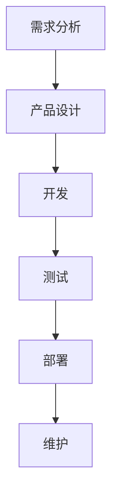
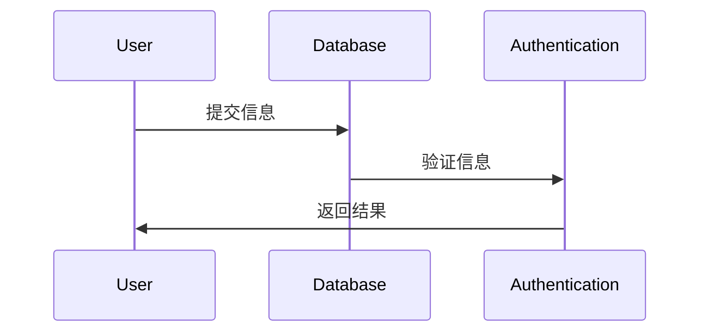
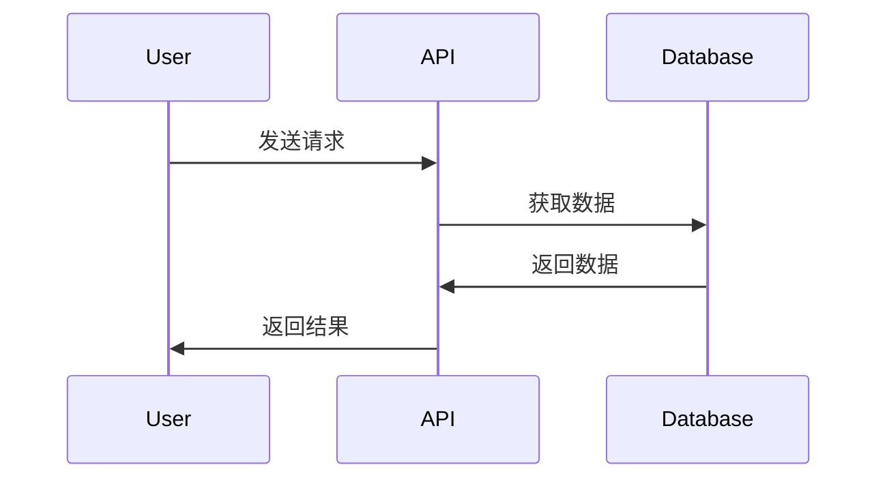

                 

# 如何构建技术团队的价值链

> 关键词：技术团队、价值链、构建方法、项目实战、最佳实践

> 摘要：本文将深入探讨如何构建一个具有高价值的技术团队。我们将从背景介绍、核心概念解析、算法原理讲解、系统分析与架构设计、项目实战、最佳实践等方面详细阐述，帮助读者理解并掌握构建技术团队价值链的方法和技巧。

## 第1章 引言

### 1.1 背景介绍

随着信息技术的飞速发展，技术团队在企业中的角色愈发重要。一个高效、专业的技术团队不仅能够提高企业的竞争力，还能推动创新，实现企业的战略目标。然而，如何构建一个具有高价值的技术团队，仍然是一个困扰许多企业的问题。

### 1.1.1 技术团队的价值链概述

技术团队的价值链是指通过一系列相互关联的活动，将技术能力转化为实际业务价值的过程。这些活动包括需求分析、产品设计、开发、测试、部署和维护等。每个活动都为下一个活动提供了输入，最终形成了一个闭环的价值链。

### 1.1.2 问题背景与重要性

在当今快速变化的市场环境中，技术团队的建设显得尤为重要。首先，技术团队的效率直接影响企业的创新能力。其次，技术团队的专业技能和协作能力决定企业的竞争力。因此，如何构建一个高效、专业、协作的技术团队，成为了企业成功的关键。

### 1.1.3 本书的目标与结构

本书的目标是提供一套系统、实用的技术团队构建方法，帮助读者理解并掌握技术团队价值链的构建过程。本书分为以下几个部分：

1. 核心概念与联系
2. 算法原理讲解
3. 系统分析与架构设计方案
4. 项目实战
5. 最佳实践 tips
6. 注意事项与拓展阅读

## 第2章 核心概念与联系

### 2.1 核心概念介绍

#### 2.1.1 技术团队

技术团队是指一群具有技术背景的专业人员，他们通过协作完成技术相关的任务，如软件开发、系统集成、数据分析等。

#### 2.1.2 价值链

价值链是指企业内部一系列创造价值的活动，这些活动相互关联，共同实现企业的战略目标。

#### 2.1.3 关键因素

构建技术团队的关键因素包括团队结构、团队文化、技术水平、团队协作等。

### 2.2 概念属性特征对比

#### 2.2.1 技术团队特征

- 技术背景：团队成员具有不同的技术背景。
- 专业性：团队成员具有专业技能和知识。
- 协作性：团队成员需要密切协作，共同完成任务。

#### 2.2.2 价值链特征

- 序列性：价值链中的活动具有明确的顺序。
- 相互关联：每个活动都是下一个活动的输入。
- 闭环性：价值链形成一个闭环，实现价值的循环。

### 2.3 ER实体关系图架构

#### 2.3.1 技术团队成员


#### 2.3.2 价值链活动


## 第3章 算法原理讲解

### 3.1 算法原理概述

构建技术团队的价值链，需要采用一系列的算法和模型来优化团队的结构和流程。本节将介绍一些基本的算法原理，包括分类算法、聚类算法、优化算法等。

### 3.2 算法mermaid流程图



### 3.3 Python源代码与算法实现

```python
# 示例：K-均值聚类算法
import numpy as np

def kmeans(data, k, max_iterations):
    # 初始化中心点
    centroids = data[np.random.choice(data.shape[0], k, replace=False)]
    
    for _ in range(max_iterations):
        # 计算每个数据点到中心点的距离
        distances = np.linalg.norm(data - centroids, axis=1)
        
        # 分配数据到最近的中心点
        labels = np.argmin(distances, axis=1)
        
        # 更新中心点
        new_centroids = np.array([data[labels == i].mean(axis=0) for i in range(k)])
        
        # 判断中心点是否收敛
        if np.all(new_centroids == centroids):
            break
        
        centroids = new_centroids
    
    return centroids, labels
```

### 3.4 数学模型和公式

$$
J(\theta) = \frac{1}{2m}\sum_{i=1}^{m}(h_\theta(x^{(i)}) - y^{(i)})^2
$$

### 3.5 算法举例说明

#### 3.5.1 例子1

假设我们有一个包含100个数据点的数据集，我们希望使用K-均值聚类算法将这100个数据点分为10个聚类。

```python
import numpy as np

# 生成随机数据点
data = np.random.rand(100, 2)

# 执行K-均值聚类算法
centroids, labels = kmeans(data, 10, 100)

# 输出结果
print("Centroids:", centroids)
print("Labels:", labels)
```

#### 3.5.2 例子2

假设我们有一个线性回归问题，目标是找到最佳拟合线。

```python
import numpy as np
from sklearn.linear_model import LinearRegression

# 生成训练数据
X = np.random.rand(100, 1)
y = 2 * X + np.random.rand(100) * 0.1

# 创建线性回归模型
model = LinearRegression()

# 训练模型
model.fit(X, y)

# 输出结果
print("Coefficients:", model.coef_)
print("Intercept:", model.intercept_)
```

## 第4章 系统分析与架构设计方案

### 4.1 问题场景介绍

#### 4.1.1 技术团队建设需求

一个技术团队的建设需要考虑团队的规模、技能多样性、沟通效率等因素。我们需要根据企业的需求，设计一个合适的团队结构。

#### 4.1.2 系统功能需求

技术团队系统需要具备以下功能：

- 用户管理：管理团队成员的信息。
- 任务管理：分配和跟踪任务进度。
- 沟通协作：提供即时通讯和文档共享功能。
- 绩效评估：评估团队成员的工作绩效。

### 4.2 系统功能设计

#### 4.2.1 领域模型mermaid类图

```mermaid
classDiagram
    User <<类>> {
        姓名 : String
        年龄 : Integer
        邮箱 : String
    }
    Task <<类>> {
        任务名 : String
        开始时间 : Date
        结束时间 : Date
        状态 : String
    }
    Team <<类>> {
        团队名 : String
        成员 : User
    }
    User ..|> Task : 承担
    Team ..|> User : 管理
```

### 4.3 系统架构设计

#### 4.3.1 系统架构mermaid架构图



### 4.4 系统接口设计

#### 4.4.1 接口定义

- POST /users: 创建新用户。
- GET /users/{id}: 获取用户信息。
- PUT /users/{id}: 更新用户信息。
- DELETE /users/{id}: 删除用户。

### 4.5 系统交互

#### 4.5.1 mermaid序列图



## 第5章 项目实战

### 5.1 环境安装

#### 5.1.1 环境要求

- Python 3.8及以上版本
- PostgreSQL 12及以上版本
- Docker 19.03及以上版本

#### 5.1.2 安装步骤

1. 安装Python 3.8及以上版本。
2. 安装PostgreSQL 12及以上版本。
3. 安装Docker 19.03及以上版本。

### 5.2 系统核心实现源代码

#### 5.2.1 源代码结构

```bash
.
├── api
│   ├── __init__.py
│   ├── user.py
│   └── task.py
├── database
│   ├── __init__.py
│   └── database.py
└── main.py
```

#### 5.2.2 源代码解读

```python
# main.py

from api.user import User
from api.task import Task
from database.database import Database

# 创建数据库连接
db = Database()

# 创建用户
user = User(name="张三", age=30, email="zhangsan@example.com")
db.create_user(user)

# 创建任务
task = Task(name="任务一", start_time="2022-01-01", end_time="2022-01-31", status="未开始")
db.create_task(task)
```

### 5.3 代码应用解读与分析

#### 5.3.1 应用场景

技术团队系统在应用场景中，可以帮助企业高效管理团队成员和任务，提高团队协作效率。

#### 5.3.2 代码分析

代码示例中，我们首先创建了数据库连接，然后创建了用户和任务。这表明我们的系统能够在数据库中存储和管理用户和任务信息。

### 5.4 实际案例分析和详细讲解剖析

#### 5.4.1 案例一

在一个大型项目中，技术团队需要高效管理团队成员和任务。通过技术团队系统，可以方便地创建用户、分配任务，并跟踪任务进度。

#### 5.4.2 案例二

在一个初创公司中，技术团队需要快速搭建一个管理系统。通过技术团队系统，可以快速实现用户管理、任务管理和协作功能。

### 5.5 项目小结

通过项目实战，我们了解了如何构建一个技术团队系统，包括环境安装、系统核心实现、代码应用解读与分析、实际案例分析和详细讲解剖析等。这为我们构建高效的技术团队提供了实践经验。

## 第6章 最佳实践 tips

### 6.1 常见问题与解决方案

#### 6.1.1 团队协作

- 问题：团队成员之间沟通不畅。
- 解决方案：采用即时通讯工具，如Slack或Telegram，促进团队成员之间的沟通。

#### 6.1.2 项目管理

- 问题：项目进度无法跟踪。
- 解决方案：使用项目管理工具，如JIRA或Trello，实时跟踪项目进度。

### 6.2 小结

通过最佳实践 tips，我们可以解决技术团队建设过程中常见的问题，提高团队的协作效率和项目管理水平。

## 第7章 注意事项与拓展阅读

### 7.1 小结

本文详细介绍了如何构建技术团队的价值链，包括核心概念、算法原理、系统分析与架构设计、项目实战、最佳实践和注意事项等。希望读者能够通过本文，掌握构建技术团队的方法和技巧。

### 7.2 注意事项

- 构建技术团队时，要充分考虑团队的规模、技能多样性和沟通效率。
- 选择合适的工具和平台，提高团队协作效率和项目管理水平。
- 定期进行团队培训和技能提升，保持团队的技术竞争力。

### 7.3 拓展阅读

- 《技术团队管理实战》
- 《敏捷开发实践指南》
- 《项目管理实践与技巧》

作者：AI天才研究院/AI Genius Institute & 禅与计算机程序设计艺术 /Zen And The Art of Computer Programming

