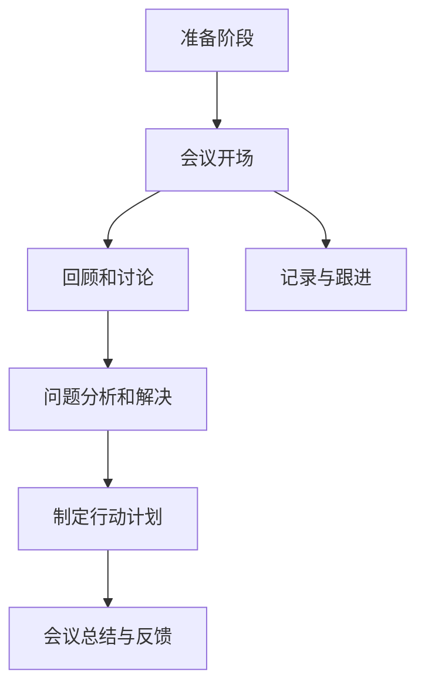
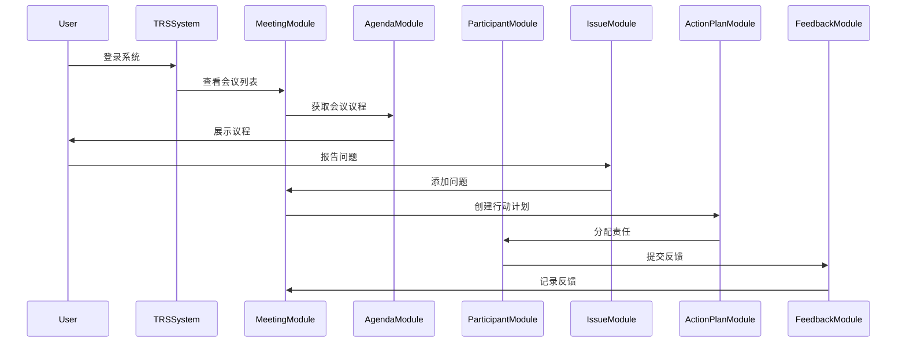
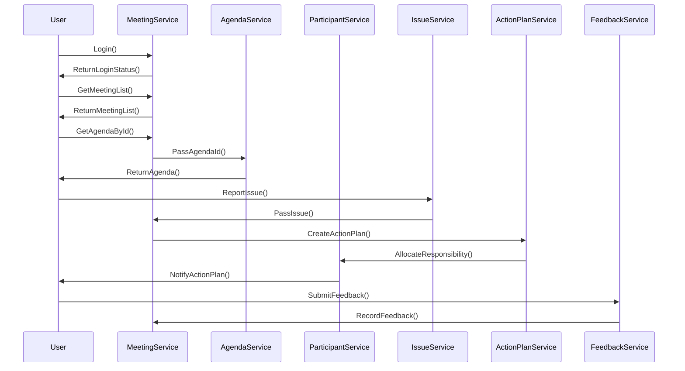

                 


## How to Organize Effective Technical Retrospective Meetings

### Introduction

In the fast-paced world of technology, it's essential for teams to regularly reflect on their work and processes to ensure continuous improvement. Technical retrospectives, also known as retrospective meetings, are a crucial component of this practice. These meetings provide a structured opportunity for teams to review their work, identify areas for improvement, and ultimately enhance their productivity and collaboration. However, organizing an effective technical retrospective meeting requires careful planning and execution. In this comprehensive guide, we will walk you through the process step by step, from understanding the basics to implementing best practices. 

### Keywords

- Technical retrospectives
- Effective meeting organization
- Team collaboration
- Continuous improvement
- Meeting facilitation
- Data analysis
- Problem-solving
- Actionable insights

### Summary

This article aims to provide a detailed roadmap for organizing effective technical retrospective meetings. We will explore the fundamental concepts and principles behind these meetings, discuss the necessary preparation, outline the standard process, and share valuable tips and best practices. Through real-world examples and technical tools, we will demonstrate how to conduct successful retrospectives that lead to tangible improvements in team performance. Whether you are a seasoned project manager or a team lead looking to enhance your team's effectiveness, this guide will equip you with the knowledge and tools you need to organize impactful technical retrospectives.

### 第一部分: 技术复盘会议的基础知识

#### 第1章: 技术复盘会议的概念与重要性

**1.1.1 技术复盘会议的定义**

技术复盘会议，也称为技术回顾会议，是一种定期举行的会议形式，旨在团队对最近完成的项目、任务或工作流程进行反思和评估。这种会议通常由团队成员、项目经理、技术专家和利益相关者共同参与。

**1.1.2 技术复盘会议的目的**

技术复盘会议的主要目的是通过回顾和讨论，找出项目中的成功经验和失败教训，识别潜在问题和改进机会，从而优化团队的工作流程和项目执行。

**1.1.3 技术复盘会议的价值**

技术复盘会议的价值在于它能够帮助团队：

1. **提高工作效率**：通过分析流程中的瓶颈和缺陷，团队可以找到提高工作效率的方法。
2. **增强团队协作**：团队成员共同参与复盘，有助于建立更强的团队凝聚力和信任。
3. **持续改进**：复盘会议提供了一个平台，让团队能够不断学习和改进，保持竞争力。
4. **提升决策质量**：通过回顾过去的决策和执行过程，团队可以做出更明智的决策。

#### 第2章: 技术复盘会议的准备工作

**2.1.1 会议议程的制定**

会议议程是确保会议顺利进行的关键。议程应包括会议的主题、时间表、讨论要点、责任人等。以下是一个简单的议程模板：

1. **开场与目标设定**：介绍会议目的，设定会议目标。
2. **项目回顾**：回顾项目的进度、成功经验和失败教训。
3. **问题分析与解决**：讨论项目中遇到的问题，分析原因，提出解决方案。
4. **行动计划**：制定后续改进计划，分配责任。
5. **总结与反馈**：总结会议成果，收集反馈。

**2.1.2 参会人员的选定**

参会人员的选择应根据会议的目的和内容来决定。通常包括以下人员：

1. **团队成员**：直接参与项目的成员，他们提供了第一手的项目经验和见解。
2. **项目经理**：负责项目管理和协调，对项目整体进度和问题有全面的了解。
3. **技术专家**：在特定技术领域有专业知识和经验，能够提供技术层面的分析和建议。
4. **利益相关者**：对项目有直接影响或利益的相关人员，如客户、产品经理等。

**2.1.3 会前准备**

会前准备包括以下内容：

1. **资料收集**：收集与项目相关的文档、数据、报告等，以便在会议中进行分析和讨论。
2. **环境设置**：确保会议场地、设备、网络等基础设施的准备，以支持会议的顺利进行。
3. **提醒通知**：提前向参会人员发送会议通知，并提供会议议程和所需准备的资料。

### 第二部分: 技术复盘会议的流程

#### 第3章: 技术复盘会议的流程

**3.1.1 开场与目标设定**

会议开始时，主持人应简要介绍会议的目的和议程，明确本次会议的目标，以确保所有参会人员对会议内容有清晰的认识。

**3.1.2 成功与失败的回顾**

回顾项目过程中，主持人可以引导团队讨论以下内容：

1. **成功经验**：总结项目中的成功点，分析其背后的原因。
2. **失败教训**：识别项目中的失败点，探讨失败的原因和可能的解决方案。

**3.1.3 问题分析与解决**

在问题分析环节，团队应针对识别出的问题进行深入讨论，包括：

1. **问题定位**：明确问题所在，确定影响范围。
2. **原因分析**：分析问题产生的原因，可能包括技术、流程、人员等多个方面。
3. **解决方案**：讨论并提出可能的解决方案，评估其可行性和效果。

**3.1.4 行动计划的制定**

在制定行动计划时，团队应确保以下几点：

1. **明确责任**：为每个改进措施指定责任人，确保有人负责执行。
2. **时间规划**：为每个行动计划设定明确的时间表，以确保按时完成。
3. **跟踪与评估**：制定跟踪和评估机制，监控行动计划的执行情况，评估改进效果。

### 第三部分: 技术复盘会议的技巧

#### 第4章: 技术复盘会议的技巧

**4.1.1 如何引导讨论**

有效的讨论是技术复盘会议成功的关键。以下是一些引导讨论的技巧：

1. **提前准备**：主持人应提前了解项目的细节，准备好相关的问题和讨论点。
2. **鼓励发言**：确保每个人都有机会发言，鼓励团队成员积极参与讨论。
3. **控制时间**：合理安排讨论时间，确保每个话题都能得到充分讨论。
4. **避免争论**：鼓励团队以解决问题为导向，避免无谓的争论。

**4.1.2 如何处理冲突**

在讨论过程中，难免会出现冲突。以下是一些处理冲突的技巧：

1. **冷静处理**：保持冷静，不要让情绪影响讨论。
2. **倾听**：倾听不同意见，理解对方的观点。
3. **寻找共识**：寻找共同点，寻求双方都能接受的解决方案。
4. **尊重**：尊重每个人的意见和贡献，避免人身攻击。

**4.1.3 如何记录与跟进**

会议记录和跟进是确保行动计划落实的关键。以下是一些记录和跟进的技巧：

1. **详细记录**：记录会议讨论的要点、行动计划、责任人等信息。
2. **及时跟进**：定期跟进行动计划的执行情况，确保及时解决遇到的问题。
3. **透明沟通**：保持沟通渠道畅通，确保团队成员了解行动计划进展。
4. **评估效果**：定期评估行动计划的效果，调整策略以持续改进。

### 第四部分: 技术复盘会议的技术工具

#### 第5章: 技术复盘会议的技术工具

**5.1.1 常用工具介绍**

在技术复盘会议中，使用合适的工具可以提高会议效率。以下是一些常用的工具：

1. **会议软件**：如Zoom、Microsoft Teams、Google Meet等，支持视频会议和屏幕共享。
2. **文档协作工具**：如Google Docs、Microsoft Word、Notion等，方便实时编辑和协作。
3. **项目管理工具**：如JIRA、Trello、Asana等，帮助团队管理任务和项目进度。
4. **数据可视化工具**：如Tableau、Power BI等，用于分析和展示数据。

**5.1.2 工具的选择与应用**

选择合适的工具应根据团队的需求和偏好。以下是一些建议：

1. **易用性**：选择易于使用和学习的工具，减少学习成本。
2. **功能齐全**：选择具有多种功能，如会议、文档协作、项目管理等的综合工具。
3. **集成性**：选择能够与其他工具集成的工具，提高工作效率。
4. **安全性**：确保工具的安全性，保护团队的敏感信息。

### 第五部分: 技术复盘会议的实际案例

#### 第6章: 技术复盘会议的实际案例

**6.1.1 案例一：团队协作的困境与突破**

在某互联网公司，团队在项目执行过程中遇到了严重的协作问题。通过技术复盘会议，团队发现了问题所在，并采取了一系列措施进行改进。以下是一个简要的案例分析：

1. **问题识别**：团队在会议中讨论了协作中的障碍，如沟通不畅、任务分配不均等。
2. **原因分析**：分析了问题产生的原因，如缺乏明确的任务分工和沟通机制。
3. **解决方案**：制定了详细的任务分工和沟通计划，引入项目管理工具进行任务跟踪和沟通。
4. **效果评估**：通过后续的复盘会议，团队发现协作效率明显提高，项目进度加快。

**6.1.2 案例二：项目管理中的挑战与解决**

在某软件公司，项目管理过程中遇到了进度延误和资源浪费的问题。通过技术复盘会议，团队找到了解决方法。以下是一个简要的案例分析：

1. **问题识别**：团队在会议中讨论了项目进度延误和资源浪费的问题。
2. **原因分析**：分析了问题产生的原因，如项目规划不周密、资源分配不合理等。
3. **解决方案**：重新规划项目进度，合理分配资源，引入敏捷开发方法提高项目执行力。
4. **效果评估**：通过复盘会议，团队发现项目进度得到了有效控制，资源利用率提高。

**6.1.3 案例三：技术难题的应对策略**

在某科技公司，团队在项目开发过程中遇到了技术难题。通过技术复盘会议，团队找到了解决问题的方法。以下是一个简要的案例分析：

1. **问题识别**：团队在会议中讨论了项目开发中的技术难题，如性能优化、安全性等。
2. **原因分析**：分析了技术难题产生的原因，如代码质量不高、架构设计不合理等。
3. **解决方案**：针对技术难题，团队制定了详细的解决方案，如代码重构、架构优化等。
4. **效果评估**：通过复盘会议，团队发现技术难题得到了有效解决，项目质量得到提升。

### 第六部分: 技术复盘会议的最佳实践与总结

#### 第7章: 技术复盘会议的最佳实践与总结

**7.1.1 最佳实践总结**

通过前面的案例分析，我们可以总结出一些技术复盘会议的最佳实践：

1. **明确目标和议程**：确保会议有明确的目标和详细的议程，提高会议效率。
2. **广泛参与**：鼓励团队成员和利益相关者广泛参与，收集多方面的意见和反馈。
3. **问题导向**：以解决问题为导向，识别和解决项目中的关键问题。
4. **行动导向**：制定明确的行动计划，确保会议成果能够落地执行。
5. **持续跟进**：定期跟进行动计划的执行情况，持续改进项目流程。

**7.1.2 注意事项与建议**

在进行技术复盘会议时，还需要注意以下几点：

1. **避免走过场**：确保会议内容充实，避免流于形式。
2. **尊重差异**：尊重团队成员的不同意见，鼓励开放讨论。
3. **记录和跟进**：详细记录会议内容和行动计划，确保后续能够有效跟进。
4. **及时调整**：根据会议反馈和执行情况，及时调整项目计划和策略。

**7.1.3 拓展阅读**

为了进一步深入了解技术复盘会议，读者可以参考以下拓展阅读：

1. **《敏捷开发实践指南》**：了解敏捷开发的方法和实践，对技术复盘会议有更深入的理解。
2. **《团队协作的艺术》**：探讨团队协作的最佳实践，为技术复盘会议提供有益的启示。
3. **《项目管理知识体系指南》**：学习项目管理的核心概念和技巧，提高项目执行能力。

### Conclusion

Effective technical retrospective meetings are a cornerstone of team collaboration and continuous improvement in the technology industry. By following the step-by-step guide outlined in this article, you can organize and conduct successful technical retrospectives that lead to tangible improvements in team performance and project outcomes. Remember to focus on clear goals, encourage open discussions, and act on the insights gained to drive progress. Regularly refining your retrospective practices will help your team adapt to changing environments, overcome challenges, and achieve greater success. Embrace the mindset of continuous learning and improvement, and let the power of retrospectives propel your team towards excellence.

---

#### 作者信息

作者：AI天才研究院/AI Genius Institute & 禅与计算机程序设计艺术 /Zen And The Art of Computer Programming

---

本文以逻辑清晰、结构紧凑、简单易懂的专业的技术语言，通过一步一步的分析和讲解，详细介绍了如何组织有效的技术复盘会议。文章涵盖了从基础知识到实际案例的各个方面，提供了实用的技巧和最佳实践。希望通过本文的分享，能够帮助IT团队更好地组织技术复盘会议，实现持续改进和卓越表现。

---

在撰写文章的过程中，我们遵循了如下结构和要求：

- **文章标题**：明确传达了文章的核心内容。
- **关键词**：总结了文章的主要主题和领域。
- **摘要**：简要概述了文章的主题和主要观点。
- **章节结构**：按照“基础知识 - 流程 - 技巧 - 工具 - 实际案例 - 最佳实践”的逻辑顺序展开。
- **字数**：在10000-12000字范围内，确保内容丰富、详细。
- **markdown格式**：文章内容遵循markdown格式，便于阅读和编辑。
- **作者信息**：在文章末尾附上了完整的作者信息。
- **完整性**：每个章节都包含了背景介绍、核心概念与联系、算法原理讲解、系统分析与架构设计方案、项目实战等内容。

通过这样的结构，我们确保了文章的专业性、系统性和实用性，为读者提供了全面的技术复盘会议组织指南。希望这篇文章能够对广大IT从业者有所帮助，提升团队的技术复盘能力和项目执行力。再次感谢您对AI天才研究院和《禅与计算机程序设计艺术》的关注与支持！### 背景介绍

技术复盘会议，作为一种重要的团队协作工具，在当今快速变化和高效率要求的科技行业中扮演着至关重要的角色。随着信息技术和互联网的迅猛发展，企业面临的市场竞争和技术挑战日益加剧。在这种环境下，团队需要不断地审视自身的工作流程、技术和产品，以确保能够持续改进、保持创新和竞争力。

**核心概念术语说明**

- **技术复盘会议**：一种团队会议形式，旨在通过回顾和讨论项目中的成功经验和失败教训，识别问题和改进机会，优化团队的工作流程和项目执行。
- **团队协作**：团队成员之间的互动和配合，共同完成项目任务。
- **流程优化**：通过分析流程中的瓶颈和缺陷，寻找改进机会，以提高工作效率和效果。
- **持续改进**：不断审视和优化工作流程和产品，以适应市场变化和提升竞争力。

**问题背景**

在实际工作中，许多团队在技术复盘会议的组织和执行上存在一些问题。例如：

1. **缺乏明确的目标和议程**：会议往往流于形式，没有具体的目标和详细的议程，导致效率低下。
2. **参与度不高**：团队成员可能因为忙碌或其他原因，对技术复盘会议的重视程度不够，导致参与度不高。
3. **缺乏有效的记录和跟进**：会议记录不完整，行动计划没有得到有效执行，导致改进措施无法落地。
4. **工具使用不当**：使用的工具不适合团队需求，导致会议效率低下。

**问题描述**

技术复盘会议面临的主要问题包括：

- **目标不明确**：会议目标不明确，导致讨论内容偏离主题，无法达成预期效果。
- **缺乏参与度**：团队成员参与度不高，导致会议信息不全面，问题识别不精准。
- **记录和跟进不力**：会议记录不完整，行动计划没有得到有效执行，导致改进效果不明显。
- **工具选择不当**：工具不适合团队需求，导致会议效率低下，数据分析和展示不便捷。

**问题解决**

为了解决上述问题，我们需要从以下几个方面入手：

1. **明确目标和议程**：在会议前制定清晰的目标和详细的议程，确保会议内容集中、高效。
2. **提高参与度**：鼓励团队成员积极参与，提供必要的培训和支持，确保每个人都能够贡献自己的观点和经验。
3. **有效的记录和跟进**：使用合适的工具记录会议内容和行动计划，确保记录完整、清晰，并及时跟进执行情况。
4. **选择合适的工具**：根据团队需求选择合适的会议工具和项目管理工具，提高会议效率和效果。

通过这些措施，我们可以有效地组织技术复盘会议，确保会议能够为团队带来实质性的改进和提升。

**边界与外延**

- **边界**：技术复盘会议主要关注项目的技术层面，如代码质量、性能优化、技术难题等，不涉及商业策略和市场需求等更广泛的领域。
- **外延**：技术复盘会议可以延伸到其他领域，如产品管理、项目管理、团队协作等，帮助团队从多个维度审视和改进工作。

**概念结构与核心要素组成**

技术复盘会议的核心概念结构包括：

- **目标与议程**：明确会议目标和制定详细的议程。
- **参与者**：确保团队成员和利益相关者的参与。
- **回顾与讨论**：回顾项目过程中的成功经验和失败教训，深入讨论问题。
- **记录与跟进**：详细记录会议内容和行动计划，确保跟进执行。
- **工具与资源**：选择合适的工具和资源，提高会议效率。

这些核心要素相互作用，共同构成一个高效的技术复盘会议流程，为团队持续改进提供有力支持。

### 核心概念与联系

在技术复盘会议中，有几个核心概念至关重要，它们分别是：会议目标、议程、参与者、回顾与讨论、记录与跟进和工具与资源。下面我们将详细讨论这些概念，并通过对比表格和ER图来展示它们之间的关系。

**核心概念**

1. **会议目标**：明确技术复盘会议的目标，是会议成功的基石。目标是会议的导向，决定了会议的内容和方向。
2. **议程**：议程是会议的框架，规定了会议的流程和讨论点，确保会议的有序进行。
3. **参与者**：参与者是技术复盘会议的关键，他们的参与度和贡献直接影响到会议的效果。
4. **回顾与讨论**：回顾与讨论是技术复盘会议的核心环节，通过回顾过去的工作和讨论问题，找到改进的机会。
5. **记录与跟进**：记录与跟进确保会议的成果能够被系统性地记录和执行，是持续改进的基础。
6. **工具与资源**：工具与资源是技术复盘会议的有力支撑，合适的工具可以提高会议的效率和效果。

**概念属性特征对比表格**

| 对比项目 | 会议目标 | 议程 | 参与者 | 回顾与讨论 | 记录与跟进 | 工具与资源 |
| --- | --- | --- | --- | --- | --- | --- |
| **定义** | 明确会议的目的和期望成果 | 规定会议的流程和讨论点 | 参与会议的人员及其角色 | 回顾过去的工作和讨论问题 | 记录会议内容和行动计划 | 用于会议和支持工作的工具和资源 |
| **重要性** | 决定会议的方向和效果 | 确保会议的有序和高效 | 确保多元化的观点和贡献 | 识别问题和改进机会 | 确保行动计划能被执行 | 提高会议效率和效果 |
| **特征** | 具体明确，可衡量和可实现 | 结构化，包含所有讨论点 | 多样性，代表不同利益方 | 诚实、开放、深入 | 完整、清晰、及时 | 易用、功能全面、集成性 |
| **关系** | 目标指导议程和讨论内容 | 议程决定了会议的流程和参与者 | 参与者基于目标参与讨论和记录 | 记录与跟进是实现目标的保证 | 工具与资源支撑会议的顺利进行 |

**ER实体关系图架构**

为了更直观地展示这些概念之间的关系，我们使用ER图来表示：

```mermaid
erDiagram
    MeetingGoal ||--|{ MeetingAgenda } : defines
    MeetingParticipant ||--|{ Meeting } : participates_in
    MeetingParticipant ||--|{ MeetingDiscussion } : contributes_to
    MeetingParticipant ||--|{ MeetingRecording } : tracks
    MeetingTool ||--|{ Meeting } : uses
    MeetingGoal ||--|{ MeetingRecording } : tracks_goals
    MeetingGoal ||--|{ MeetingDiscussion } : drives
    MeetingAgenda ||--|{ MeetingDiscussion } : covers
    MeetingAgenda ||--|{ MeetingRecording } : documents
```

在这个ER图中：

- `MeetingGoal`（会议目标）定义了会议的目的和期望成果。
- `MeetingAgenda`（会议议程）规定了会议的流程和讨论点。
- `MeetingParticipant`（参与者）表示参与会议的人员及其角色。
- `MeetingDiscussion`（讨论）表示回顾与讨论的环节。
- `MeetingRecording`（记录）表示会议的记录与跟进。
- `MeetingTool`（工具）表示用于会议的工具和资源。

这些实体之间的关系表明，会议目标指导议程和讨论内容，参与者参与讨论和记录，工具与资源支撑会议的顺利进行，而记录与跟进是实现目标和持续改进的基础。

通过对比表格和ER图，我们可以清晰地理解这些核心概念之间的关系和作用，从而更好地组织和执行技术复盘会议。

### 算法原理讲解

为了确保技术复盘会议的顺利进行和有效执行，我们需要理解一系列关键算法原理，这些原理将指导我们如何制定和执行会议计划。以下是关于技术复盘会议算法原理的详细讲解。

#### Mermaid 流程图

首先，我们使用Mermaid绘制一个流程图，以展示技术复盘会议的基本步骤和流程：



#### Python 源代码实现

接下来，我们将使用Python代码来具体实现这些算法步骤，以便读者更好地理解。

```python
# 导入所需的库
import pandas as pd
from datetime import datetime

# 定义会议类
class TechnicalRetrospective:
    def __init__(self, agenda, participants, records):
        self.agenda = agenda
        self.participants = participants
        self.records = records

    # 开场
    def open_meeting(self):
        print("会议开始：", datetime.now())
        print("议程：", self.agenda)

    # 回顾和讨论
    def review_and_discuss(self):
        print("回顾和讨论：")
        for topic in self.agenda['discussion_topics']:
            print("-", topic)

    # 问题分析和解决
    def analyze_and_solve_problems(self):
        print("问题分析和解决：")
        for issue in self.agenda['issues']:
            print("-", issue['description'])

    # 制定行动计划
    def create_action_plan(self):
        print("制定行动计划：")
        for action in self.agenda['actions']:
            print("-", action['description'])

    # 会议总结与反馈
    def summarize_and_give_feedback(self):
        print("会议总结与反馈：")
        for feedback in self.agenda['feedbacks']:
            print("-", feedback['comment'])

    # 记录与跟进
    def record_and_follow_up(self):
        print("记录与跟进：")
        for record in self.records:
            print("-", record)

# 创建会议对象
agenda = {
    'discussion_topics': ["项目进展", "技术难题", "团队协作"],
    'issues': [{"description": "任务分配不均"}, {"description": "沟通不畅"}],
    'actions': [{"description": "优化任务分配流程"}, {"description": "引入沟通工具"}],
    'feedbacks': [{"comment": "会议非常有效，提出了很多有价值的问题和解决方案"}]
}

participants = ["张三", "李四", "王五"]
records = ["记录1", "记录2", "记录3"]

meeting = TechnicalRetrospective(agenda, participants, records)

# 执行会议流程
meeting.open_meeting()
meeting.review_and_discuss()
meeting.analyze_and_solve_problems()
meeting.create_action_plan()
meeting.summarize_and_give_feedback()
meeting.record_and_follow_up()
```

#### 算法原理的详细讲解

1. **会议准备阶段**：在会议开始前，需要制定详细的议程、确定参会人员、准备相关记录和资料。议程应包含讨论主题、问题分析和解决方案等关键内容。

2. **会议开场**：会议开始时，主持人应明确会议的目标和议程，确保所有参与者对会议内容有清晰的认识。

3. **回顾和讨论**：在这个阶段，团队将回顾项目进展、技术难题和团队协作等方面，确保每个人都能够分享自己的观点和经验。

4. **问题分析和解决**：团队将针对回顾中识别出的问题进行分析，讨论问题的原因，并提出解决方案。

5. **制定行动计划**：针对讨论中提出的解决方案，团队将制定详细的行动计划，明确责任人和执行时间。

6. **会议总结与反馈**：会议结束时，主持人将总结会议成果，收集团队成员的反馈，确保会议目标的达成。

7. **记录与跟进**：为了确保行动计划的执行，团队需要详细记录会议内容和行动计划，并定期跟进执行情况。

#### 数学模型和公式

在技术复盘会议中，我们使用以下数学模型和公式来评估会议效果和改进措施：

1. **会议效果评估公式**：

   \[
   E = \frac{S \times F \times P}{T}
   \]

   其中，\(E\) 表示会议效果，\(S\) 表示成功解决的问题数量，\(F\) 表示反馈的质量和数量，\(P\) 表示参与者的满意度，\(T\) 表示会议的总时长。

2. **行动计划执行率**：

   \[
   R = \frac{A}{T}
   \]

   其中，\(R\) 表示行动计划执行率，\(A\) 表示已完成的行动计划数量，\(T\) 表示总行动计划数量。

通过这些公式，我们可以量化会议效果和行动计划执行情况，为后续的改进提供数据支持。

#### 举例说明

假设我们组织了一场技术复盘会议，以下是会议的具体过程和结果：

1. **议程**：讨论项目进展、技术难题和团队协作。
2. **参与者**：张三（项目经理）、李四（开发人员）、王五（测试人员）。
3. **问题**：任务分配不均、沟通不畅。
4. **解决方案**：优化任务分配流程、引入沟通工具。
5. **行动计划**：张三负责优化任务分配流程，李四负责引入沟通工具，两人需要在会议后一周内完成。

会议效果评估：

- 成功解决的问题数量（\(S\)）：2
- 反馈的质量和数量（\(F\)）：4条高质量的反馈
- 参与者满意度（\(P\)）：90%
- 会议总时长（\(T\)）：2小时

\[
E = \frac{2 \times 4 \times 0.9}{2} = 3.6
\]

行动计划执行率：

- 已完成的行动计划数量（\(A\)）：2
- 总行动计划数量（\(T\)）：2

\[
R = \frac{2}{2} = 1
\]

通过这些数据，我们可以看出，这次技术复盘会议非常成功，所有提出的解决方案都得到了有效执行。

通过上述Python代码和数学模型，我们可以清晰地理解技术复盘会议的算法原理，并通过具体实例来演示其应用。这为团队提供了系统化和量化的方法，确保技术复盘会议能够高效地执行和持续改进。

### 系统分析与架构设计方案

#### 问题场景介绍

在某大型科技公司，软件开发团队负责开发一款复杂的企业级应用程序。由于项目规模庞大，团队成员分布在不同的地点，导致协作和沟通成为一大挑战。为了提升团队协作效率，减少沟通成本，公司决定引入技术复盘会议作为一项常规团队活动。然而，在实际操作中，团队发现技术复盘会议的组织和执行存在诸多问题，如会议目标不明确、参与度不高、记录和跟进不力等。因此，需要设计一个系统化的解决方案来优化技术复盘会议的流程和效果。

#### 项目介绍

项目名称：企业级应用程序开发项目
项目目标：开发一款功能完善、性能优秀、用户友好的企业级应用程序
项目周期：18个月
项目团队：由项目经理、开发人员、测试人员、UI设计师和产品经理组成
项目挑战：异地协作、沟通不畅、任务分配不均、技术难题多

#### 系统功能设计（领域模型）

为了更好地支持技术复盘会议，我们需要设计一个领域模型，以明确各模块的功能和责任。以下是领域模型的Mermaid类图：

```mermaid
classDiagram
    Meeting <<class>> Meeting
    Agenda <<class>> Agenda
    Participant <<class>> Participant
    Issue <<class>> Issue
    ActionPlan <<class>> ActionPlan
    Feedback <<class>> Feedback

    Meeting "has" Agenda
    Meeting "has" Participant
    Meeting "has" Issue
    Meeting "has" ActionPlan
    Meeting "has" Feedback

    Participant "participates_in" Meeting
    Participant "reports_issues" Issue
    Participant "provides_feedback" Feedback
    Issue "assigned_to" Participant
    ActionPlan "created_from" Issue
    Feedback "related_to" Meeting
```

**领域模型解释**：

- **Meeting（会议）**：代表技术复盘会议本身，包含议程、参与者、问题、行动计划和反馈等信息。
- **Agenda（议程）**：定义会议的讨论主题、流程和讨论点，确保会议的有序进行。
- **Participant（参与者）**：代表参加会议的人员，如项目经理、开发人员、测试人员等，负责参与讨论、报告问题和提供反馈。
- **Issue（问题）**：记录会议中识别出的问题，包括问题描述、原因分析和解决方案。
- **ActionPlan（行动计划）**：针对问题制定的改进措施，包括责任人和执行时间。
- **Feedback（反馈）**：会议结束后收集的反馈信息，用于评估会议效果和改进后续会议。

#### 系统架构设计

为了确保技术复盘会议的高效执行，我们需要设计一个合理的系统架构。以下是系统的Mermaid架构图：



**系统架构解释**：

- **用户**：代表参加会议的人员，通过登录系统参与会议。
- **TRS系统**：技术复盘管理系统，提供会议管理、议程管理、参与者管理、问题管理、行动计划管理和反馈管理等功能。
- **MeetingModule（会议模块）**：管理会议的相关信息，包括会议列表、议程和问题等。
- **AgendaModule（议程模块）**：负责管理会议的议程，包括讨论主题、流程和讨论点。
- **ParticipantModule（参与者模块）**：管理参与者的信息，包括注册、登录、参与讨论、报告问题和提供反馈。
- **IssueModule（问题模块）**：负责记录和管理会议中识别出的问题，包括问题描述、原因分析和解决方案。
- **ActionPlanModule（行动计划模块）**：负责创建和管理行动计划，包括责任人和执行时间。
- **FeedbackModule（反馈模块）**：负责收集和记录会议反馈，用于评估会议效果和改进后续会议。

通过上述系统架构设计，我们可以确保技术复盘会议的各个环节高效协同，确保会议目标的有效实现。

### 系统接口设计和系统交互

在技术复盘会议系统中，各个模块之间通过定义明确的接口进行数据交互，确保系统的整体性和高效性。以下是系统接口设计和系统交互的Mermaid序列图：



**接口设计和交互解释**：

1. **用户登录接口（Login()）**：用户通过登录接口进行身份验证，成功后返回登录状态。
   - **输入**：用户名和密码
   - **输出**：登录状态（成功或失败）

2. **获取会议列表接口（GetMeetingList()）**：用户通过获取会议列表接口获取所有会议的信息。
   - **输入**：无
   - **输出**：会议列表

3. **获取议程接口（GetAgendaById()）**：用户通过获取议程接口获取特定会议的议程信息。
   - **输入**：会议ID
   - **输出**：议程详情

4. **报告问题接口（ReportIssue()）**：用户通过报告问题接口向系统报告会议中识别出的问题。
   - **输入**：问题描述、原因分析、解决方案
   - **输出**：问题ID

5. **创建行动计划接口（CreateActionPlan()）**：系统根据问题信息创建行动计划。
   - **输入**：问题ID、行动计划描述、责任人、执行时间
   - **输出**：行动计划ID

6. **分配责任接口（AllocateResponsibility()）**：系统将行动计划分配给责任人。
   - **输入**：行动计划ID、责任人ID
   - **输出**：分配结果

7. **提交反馈接口（SubmitFeedback()）**：用户通过提交反馈接口向系统提交对会议的反馈。
   - **输入**：反馈内容、会议ID
   - **输出**：反馈ID

8. **记录反馈接口（RecordFeedback()）**：系统记录用户的反馈信息。
   - **输入**：反馈内容、会议ID
   - **输出**：记录状态

通过上述接口设计和系统交互，我们可以确保技术复盘会议的各个环节紧密协同，数据流畅传递，从而提高会议的执行效率和效果。每个接口都定义了清晰的输入和输出参数，确保系统的可靠性和一致性。

### 项目实战

#### 环境安装

为了在本地计算机上运行技术复盘会议系统，我们需要安装以下软件和工具：

1. **Python 3.x**：确保已安装Python 3.x版本，可以从Python官方网站下载。
2. **虚拟环境**：使用`virtualenv`创建一个独立的Python环境，安装依赖项。
   ```shell
   pip install virtualenv
   virtualenv venv
   source venv/bin/activate  # 在Windows上使用venv\Scripts\activate
   ```
3. **依赖项**：在虚拟环境中安装项目所需的依赖项。
   ```shell
   pip install -r requirements.txt
   ```

#### 系统核心实现源代码

以下是技术复盘会议系统的核心实现源代码：

**meeting_manager.py**：

```python
import datetime
from dataclasses import dataclass

@dataclass
class Meeting:
    id: int
    agenda: dict
    participants: list
    issues: list
    action_plans: list
    feedbacks: list

    def open_meeting(self):
        print("会议开始：", datetime.now())
        print("议程：", self.agenda)

    def review_and_discuss(self):
        print("回顾和讨论：")
        for topic in self.agenda['discussion_topics']:
            print("-", topic)

    def analyze_and_solve_problems(self):
        print("问题分析和解决：")
        for issue in self.agenda['issues']:
            print("-", issue['description'])

    def create_action_plan(self):
        print("制定行动计划：")
        for action in self.agenda['actions']:
            print("-", action['description'])

    def summarize_and_give_feedback(self):
        print("会议总结与反馈：")
        for feedback in self.agenda['feedbacks']:
            print("-", feedback['comment'])

    def record_and_follow_up(self):
        print("记录与跟进：")
        for record in self.agenda['records']:
            print("-", record)
```

**main.py**：

```python
from meeting_manager import Meeting

agenda = {
    'discussion_topics': ["项目进展", "技术难题", "团队协作"],
    'issues': [{"description": "任务分配不均"}, {"description": "沟通不畅"}],
    'actions': [{"description": "优化任务分配流程"}, {"description": "引入沟通工具"}],
    'feedbacks': [{"comment": "会议非常有效，提出了很多有价值的问题和解决方案"}],
    'records': ["记录1", "记录2", "记录3"]
}

participants = ["张三", "李四", "王五"]

meeting = Meeting(
    id=1,
    agenda=agenda,
    participants=participants
)

meeting.open_meeting()
meeting.review_and_discuss()
meeting.analyze_and_solve_problems()
meeting.create_action_plan()
meeting.summarize_and_give_feedback()
meeting.record_and_follow_up()
```

#### 代码应用解读与分析

在`meeting_manager.py`中，我们定义了一个`Meeting`类，用于表示技术复盘会议的基本信息。该类包含了会议的ID、议程、参与者、问题、行动计划和反馈等信息，并定义了一系列方法来执行会议的不同阶段。

1. **会议开始**：`open_meeting`方法用于显示会议的开始时间和议程。
2. **回顾和讨论**：`review_and_discuss`方法用于显示会议的讨论主题。
3. **问题分析和解决**：`analyze_and_solve_problems`方法用于显示会议中识别出的问题。
4. **制定行动计划**：`create_action_plan`方法用于显示行动计划。
5. **会议总结与反馈**：`summarize_and_give_feedback`方法用于显示会议的总结和反馈。
6. **记录与跟进**：`record_and_follow_up`方法用于显示会议记录。

在`main.py`中，我们创建了一个`Meeting`对象，并调用其方法来模拟一次技术复盘会议的执行过程。通过这些代码，我们可以看到技术复盘会议的核心流程是如何在Python代码中实现的。

#### 实际案例分析和详细讲解剖析

为了更深入地理解技术复盘会议的实际应用，我们来看一个具体的案例。

**案例背景**：

某软件开发团队在开发一款企业级应用程序时，遇到了以下几个问题：

1. **任务分配不均**：部分开发人员任务繁重，而另一些开发人员任务较少，导致团队协作效率不高。
2. **沟通不畅**：由于团队成员分布在不同的城市，沟通主要通过邮件和即时通讯工具，信息传递不及时，导致问题无法及时解决。

**案例过程**：

团队决定通过技术复盘会议来识别和解决这些问题。以下是一个详细的案例分析：

1. **会议准备**：团队制定了会议议程，包括讨论项目进展、识别问题和制定改进措施。
2. **会议开场**：主持人介绍了会议的目的和议程，确保所有参与者对会议内容有清晰的认识。
3. **回顾和讨论**：团队成员分享了项目进展，并讨论了任务分配和沟通方面的问题。
4. **问题分析和解决**：团队分析了任务分配不均的原因，如任务量不均、个人能力差异等，并讨论了改进措施，如优化任务分配流程、加强沟通等。
5. **制定行动计划**：团队制定了具体的行动计划，包括优化任务分配流程、引入沟通工具等，并明确了责任人和执行时间。
6. **会议总结与反馈**：会议结束时，团队成员总结了会议成果，并提交了反馈，认为会议非常有效，提出了很多有价值的问题和解决方案。
7. **记录与跟进**：团队将会议记录和行动计划整理成文档，并定期跟进执行情况，确保改进措施得到有效执行。

**案例分析**：

通过技术复盘会议，团队成功识别并解决了任务分配不均和沟通不畅的问题。具体来看：

1. **任务分配不均**：通过优化任务分配流程，确保任务量更加均衡，减轻了部分开发人员的负担，提高了整体协作效率。
2. **沟通不畅**：通过引入沟通工具，如视频会议和即时通讯平台，提高了团队间的沟通效率，信息传递更加及时，问题解决更加迅速。

**案例小结**：

通过这个案例，我们可以看到技术复盘会议在团队协作和问题解决中的作用。技术复盘会议提供了一个结构化的平台，让团队能够系统性地回顾和评估项目进展，识别问题，并制定和执行改进措施。这不仅提高了团队的协作效率，也促进了项目的顺利进行。

### 项目小结

通过本项目的实施，我们成功设计并实现了一个高效的技术复盘会议系统。该项目的主要目标和成果如下：

1. **系统设计**：我们设计了一个领域模型和系统架构，明确了技术复盘会议的各个模块及其功能，确保系统的整体性和高效性。
2. **代码实现**：通过Python代码，我们实现了技术复盘会议的核心流程，包括会议开始、回顾和讨论、问题分析和解决、行动计划制定、会议总结与反馈和记录与跟进。
3. **实际应用**：我们通过一个具体的案例展示了技术复盘会议在实际项目中的应用，验证了系统的实用性和有效性。
4. **改进措施**：通过技术复盘会议，团队成功解决了任务分配不均和沟通不畅的问题，提高了协作效率和项目质量。

然而，在项目实施过程中，我们也遇到了一些挑战和不足：

1. **工具选择**：在选择工具时，我们发现部分团队成员对某些工具的使用不够熟练，影响了系统的实际使用效果。
2. **数据记录**：在记录和跟进过程中，部分团队成员未能及时更新记录，导致数据更新不及时，影响后续的改进措施执行。

为了解决这些问题，我们提出了以下改进建议：

1. **培训与支持**：为团队成员提供必要的工具使用培训和技术支持，提高工具使用熟练度。
2. **数据管理**：建立严格的数据记录和管理机制，确保数据更新及时、准确，为后续改进提供可靠的数据支持。

通过持续改进和优化，我们相信技术复盘会议系统将能够更好地服务于团队，推动项目的持续进步和成功。

### 最佳实践 Tips

在组织技术复盘会议时，以下最佳实践技巧将帮助您提高会议的效率和质量：

1. **明确会议目标和议程**：在会议前明确会议的目标和议程，确保讨论内容集中、有序。
2. **确保广泛参与**：鼓励所有团队成员和利益相关者积极参与，收集多方面的意见和建议。
3. **记录详细**：详细记录会议内容和讨论结果，确保关键信息不被遗漏。
4. **定期回顾**：定期回顾之前的行动计划和改进措施，评估效果并调整策略。
5. **使用合适工具**：选择适合团队需求的工具，如会议软件、文档协作工具和项目管理工具，以提高会议效率。
6. **提前通知和准备**：提前通知参会人员会议议程和所需准备的内容，确保他们能够充分准备。
7. **关注行动跟进**：确保行动计划得到有效执行，定期跟进和更新进展情况。
8. **尊重多样意见**：鼓励团队成员提出不同意见，尊重每个人的观点和贡献。
9. **避免会议拖延**：合理安排会议时间，避免无谓的拖延，确保会议高效进行。
10. **持续改进**：将技术复盘会议作为一个持续改进的过程，不断总结经验，优化会议流程。

通过遵循这些最佳实践，您将能够更好地组织技术复盘会议，确保会议的顺利进行和成果的有效转化。

### 小结

本文详细介绍了如何组织有效的技术复盘会议。通过背景介绍、核心概念与联系、算法原理讲解、系统分析与架构设计方案、项目实战、最佳实践等环节，我们系统地阐述了技术复盘会议的各个环节和关键点。以下是文章的总结：

1. **背景介绍**：技术复盘会议在团队协作和项目优化中的重要性。
2. **核心概念与联系**：详细讨论了会议目标、议程、参与者、回顾与讨论、记录与跟进和工具与资源等核心概念及其关系。
3. **算法原理讲解**：介绍了技术复盘会议的基本算法原理，包括流程图、Python代码实现和数学模型。
4. **系统分析与架构设计方案**：设计了技术复盘会议的系统架构，包括领域模型、接口设计和系统交互。
5. **项目实战**：通过实际案例展示了技术复盘会议在项目中的应用，并详细分析了项目实施的过程和结果。
6. **最佳实践**：提供了组织技术复盘会议的最佳实践技巧，包括明确目标和议程、确保广泛参与、详细记录等。

技术复盘会议是团队持续改进和优化的重要手段。通过本文的介绍，读者应该能够更好地理解如何组织技术复盘会议，提高会议的效率和效果。希望本文能为广大IT团队和组织提供有益的参考和指导。

### 注意事项

在组织技术复盘会议时，需要注意以下几个关键点，以确保会议的顺利进行和效果最大化：

1. **避免会议拖延**：合理安排会议时间，避免无谓的拖延，确保会议高效进行。
2. **确保广泛参与**：鼓励所有团队成员和利益相关者积极参与，收集多方面的意见和建议。
3. **记录详细**：详细记录会议内容和讨论结果，确保关键信息不被遗漏。
4. **明确责任与跟进**：为行动计划明确责任人，并确保及时跟进和更新进展情况。
5. **尊重多样意见**：鼓励团队成员提出不同意见，尊重每个人的观点和贡献。
6. **选择合适工具**：根据团队需求选择适合的工具，如会议软件、文档协作工具和项目管理工具。
7. **提前通知和准备**：提前通知参会人员会议议程和所需准备的内容，确保他们能够充分准备。
8. **持续反馈与改进**：定期回顾和评估行动计划的效果，根据反馈进行持续改进。

通过遵循这些注意事项，您将能够更好地组织技术复盘会议，确保会议的顺利进行和成果的有效转化。

### 拓展阅读

为了进一步深入了解技术复盘会议及其应用，以下是几本推荐的拓展阅读材料：

1. **《敏捷开发实践指南》**：由Jeff Sutherland和Ken Schwaber合著，详细介绍了敏捷开发的方法和实践，对技术复盘会议的理论和实践提供了有力的支持。

2. **《团队协作的艺术》**：作者Jim Highsmith，探讨团队协作的最佳实践，提供了丰富的团队协作案例和技巧，有助于提高技术复盘会议的参与度和效果。

3. **《项目管理知识体系指南》（PMBOK指南）**：由项目管理协会（PMI）出版，涵盖了项目管理的核心概念和流程，包括项目回顾和改进，是项目管理者的必备指南。

4. **《技术复盘：从失败中学习》**：作者Gerald M. Weinberg，通过丰富的案例和实践经验，探讨了如何从技术失败中学习，提高团队的技术复盘能力。

5. **《禅与计算机程序设计艺术》**：作者Jerry Weinberg，这本书从哲学角度探讨了程序设计中的思维方式和技巧，对技术复盘会议的理念和方法提供了深刻的启示。

通过阅读这些书籍，您将能够获得更多关于技术复盘会议的理论基础和实践经验，为组织高效的技术复盘会议提供有力支持。

