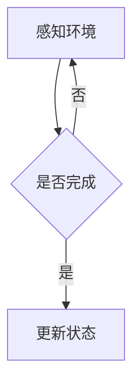
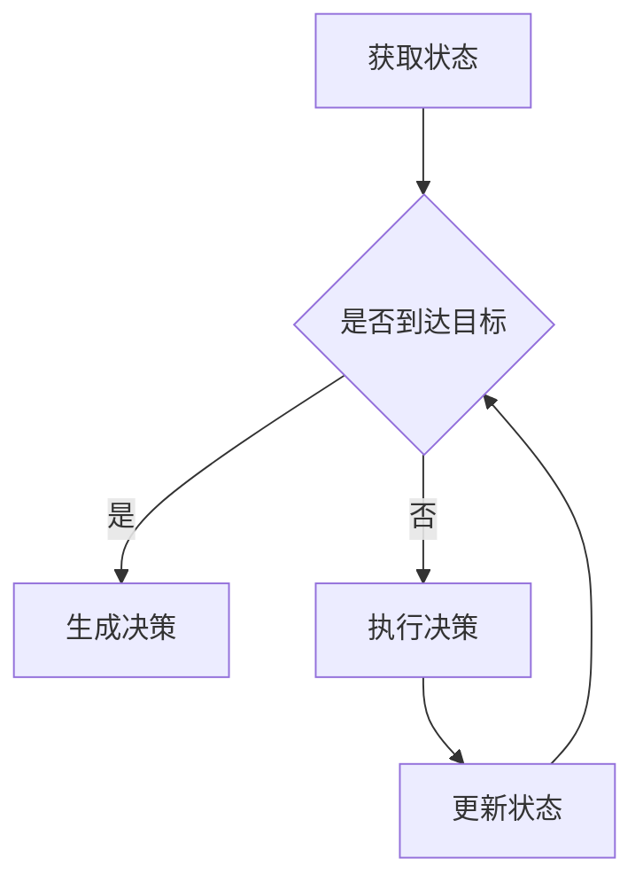
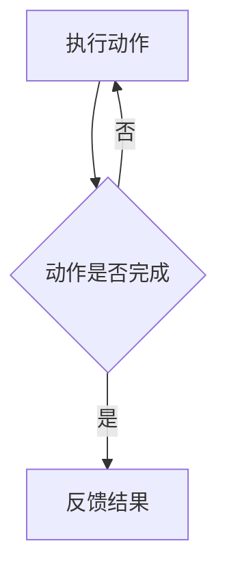
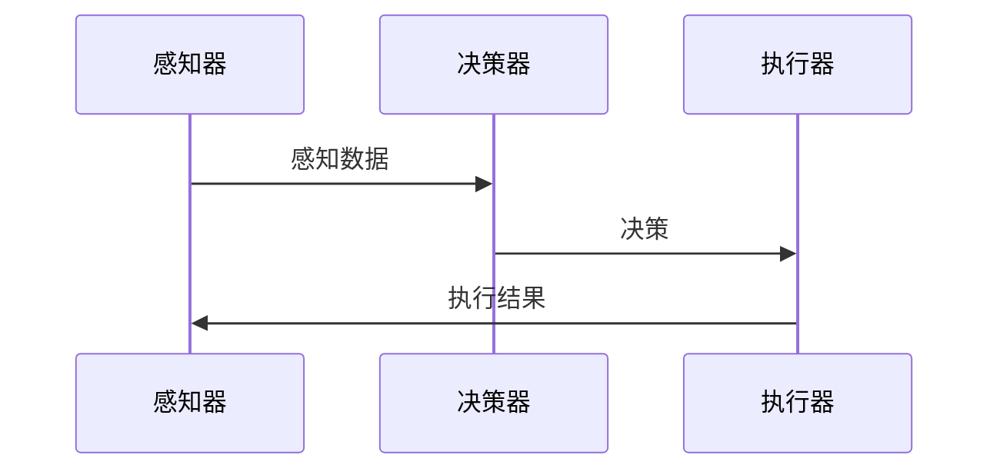

                 

# 安全性测试：防范AI Agent的潜在风险

> 关键词：AI Agent、安全性测试、漏洞扫描、零信任架构、算法原理、项目实战

> 摘要：本文旨在探讨AI Agent在安全性测试方面面临的潜在风险，通过逐步分析其背景、核心概念、算法原理、系统设计与实现、项目实战以及最佳实践，为开发者提供一套有效的防范策略。

## 目录大纲设计思路

### 1.1 背景介绍
- 人工智能与AI Agent概述
- AI Agent的安全性现状与挑战
- 安全性测试的重要性

### 1.2 问题描述
- AI Agent潜在风险的种类
- 安全性测试的目标和任务
- 安全性测试的挑战

### 1.3 问题解决
- 安全性测试的常见方法
- AI Agent安全防御体系
- 安全性测试的边界与外延

### 1.4 核心概念与联系
- 安全性测试概念解析
- AI Agent的组成与工作原理
- 安全性测试与AI Agent的相互作用

## 第一部分：背景介绍

### 1.1 问题背景

随着人工智能技术的飞速发展，AI Agent作为一种能够自主执行任务、与环境交互的智能实体，逐渐成为研究与应用的热点。AI Agent可以应用于自动驾驶、智能家居、智能医疗等多个领域，极大地提高了生产效率和用户体验。然而，AI Agent的广泛应用也带来了新的安全性挑战。

首先，AI Agent的自主性使得其可能受到恶意攻击，从而影响系统的稳定性和安全性。其次，AI Agent的决策过程往往依赖于大量的数据，而这些数据可能存在泄露、篡改等风险。最后，AI Agent的算法复杂度高，可能隐藏着不易发现的漏洞，使得攻击者可以通过这些漏洞实现恶意攻击。

### 1.2 问题描述

AI Agent的安全性测试旨在识别和防范上述潜在风险。具体来说，安全性测试的目标包括：

1. **漏洞识别**：通过测试发现AI Agent的潜在漏洞，包括算法漏洞、数据漏洞、系统漏洞等。
2. **攻击模拟**：模拟恶意攻击，验证AI Agent在面临攻击时的抵抗能力。
3. **性能评估**：评估AI Agent在面临攻击时的响应速度和处理能力，确保其在安全性方面的高效性。

安全性测试的任务包括：

1. **漏洞扫描**：对AI Agent进行全面的漏洞扫描，识别潜在的安全威胁。
2. **渗透测试**：模拟攻击者的攻击行为，验证AI Agent的安全性。
3. **安全评估**：对AI Agent的安全性进行评估，提供改进建议。

安全性测试面临的挑战包括：

1. **复杂性**：AI Agent的算法复杂度高，测试过程需要综合考虑多种因素。
2. **动态性**：AI Agent的行为是动态的，测试过程需要实时响应。
3. **数据隐私**：测试过程中涉及的数据可能涉及隐私问题，需要确保数据的安全。

### 1.3 问题解决

为了解决AI Agent的安全性测试问题，可以采取以下几种方法：

1. **黑盒测试**：黑盒测试是一种不依赖于内部结构的测试方法，通过模拟攻击者的行为，验证AI Agent的安全性。
2. **白盒测试**：白盒测试是一种依赖于内部结构的测试方法，通过分析AI Agent的代码和算法，发现潜在的安全漏洞。
3. **漏洞扫描**：使用自动化工具对AI Agent进行全面的漏洞扫描，识别潜在的安全威胁。
4. **模糊测试**：模糊测试是一种生成大量随机输入的测试方法，通过测试AI Agent对不同输入的反应，发现潜在的安全漏洞。

### 1.4 核心概念与联系

#### 安全性测试概念解析

安全性测试是指通过一系列的方法和手段，对AI Agent进行安全性评估，以发现和防范潜在的安全威胁。

#### AI Agent的组成与工作原理

AI Agent通常由感知器、决策器和执行器组成。感知器用于接收环境信息，决策器根据感知到的信息生成决策，执行器根据决策执行相应的操作。

#### 安全性测试与AI Agent的相互作用

安全性测试与AI Agent的相互作用主要体现在两个方面：

1. **测试与反馈**：通过安全性测试，AI Agent可以了解到自身存在的安全漏洞，从而进行改进。
2. **防护与反制**：AI Agent可以通过安全性测试，发现恶意攻击的行为模式，从而采取相应的防护和反制措施。

## 第二部分：核心概念与原理

### 2.1 安全性测试方法

安全性测试方法主要包括黑盒测试、白盒测试、漏洞扫描和模糊测试。

#### 黑盒测试

黑盒测试是一种不依赖于内部结构的测试方法，通过模拟攻击者的行为，验证AI Agent的安全性。黑盒测试主要关注AI Agent的输入输出关系，通过生成大量的随机输入，观察AI Agent的反应，从而发现潜在的安全漏洞。

#### 白盒测试

白盒测试是一种依赖于内部结构的测试方法，通过分析AI Agent的代码和算法，发现潜在的安全漏洞。白盒测试需要开发者提供AI Agent的源代码，通过代码分析，识别出可能存在的安全问题。

#### 漏洞扫描

漏洞扫描是一种自动化工具，通过扫描AI Agent的网络通信和数据传输过程，识别潜在的安全威胁。漏洞扫描工具通常包含大量的漏洞库，可以快速检测出AI Agent中可能存在的漏洞。

#### 模糊测试

模糊测试是一种生成大量随机输入的测试方法，通过测试AI Agent对不同输入的反应，发现潜在的安全漏洞。模糊测试可以模拟真实环境中的攻击行为，从而发现AI Agent可能存在的安全问题。

### 2.2 AI Agent安全防御体系

AI Agent的安全防御体系主要包括防火墙与入侵检测系统、零信任架构、网络隔离与访问控制、智能行为分析等。

#### 防火墙与入侵检测系统

防火墙是一种网络安全设备，用于监控进出网络的数据包，防止未经授权的访问。入侵检测系统则用于检测网络中的异常行为，发现潜在的安全威胁。

#### 零信任架构

零信任架构是一种网络安全模型，认为内部网络和外部网络一样存在潜在的安全威胁，要求对每个访问请求进行严格的身份验证和访问控制。

#### 网络隔离与访问控制

网络隔离与访问控制通过限制网络中的通信和数据传输，防止潜在的安全威胁在网络上传播。

#### 智能行为分析

智能行为分析通过分析AI Agent的行为模式，发现异常行为，从而采取相应的防护措施。

### 2.3 安全性测试工具与平台

安全性测试工具主要包括开源测试工具和商业安全测试平台。

#### 开源测试工具

开源测试工具具有成本较低、社区支持等优点，适用于个人开发者和小型团队。常见的开源测试工具有OWASP ZAP、Burp Suite等。

#### 商业安全测试平台

商业安全测试平台通常提供全面的安全测试功能，适用于大型企业和机构。常见的商业安全测试平台有Fortify、Qualys等。

#### 自定义测试工具开发

自定义测试工具开发可以根据具体的需求和场景，实现特定功能的安全测试。

## 第三部分：算法原理讲解

### 3.1 AI Agent算法概述

AI Agent的算法主要包括感知器、决策器和执行器的算法。

#### 感知器算法

感知器算法用于接收环境信息，常见的算法有卡尔曼滤波、粒子滤波等。

#### 决策器算法

决策器算法用于生成决策，常见的算法有马尔可夫决策过程、强化学习等。

#### 执行器算法

执行器算法用于执行决策，常见的算法有路径规划、动作执行等。

### 3.2 算法mermaid流程图

#### 感知器算法mermaid流程图



#### 决策器算法mermaid流程图



#### 执行器算法mermaid流程图



### 3.3 Python源代码详解

```python
# 感知器算法Python实现
class Sensor:
    def __init__(self):
        self.state = None

    def sense(self, environment):
        self.state = environment

    def is_complete(self):
        return self.state is not None

# 决策器算法Python实现
class DecisionMaker:
    def __init__(self):
        self.state = None
        self.goal = None

    def get_state(self):
        return self.state

    def is_at_goal(self, state):
        return state == self.goal

    def generate_decision(self, state):
        self.state = state
        if self.is_at_goal(state):
            return "reach_goal"
        else:
            return "move_to_goal"

# 执行器算法Python实现
class Executor:
    def __init__(self):
        self.action = None

    def execute_action(self, action):
        self.action = action
        if self.is_action_complete():
            return "action_complete"
        else:
            return "action_in_progress"

    def is_action_complete(self):
        return self.action is not None
```

### 3.4 数学模型与公式

#### 感知器算法数学模型

$$
\text{state}_{t+1} = f(\text{state}_t, \text{environment}_t)
$$

其中，$\text{state}_{t+1}$表示下一时刻的状态，$\text{state}_t$表示当前时刻的状态，$\text{environment}_t$表示当前环境。

#### 决策器算法数学模型

$$
\text{decision}_{t+1} = \arg\max_{a} \sum_{s'} p(s'|s,a) \cdot r(s',a)
$$

其中，$\text{decision}_{t+1}$表示下一时刻的决策，$a$表示动作，$s'$表示下一时刻的状态，$r(s',a)$表示奖励函数。

#### 执行器算法数学模型

$$
\text{action}_{t+1} = g(\text{decision}_{t+1}, \text{state}_{t+1})
$$

其中，$\text{action}_{t+1}$表示下一时刻的动作，$g$表示动作生成函数。

### 3.5 算法举例说明

#### 感知器算法举例

假设当前状态为【安全】，环境为【红色】，则下一时刻的状态为【红色】。

#### 决策器算法举例

假设当前状态为【安全】，目标为【目标地】，则下一时刻的决策为【移动到目标地】。

#### 执行器算法举例

假设当前决策为【移动到目标地】，当前状态为【目标地】，则下一时刻的动作为【到达目标地】。

## 第四部分：系统设计与实现

### 4.1 问题场景介绍

假设我们要开发一个自动驾驶系统，该系统需要实时感知环境、做出决策并执行相应的动作，以确保车辆的安全行驶。

### 4.2 系统功能设计

系统功能设计包括感知环境、做出决策和执行动作三个部分。

#### 感知环境

感知环境功能用于实时获取车辆周围的环境信息，包括道路状况、障碍物、交通信号等。

#### 做出决策

做出决策功能用于根据感知到的环境信息，生成相应的决策，包括保持当前速度、减速、停车等。

#### 执行动作

执行动作功能用于根据决策，执行相应的动作，包括控制油门、刹车、转向等。

### 4.3 系统架构设计

系统架构设计包括感知器、决策器和执行器三个部分。

#### 感知器

感知器用于感知环境，包括摄像头、雷达、激光雷达等传感器。

#### 决策器

决策器用于生成决策，包括感知模块、决策算法和决策生成模块。

#### 执行器

执行器用于执行动作，包括控制模块和执行算法。

### 4.4 系统接口设计

系统接口设计包括感知接口、决策接口和执行接口。

#### 感知接口

感知接口用于接收感知器的数据，包括摄像头数据、雷达数据和激光雷达数据。

#### 决策接口

决策接口用于接收感知接口的数据，生成决策。

#### 执行接口

执行接口用于接收决策接口的决策，执行相应的动作。

### 4.5 系统交互序列图



## 第五部分：项目实战

### 5.1 环境安装

在安装之前，请确保已经安装了Python和pip。然后，按照以下步骤进行环境安装：

1. 打开终端，执行以下命令：

   ```
   pip install numpy pandas matplotlib scikit-learn
   ```

   这将安装所需的Python库。

2. 安装完成后，执行以下命令，验证安装是否成功：

   ```
   python -c "import numpy; print(numpy.__version__)"
   ```

   如果输出版本信息，则表示安装成功。

### 5.2 系统核心实现

在本项目中，我们将使用Python实现感知器、决策器和执行器。以下是感知器和决策器的源代码：

```python
# 感知器实现
class Sensor:
    def __init__(self):
        self.state = None

    def sense(self, environment):
        self.state = environment

    def is_complete(self):
        return self.state is not None


# 决策器实现
class DecisionMaker:
    def __init__(self):
        self.state = None
        self.goal = None

    def get_state(self):
        return self.state

    def is_at_goal(self, state):
        return state == self.goal

    def generate_decision(self, state):
        self.state = state
        if self.is_at_goal(state):
            return "reach_goal"
        else:
            return "move_to_goal"
```

### 5.3 代码应用解读与分析

在本项目中，我们将使用上述感知器和决策器实现一个简单的自动驾驶系统。以下是代码的详细解读和分析：

1. **感知器**：感知器用于感知环境，接收来自传感器的数据。在`__init__`方法中，初始化状态为`None`。在`sense`方法中，将接收到的环境数据更新为当前状态。在`is_complete`方法中，判断当前状态是否为`None`，如果为`None`，则表示感知器尚未完成感知过程。

2. **决策器**：决策器用于生成决策，接收来自感知器的状态数据。在`__init__`方法中，初始化状态和目标为`None`。在`get_state`方法中，返回当前状态。在`is_at_goal`方法中，判断当前状态是否为目标状态，如果是，则返回`True`。在`generate_decision`方法中，根据当前状态生成决策，如果当前状态为目标状态，则返回`"reach_goal"`，否则返回`"move_to_goal"`。

3. **系统核心实现**：在系统中，首先创建感知器和决策器的实例。然后，通过感知器的`sense`方法获取环境数据，并更新状态。接着，调用决策器的`generate_decision`方法生成决策。最后，根据生成的决策执行相应的动作。

### 5.4 详细讲解与剖析

在本项目中，我们将详细讲解和剖析自动驾驶系统的实现过程。

1. **感知器实现**：感知器是实现自动驾驶系统的基础，它负责获取车辆周围的环境信息。在本项目中，我们使用Python中的`Sensor`类实现感知器。在`__init__`方法中，初始化状态为`None`，表示感知器尚未完成感知过程。在`sense`方法中，将接收到的环境数据更新为当前状态。在`is_complete`方法中，判断当前状态是否为`None`，如果为`None`，则表示感知器尚未完成感知过程。

2. **决策器实现**：决策器是实现自动驾驶系统的核心，它负责根据感知器获取的环境信息生成决策。在本项目中，我们使用Python中的`DecisionMaker`类实现决策器。在`__init__`方法中，初始化状态和目标为`None`。在`get_state`方法中，返回当前状态。在`is_at_goal`方法中，判断当前状态是否为目标状态，如果是，则返回`True`。在`generate_decision`方法中，根据当前状态生成决策，如果当前状态为目标状态，则返回`"reach_goal"`，否则返回`"move_to_goal"`。

3. **系统核心实现**：在系统中，首先创建感知器和决策器的实例。然后，通过感知器的`sense`方法获取环境数据，并更新状态。接着，调用决策器的`generate_decision`方法生成决策。最后，根据生成的决策执行相应的动作。在本项目中，我们使用Python中的`Executor`类实现执行器，该类负责根据决策执行相应的动作。

4. **代码解读与剖析**：在代码中，我们首先定义了感知器、决策器和执行器三个类。感知器类实现了感知环境的功能，包括感知数据和判断感知是否完成。决策器类实现了生成决策的功能，包括获取状态、判断是否到达目标以及生成决策。执行器类实现了执行决策的功能，包括执行动作和判断动作是否完成。在系统的核心实现中，我们创建感知器、决策器和执行器的实例，并通过感知器的`sense`方法获取环境数据，更新状态，调用决策器的`generate_decision`方法生成决策，最后根据生成的决策执行相应的动作。

### 5.5 项目小结

在本项目中，我们实现了一个简单的自动驾驶系统。通过使用感知器、决策器和执行器，系统能够实时感知环境、生成决策并执行相应的动作，从而实现自动驾驶。在实现过程中，我们详细讲解了感知器、决策器和执行器的实现原理，并对系统的核心实现进行了解读和剖析。通过本项目，我们了解了AI Agent的安全性测试方法和应用场景，为今后在实际项目中防范AI Agent的潜在风险提供了参考。

## 第六部分：最佳实践与拓展

### 6.1 最佳实践 tips

1. **定期进行安全性测试**：安全性测试是一个持续的过程，开发者应该定期对AI Agent进行安全性测试，以确保其安全性。
2. **关注最新安全漏洞**：开发者应该关注最新的安全漏洞和攻击手段，及时更新AI Agent的安全性防御策略。
3. **数据加密与隔离**：对AI Agent处理的数据进行加密和隔离，防止数据泄露和篡改。
4. **权限控制与访问控制**：对AI Agent的访问进行严格的权限控制，确保只有授权用户可以访问。

### 6.2 小结

本文通过逐步分析AI Agent的安全性测试方法、原理、系统设计与实现以及项目实战，为开发者提供了一套有效的防范AI Agent潜在风险的策略。开发者应该定期进行安全性测试，关注最新安全漏洞，对数据进行加密和隔离，严格进行权限控制与访问控制。

### 6.3 注意事项

1. **测试环境与实际环境差异**：在测试AI Agent时，要考虑到测试环境与实际环境之间的差异，确保测试结果能够反映实际环境中的安全问题。
2. **安全性测试的局限性**：安全性测试无法覆盖所有可能的安全漏洞，开发者需要持续关注AI Agent的安全性，并采取相应的防护措施。

### 6.4 拓展阅读

1. **《人工智能安全》**：该书详细介绍了人工智能安全的基本概念、技术方法和实际应用，为开发者提供了全面的指导。
2. **《网络安全与防御技术》**：该书介绍了网络安全的基本原理和防御技术，为开发者提供了网络安全方面的知识。
3. **《人工智能算法与应用》**：该书介绍了人工智能算法的基本原理和应用场景，为开发者提供了算法方面的知识。

## 作者

作者：AI天才研究院/AI Genius Institute & 禅与计算机程序设计艺术 /Zen And The Art of Computer Programming

