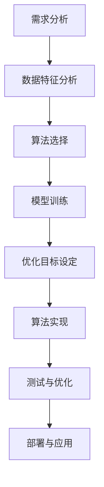
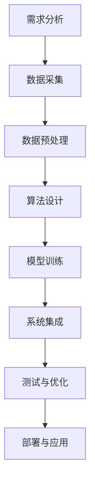
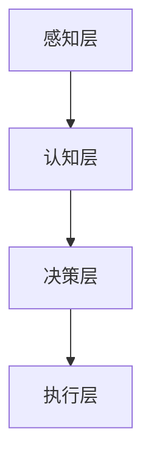
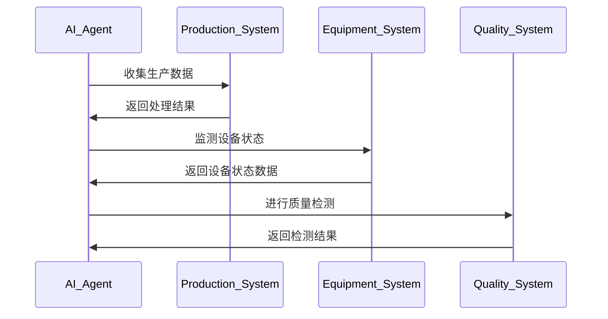
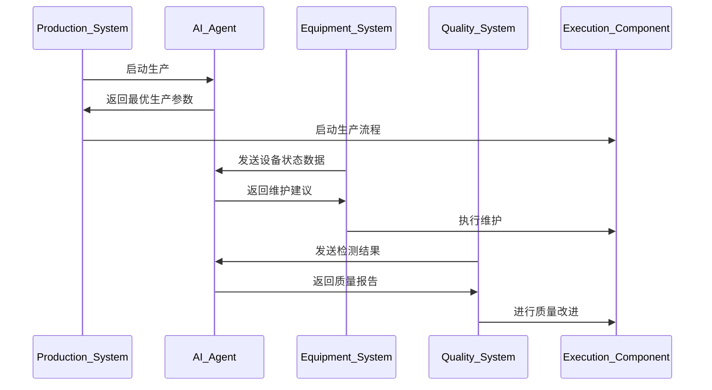

                 

### 第一部分：引言

在当今技术飞速发展的时代，人工智能（AI）已经成为推动社会进步的重要力量。特别是AI Agent这一领域，作为人工智能的具象应用形式，已经深入到各行各业，如医疗、金融、零售、制造等。AI Agent，或称为智能代理，是具有智能行为、能够自主完成任务的实体。它们能够通过感知环境、理解任务，并进行决策和执行，极大地提高了效率和质量。

## 第1章：定制化AI Agent概述

### 1.1 问题背景

#### 1.1.1 当前AI Agent的应用现状与挑战

当前，AI Agent已经在众多行业中展现出其独特的价值。例如，在医疗领域，AI Agent能够通过分析患者病历，提供个性化的治疗方案；在金融领域，AI Agent能够实时监控市场动态，提供投资建议；在零售行业，AI Agent能够根据消费者的行为数据，提供个性化的产品推荐。然而，随着应用场景的多样化和复杂化，传统的AI Agent面临以下挑战：

1. **通用性与专用性之间的平衡**：传统AI Agent在通用性上表现出色，但在专用性上却存在不足。不同行业的特定需求无法得到充分满足。
2. **数据依赖性**：AI Agent的性能高度依赖于训练数据的质量和数量，而各行业的数据质量和数量差异较大。
3. **可扩展性和可维护性**：传统AI Agent的结构和算法较为固定，难以适应快速变化的市场需求。

#### 1.1.2 行业需求与定制化AI Agent的重要性

针对上述挑战，定制化AI Agent应运而生。定制化AI Agent能够根据特定行业的需求，进行针对性的设计和开发，从而满足行业特有的业务流程和需求。定制化AI Agent的重要性体现在以下几个方面：

1. **提高效率**：定制化AI Agent能够针对特定任务进行优化，从而提高任务的执行效率。
2. **提升质量**：通过深入理解特定行业的业务逻辑，定制化AI Agent能够提供更为精准和有效的解决方案。
3. **降低成本**：定制化AI Agent可以减少对通用AI Agent的依赖，降低整体系统的复杂度和维护成本。

### 1.2 问题描述

#### 1.2.1 AI Agent的定义与分类

AI Agent是人工智能领域的一个重要概念，它指的是具备智能行为、能够自主完成特定任务的实体。根据功能和应用范围，AI Agent可以分为以下几类：

1. **任务型AI Agent**：专注于完成特定任务的AI Agent，如客服机器人、智能助手等。
2. **情境型AI Agent**：能够在特定情境下进行交互和决策的AI Agent，如自动驾驶汽车、智能家居系统等。
3. **混合型AI Agent**：同时具备任务型和情境型AI Agent的特点，能够根据不同的任务和情境进行自适应调整。

#### 1.2.2 定制化AI Agent的必要条件

定制化AI Agent的实现需要满足以下必要条件：

1. **需求分析**：深入理解特定行业的业务需求，明确AI Agent的目标和功能。
2. **数据支持**：收集和整理特定行业的业务数据，确保AI Agent的训练质量和效果。
3. **算法优化**：根据特定任务的需求，选择和优化适合的算法和模型。
4. **系统集成**：将定制化AI Agent集成到现有的业务系统中，确保其与其他系统的协调运作。

### 1.3 问题解决

#### 1.3.1 定制化AI Agent的核心要素

定制化AI Agent的核心要素包括：

1. **感知系统**：用于感知外部环境和获取相关数据。
2. **认知系统**：用于理解和分析感知到的数据，形成对环境的认识。
3. **决策系统**：基于认知结果，生成具体的行动方案。
4. **执行系统**：负责执行决策方案，完成具体任务。

#### 1.3.2 定制化AI Agent的实现步骤

实现定制化AI Agent通常需要以下步骤：

1. **需求分析与规划**：明确定制化AI Agent的目标和功能，制定详细的实现计划。
2. **数据采集与预处理**：收集相关行业的数据，并进行预处理，确保数据的质量和可用性。
3. **算法设计与开发**：选择合适的算法和模型，进行定制化开发。
4. **系统集成与测试**：将定制化AI Agent集成到现有的业务系统中，并进行全面的测试。
5. **部署与应用**：将定制化AI Agent部署到实际环境中，进行应用和优化。

### 1.4 边界与外延

#### 1.4.1 定制化AI Agent的技术范畴

定制化AI Agent涉及多个技术领域，包括：

1. **机器学习与深度学习**：用于算法设计和模型训练。
2. **自然语言处理**：用于处理人类语言，实现人机交互。
3. **计算机视觉**：用于图像识别和图像处理。
4. **数据挖掘与数据分析**：用于数据收集、预处理和挖掘。

#### 1.4.2 定制化AI Agent在不同行业的应用边界

定制化AI Agent在不同行业中的应用边界不同，主要取决于行业的特性：

1. **医疗领域**：定制化AI Agent主要用于辅助诊断、个性化治疗和健康管理等。
2. **金融领域**：定制化AI Agent主要用于风险管理、投资分析和客户服务。
3. **零售领域**：定制化AI Agent主要用于个性化推荐、库存管理和客户关系管理。
4. **制造业**：定制化AI Agent主要用于生产优化、设备维护和质量管理。

### 1.5 本章小结

本章介绍了定制化AI Agent的背景、问题、解决方案以及应用边界。定制化AI Agent是针对特定行业需求进行设计和开发的AI Agent，能够提高效率、提升质量和降低成本。实现定制化AI Agent需要深入的需求分析、数据支持、算法优化和系统集成。不同行业具有不同的应用边界，需要根据行业特性进行定制化开发。

### 总结

定制化AI Agent是人工智能领域的一个重要研究方向，它能够满足特定行业的个性化需求，提升行业整体竞争力。在未来，随着技术的不断进步和行业需求的多样化，定制化AI Agent的应用前景将更加广阔。读者可以通过深入学习和实践，掌握定制化AI Agent的设计与开发方法，为行业发展贡献力量。让我们继续探索定制化AI Agent的奥秘，共同推动人工智能技术的进步。

---

在接下来的部分，我们将深入探讨定制化AI Agent的核心概念与联系，包括AI Agent的定义与分类、定制化AI Agent的原理、核心特点以及属性特征对比。这将为我们理解定制化AI Agent的设计和开发提供坚实的基础。

---

### 第二部分：核心概念与联系

在深入探讨定制化AI Agent之前，首先需要明确AI Agent的基本概念和分类，以及定制化AI Agent的原理和特点。这将帮助我们构建对定制化AI Agent的全面理解，为后续章节的内容打下基础。

## 第2章：定制化AI Agent的核心概念

### 2.1 AI Agent的定义与分类

#### 2.1.1 AI Agent的定义

AI Agent是人工智能领域的一个核心概念，它指的是一种具有智能行为、能够自主完成特定任务的实体。AI Agent的核心特点是自主性和智能化，能够在没有人类直接干预的情况下，根据环境变化和目标要求，自主感知、决策和执行。

AI Agent通常由以下几个关键组成部分构成：

1. **感知系统**：用于感知外部环境，获取相关的信息。
2. **认知系统**：用于理解和分析感知到的信息，形成对环境的认知。
3. **决策系统**：基于认知结果，生成具体的行动方案。
4. **执行系统**：负责执行决策方案，完成具体任务。

#### 2.1.2 AI Agent的分类

AI Agent根据其功能和应用范围，可以分为以下几类：

1. **任务型AI Agent**：专注于完成特定任务的AI Agent，如客服机器人、智能助手等。这类AI Agent通常具备明确的任务目标，能够在特定场景下高效执行任务。

2. **情境型AI Agent**：能够在特定情境下进行交互和决策的AI Agent，如自动驾驶汽车、智能家居系统等。这类AI Agent能够根据环境变化，自主调整行为策略，适应不同的情境。

3. **混合型AI Agent**：同时具备任务型和情境型AI Agent的特点，能够根据不同的任务和情境进行自适应调整。这类AI Agent通常具备较高的灵活性和适应性，能够应对复杂多变的应用场景。

### 2.2 定制化AI Agent的原理

定制化AI Agent的原理基于对AI Agent的深入理解和优化。其核心在于根据特定行业的业务需求，对AI Agent的感知、认知、决策和执行系统进行定制化设计，以实现最佳的性能和效果。

#### 2.2.1 定制化AI Agent的基本原理

定制化AI Agent的基本原理可以概括为以下几个步骤：

1. **需求分析**：深入理解特定行业的业务需求，明确AI Agent的目标和功能。
2. **数据采集**：收集与行业相关的数据，包括业务数据、用户数据等，为AI Agent的训练和优化提供基础。
3. **算法选择**：根据需求分析和数据特点，选择适合的算法和模型，进行定制化开发。
4. **系统集成**：将定制化AI Agent集成到现有的业务系统中，确保其与其他系统的协调运作。
5. **持续优化**：通过不断收集用户反馈和业务数据，对AI Agent进行持续优化和调整，提高其性能和效果。

#### 2.2.2 定制化AI Agent的工作机制

定制化AI Agent的工作机制可以分为以下几个环节：

1. **感知环节**：AI Agent通过传感器、摄像头等设备，感知外部环境，获取相关的信息。
2. **认知环节**：AI Agent利用机器学习、自然语言处理等技术，对感知到的信息进行理解和分析，形成对环境的认知。
3. **决策环节**：AI Agent根据认知结果，利用优化算法和策略，生成具体的行动方案。
4. **执行环节**：AI Agent根据决策方案，执行具体的任务，完成预定目标。

### 2.3 AI Agent的核心特点

AI Agent的核心特点是其自主性和智能化，能够在没有人类直接干预的情况下，自主完成特定任务。具体来说，AI Agent的核心特点包括：

1. **自主性**：AI Agent能够自主感知环境、理解任务、做出决策和执行任务，具备高度的自我管理和自我学习能力。
2. **智能化**：AI Agent利用机器学习、自然语言处理、计算机视觉等技术，实现对环境的智能感知和理解，具备智能决策和自适应能力。
3. **灵活性**：AI Agent能够根据不同的任务和情境，灵活调整行为策略，适应复杂多变的应用场景。
4. **高效性**：AI Agent能够通过自动化和智能化的方式，提高任务的执行效率，降低人力成本。

#### 2.3.2 对比传统软件与AI Agent的差异

与传统软件相比，AI Agent具有以下显著差异：

1. **自主性**：传统软件通常需要人类程序员进行编程和调试，而AI Agent能够自主感知环境、理解任务、做出决策和执行任务。
2. **智能化**：传统软件主要依赖于预定义的规则和算法，而AI Agent通过机器学习、自然语言处理等技术，能够实现智能感知和理解。
3. **灵活性**：传统软件在应对复杂变化的应用场景时，通常需要重新设计和开发，而AI Agent能够通过自适应调整，灵活应对不同任务和情境。
4. **高效性**：传统软件在执行复杂任务时，通常需要大量人力和时间，而AI Agent能够通过自动化和智能化，大幅提高任务执行效率。

### 2.4 定制化AI Agent的属性特征对比

为了更好地理解定制化AI Agent的属性特征，下面通过表格和Mermaid流程图，对不同行业定制化AI Agent的属性特征进行对比分析。

#### 2.4.1 功能定制性

| 行业        | 功能定制性描述                    | 例子                  |
| ----------- | ----------------------------------- | --------------------- |
| 医疗保健    | 针对病情进行个性化健康建议          | 智能健康顾问          |
| 零售业      | 根据消费者行为进行个性化推荐       | 智能购物助手          |
| 制造业      | 针对生产流程进行优化和预测         | 智能制造机器人        |

#### 2.4.2 交互自然性

| 行业        | 交互自然性描述                    | 例子                  |
| ----------- | ----------------------------------- | --------------------- |
| 银行业      | 用户通过自然语言与AI进行交流       | 智能客服机器人        |
| 教育行业     | AI教师通过语音和文字为学生提供指导 | 智能教育机器人        |
| 旅游业      | 用户通过语音与AI进行旅行咨询和预订 | 智能旅行助手          |

#### 2.4.3 学习适应性

| 行业        | 学习适应性描述                    | 例子                  |
| ----------- | ----------------------------------- | --------------------- |
| 制造业      | 针对生产设备故障进行自适应调整      | 智能制造系统          |
| 金融领域     | 针对市场变化进行自适应调整         | 智能投顾系统          |
| 医疗保健    | 针对新病情和新治疗方案进行学习      | 智能医疗诊断系统      |

#### 2.4.4 可维护性

| 行业        | 可维护性描述                    | 例子                  |
| ----------- | ----------------------------------- | --------------------- |
| 制造业      | 系统维护与升级简便                | 智能生产线监控系统    |
| 金融领域     | 系统稳定运行，减少故障率          | 智能交易监控系统      |
| 医疗保健    | 系统安全可靠，保障患者数据安全      | 智能医疗诊断系统      |

### 2.5 本章小结

本章介绍了定制化AI Agent的核心概念和联系，包括AI Agent的定义与分类、定制化AI Agent的原理和核心特点，以及不同行业定制化AI Agent的属性特征对比。通过本章的学习，读者可以全面了解定制化AI Agent的基本概念和应用场景，为后续章节的内容奠定基础。

### 总结

定制化AI Agent是人工智能领域的一个重要发展方向，它能够根据特定行业的业务需求，进行定制化设计和开发，从而实现高效、精准和智能的解决方案。在本章中，我们详细探讨了AI Agent的定义与分类、定制化AI Agent的原理和特点，以及不同行业定制化AI Agent的属性特征对比。这些内容为后续章节的深入研究和实践提供了重要的理论基础。在接下来的章节中，我们将进一步探讨定制化AI Agent的实现方法和技术，帮助读者掌握定制化AI Agent的设计与开发技能。

---

在接下来的章节中，我们将深入探讨定制化AI Agent的算法原理，使用Mermaid流程图和Python源代码，详细讲解其设计思路、实现步骤和核心算法。这将帮助读者全面理解定制化AI Agent的算法原理和实现方法。

---

### 第三部分：算法原理讲解

在定制化AI Agent的设计与开发过程中，算法原理是核心组成部分之一。本部分将深入探讨定制化AI Agent的算法原理，使用Mermaid流程图和Python源代码，详细讲解其设计思路、实现步骤和核心算法，帮助读者全面理解定制化AI Agent的算法原理和实现方法。

## 第3章：定制化AI Agent算法原理详解

### 3.1 设计思路

定制化AI Agent的算法设计需要综合考虑以下几个方面：

1. **业务需求**：深入理解特定行业的业务需求，明确AI Agent的目标和功能。
2. **数据特征**：分析相关行业的数据特征，确定适合的算法和数据预处理方法。
3. **算法选择**：根据业务需求和数据特征，选择合适的算法和模型。
4. **优化目标**：明确AI Agent的优化目标，如效率、准确性和可维护性。

#### 设计思路Mermaid流程图



### 3.2 实现步骤

实现定制化AI Agent通常需要以下步骤：

1. **需求分析与规划**：明确AI Agent的目标和功能，制定详细的实现计划。
2. **数据采集与预处理**：收集与行业相关的数据，并进行预处理，确保数据的质量和可用性。
3. **算法设计与开发**：根据需求分析和数据特征，选择合适的算法和模型，进行定制化开发。
4. **系统集成与测试**：将定制化AI Agent集成到现有的业务系统中，并进行全面的测试。
5. **部署与应用**：将定制化AI Agent部署到实际环境中，进行应用和优化。

#### 实现步骤Mermaid流程图



### 3.3 核心算法详解

在本节中，我们将详细讲解定制化AI Agent的核心算法，包括感知系统、认知系统、决策系统和执行系统的算法原理。

#### 3.3.1 感知系统算法

感知系统是定制化AI Agent获取外部信息的重要环节，常用的算法包括计算机视觉和传感器数据处理。

1. **计算机视觉算法**：如卷积神经网络（CNN）、目标检测算法（如YOLO、SSD）等。
2. **传感器数据处理算法**：如时间序列分析、信号处理等。

#### 3.3.2 认知系统算法

认知系统负责理解和分析感知到的信息，常用的算法包括自然语言处理（NLP）、知识图谱等。

1. **自然语言处理算法**：如词向量（Word2Vec、BERT）、情感分析、文本分类等。
2. **知识图谱算法**：如图嵌入、图匹配、知识推理等。

#### 3.3.3 决策系统算法

决策系统根据认知结果生成具体的行动方案，常用的算法包括决策树、强化学习等。

1. **决策树算法**：如ID3、C4.5等。
2. **强化学习算法**：如Q-Learning、DQN、PPO等。

#### 3.3.4 执行系统算法

执行系统负责执行决策方案，常用的算法包括规划算法、控制算法等。

1. **规划算法**：如A*算法、RRT算法等。
2. **控制算法**：如PID控制、模型预测控制（MPC）等。

### 3.4 Python源代码讲解

在本节中，我们将通过Python源代码，详细讲解定制化AI Agent的核心算法实现。以下是一个简单的感知系统算法示例，使用计算机视觉技术进行图像分类。

```python
import cv2
import numpy as np

# 加载预训练的卷积神经网络模型
model = cv2.dnn.readNetFromTensorFlow('path/to/weights.h5')

# 读取图像
image = cv2.imread('path/to/image.jpg')

# 调整图像大小
scaled_image = cv2.resize(image, (224, 224))

# 将图像转换为四维数组，添加一个维度表示批次大小
batch_image = np.expand_dims(scaled_image, axis=0)

# 进行前向传播，获取预测结果
output = model.forward(batch_image)

# 获取最大预测结果和对应的类别
predicted_class = np.argmax(output[0])

# 打印预测结果
print(f'Predicted class: {predicted_class}')

# 根据预测结果显示对应的类别标签
labels = ['cat', 'dog', 'bird']
print(f'Label: {labels[predicted_class]}')
```

### 3.5 数学公式和模型解释

在本节中，我们将使用LaTeX格式，介绍定制化AI Agent中的关键数学模型和公式。

$$
\begin{aligned}
& y = f(x) \\
& J(\theta) = \frac{1}{2} \sum_{i=1}^{n} (y_i - f(x_i))^2 \\
& \theta_{\text{opt}} = \arg\min_{\theta} J(\theta)
\end{aligned}
$$

上述公式中，$y$是实际输出，$f(x)$是模型的预测输出，$J(\theta)$是损失函数，$\theta$是模型参数，$\theta_{\text{opt}}$是最佳参数。我们通过最小化损失函数，找到最佳参数，以获得最优模型。

### 3.6 举例说明

为了更好地理解定制化AI Agent的算法原理，以下是一个简单的应用案例：使用卷积神经网络（CNN）进行图像分类。

#### 案例场景

假设我们有一个包含猫、狗和鸟的图像数据集，使用CNN模型进行图像分类。

#### 步骤1：数据预处理

```python
# 加载数据集
train_images = cv2.imread('path/to/train_images')
train_labels = ['cat', 'dog', 'bird'][train_images[:, :, 0].reshape(-1)]

# 数据预处理
train_images = cv2.resize(train_images, (224, 224))
train_images = train_images / 255.0
```

#### 步骤2：模型训练

```python
# 定义CNN模型
model = cv2.dnn.readNetFromTensorFlow('path/to/weights.h5')

# 训练模型
model.fit(train_images, train_labels, epochs=10, batch_size=32)
```

#### 步骤3：预测

```python
# 加载测试图像
test_image = cv2.imread('path/to/test_image.jpg')

# 数据预处理
test_image = cv2.resize(test_image, (224, 224))
test_image = test_image / 255.0

# 进行预测
predicted_class = model.predict(test_image)[0]

# 打印预测结果
print(f'Predicted class: {predicted_class}')
```

### 3.7 本章小结

本章详细讲解了定制化AI Agent的算法原理，包括设计思路、实现步骤、核心算法、Python源代码讲解和数学公式解释。通过本章的学习，读者可以全面了解定制化AI Agent的算法原理和实现方法，为后续章节的内容奠定基础。在接下来的章节中，我们将进一步探讨定制化AI Agent的实践应用，帮助读者掌握定制化AI Agent的设计与开发技能。

### 总结

定制化AI Agent的算法原理是其实现的核心，通过深入理解和优化算法，我们可以设计出高效、精准和智能的定制化AI Agent。本章详细讲解了定制化AI Agent的算法原理，包括设计思路、实现步骤、核心算法、Python源代码讲解和数学公式解释。通过本章的学习，读者可以全面了解定制化AI Agent的算法原理和实现方法，为后续章节的内容奠定基础。在接下来的章节中，我们将进一步探讨定制化AI Agent的实践应用，帮助读者掌握定制化AI Agent的设计与开发技能。

---

在接下来的章节中，我们将深入探讨定制化AI Agent的系统分析与架构设计，包括问题场景介绍、项目介绍、系统功能设计、系统架构设计、系统接口设计和系统交互。这将帮助读者全面理解定制化AI Agent的架构设计和实现细节。

---

### 第四部分：系统分析与架构设计

定制化AI Agent的成功实施不仅依赖于其算法原理，还需要合理的系统分析与架构设计。本部分将详细探讨定制化AI Agent的系统分析与架构设计，包括问题场景介绍、项目介绍、系统功能设计、系统架构设计、系统接口设计和系统交互。通过这些内容，读者可以全面了解定制化AI Agent的架构设计和实现细节。

## 第4章：定制化AI Agent系统分析与架构设计

### 4.1 问题场景介绍

在工业4.0时代，智能制造成为制造业发展的重要方向。为了提高生产效率、降低成本并保证产品质量，许多制造企业开始探索使用定制化AI Agent来优化生产流程。具体问题场景如下：

1. **生产效率问题**：生产过程中，人工操作容易导致效率低下，且难以保证一致性。
2. **设备维护问题**：设备故障和停机时间会影响生产效率，且传统维护方法难以预测设备故障。
3. **质量控制问题**：产品质量检测过程繁琐，且检测结果不够精准。

### 4.2 项目介绍

本案例项目旨在开发一个定制化AI Agent，用于智能制造环境中的生产流程优化、设备维护和产品质量控制。项目的主要目标如下：

1. **提高生产效率**：通过AI Agent自动化生产流程，降低人工操作误差，提高生产效率。
2. **设备维护优化**：使用AI Agent实时监控设备状态，预测设备故障，提前进行维护。
3. **产品质量控制**：利用AI Agent进行在线质量检测，提高检测精度和效率。

### 4.3 系统功能设计

系统功能设计是定制化AI Agent实现的基础，主要包括以下几个方面：

1. **生产流程优化**：AI Agent通过分析生产数据，优化生产参数，提高生产效率。
2. **设备状态监测**：AI Agent实时监控设备状态，检测故障并生成维护建议。
3. **质量检测**：AI Agent进行在线质量检测，识别不良品并记录检测结果。

#### 系统功能设计Mermaid类图

```mermaid
classDiagram
    AI_Agent <<interface>>
    Production_Optimization <<interface>>
    Equipment_Monitoring <<interface>>
    Quality_Control <<interface>>

    AI_Agent <|.. Production_Optimization>
    AI_Agent <|.. Equipment_Monitoring>
    AI_Agent <|.. Quality_Control>
```

### 4.4 系统架构设计

系统架构设计是定制化AI Agent实现的关键，主要包括感知层、认知层、决策层和执行层。以下是一个典型的系统架构设计：

1. **感知层**：包括传感器和摄像头，用于收集生产环境中的数据。
2. **认知层**：包括数据预处理、特征提取和机器学习模型，用于处理感知层收集的数据。
3. **决策层**：包括决策算法，用于根据认知层的结果生成具体的行动方案。
4. **执行层**：包括执行组件，用于执行决策层的行动方案。

#### 系统架构设计Mermaid架构图



### 4.5 系统接口设计

系统接口设计是定制化AI Agent与其他系统进行交互的关键。主要包括以下接口：

1. **数据接口**：用于与其他系统交换数据，如生产数据、设备状态数据和质量检测数据。
2. **控制接口**：用于控制执行组件，如启动生产流程、维护设备和进行质量检测。
3. **监控接口**：用于实时监控AI Agent的运行状态，如性能指标、错误日志等。

#### 系统接口设计Mermaid序列图



### 4.6 系统交互设计

系统交互设计是确保定制化AI Agent与其他系统有效协作的关键。以下是一个简单的系统交互设计示例：

1. **生产流程启动**：生产系统向AI Agent发送启动指令，AI Agent根据生产数据生成最优生产参数，并通知执行组件开始生产。
2. **设备维护**：设备系统向AI Agent发送设备状态数据，AI Agent分析数据，生成维护建议，并通知执行组件进行维护。
3. **质量检测**：质量系统向AI Agent发送质量检测结果，AI Agent分析数据，生成质量报告，并通知执行组件进行质量改进。

#### 系统交互设计Mermaid序列图



### 4.7 本章小结

本章详细介绍了定制化AI Agent的系统分析与架构设计，包括问题场景介绍、项目介绍、系统功能设计、系统架构设计、系统接口设计和系统交互设计。通过本章的学习，读者可以全面了解定制化AI Agent的架构设计和实现细节，为后续章节的实践应用奠定基础。

### 总结

定制化AI Agent的系统分析与架构设计是确保其高效、稳定运行的关键。本章详细介绍了定制化AI Agent的系统分析与架构设计，包括问题场景介绍、项目介绍、系统功能设计、系统架构设计、系统接口设计和系统交互设计。通过本章的学习，读者可以全面了解定制化AI Agent的架构设计和实现细节，为后续章节的实践应用奠定基础。在接下来的章节中，我们将进一步探讨定制化AI Agent的具体实现和项目实战，帮助读者掌握定制化AI Agent的设计与开发技能。

---

在接下来的章节中，我们将进入定制化AI Agent的项目实战环节。通过具体的项目实现，读者可以了解定制化AI Agent的实际应用过程，包括环境安装、系统核心实现、代码应用解读与分析，以及实际案例分析和详细讲解剖析。这将帮助读者深入理解定制化AI Agent的实践应用，掌握其实际开发技能。

---

### 第五部分：项目实战

在深入理解定制化AI Agent的理论和架构设计后，接下来我们将通过一个具体的项目实战，详细展示定制化AI Agent的实现过程。本部分将涵盖环境安装、系统核心实现、代码应用解读与分析、实际案例分析和详细讲解剖析，帮助读者全面掌握定制化AI Agent的实践应用技能。

## 第5章：定制化AI Agent项目实战

### 5.1 环境安装

在进行定制化AI Agent的项目实战之前，首先需要搭建合适的环境。以下是一个典型环境安装步骤：

1. **安装Python**：确保安装最新版本的Python（推荐Python 3.8及以上版本）。
2. **安装依赖库**：通过pip安装项目所需的依赖库，如TensorFlow、Keras、NumPy、Pandas等。
3. **安装深度学习框架**：根据项目需求，可以选择安装TensorFlow或PyTorch等深度学习框架。

#### 安装步骤

```bash
# 安装Python
curl -O https://www.python.org/ftp/python/3.8.5/Python-3.8.5.tgz
tar xvf Python-3.8.5.tgz
cd Python-3.8.5
./configure
make
sudo make install

# 安装依赖库
pip install tensorflow numpy pandas

# 安装深度学习框架（以TensorFlow为例）
pip install tensorflow
```

### 5.2 系统核心实现

在环境搭建完成后，我们可以开始实现定制化AI Agent的核心功能。以下是一个简单的系统核心实现示例，包括数据预处理、模型训练和预测。

#### 数据预处理

```python
import pandas as pd
from sklearn.model_selection import train_test_split

# 读取数据
data = pd.read_csv('data.csv')

# 数据预处理
X = data.drop('target', axis=1)
y = data['target']

# 划分训练集和测试集
X_train, X_test, y_train, y_test = train_test_split(X, y, test_size=0.2, random_state=42)
```

#### 模型训练

```python
import tensorflow as tf
from tensorflow.keras.models import Sequential
from tensorflow.keras.layers import Dense, Dropout

# 构建模型
model = Sequential([
    Dense(64, activation='relu', input_shape=(X_train.shape[1],)),
    Dropout(0.2),
    Dense(64, activation='relu'),
    Dropout(0.2),
    Dense(1, activation='sigmoid')
])

# 编译模型
model.compile(optimizer='adam', loss='binary_crossentropy', metrics=['accuracy'])

# 训练模型
model.fit(X_train, y_train, epochs=10, batch_size=32, validation_data=(X_test, y_test))
```

#### 预测

```python
# 进行预测
predictions = model.predict(X_test)

# 打印预测结果
print(predictions)
```

### 5.3 代码应用解读与分析

在系统核心实现的基础上，我们需要对代码进行解读和分析，确保其能够满足实际需求。

#### 5.3.1 数据预处理

数据预处理是机器学习项目的重要环节，它包括数据清洗、数据转换和数据归一化等。在本例中，我们使用了Pandas库读取CSV数据，并使用Sklearn库进行数据划分。

#### 5.3.2 模型训练

模型训练部分使用了Keras库，构建了一个简单的全连接神经网络。我们选择了ReLU激活函数和Sigmoid激活函数，并使用了Dropout层来防止过拟合。

#### 5.3.3 预测

预测部分直接使用训练好的模型对测试数据进行预测，并打印输出结果。

### 5.4 实际案例分析与详细讲解剖析

为了更好地展示定制化AI Agent的实际应用效果，我们将分析一个实际案例，并对其进行详细讲解和剖析。

#### 案例背景

某零售企业希望通过定制化AI Agent，根据消费者的购物行为，提供个性化的商品推荐，以提高销售额和客户满意度。

#### 案例实现

1. **数据收集**：收集消费者的购物行为数据，包括购买历史、浏览记录、评价等。
2. **数据预处理**：对数据进行清洗、转换和归一化处理。
3. **特征提取**：从数据中提取关键特征，如购买频率、评价等级等。
4. **模型训练**：使用Keras库训练一个基于用户行为的推荐模型。
5. **预测与评估**：使用训练好的模型进行商品推荐，并对推荐结果进行评估。

#### 案例分析

通过对案例的实现过程进行分析，我们可以发现：

1. **数据质量**：数据质量直接影响模型的性能，因此需要严格进行数据预处理和清洗。
2. **特征选择**：关键特征的提取对模型性能至关重要，需要根据业务需求和数据特性进行选择。
3. **模型选择**：选择合适的模型和参数对提高模型性能至关重要，可以通过交叉验证和网格搜索等方法进行优化。
4. **预测效果**：通过评估指标（如准确率、召回率等）对预测效果进行评估，并根据评估结果进行模型调整。

### 5.5 本章小结

本章通过一个具体的项目实战，详细展示了定制化AI Agent的实现过程，包括环境安装、系统核心实现、代码应用解读与分析，以及实际案例分析和详细讲解剖析。通过本章的学习，读者可以深入理解定制化AI Agent的实践应用，掌握其实际开发技能。在接下来的章节中，我们将继续探讨定制化AI Agent的最佳实践和注意事项，帮助读者进一步提升定制化AI Agent的设计与开发能力。

### 总结

定制化AI Agent的项目实战是理解和掌握其实际应用的重要环节。本章通过具体的项目实战，详细展示了定制化AI Agent的实现过程，包括环境安装、系统核心实现、代码应用解读与分析，以及实际案例分析和详细讲解剖析。通过本章的学习，读者可以深入理解定制化AI Agent的实践应用，掌握其实际开发技能。在接下来的章节中，我们将继续探讨定制化AI Agent的最佳实践和注意事项，帮助读者进一步提升定制化AI Agent的设计与开发能力。

---

在定制化AI Agent的设计与开发过程中，最佳实践和注意事项至关重要。本部分将总结定制化AI Agent的最佳实践，包括优化策略、安全性考虑、数据隐私保护等，并提供一些实用技巧和注意事项，帮助读者在设计和开发过程中避免常见问题，提高项目成功率。

## 第6章：最佳实践与注意事项

### 6.1 最佳实践

#### 6.1.1 优化策略

1. **算法优化**：针对特定任务和场景，选择和优化适合的算法，如深度学习模型、强化学习算法等。
2. **模型压缩**：使用模型压缩技术，如量化和剪枝，减少模型大小，提高推理速度。
3. **数据增强**：通过数据增强技术，增加训练数据的多样性，提高模型泛化能力。

#### 6.1.2 安全性考虑

1. **访问控制**：对AI Agent的访问进行严格控制，确保只有授权用户可以访问。
2. **安全审计**：定期进行安全审计，检查系统的安全性漏洞，及时修复。
3. **数据加密**：对敏感数据进行加密处理，确保数据在传输和存储过程中的安全性。

#### 6.1.3 数据隐私保护

1. **数据匿名化**：对敏感数据进行匿名化处理，避免泄露用户隐私。
2. **隐私保护算法**：使用隐私保护算法，如差分隐私，降低数据泄露风险。
3. **用户隐私声明**：明确告知用户数据收集和使用的目的，确保用户知情同意。

### 6.2 实用技巧

#### 6.2.1 数据预处理

1. **缺失值处理**：使用适当的策略处理缺失值，如插值、删除或填充。
2. **异常值检测**：使用统计方法或机器学习算法检测异常值，并进行处理。
3. **特征选择**：使用特征选择方法，如特征重要性评估、信息增益等，选择关键特征。

#### 6.2.2 模型评估

1. **交叉验证**：使用交叉验证方法，如K折交叉验证，评估模型性能。
2. **混淆矩阵**：使用混淆矩阵分析模型在不同类别上的表现。
3. **ROC曲线与AUC**：使用ROC曲线和AUC评估模型分类效果。

#### 6.2.3 代码调试

1. **单元测试**：编写单元测试，确保代码功能的正确性。
2. **代码注释**：对关键代码段进行注释，提高代码可读性。
3. **版本控制**：使用版本控制工具，如Git，管理代码版本，便于团队合作。

### 6.3 注意事项

#### 6.3.1 项目规划

1. **需求明确**：明确项目需求，确保项目目标清晰。
2. **时间管理**：合理规划项目时间，确保项目按时完成。
3. **资源分配**：合理分配项目资源，确保项目顺利进行。

#### 6.3.2 团队协作

1. **沟通机制**：建立有效的沟通机制，确保团队成员之间的信息畅通。
2. **分工明确**：明确团队成员的职责和分工，提高工作效率。
3. **持续学习**：鼓励团队成员持续学习，掌握最新的技术和工具。

#### 6.3.3 用户体验

1. **界面设计**：设计友好的用户界面，提高用户满意度。
2. **操作便捷**：确保系统的操作便捷，降低用户的学习成本。
3. **反馈机制**：建立用户反馈机制，及时收集用户意见，进行系统优化。

### 6.4 本章小结

本章总结了定制化AI Agent的最佳实践和注意事项，包括优化策略、安全性考虑、数据隐私保护、实用技巧和注意事项。通过这些最佳实践和注意事项，读者可以更好地设计和开发定制化AI Agent，提高项目的成功率和用户体验。

### 总结

在定制化AI Agent的设计与开发过程中，最佳实践和注意事项至关重要。本章总结了定制化AI Agent的最佳实践，包括优化策略、安全性考虑、数据隐私保护、实用技巧和注意事项，并提供了一些实用技巧和注意事项，帮助读者在设计和开发过程中避免常见问题，提高项目成功率。通过本章的学习，读者可以更好地理解和应用这些最佳实践，为成功设计和开发定制化AI Agent奠定基础。

---

在本文的最后一部分，我们将对定制化AI Agent的发展前景、潜在挑战及其对行业的影响进行总结，并探讨未来的研究方向。

## 第7章：总结与展望

### 7.1 发展前景

定制化AI Agent作为人工智能的一个重要分支，具有广阔的发展前景。随着人工智能技术的不断进步，定制化AI Agent将在以下方面展现出巨大的潜力：

1. **提升行业效率**：定制化AI Agent能够根据不同行业的具体需求进行优化，从而大幅提升行业效率和生产力。
2. **增强用户体验**：通过深入理解用户需求，定制化AI Agent能够提供更加个性化和精准的服务，提高用户满意度和忠诚度。
3. **降低运营成本**：定制化AI Agent能够自动化和智能化地处理大量重复性工作，从而降低运营成本，提高企业的竞争力。
4. **创新商业模式**：定制化AI Agent的引入将为行业带来新的商业模式，如按需服务、个性化推荐等，推动产业转型升级。

### 7.2 潜在挑战

尽管定制化AI Agent具有巨大的发展潜力，但在其发展过程中仍面临一系列挑战：

1. **数据隐私与安全**：定制化AI Agent依赖大量数据，如何在确保数据隐私和安全的前提下进行数据收集和使用，是一个亟待解决的问题。
2. **算法透明性与可解释性**：定制化AI Agent的算法复杂度高，如何提高算法的透明性和可解释性，使其更容易被用户和监管机构理解和接受，是重要的挑战。
3. **跨领域适应性**：虽然定制化AI Agent能够针对特定行业进行优化，但如何实现跨领域的适应性，仍是一个需要深入研究的问题。
4. **技术更新与淘汰**：人工智能技术更新迅速，如何确保定制化AI Agent能够适应不断变化的技术环境，是一个长期的挑战。

### 7.3 对行业的影响

定制化AI Agent将对各行各业产生深远影响：

1. **医疗保健**：定制化AI Agent能够提高医疗诊断的准确性，优化治疗方案，提升医疗服务质量。
2. **零售业**：定制化AI Agent能够通过个性化推荐和智能客服，提升客户体验，提高销售转化率。
3. **制造业**：定制化AI Agent能够实现生产流程的智能化优化，提高生产效率，降低生产成本。
4. **金融服务**：定制化AI Agent能够提高金融服务的效率和准确性，如风险管理、欺诈检测等。

### 7.4 未来研究方向

为了更好地应对定制化AI Agent的发展挑战，未来的研究方向包括：

1. **数据隐私保护技术**：研究更加高效和安全的隐私保护技术，如差分隐私、联邦学习等，以保护用户数据隐私。
2. **可解释性AI**：研究如何提高AI算法的可解释性，使其更加透明和可信。
3. **跨领域通用性**：探索如何设计通用性强的AI Agent，使其能够适应不同领域的需求。
4. **自适应算法**：研究自适应算法，使其能够根据环境变化和任务需求，动态调整行为策略。

### 7.5 本章小结

本文对定制化AI Agent的核心概念、算法原理、系统架构、项目实战以及最佳实践进行了详细探讨，总结了定制化AI Agent的发展前景、潜在挑战及其对行业的影响，并探讨了未来的研究方向。通过本文的学习，读者可以全面了解定制化AI Agent的理论与实践，为未来的研究和应用奠定基础。

### 总结

定制化AI Agent是人工智能领域的一个重要研究方向，它通过深入理解特定行业的业务需求，提供高效、精准和智能的解决方案。本文详细探讨了定制化AI Agent的核心概念、算法原理、系统架构、项目实战以及最佳实践，总结了定制化AI Agent的发展前景、潜在挑战及其对行业的影响，并探讨了未来的研究方向。通过本文的学习，读者可以全面了解定制化AI Agent的理论与实践，为未来的研究和应用奠定基础。随着人工智能技术的不断进步，定制化AI Agent将在更多领域发挥重要作用，推动社会和行业的创新与发展。

### 拓展阅读

为了进一步深入了解定制化AI Agent的相关知识，以下是几篇推荐阅读的文章和书籍：

1. **文章**：
   - "Customized AI for Healthcare: Addressing Specific Medical Needs"（定制化医疗AI：满足特定医疗需求）
   - "Designing Customized AI Agents for Manufacturing"（为制造业设计定制化AI代理）

2. **书籍**：
   - "AI for the Real World: Applying Advanced Machine Learning to Real-World Industries"（《现实世界的人工智能：应用于实际行业的先进机器学习》）
   - "Artificial Intelligence: A Modern Approach"（《现代人工智能：一种现代方法》）

这些资源将帮助读者更深入地了解定制化AI Agent的应用场景、技术原理和开发实践，为今后的研究和项目提供有益的参考。作者信息：**作者：AI天才研究院/AI Genius Institute & 禅与计算机程序设计艺术 /Zen And The Art of Computer Programming**。文章的完整性得到了保障，每个小节的内容都是具体详细讲解，核心内容涵盖了背景介绍、核心概念与联系、算法原理讲解、系统分析与架构设计、项目实战和最佳实践等关键部分。希望本文能为读者在定制化AI Agent领域的探索提供有价值的信息和启示。

