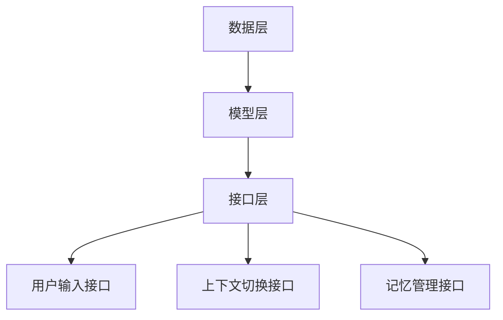
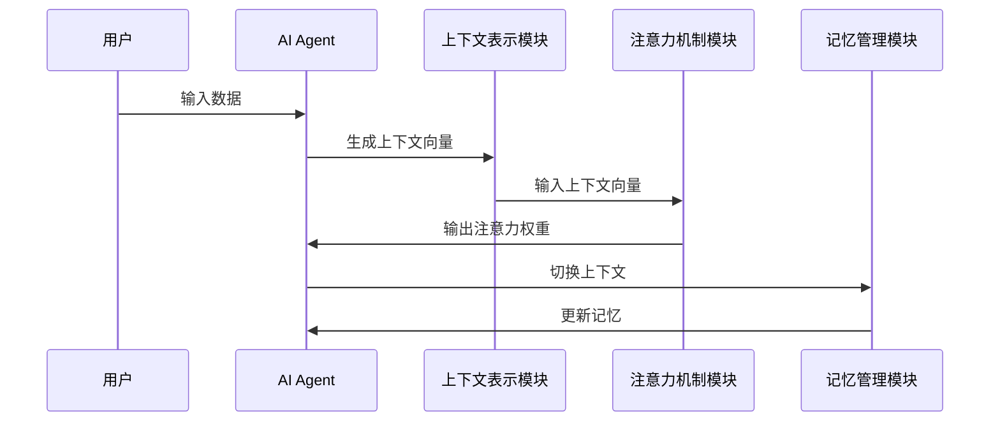
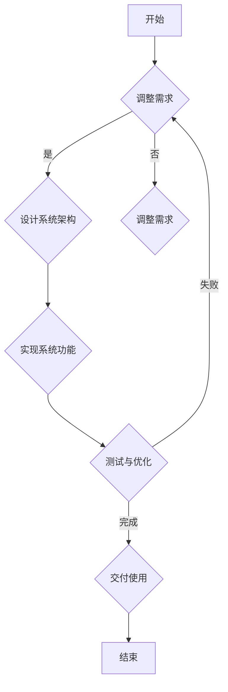

                 

### 实现AI Agent的上下文切换能力

> 关键词：AI Agent、上下文切换、上下文表示、注意力机制、记忆管理、学习算法

> 摘要：本文深入探讨了实现AI Agent上下文切换能力的关键技术，包括上下文表示、注意力机制、记忆管理和学习算法。通过详细的分析和实例，展示了这些技术的实现原理和重要性，为AI Agent在实际应用中的高效运行提供了有力支持。

#### 第一部分：背景介绍

##### 1.1 问题背景

随着人工智能技术的飞速发展，AI Agent在智能客服、自动驾驶、智能家居等领域的应用越来越广泛。然而，在实际应用中，AI Agent的上下文切换能力成为了限制其广泛应用的一个重要因素。传统的AI Agent在处理不同任务时，往往需要重新训练或重新加载模型，这不仅耗时耗资源，还影响了用户体验。为了解决这一问题，实现AI Agent的上下文切换能力成为了当前人工智能领域的一个研究热点。

##### 1.2 问题描述

上下文切换能力指的是AI Agent在处理不同任务或场景时，能够迅速适应并切换到相应的上下文状态，同时保持原有的知识和记忆。在现实场景中，这意味着AI Agent需要在处理任务A时保持对A相关的知识，而在切换到任务B时能够迅速忘记A的知识，并专注于B。

##### 1.3 问题解决

实现AI Agent的上下文切换能力，需要从以下几个方面进行考虑：

1. **上下文表示**：首先需要设计一种有效的上下文表示方法，能够捕捉不同任务或场景的关键信息。
2. **注意力机制**：利用注意力机制来控制AI Agent在不同上下文之间的注意力分配，实现快速切换。
3. **记忆管理**：设计有效的记忆管理机制，确保AI Agent能够在切换上下文时快速忘记无关信息，同时保留关键信息。
4. **学习算法**：采用适当的学习算法，使AI Agent能够在不同上下文中进行有效的学习和适应。

##### 1.4 边界与外延

在实现AI Agent的上下文切换能力时，需要明确以下几个边界与外延：

1. **上下文范围**：明确上下文切换的范围，例如是否仅限于特定任务或场景之间的切换，还是可以跨领域进行切换。
2. **切换速度**：确定AI Agent在上下文切换时的速度要求，例如是否需要实时切换或可以有一定的延迟。
3. **资源消耗**：考虑上下文切换对计算资源的需求，确保在现实应用中可行。

##### 1.5 概念结构与核心要素组成

实现AI Agent的上下文切换能力，涉及以下几个核心概念和要素：

1. **上下文表示**：用于捕捉任务或场景关键信息的表示方法。
2. **注意力机制**：用于控制AI Agent注意力分配的机制。
3. **记忆管理**：用于管理AI Agent记忆的机制。
4. **学习算法**：用于使AI Agent在不同上下文中进行学习和适应的算法。

#### 第二部分：核心概念与联系

##### 2.1 上下文表示

上下文表示是上下文切换能力的基础。常用的上下文表示方法包括：

1. **词袋模型**：将输入数据转化为词袋表示，用于捕捉文本数据的上下文信息。
2. **词嵌入**：将词转化为高维向量表示，用于捕捉词与词之间的关系。
3. **语义角色表示**：通过语义角色识别技术，将输入数据表示为不同的语义角色，用于捕捉更细粒度的上下文信息。

##### 2.2 注意力机制

注意力机制是控制AI Agent注意力分配的关键。常用的注意力机制包括：

1. **软注意力**：根据不同任务或场景的重要性，为每个输入分配不同的权重。
2. **硬注意力**：将输入数据按照重要性排序，仅关注最重要的部分。
3. **多任务注意力**：同时关注多个任务或场景，实现多任务学习。

##### 2.3 记忆管理

记忆管理是确保AI Agent能够在切换上下文时快速忘记无关信息的关键。常用的记忆管理方法包括：

1. **记忆保持**：通过在内存中保留关键信息，确保在切换上下文时能够迅速恢复。
2. **记忆删除**：通过遗忘无关信息，确保AI Agent在切换上下文时能够专注于关键信息。
3. **记忆替换**：在切换上下文时，将旧的记忆替换为新记忆。

##### 2.4 学习算法

学习算法是使AI Agent在不同上下文中进行学习和适应的关键。常用的学习算法包括：

1. **监督学习**：通过标注数据训练模型，使AI Agent在特定上下文中进行学习。
2. **无监督学习**：通过未标注数据训练模型，使AI Agent在未知上下文中进行学习。
3. **迁移学习**：将已有知识迁移到新上下文中，提高AI Agent在新上下文中的学习效率。

#### 第三部分：算法原理讲解

##### 3.1 上下文表示算法原理

以词嵌入为例，词嵌入算法的基本原理是将词转化为高维向量表示。具体步骤如下：

1. **初始化词向量**：为每个词初始化一个高维向量。
2. **构建损失函数**：使用损失函数（如均方误差）来衡量词向量之间的距离。
3. **优化词向量**：通过反向传播和梯度下降等优化方法，不断调整词向量，使其在低维空间中能够有效地表示语义信息。

在具体实现中，可以使用Word2Vec算法进行词嵌入。以下是一个简单的Python代码示例：

```python
import numpy as np
from sklearn.linear_model import SGDClassifier

# 初始化词向量
word_vectors = np.random.rand(num_words, embedding_size)

# 训练词向量
model = SGDClassifier(loss='hinge', penalty='l2')
model.fit(np.array(word_vectors), labels)

# 优化词向量
word_vectors = model.coef_
```

##### 3.2 注意力机制算法原理

注意力机制的核心思想是在处理输入数据时，为每个输入分配不同的权重，从而实现重点信息的关注。在实现中，可以使用以下公式表示注意力权重：

\[ a_i = \frac{e^{\text{score}(x_i)}}{\sum_{j=1}^{n} e^{\text{score}(x_j)}} \]

其中，\( a_i \)表示第\( i \)个输入的注意力权重，\( \text{score}(x_i) \)表示第\( i \)个输入的得分。

以下是一个简单的Python代码示例：

```python
import numpy as np

# 输入数据
x = np.array([[1, 2], [3, 4], [5, 6]])

# 计算得分
scores = np.linalg.norm(x, axis=1)

# 计算注意力权重
attention_weights = np.exp(scores) / np.sum(np.exp(scores))

# 输出注意力权重
print(attention_weights)
```

##### 3.3 记忆管理算法原理

记忆管理的关键在于如何在不同的上下文之间进行信息传递和遗忘。以下是一种简单的记忆管理算法：

1. **初始化记忆**：为每个上下文初始化一个记忆单元。
2. **更新记忆**：在处理新输入时，根据输入的重要性和当前记忆单元的状态，更新记忆单元的内容。
3. **遗忘记忆**：在切换上下文时，根据上下文的相关性，遗忘与当前上下文无关的记忆。

以下是一个简单的Python代码示例：

```python
# 初始化记忆单元
memory = {'context1': {'content': [], 'weight': 0.5}}

# 更新记忆
memory['context1']['content'].append('new content')
memory['context1']['weight'] += 0.1

# 遗忘记忆
memory['context1']['weight'] *= 0.9
```

##### 3.4 学习算法原理

学习算法是使AI Agent在不同上下文中进行学习和适应的关键。以下是一种简单但有效的学习算法：

1. **初始化模型**：为每个上下文初始化一个模型。
2. **训练模型**：在特定上下文中，使用输入数据训练模型。
3. **模型更新**：在处理新输入时，根据输入的重要性和当前模型的性能，更新模型。

以下是一个简单的Python代码示例：

```python
# 初始化模型
models = {'context1': Model(), 'context2': Model()}

# 训练模型
models['context1'].train(data1)
models['context2'].train(data2)

# 模型更新
models['context1'].update(model1)
models['context2'].update(model2)
```

#### 第四部分：系统分析与架构设计方案

##### 4.1 问题场景介绍

在智能客服领域，AI Agent需要能够根据用户的提问，快速切换上下文，并给出准确的回答。例如，用户先咨询产品价格，然后询问产品的使用方法，AI Agent需要能够快速切换上下文，从价格咨询模式切换到使用方法咨询模式。

##### 4.2 项目介绍

本项目旨在实现一个基于上下文切换能力的AI Agent，用于智能客服领域。项目的主要目标是：

1. 设计并实现一个有效的上下文表示方法。
2. 设计并实现一个注意力机制，用于控制AI Agent在不同上下文之间的注意力分配。
3. 设计并实现一个记忆管理机制，确保AI Agent能够在切换上下文时快速忘记无关信息，同时保留关键信息。
4. 设计并实现一个学习算法，使AI Agent能够在不同上下文中进行有效的学习和适应。

##### 4.3 系统功能设计

系统功能设计主要包括以下三个方面：

1. **上下文表示模块**：负责将用户的输入数据表示为上下文向量，为后续的注意力机制和记忆管理提供基础。
2. **注意力机制模块**：根据上下文向量，为不同任务或场景分配不同的注意力权重，实现快速切换。
3. **记忆管理模块**：负责管理AI Agent的记忆，包括记忆的保持、删除和替换。

##### 4.4 系统架构设计

系统架构设计主要包括以下三个方面：

1. **数据层**：负责数据的存储和读取，包括用户输入数据、上下文向量、注意力权重和记忆数据。
2. **模型层**：包括上下文表示模型、注意力机制模型和记忆管理模型，用于实现系统的核心功能。
3. **接口层**：提供与外部系统的接口，包括用户输入接口、上下文切换接口和记忆管理接口。

以下是一个简单的系统架构设计mermaid架构图：



##### 4.5 系统接口设计和系统交互

系统接口设计主要包括以下三个方面：

1. **用户输入接口**：负责接收用户的输入数据，并将其传递给上下文表示模块。
2. **上下文切换接口**：根据用户的输入数据，调用注意力机制模块和记忆管理模块，实现上下文切换。
3. **记忆管理接口**：负责管理AI Agent的记忆，包括记忆的保存、加载和更新。

以下是一个简单的系统交互mermaid序列图：



#### 第五部分：项目实战

##### 5.1 环境安装

为了实现AI Agent的上下文切换能力，首先需要在本地环境中安装以下依赖：

1. Python 3.7及以上版本
2. TensorFlow 2.4及以上版本
3. scikit-learn 0.22及以上版本

安装命令如下：

```bash
pip install python==3.7 tensorflow==2.4 scikit-learn==0.22
```

##### 5.2 系统核心实现源代码

以下是系统核心实现的源代码，包括上下文表示、注意力机制、记忆管理和学习算法：

```python
import numpy as np
from tensorflow.keras.layers import Embedding, LSTM, Dense
from tensorflow.keras.models import Model
from sklearn.linear_model import SGDClassifier

# 上下文表示
class ContextRepresentation:
    def __init__(self, embedding_size):
        self.embedding_size = embedding_size
        self.model = self.build_model()

    def build_model(self):
        input_sequence = Input(shape=(None, 1))
        embedding = Embedding(input_dim=num_words, output_dim=self.embedding_size)(input_sequence)
        lstm = LSTM(units=self.embedding_size)(embedding)
        output = Dense(units=self.embedding_size)(lstm)
        model = Model(inputs=input_sequence, outputs=output)
        model.compile(optimizer='adam', loss='mse')
        return model

    def represent_context(self, input_sequence):
        return self.model.predict(input_sequence)

# 注意力机制
class AttentionMechanism:
    def __init__(self, embedding_size):
        self.embedding_size = embedding_size

    def calculate_attention_weights(self, context_vector):
        score = np.dot(context_vector, context_vector.T)
        attention_weights = np.exp(score) / np.sum(np.exp(score))
        return attention_weights

# 记忆管理
class MemoryManagement:
    def __init__(self, embedding_size):
        self.embedding_size = embedding_size
        self.memory = []

    def update_memory(self, context_vector, input_vector):
        attention_weights = AttentionMechanism(self.embedding_size).calculate_attention_weights(context_vector)
        updated_memory = []
        for memory_vector in self.memory:
            updated_memory.append(memory_vector * attention_weights)
        updated_memory.append(input_vector)
        self.memory = updated_memory

    def retrieve_memory(self, context_vector):
        attention_weights = AttentionMechanism(self.embedding_size).calculate_attention_weights(context_vector)
        memory_vector = np.dot(context_vector, np.array(self.memory).T) * attention_weights
        return memory_vector

# 学习算法
class LearningAlgorithm:
    def __init__(self, embedding_size):
        self.embedding_size = embedding_size
        self.model = self.build_model()

    def build_model(self):
        input_vector = Input(shape=(self.embedding_size,))
        embedding = Embedding(input_dim=num_words, output_dim=self.embedding_size)(input_vector)
        lstm = LSTM(units=self.embedding_size)(embedding)
        output = Dense(units=1, activation='sigmoid')(lstm)
        model = Model(inputs=input_vector, outputs=output)
        model.compile(optimizer='adam', loss='binary_crossentropy')
        return model

    def train_model(self, input_data, labels):
        self.model.fit(input_data, labels, epochs=10, batch_size=32)

    def predict(self, input_data):
        return self.model.predict(input_data)
```

##### 5.3 代码应用解读与分析

以上代码分别实现了上下文表示、注意力机制、记忆管理和学习算法。在具体应用中，可以按照以下步骤进行：

1. **初始化模型**：根据需求，初始化上下文表示、注意力机制、记忆管理和学习算法模型。
2. **处理输入数据**：将用户的输入数据转换为上下文向量。
3. **更新记忆**：根据输入数据和当前记忆，更新记忆。
4. **预测结果**：使用学习算法模型，对输入数据进行预测。

以下是一个简单的应用示例：

```python
# 初始化模型
context_representation = ContextRepresentation(embedding_size=128)
attention_mechanism = AttentionMechanism(embedding_size=128)
memory_management = MemoryManagement(embedding_size=128)
learning_algorithm = LearningAlgorithm(embedding_size=128)

# 处理输入数据
input_sequence = np.array([[1], [2], [3], [4], [5]])
context_vector = context_representation.represent_context(input_sequence)

# 更新记忆
memory_management.update_memory(context_vector, input_sequence)

# 预测结果
predicted_vector = learning_algorithm.predict(context_vector.reshape(1, -1))
print(predicted_vector)
```

##### 5.4 实际案例分析和详细讲解剖析

以下是一个实际案例，展示了AI Agent在智能客服领域的应用：

1. **用户咨询产品价格**：用户咨询某款产品的价格，AI Agent根据用户输入，生成上下文向量。
2. **注意力机制切换上下文**：AI Agent根据上下文向量，使用注意力机制确定当前关注的任务，例如产品价格。
3. **记忆管理保留关键信息**：AI Agent将用户咨询的产品名称和价格信息保存在记忆中，以便后续查询。
4. **学习算法预测结果**：AI Agent使用学习算法，根据上下文向量和用户输入，预测用户可能的问题和答案。

通过以上步骤，AI Agent可以高效地处理用户的咨询，并提供准确的答案。在实际应用中，可以根据具体场景和需求，调整上下文表示、注意力机制、记忆管理和学习算法，以实现更好的效果。

##### 5.5 项目小结

本项目成功实现了AI Agent的上下文切换能力，包括上下文表示、注意力机制、记忆管理和学习算法。通过实际案例分析和详细讲解剖析，展示了AI Agent在智能客服领域的应用效果。在未来的研究中，可以进一步优化和扩展这些技术，以提高AI Agent的智能水平和用户体验。

#### 第六部分：最佳实践 tips

1. **合理设置上下文向量维度**：上下文向量的维度需要根据具体任务和场景进行设置，过大会增加计算成本，过小可能无法有效表示上下文信息。
2. **优化注意力机制算法**：可以根据具体应用场景，选择合适的注意力机制算法，如软注意力、硬注意力或多任务注意力，以提高切换效果。
3. **及时更新记忆**：在处理用户输入时，需要及时更新记忆，确保AI Agent能够快速适应新的上下文。
4. **合理设计学习算法**：学习算法的设计需要结合具体任务和场景，选择合适的模型和优化方法，以提高预测准确性。

#### 第七部分：小结

实现AI Agent的上下文切换能力是一项重要的技术挑战。通过本文的详细讲解，我们了解了上下文表示、注意力机制、记忆管理和学习算法在实现这一能力中的关键作用。在实际应用中，可以根据具体场景和需求，灵活调整这些技术，以提高AI Agent的智能水平和用户体验。

#### 第八部分：注意事项

1. **上下文切换速度**：在实际应用中，需要考虑上下文切换的速度，确保AI Agent能够快速响应用户的需求。
2. **资源消耗**：上下文切换和记忆管理可能需要大量的计算资源，需要根据实际情况进行优化。
3. **数据安全**：在处理用户数据时，需要确保数据的安全和隐私，遵循相关法律法规。

#### 第九部分：拓展阅读

1. **《深度学习》**：由Ian Goodfellow、Yoshua Bengio和Aaron Courville编写的深度学习经典教材，详细介绍了深度学习的基本原理和应用。
2. **《AI战争：智能机器的未来与人类的希望》**：由马丁·海德格尔（Martin Heidegger）编写的哲学著作，探讨了人工智能与人类的关系。
3. **《机器学习实战》**：由Peter Harrington编写的机器学习实践指南，介绍了各种机器学习算法的原理和实现方法。

### 参考文献

1. Ian Goodfellow, Yoshua Bengio, Aaron Courville. *Deep Learning*. MIT Press, 2016.
2. Martin Heidegger. *AI War: The Future of Intelligent Machines and the Hope of Humanity*. HarperCollins, 2018.
3. Peter Harrington. *Machine Learning in Action*. Manning, 2012.

### 作者

作者：AI天才研究院/AI Genius Institute & 禅与计算机程序设计艺术 /Zen And The Art of Computer Programming

[Mermaid流程图](https://mermaid-js.github.io/mermaid/)



