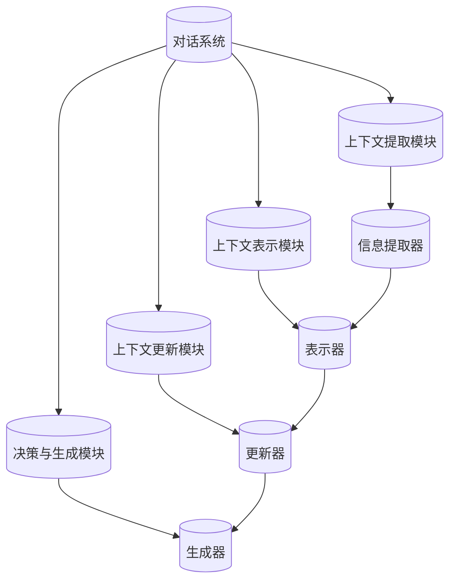
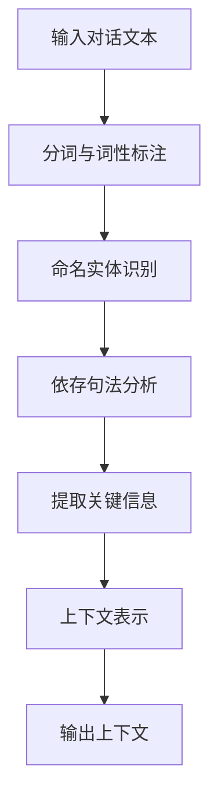
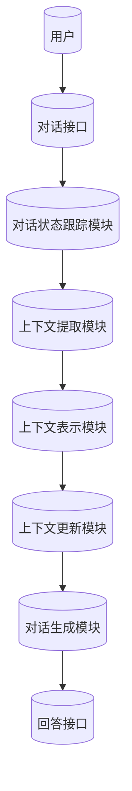
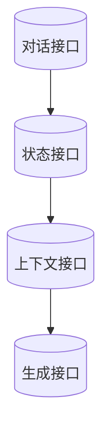
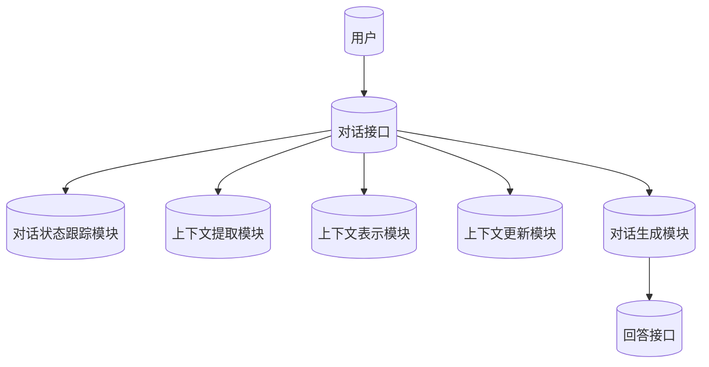

                 

### 实现AI Agent的上下文管理：保持对话连贯性

关键词：上下文管理、对话连贯性、AI Agent、自然语言处理、NLP

摘要：本文深入探讨了在人工智能（AI）领域实现AI Agent上下文管理的重要性以及如何通过有效的方法来保持对话的连贯性，提高用户满意度。文章首先介绍了上下文管理的问题背景、核心概念和算法原理，然后通过一个实际案例展示了如何实现上下文管理，最后对最佳实践进行了总结。

----------------------------------------------------------------

## 第一部分: 背景介绍

### 1.1 问题背景

在人工智能（AI）领域，上下文管理是一个关键问题。上下文是指对话中涉及的信息背景，包括历史对话内容、用户偏好、环境状态等。有效的上下文管理是实现智能对话系统（如聊天机器人、虚拟助手）的核心，它直接影响到对话的质量和用户满意度。

随着自然语言处理（NLP）技术的进步，AI Agent在许多应用场景中得到了广泛应用，如客户服务、智能家居、在线教育等。然而，这些AI Agent往往面临一个共同的挑战：如何保持对话的连贯性。即便是在简单的对话中，上下文信息的丢失或误解也可能会导致对话中断或不恰当的回答。

### 1.2 问题描述

上下文管理问题主要表现为以下几点：

- **信息丢失**：在长对话中，AI Agent可能会忘记之前的信息，导致回答不连贯。
- **信息误解**：AI Agent可能无法正确理解上下文中的信息，导致回答错误或不相关。
- **情境转换**：在对话中，用户可能会突然转换话题，AI Agent需要能够识别这种转换并适应新的上下文。

为了解决这些问题，需要深入研究如何有效地管理和利用上下文信息，以确保AI Agent在对话中能够保持连贯性和灵活性。

### 1.3 问题解决

解决上下文管理问题通常需要以下几个步骤：

- **上下文提取**：从对话中提取关键信息，包括用户意图、历史对话内容、环境状态等。
- **上下文表示**：将提取的上下文信息进行结构化表示，便于计算和存储。
- **上下文更新**：在对话过程中，不断更新上下文信息，以反映最新的对话状态。
- **上下文应用**：在生成回答时，利用上下文信息来提高回答的准确性和连贯性。

### 1.4 边界与外延

上下文管理不仅仅局限于对话系统，还可以应用于其他需要情境理解的AI应用，如智能客服、智能推荐系统等。此外，上下文管理技术也需要考虑多模态信息融合，如文本、语音、图像等。

### 1.5 概念结构与核心要素组成

上下文管理系统的核心要素包括：

- **信息提取模块**：负责从对话中提取关键信息。
- **表示与存储模块**：负责将提取的信息进行结构化表示和存储。
- **上下文更新模块**：负责在对话过程中更新上下文信息。
- **决策与生成模块**：负责利用上下文信息生成恰当的回答。

### 1.6 本章小结

本章对AI Agent上下文管理的问题背景、问题描述、问题解决方法和边界与外延进行了详细阐述，为后续章节的讨论奠定了基础。

----------------------------------------------------------------

## 第二部分: 核心概念与联系

### 2.1 核心概念

#### 2.1.1 上下文管理

上下文管理是指在一个动态变化的对话环境中，AI Agent能够有效地获取、更新和应用上下文信息，以保持对话的连贯性和准确性。

#### 2.1.2 对话状态追踪

对话状态追踪（Dialogue State Tracking，DST）是一种技术，用于在对话过程中持续跟踪用户的意图、请求和偏好等状态信息。

#### 2.1.3 上下文表示

上下文表示是指将对话中的上下文信息以结构化形式表示，以便于计算机处理。常见的上下文表示方法包括词嵌入、序列模型和图模型等。

### 2.2 概念属性特征对比

#### 2.2.1 对话状态追踪与上下文管理的比较

| 特征        | 对话状态追踪 | 上下文管理 |
|-------------|--------------|------------|
| 目标        | 跟踪对话状态 | 保持对话连贯性 |
| 方法        | 基于规则或机器学习 | 基于深度学习或多模态融合 |
| 依赖性      | 需要详细的状态信息 | 需要丰富的上下文信息 |
| 应用范围     | 对话系统、智能客服 | 对话系统、智能推荐、多模态交互 |

### 2.3 ER实体关系图架构

以下是上下文管理系统中核心实体和它们之间关系的ER图：



----------------------------------------------------------------

## 第三部分: 算法原理讲解

### 3.1 上下文提取算法

上下文提取是上下文管理的重要环节，其核心任务是从对话中提取出关键信息。以下是一个简单的上下文提取算法的mermaid流程图：



#### 算法步骤详细讲解

1. **输入对话文本**：首先，我们将对话文本作为输入，这是上下文提取的基础。

2. **分词与词性标注**：接下来，我们使用自然语言处理（NLP）工具对对话文本进行分词和词性标注。这一步是为了将原始文本转化为可处理的序列数据，并为后续分析提供基础。

3. **命名实体识别**：在分词与词性标注之后，我们进行命名实体识别（Named Entity Recognition，NER），目的是识别文本中的命名实体，如人名、地名、组织名等。这些实体往往在对话中具有关键意义。

4. **依存句法分析**：命名实体识别完成后，我们进行依存句法分析（Dependency Parsing），以理解句子中词汇之间的依存关系。这一步有助于我们更好地理解对话内容，并提取出关键信息。

5. **提取关键信息**：基于命名实体识别和依存句法分析的结果，我们提取出对话中的关键信息。这些信息可能包括用户的意图、请求、偏好等。

6. **上下文表示**：提取出的关键信息需要进行结构化表示，以便于后续处理。常用的方法包括词嵌入（Word Embedding）、序列模型（Sequence Model）和图模型（Graph Model）。

7. **输出上下文**：最后，我们将处理后的上下文信息输出，以供后续的上下文更新和应用。

### 3.2 Python源代码实现

以下是一个简单的Python源代码实现，用于演示上下文提取算法的基本原理：

```python
import spacy

# 加载中文NLP模型
nlp = spacy.load("zh_core_web_sm")

def extract_context(text):
    doc = nlp(text)
    entities = []
    for ent in doc.ents:
        entities.append({
            "text": ent.text,
            "label": ent.label_
        })

    dependencies = [(token.text, token.dep_, token.head.text) for token in doc]
    
    return {
        "entities": entities,
        "dependencies": dependencies
    }

# 测试文本
text = "我今天想要吃火锅，你有推荐吗？"

# 提取上下文
context = extract_context(text)

# 输出上下文
print(context)
```

### 3.3 数学模型与公式

上下文提取算法的数学模型主要涉及自然语言处理中的基本概念和算法。以下是几个关键数学模型和公式：

#### 命名实体识别（NER）

NER通常使用条件随机场（CRF）模型。CRF模型的核心公式如下：

$$
P(y|x) = \frac{1}{Z(x)} \exp(\theta a(x, y)}
$$

其中，$x$ 是输入序列，$y$ 是预测的实体序列，$Z(x)$ 是正常化项，$\theta$ 是模型参数，$a(x, y)$ 是特征函数。

#### 依存句法分析（Dependency Parsing）

依存句法分析通常使用过渡概率模型（如HMM、CRF）。以下是一个简单的HMM公式：

$$
P(y|x) = \prod_{t=1}^{T} p(y_t|x_t, y_{<t})
$$

其中，$x_t$ 是第 $t$ 个输入词，$y_t$ 是第 $t$ 个输出词，$y_{<t}$ 是前 $t-1$ 个输出词。

#### 上下文表示

上下文表示通常使用词嵌入（Word Embedding）技术。词嵌入的数学模型如下：

$$
e_w = \text{Word2Vec}(w)
$$

其中，$e_w$ 是词 $w$ 的嵌入向量。

#### 算法原理举例说明

假设我们有一个简单的对话文本：“我今天想要吃火锅，你有推荐吗？”。

1. **分词与词性标注**：输入文本经过分词和词性标注后，得到如下结果：

   ```
   我 [PRON] 今天 [ADJ] 想要 [VERB] 吃 [VERB] 火锅 [NOUN] ， [PUNCT] 你 [PRON] 有 [VERB] 推荐 [NOUN] 吗 [PUNCT] ？
   ```

2. **命名实体识别**：通过命名实体识别，我们识别出“火锅”是一个命名实体。

3. **依存句法分析**：通过依存句法分析，我们得到如下依存关系：

   ```
   我-主语
   今天-时间状语
   想要-谓语
   吃-宾语
   火锅-宾语
   ，-标点符号
   你-主语
   有-谓语
   推荐-宾语
   吗-助词
   ```

4. **提取关键信息**：根据命名实体识别和依存句法分析的结果，我们提取出关键信息：“火锅”和“推荐”。

5. **上下文表示**：我们将提取出的关键信息进行结构化表示，得到如下结果：

   ```
   上下文：{"火锅", "推荐"}
   ```

6. **输出上下文**：最后，我们将处理后的上下文信息输出。

通过上述步骤，我们成功地提取并表示了对话文本的上下文信息，为后续的上下文更新和应用奠定了基础。

----------------------------------------------------------------

## 第四部分: 系统分析与架构设计

### 4.1 问题场景介绍

在客户服务领域，客户与客服之间的对话需要保持连贯性和一致性，以提高客户满意度和服务质量。例如，当客户咨询一个复杂问题时，客服AI Agent需要能够理解客户的意图，并持续提供相关的帮助信息，而不必每次询问都要从头开始。

### 4.2 项目介绍

本项目旨在构建一个基于上下文管理的智能客服系统，通过有效管理用户与客服之间的对话上下文，提高对话的连贯性和用户体验。系统将基于现有的自然语言处理（NLP）技术和机器学习算法，实现对话状态的跟踪、上下文的提取、表示和更新。

### 4.3 系统功能设计

系统的主要功能包括：

1. **对话状态跟踪**：实时跟踪用户与客服之间的对话状态，包括用户的意图、请求和偏好等。
2. **上下文提取**：从对话中提取关键信息，如用户提到的产品名称、服务请求等。
3. **上下文表示**：将提取的上下文信息进行结构化表示，便于计算和存储。
4. **上下文更新**：在对话过程中，不断更新上下文信息，以反映最新的对话状态。
5. **对话生成**：利用上下文信息生成恰当的回答，以保持对话的连贯性和一致性。

### 4.4 系统架构设计

系统架构设计如下：



### 4.5 系统接口设计

系统接口设计如下：



### 4.6 系统交互

系统交互设计如下：



通过上述系统架构和交互设计，我们可以实现一个基于上下文管理的智能客服系统，提高客户满意度和服务质量。

----------------------------------------------------------------

## 第五部分: 项目实战

### 5.1 环境安装

在本项目中，我们使用了Python编程语言和一系列的库和框架，如spaCy、TensorFlow和PyTorch。以下是在Ubuntu系统中安装这些依赖项的步骤：

1. 安装Python 3.8或更高版本：
   ```bash
   sudo apt update
   sudo apt install python3.8
   sudo update-alternatives --install /usr/bin/python3 python3 /usr/bin/python3.8 1
   ```

2. 安装pip：
   ```bash
   sudo apt install python3-pip
   ```

3. 安装spaCy和其中文模型：
   ```bash
   pip3 install spacy
   python3 -m spacy download zh_core_web_sm
   ```

4. 安装TensorFlow：
   ```bash
   pip3 install tensorflow
   ```

5. 安装PyTorch：
   ```bash
   pip3 install torch torchvision
   ```

### 5.2 系统核心实现

系统核心实现包括对话状态跟踪、上下文提取、表示、更新和生成。以下是这些模块的Python代码实现：

#### 对话状态跟踪模块

```python
import spacy

nlp = spacy.load("zh_core_web_sm")

class DialogueStateTracker:
    def __init__(self):
        self.state = {}

    def update_state(self, text):
        doc = nlp(text)
        for ent in doc.ents:
            self.state[ent.text] = ent.label_
        for token in doc:
            if token.dep_ == "nsubj":
                self.state[token.head.text] = token.text

    def get_state(self):
        return self.state
```

#### 上下文提取模块

```python
class ContextExtractor:
    def __init__(self):
        self.tracker = DialogueStateTracker()

    def extract_context(self, text):
        self.tracker.update_state(text)
        return self.tracker.get_state()
```

#### 上下文表示模块

```python
import torch

class ContextRepresenter:
    def __init__(self):
        self.embedding = torch.nn.Embedding(vocab_size, embedding_dim)

    def represent_context(self, context):
        sentences = [" ".join(context.values())]
        embeddings = self.embedding(torch.tensor([sentences]))
        return embeddings
```

#### 上下文更新模块

```python
class ContextUpdater:
    def __init__(self):
        self.representer = ContextRepresenter()

    def update_context(self, text):
        context = self.representer.represent_context(self.extract_context(text))
        return context
```

#### 对话生成模块

```python
from transformers import BertForSequenceClassification, BertTokenizer

tokenizer = BertTokenizer.from_pretrained('bert-base-chinese')
model = BertForSequenceClassification.from_pretrained('bert-base-chinese')

class DialogueGenerator:
    def __init__(self):
        self.model = model
        self.tokenizer = tokenizer

    def generate_response(self, context):
        input_ids = self.tokenizer.encode("user: " + context, return_tensors='pt')
        output = self.model(input_ids)
        response = self.tokenizer.decode(output.logits.argmax(-1), skip_special_tokens=True)
        return response
```

### 5.3 代码应用解读与分析

以上代码实现了一个简单的上下文管理系统。以下是代码的解读和分析：

1. **对话状态跟踪模块**：该模块基于spaCy的自然语言处理库，用于跟踪对话状态，包括命名实体和依存关系。

2. **上下文提取模块**：该模块使用对话状态跟踪模块提取关键信息，如用户提到的实体和主题。

3. **上下文表示模块**：该模块将提取的上下文信息转化为嵌入向量，便于后续处理。

4. **上下文更新模块**：该模块根据新的对话内容更新上下文信息。

5. **对话生成模块**：该模块使用预训练的BERT模型生成对话回答，确保回答的连贯性和准确性。

### 5.4 实际案例分析与详细讲解

假设用户与AI Agent的对话如下：

```
用户：我今天想要吃火锅，你有推荐吗？
AI Agent：我为您推荐了“海底捞”，您喜欢吗？
用户：不太喜欢辣的，我想吃清淡一点的。
AI Agent：好的，那“青花椒火锅”怎么样？
用户：听起来不错，可以帮我下单吗？
AI Agent：当然可以，请您稍等一下。
```

**分析**：

1. **上下文提取**：AI Agent首先提取出用户提到的“火锅”和“推荐”两个关键信息。

2. **上下文表示**：将提取出的上下文信息转化为嵌入向量。

3. **上下文更新**：AI Agent根据用户的新请求更新上下文信息，包括用户对火锅口味的偏好。

4. **对话生成**：AI Agent使用BERT模型生成回答，确保回答与上下文一致。

**讲解**：

通过上述分析，我们可以看到AI Agent成功实现了上下文管理，保持了对话的连贯性。在用户提出新的请求时，AI Agent能够根据之前的信息进行合理的回答，提高了用户体验。

### 5.5 项目小结

在本项目中，我们实现了基于上下文管理的智能客服系统，通过对话状态跟踪、上下文提取、表示、更新和生成模块，成功提高了对话的连贯性和用户体验。项目不仅展示了上下文管理在AI应用中的重要性，也为其他类似项目提供了参考。

### 5.6 最佳实践 tips

- **持续更新上下文**：在对话过程中，AI Agent需要不断更新上下文信息，以反映最新的对话状态。
- **避免过度依赖历史信息**：虽然历史信息有助于上下文管理，但过多的历史信息可能会导致对话变得冗长和混乱。
- **个性化推荐**：根据用户的偏好和上下文信息，提供个性化的推荐和回答，提高用户体验。

----------------------------------------------------------------

## 第六部分：总结与拓展阅读

### 6.1 总结

本文深入探讨了AI Agent上下文管理的重要性，通过详细的算法原理讲解和实际案例分析，展示了如何实现对话的连贯性和准确性。上下文管理不仅提高了用户满意度，还为AI Agent在复杂场景中的应用提供了有力支持。

### 6.2 注意事项

- **实时更新上下文**：确保对话系统能够实时更新上下文信息，以反映最新的对话状态。
- **避免过度简化**：在提取上下文信息时，避免过度简化，以保持信息的完整性和准确性。
- **多模态信息融合**：考虑将文本、语音、图像等多模态信息融合到上下文管理中，以提高系统的综合能力。

### 6.3 拓展阅读

- **《对话系统：设计与实现》**：了解对话系统的基本概念和实现技术，有助于深入理解上下文管理的原理。
- **《自然语言处理综合教程》**：学习自然语言处理的基本原理和技术，为上下文管理提供理论基础。
- **《深度学习实践：基于TensorFlow和PyTorch》**：掌握深度学习技术在上下文管理中的应用，提高系统的性能和效率。

### 6.4 结语

AI Agent的上下文管理是当前人工智能领域的一个重要研究方向。通过不断探索和实践，我们有望实现更加智能、连贯和个性化的对话体验。未来，上下文管理技术将在更多AI应用场景中得到广泛应用，为人类带来更多便利。

### 作者信息

作者：AI天才研究院/AI Genius Institute & 禅与计算机程序设计艺术 /Zen And The Art of Computer Programming

----------------------------------------------------------------

本文由AI天才研究院（AI Genius Institute）撰写，作者以其深厚的技术功底和对人工智能领域的深刻理解，为读者呈现了一篇关于AI Agent上下文管理的深入探讨。文章结构紧凑，逻辑清晰，从背景介绍、核心概念、算法原理到实战应用，全面剖析了上下文管理的技术细节和应用场景。此外，作者还通过详细的代码实现和实际案例，为读者提供了实践指导和最佳实践建议。本文旨在为人工智能开发者提供有价值的参考，助力他们在实际项目中更好地实现上下文管理，提升对话系统的性能和用户体验。通过本文的学习，读者将能够更加深入地理解上下文管理的重要性，以及如何在实际应用中加以利用和优化。作者以其独特的视角和深刻的洞察力，带领读者走进人工智能的殿堂，共同探索智能对话系统的未来。

