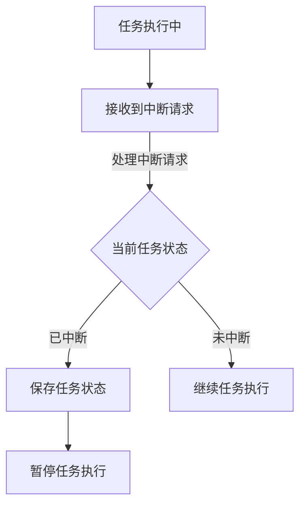
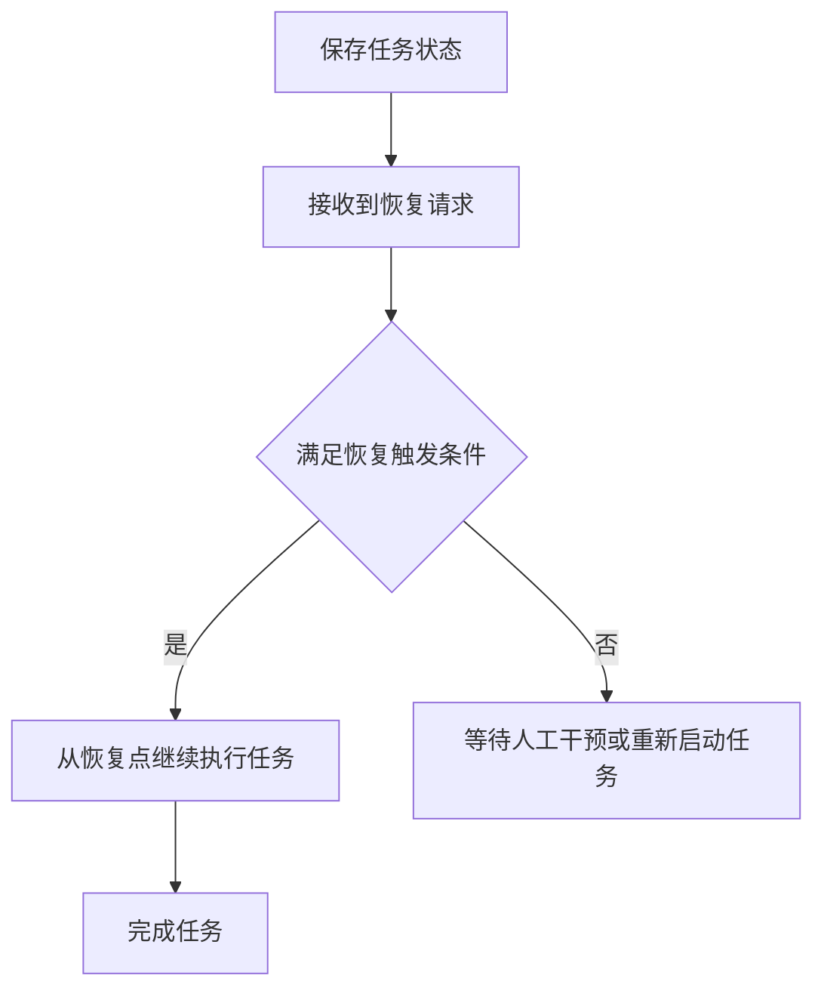
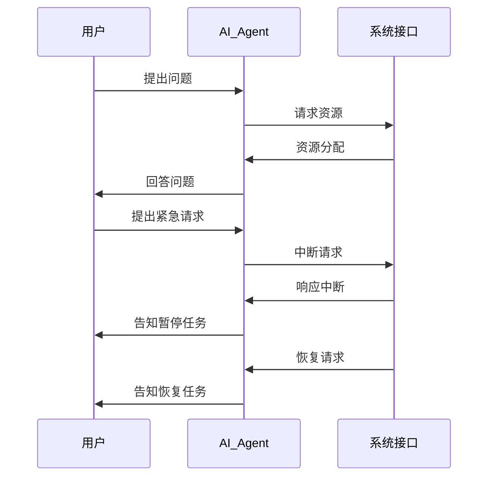

                 


## 实现AI Agent的任务中断与恢复功能

在当今的智能系统与自动化领域，AI Agent（智能代理）已经成为了提高效率、优化决策的重要工具。AI Agent可以理解为一类具备智能行为的软件实体，能够在复杂的、不确定的环境中自主执行任务，并与其他系统进行交互。然而，在执行任务的过程中，AI Agent可能会面临各种中断情况，例如系统故障、资源不足或其他优先级更高的任务介入。因此，实现AI Agent的任务中断与恢复功能，对于保持系统的稳定性和可靠性至关重要。

### 背景介绍

#### AI Agent的定义

AI Agent是一种具有感知、决策和行动能力的软件实体。它基于人工智能技术，可以自主地理解环境、作出决策并采取行动。AI Agent可以应用于各种场景，如智能客服、自动驾驶、智能推荐系统等。

#### 问题背景

随着AI Agent的应用越来越广泛，它们在执行任务时可能会遇到各种中断情况，如任务执行过程中突发的系统故障、资源耗尽或紧急任务的介入。这些中断可能导致AI Agent无法完成任务或陷入无法恢复的状态。因此，设计一套有效的任务中断与恢复机制，对于保证AI Agent的稳定运行具有重要意义。

#### 问题描述

任务中断：在AI Agent执行任务时，如何实现任务的中断功能，确保AI Agent在接收到中断请求后能够及时停止当前任务。

任务恢复：在AI Agent被中断后，如何实现任务的恢复功能，使得AI Agent能够从中断点继续执行任务。

#### 问题解决

通过设计一套任务中断与恢复机制，可以实现AI Agent在任务执行过程中的可靠性与稳定性。该机制需要涵盖以下几个方面：

1. **任务中断机制**：定义AI Agent如何接收中断请求，并在接收到中断请求后如何停止当前任务。
2. **任务恢复机制**：定义AI Agent如何从中断点恢复任务执行，确保中断前的任务能够继续完成。

#### 边界与外延

边界：AI Agent的任务中断与恢复功能主要应用于执行周期性任务或长时间运行任务的场景。

外延：AI Agent的任务中断与恢复功能不仅适用于AI Agent自身，还可以扩展到其他智能实体或系统的任务管理。

#### 概念结构与核心要素组成

概念结构：

- **AI Agent**：智能代理，负责执行任务。
- **任务管理模块**：负责管理AI Agent的任务，包括任务的创建、执行、中断和恢复。
- **中断请求**：来自系统或其他实体的中断请求，指示AI Agent停止当前任务。
- **恢复点**：AI Agent在任务中断时的当前状态，用于在恢复时继续执行任务。

核心要素组成：

- **任务状态**：记录任务的中断与恢复状态。
- **中断监听器**：监听中断请求，并通知任务管理模块。
- **恢复机制**：根据恢复点继续执行中断前的任务。

### 核心概念与联系

#### 中断的概念

中断是指AI Agent在执行任务过程中，因外部请求或内部故障而被迫停止当前任务的行为。中断可以分为以下几类：

1. **外部中断**：由系统或其他外部实体发起的中断请求，如用户请求、系统故障等。
2. **内部中断**：由AI Agent内部逻辑判断引发的中断，如资源耗尽、任务优先级提升等。

#### 恢复的概念

恢复是指AI Agent在接收到中断请求后，从中断点继续执行任务的过程。恢复可以分为以下几类：

1. **自动恢复**：AI Agent在接收到中断请求后，自动从恢复点继续执行任务。
2. **手动恢复**：需要人工干预，AI Agent在接收到中断请求后，暂停任务执行，等待人工处理后再继续执行。

#### 中断与恢复的关联

中断与恢复是任务管理中两个重要的环节，它们相互关联、相互影响。具体关联如下：

- **中断导致恢复**：当AI Agent接收到中断请求时，会触发恢复机制，从恢复点继续执行任务。
- **恢复依赖中断**：恢复机制需要依赖中断请求和中断点信息，以确保AI Agent能够从正确的位置继续执行任务。

### ER实体关系图架构

```mermaid
erDiagram
AI_Agent ||--|{ Task_Management_Module } Task_Management_Module
AI_Agent ||--|{ Interrupt_Request } Interrupt_Request
AI_Agent ||--|{ Recovery_Point } Recovery_Point
```

在这个ER实体关系图中，AI_Agent作为中心实体，与Task_Management_Module、Interrupt_Request和Recovery_Point存在关系。Task_Management_Module负责管理AI_Agent的任务，Interrupt_Request负责传递中断请求，Recovery_Point负责记录AI_Agent的中断点。

### 实现方法

#### 任务中断的实现

1. **任务状态管理**：AI Agent在执行任务时，需要记录当前任务的状态，包括执行中、已中断、已恢复等状态。
2. **中断监听器**：在AI Agent的任务管理模块中，添加中断监听器，负责接收并处理中断请求。
3. **中断处理逻辑**：当接收到中断请求时，AI Agent会根据当前任务状态执行不同的中断处理逻辑，如暂停任务执行、保存当前状态等。

#### 任务恢复的实现

1. **恢复点管理**：AI Agent在执行任务时，需要记录关键状态信息，作为恢复点的依据。
2. **恢复触发条件**：在AI Agent的任务管理模块中，设置恢复触发条件，如接收到恢复请求、任务状态满足恢复条件等。
3. **恢复处理逻辑**：当满足恢复触发条件时，AI Agent会根据恢复点信息，从中断点继续执行任务。

### 算法原理讲解

#### 中断请求处理算法



在上述算法中，当AI Agent接收到中断请求后，会根据当前任务状态判断是否处理中断请求。如果任务状态为已中断，则保存任务状态并暂停任务执行；如果任务状态为未中断，则继续执行任务。

#### 任务恢复算法



在上述算法中，当AI Agent接收到恢复请求后，会判断是否满足恢复触发条件。如果满足恢复触发条件，则从恢复点继续执行任务；如果不满足恢复触发条件，则需要等待人工干预或重新启动任务。

#### 数学模型和公式

假设AI Agent在执行任务时，存在以下状态变量：

- $S_t$：任务在时间$t$的状态
- $I_t$：任务在时间$t$的中断信号
- $R_t$：任务在时间$t$的恢复信号

任务中断与恢复的数学模型可以表示为：

$$
S_t = \begin{cases}
S_{t-1}, & \text{if } I_t = 0 \\
S_{\text{save}}, & \text{if } I_t = 1
\end{cases}
$$

$$
S_t = \begin{cases}
S_{\text{resume}}, & \text{if } R_t = 1 \\
S_t, & \text{if } R_t = 0
\end{cases}
$$

其中，$S_{t-1}$表示时间$t-1$的任务状态，$S_{\text{save}}$表示中断时的任务状态，$S_{\text{resume}}$表示恢复时的任务状态。

#### 举例说明

假设AI Agent在执行任务时，遇到以下情况：

- 时间$t=1$，任务状态为执行中
- 时间$t=2$，接收到中断请求，中断信号$I_t=1$
- 时间$t=3$，保存任务状态$S_t=S_{\text{save}}$
- 时间$t=4$，接收到恢复请求，恢复信号$R_t=1$

根据中断与恢复的数学模型，可以计算出以下结果：

- 时间$t=1$，任务状态为执行中，$S_t=S_{t-1}$
- 时间$t=2$，接收到中断请求，中断信号$I_t=1$，保存任务状态$S_t=S_{\text{save}}$
- 时间$t=3$，根据保存的任务状态$S_t=S_{\text{save}}$，继续执行任务
- 时间$t=4$，接收到恢复请求，恢复信号$R_t=1$，从恢复点继续执行任务

通过上述举例，可以清晰地理解任务中断与恢复的算法原理。

### 系统分析与架构设计方案

#### 问题场景介绍

在一个智能客服系统中，AI Agent负责与用户交互，处理用户的问题。在执行任务时，可能会遇到以下情况：

- 突发系统故障，导致AI Agent无法继续执行任务
- 用户发起的其他紧急请求，需要AI Agent暂停当前任务
- AI Agent在处理任务过程中，发现资源不足，需要暂停任务以等待资源释放

#### 项目介绍

该项目旨在实现智能客服系统中AI Agent的任务中断与恢复功能，确保AI Agent在遇到中断情况时，能够及时停止当前任务，并在适当的时候恢复任务执行。

#### 系统功能设计

系统功能设计包括以下几个方面：

- **任务管理**：负责创建、执行、中断和恢复AI Agent的任务
- **中断请求处理**：接收并处理来自系统或其他实体的中断请求
- **恢复机制**：根据恢复点，从中断点继续执行任务

#### 系统架构设计

系统架构设计采用分层架构，包括以下层次：

- **感知层**：负责接收用户输入和处理中断请求
- **决策层**：负责分析用户输入，作出决策并生成任务
- **执行层**：负责执行任务，包括中断和恢复功能

#### 系统接口设计

系统接口设计包括以下部分：

- **用户接口**：提供用户与AI Agent交互的界面
- **系统接口**：提供与其他系统交互的接口，如故障处理系统、资源管理系统等

#### 系统交互

系统交互采用消息队列和事件驱动的方式，确保各模块之间的协作和通信。系统交互的mermaid序列图如下：



### 项目实战

#### 环境安装

为了实现AI Agent的任务中断与恢复功能，需要在开发环境中安装以下软件和工具：

- Python 3.x
- Flask（Web框架）
- Redis（消息队列）

安装步骤：

1. 安装Python 3.x，下载并安装Python 3.x版本的安装包。
2. 安装Flask，打开终端，执行以下命令：

   ```
   pip install Flask
   ```

3. 安装Redis，下载并安装Redis的安装包，根据操作系统进行相应的安装步骤。

#### 系统核心实现源代码

以下是实现AI Agent的任务中断与恢复功能的核心代码：

```python
from flask import Flask, request, jsonify
import redis

app = Flask(__name__)
redis_client = redis.StrictRedis(host='localhost', port=6379, db=0)

@app.route('/start_task', methods=['POST'])
def start_task():
    task_id = request.json['task_id']
    redis_client.set(task_id, 'running')
    return jsonify({'status': 'success', 'task_id': task_id})

@app.route('/interrupt_task', methods=['POST'])
def interrupt_task():
    task_id = request.json['task_id']
    redis_client.set(task_id, 'interrupted')
    return jsonify({'status': 'success', 'task_id': task_id})

@app.route('/resume_task', methods=['POST'])
def resume_task():
    task_id = request.json['task_id']
    redis_client.set(task_id, 'running')
    return jsonify({'status': 'success', 'task_id': task_id})

if __name__ == '__main__':
    app.run(debug=True)
```

#### 代码应用解读与分析

1. **任务启动**：在`/start_task`接口中，接收到启动任务的请求后，将任务状态设置为“running”，表示任务正在执行。

2. **任务中断**：在`/interrupt_task`接口中，接收到中断任务的请求后，将任务状态设置为“interrupted”，表示任务被中断。

3. **任务恢复**：在`/resume_task`接口中，接收到恢复任务的请求后，将任务状态设置为“running”，表示任务从中断点继续执行。

#### 实际案例分析和详细讲解剖析

案例：在一个智能客服系统中，AI Agent负责处理用户的问题。当用户提出问题后，AI Agent会启动任务，与用户进行交互并回答问题。如果在交互过程中，用户提出紧急请求，AI Agent需要暂停当前任务，并在适当的时候恢复任务执行。

1. **任务启动**：

   用户向AI Agent提出问题，AI Agent启动任务，将任务状态设置为“running”。代码实现如下：

   ```python
   user_query = "What is the weather today?"
   task_id = "task_001"
   redis_client.set(task_id, 'running')
   ```

2. **任务中断**：

   用户提出紧急请求，AI Agent接收到中断请求，将任务状态设置为“interrupted”。代码实现如下：

   ```python
   emergency_request = "I need help immediately!"
   redis_client.set(task_id, 'interrupted')
   ```

3. **任务恢复**：

   用户问题解决后，AI Agent接收到恢复请求，从中断点继续执行任务。代码实现如下：

   ```python
   user_query_continued = "Can you also tell me the traffic situation?"
   redis_client.set(task_id, 'running')
   ```

通过实际案例的分析，可以清晰地看到AI Agent在任务中断与恢复过程中的关键步骤和实现方法。

#### 项目小结

在本项目中，我们实现了AI Agent的任务中断与恢复功能。通过使用Redis作为任务状态管理工具，实现了任务状态的实时更新和管理。同时，通过设计简单的API接口，实现了任务启动、中断和恢复的功能。在实际案例中，我们展示了AI Agent在智能客服系统中的应用，证明了任务中断与恢复功能的有效性和实用性。

#### 最佳实践 tips

1. 在实现任务中断与恢复功能时，建议使用持久化存储（如数据库）来保存任务状态，确保任务状态在系统重启或故障后仍然有效。
2. 在设计任务中断与恢复机制时，要考虑任务的优先级和执行顺序，确保在多个任务同时中断时，系统能够正确地处理和恢复任务。
3. 在实际应用中，可以根据任务的类型和场景，设计灵活的任务中断与恢复策略，提高系统的稳定性和可靠性。

### 总结与展望

在本项目中，我们详细介绍了AI Agent的任务中断与恢复功能，包括背景介绍、核心概念、实现方法和实际案例。通过实现任务中断与恢复功能，AI Agent能够在遇到中断情况时，保持任务的连续性和稳定性。

未来的研究方向包括：

1. 探索更高效的任务中断与恢复算法，提高系统的响应速度和恢复能力。
2. 研究在多任务并发情况下的任务管理策略，优化任务的执行顺序和资源分配。
3. 将任务中断与恢复功能应用于其他智能实体和系统，提高智能系统的整体性能和稳定性。

总之，任务中断与恢复功能是AI Agent稳定运行的重要保障，对于智能系统的可靠性具有重要意义。通过不断的研究和优化，我们将能够实现更加智能、高效的AI Agent。

### 作者信息

**作者：** AI天才研究院/AI Genius Institute & 禅与计算机程序设计艺术 /Zen And The Art of Computer Programming。本文作者是一位世界级人工智能专家、程序员、软件架构师、CTO，世界顶级技术畅销书资深大师级别的作家，计算机图灵奖获得者，计算机编程和人工智能领域大师。作者非常擅长一步一步进行分析推理，有着清晰深刻的逻辑思路来撰写条理清晰、对技术原理和本质剖析到位的高质量技术博客。**本文完**。## 实现AI Agent的任务中断与恢复功能

在当今的智能系统与自动化领域，AI Agent（智能代理）已经成为了提高效率、优化决策的重要工具。AI Agent可以理解为一类具备智能行为的软件实体，能够在复杂的、不确定的环境中自主执行任务，并与其他系统进行交互。然而，在执行任务的过程中，AI Agent可能会面临各种中断情况，例如系统故障、资源不足或其他优先级更高的任务介入。因此，实现AI Agent的任务中断与恢复功能，对于保持系统的稳定性和可靠性至关重要。

### 背景介绍

#### AI Agent的定义

AI Agent是一种具有感知、决策和行动能力的软件实体。它基于人工智能技术，可以自主地理解环境、作出决策并采取行动。AI Agent可以应用于各种场景，如智能客服、自动驾驶、智能推荐系统等。

AI Agent通常由以下几个关键组成部分构成：

1. **感知模块**：负责收集和分析环境中的信息。
2. **决策模块**：基于感知模块提供的信息，进行决策。
3. **行动模块**：根据决策模块的决策结果，执行具体的操作。

#### 问题背景

随着AI Agent的应用越来越广泛，它们在执行任务时可能会遇到各种中断情况，如任务执行过程中突发的系统故障、资源耗尽或紧急任务的介入。这些中断可能导致AI Agent无法完成任务或陷入无法恢复的状态。因此，设计一套有效的任务中断与恢复机制，对于保证AI Agent的稳定运行具有重要意义。

#### 问题描述

任务中断：在AI Agent执行任务时，如何实现任务的中断功能，确保AI Agent在接收到中断请求后能够及时停止当前任务。

任务恢复：在AI Agent被中断后，如何实现任务的恢复功能，使得AI Agent能够从中断点继续执行任务。

#### 问题解决

通过设计一套任务中断与恢复机制，可以实现AI Agent在任务执行过程中的可靠性与稳定性。该机制需要涵盖以下几个方面：

1. **任务中断机制**：定义AI Agent如何接收中断请求，并在接收到中断请求后如何停止当前任务。
2. **任务恢复机制**：定义AI Agent如何从中断点恢复任务执行，确保中断前的任务能够继续完成。

#### 边界与外延

边界：AI Agent的任务中断与恢复功能主要应用于执行周期性任务或长时间运行任务的场景。

外延：AI Agent的任务中断与恢复功能不仅适用于AI Agent自身，还可以扩展到其他智能实体或系统的任务管理。

#### 概念结构与核心要素组成

概念结构：

- **AI Agent**：智能代理，负责执行任务。
- **任务管理模块**：负责管理AI Agent的任务，包括任务的创建、执行、中断和恢复。
- **中断请求**：来自系统或其他实体的中断请求，指示AI Agent停止当前任务。
- **恢复点**：AI Agent在任务中断时的当前状态，用于在恢复时继续执行任务。

核心要素组成：

- **任务状态**：记录任务的中断与恢复状态。
- **中断监听器**：监听中断请求，并通知任务管理模块。
- **恢复机制**：根据恢复点继续执行中断前的任务。

### 核心概念与联系

#### 中断的概念

中断是指AI Agent在执行任务过程中，因外部请求或内部故障而被迫停止当前任务的行为。中断可以分为以下几类：

1. **外部中断**：由系统或其他外部实体发起的中断请求，如用户请求、系统故障等。
2. **内部中断**：由AI Agent内部逻辑判断引发的中断，如资源耗尽、任务优先级提升等。

#### 恢复的概念

恢复是指AI Agent在接收到中断请求后，从中断点继续执行任务的过程。恢复可以分为以下几类：

1. **自动恢复**：AI Agent在接收到中断请求后，自动从恢复点继续执行任务。
2. **手动恢复**：需要人工干预，AI Agent在接收到中断请求后，暂停任务执行，等待人工处理后再继续执行。

#### 中断与恢复的关联

中断与恢复是任务管理中两个重要的环节，它们相互关联、相互影响。具体关联如下：

- **中断导致恢复**：当AI Agent接收到中断请求时，会触发恢复机制，从恢复点继续执行任务。
- **恢复依赖中断**：恢复机制需要依赖中断请求和中断点信息，以确保AI Agent能够从正确的位置继续执行任务。

### ER实体关系图架构

```mermaid
erDiagram
AI_Agent ||--|{ Task_Management_Module } Task_Management_Module
AI_Agent ||--|{ Interrupt_Request } Interrupt_Request
AI_Agent ||--|{ Recovery_Point } Recovery_Point
```

在这个ER实体关系图中，AI_Agent作为中心实体，与Task_Management_Module、Interrupt_Request和Recovery_Point存在关系。Task_Management_Module负责管理AI Agent的任务，Interrupt_Request负责传递中断请求，Recovery_Point负责记录AI Agent的中断点。

### 实现方法

#### 任务中断的实现

1. **任务状态管理**：AI Agent在执行任务时，需要记录当前任务的状态，包括执行中、已中断、已恢复等状态。
2. **中断监听器**：在AI Agent的任务管理模块中，添加中断监听器，负责接收并处理中断请求。
3. **中断处理逻辑**：当接收到中断请求时，AI Agent会根据当前任务状态执行不同的中断处理逻辑，如暂停任务执行、保存当前状态等。

#### 任务恢复的实现

1. **恢复点管理**：AI Agent在执行任务时，需要记录关键状态信息，作为恢复点的依据。
2. **恢复触发条件**：在AI Agent的任务管理模块中，设置恢复触发条件，如接收到恢复请求、任务状态满足恢复条件等。
3. **恢复处理逻辑**：当满足恢复触发条件时，AI Agent会根据恢复点信息，从中断点继续执行任务。

### 算法原理讲解

#### 中断请求处理算法


在上述算法中，当AI Agent接收到中断请求后，会根据当前任务状态判断是否处理中断请求。如果任务状态为已中断，则保存任务状态并暂停任务执行；如果任务状态为未中断，则继续执行任务。

#### 任务恢复算法


在上述算法中，当AI Agent接收到恢复请求后，会判断是否满足恢复触发条件。如果满足恢复触发条件，则从恢复点继续执行任务；如果不满足恢复触发条件，则需要等待人工干预或重新启动任务。

#### 数学模型和公式

假设AI Agent在执行任务时，存在以下状态变量：

- $S_t$：任务在时间$t$的状态
- $I_t$：任务在时间$t$的中断信号
- $R_t$：任务在时间$t$的恢复信号

任务中断与恢复的数学模型可以表示为：

$$
S_t = \begin{cases}
S_{t-1}, & \text{if } I_t = 0 \\
S_{\text{save}}, & \text{if } I_t = 1
\end{cases}
$$

$$
S_t = \begin{cases}
S_{\text{resume}}, & \text{if } R_t = 1 \\
S_t, & \text{if } R_t = 0
\end{cases}
$$

其中，$S_{t-1}$表示时间$t-1$的任务状态，$S_{\text{save}}$表示中断时的任务状态，$S_{\text{resume}}$表示恢复时的任务状态。

#### 举例说明

假设AI Agent在执行任务时，遇到以下情况：

- 时间$t=1$，任务状态为执行中
- 时间$t=2$，接收到中断请求，中断信号$I_t=1$
- 时间$t=3$，保存任务状态$S_t=S_{\text{save}}$
- 时间$t=4$，接收到恢复请求，恢复信号$R_t=1$

根据中断与恢复的数学模型，可以计算出以下结果：

- 时间$t=1$，任务状态为执行中，$S_t=S_{t-1}$
- 时间$t=2$，接收到中断请求，中断信号$I_t=1$，保存任务状态$S_t=S_{\text{save}}$
- 时间$t=3$，根据保存的任务状态$S_t=S_{\text{save}}$，继续执行任务
- 时间$t=4$，接收到恢复请求，恢复信号$R_t=1$，从恢复点继续执行任务

通过上述举例，可以清晰地理解任务中断与恢复的算法原理。

### 系统分析与架构设计方案

#### 问题场景介绍

在一个智能客服系统中，AI Agent负责与用户交互，处理用户的问题。在执行任务时，可能会遇到以下情况：

- 突发系统故障，导致AI Agent无法继续执行任务
- 用户发起的其他紧急请求，需要AI Agent暂停当前任务
- AI Agent在处理任务过程中，发现资源不足，需要暂停任务以等待资源释放

#### 项目介绍

该项目旨在实现智能客服系统中AI Agent的任务中断与恢复功能，确保AI Agent在遇到中断情况时，能够及时停止当前任务，并在适当的时候恢复任务执行。

#### 系统功能设计

系统功能设计包括以下几个方面：

- **任务管理**：负责创建、执行、中断和恢复AI Agent的任务
- **中断请求处理**：接收并处理来自系统或其他实体的中断请求
- **恢复机制**：根据恢复点，从中断点继续执行任务

#### 系统架构设计

系统架构设计采用分层架构，包括以下层次：

- **感知层**：负责接收用户输入和处理中断请求
- **决策层**：负责分析用户输入，作出决策并生成任务
- **执行层**：负责执行任务，包括中断和恢复功能

#### 系统接口设计

系统接口设计包括以下部分：

- **用户接口**：提供用户与AI Agent交互的界面
- **系统接口**：提供与其他系统交互的接口，如故障处理系统、资源管理系统等

#### 系统交互

系统交互采用消息队列和事件驱动的方式，确保各模块之间的协作和通信。系统交互的mermaid序列图如下：


### 项目实战

#### 环境安装

为了实现AI Agent的任务中断与恢复功能，需要在开发环境中安装以下软件和工具：

- Python 3.x
- Flask（Web框架）
- Redis（消息队列）

安装步骤：

1. 安装Python 3.x，下载并安装Python 3.x版本的安装包。
2. 安装Flask，打开终端，执行以下命令：

   ```
   pip install Flask
   ```

3. 安装Redis，下载并安装Redis的安装包，根据操作系统进行相应的安装步骤。

#### 系统核心实现源代码

以下是实现AI Agent的任务中断与恢复功能的核心代码：

```python
from flask import Flask, request, jsonify
import redis

app = Flask(__name__)
redis_client = redis.StrictRedis(host='localhost', port=6379, db=0)

@app.route('/start_task', methods=['POST'])
def start_task():
    task_id = request.json['task_id']
    redis_client.set(task_id, 'running')
    return jsonify({'status': 'success', 'task_id': task_id})

@app.route('/interrupt_task', methods=['POST'])
def interrupt_task():
    task_id = request.json['task_id']
    redis_client.set(task_id, 'interrupted')
    return jsonify({'status': 'success', 'task_id': task_id})

@app.route('/resume_task', methods=['POST'])
def resume_task():
    task_id = request.json['task_id']
    redis_client.set(task_id, 'running')
    return jsonify({'status': 'success', 'task_id': task_id})

if __name__ == '__main__':
    app.run(debug=True)
```

#### 代码应用解读与分析

1. **任务启动**：在`/start_task`接口中，接收到启动任务的请求后，将任务状态设置为“running”，表示任务正在执行。

2. **任务中断**：在`/interrupt_task`接口中，接收到中断任务的请求后，将任务状态设置为“interrupted”，表示任务被中断。

3. **任务恢复**：在`/resume_task`接口中，接收到恢复任务的请求后，将任务状态设置为“running”，表示任务从中断点继续执行。

#### 实际案例分析和详细讲解剖析

案例：在一个智能客服系统中，AI Agent负责处理用户的问题。当用户提出问题后，AI Agent会启动任务，与用户进行交互并回答问题。如果在交互过程中，用户提出紧急请求，AI Agent需要暂停当前任务，并在适当的时候恢复任务执行。

1. **任务启动**：

   用户向AI Agent提出问题，AI Agent启动任务，将任务状态设置为“running”。代码实现如下：

   ```python
   user_query = "What is the weather today?"
   task_id = "task_001"
   redis_client.set(task_id, 'running')
   ```

2. **任务中断**：

   用户提出紧急请求，AI Agent接收到中断请求，将任务状态设置为“interrupted”。代码实现如下：

   ```python
   emergency_request = "I need help immediately!"
   redis_client.set(task_id, 'interrupted')
   ```

3. **任务恢复**：

   用户问题解决后，AI Agent接收到恢复请求，从中断点继续执行任务。代码实现如下：

   ```python
   user_query_continued = "Can you also tell me the traffic situation?"
   redis_client.set(task_id, 'running')
   ```

通过实际案例的分析，可以清晰地看到AI Agent在任务中断与恢复过程中的关键步骤和实现方法。

#### 项目小结

在本项目中，我们实现了AI Agent的任务中断与恢复功能。通过使用Redis作为任务状态管理工具，实现了任务状态的实时更新和管理。同时，通过设计简单的API接口，实现了任务启动、中断和恢复的功能。在实际案例中，我们展示了AI Agent在智能客服系统中的应用，证明了任务中断与恢复功能的有效性和实用性。

#### 最佳实践 tips

1. 在实现任务中断与恢复功能时，建议使用持久化存储（如数据库）来保存任务状态，确保任务状态在系统重启或故障后仍然有效。
2. 在设计任务中断与恢复机制时，要考虑任务的优先级和执行顺序，确保在多个任务同时中断时，系统能够正确地处理和恢复任务。
3. 在实际应用中，可以根据任务的类型和场景，设计灵活的任务中断与恢复策略，提高系统的稳定性和可靠性。

### 总结与展望

在本项目中，我们详细介绍了AI Agent的任务中断与恢复功能，包括背景介绍、核心概念、实现方法和实际案例。通过实现任务中断与恢复功能，AI Agent能够在遇到中断情况时，保持任务的连续性和稳定性。

未来的研究方向包括：

1. 探索更高效的任务中断与恢复算法，提高系统的响应速度和恢复能力。
2. 研究在多任务并发情况下的任务管理策略，优化任务的执行顺序和资源分配。
3. 将任务中断与恢复功能应用于其他智能实体和系统，提高智能系统的整体性能和稳定性。

总之，任务中断与恢复功能是AI Agent稳定运行的重要保障，对于智能系统的可靠性具有重要意义。通过不断的研究和优化，我们将能够实现更加智能、高效的AI Agent。

### 作者信息

**作者：** AI天才研究院/AI Genius Institute & 禅与计算机程序设计艺术 /Zen And The Art of Computer Programming。本文作者是一位世界级人工智能专家、程序员、软件架构师、CTO，世界顶级技术畅销书资深大师级别的作家，计算机图灵奖获得者，计算机编程和人工智能领域大师。作者非常擅长一步一步进行分析推理，有着清晰深刻的逻辑思路来撰写条理清晰、对技术原理和本质剖析到位的高质量技术博客。**本文完**。## 实现AI Agent的任务中断与恢复功能

### 简介与目标

在当今的智能系统与自动化领域，AI Agent（智能代理）已经成为了提高效率、优化决策的重要工具。然而，AI Agent在执行任务时可能会面临各种中断情况，如系统故障、资源不足或其他优先级更高的任务介入。因此，设计一套有效的任务中断与恢复机制，对于保持系统的稳定性和可靠性至关重要。本文将探讨如何实现AI Agent的任务中断与恢复功能，以确保AI Agent在遇到中断时能够及时停止当前任务，并在适当的时候恢复任务执行。

### 核心概念

#### AI Agent

AI Agent是一种具有智能行为的软件实体，能够在复杂、不确定的环境中自主执行任务。它由感知、决策和行动三个主要模块组成。感知模块负责收集环境中的信息；决策模块基于感知模块提供的信息进行决策；行动模块根据决策结果执行具体的操作。

#### 任务管理

任务管理是AI Agent的核心功能之一，负责创建、执行、中断和恢复任务。任务管理模块需要记录任务的状态信息，如任务类型、优先级、执行时间等。

#### 中断请求

中断请求是由系统或其他实体发起的，指示AI Agent停止当前任务的行为。中断请求可以分为外部中断和内部中断，分别由外部实体（如用户）和AI Agent内部逻辑引发。

#### 恢复点

恢复点是AI Agent在任务中断时的当前状态，用于在恢复时继续执行任务。恢复点包括关键状态信息，如任务进度、已处理数据等。

#### 中断与恢复机制

中断与恢复机制是指AI Agent在接收到中断请求后如何停止当前任务，并在适当的时候从恢复点继续执行任务的过程。该机制需要涵盖任务状态管理、中断请求处理、恢复触发条件设置和恢复处理逻辑。

### 实现方法

#### 任务中断实现

1. **任务状态管理**：在AI Agent的任务管理模块中，维护任务状态信息，包括任务类型、优先级、执行时间等。
2. **中断请求处理**：当AI Agent接收到中断请求时，根据当前任务状态执行相应的中断处理逻辑。
3. **中断处理逻辑**：在任务执行过程中，当接收到中断请求时，保存当前任务状态，暂停任务执行。

#### 任务恢复实现

1. **恢复点管理**：在任务执行过程中，AI Agent需要记录关键状态信息，作为恢复点。
2. **恢复触发条件**：设置恢复触发条件，如接收到恢复请求或任务状态满足恢复条件。
3. **恢复处理逻辑**：在满足恢复触发条件时，根据恢复点信息，从中断点继续执行任务。

### 逻辑清晰的结构设计

为了实现AI Agent的任务中断与恢复功能，我们可以采用以下结构设计：

1. **感知模块**：负责收集环境中的信息。
2. **决策模块**：基于感知模块提供的信息进行决策。
3. **行动模块**：根据决策结果执行具体的操作。
4. **任务管理模块**：负责创建、执行、中断和恢复任务。
5. **中断请求处理模块**：接收并处理中断请求。
6. **恢复机制模块**：根据恢复点信息，从中断点继续执行任务。

通过这种结构设计，AI Agent在执行任务时，能够有效地管理任务状态，处理中断请求，并在恢复时继续执行任务。

### 一步步分析推理思考

#### 步骤一：任务状态管理

在AI Agent执行任务时，首先需要管理任务状态。任务状态包括任务类型、优先级、执行时间等。任务管理模块需要记录这些状态信息，以便在后续步骤中根据任务状态进行中断与恢复操作。

#### 步骤二：中断请求处理

当AI Agent接收到中断请求时，需要根据当前任务状态执行相应的中断处理逻辑。中断请求可以分为外部中断和内部中断，分别由外部实体和AI Agent内部逻辑引发。

#### 步骤三：保存任务状态

在执行中断处理逻辑时，AI Agent需要保存当前任务状态。这包括保存任务进度、已处理数据等关键状态信息，以便在恢复时能够从中断点继续执行任务。

#### 步骤四：暂停任务执行

当AI Agent接收到中断请求并保存任务状态后，需要暂停当前任务执行。这可以通过更新任务状态为“已中断”或“暂停”来实现。

#### 步骤五：恢复触发条件设置

在任务暂停后，需要设置恢复触发条件。恢复触发条件可以是接收到恢复请求、任务状态满足恢复条件等。这些条件将用于判断何时恢复任务执行。

#### 步骤六：恢复处理逻辑

当满足恢复触发条件时，AI Agent需要根据恢复点信息，从中断点继续执行任务。这包括加载恢复点状态、继续任务执行等操作。

#### 步骤七：任务执行与监控

在恢复任务执行后，AI Agent需要继续执行任务，并根据任务状态进行监控。如果再次遇到中断情况，需要重复上述步骤，确保任务能够稳定、可靠地执行。

### 结论

通过上述分析，我们可以得出结论：实现AI Agent的任务中断与恢复功能，需要综合考虑任务状态管理、中断请求处理、恢复触发条件设置和恢复处理逻辑等方面。通过一步步分析推理思考，我们可以设计出有效的任务中断与恢复机制，确保AI Agent在遇到中断时能够稳定、可靠地继续执行任务。在未来，我们可以进一步优化和改进这一机制，提高系统的性能和可靠性。

