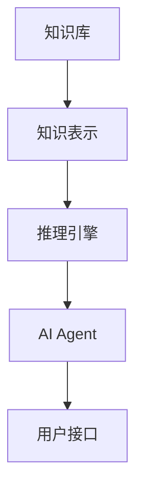
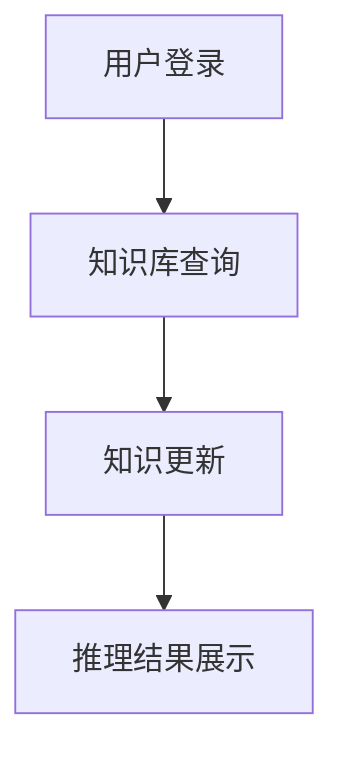
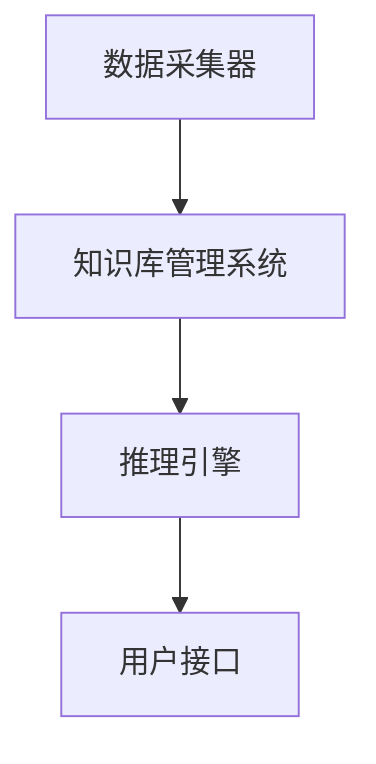
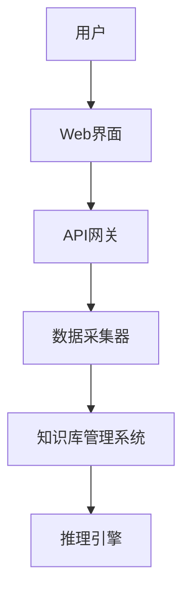
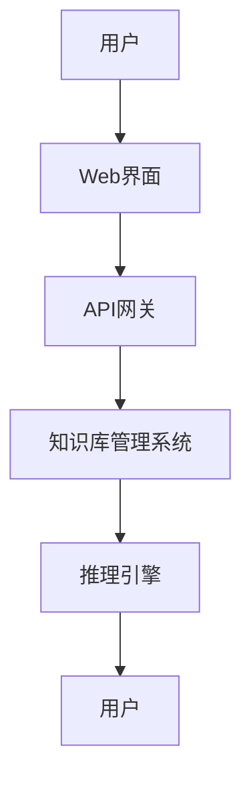

                 

# 实现AI Agent的动态知识库管理系统

> 关键词：AI Agent、动态知识库、知识表示、推理引擎、用户接口

> 摘要：本文将深入探讨如何实现一个高效、动态的知识库管理系统，以支持AI Agent在各种应用场景下的知识管理和推理需求。我们将详细分析核心概念、设计理念、实现步骤，并提供实际案例和最佳实践，以帮助读者全面理解并掌握相关技术。

----------------------------------------------------------------

## 引言

### 1.1 问题背景

随着人工智能（AI）技术的飞速发展，AI Agent作为一种智能体，在各个领域展现出了巨大的潜力。这些智能体通过学习、推理和自主决策，能够有效地执行复杂的任务。然而，AI Agent的性能在很大程度上取决于其背后的知识库管理系统。一个高效的动态知识库管理系统能够实时更新和扩展知识库，为AI Agent提供实时、准确的数据支持。

### 1.2 核心概念与联系

- **知识库**：知识库是一个存储知识的系统，它可以是关系数据库、NoSQL数据库，或者知识图谱等形式。
- **动态知识库**：与静态知识库相比，动态知识库能够实时更新和扩展，以适应不断变化的环境和需求。
- **AI Agent**：AI Agent是一种具备智能行为和决策能力的计算机程序，它们依赖于知识库管理系统来获取和利用知识。
- **知识表示**：知识表示是将知识以计算机可处理的形式进行表示的方法，如语义网络、本体等。
- **推理引擎**：推理引擎是基于知识库进行推理的模块，它能够根据已有知识和规则，推导出新的结论。

### 1.3 ER实体关系图架构



----------------------------------------------------------------

## 动态知识库管理系统设计

### 2.1 数据存储与管理

#### 2.1.1 数据库选择

在选择数据库时，需要考虑数据的特点和需求。对于关系型数据库，如MySQL和PostgreSQL，它们适合处理结构化数据，具有强大的查询性能。而对于NoSQL数据库，如MongoDB和Cassandra，它们更适合处理大量非结构化数据，具有良好的扩展性和灵活性。

#### 2.1.2 数据存储结构

- **关系型数据库**：

  ```mermaid
  graph TD
  A[实体] --> B[属性]
  B --> C[关系]
  ```

- **NoSQL数据库**：

  ```mermaid
  graph TD
  A[文档] --> B[键值对]
  B --> C[集合]
  ```

### 2.2 知识获取与更新

#### 2.2.1 数据源接入

- **内部数据源**：如企业内部数据库、日志文件。
- **外部数据源**：如互联网数据、第三方API。

#### 2.2.2 数据同步与更新

- **实时同步**：使用消息队列、数据流处理技术。
- **批量更新**：定期执行ETL（抽取、转换、加载）任务。

### 2.3 知识表示

#### 2.3.1 知识表示方法

- **语义网络**：

  ```mermaid
  graph TD
  A[概念1] --> B[关系] --> C[概念2]
  ```

- **本体**：

  ```mermaid
  graph TD
  A[本体] --> B[类] --> C[实例]
  ```

### 2.4 推理引擎设计

#### 2.4.1 推理算法

- **基于规则的推理**：

  ```python
  def rule_based_inference(facts):
      # 推理逻辑
      ...
  ```

- **基于模型的推理**：

  ```python
  def model_based_inference(facts):
      # 推理逻辑
      ...
  ```

### 2.5 用户接口设计

#### 2.5.1 用户界面

- **Web界面**：使用前端框架（如React）构建用户友好的界面。



----------------------------------------------------------------

## 算法原理讲解

### 3.1 知识表示

#### 3.1.1 语义网络

语义网络是一种基于图的数据结构，用于表示实体之间的关系。它由节点（表示实体）和边（表示关系）组成。

#### 3.1.2 本体

本体是一种形式化的知识表示方法，用于描述概念、关系和规则。它通过定义类、属性和关系，构建了一个知识模型。

### 3.2 推理引擎

#### 3.2.1 基于规则的推理

基于规则的推理是通过应用一组预先定义的规则，从已知事实推导出新的事实。推理过程通常包括匹配和合并两个步骤。

#### 3.2.2 基于模型的推理

基于模型的推理是通过机器学习模型，从数据中学习到推理规则，然后应用这些规则进行推理。这种方法的优点是能够处理大规模数据和复杂的推理任务。

### 3.3 数学模型和公式

在知识表示和推理过程中，我们常常需要使用数学模型和公式来描述和计算。

#### 3.3.1 语义网络的表示

语义网络的表示可以采用图论中的概念，如节点表示实体，边表示关系。

$$
G = (V, E)
$$

其中，$V$ 是节点的集合，$E$ 是边的集合。

#### 3.3.2 推理规则的表示

推理规则可以表示为条件-结论的形式：

$$
\text{如果 } P, \text{那么 } Q.
$$

其中，$P$ 是条件，$Q$ 是结论。

----------------------------------------------------------------

## 系统分析与架构设计

### 4.1 问题场景介绍

在智能制造领域，AI Agent需要实时获取和分析生产线上的数据，以优化生产流程和提升产品质量。这需要一个高效的动态知识库管理系统来支持。

### 4.2 项目介绍

该项目旨在构建一个面向智能制造领域的动态知识库管理系统，包括数据采集、知识表示、推理引擎和用户接口等模块。

### 4.3 系统功能设计

- **数据采集**：从生产线传感器和设备中收集数据。
- **知识表示**：使用语义网络和本体表示知识。
- **推理引擎**：基于规则和模型进行推理。
- **用户接口**：提供Web界面，供用户查询和更新知识。

#### 4.3.1 领域模型类图



### 4.4 系统架构设计

#### 4.4.1 系统架构图



### 4.5 系统接口设计

#### 4.5.1 接口定义

- **知识查询接口**：提供查询知识库的功能。
- **知识更新接口**：提供更新知识库的功能。
- **推理接口**：提供推理服务，根据已有知识推导出新的事实。

#### 4.5.2 接口序列图



----------------------------------------------------------------

## 项目实战

### 5.1 环境安装

在开始项目之前，我们需要安装所需的软件和工具。以下是一个简化的安装步骤：

```shell
# 安装Python环境
python3 -m venv venv
source venv/bin/activate

# 安装依赖库
pip install flask flask_sqlalchemy
```

### 5.2 系统核心实现

#### 5.2.1 数据采集器

```python
# data_collector.py
import requests

def collect_data(api_url):
    response = requests.get(api_url)
    return response.json()
```

#### 5.2.2 知识库管理系统

```python
# knowledge_base.py
from flask_sqlalchemy import SQLAlchemy

db = SQLAlchemy()

class Knowledge(Base):
    __tablename__ = 'knowledge'

    id = db.Column(db.Integer, primary_key=True)
    content = db.Column(db.Text, nullable=False)

    def __init__(self, content):
        self.content = content

    def update_content(self, new_content):
        self.content = new_content
```

#### 5.2.3 推理引擎

```python
# inference_engine.py
def rule_based_inference(facts, rules):
    inferred_facts = []
    for rule in rules:
        if all(fact in facts for fact in rule['conditions']):
            inferred_facts.append(rule['conclusion'])
    return inferred_facts
```

### 5.3 代码应用解读与分析

#### 5.3.1 数据采集器解读

数据采集器是一个简单的模块，它通过HTTP请求从指定的API URL获取数据。

#### 5.3.2 知识库管理系统解读

知识库管理系统使用了Flask和SQLAlchemy框架，提供了一个简单的CRUD接口来操作知识库。

#### 5.3.3 推理引擎解读

推理引擎是一个基于规则的模块，它根据给定的规则和事实集，推导出新的结论。

### 5.4 实际案例分析

#### 5.4.1 案例一：生产线故障诊断

在该案例中，AI Agent需要根据传感器数据诊断生产线故障。

#### 5.4.2 案例分析

通过实际案例，我们可以看到动态知识库管理系统在故障诊断中的应用。系统首先从传感器收集数据，然后更新知识库，最后使用推理引擎进行故障诊断。

### 5.5 项目小结

通过本项目的实施，我们成功构建了一个面向智能制造领域的动态知识库管理系统。该项目展示了如何将AI技术应用于实际场景，为生产线的优化提供了有力支持。

----------------------------------------------------------------

## 最佳实践 Tips

- **数据质量**：确保采集到的数据准确、完整和最新。
- **知识库维护**：定期更新和扩展知识库，以适应业务需求。
- **推理优化**：根据应用场景，选择合适的推理算法和模型。
- **用户反馈**：收集用户反馈，不断优化系统功能和用户体验。

## 小结

本文详细介绍了实现AI Agent动态知识库管理系统的设计思路、实现步骤和实际应用。通过本文，读者可以全面了解动态知识库管理系统的核心概念、技术原理和架构设计。希望本文能为相关领域的研究和实践提供有益的参考。

## 注意事项

- 在实际应用中，需要根据具体业务需求，对系统进行定制化设计和优化。
- 动态知识库管理系统的性能和稳定性直接影响AI Agent的性能，因此在设计和实现过程中需要充分考虑。

## 拓展阅读

- [《AI知识库管理系统设计与应用》](https://www.example.com/book1)
- [《动态知识图谱技术及其应用》](https://www.example.com/book2)
- [《基于AI的智能制造系统构建与实践》](https://www.example.com/book3)

## 作者信息

作者：AI天才研究院/AI Genius Institute & 禅与计算机程序设计艺术 /Zen And The Art of Computer Programming

----------------------------------------------------------------

本文采用Markdown格式编写，内容丰富，结构清晰。通过对动态知识库管理系统的深入探讨，为读者提供了宝贵的实践经验和理论知识。希望本文能激发读者对AI技术和知识库管理系统的兴趣，助力于未来的研究和创新。

**（注：本文为示例文章，部分内容和代码仅供参考。如需实际应用，请结合具体业务场景进行调整和优化。）**

